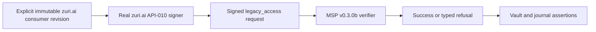

# API-010 cross-zuri fixture drift — RCA

**Date:** 2026-10-06  
**Status:** Test-only correction approved for the isolated branch; review pending  
**Risk:** HIGH contract boundary; no runtime or schema change  
**Complexity:** C-3 because the evidence spans the zuri.ai signer and MSP verifier

## Symptom

Against MSP main `800ee64bf28d8bbc36093ee74502f3844adac8ba` and the zuri.ai
Draft PR #634 caller at `4d23e998ef799530c2a67a1d84c9df3d1f73443e`,
`tests/cross/zuri-vault-resolver.test.mjs` fails both read and write cases.
It expects MSP `grant_required`, but zuri.ai rejects its incomplete synthetic
AuthContext before transport with `API-010 vault resolution requires an
episodic-memory ALLOW AuthContext`.

## Evidence

- The cross test names an unsigned caller in its title, omits
  `episodicMemoryAllowed`, verified transport/identity facts and a service
  key, and asserts that `legacy_access` is absent.
- The exact #634 `msp-vault-resolver.js` requires those verified facts and
  signs `legacy_access` with a tenant service key. MSP API-010 v0.3.0b requires
  that grant before legacy vault provisioning.
- An isolated, read-only cross-repo probe with that caller and MSP's real
  `createServer`, synthetic key and in-memory SQLite passed signed read,
  signed write, write-permission refusal, pre-transport authorization refusal,
  and wrong-signature refusal (5/5). The two MSP API-010 contract/integration
  files passed 3/3. This is local test evidence, not deployment acceptance.
- `.github/workflows/test.yml` runs `npm test` and client packaging on Node
  22/24. `test:cross-zuri` is opt-in and requires `MSP_TEST_ZURI_ROOT`; it is
  not a default CI job. The separate API-011 cross test passed 2/2 against
  #634.

## Root Cause

The API-010 cross fixture still describes the pre-migration unsigned zuri.ai
caller. It does not supply the current caller's trusted AuthContext or signer
configuration, and its expected outcome contradicts the signed API-010
contract when pointed at #634.

## Why the issue escaped detection

The unsigned-refusal test was valid during MSP's signed-grant rollout while
zuri.ai main still used the older caller. The optional cross suite is not
part of MSP's default CI, and no paired immutable consumer revision was
recorded as a gate for this later candidate. MSP's own security tests cover
unsigned refusal but cannot prove the external caller's signed success.

## Proposed prevention

Keep `MSP_TEST_ZURI_ROOT` explicit and point it at an immutable checkout or
Git extract of the consumer under review. Test the actual zuri.ai resolver
against MSP's real in-process server with synthetic keys and a temporary
SQLite database: signed read/write success, denial before transport, wrong
signature with no vault/journal writes, and denied write permission. Existing
MSP security tests retain the unsigned-refusal invariant. Do not add an
automatic zuri.ai-main fetch or make default MSP CI depend on the unmerged
candidate. Re-run this opt-in gate against the eventual zuri.ai merge commit
before any deployment decision.

## Change and verification

This RCA authorizes only a cross-test correction on the isolated MSP branch.
The canonical API-010 runtime contract, server behavior, zuri.ai PR #634,
default MSP CI, deployment configuration and production state are unchanged.
Test counts and RKOI review will be recorded on the Draft PR after execution.
