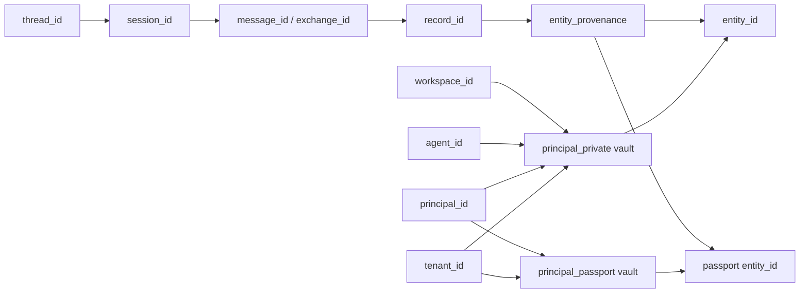

# Standalone MSP architecture

## Boundary

The approved Phase 6 surface adds `msp_memory_consolidate`,
`msp_memory_passport_promote` and `msp_memory_context_digest`. Pure contract
modules verify signed grants and schemas; transport supplies verified claims
to the core consolidation store. Core owns immediate entity/provenance/nonce
transactions and the source eligibility checks. The thread store owns the
bounded `erase_vault` transaction; migration 0015 supplies immutable provenance,
history redaction and the forgotten-entity FTS guard. The client remains a
generic stdio boundary and cannot authorize a request itself.

Principal-private ownership is tenant/person/agent/workspace; passport target
ownership is tenant/person plus `allowPassport: true`. Scoped context receipt
reads verify tenant/person grants, while legacy unscoped context rows retain
their historical contract. Digest reads never include GROUP/ROOM sources and
return reference-only provenance receipts. Fresh grants do not make revoked
or erased source content eligible again.

MSP is a standalone memory and context authority for opaque external consumers and the optional GKS knowledge provider. No consumer repository is a build-time or schema dependency. For the isolated GenesisRAG17 pipeline it is the Tier 2 authenticated relay between Tier 1 zuri-ai, Tier 3 GKS and the Tier 4 worker. The extracted repository preserves the process boundary. The external MSP client remains stdio; the MSP-owned GKS provider now has an explicit stdio or private HTTP transport selection:

```text
consumer -> msp-client-js -> NDJSON JSON-RPC over stdio -> msp-server
                                                     -> msp-storage (SQLite)
                                                     -> optional GKS provider (stdio child or HTTP JSON-RPC)
```

Clients initialize using protocol version `2024-11-05`, send `notifications/initialized`, then call static tool contracts through `tools/call`. The server intentionally has no `tools/list` method.

## GenesisRAG17 relay composition

The nine `msp_pipeline_*` tools are registered by `apps/msp-server/src/server.mjs`.
`pipeline-handlers.mjs` authenticates the runtime grant, checks the exact
six-field private scope and nested envelopes, strips caller-selected authority,
and validates the downstream response. Eight operations use the selected GKS
provider as `gks_pipeline_*`; stdio remains the default and HTTP is explicit
through `MSP_GKS_TRANSPORT=http`. `msp_pipeline_query` uses the explicit Tier
4 loopback `POST /query` and never calls GKS.

```text
zuri-ai source (source grant)
  └─ submit / evidence / query ──► MSP ──► GKS or Tier 4 query worker
GenesisBlock worker (worker grant)
  └─ claim / graph_receipt / write_receipt / gate /
     publication_receipt / stage_failure / query ──► MSP
```

MSP owns no stage, source or decision payload, cursor, worker result, gate
verdict, physical index, graph object or publication pointer. It journals only
principal identities and counts. Source and worker grants cannot be used for
each other's write paths. Runtime `actor`, caller credentials and a supplied
`authenticatedPrincipal` never become authority; `MSP_PIPELINE_PRINCIPALS`
and `MSP_GKS_PIPELINE_CREDENTIAL` are the authority inputs.

The exact contract and extension rules are in
[`GENESISRAG17-RELAY.md`](GENESISRAG17-RELAY.md) and
[`ADR-MSP-GENESISRAG17-RELAY.md`](ADR-MSP-GENESISRAG17-RELAY.md). The
machine-readable surface is
[`packages/msp-contracts/schemas/GENESISRAG17.tools.json`](../packages/msp-contracts/schemas/GENESISRAG17.tools.json).

## Package dependency direction

```text
msp-core          (domain only)
  ^
  +-- msp-contracts
  +-- msp-retrieval

msp-storage       (better-sqlite3 + migration runner)

msp-server        -> msp-core
                  -> msp-contracts
                  -> msp-retrieval
                  -> msp-storage

msp-client-js     (Node built-ins + local authority enforcement only)
```

`msp-server` is the composition root and the only package allowed to assemble all runtime layers. `msp-core`, `msp-contracts`, and `msp-retrieval` never open the database themselves. `msp-storage` owns the SQLite driver and ordered migration execution.

## Migration ownership

The repository-root `migrations/` directory is canonical. `msp-storage` owns the runner; `msp-server` resolves the canonical directory and supplies it to the runner. Tests may supply a temporary migration directory explicitly. Migration filenames, ordering, checksums, and SQL content are canonical in this repository. Historical lineage is retained in migration and review records where applicable. Every pending migration -- with or without a directive -- is run through a structural foreign-key check before it is allowed to commit; it is not directive-gated, because header scanning alone cannot catch every way a migration might dodge the directive (RKOI follow-up warning 2). The runner also supports one explicit opt-in mode, `-- msp-migration: foreign-keys=off` (WP-E0), which relaxes row-level foreign-key enforcement for a rebuild of a table other tables reference by foreign key, once the database can already hold rows the rebuild would otherwise orphan (see `docs/MIGRATION.md`).

## Security invariants

- Every entity and promotion is vault-scoped.
- Cross-vault read, mutation, link creation, decay, and promotion are denied.
- Unknown vaults remain distinguishable from inaccessible vaults.
- Candidate input cannot assign a `gks:` canonical identity.
- Missing GKS configuration never fabricates canonical success.
- The server never chooses an implicit database path.
- GenesisRAG17 requests require `schemaVersion: "genesisrag17.v1"`, exact six-field scope and an explicit source or worker runtime grant.
- The publishable client (`packages/msp-client-js`) spawns the MSP server with an allowlisted environment too — MSP runtime names, GKS's `GKS_*` namespace and OS basics — so a host that starts MSP never hands it the production credentials MSP does not read.
- Every GKS child process (pipeline relay, promote, stage-evidence export) gets an environment built from an explicit allowlist — GKS's own `GKS_*` configuration plus OS basics — never a copy of MSP's own process environment, and both halves of that allowlist match a variable name case-insensitively (OS basics by whole name, GKS's configuration by `GKS_` prefix) so a caller's casing cannot silently drop a name, which MSP's caller may hand it in full. The Tier 4 worker token is used only for the explicit loopback query and, like every other MSP-internal credential, is never forwarded to a GKS child.
- A malformed, foreign-scope, redirected or unconfigured pipeline hop fails closed; MSP never turns it into an empty success.

## Canonical data model and ID binding

The persistence model keeps episodic thread memory and durable vault memory
separate, with one explicit provenance bridge:

```text
tenant_id (logical partition)
  ├─ vaults -> entities -> entity_history / links / promotions
  └─ threads -> chat_sessions -> thread_messages
                 └─ protected_memory_records / session_summaries
                              └─ entity_provenance -> target vault/entity
```

`tenant_id` is a logical partition key; it is not a foreign key to a tenant
table. Vault ownership is defined by the tuple required by `vault_type`:

- `shared`: `project_id`
- `workspace_private`: `workspace_id`
- `global_private`: `agent_id`
- `principal_private`: `tenant_id`, `principal_id`, `agent_id`, `workspace_id`
- `principal_passport`: `tenant_id`, `principal_id` (agent and workspace are null)

Legacy shared/workspace/global vault IDs are stable hashes of their owner
tuple. Principal vault IDs are opaque random IDs and are never derived from
the owner tuple. Durable entity IDs are deterministic within a vault from
`vault_id`, `category`, and `key`; thread, session, message, exchange, record,
summary, and provenance IDs are opaque IDs. Each ID stays in its own namespace.

The only bridge from episodic records to durable memory is
`entity_provenance`. Its source thread/session/message/record references are
validated by the application in the same tenant; its target vault/entity
references are actual storage foreign keys. There is deliberately no direct
`vault_id` ownership column on a thread or session. Retrieval uses the caller's
resolved vault scope and returns existing entity IDs; RRF fusion creates no
identity and cannot widen the scope.



## Multi-user, multi-agent memory surface (API-011 and Phase 6)

MSP's thread/session/protected-memory surface for many concurrent users and
agents is implemented by migrations `0008` through `0014`, with Phase 6
consolidation, passport promotion, provenance and erasure in `0015`. The
wire-level contracts are API-010/API-011 and the Phase 6 contract; contract,
integration and security suites exercise the tenant, principal, agent,
workspace and thread boundaries. The client and consuming applications remain
opaque external processes and do not become schema dependencies.

The design document remains useful as rationale and gap history; it is not a
claim that the current repository must import another consumer's schema.

## Change risk

Risk is HIGH because the change crosses package boundaries and migration ownership moves. Mitigation is schema/contract comparison, standalone package tests, external-process proof, security isolation tests, and a final client-contract and cross-process compatibility gate.

## CHANGELOG

| Version | Date | Status | Summary | Commit Hash | Agent |
|---|---|---|---|---|---|
| 0.3.0b | 2026-09-22 | beta | Make the MSP standalone boundary explicit, document canonical data model and ID binding, and reconcile API-011/Phase 6 implementation status with current migrations and tests. | working-tree | RWANG |
| 0.2.8b | 2026-09-17 | beta | Describe approved Phase 6 layering, principal/passport boundaries and atomic erasure. | working-tree | RWANG |
| 0.2.7b | 2026-09-14 | beta | Linked the proposed multi-user/multi-agent memory surface (API-011): `ADR-MSP-MEMORY-OS-MULTI-USER-MULTI-AGENT.md` and the `DESIGN-SESSION-EPISODIC-INSTANCE-MEMORY.md` v0.3.0b rewrite. No code change. | working-tree | ATHER |
| 0.2.6b | 2026-09-14 | beta | Migration ownership paragraph corrected: the structural foreign-key check is not directive-gated -- it now runs for every pending migration, plain or directive (RKOI follow-up warning 2); `-- msp-migration: foreign-keys=off` (WP-E0) relaxes row-level enforcement only. | working-tree | JANUS |
| 0.2.5b | 2026-09-13 | beta | Migration ownership paragraph now names the runner's `-- msp-migration: foreign-keys=off` mode (WP-E0), for rebuilding a table other tables reference by foreign key once the database can hold rows the rebuild would orphan. | working-tree | JANUS |
| 0.2.3b | 2026-09-13 | beta | `createMspStdioCaller` now builds the MSP child environment from an explicit allowlist (MSP runtime names + `GKS_*` + OS basics) instead of defaulting to a full copy of the caller's `process.env`. Breaking for `@freshair129/msp-client-js` consumers that relied on unrelated variables reaching the MSP child — including `NODE_OPTIONS`, which is withheld deliberately because it can load code into the child, so an operator passing `--max-old-space-size` that way must now set it another way; client version 0.1.0 -> 0.2.0. | fix/client-transport-env-allowlist | KIN |
| 0.2.2b | 2026-09-13 | beta | The GKS child-environment allowlist now matches names case-insensitively on both halves of its rule: previously OS basics were matched case-insensitively but the `GKS_` namespace was matched case-sensitively, so a lower-case `gks_db_path` was dropped on a platform whose environment names are case-insensitive. Fail-closed, never a leak. Test-only: every allowlisted OS-basic name is now proven individually against the exported allowlist. | fix/gks-prefix-case-and-test-coverage | KIN |
| 0.2.1b | 2026-09-11 | beta | Every GKS child spawn (pipeline relay, promote, stage-evidence export) now builds its environment from an explicit `GKS_*` + OS-basics allowlist instead of forwarding MSP's own process environment; previously only the pipeline relay path stripped a fixed credential blocklist, and `promote`/`exportStageEvidence` forwarded MSP's full environment unchanged. | working-tree | KIN |
| 0.2.0b | 2026-09-08 | beta | Documented the GenesisRAG17 Tier 2 relay composition, exact grant boundary, Tier 4 query route and fail-closed invariants. | working-tree | ATHER |
| 0.1.1b | 2026-08-12 | beta | Finalized implementation commit metadata. | 394a176 | ATHER |
| 0.1.0b | 2026-08-12 | beta | Initial extraction architecture and dependency rules. | 394a176 | ATHER |
| 0.2.4b | 2026-09-13 | beta | Release hygiene for the publishable client after two behaviour changes: `NODE_EXTRA_CA_CERTS` is forwarded to the MSP child (its absence degraded vector search to FTS-only silently behind a private CA), the package ships a README and CHANGELOG so a consumer upgrading past 0.2.0 sees the allowlist change, the client Node floor matches the server at 22, and the local runbook says its `env: process.env` is filtered. | docs/client-release-notes-and-ca-certs | KIN |
