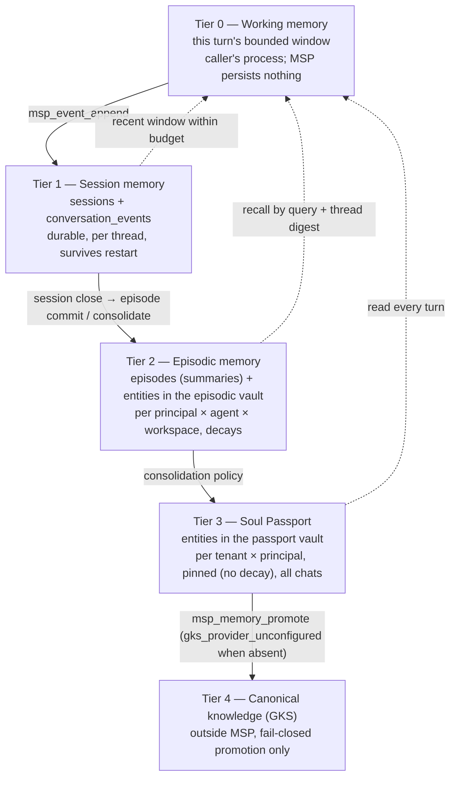
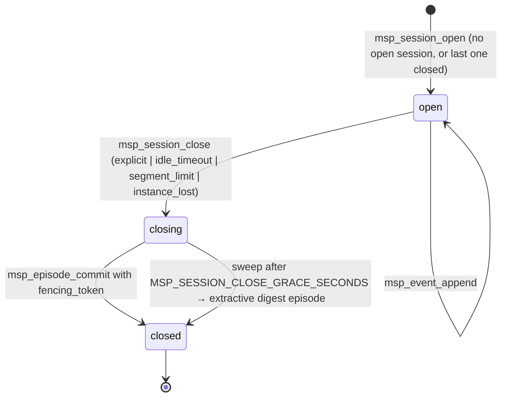

# DESIGN — Session, episodic and instance memory for multi-chat continuity

## สรุปภาษาไทย

เอกสารนี้ออกแบบให้ MSP ทำหน้าที่ Tier 2 ตามที่ zuri-ai กำหนดไว้แล้ว (ADR-043,
ADR-044, PHASE-04) แต่ยังไม่มีโค้ดใน repo นี้: การจัดการ **thread**
(ห้องสนทนาข้ามช่องทาง), **instance** (ตัวไคลเอนต์/โปรเซสที่กำลังเปิดแชทอยู่),
**session** (ช่วงการสนทนาต่อเนื่องหนึ่งช่วง), **conversation event** (แต่ละเทิร์น),
**episode** (สรุปของ session) และ **Soul Passport** (ความจำถาวรรายผู้ใช้
ข้ามทุกแชท ทุกอุปกรณ์ ทุก agent)

หลักการสำคัญ:

- **ผู้ใช้ (principal) เป็นเจ้าของความจำ ไม่ใช่แชท** — thread, session, instance เป็นแค่
  provenance ตาม ADR-022 ข้อ 6 จึงเปิดกี่แชทพร้อมกันก็ได้ ความจำถาวรอยู่ที่คน
- ความจำแบ่งเป็น 5 ชั้น: working (ในเทิร์น) → session → episodic → passport → GKS
  ชั้นที่สูงขึ้นถาวรขึ้นและถูกเขียนได้ยากขึ้น
- **ทุกการเขียนลง vault ของคน เกิดภายใต้ `access_context` ของคนนั้นเท่านั้น** —
  รวมถึง consolidation จาก episode และรวมถึงเก้า tool เดิมของ API-009 เมื่อชี้ไปที่
  vault ชนิดใหม่ — กติกา "vault isolation is the whole product" ไม่เปลี่ยน
- การเข้าถึง thread ต้องมี**ความสัมพันธ์ที่บันทึกไว้จริง**: คนต้องเป็น participant
  ปัจจุบัน หรือ agent ต้องมี instance ที่ยังมี lease แนบกับ thread นั้นอยู่ ไม่มี
  สิทธิ์โดยนัยระดับ tenant
- MSP ไม่เรียก LLM เอง (ไม่มี execution authority) — ฝั่ง Tier 1 สรุปแล้วส่งกลับมา
  MSP มี digest แบบ deterministic เป็น fallback ที่ไม่สร้างข้อเท็จจริงใด ๆ
- ลบข้อมูลตาม PDPA ด้วย tombstone ทุกตารางที่ถือเนื้อหาของคน (ตารางแจกแจงใน §11)
  และการลบต้องทำให้ retrieval ทุก path มองไม่เห็นทันที พิสูจน์ทั้งผ่าน tool และ
  query ตารางตรง ๆ

ฉบับ 0.2.1b ผ่านการรีวิวของ RKOI (APPROVED, CRITICAL 0) และฉบับ 0.2.2b
เก็บ WARNING 8 ข้อที่เป็นเงื่อนไขก่อน merge ของ WP-E2–E4 ดู §0
ส่วนที่เหลือของเอกสารเป็นภาษาอังกฤษตามแบบแผนของ repo

## 0. Review response

### 0.1 Round three (0.2.1b → 0.2.2b)

RKOI's third review (2026-09-14) **approved** v0.2.1b with zero criticals
and eight warnings that are merge conditions on WP-E2, WP-E3 and WP-E4.
This revision folds them in so no packet inherits an open item.

| # | Finding (0.2.1b) | Change in 0.2.2b | Where |
|---|---|---|---|
| R3-W1 | `instance_thread_attachments` PK `(instance_id, thread_id)` could not express re-attach after a crash or several openers, and was the one new ledger with no UPDATE trigger | Surrogate `attachment_id`; a partial unique index on `(instance_id, thread_id, opened_by_membership_id) WHERE detached_at IS NULL`; re-attach is an insert; leave detaches only that membership's rows and the leg survives while any open row remains; UPDATE trigger permits only `detached_at NULL → NOT NULL`; no DELETE | §6.1 rule 7, §12.2, §15, §17.4 |
| R3-W2 | `redaction_marked_at` was neither pinned nor conditioned | Pinned; may change only on the transition into `redacted_pending`, and must then be set | §12.4 |
| R3-W3 | No erasure path for an already-`archived` group episode (trigger would abort the erase) | Decided: an `archived` episode goes straight to `archived_redacted` with its summary tombstoned — it is already outside every read path, so there is nothing to re-summarize for; no new transition needed | §11.1 |
| R3-W4 | Vault erasure depends on statement atomicity of the CHECK exemption | Stated: `status → 'erased'` and `principal_id → NULL` are one `UPDATE` statement | §11.1 |
| R3-W5 | The `vaults.status` CHECK narrowing was unproven against unexpected rows | Populated-database test gains a row with an unexpected `status` and asserts 0008 fails loudly and rolls back | §12.0 |
| R3-W6 | Identity key: startup requirement or per-tool refusal; rotation unstated | Recommended default recorded (per-tool refusal + startup diagnostic + `msp_ping` report, with `MSP_REQUIRE_IDENTITY_KEY=1` opting a deployment into a fail-closed boot) and handed to the owner as §19 decision 8; rotation procedure stated (`MSP_IDENTITY_HMAC_KEY_PREVIOUS` dual-read window for bindings; journal pseudonyms are never rewritten) | §6.2, §16, §19 |
| R3-W7 | `entities_fts` not listed as its own erasure row | Row added; suite asserts the FTS table has no match for erased content | §11.1, §15 |
| R3-W8 | An empty `summary_text` was indistinguishable from a tombstoned one | `CHECK (length(summary_text) > 0 OR lifecycle_state = 'archived_redacted')` | §12.4 |

### 0.2 Round two (0.2.0b → 0.2.1b)

RKOI's second review (2026-09-13) confirmed all thirteen round-one criticals
and eleven warnings closed at the mechanism, and raised two new criticals
and twelve warnings introduced by the revision. Each is answered below.

| # | Finding (0.2.0b) | Change in 0.2.1b | Where |
|---|---|---|---|
| R2-C1 | §6.1 rule 6 granted an agent implicit participation in every thread of its tenant; `role` CHECK dropped `agent` | Rule 6 replaced by a **recorded relation**: an agent context reaches a thread only through a live instance bound to that context and currently attached to the thread (`instance_thread_attachments`, `detached_at IS NULL`, lease unexpired). Attachment is created only by `msp_session_open` under a current-participant principal's context; revoked by instance close and the stale sweep. §13's rule column is unified. Suite case: an agent context cannot window or turn-context an unrelated thread of its own tenant. `agent` is deliberately not a membership role. | §6.1, §7, §13, §15 |
| R2-C2 | Erasure did not enumerate tables holding `principal_id` or principal-derived content; `episode_consolidations.salient_json` survived | §11.1 enumerates every table and its disposition. `salient_json` tombstoned in the same transaction; `entities`/`entity_history` bodies tombstoned via a new `redaction_state` column and a permit-only-tombstone trigger; `embeddings` rows for tombstoned entities deleted (derived index, not a ledger); `vaults` rows set `erased` with `principal_id` cleared; `instances.principal_id` cleared; `vault_resolutions` dropped from the design (receipts go to the journal). Erasure suite queries tables directly after `close()`, not only the tools. | §11.1, §12.4, §15 |
| R2-W1 | Mount trigger was `BEFORE INSERT` only | `BEFORE UPDATE` trigger added | §12.1 |
| R2-W2 | `isVaultAccessibleTo` signature change unstated | New optional keys `tenantId`, `principalId`, `allowPassport`; legacy callers unaffected | §5 rule 5 |
| R2-W3 | 0008 carried WP-E3a's `contexts` columns two packets early | Moved to their own migration `0010_context_scope.sql` owned by WP-E3a; episodes migration renumbered to 0011 | §12.3, §18 |
| R2-W4 | Runner mode omitted `user_version` | Set inside the transaction before `COMMIT`, as today | §12.0 |
| R2-W5 | `migration_foreign_key_check_failed` vs `SchemaVersionError.code` | It is a message prefix on the existing `SchemaVersionError` (`code = db_unavailable`, unchanged); removed from the error-code table | §12.0, §14 |
| R2-W6 | Journal could not audit who was added as a participant | Journal payloads carry `principal_hmac` (HMAC-SHA256 of tenant \| principal under the identity key) wherever a principal must be auditable; raw ids never, because the journal is append-only and outside erasure | §13 |
| R2-W7 | `authorization.*` flags are unverified assertions with no stated trust boundary | Explicit trust-boundary paragraph: every flag is a Tier 1 assertion MSP does not verify; transport is stdio from that process; a network transport re-opens this design for review | §13.1 |
| R2-W8 | Export under `data_subject_admin` and the passport | Decided: export is a data-subject access right and always includes passport material; `allow_passport` gates turn-time use only | §11 |
| R2-W9 | `msp_instance_open` re-open had no binding rule | Re-open requires the same binding, else `instance_scope_denied`; suite case | §7, §13, §15 |
| R2-W10 | Extractive episode's "empty salient" had nowhere to live; §17.3 described a forbidden wire shape | Stated directly: an extractive episode stores no salient and writes no `episode_consolidations` row; §17.3 reworded | §9, §17.3 |
| R2-W11 | Inconsistent id/ref returns | One rule: every response returns both `*_ref` and `*_id` for each record it names; requests take `*_id` | §13 |
| R2-W12 | `thread_participants` had no `tenant_id` | Denormalised `tenant_id NOT NULL` with a consistency trigger and a tenant-first index | §12.2 |
| gap | §15 named no row for `entity_provenance` / `episode_consolidations`; populated-database test did not cover 0011 children | Rows added; test enumeration extended | §12.0, §15 |

### 0.3 Round one (0.1.0b → 0.2.0b)

| # | Finding (0.1.0b) | Change in 0.2.0b | Where |
|---|---|---|---|
| C1 | `DROP TABLE vaults` cannot run under the runner's transaction with `foreign_keys = ON` | 0008 declares `-- msp-migration: foreign-keys=off`; the runner gains that mode (pragma set outside the transaction, `PRAGMA foreign_key_check` must return zero rows before commit, fail closed otherwise). New packet WP-E0 (JANUS) ships the runner change with a populated-database migration test. | §12.0, §12.1, §18 |
| C2 | Partial unique indexes do not enforce idempotency with NULL owner columns | Table-level `CHECK` requires the owner columns of each principal vault type to be NOT NULL; provisioning is one `BEGIN IMMEDIATE` transaction; suite asserts a second resolve returns the same id | §5 rule 3, §12.1, §15 |
| C3 | `isVaultAccessibleTo`'s mount short-circuit outranks the owner tuple | Principal vault types are **never mountable**: `mountVault` refuses at the writer, `vault_mounts` triggers refuse at the schema, and the two new branches run before the mount short-circuit | §5 rule 5, §12.1, §15 |
| C4 | Passport reachable through `msp_memory_history`/`forget` (entity_id only) with `requires_access_context = 0` | `requires_access_context` column dropped; the rule is by `vault_type` and constant: every path to a principal vault, including all nine `msp_memory_*` tools, requires a matching `access_context`. The API-009 amendment is inside WP-E1. | §5.1, §13, §18 |
| C5 | Participants and event authorship are caller-asserted with no constraint or suite | Explicit trust rule: participation is a server-derived fact from Tier 1, accepted only under `authorization.assert_participants`, tenant-bound, journaled; an event's author must be a current participant; new suite | §6.1, §7, §13, §15 |
| C6 | `left_at` not load-bearing | Participation predicate is `left_at IS NULL` everywhere; departed and erased principals lose the thread entirely; membership rows are append-only (rejoin = new row) | §6.1, §11, §12.2 |
| C7 | Consolidation writes into other principals' vaults, bypassing the owner check | Consolidation runs **only under the access context of the principal whose vaults it writes**; a fact never names another principal; group threads consolidate once per participant via `msp_episode_consolidate` under that participant's own context; suite proves a caller cannot steer a fact into a vault it could not write directly | §9, §13, §15 |
| C8 | Cross-thread digest carries group summaries into private threads | Slice 5 is restricted to the principal's own `direct` threads; a group episode never leaves its thread; new suite | §10, §15 |
| C9 | Principal-addressed tools have no caller binding | `msp_episode_list` lists only the caller's own episodes; `msp_principal_export` and `msp_principal_erase` bind `principal_id` to the access context or to a named data-subject flag; new suite | §11, §13, §15 |
| C10 | `contexts` row exposes the packet through the context tools' recorded ownership gap | `refs_json` stores references only, never content; the context-tool ownership gap is closed as prerequisite packet WP-E3a; MSP writes nothing to `state` (session scratchpad withdrawn) | §4, §8, §10, §12.3, §18 |
| C11 | Redaction trigger pins four columns only | Trigger pins every column except `redaction_state` and `content_json`; append-only case in the WP-E2 suite | §12.2, §15 |
| C12 | Stub-entity provenance changes API-009 read behaviour | Stub withdrawn; first-class `entity_provenance` table | §9, §12.4 |
| C13 | Thread-scope guard would need DB access inside `msp-contracts` | Guard takes a precomputed boolean exactly like `assertVaultScope`; decoupling assertion added to the dependency test | §16 |
| W1–W11 | retrieval injection; journal actor/workspace; ref convention; `pinned` as API-009 amendment; `allow_passport` flag; extractive `salient`; contract suites and API-011 artefacts; `redacted_pending` terminal state; sweep/instance binding; Gate A rows and env allowlist; `thread_bindings` PK and rejoin | all closed (confirmed in round two) | §5, §9, §11, §12, §13, §16, §18 |

## 1. Why this document exists

zuri-ai has already decided what it expects from MSP as Tier 2, and none of it
is implemented here yet:

| Upstream decision | What it asks of MSP | State in this repo today |
|---|---|---|
| ADR-043 D2 | "sole gateway for agent session control, episodic conversation state, and vault permission validation" | Vault registry and API-009 entities exist; no session, thread or episodic model |
| ADR-044 D1/D2 | Unified thread id authority (`th_usr_…` / `th_grp_…`), session lifecycle, channel isolation | Nothing — no `threads` table, no minting |
| ADR-022 D4–D7 | API-010 `msp_vault_resolve`; private memory owned by Tenant × Principal × Agent × Workspace; thread/session/instance are provenance only | `msp_vault_resolve` does not exist; vaults are keyed by project / workspace / agent only, with no tenant or principal columns |
| PHASE-04 | `ChannelThread`, `ThreadParticipant`, `ConversationEvent`, `Session`, `Episode`, summaries, retention/tombstone, export/erase, persistence port | Nothing; zuri-ai's gap analysis records this as "new build in MSP, pattern only (journal, bitemporal) to follow" |

The user-facing requirement is one sentence: **many chats at once, and the
user is remembered continuously and permanently across all of them.** This
document turns that sentence into a data model, a tool surface, concurrency
rules, security invariants and a delivery order that fit the runtime that
already exists.

The word *instance* is used in ADR-022's sense: one live client or runtime
process holding a chat open. "Instant"/working memory, the other reading of
the word, is covered as the innermost tier in §4.

## 2. Terms

Id and ref convention (the existing one, `packages/msp-core/src/domain/vault-registry.mjs`
`rowToVault`): every record has a bare `*_id` column; the wire projection
carries a minted `*_ref` from `mintRef`, always `msp:`-prefixed. **Every
response returns both `*_ref` and `*_id` for each record it names; every
request takes `*_id`.** A thread's id is `th_usr_<uuid>`; its ref is
`msp:thread/th_usr_<uuid>`.

| Term | Meaning | Id (column) | Ref (wire) | Who mints |
|---|---|---|---|---|
| **Principal** | The canonical human (zuri-ai `Person.id`, ADR-045). The owner of permanent memory. | opaque, supplied | — | zuri-ai identity; MSP never derives it |
| **Tenant / business / workspace / agent** | Server-owned scope from AuthContext (ADR-022 D2) | opaque, supplied | — | zuri-ai |
| **Thread** | One conversation container across channels: direct (`th_usr_`) or group (`th_grp_`) (ADR-044 D2) | `th_usr_<uuid>` / `th_grp_<uuid>` | `msp:thread/<thread_id>` | **MSP** (thread-id authority) |
| **Instance** | One live client or runtime process attached to threads: a browser tab, a LINE webhook worker, a CLI session. Holds a lease, sends heartbeats. Provenance only. | `<uuid>` | `msp:instance/<uuid>` | MSP |
| **Session** | One bounded stretch of activity on a thread. Exactly one open session per thread. | `<uuid>` | `msp:session/<uuid>` | MSP |
| **Conversation event** | One append-only turn record, ordered by an MSP-assigned `thread_seq`. | `<uuid>` | `msp:event/<uuid>` | MSP |
| **Episode** | The compacted record of a closed session or segment: bounded summary, participants, event range, summarizer provenance. | `<uuid>` | `msp:episode/<uuid>` | MSP |
| **Episodic vault** | The principal's private memory with one agent in one workspace (ADR-022 D6 owner tuple). | `vault_id` (random) | `msp:vault/<vault_id>` | MSP, via `msp_vault_resolve` |
| **Soul Passport vault** | The principal's permanent memory across every agent, workspace, thread and instance in a tenant. | `vault_id` (random) | `msp:vault/<vault_id>` | MSP, via `msp_vault_resolve` |
| **Access context** | The server-resolved AuthContext + authorization facts zuri-ai passes on every call (ADR-022 per-turn contract). | object | — | zuri-ai |

## 3. What exists today and what is missing

Reused unchanged:

- `vaults` / `vault_mounts` and `VaultRegistry` (lazy, idempotent provisioning; `isVaultAccessibleTo`).
- API-009 entities: bitemporal `entities` + append-only `entity_history`, soft `forget`, `links`, FTS5 + vector + RRF search, Ebbinghaus decay with a caller-triggered tick.
- `contexts` rows + `msp_context_diff/audit/replay` (receipts, hash validity) — with the ownership gap `docs/NOTES.md` records closed in WP-E3a (§10).
- Append-only `journal` with `RAISE(ABORT)` triggers.
- The fail-closed GKS bridge (`msp_memory_promote`, `msp_knowledge_promote`).

Missing, and designed below:

- Tenant- and principal-scoped vault types, and `msp_vault_resolve`.
- Caller identity on the nine `msp_memory_*` tools (the second gap `docs/NOTES.md` records), mandatory for the new vault types.
- Threads, participants, thread bindings, instances, sessions, events, episodes, entity provenance.
- Consolidation from episodes into the episodic vault and the passport, under the owner's own access context.
- Per-turn bounded context assembly with a reference-only receipt.
- Retention, erasure (with content tombstones on every ledger that holds a person's material), export.
- A migration-runner mode for parent-table rebuilds, and a persistence port so a Postgres adapter can follow (PHASE-04) without building it now.

## 4. Five memory tiers



| Tier | Owner key | Lifetime | Store | Decay | Read by |
|---|---|---|---|---|---|
| 0 Working | instance | one turn | the caller's process only. The session scratchpad KV proposed in 0.1.0b is withdrawn: `state` has no tenant, vault or workspace column (`migrations/0002_phase2.sql`), so MSP persists nothing for this tier. | — | the calling instance |
| 1 Session | thread | open → closed, then retained per policy | `sessions`, `conversation_events` | retention tick tombstones content | current participants of the thread, and the agent through an attached live instance (§6.1) |
| 2 Episodic | tenant × principal × agent × workspace | months | `episodes` + API-009 entities in the episodic vault | Ebbinghaus (existing `runDecayTick`) | this principal's turns with this agent in this workspace |
| 3 Passport | tenant × principal | until erasure | API-009 entities in the passport vault | **pinned** (`decay_policy = 'pinned'`) | every turn of this principal in the tenant, any agent, any thread, any instance, when `authorization.allow_passport` |
| 4 Canonical | portfolio/tenant (GKS) | permanent | GKS | n/a | governed retrieval |

Continuity across many chats comes from tiers 2 and 3, which are keyed by the
principal, not the chat. Separation between chats comes from tiers 0 and 1,
which are keyed by the thread. Multi-device comes from instances being
provenance, never owners.

## 5. Ownership model — vaults

Two vault types are added. Existing types are unchanged.

| `vault_type` | Owner columns | Role |
|---|---|---|
| `shared` (existing) | `project_id` | identity only; never a write target |
| `workspace_private` (existing) | `workspace_id` | dev-agent workspace memory (GoVibe) |
| `global_private` (existing) | `agent_id` | the agent's own cross-project memory |
| **`principal_private`** (new) | `tenant_id`, `principal_id`, `agent_id`, `workspace_id` — all NOT NULL while active | the episodic vault: ADR-022 D6's owner tuple; API-010 returns it as `workspace_private_vault_id` for principal turns |
| **`principal_passport`** (new) | `tenant_id`, `principal_id` — NOT NULL while active; `agent_id`, `workspace_id` — NULL | the Soul Passport: permanent, cross-agent, cross-workspace |

Rules:

1. **Thread, session, instance and event ids are never vault owners and never
   authorization input** (ADR-022 D6, PHASE-04 amendment). No column on
   `vaults` references them; no scope check reads them.
2. **A group thread owns nothing.** Each participant's private context lives in
   that participant's own vaults. A thread-shared vault (ADR-022 D7) is out of
   scope for this design; when policy later grants one, it is a new
   `vault_type` with a new security suite, not a widening of `principal_private`.
3. **Principal vault ids are random (UUIDv7), not derived; idempotency is
   schema-enforced.** Existing types use `stableId(...)`, which anyone who
   knows the owner tuple can recompute. A principal vault id is a capability
   handed out only by `msp_vault_resolve` after the access context passes.
   Idempotency comes from two partial unique indexes **and** a table-level
   `CHECK` that makes the owner columns of each principal type NOT NULL while
   the vault is active (§12.1) — a partial unique index alone does not
   constrain NULLs, which SQLite treats as distinct. Provisioning is one
   `BEGIN IMMEDIATE` transaction (select, then insert), so a concurrent
   double-resolve yields one row; `principal-vault-scoping.security.mjs`
   asserts a second resolve returns the same `vault_id`. An erased vault
   (§11.1) has `status = 'erased'` and its `principal_id` cleared, so a
   returning person gets fresh vaults and the erased rows never collide.
4. **`decay_policy` is a vault column**: `'ebbinghaus'` (default, existing
   behaviour) or `'pinned'`. `runDecayTick` on a pinned vault evaluates
   nothing and says so: `msp_memory_decay_tick` answers
   `{ evaluated: 0, transitioned: [], dry_run, pinned: true }`. The new
   `pinned` field is an API-009 response-shape change and ships inside the
   API-009 0.2.0 amendment in WP-E1 with an `api-009-conformance.test.mjs`
   case (§18). Passport vaults are pinned at provisioning.
5. **Principal vault types are never mountable, and the owner check runs
   before the mount short-circuit.** `isVaultAccessibleTo`
   (`packages/msp-core/src/domain/vault-registry.mjs`) currently returns
   `true` for any vault type when a `vault_mounts` row links the vault to
   the caller's `workspaceId`, before the per-type branches. For the two
   new types that order is reversed: their branches are evaluated first and
   are the only way to reach `true`. The signature grows three optional
   keys — `isVaultAccessibleTo(vaultId, { workspaceId, agentId, tenantId,
   principalId, allowPassport })` — which legacy callers
   (`apps/msp-server/src/transport/handlers/vault-handlers.mjs`) do not
   pass and are not affected by. `principal_private` requires `tenantId`,
   `principalId`, `agentId`, `workspaceId` all to equal the row;
   `principal_passport` requires `tenantId` and `principalId` to equal the
   row and `allowPassport === true`; an active row only (`status =
   'active'`). Three layers enforce "never mountable": `mountVault`
   refuses them with `vault_scope_denied` at the writer; `msp_vault_mount`
   therefore cannot create such a row; and migration 0008 adds `BEFORE
   INSERT` and `BEFORE UPDATE` triggers on `vault_mounts` that abort for
   those vault types, so no future code path can either — including an
   `UPDATE` of `vault_mounts.vault_id`. `principal-vault-scoping.security.mjs`
   attempts `msp_vault_mount` against a passport vault id and asserts
   `vault_scope_denied` and no `vault_mounts` row.
6. **Passport reads and writes are gated by their own flag**,
   `authorization.allow_passport`. `allow_tenant_global_private` keeps its
   ADR-022 meaning (agent-scoped global private memory) and grants nothing
   about the passport. The one exception is the data-subject export (§11):
   a person's own export includes their passport regardless of the flag.
7. **Every path to a principal vault requires a matching access context.**
   This includes the nine `msp_memory_*` tools — see §5.1.

### 5.1 Caller identity on the nine `msp_memory_*` tools

`docs/NOTES.md` records that the nine `msp_memory_*` tools carry no caller
identity, so their only scoping is "the vault named in the request" — and
two of them (`msp_memory_history`, `msp_memory_forget`) name no vault at
all, only an `entity_id`, which `msp_memory_search`/`list` and §10's
provenance envelope hand out on every turn. An unguessable vault id is
therefore not a capability for those two tools, and 0.1.0b's "v1 relies on
possession of the id" argument is withdrawn.

The rule, shipped in WP-E1 together with the vault types:

- Every `msp_memory_*` request accepts an optional `access_context` object
  (ADR-022 shape, §13). Its presence is optional **on the wire** so that
  existing callers of the existing vault types see no change.
- The handler resolves the target vault first — from `vault.vault_id` /
  `vault_id` where the request carries one, otherwise from the entity
  (`msp_memory_history`, `msp_memory_forget`, `msp_memory_links_list`) or
  both entities (`msp_memory_links_create`).
- If the target vault's type is `principal_private` or `principal_passport`,
  an absent or non-matching `access_context` is `vault_scope_denied` before
  any domain call. Passport targets additionally require
  `authorization.allow_passport`. Unknown vault ids remain `not_found`, as
  today. An erased vault is `not_found` to every caller.
- If the target vault is a legacy type and `access_context` is present, it
  is enforced through `isVaultAccessibleTo` with the same denial; if absent,
  behaviour is exactly today's (the recorded gap stays open for legacy
  types and stays recorded in `docs/NOTES.md`).

This is a wire-shape change to API-009 (request: optional
`access_context`; `msp_memory_decay_tick` response: `pinned`). It needs the
API-009 version bump to `0.2.0+draft`, a CHANGELOG row, and cases in
`tests/contract/api-009-conformance.test.mjs` proving both "absent ⇒
unchanged for legacy types" and "absent ⇒ denied for principal types". No
principal vault can exist before this lands, because both ship in WP-E1.

## 6. Thread-id authority

`threads` is the unified thread record; `thread_bindings` maps a channel's
external identifier to it; `thread_participants` records which people are
in it.

- **Minting** is idempotent on `(tenant_id, channel, channel_account_id,
  external_ref_hmac)`. The composite includes the receiving account (zuri-ai
  ADR-061: equal external ids on two accounts are two conversations) and the
  tenant (two tenants with the same LINE group are two threads).
- **MSP never stores a raw platform id.** `external_ref_hmac =
  HMAC-SHA256(MSP_IDENTITY_HMAC_KEY, tenant_id | channel | channel_account_id |
  external_ref)`. The key is required by `msp_thread_resolve` and by every
  tool that journals a principal pseudonym (§13); without it those tools
  answer `identity_hmac_unconfigured` and write nothing — the same
  fail-closed posture as the GKS bridge. The key's value never appears in a
  journal payload, an error message or a response.
- **Person resolution is not MSP's.** ADR-044 D2 sketched LINE-id → Person
  inside MSP; the later ADR-045 and PHASE-04 assign it to zuri-ai identity.
  MSP receives `principal_id` already resolved and only checks that it is
  present.
- **Kind is fixed at minting** (`direct` | `group`) and never changes. A
  direct thread accepts exactly one non-agent participant over its whole
  life (schema-enforced, §12.2); a group thread has many and no owner.

### 6.1 Who may act on a thread

Two relations, both recorded, both revocable, and nothing implicit:

**People — membership.** MSP has no identity store and cannot verify who is
in a LINE group. Under ADR-022 D3 thread audience is an input the Tier 1
policy engine evaluates from server-owned facts, and under ADR-045
membership is zuri-ai's. MSP therefore treats participation as a
**server-derived fact asserted by the trusted Tier 1 process** (§13.1) and
constrains the assertion rather than pretending to verify it:

1. `participants[]` on `msp_thread_resolve` and every
   `msp_thread_participant_update` are accepted only when
   `access_context.authorization.assert_participants === true`; otherwise
   `thread_scope_denied`. A turn-serving access context does not carry that
   flag; the ingress/identity path that resolves the thread does.
2. The thread's `tenant_id` must equal `access_context.tenant_id`; a
   cross-tenant assertion is `thread_scope_denied`. `thread_participants`
   carries `tenant_id` itself (§12.2), so no membership lookup is ever
   written tenant-less.
3. Every participant change writes a journal row naming the asserting
   `agent_id`, the thread ref, the role, and the subject's `principal_hmac`
   (§13) — never the raw principal id.
4. **The participation predicate is `left_at IS NULL`**, evaluated on the
   current membership row. A departed or erased principal is not a
   participant: they get `thread_scope_denied` on every thread-scoped tool,
   including for history before they left. Their own authored events remain
   in their own export (§11).
5. Membership rows are append-only: leaving sets `left_at`; rejoining
   inserts a new row. A partial unique index allows at most one open
   membership per (thread, principal). Roles are `customer`, `staff`,
   `owner`; **`agent` is deliberately not a membership role** — an agent is
   never a participant row, and the direct-thread single-participant trigger
   counts people only.

**Agents — attachment.** An agent context reaches a thread only through a
**live instance bound to that context and currently attached to that
thread**:

```sql
EXISTS (SELECT 1 FROM instance_thread_attachments a
        JOIN instances i ON i.instance_id = a.instance_id
        WHERE a.thread_id = :thread_id AND a.detached_at IS NULL
          AND i.status = 'live' AND i.lease_expires_at > :now
          AND i.tenant_id = :tenant_id AND i.agent_id = :agent_id
          AND i.workspace_id = :workspace_id)
```

6. An attachment is created **only** by `msp_session_open` under a
   current-participant principal's access context that names an
   `instance_id` bound (§7) to the serving agent. An agent context can
   never attach itself, assert itself, or reach a thread it has not been
   opened into by a participant's turn.
7. An attachment row records which membership opened it
   (`opened_by_membership_id`). It is detached by `msp_instance_close` and
   by the stale sweep (all rows of the instance), and by
   `msp_thread_participant_update(leave)` (the rows that membership opened,
   on every instance). The agent leg for a thread survives while **any**
   open attachment row for that instance and thread remains — several
   participants may each have opened a session through the same worker —
   and ends when the last one is detached. Re-attaching after a crash is a
   new row, never an un-detach: the only UPDATE the table permits is
   `detached_at NULL → NOT NULL` (§12.2). There is no tenant-wide grant of
   any kind.
8. The agent leg covers exactly `msp_event_append` (agent- and
   system-authored events, `principal_id = NULL`), `msp_event_window`,
   `msp_session_close` and `msp_turn_context` for the attached thread; it
   never covers `msp_session_open`, consolidation, episode listing, export
   or erase. §13's rule column states this per tool.
9. `thread-participant-scoping.security.mjs` proves that an agent context
   whose instance is attached to thread T1 gets `thread_scope_denied` on
   `msp_event_window` and `msp_turn_context` for thread T2 of the same
   tenant, and for T1 itself once the instance is closed or stale.

### 6.2 The identity key: presence and rotation

`MSP_IDENTITY_HMAC_KEY` is needed by `msp_thread_resolve` and by every tool
that journals a `principal_hmac` (§13) — including `msp_vault_resolve`, the
first call of every turn (§17.2). Without it the whole principal surface is
dark. Two ways to surface that, and the choice is the owner's (§19
decision 8); the design's recommended default is the first:

- **Per-tool refusal, made loud.** The server boots (the legacy surface —
  GoVibe's API-009/API-006 tools — needs no key, and hard-requiring one at
  boot would regress Gate A's "boots standalone" row for consumers that
  never use principal vaults). At startup it writes one stderr diagnostic
  naming the disabled surface; `msp_ping` reports
  `identity_surface: "configured" | "unconfigured"`; and every principal
  tool answers `identity_hmac_unconfigured`, which zuri-ai's FR-057 already
  treats as "deny private retrieval before any API-009 call" — so a
  misconfigured deployment fails on its first turn, not silently.
- **Opt-in fail-closed boot.** `MSP_REQUIRE_IDENTITY_KEY=1` makes the
  absence of the key a startup error exactly like `MSP_DB_PATH`'s
  (`apps/msp-server/bin/msp-server.mjs`). A zuri-ai deployment sets it; a
  GoVibe deployment does not.

**Rotation is a procedure, not a variable swap.** A new key changes every
`external_ref_hmac` in `thread_bindings` (so every existing thread would
mint a duplicate on its next message) and every future `principal_hmac`
(so journal pseudonyms stop correlating across the rotation). Therefore:
`MSP_IDENTITY_HMAC_KEY_PREVIOUS` opens a dual-read window in which
`msp_thread_resolve` looks up the binding under the new key, then the old,
and on an old-key hit inserts a new binding row under the new key for the
same thread (`thread_bindings` allows several bindings per thread) and
journals the re-bind with counts; the window closes when the previous key
is removed and `msp_retention_tick` reports zero old-key bindings resolved
since the last tick. Journal rows are never rewritten: an auditor
correlates a principal across a rotation through the thread refs and
erasure receipts, not through the pseudonym, and the design says so rather
than promising continuity it cannot keep. Neither key ever appears in a
journal payload, an error or a response.

## 7. Instances and concurrency

An instance is a lease, not an identity.

- `msp_instance_open` returns `instance_id` and `lease_expires_at`
  (`MSP_INSTANCE_LEASE_SECONDS`, default 90). `msp_instance_heartbeat`
  extends it. `msp_instance_close` ends it. A lease that lapses is `stale`;
  the sweep detaches it from every thread.
- **An instance is bound to the access context that opened it**
  (`tenant_id`, `agent_id`, `workspace_id`, and `principal_id` when the
  opener carried one). Heartbeat, close, attach, append **and re-open**
  (`msp_instance_open` with an existing `instance_id` after a crash) from a
  different context are `instance_scope_denied`. An `instance_id` is not a
  bearer token.
- Attaching an instance to a thread (`instance_thread_attachments`) is what
  `msp_session_open` does, under a participant's context (§6.1 rule 6);
  many instances may be attached to one thread (same user on phone and
  laptop, or a supervisor console whose principal is a `staff` participant).
- **Ordering is MSP's.** Every appended event gets `thread_seq = max + 1`
  for its thread inside one `BEGIN IMMEDIATE` transaction. Clients never
  supply a sequence number; two instances appending concurrently get
  distinct, total-ordered sequences.
- **Authorship is checked, not asserted.** An event's `principal_id`
  defaults to `access_context.principal_id`. A caller may set it explicitly
  only to a *current* participant of the thread (§6.1 rule 4) — the case
  where one Tier 1 worker relays several group members' messages under the
  agent's attached instance; anything else is `thread_scope_denied`. Agent
  and system events carry `principal_id = NULL` and `agent_id` from the
  context.
- **Idempotency is the caller's key.** `UNIQUE(thread_id, source_event_id)`;
  a retry returns the original `event_id` and `thread_seq` with
  `duplicate: true`. LINE message ids, web-client UUIDs and CLI turn ids are
  all fine keys.
- **Session close is fenced.** Closing moves the session `open → closing`
  and returns a `fencing_token` (`sessions.close_token`, random). Only an
  `msp_episode_commit` carrying that token may create the episode; a second
  close returns the same token to the same instance and
  `session_not_open` to any other. This is what keeps a restart from
  producing two episodes for one session (PHASE-04 acceptance: "restart does
  not lose committed events or duplicate episodes").
- **Reads are read-committed.** Everything is one SQLite file in WAL mode,
  so an instance sees another instance's event the moment its append
  transaction commits. The `MspPersistencePort` (§16) keeps that guarantee
  as the contract a Postgres adapter must also meet.

## 8. Session lifecycle



- **One open session per thread**: `UNIQUE INDEX ux_sessions_open ON
  sessions(thread_id) WHERE status IN ('open','closing')`. Opening is
  idempotent: a second opener on the same thread joins the open session
  (`resumed: true`) rather than starting a parallel one.
- **Idle timeout** is per tenant (`retention_policies.session_idle_seconds`,
  default 1800). It is evaluated by `msp_session_sweep`, which is
  caller/cron-triggered exactly like `msp_memory_decay_tick`: MSP has no
  internal scheduler.
- **Segment limit** bounds summarization: after
  `retention_policies.episode_segment_events` (default 40) events, the
  session is closed with reason `segment_limit` and a new one opened on the
  next append, so no episode ever has to summarize an unbounded window.
- **No session scratchpad in MSP.** Working state between turns (a draft
  quote, a pending clarification) stays in the caller's process or in Tier
  1's own store. 0.1.0b's `state`-backed scratchpad is withdrawn because
  `state` carries no scope column and would be a second, unscoped path to
  thread content.

## 9. Episodes and consolidation

**MSP has no execution authority (ADR-027) and does not call a model.** The
summary is produced by the Tier 1 agent runtime and handed back. MSP owns
*when* (session close), *what input* (the bounded window `msp_session_close`
returns), *validation* and *storage*.

- `msp_session_close` returns `window: { seq_from, seq_to, events[] }`
  bounded by `retention_policies.summary_window_tokens` (default 6000
  estimated tokens; oldest events dropped first) and the `fencing_token`.
- `msp_episode_commit` takes `summary_text` (≤ 2 KiB), `salient`
  (structured, below), `summarizer` (`{ kind: "llm" | "extractive",
  model, prompt_hash }`) and the event range. MSP checks: the token is live;
  the range lies inside the session; the range is not already covered by an
  episode (`UNIQUE(session_id, seq_from, seq_to)`); the sizes are within
  bounds. Then, in one transaction, it inserts the episode and runs
  consolidation **for the committing principal only** (§9.1).
- **Fallback:** if nobody commits within
  `MSP_SESSION_CLOSE_GRACE_SECONDS` (default 300), the sweep commits an
  `extractive` episode itself: the first and last `n` events truncated, plus
  the participant list, with `summarizer.kind = "extractive"` so a reader
  can tell it from a model summary. **An extractive episode carries no
  salient at all**: there is no column for it (the episode row stores no
  salient, §12.4) and the sweep writes no `episode_consolidations` row, so
  it consolidates zero entities — MSP never asserts a fact it derived by
  truncation. Continuity never depends on a model being available, and
  nothing pretends a model ran. `consolidation-vault-scoping.security.mjs`
  asserts the zero.

`salient` shape — facts are about the access context's principal and carry
no `principal_id` of their own; a wire shape that names another principal
does not exist:

```json
{
  "facts": [
    {
      "category": "preference",
      "key": "delivery.preferred_window",
      "body_json": { "value": "weekday mornings", "quote_seq": 1873 },
      "epistemic_state": "hypothesis",
      "confidence": 0.7,
      "scope": "episodic"
    }
  ],
  "open_loops": ["quote for 200 gift sets pending owner approval"],
  "decisions": ["customer accepted 3-day lead time"],
  "mentions": { "gks_refs": [], "external_refs": [] }
}
```

### 9.1 Consolidation authority

Consolidation is a write into a principal's vaults, so it runs under exactly
the authority every other such write runs under: **the access context of the
principal whose vaults it writes**, checked by `isVaultAccessibleTo`. There
is no separate "consolidation authority" and no bypass.

1. `msp_episode_commit` consolidates for `access_context.principal_id`
   only. Every fact is upserted as an API-009 entity (`entityStore.upsert`)
   into that principal's episodic vault for the context's agent × workspace,
   with `actor = access_context.agent_id`, and an `entity_provenance` row
   pointing at the episode (§12.4). Upsert's existing `changed:false` no-op
   on an identical `source_hash` keeps repeated summaries from growing
   `entity_history`.
2. **Group threads consolidate once per participant.** Tier 1 calls
   `msp_episode_consolidate` for each other participant under *that
   participant's own* server-resolved access context, with that
   participant's `salient`. The episode row is shared (thread-scoped); the
   facts are not. `episode_consolidations` makes each (episode, principal)
   consolidation idempotent and stores that principal's `salient` for audit
   and export until erasure tombstones it (§11.1). A summary for
   participant B that Tier 1 cannot commit under B's context is simply not
   consolidated — B's memory stays unchanged, which is the fail-closed
   outcome.
3. A fact with `scope: "passport"` is **additionally** upserted into the
   principal's passport vault only if `authorization.allow_passport` is
   granted **and** `confidence >= passport_min_confidence` (default 0.8)
   **and** either `epistemic_state === "confirmed"` or the same
   `(category, key)` has been asserted by ≥ `passport_min_episodes`
   (default 2) distinct episodes. Otherwise it stays episodic and MSP
   records `passport_deferred` in the response, so the caller can see why
   something the user said is not yet permanent.
4. The committing principal must be a current participant of the episode's
   thread (§6.1 rule 4); otherwise `thread_scope_denied` and nothing is
   written. A bystander cannot consolidate a thread's summary into their own
   vault either. The agent leg (§6.1 rule 8) does not cover consolidation.
5. `mentions.gks_refs` are validated through `requireNoGksRefs` on write
   paths exactly as today: consolidation never mints or accepts a `gks:`
   identity. Promotion to GKS remains the existing `msp_memory_promote`
   path and its `gks_provider_unconfigured` answer.
6. Responses and journal rows report counts only: `{ consolidated:
   { episodic: n, passport: m, deferred: k } }` plus the episode ref — never
   summary text, never a raw principal id.

`consolidation-vault-scoping.security.mjs` proves the property that matters:
**no fact can land in a vault that `isVaultAccessibleTo(access_context)`
would deny for a direct `msp_memory_upsert`.** Its cases: a commit under A's
context with a thread where B participates writes nothing into B's vaults;
a `msp_episode_consolidate` under B's context for an episode of a thread B
is not in is `thread_scope_denied`; an extractive episode consolidates zero
entities and writes no `episode_consolidations` row; `entity_provenance`
and `episode_consolidations` rows are readable only through the owning
principal's own context (commit/consolidate responses, turn context,
export).

## 10. Per-turn context resolution

`msp_turn_context` is the one call a Tier 1 agent makes before generating a
reply. It assembles a bounded packet from the tiers the access context
authorizes, persists a **reference-only** receipt as a `contexts` row, and
journals counts.

Inputs: `access_context`, `thread_id`, `session_id`, `query` (the inbound
message, for recall), `budget: { max_tokens }`, optional `tiers[]`.

Assembly order and priority (highest kept when trimming):

| Priority | Slice | Source | Gate |
|---|---|---|---|
| 1 | passport facts | passport vault, `msp_memory_list` order by confidence desc, recorded_at desc | `authorization.allow_passport`; principal context only |
| 2 | session window | last events of the open session, newest first until budget | current participant of `thread_id`, or attached live agent instance (§6.1) |
| 3 | thread digest | last `k` active episodes of **this thread** (summary_text) | current participant of `thread_id`, or attached live agent instance |
| 4 | episodic recall | `retrievalService.search` over the episodic vault with `query`, hybrid → fts fallback reported as today | `authorization.read` and `isVaultAccessibleTo`; principal context only |
| 5 | cross-thread digest | last `k` active episodes of the principal's **own `direct` threads** with the same agent × workspace | `authorization.read`; principal context only |

- **A group episode never leaves its thread.** Slice 5 is restricted to
  `thread_kind = 'direct'` threads whose single non-agent participant is
  the context's principal. A group thread's summary may contain other
  participants' statements (§19 decision 3) and is readable only inside
  that thread by its current participants (slice 3).
  `cross-thread-digest-scoping.security.mjs` proves that a group episode in
  which A and B both participated is absent from A's turn context in A's
  direct thread.
- **An agent-leg call gets slices 2 and 3 only.** A context without a
  human principal (a relay worker's attached instance) cannot carry
  passport, recall or cross-thread slices, because those are keyed to a
  principal it does not have.
- **Budget:** MSP estimates tokens as `ceil(utf8_bytes / bytes_per_token)`
  with `bytes_per_token` = 3 by default (Thai-heavy text), overridable per
  event by a caller-supplied `token_count`. The response reports
  `budget: { max, used, trimmed: [{ slice, dropped }] }`; trimming is by
  priority, never silent.
- **Every item carries provenance**: entity `entity_ref / entity_id /
  current_version / source_hash / vault_ref`, episode `episode_ref /
  episode_id / seq_from / seq_to / summarizer`, event `event_ref / event_id
  / thread_seq`. This is the evidence envelope zuri-ai's FR-171-P2 already
  expects from API-009 reads, extended to the new record kinds.
- **The receipt stores references, never content.** `contexts.refs_json`
  holds `{ passport: [{ref, source_hash, version}], session_window: [{ref,
  thread_seq}], thread_digest: [{ref, seq_from, seq_to}], episodic_recall:
  [...], cross_thread_digest: [...] }` plus the budget figures — nothing a
  reader could reconstruct a message or a fact from. `source_hash` is
  computed over that reference set, so `msp_context_replay`'s hash check
  keeps its meaning.
- **Context-tool ownership is closed first (WP-E3a).** `docs/NOTES.md`
  records that `msp_context_diff`, `msp_context_audit` and
  `msp_context_replay` resolve any `context_id` for any caller. Before
  `msp_turn_context` writes its first row, that gap is closed for scoped
  rows by migration 0010 (§12.3): `contexts` gains nullable `tenant_id` and
  `principal_id` columns; a row with either set is readable through the
  three tools only with an `access_context` whose tenant and principal
  match (`vault_scope_denied` otherwise, `include_payload` refused for such
  rows regardless, and `principal_erased` for rows of an erased
  principal); rows without them (every row written by
  `msp_context_resolve` today) keep today's behaviour. This is a contract
  change to the API-006 surface and is its own packet with its own suite
  (`context-tools-ownership.security.mjs`).
- **Nothing is written to `state`.** `cache_id` is minted and returned for
  wire compatibility with `msp_context_resolve` but backs no KV row.
- **Reinforcement:** passport and episodic entities included in a packet are
  `touch`ed (existing decay reinforcement); events and episodes are not.
- **Ceilings:** `access_context.ceiling` (H0–H4) is recorded on the receipt
  and journaled. Tier inclusion is gated by the ADR-022 authorization flags
  above, not by the ceiling; a ceiling → tier policy table is an explicit
  owner decision (§19), not a default this design invents.
- **Denied is empty, not partial.** If the access context fails, the tool
  returns `vault_scope_denied` (or `thread_scope_denied`) and writes no
  `contexts` row; it never returns a packet with the private slices quietly
  removed.

## 11. Retention, erasure, export

- `retention_policies` per tenant: `session_idle_seconds`,
  `episode_segment_events`, `summary_window_tokens`, `event_content_ttl_days`
  (default 90), `episode_ttl_days` (default 365),
  `episode_redaction_grace_days` (default 30), `passport_min_confidence`,
  `passport_min_episodes`. Missing row → documented defaults; a tenant may
  only tighten, never loosen below zero.
- **Operator binding.** `msp_retention_tick` and `msp_session_sweep` require
  `authorization.operate === true` and act only on
  `access_context.tenant_id`; the `tenant_id` argument must equal it.
  `instance-and-operator-scoping.security.mjs` proves a tenant-A operator
  cannot sweep or tombstone tenant B.
- `msp_retention_tick` (caller/cron, `dry_run` supported, journaled):
  tombstones event content past TTL (`content_json → '{}'`,
  `redaction_state → 'tombstoned'`, every other column untouched — §12.2),
  archives episodes past TTL (`lifecycle_state → 'archived'`, excluded from
  §10 slices 3 and 5, still listable), and moves `redacted_pending` episodes
  older than `episode_redaction_grace_days` to the terminal
  `archived_redacted` state with `summary_text` tombstoned to `''` (never
  retrievable, never exported, never re-committed).
- **Data-subject binding.** `msp_principal_export` and
  `msp_principal_erase` act on `principal_id = access_context.principal_id`,
  or on another principal of the same tenant only when
  `authorization.data_subject_admin === true` (a staff member handling a
  PDPA request). Erase additionally requires `authorization.erase === true`.
  Any other combination is `vault_scope_denied`.
  `principal-addressed-tools-scoping.security.mjs` proves a caller cannot
  name another principal on `msp_episode_list`, `msp_principal_export` or
  `msp_principal_erase` without the flag, and cannot cross tenants with it.
- **Export is an access right, not a turn.** `msp_principal_export` returns
  the principal's passport material whether or not the context carries
  `allow_passport`; that flag gates turn-time use (§10), not the person's
  right to see their own record. Under `data_subject_admin` the same holds:
  the export is of, and for, the data subject.
- `msp_principal_export`: paginated JSON of the principal's own events
  (authored by them, including from threads they have since left), their
  episodic and passport entities with history and provenance, their own
  `episode_consolidations` rows, and their view of active episodes of
  threads they are a current participant of (`summary_text` of non-redacted
  episodes only). Other members' messages are never exported. After
  erasure, export answers `principal_erased`.
- **Every read path is tombstone-aware by construction**: `conversation_events`
  queries filter `redaction_state != 'tombstoned'` for content, episode
  queries filter `lifecycle_state = 'active'`, entity reads already exclude
  `forgotten` and now also `redaction_state = 'tombstoned'`. The security
  suite in §15 proves "erased → invisible" on each path **and** by querying
  the tables directly after the runtime has closed, because "invisible
  through the tools we wrote" is not erasure.

### 11.1 Erasure — every table, and what happens to it

`msp_principal_erase` (`tenant_id`, `principal_id`, `reason`,
`idempotency_key`) runs one transaction over the following tables. The
receipt's `counts_json` records a count per row of this table. Idempotent
by `(tenant_id, idempotency_key)`; a second call returns the same
`erasure_ref` and touches nothing. **No ledger row is ever deleted**; the
one `DELETE` is against `embeddings`, a derived and recomputable index.

| Table | Holds for the principal | Disposition on erase | Why |
|---|---|---|---|
| `conversation_events` | authored content, `principal_id` | `content_json → '{}'`, `redaction_state → 'tombstoned'` (the only permitted UPDATE, §12.2); `principal_id` retained | the id is an opaque server key, needed for `UNIQUE(thread_id, source_event_id)` and to prove which rows the receipt covers; the content is gone |
| `entities` (both principal vaults) | fact bodies | `forget` (existing path, writes history) **and** `body_json → '{}'`, `redaction_state → 'tombstoned'` (§12.4); FTS triggers re-index the empty body | `forget` alone leaves the body readable through `msp_memory_history` and the table |
| `entity_history` (rows of those entities) | prior fact bodies | `body_json → '{}'`, `redaction_state → 'tombstoned'` per row through the one permitted UPDATE (§12.4) | append-only stays append-only: the tombstone is the only transition the trigger allows |
| `embeddings` (rows of those entities) | content-derived vectors | rows **deleted** | a derived index, not a ledger; a vector of erased text is erased text |
| `entities_fts` | tokenised copy of fact bodies | re-indexed from the empty body by `trg_entities_fts_au` in the same statement that tombstones `entities` | a separate table an auditor checks separately; the suite asserts no FTS match for the erased content |
| `episodes` | summary text of direct threads of this principal; group summaries mentioning them | **Active**, direct thread of this principal: `summary_text → ''`, `lifecycle_state → 'archived_redacted'` now. **Active**, group thread: `lifecycle_state → 'redacted_pending'` with `redaction_marked_at` set (hidden from every read path), tombstoned at the terminal state after grace. **Already `archived`** (either kind): straight to `archived_redacted` with `summary_text → ''` now — an archived episode is already outside every read path (§10), so there is nothing to re-summarize for and no grace window. §12.4's trigger permits exactly these transitions | a group summary is other participants' record too; while active it is hidden immediately and re-committable from surviving events within the grace window |
| `episode_consolidations` | the principal's own extracted facts (`salient_json`) | `salient_json → '{}'`, `redaction_state → 'tombstoned'` | the source material of the tombstoned entities |
| `episode_participants` | opaque id only | retained | no content; needed to find affected episodes and to prove the receipt |
| `entity_provenance` | ids and sequence ranges | retained | no content; every entity it points at is tombstoned |
| `thread_participants` | membership | every open row closed (`left_at`); rows retained | append-only; opaque id; the principal is no longer a participant anywhere |
| `instance_thread_attachments` | attachment rows their memberships opened | `detached_at` set on every open row whose `opened_by_membership_id` belongs to the principal | revokes the agent leg those turns granted (§6.1 rule 7); other participants' rows on the same instance are untouched |
| `instances` | `principal_id` on their instances | instances closed; `principal_id → NULL` | the binding is over |
| `vaults` | owner ids on their two vault rows | **one `UPDATE` statement** sets `status → 'erased'` **and** `principal_id → NULL` together — SQLite evaluates the CHECK per statement, so splitting them into two statements violates the CHECK on whichever runs first (§12.1) | the id is cleared; the partial unique indexes exclude erased rows, so a returning person is provisioned fresh vaults; the rows anchor the receipt |
| `contexts` (scoped rows) | receipt refs, `principal_id` | retained; the three context tools answer `principal_erased` for them | reference-only rows; keeping them makes the audit of *what was resolved* survive, with nothing readable |
| `erasure_receipts` | opaque id, counts, reason | written; retained | proof of erasure |
| `journal` | `principal_hmac` only, never the raw id (§13) | untouched | append-only by trigger; holds a pseudonym, not the identifier |
| `sessions`, `threads`, `thread_bindings`, `links`, `promotions`, `knowledge_promotions`, `vault_mounts`, `state` | no principal id and no principal content written by this surface | nothing | `links` endpoints are tombstoned entities; principal vaults are never mounted; nothing here writes `state` |
| `vault_resolutions` | — | **table removed from the design** | it had no reader and no retention rule; API-010 receipts are journal rows (counts + refs + `principal_hmac`) |

`erasure-invalidates-retrieval.security.mjs` asserts, after `await
close()`, by opening the database file read-only: no row of
`conversation_events`, `entities`, `entity_history`,
`episode_consolidations` or `episodes` attributable to the principal has
non-empty content; an `entities_fts` MATCH for a distinctive token of the
erased content returns no row; no `embeddings` row references their
entities; every `thread_participants` row has `left_at`; every attachment
row their memberships opened has `detached_at`; both vault rows are
`erased` with `principal_id IS NULL`; the receipt exists once; and an
episode that was already `archived` before the erase is `archived_redacted`
with an empty summary. Then, through the tools:
event window, episode list, turn context, `msp_memory_search/list/get/history`
and export all return nothing of that principal, and a second erase is a
no-op.

## 12. Storage schema

Five changes, following the repository's own rules: root `migrations/` owns
them, a table rebuild recreates every trigger it drops, and a NOT NULL
backfill fails closed rather than inventing a default.

### 12.0 Runner mode for a parent-table rebuild (WP-E0)

`packages/msp-storage/src/db/migrate.mjs` applies every migration inside
`db.transaction(() => db.exec(file.sql))`, and `connection.mjs` opens the
database with `foreign_keys = ON`. Under those two facts `DROP TABLE vaults`
performs an implicit `DELETE FROM vaults` that violates the foreign keys from
`entities`, `promotions`, `links` and `vault_mounts` the moment the database
has ever been used, and `PRAGMA foreign_keys` cannot be changed inside a
transaction. 0003's and 0005's rebuilds got away with it because they
rebuilt child tables that were empty in every environment they ran in;
`vaults` is the root table and is never empty in practice. `ALTER TABLE
... ADD COLUMN` would cover every new column, but not the two new
`vault_type` values, which 0002's `CHECK` forbids.

So the runner gains one explicit mode, the standard SQLite procedure, and
0008 is the first migration to use it:

- A migration whose first line is `-- msp-migration: foreign-keys=off` is
  applied as: `PRAGMA foreign_keys = OFF` (outside any transaction) →
  `BEGIN` → `db.exec(sql)` → `PRAGMA foreign_key_check` **must return zero
  rows, otherwise `ROLLBACK` and throw `SchemaVersionError`** → insert the
  `schema_migrations` row → `PRAGMA user_version = <version>` (inside the
  transaction, exactly as today) → `COMMIT` → `PRAGMA foreign_keys = ON` in
  a `finally`. Migrations without the directive are applied exactly as
  today.
- The failure is the existing `SchemaVersionError` with its existing
  `code = "db_unavailable"` — a database the server must refuse to start
  on. The message is prefixed `migration_foreign_key_check_failed:` and
  names the migration and the first violating table; no new error code is
  introduced.
- With foreign keys off, `ALTER TABLE vaults_new RENAME TO vaults` does
  **not** rewrite the child tables' `REFERENCES` clauses (SQLite rewrites
  them only while foreign keys are enabled), so `entities`, `promotions`,
  `links` and `vault_mounts` keep pointing at the name `vaults` and
  re-attach to the rebuilt table; `foreign_key_check` then confirms every
  child row resolves before anything is committed.
- The directive is part of the file, so it is covered by the checksum-drift
  guard; the runner never decides on its own to relax foreign keys.
- `tests/integration/migrate.test.mjs` gains a **populated-database** case:
  apply 0001–0007, insert vault / entity / history / link / promotion /
  mount / journal rows, apply 0008, and assert every row survives, every FK
  still resolves, and `PRAGMA foreign_keys` is back to `1`. When 0011 lands
  the same case grows to insert `episode_consolidations` and
  `entity_provenance` rows (both carry `vault_id` foreign keys) before a
  re-run of the rebuild sequence. A second case asserts a rebuild that would
  orphan a row is rolled back and reported. A third case inserts a `vaults`
  row with an unexpected `status` (say `'suspended'`) before 0008 and
  asserts the migration fails loudly on the new `status` CHECK and rolls
  back — 0008 narrows an existing column, and the narrowing must be proven
  to refuse rather than assumed safe (today the only writer is
  `vault-registry.mjs`, which hardcodes `'active'`).

### 12.1 `0008_principal_vaults.sql` (WP-E1)

```sql
-- msp-migration: foreign-keys=off
--
-- vaults gains tenant_id, principal_id and decay_policy, plus two vault_type
-- values. vault_type's CHECK forces a 12-step rebuild; vaults has no
-- triggers (verified against 0001-0007), and entities/promotions/links/
-- vault_mounts FKs re-attach by table name after the rename. The runner
-- verifies PRAGMA foreign_key_check before commit (docs/DESIGN §12.0).
CREATE TABLE vaults_new (
  vault_id TEXT PRIMARY KEY,
  vault_type TEXT NOT NULL CHECK (vault_type IN
    ('shared','workspace_private','global_private','principal_private','principal_passport')),
  project_id TEXT, workspace_id TEXT, agent_id TEXT,
  tenant_id TEXT, principal_id TEXT,
  role TEXT,
  decay_policy TEXT NOT NULL DEFAULT 'ebbinghaus' CHECK (decay_policy IN ('ebbinghaus','pinned')),
  status TEXT NOT NULL DEFAULT 'active' CHECK (status IN ('active','erased')),
  created_at TEXT NOT NULL,
  -- Owner columns are schema-mandatory per type while active: a partial
  -- unique index alone does not constrain NULLs (SQLite treats them as
  -- distinct). An erased row clears principal_id (design §11.1) and is
  -- exempt, so a returning person is provisioned fresh vaults.
  CHECK (vault_type != 'principal_private' OR status = 'erased'
         OR (tenant_id IS NOT NULL AND principal_id IS NOT NULL
             AND agent_id IS NOT NULL AND workspace_id IS NOT NULL)),
  CHECK (vault_type != 'principal_passport' OR status = 'erased'
         OR (tenant_id IS NOT NULL AND principal_id IS NOT NULL
             AND agent_id IS NULL AND workspace_id IS NULL))
);
INSERT INTO vaults_new
  (vault_id, vault_type, project_id, workspace_id, agent_id, tenant_id, principal_id, role,
   decay_policy, status, created_at)
SELECT vault_id, vault_type, project_id, workspace_id, agent_id, NULL, NULL, role,
       'ebbinghaus', status, created_at
FROM vaults;
DROP TABLE vaults;
ALTER TABLE vaults_new RENAME TO vaults;
CREATE INDEX idx_vaults_project_id ON vaults (project_id);
CREATE INDEX idx_vaults_workspace_id ON vaults (workspace_id);
CREATE INDEX idx_vaults_agent_id ON vaults (agent_id);
CREATE UNIQUE INDEX ux_vaults_principal_private
  ON vaults (tenant_id, principal_id, agent_id, workspace_id)
  WHERE vault_type = 'principal_private' AND status = 'active';
CREATE UNIQUE INDEX ux_vaults_principal_passport
  ON vaults (tenant_id, principal_id)
  WHERE vault_type = 'principal_passport' AND status = 'active';

-- Principal vault types are never mountable (design §5 rule 5): enforced at
-- the writer (mountVault) and here at the schema for INSERT and UPDATE, so
-- no future path can create or re-point such a row.
CREATE TRIGGER trg_vault_mounts_no_principal_types_ins
BEFORE INSERT ON vault_mounts
BEGIN
  SELECT RAISE(ABORT, 'principal vault types are never mountable')
  WHERE (SELECT vault_type FROM vaults WHERE vault_id = new.vault_id)
        IN ('principal_private','principal_passport');
END;
CREATE TRIGGER trg_vault_mounts_no_principal_types_upd
BEFORE UPDATE OF vault_id ON vault_mounts
BEGIN
  SELECT RAISE(ABORT, 'principal vault types are never mountable')
  WHERE (SELECT vault_type FROM vaults WHERE vault_id = new.vault_id)
        IN ('principal_private','principal_passport');
END;
```

API-010 receipts are journal rows (`tool_name = msp_vault_resolve`, `ref =
msp:vault-resolution/<uuid>`, payload = vault refs, permissions, policy
version, ceiling, `principal_hmac`); the `vault_resolutions` table proposed
in 0.2.0b is withdrawn because nothing read it and nothing retired it.

### 12.2 `0009_threads_instances_sessions_events.sql` (WP-E2)

```sql
CREATE TABLE threads (
  thread_id TEXT PRIMARY KEY,               -- th_usr_<uuid> | th_grp_<uuid>
  tenant_id TEXT NOT NULL,
  thread_kind TEXT NOT NULL CHECK (thread_kind IN ('direct','group')),
  status TEXT NOT NULL DEFAULT 'active',
  created_at TEXT NOT NULL
);
CREATE TABLE thread_bindings (
  binding_id TEXT PRIMARY KEY,
  thread_id TEXT NOT NULL REFERENCES threads (thread_id),
  tenant_id TEXT NOT NULL,
  channel TEXT NOT NULL,                    -- LINE_OA | LINE_GROUP | FB_MESSENGER | WEB | CLI ...
  channel_account_id TEXT NOT NULL,
  external_ref_hmac TEXT NOT NULL,          -- never the raw platform id
  bound_at TEXT NOT NULL,
  UNIQUE (tenant_id, channel, channel_account_id, external_ref_hmac)
);
-- People only (agents are never membership rows; design §6.1). Append-only:
-- leaving sets left_at, rejoining inserts a new row. Participation
-- everywhere means "a row with left_at IS NULL". tenant_id is denormalised
-- so no membership lookup is ever tenant-less; the trigger keeps it equal
-- to the thread's.
CREATE TABLE thread_participants (
  membership_id TEXT PRIMARY KEY,
  thread_id TEXT NOT NULL REFERENCES threads (thread_id),
  tenant_id TEXT NOT NULL,
  principal_id TEXT NOT NULL,
  role TEXT NOT NULL CHECK (role IN ('customer','staff','owner')),
  joined_at TEXT NOT NULL,
  left_at TEXT
);
CREATE UNIQUE INDEX ux_thread_participants_open
  ON thread_participants (thread_id, principal_id) WHERE left_at IS NULL;
CREATE INDEX idx_thread_participants_tenant_principal
  ON thread_participants (tenant_id, principal_id, left_at);
CREATE TRIGGER trg_thread_participants_tenant_matches
BEFORE INSERT ON thread_participants
BEGIN
  SELECT RAISE(ABORT, 'thread_participants.tenant_id must equal the thread tenant')
  WHERE new.tenant_id != (SELECT tenant_id FROM threads WHERE thread_id = new.thread_id);
END;
-- A direct thread has exactly one non-agent participant over its life.
CREATE TRIGGER trg_direct_thread_single_participant
BEFORE INSERT ON thread_participants
BEGIN
  SELECT RAISE(ABORT, 'a direct thread has exactly one participant')
  WHERE (SELECT thread_kind FROM threads WHERE thread_id = new.thread_id) = 'direct'
    AND EXISTS (SELECT 1 FROM thread_participants
                WHERE thread_id = new.thread_id AND principal_id != new.principal_id);
END;
CREATE TRIGGER trg_thread_participants_leave_only
BEFORE UPDATE ON thread_participants
BEGIN
  SELECT RAISE(ABORT, 'thread_participants permits only setting left_at')
  WHERE NOT (old.left_at IS NULL AND new.left_at IS NOT NULL
             AND new.membership_id = old.membership_id AND new.thread_id = old.thread_id
             AND new.tenant_id = old.tenant_id AND new.principal_id = old.principal_id
             AND new.role = old.role AND new.joined_at = old.joined_at);
END;
CREATE TRIGGER trg_thread_participants_no_delete
BEFORE DELETE ON thread_participants
BEGIN SELECT RAISE(ABORT, 'thread_participants is append-only'); END;

CREATE TABLE instances (
  instance_id TEXT PRIMARY KEY,
  tenant_id TEXT NOT NULL, principal_id TEXT, agent_id TEXT NOT NULL, workspace_id TEXT NOT NULL,
  client_kind TEXT NOT NULL,
  status TEXT NOT NULL DEFAULT 'live' CHECK (status IN ('live','stale','closed')),
  started_at TEXT NOT NULL, last_heartbeat_at TEXT NOT NULL, lease_expires_at TEXT NOT NULL, ended_at TEXT
);
CREATE INDEX idx_instances_binding ON instances (tenant_id, agent_id, workspace_id, status);
-- The agent leg's relation (design §6.1): created only by msp_session_open
-- under a participant's context; detached by close, stale sweep, or that
-- membership's leave. One row per (instance, thread, opening membership)
-- that is open at a time; re-attach after a crash is a new row; the only
-- permitted UPDATE is detached_at NULL -> NOT NULL; nothing is deleted.
CREATE TABLE instance_thread_attachments (
  attachment_id TEXT PRIMARY KEY,
  instance_id TEXT NOT NULL REFERENCES instances (instance_id),
  thread_id TEXT NOT NULL REFERENCES threads (thread_id),
  opened_by_membership_id TEXT NOT NULL REFERENCES thread_participants (membership_id),
  attached_at TEXT NOT NULL, detached_at TEXT
);
CREATE UNIQUE INDEX ux_attachments_open
  ON instance_thread_attachments (instance_id, thread_id, opened_by_membership_id)
  WHERE detached_at IS NULL;
CREATE INDEX idx_attachments_thread_live ON instance_thread_attachments (thread_id, detached_at);
CREATE INDEX idx_attachments_membership ON instance_thread_attachments (opened_by_membership_id, detached_at);
CREATE TRIGGER trg_attachments_detach_only BEFORE UPDATE ON instance_thread_attachments
BEGIN
  SELECT RAISE(ABORT, 'instance_thread_attachments permits only setting detached_at')
  WHERE NOT (old.detached_at IS NULL AND new.detached_at IS NOT NULL
             AND new.attachment_id = old.attachment_id AND new.instance_id = old.instance_id
             AND new.thread_id = old.thread_id
             AND new.opened_by_membership_id = old.opened_by_membership_id
             AND new.attached_at = old.attached_at);
END;
CREATE TRIGGER trg_attachments_no_delete BEFORE DELETE ON instance_thread_attachments
BEGIN SELECT RAISE(ABORT, 'instance_thread_attachments is append-only'); END;
CREATE TABLE sessions (
  session_id TEXT PRIMARY KEY,
  thread_id TEXT NOT NULL REFERENCES threads (thread_id),
  tenant_id TEXT NOT NULL,
  status TEXT NOT NULL CHECK (status IN ('open','closing','closed')),
  opened_at TEXT NOT NULL, last_event_at TEXT, closed_at TEXT,
  close_reason TEXT,                        -- explicit | idle_timeout | segment_limit | instance_lost
  close_token TEXT,                         -- fencing token, random, set on open -> closing
  closing_instance_id TEXT,
  first_seq INTEGER, last_seq INTEGER, event_count INTEGER NOT NULL DEFAULT 0
);
CREATE UNIQUE INDEX ux_sessions_open ON sessions (thread_id) WHERE status IN ('open','closing');
CREATE TABLE conversation_events (
  event_id TEXT PRIMARY KEY,
  thread_id TEXT NOT NULL REFERENCES threads (thread_id),
  session_id TEXT NOT NULL REFERENCES sessions (session_id),
  thread_seq INTEGER NOT NULL,              -- MSP-assigned, total order per thread
  tenant_id TEXT NOT NULL,
  principal_id TEXT,                        -- author; NULL for agent/system; checked against membership
  agent_id TEXT, instance_id TEXT,          -- provenance only
  event_type TEXT NOT NULL CHECK (event_type IN ('message_in','message_out','tool_call','tool_result','system')),
  content_json TEXT NOT NULL,               -- bounded (MSP_EVENT_MAX_BYTES, default 32768)
  content_hash TEXT NOT NULL,               -- hash of the original content; retained after tombstoning
  token_count INTEGER,
  source_event_id TEXT NOT NULL,            -- caller idempotency key
  occurred_at TEXT NOT NULL, recorded_at TEXT NOT NULL,
  redaction_state TEXT NOT NULL DEFAULT 'none' CHECK (redaction_state IN ('none','tombstoned')),
  UNIQUE (thread_id, thread_seq),
  UNIQUE (thread_id, source_event_id)
);
CREATE INDEX idx_events_session_seq ON conversation_events (session_id, thread_seq);
CREATE INDEX idx_events_principal ON conversation_events (tenant_id, principal_id);
-- Append-only, with exactly one permitted UPDATE: the tombstone transition,
-- which may change redaction_state and content_json and nothing else.
-- content_hash deliberately keeps the pre-redaction hash; no read path
-- recomputes it against a tombstoned row.
CREATE TRIGGER trg_events_redact_only BEFORE UPDATE ON conversation_events
BEGIN
  SELECT RAISE(ABORT, 'conversation_events permits only the tombstone transition')
  WHERE NOT (old.redaction_state = 'none' AND new.redaction_state = 'tombstoned'
             AND new.content_json = '{}'
             AND new.event_id = old.event_id AND new.thread_id = old.thread_id
             AND new.session_id = old.session_id AND new.thread_seq = old.thread_seq
             AND new.tenant_id = old.tenant_id AND new.principal_id IS old.principal_id
             AND new.agent_id IS old.agent_id AND new.instance_id IS old.instance_id
             AND new.event_type = old.event_type AND new.content_hash = old.content_hash
             AND new.token_count IS old.token_count AND new.source_event_id = old.source_event_id
             AND new.occurred_at = old.occurred_at AND new.recorded_at = old.recorded_at);
END;
CREATE TRIGGER trg_events_no_delete BEFORE DELETE ON conversation_events
BEGIN SELECT RAISE(ABORT, 'conversation_events is append-only'); END;
```

### 12.3 `0010_context_scope.sql` (WP-E3a)

```sql
-- Scoped context receipts (design §10). Nullable, additive; every existing
-- row stays unscoped and keeps today's behaviour. Lives in its own
-- migration so WP-E3a owns it and 0008 stays closed under the checksum
-- guard.
ALTER TABLE contexts ADD COLUMN tenant_id TEXT;
ALTER TABLE contexts ADD COLUMN principal_id TEXT;
CREATE INDEX idx_contexts_scope ON contexts (tenant_id, principal_id);
```

### 12.4 `0011_episodes_provenance_retention_erasure.sql` (WP-E3, used by WP-E4)

```sql
CREATE TABLE episodes (
  episode_id TEXT PRIMARY KEY,
  thread_id TEXT NOT NULL REFERENCES threads (thread_id),
  session_id TEXT NOT NULL REFERENCES sessions (session_id),
  tenant_id TEXT NOT NULL,
  seq_from INTEGER NOT NULL, seq_to INTEGER NOT NULL,
  summary_text TEXT NOT NULL,               -- <= 2048 bytes; '' once tombstoned
  participants_json TEXT NOT NULL,          -- principal ids present in the range
  summarizer_json TEXT NOT NULL,            -- {kind, model, prompt_hash}; no salient lives here
  lifecycle_state TEXT NOT NULL DEFAULT 'active'
    CHECK (lifecycle_state IN ('active','archived','redacted_pending','archived_redacted')),
  redaction_marked_at TEXT,                 -- set exactly once, on entering redacted_pending
  recorded_at TEXT NOT NULL,
  UNIQUE (session_id, seq_from, seq_to),
  -- An empty summary is a tombstone and nothing else: a legitimately
  -- committed episode always has text.
  CHECK (length(summary_text) > 0 OR lifecycle_state = 'archived_redacted'),
  CHECK ((lifecycle_state = 'redacted_pending') = (redaction_marked_at IS NOT NULL)
         OR lifecycle_state = 'archived_redacted')
);
CREATE INDEX idx_episodes_thread ON episodes (thread_id, lifecycle_state, recorded_at);
-- Permitted UPDATEs: lifecycle transitions forward; summary_text -> ''
-- only together with archived_redacted; redaction_marked_at set only on
-- the transition into redacted_pending and pinned otherwise. Nothing else
-- moves. There is no archived -> redacted_pending: an archived episode
-- erases straight to the terminal state (design §11.1).
CREATE TRIGGER trg_episodes_lifecycle_only BEFORE UPDATE ON episodes
BEGIN
  SELECT RAISE(ABORT, 'episodes permits only lifecycle transitions and the summary tombstone')
  WHERE NOT (new.episode_id = old.episode_id AND new.thread_id = old.thread_id
             AND new.session_id = old.session_id AND new.tenant_id = old.tenant_id
             AND new.seq_from = old.seq_from AND new.seq_to = old.seq_to
             AND new.participants_json = old.participants_json
             AND new.summarizer_json = old.summarizer_json AND new.recorded_at = old.recorded_at
             AND (new.summary_text = old.summary_text
                  OR (new.summary_text = '' AND new.lifecycle_state = 'archived_redacted'))
             AND ((old.lifecycle_state = 'active' AND new.lifecycle_state IN ('archived','redacted_pending','archived_redacted'))
                  OR (old.lifecycle_state = 'redacted_pending' AND new.lifecycle_state = 'archived_redacted')
                  OR (old.lifecycle_state = 'archived' AND new.lifecycle_state = 'archived_redacted')
                  OR new.lifecycle_state = old.lifecycle_state)
             AND (new.redaction_marked_at IS old.redaction_marked_at
                  OR (old.lifecycle_state = 'active' AND new.lifecycle_state = 'redacted_pending'
                      AND old.redaction_marked_at IS NULL AND new.redaction_marked_at IS NOT NULL)));
END;
CREATE TRIGGER trg_episodes_no_delete BEFORE DELETE ON episodes
BEGIN SELECT RAISE(ABORT, 'episodes is append-only'); END;
CREATE TABLE episode_participants (        -- per-principal digest lookup; opaque ids only
  episode_id TEXT NOT NULL REFERENCES episodes (episode_id),
  principal_id TEXT NOT NULL,
  PRIMARY KEY (episode_id, principal_id)
);
-- One consolidation per (episode, principal), each under that principal's
-- own access context (design §9.1). salient_json is the principal's own
-- facts, bounded; it is tombstoned on erasure (§11.1).
CREATE TABLE episode_consolidations (
  episode_id TEXT NOT NULL REFERENCES episodes (episode_id),
  principal_id TEXT NOT NULL,
  vault_id TEXT NOT NULL REFERENCES vaults (vault_id),
  salient_json TEXT NOT NULL,
  counts_json TEXT NOT NULL,                -- {episodic, passport, deferred}
  redaction_state TEXT NOT NULL DEFAULT 'none' CHECK (redaction_state IN ('none','tombstoned')),
  recorded_at TEXT NOT NULL,
  PRIMARY KEY (episode_id, principal_id)
);
CREATE TRIGGER trg_consolidations_redact_only BEFORE UPDATE ON episode_consolidations
BEGIN
  SELECT RAISE(ABORT, 'episode_consolidations permits only the tombstone transition')
  WHERE NOT (old.redaction_state = 'none' AND new.redaction_state = 'tombstoned'
             AND new.salient_json = '{}' AND new.episode_id = old.episode_id
             AND new.principal_id = old.principal_id AND new.vault_id = old.vault_id
             AND new.counts_json = old.counts_json AND new.recorded_at = old.recorded_at);
END;
CREATE TRIGGER trg_consolidations_no_delete BEFORE DELETE ON episode_consolidations
BEGIN SELECT RAISE(ABORT, 'episode_consolidations is append-only'); END;
-- First-class provenance (replaces 0.1.0b's stub-entity idea). Ids and
-- ranges only; nothing to tombstone.
CREATE TABLE entity_provenance (
  entity_id TEXT NOT NULL REFERENCES entities (entity_id),
  vault_id TEXT NOT NULL REFERENCES vaults (vault_id),
  episode_id TEXT NOT NULL REFERENCES episodes (episode_id),
  entity_version INTEGER NOT NULL,
  seq_from INTEGER NOT NULL, seq_to INTEGER NOT NULL,
  recorded_at TEXT NOT NULL,
  PRIMARY KEY (entity_id, episode_id, entity_version)
);
CREATE INDEX idx_entity_provenance_vault ON entity_provenance (vault_id, entity_id);

-- Erasure reaches fact bodies (design §11.1). Both columns are additive.
-- entities is updated by the normal upsert path, so no trigger there; the
-- erase path sets body_json='{}' and redaction_state='tombstoned' and every
-- read excludes tombstoned rows. entity_history had no triggers (append-
-- only by convention, 0001); this trigger makes the convention enforced and
-- admits exactly one transition.
ALTER TABLE entities ADD COLUMN redaction_state TEXT NOT NULL DEFAULT 'none'
  CHECK (redaction_state IN ('none','tombstoned'));
ALTER TABLE entity_history ADD COLUMN redaction_state TEXT NOT NULL DEFAULT 'none'
  CHECK (redaction_state IN ('none','tombstoned'));
CREATE TRIGGER trg_entity_history_redact_only BEFORE UPDATE ON entity_history
BEGIN
  SELECT RAISE(ABORT, 'entity_history permits only the tombstone transition')
  WHERE NOT (old.redaction_state = 'none' AND new.redaction_state = 'tombstoned'
             AND new.body_json = '{}' AND new.history_id = old.history_id
             AND new.entity_id = old.entity_id AND new.version = old.version
             AND new.epistemic_state = old.epistemic_state AND new.confidence = old.confidence
             AND new.valid_from = old.valid_from AND new.valid_to IS old.valid_to
             AND new.recorded_at = old.recorded_at AND new.superseded_at IS old.superseded_at
             AND new.change_reason IS old.change_reason AND new.actor = old.actor
             AND new.source_hash = old.source_hash);
END;
CREATE TRIGGER trg_entity_history_no_delete BEFORE DELETE ON entity_history
BEGIN SELECT RAISE(ABORT, 'entity_history is append-only'); END;

CREATE TABLE retention_policies (
  tenant_id TEXT PRIMARY KEY,
  session_idle_seconds INTEGER NOT NULL DEFAULT 1800,
  episode_segment_events INTEGER NOT NULL DEFAULT 40,
  summary_window_tokens INTEGER NOT NULL DEFAULT 6000,
  event_content_ttl_days INTEGER NOT NULL DEFAULT 90,
  episode_ttl_days INTEGER NOT NULL DEFAULT 365,
  episode_redaction_grace_days INTEGER NOT NULL DEFAULT 30,
  passport_min_confidence REAL NOT NULL DEFAULT 0.8,
  passport_min_episodes INTEGER NOT NULL DEFAULT 2,
  updated_at TEXT NOT NULL
);
CREATE TABLE erasure_receipts (
  erasure_id TEXT PRIMARY KEY,
  tenant_id TEXT NOT NULL, principal_id TEXT NOT NULL,
  idempotency_key TEXT NOT NULL,
  counts_json TEXT NOT NULL,                -- one count per table in design §11.1
  reason TEXT NOT NULL,
  recorded_at TEXT NOT NULL,
  UNIQUE (tenant_id, idempotency_key)
);
CREATE INDEX idx_erasure_receipts_principal ON erasure_receipts (tenant_id, principal_id);
```

`ALTER TABLE ... ADD COLUMN` on `entities` does not touch its FTS triggers
(only a rebuild would), and `rowToEntity` gains the new column. Entities
from consolidation live in the existing `entities` table; no synthetic rows
of any category are written to it. Provenance is read back through
`msp_episode_commit` / `msp_episode_consolidate` responses,
`msp_turn_context`'s envelope and `msp_principal_export`;
`msp_memory_links_*` are untouched.

## 13. Tool surface (proposed API-011)

All new tools take `access_context` and reject a request that lacks
`tenant_id`, `agent_id` or `workspace_id` with `validation_failed` before
any lookup; `principal_id` is required on every tool except the agent-leg
calls named in §6.1 rule 8 and the operator tools. The shape is ADR-022's:

```json
{
  "tenant_id": "…", "business_id": "…", "principal_id": "…", "agent_id": "…",
  "workspace_id": "…", "project_id": "…",
  "instance_id": "…", "thread_id": "…", "session_id": "…",
  "policy_version": "…", "ceiling": "H1",
  "authorization": {
    "membership_active": true, "allowed": true,
    "read": true, "write_private": true, "write_shared": false,
    "allow_global_private": false, "allow_tenant_global_private": false, "allow_shared": false,
    "allow_passport": true,
    "assert_participants": false, "operate": false,
    "data_subject_admin": false, "erase": false
  }
}
```

`instance_id`, `thread_id` and `session_id` inside the context are
provenance and are journaled; they never widen scope
(`provenance-ids-are-not-owners.security.mjs`). Responses carry `msp:`
refs alongside bare ids (§2). **Every mutating tool journals one row** with
`actor = access_context.agent_id`, `workspace_id =
access_context.workspace_id`, the primary ref it produced, and a payload of
refs and counts. A journal payload never contains message content, summary
text, a fact body, the HMAC key, or a raw principal id. Where a principal
must remain auditable after erasure — participant assertions and leaves,
vault resolutions, erasures, exports — the payload carries
`principal_hmac = HMAC-SHA256(MSP_IDENTITY_HMAC_KEY, tenant_id | principal_id)`,
a stable pseudonym: the journal is append-only by trigger and outside the
erasure transaction, so the raw id must never enter it, and the pseudonym
is what lets an auditor answer "who was added to this thread, by whom".
Those tools therefore also require the identity key and answer
`identity_hmac_unconfigured` without it.

### 13.1 Trust boundary

Every `authorization.*` value is an **assertion by the Tier 1 server
process that MSP does not and cannot verify**. That is acceptable for
exactly one reason: MSP's transport is newline-delimited JSON-RPC over the
stdin/stdout of a child process that Tier 1 spawns
(`packages/msp-client-js`), so the only caller is the process that resolved
the AuthContext in the first place (ADR-022 D2: "tenant and business scope
come from the server-owned binding, never from client or model values").
MSP's job is to make sure the assertion is *applied* exactly — scoped,
journaled, fail-closed — not to second-guess it. If a network transport,
a shared socket, or any path by which a second process could reach MSP is
ever added, every one of these flags becomes an authentication requirement
and this design is re-opened for review before that transport ships.

### Identity and threads

| Tool | Request (beyond `access_context`) | Response | Rule |
|---|---|---|---|
| `msp_vault_resolve` (API-010) | optional `catalog_vault_id` | `{ resolution_ref, workspace_private_vault_ref, workspace_private_vault_id, passport_vault_ref, passport_vault_id, global_private_vault_ref, global_private_vault_id, shared_vault_refs[], shared_vault_ids[], permissions, policy_version }` | Provisions principal vaults lazily in one transaction. `membership_active !== true` → `vault_scope_denied`. `passport_vault_*` are `null` unless `allow_passport`. `catalog_vault_id` is echoed into the shared set only if it is a known `shared` vault of the caller's project (CR-002). Receipt is a journal row. |
| `msp_thread_resolve` | `channel`, `channel_account_id`, `external_ref`, `thread_kind`, optional `participants[]` | `{ thread_ref, thread_id, created, participants }` | HMAC key required (§6). `participants[]` requires `assert_participants` (§6.1). An existing thread's kind is not changed. |
| `msp_thread_participant_update` | `thread_id`, `principal_id`, `role`, `leave: bool` | `{ membership_ref, membership_id }` | Requires `assert_participants`; tenant-bound; leave closes the open row (and detaches instances it opened, §6.1 rule 7), join inserts a new one. |

### Instances

| Tool | Request | Response | Rule |
|---|---|---|---|
| `msp_instance_open` | `client_kind`, optional `instance_id` (re-open after crash) | `{ instance_ref, instance_id, lease_expires_at }` | Bound to the opening context (§7). Re-open with an existing id requires the same binding, else `instance_scope_denied`. |
| `msp_instance_heartbeat` | `instance_id` | `{ lease_expires_at }` | Context must match the instance's binding, else `instance_scope_denied`. |
| `msp_instance_close` | `instance_id` | `{ closed: true, detached_threads: n }` | Same binding rule. |

### Sessions and events

| Tool | Request | Response | Rule |
|---|---|---|---|
| `msp_session_open` | `thread_id`, `instance_id` | `{ session_ref, session_id, resumed, opened_at, last_seq, idle_deadline_at }` | **Current-participant principal only** (never the agent leg); the named instance must be bound to the context's agent; creates the instance's attachment to the thread (§6.1 rule 6). |
| `msp_event_append` | `thread_id`, `session_id`, `instance_id`, `events[]` (each: `source_event_id`, `event_type`, `content_json`, `occurred_at`, optional `token_count`, optional `principal_id`) | `{ accepted: [{ event_ref, event_id, thread_seq, duplicate }], session: { event_count, segment_limit_reached } }` | Current participant, **or** attached live agent instance (agent/system-authored events only). Author rule (§7); `payload_too_large` over `MSP_EVENT_MAX_BYTES`. |
| `msp_event_window` | `thread_id`, optional `session_id`, optional `before_seq`, `limit`, optional `budget_tokens` | `{ events[], next_before_seq }` (tombstoned events appear as `{ event_ref, event_id, thread_seq, redacted: true }`) | Current participant, **or** attached live agent instance. |
| `msp_session_close` | `session_id`, `instance_id`, `reason` | `{ session, fencing_token, window: { seq_from, seq_to, events[] } }` | Current participant, **or** attached live agent instance; instance binding. |
| `msp_session_sweep` | `tenant_id`, `now` (optional, for tests), `dry_run` | `{ idle_closed: n, stale_instances: n, extractive_episodes: n, dry_run }` | `operate` and tenant match (§11). |

### Episodes and context

| Tool | Request | Response | Rule |
|---|---|---|---|
| `msp_episode_commit` | `session_id`, `fencing_token`, `seq_from`, `seq_to`, `summary_text`, `salient`, `summarizer` | `{ episode_ref, episode_id, consolidated: { episodic, passport, deferred }, passport_deferred: [{ category, key, reason }], provenance: [{ entity_ref, entity_id, version }] }` | Current-participant principal only; creates the episode; consolidates for `access_context.principal_id` (§9.1). |
| `msp_episode_consolidate` | `episode_id`, `salient` | `{ episode_ref, episode_id, consolidated, passport_deferred, provenance }` | For another participant, under **their** context; idempotent per (episode, principal); `thread_scope_denied` if not a current participant. |
| `msp_episode_list` | `thread_id` **or** `mine: true`, `page_size`, `page_token` | `{ episodes[], next_page_token }` | `thread_id`: current-participant principal. `mine`: active episodes of threads the context's principal is a current participant of. No other principal can be named; the agent leg is not covered. |
| `msp_turn_context` | `thread_id`, `session_id`, `query`, `budget`, optional `tiers[]` | `{ context_id, cache_id, packet: { passport[], session_window[], thread_digest[], episodic_recall[], cross_thread_digest[] }, budget, provenance, policy_decision, diagnostics }` | Current participant (all slices) **or** attached live agent instance (slices 2–3 only); §10 gates per slice; writes a reference-only `contexts` row scoped to tenant/principal. |

### Retention and data rights

| Tool | Request | Response | Rule |
|---|---|---|---|
| `msp_retention_tick` | `tenant_id`, `dry_run` | `{ events_tombstoned, episodes_archived, episodes_archived_redacted, dry_run }` | `operate` and tenant match. |
| `msp_principal_erase` | `tenant_id`, `principal_id`, `reason`, `idempotency_key` | `{ erasure_ref, erasure_id, counts }` | Self, or `data_subject_admin` within the tenant; plus `erase` (§11). Journals `principal_hmac`. |
| `msp_principal_export` | `tenant_id`, `principal_id`, `page_token` | `{ events[], entities[], provenance[], consolidations[], episodes[], next_page_token }` | Self, or `data_subject_admin` within the tenant; passport included regardless of `allow_passport` (§11). |

### Existing surfaces touched

- API-009 (`msp_memory_*`): optional `access_context` request field, mandatory
  in effect for principal vault types; `msp_memory_decay_tick` response gains
  `pinned` (§5.1, §5 rule 4); entity reads exclude tombstoned rows and
  `MemoryEntity` gains `redaction_state`. Version `0.2.0+draft`.
- API-006 context tools (`msp_context_diff/audit/replay`): optional
  `access_context`, mandatory for rows that carry `tenant_id`/`principal_id`
  (§10, WP-E3a).
- `msp_context_resolve`, promotion tools and the pipeline relay are
  unchanged.

## 14. Errors

Existing codes are reused where they fit (`validation_failed`, `not_found`,
`vault_scope_denied`, `conflict`, `gks_provider_unconfigured`,
`db_unavailable`). New codes:

| Code | Meaning | Fail-closed consequence |
|---|---|---|
| `thread_scope_denied` | The access context's principal is not a current participant of `thread_id` and no live bound instance is attached; a participant assertion without `assert_participants` or across tenants; an event author who is not a participant; an agent-leg call to a tool the leg does not cover | No read, no write |
| `instance_scope_denied` | Open (re-open), heartbeat, close, attach or append with an instance opened under a different context | No write |
| `session_not_open` | Append/close on a session that is not `open`, or close from an instance that does not hold the fencing token | No write |
| `stale_fencing_token` | Episode commit with a token that is not the session's live `close_token` | No episode, no consolidation |
| `instance_lease_expired` | Heartbeat or attach on a stale instance | Caller must `msp_instance_open` again |
| `identity_hmac_unconfigured` | `msp_thread_resolve`, or any tool that journals a `principal_hmac`, without `MSP_IDENTITY_HMAC_KEY` | No thread minted, no write |
| `payload_too_large` | Event content, summary or salient over its bound | No write |
| `principal_erased` | A write for, or a scoped context read about, a principal with an erasure receipt in this tenant | No write; reads return nothing |

A `foreign-keys=off` migration whose `PRAGMA foreign_key_check` finds a
dangling reference is not a tool error: the runner rolls back and throws the
existing `SchemaVersionError` (`code = db_unavailable`) with a
`migration_foreign_key_check_failed:` message prefix, and the server refuses
to start (§12.0).

## 15. Security invariants and the tests that prove them

Each row is a `tests/security/*.security.mjs` file run through the real
`msp-server` process, matching the existing suite's style. A path without a
row here is unproven, per CLAUDE.md.

| Invariant | Suite | Packet |
|---|---|---|
| Two tenants, same external thread ref → two threads; neither sees the other's events, sessions or episodes | `thread-tenant-isolation.security.mjs` | E2 |
| A principal who is not a *current* participant (never joined, left, or erased) gets `thread_scope_denied` on window, close, episode list and turn context, including for pre-departure history. **An agent context whose live instance is attached to T1 gets `thread_scope_denied` on `msp_event_window` and `msp_turn_context` for T2 of the same tenant, and for T1 once the instance is closed, stale, or the opening participant has left; an agent context can never `msp_session_open`, list, consolidate, export or erase** | `thread-participant-scoping.security.mjs` | E2/E3 |
| Participants cannot be asserted without `assert_participants`, across tenants, or as a second non-agent participant of a direct thread; a role cannot be escalated by the subject; an appended event cannot name a non-participant author; `tenant_id` on a membership row cannot differ from the thread's | `thread-participant-mutation-scoping.security.mjs` | E2 |
| In a group thread, participant A's turn context never contains B's episodic or passport entities; erasing A never touches B | `group-thread-private-context.security.mjs` | E3 |
| A group episode in which A and B participated is absent from A's turn context in A's direct thread and from A's `mine` listing outside that thread's own digest | `cross-thread-digest-scoping.security.mjs` | E3 |
| `principal_private` and `principal_passport`: wrong tenant / principal / agent / workspace → `vault_scope_denied` on every new tool **and** on all nine `msp_memory_*` tools; absent `access_context` → `vault_scope_denied` for those types and unchanged behaviour for legacy types; unknown or erased vault id → `not_found`; a second resolve returns the same id; `msp_vault_mount` against either type → `vault_scope_denied` and no `vault_mounts` row; an `UPDATE` re-pointing a mount at either type is refused by the schema | `principal-vault-scoping.security.mjs` | E1 |
| Thread, session and instance ids in the access context change nothing about which vaults resolve (ADR-022 D6, FR-057 AC-6) | `provenance-ids-are-not-owners.security.mjs` | E1 |
| Concurrent appends from two instances get distinct, gap-free `thread_seq`; a retried `source_event_id` returns the original; the tombstone transition cannot rewrite any other column | `multi-instance-ordering.security.mjs` | E2 |
| An instance opened under context X cannot be re-opened, heartbeat, closed, attached or appended through under context Y; a tenant-A operator cannot sweep or tombstone tenant B; an attachment row cannot be un-detached, re-pointed or deleted (schema), and re-attach after a crash is a new row while a second opener's row keeps the leg alive after the first opener leaves | `instance-and-operator-scoping.security.mjs` | E2/E4 |
| Two closes of one session yield one episode; a commit with a stale token is refused | `session-close-fencing.security.mjs` | E3 |
| No fact lands in a vault that `isVaultAccessibleTo(access_context)` would deny for a direct upsert; a commit under A's context writes nothing into B's vaults; `msp_episode_consolidate` by a non-participant is refused; an extractive episode consolidates zero entities and writes no `episode_consolidations` row; `gks:` refs in `salient` are rejected; **`entity_provenance` and `episode_consolidations` rows of principal A are never returned to principal B's context through commit, consolidate, turn context or export** | `consolidation-vault-scoping.security.mjs` | E3 |
| `msp_context_diff/audit/replay` on a scoped `contexts` row require a matching access context; `include_payload` is refused for scoped rows; rows of an erased principal answer `principal_erased`; unscoped rows behave as today | `context-tools-ownership.security.mjs` | E3a |
| `msp_episode_list(mine)`, `msp_principal_export` and `msp_principal_erase` cannot name another principal without `data_subject_admin`, and cannot cross tenants with it | `principal-addressed-tools-scoping.security.mjs` | E3/E4 |
| After `msp_principal_erase`: **directly in the database file (read-only open after `close()`)** no row of `conversation_events`, `entities`, `entity_history`, `episode_consolidations` or `episodes` attributable to the principal has non-empty content, an `entities_fts` MATCH for the erased content returns nothing, no `embeddings` row references their entities, every membership row is closed and every attachment row their memberships opened is detached, both vault rows are `erased` with `principal_id IS NULL`, an episode already `archived` before the erase is `archived_redacted` with an empty summary, the receipt exists once; **through the tools** event window, episode list, turn context, `msp_memory_search/list/get/history`, and export return nothing of that principal; the erasure is idempotent; `redacted_pending` episodes reach `archived_redacted` with `summary_text = ''`; the erase transaction is a single statement per table where the CHECK exemption requires it (`vaults`) | `erasure-invalidates-retrieval.security.mjs` | E4 |
| `runDecayTick` on a pinned vault evaluates nothing and reports `pinned: true`; a tick on vault A still never touches vault B | extend `memory-decay-vault-scoping.security.mjs` | E1 |
| `msp_thread_resolve` without the HMAC key mints nothing; a participant assertion, resolve, erase or export without the key writes nothing; the raw external ref, the raw principal id and the key never appear in any journal payload, error or response | `thread-binding-privacy.security.mjs` | E2 |
| Nothing in this surface calls GKS; passport → GKS still answers `gks_provider_unconfigured` with no provider | extend `shared-scope-fail-closed.security.mjs` | E1 |

Gate A gains a row per suite when it lands (§18); until then this document
is a proposal, not a claim.

## 16. Package placement and layering

```text
msp-core            (leaf: ids, errors, temporal, entity-store (+redaction_state), decay, links,
                     vault-registry + 2 principal branches + mount refusal)
  ^
  +-- msp-contracts (+ access-context guard, thread-scope guard, new refs, API-011 schema)
  +-- msp-retrieval (unchanged)
  +-- msp-episodic  (NEW: thread-registry, instance-registry, session-store, event-log,
  |                  episode-store, provenance-store, consolidation, context-budget,
  |                  retention, erasure; depends only on msp-core)
msp-storage         (migration runner gains the foreign-keys=off mode; migrations 0008–0011 in root migrations/)
msp-server          composes five runtime packages; new handler files:
                    identity-handlers.mjs (vault_resolve, thread_*), instance-handlers.mjs,
                    session-handlers.mjs, episode-handlers.mjs (commit, consolidate, list, turn_context),
                    retention-handlers.mjs
msp-client-js       (+ thin wrappers; no new dependency; env allowlist + seven names)
```

- **`msp-episodic` imports only `@freshair129/msp-core`.** The retrieval
  service used by §10 slice 4 is injected by the composition root
  (`apps/msp-server/src/server.mjs`) as a function argument, exactly as
  `EntityStore` receives its `db`; `msp-episodic` never imports
  `msp-retrieval`. `tests/contract/dependency-boundaries.test.mjs` gains a
  root for `msp-episodic` (allowed set: `msp-core`), adds it to the server's
  allowed set, and records the reason in the test file and
  `docs/ARCHITECTURE.md` in the same change — the fifth runtime dependency
  is a deliberate decision, not a widening during implementation.
- **The thread-scope guard is shaped like the vault-scope guard.**
  `packages/msp-contracts/src/contracts/thread-scope-guard.mjs` exports
  `assertThreadScope(isAuthorized, message)` and turns a precomputed
  `false` into `ThreadScopeDeniedError`; the boolean comes from
  `ThreadRegistry.isCurrentParticipant(...)` or
  `InstanceRegistry.isAttachedLiveInstance(...)` in `msp-episodic`, called
  by the handler. `msp-contracts` never reads the database and never
  imports `msp-episodic`; the dependency test gains a decoupling assertion
  for this file mirroring the existing one for `vault-scope-guard.mjs`.
- `MspPersistencePort` is the set of store interfaces `msp-episodic` exposes
  (`ThreadRegistry`, `InstanceRegistry`, `SessionStore`, `EventLog`,
  `EpisodeStore`, `ProvenanceStore`). v1 implements them with
  `better-sqlite3` prepared statements in the same style as `EntityStore`. A
  Postgres adapter is a later work packet that must pass the same integration
  and security suites; this design does not build it and does not claim it.
- All new domain functions that need "now" take it as an argument, like
  `runDecayTick`, so sweeps, leases and timeouts are testable under a fake
  clock.
- No new tool accepts a filesystem path. Seven environment variables are
  read only in the composition root: `MSP_IDENTITY_HMAC_KEY`,
  `MSP_IDENTITY_HMAC_KEY_PREVIOUS` (rotation window, §6.2),
  `MSP_REQUIRE_IDENTITY_KEY` (opt-in fail-closed boot, §6.2),
  `MSP_INSTANCE_LEASE_SECONDS`, `MSP_SESSION_CLOSE_GRACE_SECONDS`,
  `MSP_EVENT_MAX_BYTES`, `MSP_TOKEN_ESTIMATE_BYTES_PER_TOKEN`. They are
  added to `MSP_RUNTIME_ENV_NAMES` in
  `packages/msp-client-js/src/msp-stdio-transport.mjs` and to
  `tests/integration/msp-client-env-allowlist.test.mjs` in WP-E2; the
  GKS child allowlist is **not** widened (none of them is a `GKS_*` name),
  so neither identity key can ever reach a GKS child. Their values are
  never journaled, echoed in an error, or returned.

## 17. End-to-end sequences

### 17.1 One user, two chats, two devices, one memory

```mermaid
sequenceDiagram
  participant Phone as Instance A (LINE OA worker)
  participant Laptop as Instance B (web chat)
  participant Z as zuri-ai (Tier 1)
  participant M as MSP
  Z->>M: msp_vault_resolve(access_context of principal X, allow_passport)
  M-->>Z: episodic vault E, passport vault P
  Z->>M: msp_thread_resolve(LINE_OA, acct, ref#1, participants [X]) → th_usr_1
  Z->>M: msp_thread_resolve(WEB, acct, ref#2, participants [X]) → th_usr_2
  Phone->>M: msp_session_open(th_usr_1, A) under X → s1, A attached to th_usr_1
  Laptop->>M: msp_session_open(th_usr_2, B) under X → s2, B attached to th_usr_2
  Phone->>M: msp_event_append(th_usr_1, s1, "ส่งวันจันทร์เช้าได้ไหม")
  Phone->>M: msp_turn_context(th_usr_1, s1, query) → passport P + window(s1) + digest(th_usr_1)
  Laptop->>M: msp_event_append(th_usr_2, s2, "ขอใบเสนอราคาชุดของขวัญ 200 ชุด")
  Laptop->>M: msp_turn_context(th_usr_2, s2, query) → passport P + window(s2) + digest(th_usr_2) + recall(E) + digest(th_usr_1)
  Note over M: windows are per thread; passport, recall and direct-thread digests are per principal
  Phone->>M: msp_session_close(s1) → fencing token + window
  Z->>M: msp_episode_commit(s1, token, summary, salient: preference weekday mornings, scope passport) under X's context
  M-->>Z: consolidated episodic 1, passport 0, deferred 1 (needs 2 episodes)
```

### 17.2 One turn

```text
inbound message
  → msp_vault_resolve            (every turn; revocation is effective now, ADR-022 D8)
  → msp_thread_resolve           (idempotent; participants only on the identity path)
  → msp_session_open             (participant's context; idempotent; attaches the instance)
  → msp_event_append(message_in) (thread_seq assigned; author checked against membership)
  → msp_turn_context             (bounded packet + reference-only receipt context_id)
  → model reply in Tier 1
  → msp_event_append(message_out) (agent-authored, through the attached instance)
  → msp_context_injection_record (existing; links the reply to context_id)
```

### 17.3 Group thread: one episode, one consolidation per participant

```text
group thread G with participants A, B (and the serving agent's attached instance)
  → session closes; Tier 1 summarizes the shared window once
  → msp_episode_commit under A's access context: episode row + A's salient → A's vaults
  → msp_episode_consolidate(episode) under B's access context: B's salient → B's vaults
  → there is no wire shape by which A's context can address B's vaults: facts carry no principal
  → A's later direct thread: turn context carries A's entities and A's direct-thread digests; never G's summary
```

### 17.4 Restart recovery

```text
instance A crashes mid-session s1 (events 1..17 committed, no close)
  → A's lease lapses; msp_session_sweep (operator context) marks A stale, detaches it
  → s1 idle past tenant policy → sweep closes s1 (reason instance_lost), mints token T
  → no commit within grace → sweep commits an extractive episode for 1..17 (no salient, no consolidation row, zero entities)
  → user returns; Tier 1 re-opens A with the same binding → msp_session_open opens s3 (s1 closed), inserts a new attachment row for A (the old one stays detached)
  → msp_turn_context includes the extractive digest of s1 as thread digest
  → if Tier 1 later commits an LLM summary for 1..17: UNIQUE(session_id, seq_from, seq_to) → conflict; nothing duplicated
```

### 17.5 Erasure

```text
msp_principal_erase(tenant, principal X, reason, key)   [self, or data_subject_admin + erase]
  → tombstone X's events (content '{}', every other column untouched)
  → forget + tombstone every entity and history row in X's vaults; delete their embeddings
  → tombstone X's episode_consolidations.salient_json
  → X's direct-thread episodes: summary '' + archived_redacted now; group episodes: redacted_pending, tombstoned after grace
  → X's open memberships closed (left_at); attachments X's turns opened detached; X's instances closed
  → X's two vault rows: status erased, principal_id cleared
  → erasure_receipts row; journal counts + principal_hmac
retry with the same key → same erasure_ref, no second pass
```

## 18. Delivery order

Merge bar for **every** packet: `npm test` (that is `test:vitest` — contract
**and** the full integration suite — plus `test:security`) and
`npm run test:integration` including
`tests/integration/gks-provider-bridge.test.mjs` against the reference
fixture, re-run rather than assumed because every packet from E1 onward
changes the composition root or a table the bridge's promotion path
references. Each packet that adds or changes a tool updates
`tests/contract/contract-conformance.test.mjs`; E1 and E3a also update
`tests/contract/api-009-conformance.test.mjs`.

| WP | Owner | Scope | Proof required before merge |
|---|---|---|---|
| WP-E0 | JANUS | Migration-runner `foreign-keys=off` mode (§12.0) | populated-database and orphan-rollback cases in `tests/integration/migrate.test.mjs`; `docs/MIGRATION.md` and `docs/NOTES.md` rows |
| WP-E1 | KIN | Migration 0008; `VaultRegistry` principal branches, signature, mount refusal; `msp_vault_resolve`; `decay_policy` in `runDecayTick`; **API-009 0.2.0 amendment** (optional `access_context`, `pinned`); API-011 document and `packages/msp-contracts/schemas/API-011.tools.json` created; §13.1 recorded in `docs/ARCHITECTURE.md` | `principal-vault-scoping`, `provenance-ids-are-not-owners`, decay pinned case, `shared-scope-fail-closed` extension; API-009 conformance cases for absent/present `access_context` |
| WP-E2 | KIN | Migration 0009; threads, bindings, participants, instances, attachments, sessions, events; sweep; `principal_hmac` journaling; env allowlist + test | tenant isolation, participant scoping (incl. agent leg) and mutation, ordering, instance/operator, binding privacy suites; fake-clock integration tests |
| WP-E3a | KIN | Migration 0010; context-tool ownership for scoped `contexts` rows (§10) | `context-tools-ownership`; API-006 contract update; `docs/NOTES.md` gap row updated |
| WP-E3 | KIN | Migration 0011; episodes, consolidations, provenance, `redaction_state` on entities/history, `msp_episode_commit` / `msp_episode_consolidate` / `msp_episode_list` / `msp_turn_context`, extractive fallback | group-thread private context, cross-thread digest, consolidation scoping, session-close fencing; replay/diff/audit parity on scoped `contexts` rows; populated-database migration case extended for 0011 children |
| WP-E4 | KIN | Retention tick, erase (§11.1), export | erasure-invalidates-retrieval (direct-table and tool assertions), principal-addressed tools; export contains only the principal's own material |
| WP-E5 | KIN/JANUS | `MspPersistencePort` Postgres adapter | same suites against both adapters; not scheduled by this design |

Gate A rows put at risk, and the packet that re-baselines each:

| Gate A row | Why it moves | Packet |
|---|---|---|
| Vault isolation (30/30) | new suites change the count; principal vault types | E1, E2, E3, E4 (count re-recorded each time) |
| Memory CRUD (upsert/search/history) | API-009 0.2.0 amendment; `redaction_state`; no synthetic entities | E1, E3 |
| Context resolve, lineage, and replay | scoped `contexts` rows; reference-only receipts | E3a, E3 |
| Decay lifecycle | `pinned` policy and response field | E1 |
| GKS promotion fail-closed | re-proven after the `vaults` rebuild and composition-root change | E1 (and every packet) |
| Wire protocol unchanged for external clients | API-009/API-006 amendments are additive and versioned; legacy behaviour proven unchanged | E1, E3a |
| Packaging / client | env allowlist grows by seven names; `pack:client` re-run | E2 |

Each packet updates `docs/API-009-Persistent-Memory-Contract.md` or the
API-011 document, `docs/GATE-A.md`, `docs/MIGRATION.md` and `docs/NOTES.md`
as ATHER's checklist requires. RKOI reviews layering and vault isolation
before merge; GHOST owns the suites in §15.

## 19. Decisions for the owner

1. **Passport promotion policy.** Defaults proposed: confidence ≥ 0.8 and
   (confirmed or asserted in ≥ 2 episodes). A user-stated preference
   ("call me K.") would wait for a second episode under this rule; lowering
   `passport_min_episodes` to 1 for `epistemic_state: "confirmed"` facts is
   the alternative.
2. **Ceiling → tier policy.** Whether H0–H4 should restrict which memory
   tiers a turn may include, or remain a tool-invocation ceiling only, with
   memory gated by the ADR-022 authorization flags (this design's default).
3. **Summary text retention.** Episodes keep bounded summary text in MSP
   (PHASE-04: "raw transcript stays in MSP storage"). Confirm that summaries
   of group threads may include other participants' statements, subject to
   §10's "a group episode never leaves its thread" and §11's redaction and
   erasure rules.
4. **zuri-ai readiness for `access_context` on API-009.** Principal vaults
   cannot exist before WP-E1 lands, and WP-E1 makes `access_context`
   mandatory for them on every `msp_memory_*` call. zuri-ai's API-009
   adapter (FR-057 / FR-171-P2) must send the field before it can use a
   principal vault; confirm sequencing with zuri-ai.
5. **Thread-shared vault.** Deliberately out of scope; needs its own ADR and
   suite when a capability requires it (ADR-022 D7).
6. **Data-subject administration.** Whether `data_subject_admin` is a
   Membership role zuri-ai already models or a new flag the policy engine
   derives (ADR-045). MSP only consumes it.
7. **Retention of tombstoned rows.** Every ledger keeps its tombstoned rows
   indefinitely (ids and hashes, no content). Confirm this satisfies the
   tenant's PDPA position, or specify a hard-purge horizon that would be a
   separate, migration-level decision.
8. **Identity key at startup.** §6.2 recommends per-tool refusal made loud
   (startup diagnostic, `msp_ping` report, `identity_hmac_unconfigured` on
   the first turn) with `MSP_REQUIRE_IDENTITY_KEY=1` as an opt-in
   fail-closed boot for zuri-ai deployments, because an unconditional boot
   requirement would regress Gate A's "boots standalone" row for consumers
   that never touch principal vaults. Confirm, or choose the unconditional
   rule and accept that GoVibe deployments must then set a key they do not
   use.

## 20. What this design does not claim

- MSP does not resolve people or verify membership. `principal_id` and
  participation arrive as server-derived facts under explicit flags; a raw
  LINE or Facebook id is never an owner, a key, or a stored value.
- MSP does not verify `authorization.*`; it applies it, under the transport
  assumption stated in §13.1.
- MSP does not run a model. Summaries come from Tier 1; the extractive
  fallback is a truncation, labelled as such, and asserts no fact.
- MSP owns no pipeline stage and this surface adds none. Nothing here calls
  GKS; promotion remains the existing fail-closed path.
- Nothing here is implemented. Every table, tool and invariant above is a
  proposal until its work packet lands with the suite that proves it.

## CHANGELOG

| Version | Date | Status | Summary | Commit Hash | Agent |
|---|---|---|---|---|---|
| 0.2.2b | 2026-09-14 | proposed | Folds RKOI's eight round-three warnings (v0.2.1b was APPROVED, 0 critical; see §0.1): `instance_thread_attachments` gets a surrogate key, a partial unique on open rows per (instance, thread, opening membership), an UPDATE trigger permitting only detachment and no DELETE, so re-attach is an insert and the agent leg survives while any opener's row is open; `redaction_marked_at` pinned to the `redacted_pending` transition with a CHECK; an already-`archived` episode erases straight to `archived_redacted`; vault erasure is one `UPDATE` statement; populated-database migration test gains an unexpected-`status` row; identity-key presence recorded as §19 decision 8 with a recommended default (`MSP_REQUIRE_IDENTITY_KEY` opt-in) and a rotation procedure (`MSP_IDENTITY_HMAC_KEY_PREVIOUS` dual-read window, journal pseudonyms never rewritten) in §6.2; `entities_fts` listed as its own erasure row; `summary_text` non-empty CHECK. Env allowlist grows to seven names. | working-tree | Claude Fable 5.1 |
| 0.2.1b | 2026-09-14 | proposed | Answers RKOI review round two (2 critical, 12 warning; see §0.1): the agent's thread access is a recorded relation through a live attached instance created only by a participant's `msp_session_open` (no tenant-wide implicit participation; `agent` is not a membership role); erasure enumerates every table and its disposition (§11.1) with content tombstones on `entities`/`entity_history`/`episode_consolidations`/`episodes`, `embeddings` deletion, vault rows erased and cleared, and a direct-table assertion in the erasure suite; `vault_resolutions` withdrawn; mount refusal covers UPDATE; `isVaultAccessibleTo` signature stated; `contexts` scope columns moved to their own migration 0010 (episodes now 0011); runner mode sets `user_version` and reuses `SchemaVersionError`; journal carries `principal_hmac` where a principal must stay auditable; explicit trust-boundary paragraph (§13.1); export includes the passport as an access right; instance re-open bound; extractive episodes store no salient; one id/ref rule; `thread_participants.tenant_id`; §15 rows for provenance/consolidation rows; populated-database test extended to 0011 children. | working-tree | Claude Fable 5.1 |
| 0.2.0b | 2026-09-13 | proposed | Answers RKOI review round one (13 critical, 11 warning; see §0.2): migration-runner `foreign-keys=off` mode and WP-E0 for the `vaults` rebuild; schema CHECKs making principal owner columns NOT NULL; principal vault types never mountable with owner branches ahead of the mount short-circuit; `requires_access_context` dropped — access context mandatory for principal vaults on every path including all nine `msp_memory_*` tools, shipped inside WP-E1 as API-009 0.2.0; explicit participation trust rule; event authorship checked against membership; consolidation only under the owning principal's own context with `msp_episode_consolidate` per participant; cross-thread digest limited to direct threads; principal-addressed tools bound to the caller or `data_subject_admin`; reference-only `contexts` receipts and WP-E3a; session scratchpad KV withdrawn; redaction trigger pins every column; stub-entity provenance replaced by `entity_provenance`; thread-scope guard takes a boolean; retrieval injected into `msp-episodic`; journal actor/workspace rules; ref convention; `pinned` as an API-009 amendment; `allow_passport` flag; extractive `salient` empty; `archived_redacted` terminal state; operator and instance binding; Gate A row → packet table; env allowlist. | working-tree | Claude Fable 5.1 |
| 0.1.0b | 2026-09-13 | proposed | Initial design: five memory tiers, principal-owned vaults (`principal_private`, `principal_passport`) with API-010 `msp_vault_resolve`, MSP-minted unified thread ids with HMAC bindings, instances as fenced leases, one open session per thread with MSP-assigned event ordering, episodes with caller summaries and an extractive fallback, consolidation into episodic and passport vaults, bounded per-turn context with receipts, retention/erasure/export, migrations 0008–0010, a new `msp-episodic` package, twelve security suites, and a five-packet delivery order. Grounded in zuri-ai ADR-022/043/044, FR-057, FR-171-P2 and PHASE-04. | working-tree | Claude Fable 5.1 |
