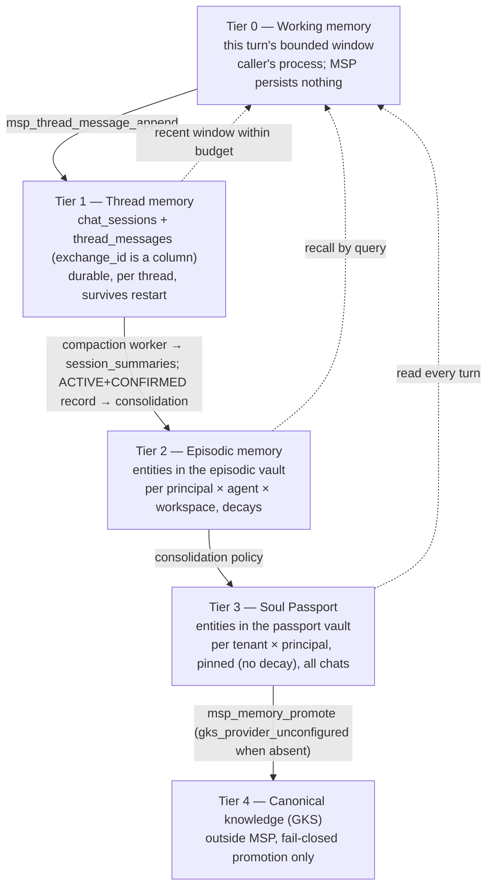

# DESIGN — Session, episodic, thread and instance memory for multi-user, multi-agent continuity

## สรุปภาษาไทย

**ฉบับ 0.4.0b (ล่าสุด)**: กำหนดสเปก stage 2 (multi-agent) แบบละเอียด
ครบทุกจุดเป็นครั้งแรก ตามคำสั่งเจ้าของ 2026-09-14 ให้เดินหน้างานที่วางแผนไว้
ต่อ — เขียนจากโค้ด stage 1 จริงที่ `feat/memos-002-thread-memory` commit
`707406d`. ประเด็นหลัก: grant เพิ่ม `agentId`/`workspaceId` (บังคับทุก
เครื่องมือ) กับ `nonce` (บังคับทุกเครื่องมือที่เขียนข้อมูล ยกเว้น
`msp_thread_message_append`) พร้อม error code ใหม่สองตัว
`grant_nonce_required`/`grant_replayed`; ตาราง `thread_agents` (โครงสร้าง
เดียวกับ `thread_participants`) กำหนดว่า agent ไหน "current" บน thread
ไหน; **`DEC-MEMOS-18` (ใหม่)**: worker เซ็นชื่อในฐานะ agent ของ thread
นั้นเอง ไม่ใช่ role พิเศษที่ยกเว้นการเช็ค; `protected_memory_records`
เพิ่มคอลัมน์ `agent_id`/`visibility` (`AGENT`/`THREAD`) ผ่าน `ALTER TABLE`
เท่านั้น ไม่ rebuild ตาราง; **`DEC-MEMOS-18`** และ **`DEC-MEMOS-17`**
(stage 2 ไม่มี compatibility flag ให้ zuri-ai เพราะ activation ถูกกัน
ด้วย `BL-MEMOS-090` อยู่แล้ว) เป็น adopted default ที่รอเจ้าของยืนยัน
ส่วน `DEC-MEMOS-01..16` เจ้าของยืนยันแล้วเมื่อ 2026-09-14 ("ยืนยัน") บันทึก
ไว้ที่ commit `214a7d2` บนสาขาเดิม

**ฉบับ 0.3.4b**: รอบที่ RKOI **อนุมัติแล้ว (0 critical)** แต่ขอให้พับ
คำเตือน 9 ข้อเข้ามาก่อน merge จึงไม่ใช่การแก้ NEEDS REVISION เหมือนสามรอบ
ก่อนหน้า ประเด็นสำคัญที่สุดคือ **ช่องโหว่ cross-room ที่ยังไม่มีงานในแผน**:
การเรียกเครื่องมือบน thread ที่มีอยู่แล้วตรวจ tenant/business/account
แต่ไม่ตรวจ "ห้อง" เลย และ `msp_session_compaction_claim` ไม่ตรวจ scope
อะไรเลย ทำให้ grant ของ worker ห้อง R1 claim งานของห้อง R2 แล้วได้
`sources` ของห้องอื่นไปได้ — เพิ่ม **BL-MEMOS-111** ให้ทุกเครื่องมือที่ผูกกับ
thread ต้องเทียบ room hash ของ grant กับ hash ที่เก็บไว้ของ thread นั้น
รวมถึง claim/commit/retry ผ่าน thread ของ job ด้วย

รอบนี้ยังแก้การวินิจฉัยที่ผิดของรอบก่อน: ค่า `DEFAULT ''` เดิมทำให้ trigger
**ปฏิเสธ** การ insert ที่ tenant ไม่ตรง (ไม่ใช่ปล่อยผ่านเงียบ ๆ อย่างที่เขียนไว้ผิด)
บั๊กจริงคือพอเปลี่ยนเป็น `NOT NULL` แล้ว handler ที่ยังใช้ `INSERT OR IGNORE`
จะกลืน NOT NULL violation แบบเงียบ ๆ (`changes=0`) ไม่ insert อะไรเลย ต้องเปลี่ยน
handler เป็น `ON CONFLICT(summary_id) DO NOTHING` และ trigger ต้องใช้ `IS NOT`
แทน `<>` เพื่อไม่พลาดค่า NULL

กติกา audience ก็เปลี่ยนทิศทาง: `audienceKind` เป็นข้อบังคับ (required) บน
ทุกเครื่องมือยกเว้น `msp_thread_delivery_record` ไม่ใช่แค่ "เช็คถ้ามีมา" อย่างที่
เขียนไว้ก่อนหน้า ส่วนกติกาความจำ session ก็แก้จากเดิมที่บอกว่ามีสถานะเปิดอยู่
อย่างละหนึ่งเสมอ เป็น "OPEN ได้อย่างมากหนึ่งเดียว" เพราะ reconciliation ทำให้มี
สถานะกำลังปิดกับสถานะเปิดพร้อมกันได้จริงตามปกติ

**DEC-MEMOS-15** ถูกเข้มขึ้น: ต้องเช็ค `person_id` ของแถวที่เก็บไว้จริงด้วย
ไม่ใช่แค่ค่าที่ส่งมา, การอัปเกรดต้องปิดแถวเก่าแล้วเปิดแถวใหม่ในธุรกรรมเดียว
(ไม่ใช่ทางเลือกของ implementation) และบันทึกไว้ชัดว่าการ "ถอนการยืนยัน" ยัง
ทำไม่ได้จนกว่าจะมีเครื่องมือ lifecycle — MSP ยังพึ่ง zuri-ai ไม่ตั้ง
`readPrivate` อีกต่อไปเป็นกลไกเดียว

การอ้างอิงไฟล์ probe ชั่วคราวของ RKOI (ที่อยู่นอก repo) ถูกลบออกทั้งหมด
ตามคำขอ เพราะไฟล์เหล่านั้นอยู่นอก repo และไม่คงทน แทนที่ด้วยการชี้ไปที่
backlog item ที่มี acceptance test ยืนยันแทน

ส่วนที่เหลือของเอกสารเป็นภาษาอังกฤษตามแบบแผนของ repo ดู §0.1 สำหรับตารางแก้ไข
ฉบับนี้ทั้งหมด

## 0. Review response

### 0.1 Round eight (0.3.3b → 0.3.4b) — RKOI round-4 review, APPROVED with 9 warnings

RKOI reviewed the docs at commit `1c4a62f` and **APPROVED it with 0
critical findings**, conditioned on nine warnings being folded in before
merge. Unlike every prior round, nothing here is a rejection — this
revision is a pre-merge cleanup pass. Per RKOI's own instruction, every citation of RKOI's session-scratch probe
scripts as evidence is removed throughout this document: those files are
session-temporary and were never part of this repository, so a stable
citation must name the actual acceptance test instead. Where an earlier
round cited a probe directly, this revision either points at the backlog
item whose acceptance test now proves the same fact, or simply states the
finding without a file citation.

| # | Warning | Correction |
|---|---|---|
| 1 | **Cross-room guard gap had no BL row.** A call against an existing thread matched tenant, business and channel account, but not the room; `msp_session_compaction_claim` took no scope check at all — a worker grant scoped to room R1 could claim room R2's compaction job and receive its `sources`, since `claimCompaction` never compares any room identity | New backlog item **BL-MEMOS-111** (owner KIN): the grant's own room hash (`tenant_id\|channel_account_id\|external_room_ref` under `MSP_IDENTITY_HMAC_KEY`) must be recomputed and compared against the resolved thread's stored `external_room_ref_hmac` on **every** thread-bound call, including `claim`/`commit`/`retry` via the job's own thread — not only `resolve`. Added as a `BL-MEMOS-033` dependency and a `GATE-MEMOS-2` bullet. §6.3's "listed in §12.1/§15/the plan" is now true: §12.1 specifies the check, §15 has an invariant row, the plan has BL-MEMOS-111 | §6.3, §12.1, §15, plan |
| 2 | **The `thread_summary_invalidations` failure was described backwards.** With the old `DEFAULT ''`, the tenant-consistency trigger's `<>` comparison actually *refused* the mismatched insert (`'' <> '<real tenant>'` is true, so the trigger fires) — it did not succeed silently, contrary to what round seven claimed. The real bug is different and only appears with the *fixed* `NOT NULL` column plus the *unfixed* handler: `INSERT OR IGNORE` silently absorbs a `NOT NULL` violation exactly as it absorbs a `PRIMARY KEY` conflict, so a handler that still omits `tenant_id` now inserts **nothing at all** (`changes: 0`) instead of failing loudly or succeeding wrong. Separately, the trigger's `<>` is not NULL-safe: if `tenant_id` were ever `NULL` (not merely empty), `NULL <> x` evaluates to `NULL`, which `WHERE` treats as false, so the trigger would not fire at all for a `NULL` value | §12.1's trigger now compares with **`IS NOT`**, not `<>`; the handler must use `INSERT … ON CONFLICT(summary_id) DO NOTHING`, not `INSERT OR IGNORE`, so a `NOT NULL` violation on a forgotten `tenant_id` raises loudly instead of being swallowed by the same blanket clause that also handles the legitimate duplicate-insert case; the reconcile-after-close acceptance case now explicitly asserts the invalidation row **exists** (not merely that the reconcile call "succeeds") | §12.1, §15, BL-MEMOS-102 |
| 3 | **Plan rows contradicted v0.3.3b.** `BL-MEMOS-023` still said "assurance upgrade only via the lifecycle tool," ignoring DEC-MEMOS-15 entirely; `BL-MEMOS-021` still said "`thread_bindings` restored as its own table," directly contradicting `BL-MEMOS-100`'s own cancellation two rounds earlier | Both rewritten in the plan; `BL-MEMOS-020`..`033` scanned as a block for the same class of drift | plan |
| 4 | **The audience rule was "check only when present"; owner direction is per-tool required.** `audienceKind` is not merely optional-and-checked-if-sent — zuri-ai's signer sends it unconditionally on `resolve`, and `claimsFor` includes it on every other non-delivery tool, so its absence on any of those five is itself a signal something is wrong, not a normal case to tolerate silently | `audienceKind` is now **required** on `resolve`, `append`, `context`, `memory_record` and `injection_record`; missing it on any of those five is refused. Only `delivery_record`'s grant carries none — its scope is the inbound message's own thread plus the room hash, never `audienceKind`. A delivery grant that *does* happen to carry `audienceKind` is still checked against the thread, not ignored | §9.2, §13, plan BL-MEMOS-109 |
| 5 | **Session uniqueness was mis-stated as an existing "one OPEN/CLOSING" rule.** It is not existing behaviour, and it is the wrong invariant: reconciliation legitimately leaves one `CLOSING` and one new `OPEN` session on the same thread at once (a session being wound down while its successor is already accepting messages) | Restated as **"at most one `OPEN` session per thread"** — never a claim about `CLOSING`. `UNIQUE (thread_id) WHERE status = 'OPEN'` is proposed, **conditional on `BL-MEMOS-033` proving every flow (rotation, delivery reconciliation, idle sweep) still holds it**; until proven, the invariant is code-enforced only, not schema-enforced, and this document says so plainly rather than asserting a constraint that might reject a legitimate reconciliation state | §0.1 (this row, replacing round six's wrong framing), §12.1, plan BL-MEMOS-102 |
| 6 | **Uncommitted fixes were described as already-true facts.** §6.1 said `channelType` "does not exist anywhere on either side of the wire," and §13 said "no `channelType` claim exists" — both stated as settled fact. At the reviewed commit the code still required a `channelType` claim | Both reworded as a **tracked gap** (`BL-MEMOS-109`), not an accomplished fact — this document specifies the target, the code has not yet been verified to match it. `BL-MEMOS-109` gains an explicit task to update `docs/API-011-THREAD-MEMORY-CONTRACT.md:54,196` and the cross-repo test's own header comment, both of which still describe the four-segment hash. Also corrected: an earlier changelog entry said the room-hash input lives in §6.3 — it is §6.2 | §6.1, §13, plan BL-MEMOS-109 |
| 7 | **DEC-MEMOS-15 needed tightening in three places.** (a) The rule checked only the *incoming* `person_id` value, not the *stored* row's own `person_id` — a row whose stored `person_id` already names someone else must not self-upgrade just because the incoming value happens to be null or match the principal. (b) §7 rule 6 called "insert a new row vs. update in place" an implementation choice; it is not — the append-only trigger permits only `left_at NULL → NOT NULL`, so a self-upgrade **must** close the old row and insert a new one in one transaction, exactly like every other membership change. (c) Nothing recorded what happens when zuri-ai *de-verifies* someone: since a `VERIFIED → PENDING` downgrade is silently ignored, MSP's own row stays `VERIFIED` after zuri-ai's own state has moved on — revocation is not implemented and today relies entirely on zuri-ai no longer setting `readPrivate` for that principal | ADR decision 15, design §7 rule 2 and rule 6, §9.1 all corrected; the revocation gap stated explicitly rather than left implicit | ADR, §7, §9.1 |
| 8 | **Gates and evidence.** `GATE-MEMOS-4/5/6` named no suite files; scratch probe paths were cited as if they were durable evidence | `GATE-MEMOS-4/5/6` now each name their §15 suite file; every scratch-probe citation in this document is removed, replaced by naming the finding directly or pointing at the backlog item whose acceptance test proves it; `BL-MEMOS-110` reworded to "make `test:cross-zuri` pass against a read-only extract of zuri-ai `origin/main`, and wire it into `GATE-MEMOS-2`" — the script and the test already exist; the item is about making it pass and gating on it, not building it from nothing | plan |
| 9 | **`RSK-MEMOS-01` referenced a risk it never actually stated.** The ADR and §19 both said the `personId`-change lock-up risk was "recorded in `RSK-MEMOS-01`," but the risk row itself never named the mechanism | The plan's `RSK-MEMOS-01` row now states it directly: a zuri-ai account merge into an existing Person changes that Person's `personId`; the next append passes the first-membership check (§7 rule 2) but the *lifetime* single-`HUMAN` trigger (§6.3) still refuses a second distinct `HUMAN` speaker on that `DIRECT` thread; every later append then fails closed until `BL-MEMOS-092`'s relink caller exists; the merged Person never inherits the old thread's history in the meantime | plan |

### 0.2 Round seven (0.3.2b → 0.3.3b) — RKOI round-3 review, 1 critical

RKOI reviewed commit `6d1a801` (design v0.3.2b, ADR v0.1.2b, plan 0.1.2b)
and returned **NEEDS REVISION, 1 critical**. RKOI supplied a set of
session-scratch probe scripts run directly against zuri-ai's real code and
the shipped migration; this revision reads their findings directly rather
than working from prose alone, the same discipline §0.3 established.
**Note added in round four**: those probe scripts were never part of this
repository and are not cited here as durable evidence — every finding
below is described on its own merits, or by pointing at the named backlog
item whose acceptance test now proves it.

**Critical**

| # | Finding | Change in 0.3.3b | Where |
|---|---|---|---|
| 1 | The delivery grant does not carry `channelType` (or `audienceKind`) at all. zuri-ai's real signer (`msp-thread-memory-port.js:420-422`, `origin/main`) sends exactly `{ tenantId, businessId, channelAccountId, externalRoomRef, principalId, policyRevision, deliveryWriter }`. §0.3's fix invented a `channelType` claim that does not exist on either side of the wire. **Owner direction: option (a)** — drop `channel_type` from the room HMAC entirely (three segments: `tenant_id\|channel_account_id\|external_room_ref`), and stop requiring `channelType` on any grant. KIN is fixing the code this way in the same pass | §6.1 (grant examples and claim list rebuilt), §6.3 (room-hash input corrected to three segments, normative), §9.2 (delivery scope corrected), §13 (delivery row corrected) | §6.1, §6.3, §9.2, §13 |

**New adopted default**

| ID | Decision | Where |
|---|---|---|
| DEC-MEMOS-15 | Assurance upgrade without a claim: a later append's `PENDING → VERIFIED` transition is accepted with no `assertParticipants` only when `speaker_id === grant.principalId`, `speaker_kind === HUMAN`, `person_id ∈ {null, grant.principalId}`, and the membership is that principal's own current row. A later append's `VERIFIED → PENDING` is silently ignored (not stored, not refused) rather than treated as a change. Every other assurance or membership change still requires `assertParticipants`. This closes a real correctness gap: zuri-ai sends `identity_assurance: VERIFIED` with `person_id = principalId` the moment a user is verified (`server-line-answer.js:186-199`), and without this rule that call would need `assertParticipants` it never carries, leaving a DIRECT thread permanently unwritable past first verification | §7, §9.1 |

**Warnings, verified against RKOI's round-three findings**

| # | Warning | Verified | Change |
|---|---|---|---|
| 1 | `thread_summary_invalidations`: a `DEFAULT ''` plus a naive trigger breaks the shipped `INSERT … SELECT` reconciliation write, and `tenant_id` could still be rewritten | Confirmed by `probe-ddl.mjs`'s V1 (KIN's shipped `#refreshSummaryAfterDelivery` INSERT omits `tenant_id` from its column list; a `DEFAULT ''` would let that INSERT silently succeed with the wrong tenant instead of failing loudly) and V3 (no UPDATE-pinning trigger existed to stop a later rewrite) | §12.1: `tenant_id TEXT NOT NULL` with **no default** in the `CREATE TABLE` (0008 is unshipped, so this is an ordinary edit, not a follow-up migration); the handler must be changed to select and supply the tenant explicitly; an UPDATE-pinning trigger added; no DELETE |
| 2 | The injection trigger must also pin `injection_id` itself | Confirmed by `probe-ddl.mjs`'s I3: a `PRIMARY KEY`-only UPDATE (`injection_id` rewritten, state/version left untouched) was accepted by the trigger this document previously specified | §12.1: `NEW.injection_id IS OLD.injection_id` added to the trigger's pinned-column list |
| 3 | The consistency-trigger list was incomplete | Confirmed by `probe-jobs.mjs`'s J1 (a job naming a session of a different thread, same tenant, was accepted), J2 (a job naming a session of a different tenant was accepted) and J3 (`tenant_id`/`thread_id`/`session_id` were all rewritable by UPDATE); the same session-belongs-to-thread shape applies to `session_summaries` and `protected_memory_records`, neither of which had it either | §12.1: `session_compaction_jobs` gains an INSERT-time session-belongs-to-thread-and-tenant check and an UPDATE-pinning trigger; the same check is added to `session_summaries` and `protected_memory_records`; the existing one-OPEN/CLOSING-session-per-thread, `chat_sessions` tenant/thread pinning and `thread_participants` tenant trigger are restated as part of the same list, not scattered |
| 4 | `RSK-MEMOS-01` overclaimed that `assertParticipants` "needs no zuri-ai change," which contradicts items 4 and 5 of the same risk | The sentence was true only for the specific *first-membership* case DEC-MEMOS-12 covers; it read as a blanket claim. DEC-MEMOS-15 now resolves item 5 (the assurance-upgrade caller) MSP-side, so *that* item needs no zuri-ai change — but item 4 (relink/merge) still does | ADR, plan |
| 5 | Gates must name concrete suite files; `GATE-MEMOS-1` still said design v0.3.0b; `GATE-MEMOS-7` still said `DEC-MEMOS-01..10` | Checked against the plan directly | plan |
| 6 | `BL-MEMOS-033`'s acceptance must include the cross-repo contract test | Not yet present | plan: `tests/cross/zuri-thread-contract.test.mjs` via `npm run test:cross-zuri` with `MSP_TEST_ZURI_ROOT` added to BL-MEMOS-033 and BL-MEMOS-109 |

Every `DEC-MEMOS-01..14` reference in this design, the ADR and the plan is
updated to `01..15` in this revision.

### 0.3 Round six (0.3.1b → 0.3.2b) — RKOI round-2 review, 1 critical

RKOI reviewed commit `92cb591` and returned **NEEDS REVISION, 1 critical**.
Round-1 criticals 1 and 3 are closed; 2 is mostly closed. KIN's stage-1 port
(`feat/memos-002-thread-memory`, worktree `agent-ab508b7a790efd268`) is now
the source of truth for every wire value and schema shape the code already
implements; this revision reads that code directly rather than re-deriving
shapes from RKOI's prose. Where the code is itself wrong on an item, this
revision keeps the *design* correct and records the discrepancy for
BL-MEMOS-033 (the parallel code review) rather than silently matching a bug.

**Critical**

| # | Finding | Change in 0.3.2b | Where |
|---|---|---|---|
| 1 | Values on the "frozen" wire were wrong: `operation` example said `thread_resolve` (must be the full tool name, e.g. `msp_thread_resolve`, confirmed at `thread-access.mjs:48`); `expiresAt` was documented in seconds (it is **epoch milliseconds**, `now + 60_000`, bound `<= now + 65_000` — confirmed at `thread-access.mjs:49,91`); `direction`'s CHECK used `IN`/`OUT` (the shipped enum is `INBOUND`/`OUTBOUND` — confirmed at `migrations/0008_thread_memory.sql:173`); the injection state machine refused `RESOLVED→FAILED` (the shipped machine allows it, allows a same-state replay as a handler no-op, requires `injection_id` UNIQUE, and requires the first insert to be `RESOLVED` — all confirmed at `thread-memory.mjs:1082-1092`) | §6.1, §9.1, §9.3, §12.1, §13, §14 rebuilt from the shipped code | throughout |

**Checks from RKOI**

| # | Check | Resolution |
|---|---|---|
| a | zuri-ai's `delivery_record` grant carries no `audienceKind`; the audience check must apply only when the claim is present, or exempt `deliveryWriter` grants | **Design says the exemption is required. Code discrepancy found and flagged**: `thread-guard.mjs`'s `else if (thread)` branch (lines 81-97) runs the audience check unconditionally whenever `threadLookupFor` resolves a thread — including for `msp_thread_delivery_record` once its `inbound_message_id` already names an existing message. A delivery grant never carries `audienceKind` (only `channelAccountId`/`externalRoomRef`/`channelType`, per line 186-191), so `grant.audienceKind !== thread.audienceKind` is always `true` there and the call is always wrongly refused. §13 specifies the fix (skip the audience check when `name === "msp_thread_delivery_record"`); this is a real gap for BL-MEMOS-033, not a documentation-only mismatch |
| b | Stage-1 resolve of an existing thread wrongly implied `agent_not_current`, but stage 1 has no `thread_agents`/`assertAgents` (DEC-MEMOS-14) | **Confirmed against the code**: `thread-guard.mjs` has no agent concept anywhere. §8's opening now states plainly that every rule in that section is inert until the stage-2 migration exists; §13 states resolve of an existing thread in stage 1 returns `{ thread, created: false }` with no agent check at all | §8, §13 |

**Warnings, checked against the shipped code one by one**

| # | Warning | Status against `feat/memos-002-thread-memory` | Design change |
|---|---|---|---|
| 1 | DEC-MEMOS-12 wording: `assertParticipants` required only for (a) a membership whose principal is not `grant.principalId`, (b) OPERATOR rows, (c) assurance/`person_id` changes | **Code confirms (a) and (c)** exactly (`thread-guard.mjs:118-158`); **code does not implement (b) at all** — only `HUMAN`-kind appends are ever gated or turned into participant rows; `AGENT`/`OPERATOR`/`UNKNOWN` speakers are message-only and never become a `thread_participants` row under any claim, per the contract doc's own text ("Only a HUMAN speaker is ever recorded as a participant") and confirmed by the guard code checking `speaker_kind === "HUMAN"` before any participant logic runs at all. **Design records both**: the two conditions the code implements, and that an OPERATOR-participant path does not exist in stage 1 — a discrepancy against this warning's own wording, not a code bug (the code and its own contract doc agree with each other; RKOI's warning appears to describe a broader model than stage 1 actually built) | §7 |
| 2 | Delivery reconciliation needs pending-row scope fields, a forward-only reconcile transition with every non-state column pinned, room-scoped reconciliation, and consistency triggers | **All already shipped**: `thread_pending_deliveries` carries `inbound_message_id`, `channel_account_id`, `external_room_ref_hmac`, `business_id`, `tenant_id` and `reconcile_state`; `trg_thread_pending_deliveries_update_guard` pins every other column via `IS` on both the reconcile and the tombstone transition; `ThreadMemoryStore#drainDeliveries` joins on `tenant_id`, `business_id`, `channel_account_id` and `external_room_ref_hmac` together, so a pending reply for room R1 cannot reconcile against R2's thread. No design change needed beyond describing this accurately | §9.2 |
| 3 | Pin every column during permitted UPDATEs, using `IS`, on four tables | **Message, record-supersession and summary tombstones already pin every column listed**, confirmed line-by-line against the shipped triggers. **Two named columns do not exist where the warning places them**: `thread_messages` has no `policy_revision` column (it lives on `chat_sessions.policy_revision` instead — the append request accepts it but the store does not persist it on the message row); `session_summaries` has no `invocation_state` column (that lives on `session_compaction_jobs.invocation_state`). **Injection has no update-pinning trigger at all** — the shipped `UPDATE thread_injection_receipts SET state=?,updated_at=?,version=version+1 ...` is JS-only, with the migration's own comment admitting "the existing state-machine UPDATE ... is unrestricted." This is a real gap; §12.1 specifies the trigger BL-MEMOS-033 should add | §9.1, §9.3, §12.1 |
| 4 | Consistency triggers: `thread_bindings` tenant trigger; `thread_summary_invalidations` tenant trigger; `chat_sessions`/exchanges refuse `UPDATE OF tenant_id, thread_id`; a message cannot reference another thread's session/exchange/`reply_to_message_id` | **No separate `thread_bindings` table exists in the shipped code** — binding fields (`channel_type`, `channel_account_id`, `external_room_ref_hmac`, `business_id`) live directly on `threads`, already tenant-consistent by construction (one row, one `tenant_id`) and already pinned for life by `trg_threads_pin_identity`. This revision **withdraws** the separate `thread_bindings` table 0.3.1b introduced and states plainly that identity-key **rotation is not implemented in stage 1** (§6.2) — the accepted gap that table existed to close. **Real gaps, confirmed against the migration**: `thread_summary_invalidations` has no `tenant_id` column or trigger at all; `chat_sessions` has an insert-time tenant check but no `UPDATE` trigger barring `tenant_id`/`thread_id` from changing later; `thread_messages` has no trigger checking that its `session_id` belongs to its own `thread_id`, that a caller-supplied `exchange_id` was previously used only within the same thread, or that `reply_to_message_id` names a message of the same thread. §12.1 specifies all of these as required additions | §12.1 |
| 5 | Closed threads refuse append/record/injection/delivery; readable only through export | **Already shipped**: `thread-guard.mjs`'s `else if (thread)` branch requires `thread.status === "ACTIVE"` for every tool that resolves a thread this way (append, context, memory_record, injection_record, and delivery once its message exists) — a closed thread is refused everywhere this branch applies. No export tool exists yet in stage 1, so "readable only through export" is aspirational for a later phase; nothing today reads a closed thread at all. No design change needed beyond stating this precisely | §11 |
| 6 | `close_for_relink` gated by a distinct claim, not `operator` | Not code-checkable — stage 1 ships no lifecycle tool at all (confirmed: `msp_thread_participant_lifecycle` is not among the ten registered tools). This is purely a design correction to 0.3.1b's own §7 rule 8 | §7 |
| 7 | `person_id` means `principalId` for a verified HUMAN speaker and null otherwise | The shipped store (`#applyHumanParticipant`, `thread-memory.mjs:1199-1208`) does not itself enforce this — it stores whatever `person_id` the caller sends, defaulting to the existing value when omitted. RKOI's characterization describes **zuri-ai's own sending convention** (a fact about the caller this design cannot verify without reading `server-line-answer.js`), not an MSP-enforced invariant. §9.1 is corrected to state it as exactly that: a caller convention MSP stores as given, not a rule MSP derives or checks | §9.1 |
| 8 | Assurance upgrades need a caller (the lifecycle tool); add to `RSK-MEMOS-01` and the ADR cross-repo list, next to relink | Added | ADR |
| 9 | Worker tool shapes must match `thread-summary-worker.mjs`: `sweep` returns `{jobs, closed}`, not `{jobsCreated}`; `claim`'s response is read as `sources`/`sourceDigest`/`sessionId`/`sourceStartSequence`/`sourceEndSequence`/`jobId`/`leaseToken`, not a `window{}` envelope | Confirmed against `thread-summary-worker.mjs:8,19-36` exactly; §13's worker tool table rebuilt to the real shapes | §13 |
| 10 | Governance wording: RKOI's rulings are not owner consent; ADR ruling 1 called new required fields "out of bounds" rather than "cross-repo changes listed in RSK-MEMOS-01/BL-MEMOS-090" | §19 no longer says RKOI's rulings "no longer need owner attention" — restored to pending owner confirmation. ADR wording corrected | §19, ADR |
| 11 | Plan: BL-MEMOS-102 table list; BL-MEMOS-100/021 duplication; BL-MEMOS-107 merge target; BL-MEMOS-101 gate placement; reopen RSK-MEMOS-03; keep ids, burn merged ones as cancelled | Addressed in the plan, not this design document | plan |
| 12 | Suites: restore or rename `provenance-ids-are-not-owners` and `context-tools-ownership`; align relink cases under `participant-lifecycle-relink` | §15 updated | §15 |

**Nonce gap — RKOI accepted for stage 1, conditions verified against the code:**

| Condition | Verified |
|---|---|
| `record_id` stays content-derived | Yes — `thread-memory.mjs:703`: `` `memory-record_${sha256(JSON.stringify([threadId, sessionId, kind, speaker, person, scope, body, sortedSourceRefs, supersedesRecordId, verificationState, status]))}` `` |
| `injection_id` is UNIQUE with RESOLVED-first | Yes — `injection_id TEXT PRIMARY KEY` (migration line 434); handler throws unless `(!old && status === 'RESOLVED')` or a valid transition from an existing row (`thread-memory.mjs:1082,1089`) |
| `receipt_id` stays the delivery primary key | Yes — `thread_pending_deliveries.receipt_id TEXT PRIMARY KEY` (migration line 455); `thread_delivery_receipts` keys on `receipt_id` with `UNIQUE(message_id, receipt_id)` |

Recorded in §6.1 and §19 as an accepted stage-1 posture, not a silent gap.

### 0.4 Round five (0.3.0b → 0.3.1b) — RKOI round-1 review, 3 criticals

RKOI reviewed commit `2f4d584` and returned NEEDS REVISION, 3 critical
findings, against a version of this design written **before** KIN's stage-1
code existed, so it necessarily guessed at wire shapes. Superseded in every
particular by §0.3 above, which reads the actual shipped code instead of
reconstructing it from a branch this document's author could not read
directly. Kept as provenance.

| # | Finding | Status |
|---|---|---|
| 1 | Migration 0008 did not apply (`CHECK` used a forbidden subquery) | The shipped migration never had this defect — every cross-row rule is a `BEFORE INSERT` trigger from the start (`trg_protected_memory_records_subject_rules`). §0.3's finding 1 was about wire *values*, not this structural point, which was never wrong in the code |
| 2 | §12.1/§13 broke DEC-MEMOS-02 (frozen wire) with an invented nested/camelCase grant shape | Superseded — §0.3 rebuilds every shape from the actual shipped flat/epoch-ms/hex grant |
| 3 | Any agent could attach itself to any thread by calling resolve | Moot in stage 1 — the shipped code has no agent-attachment concept of any kind (§0.3 check b) |

Adopted defaults DEC-MEMOS-11..14 and the four rulings on ATHER's judgement
calls (capability growth, keyring, nonce split, single `thread_kind`) from
this round stand, adjusted where §0.3 found the shipped code does something
more specific than the rulings anticipated (notably: `thread_kind` and
`audience_kind` are not two columns kept equal by a trigger — `threads` has
only `thread_kind`, and every response mirrors it as `audienceKind`; there
was never a second column to keep in sync).

### 0.5 Round four (0.2.3b → 0.3.0b) — reconciling the unmerged branch

Historical; unchanged from prior revisions' record. Reconciled this design
against the independently-built, unmerged branch `codex/msp-thread-memory`
per the owner's ten adopted defaults; superseded in wire-shape detail by
§0.3/§0.4, unchanged in the multi-user/multi-agent model's substance.

### 0.6 Round three (0.2.1b → 0.2.2b)

Historical. RKOI's third review approved v0.2.1b with zero criticals and
eight warnings folded into v0.2.2b (instance-attachment surrogate key,
`redaction_marked_at` pinning, archived-episode erasure path, one-statement
vault erasure, populated-db unexpected-status test, identity-key default
and rotation procedure, `entities_fts` erasure row, non-empty-summary
CHECK). Several of the tables this round discusses are withdrawn as of
0.3.0b (§3.1).

### 0.7 Round two (0.2.0b → 0.2.1b)

Historical. RKOI's second review confirmed round-one closures and raised
two criticals, twelve warnings, closed at the mechanism; superseded by the
`thread_agents` model (§8) and the erasure table (§11.1).

### 0.8 Round one (0.1.0b → 0.2.0b)

Historical. Thirteen criticals, eleven warnings, closed at the mechanism;
not repeated here — see `git log` of this file.

## 1. Why this document exists

zuri-ai has already decided what it expects from MSP as Tier 2, and stage 1
of it is now **built**, reviewed once by RKOI, and under a second review
pass (`BL-MEMOS-033`):

| Upstream decision | What it asks of MSP | State as of 0.3.2b |
|---|---|---|
| ADR-043 D2 | "sole gateway for agent session control, episodic conversation state, and vault permission validation" | `msp_vault_resolve` (API-010) exists in this design's vocabulary, unbuilt; the thread/session/protected-memory model is API-011, **now built** on `feat/memos-002-thread-memory` (`docs/API-011-THREAD-MEMORY-CONTRACT.md` v0.3.0b is its own contract document, the primary source of truth alongside the code itself) |
| ADR-044 D1/D2 | Unified thread id authority, session lifecycle, channel isolation | Threads/sessions/messages exist, C-1 and C-2 closed; this revision reconciles this design's prose with the shipped shapes and flags the remaining gaps for the code review |
| ADR-022 D4–D7 | API-010 `msp_vault_resolve`; private memory owned by Tenant × Principal × Agent × Workspace; thread/session/instance are provenance only | Vault ownership model (§5) is unchanged and still holds; instances are withdrawn as a concept for server channels — stage 1 has no agent concept at all yet (§8) |
| PHASE-04 | `ChannelThread`, `ThreadParticipant`, `ConversationEvent`, `Session`, `Episode`, summaries, retention/tombstone, export/erase, persistence port | Threads/participants/messages/sessions/records/summaries exist; export/erase are a later phase (003/004) |

This revision's job is narrow: make every wire value and schema detail this
document specifies **match the shipped code exactly** where the code
already implements it, and specify precisely (flagged as a gap, not
silently assumed) whatever the code has not yet added.

## 2. Terms

Id and ref convention is unchanged from earlier revisions
(`packages/msp-core/src/domain/vault-registry.mjs` `rowToVault`).

| Term | Meaning | Id / column | Who mints |
|---|---|---|---|
| **Principal** | The canonical human (zuri-ai `Person.id`). Owner of permanent memory. | opaque, supplied | zuri-ai identity |
| **Tenant / business / channel** | Server-owned scope from AuthContext | opaque, supplied | zuri-ai |
| **Thread** | One conversation container: `DIRECT`, `GROUP` or `ROOM`. Its channel binding (`channel_type`, `channel_account_id`, `external_room_ref_hmac`, `business_id`) is a set of columns on `threads` itself — **there is no separate binding table** | `thread_id` | MSP, on `msp_thread_resolve` |
| **Grant** | A flat, signed, capability-flagged, short-lived (epoch-millisecond) authorization object wrapping every API-011 call | opaque JSON + hex HMAC-SHA256 signature | zuri-ai (Tier 1), keyed by `MSP_THREAD_SERVICE_KEY` |
| **Speaker / participant** | A `HUMAN`-kind row in `thread_participants`. `AGENT`, `OPERATOR` and `UNKNOWN` are message-only `speaker_kind` values — they never become a participant row in stage 1 | `membership_id` | MSP, under DEC-MEMOS-12's first-append rule or `assertParticipants` |
| **Exchange** | A caller-supplied identifier (`exchange_id`) grouping one inbound message and its reply. **A plain column on `thread_messages`, not a separate table** | opaque, supplied or MSP-assigned | zuri-ai, or MSP when omitted |
| **Chat session** | One bounded stretch of message activity on a thread | `session_id` | MSP |
| **Message** | One append-only turn record | `message_id` | MSP |
| **Protected memory record** | A thread-scoped assertion pending consolidation into a subject's own vault | `record_id`, content-derived | MSP, under a signer's own grant |
| **Session summary** | The compacted record of a stretch of messages, produced by a host-injected worker | `summary_id` | MSP, via the compaction worker tools |
| **Episodic vault** | The principal's private memory with one agent in one workspace (`principal_private`) | `vault_id` | MSP, via `msp_vault_resolve` |
| **Soul Passport vault** | The principal's permanent memory across every agent and workspace in a tenant (`principal_passport`) | `vault_id` | MSP, via `msp_vault_resolve` |

## 3. What exists today and what is missing

Reused unchanged: `vaults`/`vault_mounts`/`VaultRegistry`; API-009 entities;
append-only `journal`; the fail-closed GKS bridge; `vault-scope-guard.mjs`'s
pattern.

**Built and reviewed once (stage 1, `feat/memos-002-thread-memory`,
`migrations/0008_thread_memory.sql`):** `threads`, `thread_participants`,
`chat_sessions`, `thread_messages`, `protected_memory_records`,
`session_compaction_jobs`, `session_summaries`, `thread_delivery_receipts`,
`thread_pending_deliveries`, `thread_injection_receipts`,
`thread_summary_invalidations`; the ten API-011 tools; the
`thread-access.mjs`/`thread-guard.mjs` C-2 fix; the `thread-summary-worker.mjs`
host-injected worker. Under a second RKOI code review (`BL-MEMOS-033`) as
of this revision.

Confirmed gaps in the shipped code, listed once here and detailed at their
owning section:

- `thread_summary_invalidations` has no `tenant_id` column or trigger (§12.1).
- `chat_sessions` has no `UPDATE` trigger barring `tenant_id`/`thread_id`
  from changing after insert (§12.1).
- `thread_messages` has no trigger checking that its `session_id`,
  `exchange_id` history, or `reply_to_message_id` all belong to the same
  `thread_id` (§12.1).
- `thread_injection_receipts` has no `UPDATE`-pinning trigger at all — the
  state machine is enforced in JS only (§9.3, §12.1).
- `thread-guard.mjs`'s audience check wrongly applies to
  `msp_thread_delivery_record` once its inbound message exists, because a
  delivery grant never carries `audienceKind` (§9.2, §13).

Missing, net-new relative to stage 1: identity-key **rotation** (no
mechanism exists — the separate `thread_bindings` table 0.3.1b proposed to
support it is withdrawn, §6.2); tenant/principal-scoped vault types and
`msp_vault_resolve` (§5, unbuilt); every agent concept (§8, entirely
stage 2, not started); a participant lifecycle tool (§7, phase 003); a
grant nonce table (§6.1, accepted stage-1 gap); consolidation from
`ACTIVE`+`CONFIRMED` protected records into principal vaults (§10.2).

### 3.1 Concept mapping: earlier design vocabulary → shipped API-011

| Earlier term | Shipped equivalent | What changed |
|---|---|---|
| `exchanges` table (0.3.1b) | `thread_messages.exchange_id` column | No separate table exists; grouping is a plain string column |
| `thread_bindings` table (0.3.1b) | Columns on `threads` itself | No separate table exists; rotation is consequently not implemented (§6.2) |
| `instances`, `msp_instance_open/heartbeat/close` | *withdrawn* | Not part of stage 1 at all |
| `sessions` | `chat_sessions` | Same one-open-session-per-thread invariant |
| `conversation_events` | `thread_messages` | Append-only, MSP-ordered, `source_event_id`-idempotent |
| `episodes` | `session_summaries` + compaction worker tools | Asynchronous, host-injected, leased-job model |
| Extractive fallback | `coverageGap` (`{fromSequence, throughSequence, ranges, reason}` or `null`) | Confirmed shipped shape, `thread-memory.mjs:797-817` |
| `msp_turn_context` | `msp_thread_context` | Same bounded-packet idea; response is `{thread, recentExchanges, threadSummaries, protectedRecords, participants, coverageGap}` exactly |

## 4. Five memory tiers



| Tier | Owner key | Lifetime | Store | Decay | Read by |
|---|---|---|---|---|---|
| 0 Working | the caller's process | one turn | not persisted by MSP | — | the calling process |
| 1 Thread | thread | open → closed, then retained per policy | `chat_sessions`, `thread_messages`, `protected_memory_records`, `session_summaries` | retention tick tombstones content (future phase) | current `VERIFIED` `HUMAN` participant of a `DIRECT` thread, with `readPrivate`; nobody else, ever |
| 2 Episodic | tenant × principal × agent × workspace | months | API-009 entities in the episodic vault | Ebbinghaus | this principal's turns with this agent in this workspace |
| 3 Passport | tenant × principal | until erasure | API-009 entities in the passport vault | pinned | every turn of this principal in the tenant, any agent, when `allow_passport` |
| 4 Canonical | portfolio/tenant (GKS) | permanent | GKS | n/a | governed retrieval |

## 5. Ownership model — vaults

*(Kept unchanged — nothing in this or any prior review round touches vault
ownership; see the original text for the full rule set.)*

Two vault types are added to the existing `shared`/`workspace_private`/
`global_private` set: `principal_private` (owner tuple `tenant_id,
principal_id, agent_id, workspace_id`, all NOT NULL while active) and
`principal_passport` (owner tuple `tenant_id, principal_id`, NOT NULL
while active; `agent_id`/`workspace_id` NULL). Thread/session/message ids
are never vault owners and never authorization input. Principal vault ids
are random and idempotency is schema-enforced (`vault-registry.mjs:248`,
`:275`). `decay_policy` gates Ebbinghaus vs pinned. Principal vault types
are never mountable. Every path to a principal vault requires a matching
access context (§5.1).

### 5.1 Caller identity on the nine `msp_memory_*` tools

*(Kept unchanged — see the original text; nothing in this round touches
API-009.)*

## 6. Grant, identity key and thread minting

### 6.1 The signed per-room grant

Every API-011 tool requires an `access` argument: `{ grant, signature }`.
**This section is rebuilt to match `packages/msp-contracts/src/contracts/
thread-access.mjs` exactly** — the earlier revision's grant shape (nested
`route`/`capabilities`, ISO timestamps, an `sha256:`-prefixed hash) never
existed in code and is withdrawn.

**The resolve grant, exactly as zuri-ai's signer builds it**
(`msp-thread-memory-port.js`'s `resolveThread`, `origin/main`) — no
`readPrivate`/`writePrivate` at all, since resolve makes no private-read
decision:

```json
{
  "grant": {
    "operation": "msp_thread_resolve",
    "expiresAt": 1757836865123,
    "payloadHash": "9f2c1a…e4",
    "tenantId": "…", "businessId": "…", "channelAccountId": "…",
    "externalRoomRef": "…", "audienceKind": "DIRECT",
    "principalId": "…", "policyRevision": "route-v1"
  },
  "signature": "…"
}
```

**The append/context/memory_record grant** additionally carries
`readPrivate`/`writePrivate` (computed by the caller as `route.audienceKind
=== 'DIRECT' && policy.mspAuthorization.{read,writePrivate} === true`) and
`assertParticipants` when the caller is asserting a participant change:

```json
{
  "grant": {
    "operation": "msp_thread_message_append",
    "expiresAt": 1757836865123,
    "payloadHash": "9f2c1a…e4",
    "tenantId": "…", "businessId": "…", "channelAccountId": "…",
    "externalRoomRef": "…", "audienceKind": "DIRECT",
    "principalId": "…", "policyRevision": "…",
    "readPrivate": true, "writePrivate": true
  },
  "signature": "…"
}
```

**The delivery grant is a distinct, smaller claim set — normative, not an
example** (`msp-thread-memory-port.js`'s `recordDelivery`, `origin/main`,
exactly): `{ tenantId, businessId, channelAccountId, externalRoomRef,
principalId, policyRevision, deliveryWriter }`. **It carries no
`audienceKind` and no `channelType`** — see §9.2/§13 for what this means
for the audience check and the room-hash input.

- **`operation` is the exact, full tool name** (e.g. `"msp_thread_resolve"`,
  not `"thread_resolve"`) — `verifyThreadGrant` rejects a grant whose
  `operation` does not equal the tool being called
  (`thread-access.mjs:83-85`).
- **`expiresAt` is an epoch-**millisecond** integer**, not seconds and not
  an ISO string. `signThreadRequest` mints it as `now + 60_000`
  (`thread-access.mjs:49`); `verifyThreadGrant` requires
  `grant.expiresAt > now` and `grant.expiresAt <= now + 65_000`
  (`thread-access.mjs:91`) — a 5-second slack window past the signer's own
  60-second lifetime, both in **milliseconds**.
- **`payloadHash` is a hex-encoded SHA-256** of `JSON.stringify(input)`,
  where `input` is the request body with `access` stripped
  (`thread-access.mjs:50,94`) — not `sha256:`-prefixed.
- **The signature is `HMAC-SHA256(key, JSON.stringify(grant))`,
  hex-encoded**, compared with `timingSafeEqual`
  (`thread-access.mjs:52,86-90`).
- **Required claims, checked explicitly**: `tenantId`, `principalId`,
  `policyRevision` (`thread-access.mjs:97-99`) — a grant missing any of
  these is `grant_signature_invalid`. Every other field
  (`businessId`, `channelAccountId`, `externalRoomRef`, `audienceKind`,
  the boolean capabilities, `assertParticipants`) is read by the
  per-tool guard logic in `thread-guard.mjs`, not by `verifyThreadGrant`
  itself, and its absence is whatever that tool's own check makes of it
  (usually `thread_scope_denied` for a missing capability).
- **Shipped additive claim: `assertParticipants`** (boolean; see §7).
  **`channelType` should not be a grant claim, and this is a tracked gap,
  not yet a settled fact (RKOI round four).** An earlier revision of this
  document invented `channelType` as a grant claim, reasoning that a
  delivery grant would need it to re-derive a room hash before the thread
  exists. zuri-ai's actual delivery grant
  (`msp-thread-memory-port.js:420-422`, `origin/main`) carries no
  `channelType` and no `audienceKind` at all — its full claim set is
  exactly `{ tenantId, businessId, channelAccountId, externalRoomRef,
  principalId, policyRevision, deliveryWriter }`, and the target room-hash
  input (§6.2) has no `channel_type` segment either. **This is what the
  wire and the hash *should* be — at the reviewed commit, the shipped code
  still required a `channelType` claim.** `BL-MEMOS-111`'s sibling backlog
  item `BL-MEMOS-109` tracks removing that requirement; this document
  specifies the target, not a claim that the removal has already landed.
  **`assertAgents`, `agentId`, `workspaceId` and a `nonce` do not exist in
  the stage-1 grant at all** — they are stage-2, unstarted.
- **Per-tenant keying is already a supported seam, not yet wired to a real
  keyring.** `verifyThreadGrant`'s `keyFor` parameter accepts either a
  plain string or `(claimedTenantId) => key` function
  (`thread-access.mjs:66-73,79`); the untrusted claimed `tenantId` selects
  a candidate key, and only that key can make the signature verify — a
  wrong tenant claim can never produce a valid signature under another
  tenant's key. **Stage 1's composition root always passes the single
  `MSP_THREAD_SERVICE_KEY`** (`thread-guard.mjs:33-37`); wiring an actual
  `MSP_THREAD_SERVICE_KEYRING` environment variable to a real per-tenant
  function is stage-2 work that needs no change to this function's shape
  when it happens.

**Nonce gap — accepted for stage 1, RKOI-verified against the shipped
code (§0.3).** There is no `grant_nonces` table in `0008`, and no nonce
field on the grant at all. This is accepted because three properties
already hold, all confirmed against the code rather than assumed:
`record_id` is content-derived (a duplicate `msp_thread_memory_record`
call with identical content is naturally idempotent, not merely
un-replay-protected); `injection_id` is the table's own `PRIMARY KEY`,
and the first insert must be `RESOLVED`, so a forged injection cannot be
planted mid-sequence; `receipt_id` remains the delivery primary key.
**Stage 2 closes this gap outright rather than continuing to rely on
per-tool idempotency arguments** — see the grant additions immediately
below and the `grant_nonces` DDL (§12.2).

### 6.1.1 Stage-2 grant additions — normative, unstarted (new, v0.4.0b)

**Nothing below exists in the stage-1 grant or the stage-1 code.** This
subsection is the single specification KIN builds `BL-MEMOS-040..046`,
`048` and `049` against; it is written as a target contract, not a claim
about what is shipped. The flat, epoch-millisecond, hex,
`JSON.stringify(grant)`-signed shape (§6.1 above) is unchanged — stage 2
adds claims to the same flat object, it does not restructure it.

| Claim | Type | Required on | Verified by | Absent/invalid → |
|---|---|---|---|---|
| `agentId` | non-empty string, ≤ 128 chars | **Every one of the ten API-011 tools** — all six caller tools and all four worker tools (`resolve`, `append`, `context`, `memory_record`, `injection_record`, `delivery_record`, `sweep`, `claim`, `commit`, `retry`) | Extends `verifyThreadGrant`'s existing required-claim check (`thread-access.mjs:97-99`), which today refuses a grant missing `tenantId`/`principalId`/`policyRevision` with `grant_signature_invalid` — `agentId` and `workspaceId` join that same list, reusing the same code and the same "missing required claim" message shape, not a new error class | `grant_signature_invalid` |
| `workspaceId` | non-empty string, ≤ 128 chars | Same as `agentId` | Same as `agentId` | `grant_signature_invalid` |
| `nonce` | non-empty string, ≤ 128 chars, unique per `(tenantId, nonce)` | **Every mutating tool except `msp_thread_message_append`**: `resolve` (it can mint), `memory_record`, `injection_record`, `delivery_record`, and all four worker tools. **Not required on `append`** (`source_event_id` already gives it replay protection — a second nonce layer would be redundant with an existing, already-reviewed mechanism) **or on `context`** (read-only; nothing to replay) | A new per-tool guard check in `thread-guard.mjs`, alongside the existing `audienceKind`/`deliveryWriter`/`operator` checks — not part of `verifyThreadGrant`, since the requirement is per-tool, not universal. On success, the guard inserts `(tenantId, nonce, expiresAt)` into `grant_nonces` (§12.2) in the **same transaction** as the guarded mutation, so a nonce is only ever consumed alongside a write that actually committed | Missing on a nonce-required tool: `grant_nonce_required` (new). A nonce already recorded for that tenant and not yet expired: `grant_replayed` (new) |
| `assertAgents` | boolean, optional | `resolve` only, to self-attach to an *existing* thread the calling agent did not mint (§8) | Read by the per-tool guard logic, exactly like `assertParticipants` (§6.1) — not part of `verifyThreadGrant` | n/a — its absence is not an error by itself; it only changes whether a non-current agent's resolve succeeds (§8) |

**Reasoning for the error-code choices (both reused, not invented, where
the existing vocabulary already fits — task instruction "reuse existing
codes where they fit"):**
- `agentId`/`workspaceId` become part of the SAME "missing required
  claim" bucket `tenantId`/`principalId`/`policyRevision` already occupy,
  because the shipped check already treats "signature is fine but a
  required claim is absent" as `grant_signature_invalid`, not a scope
  question — the grant itself is malformed before scope is even
  evaluated. Extending that one list is simpler than adding a whole
  parallel class for an identically-shaped failure.
- `nonce` cannot join that list, because it is not universal (`append`
  and `context` never require it) — a per-tool guard check is the only
  place that can express "required on these eight tools, not those
  two," matching exactly how `audienceKind`'s exemption for
  `msp_thread_delivery_record` already works (§9.2). Two **new** codes
  are minted rather than reusing `thread_scope_denied`, mirroring why
  `thread_audience_mismatch` got its own code instead of folding into
  `thread_scope_denied`: "no nonce sent" and "nonce reused" are common
  and diagnostically distinct enough to name, not generic scope denials.
- `agent_not_current` (§8, §14) is likewise its own code for the same
  reason `thread_audience_mismatch` and `record_subject_mismatch` are —
  a caller needs to tell "you're not authorized for this thread at all"
  apart from "you're not this thread's *current agent*," since the fix
  differs (attach via `assertAgents`, vs. a scope problem entirely).

**Adopted default, pending owner confirmation: agentId/workspaceId
length and charset are unconstrained beyond a 128-character bound and
non-emptiness** — MSP has no agent/workspace identity registry of its
own (mirroring `principalId`, which is likewise an opaque Tier-1-owned
string MSP never validates against a directory), so the bound exists
only to cap storage and `payloadHash` cost, not to validate shape.

**Per-tenant keyring, now specified (`BL-MEMOS-049`).**
`MSP_THREAD_SERVICE_KEYRING`, when set, **replaces** — not
supplements — `MSP_THREAD_SERVICE_KEY` for every tenant, with no
fallback to the single-key default: once a keyring is configured, a
tenant absent from it is `grant_unconfigured`, exactly as if no key at
all were configured, never silently falling back to the single default
key. Its value is one of:
- a literal JSON object, `{"<tenantId>": "<key>", ...}`; or
- a filesystem path to a JSON file of the same shape (chosen by
  `MSP_THREAD_SERVICE_KEYRING`'s value not parsing as JSON itself, but
  resolving as a readable path — **adopted default, pending owner
  confirmation**: this two-way sniff mirrors no existing MSP convention
  exactly, but avoids inventing a second environment variable
  (`MSP_THREAD_SERVICE_KEYRING_PATH`) for what is otherwise one seam).

Every value in the keyring must be ≥ 32 characters, the same bar as
`MSP_THREAD_SERVICE_KEY` (`signThreadRequest`/`verifyThreadGrant` already
enforce this bound on whatever string they receive — the keyring's own
job is only to select *which* string reaches that existing check). A
keyring that fails to parse as JSON and does not resolve as a readable
file, or whose selected value is not a string of at least 32 characters,
throws `GrantUnconfiguredError`/`grant_unconfigured` at the point a grant
naming that tenant is verified — **fail closed, never fail open to the
single-key default**, and never at server startup either (a keyring with
one bad entry must not take down every *other* tenant's traffic; only
the tenant whose entry is bad is affected, the same fail-closed shape
`grant_unconfigured` already has for "tenant absent from the keyring
entirely"). The keyring is resolved once by the composition root
(`thread-guard.mjs`'s existing `keyFor` seam, §6.1, already shaped for
exactly this function-per-tenant substitution) and passed down as the
`(claimedTenantId) => key` function `verifyThreadGrant` already accepts
— no change to that function's shape, confirmed unnecessary in §6.1.
`MSP_THREAD_SERVICE_KEYRING` is added to `MSP_RUNTIME_ENV_NAMES` (§16)
and is never journaled, echoed in an error, or forwarded to a client —
identical treatment to `MSP_THREAD_SERVICE_KEY` today. **Per-tenant key
rotation (replacing one tenant's key while grants signed under the old
one are still in flight) is explicitly deferred** — the keyring is a
lookup table, not a rotation mechanism; a tenant's key change takes
effect for every subsequent grant immediately and invalidates any grant
already signed under the old key mid-flight, which is accepted as a
stage-2 gap, not solved here.

**Trust boundary.** Every capability flag on a grant is a Tier 1 assertion
MSP does not independently verify. The signature, payload hash and short
(65-second) expiry harden transport integrity, not identity. If a network
transport is ever added, this design is re-opened for review.

### 6.2 The identity key: presence, and rotation is not implemented

`MSP_IDENTITY_HMAC_KEY` (≥ 32 characters) HMACs `threads.external_room_ref_hmac`
and every journal `actor` field. A tool that must compute this hash with no
key configured throws `IdentityHmacUnconfiguredError`
(`identity_hmac_unconfigured`) and writes nothing.

**Room-hash input, normative target (RKOI round three, tracked as a gap
by `BL-MEMOS-109`, not yet confirmed shipped): `HMAC-SHA256(key,
"<tenant_id>|<channel_account_id>|<external_room_ref>")` — three segments,
no `channel_type`.** zuri-ai's own delivery grant (§6.1) has no
`channelType` claim to hash with in the first place, and `channel_type` is
not part of the room-hash *input* — the hash stays three segments
regardless. **This corrects an earlier, wrong version of this design,
which computed the hash over four segments including `channel_type`** —
the same mistake `docs/API-011-THREAD-MEMORY-CONTRACT.md:54` on KIN's
branch makes. `BL-MEMOS-109` is where the code change (three-segment
hash, no `channelType` grant requirement, §9.2) and the matching
contract-doc update (`docs/API-011-THREAD-MEMORY-CONTRACT.md:54,196`)
both live; this document specifies the target, and does not claim the
change has already landed.

**DEC-MEMOS-16 (confirmed by the owner, 2026-09-14):
`channel_type` mismatch on resolve is a typed `conflict`, never a silent
cross-channel hit.** The room hash's three segments alone do not
distinguish, say, a LINE OA account and a web-chat integration that
happen to share a `channel_account_id`/`external_room_ref` pair — an
adversarial or merely coincidental collision there must not let one
channel's resolve silently return the other channel's thread. **This
replaces this section's earlier claim that "the same `channel_account_id`/
`external_room_ref` pair names the same room regardless of which
transport label a given call happens to carry"** — that claim is wrong on
its own terms: two different `channel_type` values naming the same
tenant/account/room-hash triple are not automatically the same room, and
must not be treated as interchangeable. The rule: a `msp_thread_resolve`
whose `channel_type` differs from the `channel_type` already stored on the
existing `ACTIVE` thread for the same tenant, account and room hash is
refused with the typed `conflict` error — it never returns the other
channel's thread, and it never mints a second thread for the same
`(tenant_id, channel_account_id, external_room_ref_hmac)` triple either
(that triple's uniqueness, §6.3, is unconditional on `channel_type`).
`channel_type` remains a pinned column on `threads`
(`trg_threads_pin_identity`, §6.3) — this decision does not add it to the
room-hash input, only uses the already-stored value as an independent
mismatch check at resolve time. — *confirmed by the owner, 2026-09-14.*

**Correction from 0.3.1b: rotation is not implemented, and this revision
does not invent a table to support it.** An earlier revision proposed a
separate `thread_bindings` table specifically so an
`MSP_IDENTITY_HMAC_KEY_PREVIOUS` dual-read window could insert a second
binding row under a new key while the old one still resolved. **The
shipped code has no such table** — the binding fields are columns of
`threads` itself, pinned for the row's whole life by
`trg_threads_pin_identity` (migration lines 61-70), which does not permit
`external_room_ref_hmac` to change at all, ever. Rotating
`MSP_IDENTITY_HMAC_KEY` in the shipped schema would therefore orphan every
existing thread's binding (its stored hash would no longer match a
freshly-computed one under the new key), with no migration path back to
the same `thread_id`. **This is a stated, accepted gap for stage 1** —
rotation is out of scope until a later packet actually needs it, at which
point it requires its own migration (extracting binding fields into a
table `threads` can reference many-to-one, exactly as 0.3.1b sketched,
but not built now).

### 6.3 Thread minting, kind, and tenant-scoped uniqueness

- **Minting is idempotent on `(tenant_id, channel_account_id,
  external_room_ref_hmac)`, scoped to `status = 'ACTIVE'` rows**
  (`idx_threads_active_binding`, migration line 55) — tenant-scoped,
  matching the design's original intent exactly.
- **There is no independently-stored `audience_kind` column.** `threads`
  has only `thread_kind`; `audienceKind` on every response is that same
  value under a different wire name (`thread-memory.mjs:184`:
  `audienceKind: row.thread_kind`). `msp_thread_resolve`'s request accepts
  both `thread_kind` and an optional `audience_kind`, and requires
  `thread_kind === grant.audienceKind` and (when `audience_kind` is sent)
  `audience_kind === thread_kind`, or `thread_audience_mismatch`
  (`thread-guard.mjs:73-80`). On every later call against an *existing*
  thread, `grant.audienceKind` must equal the thread's own (immutable)
  `thread_kind`, or the same error (`thread-guard.mjs:93-97`). **`ROOM`
  behaves exactly like `GROUP`** everywhere a private-read gate checks for
  `DIRECT` — the code's own comment states this plainly ("ROOT behaves
  exactly like GROUP here"; sic — the comment's own typo for ROOM, noted
  as a discrepancy worth a one-line code fix, not a design concern).
- **A `DIRECT` thread accepts at most one `HUMAN` participant for its
  whole life, unconditionally**, enforced by
  `trg_thread_participants_direct_single_human`, independent of every
  other authorization check — the last line of defense the migration's
  own comment describes.
- **Every thread-bound call must re-derive the room hash from the grant's
  own `channelAccountId`/`externalRoomRef` and compare it to the thread's
  stored `external_room_ref_hmac` — not merely to `channelAccountId`
  alone, and not only on `resolve`.** Two rooms under the same channel
  account are two different hashes and therefore two different threads;
  matching only the account id would let a grant scoped to room R1 pass
  the scope check against a thread that actually belongs to room R2 of the
  same account. **Confirmed gap, not existing behaviour, and confirmed
  worse than first found: `thread-guard.mjs`'s general scope check
  (tenant/business/channel-account only, no room) applies to every tool
  that resolves a thread through `thread_id`/`session_id` — but
  `msp_session_compaction_claim` resolves its thread through `job_id` with
  no scope check of any kind**, so a worker grant scoped to room R1 could
  claim room R2's compaction job outright and receive its `sources`. This
  is now **listed in §12.1 (the check's exact placement), §15 (an
  invariant row) and the plan (`BL-MEMOS-111`, a `BL-MEMOS-033` dependency
  and a `GATE-MEMOS-2` bullet)** — every one of those three actually names
  it, closing the earlier promise this bullet made and did not keep.
- **CRITICAL, confirmed on the code, KIN fixing it: the room claim itself
  is required, not merely compared when present.** Any thread-bound call
  whose grant lacks `externalRoomRef` or `channelAccountId` is refused
  with `thread_scope_denied` — it must never fall back to comparing on
  tenant and business alone, and it must never pass because the room
  fields happened to be absent. The shipped guard's own room-hash check
  (immediately above) is currently gated by `if (grant.externalRoomRef)`
  — an absent `externalRoomRef` **skips** the comparison rather than
  refusing outright, which is exactly the hole this fix closes: a grant
  minted with no room claims at all would otherwise pass on
  tenant/business/account alone. This applies to every thread-bound tool:
  `context`, `append`, `memory_record`, `injection_record`,
  `delivery_record`, and `claim`/`commit`/`retry` via the job's own
  thread. `BL-MEMOS-111`'s acceptance and `GATE-MEMOS-2` both gain an
  explicit "no room claim" case for this reason (§15, plan).
- **DEC-MEMOS-11, relink, is unchanged in intent and not yet built.** The
  migration's own header comment for `idx_threads_active_binding`
  describes exactly this: "the old thread is CLOSED (a later lifecycle
  packet; this migration only makes the schema allow it) and the SAME
  binding mints a brand new `thread_id` for the new principal, who never
  inherits the old thread's history." `threads.status` already includes
  `'CLOSED'` and `'REVOKED'` alongside `'ACTIVE'` for exactly this future
  use; nothing in stage 1 sets either value yet.

## 7. Participants — the multi-user model

MSP has no identity store and cannot verify who is in a LINE group or
room. Participation is a **server-derived fact asserted by the trusted
Tier 1 process**, constrained to one narrow creation path.

1. **Only a `HUMAN` speaker is ever recorded as a participant.** `AGENT`,
   `OPERATOR` and `UNKNOWN` speakers live only in `thread_messages` rows —
   confirmed as the shipped behaviour, not merely a design intent: the
   guard's participant-creation logic only ever runs `if (input.speaker_kind
   === "HUMAN")` (`thread-guard.mjs:122`); nothing else touches
   `thread_participants` under any claim. **This corrects RKOI's own
   warning 1 wording** ("`assertParticipants` is required ... for ...
   OPERATOR rows") against what the code and its own contract document
   ("Only a HUMAN speaker is ever recorded as a participant") both already
   say — there is no OPERATOR-participant path in stage 1 to gate. If a
   future stage adds one, it needs its own review.
2. **DEC-MEMOS-12: the first `HUMAN` membership of a thread is created by
   the first `HUMAN`-kind `msp_thread_message_append` whose `speaker_id
   === grant.principalId`**, with no separate claim required — zuri-ai's
   frozen flow is exactly "resolve, then append," and `msp_thread_resolve`
   carries no `participants` field at all. **`assertParticipants` is
   required only for** (confirmed exactly against
   `thread-guard.mjs:118-158`):
   - a `speaker_id` different from the current speaker's own most recent
     value, i.e. the append names a `HUMAN` participant who is not the
     grant's own principal;
   - an *explicit, different* `person_id` (omitting `person_id` on a
     routine follow-up append is "no change requested," never "unlink" —
     only a value different from the current stored one counts as a
     change), **except the one case DEC-MEMOS-15 carves out immediately
     below**;
   - an `identity_assurance` **upgrade** (a higher `ASSURANCE_RANK` than
     the participant's current stored value: `UNRESOLVED < PENDING <
     VERIFIED`), **except the same DEC-MEMOS-15 case**.

   **DEC-MEMOS-15: a `PENDING → VERIFIED` self-upgrade needs no claim when
   the person verifying is unambiguously themselves.** A later append's
   assurance upgrade is accepted with **no `assertParticipants`** when
   *all* of the following hold simultaneously:
   - `speaker_id === grant.principalId` (the append still speaks as the
     grant's own principal — rule 2's baseline condition, unchanged);
   - `speaker_kind === 'HUMAN'`;
   - `person_id ∈ { null, grant.principalId }` **on the incoming request**;
   - **and (tightened, RKOI round four) the *stored* current membership
     row's own `person_id` is likewise `∈ { null, grant.principalId }`.**
     Checking only the incoming value is not enough: a row whose stored
     `person_id` already names a *different* person (however that got
     there) must not be allowed to silently self-upgrade just because the
     next append happens to send a null or matching value — that would let
     a claim-free append paper over a state that can only have arisen from
     an `assertParticipants`-gated change or a data problem, either of
     which deserves a denial, not a quiet upgrade;
   - the row being updated is that same principal's own current
     membership (not a different speaker's row).

   **The reverse, `VERIFIED → PENDING`, is never accepted as a claim-free
   change — it is silently ignored**, not stored and not refused: the new
   row §7 rule 6 would otherwise insert is simply not inserted, and the
   append still succeeds as an ordinary message append. A caller cannot
   use a later, lower-assurance append to quietly downgrade a participant
   any more than it could before this decision. **This has a real
   consequence for revocation, stated plainly rather than left implicit
   (RKOI round four):** if zuri-ai itself later de-verifies this person
   (its own state moves the identity back to unverified), MSP's stored
   membership row simply stays `VERIFIED` — nothing in this design revokes
   it, because a downgrade is defined to be a no-op. Until the lifecycle
   tool exists, the only thing actually protecting a de-verified person's
   privacy is that zuri-ai is expected to stop setting `readPrivate` for
   them going forward (the private-read predicate in rule 5 still requires
   it); MSP's own participant state is not part of that protection today.

   **Why this exists**: zuri-ai sends exactly `identity_assurance:
   'VERIFIED'` with `person_id` set to the same `principalId` the instant
   a user's identity is confirmed, on an ordinary follow-up append — never
   through a separate claim-bearing call. Without this exception, that
   append would need `assertParticipants` it structurally cannot carry
   (zuri-ai's own grant-building logic never sets it for a normal message
   append), and a `DIRECT` thread would become permanently unwritable the
   instant its one participant is verified.

   A routine follow-up append by the already-current `HUMAN` participant,
   naming their own `speaker_id`, with the same `person_id` and no
   assurance change of either kind, needs no claim at all — there is
   nothing to create or change.
3. **A `DIRECT` thread holds exactly one `HUMAN` participant for its whole
   life**, schema-enforced unconditionally (§6.3).
4. **The participation predicate is `left_at IS NULL`.**
5. **A private read requires ALL of** (confirmed exactly against
   `thread-guard.mjs:102-116`): the thread's `audienceKind` (mirroring
   `thread_kind`) is `DIRECT`; the grant's `principalId` is that thread's
   current `VERIFIED` `HUMAN` participant; the grant carries
   `readPrivate: true`. `GROUP`/`ROOM` threads never produce a private
   read, regardless of any other claim.
6. **Membership rows are append-only**: `left_at NULL → NOT NULL` is the
   only permitted `UPDATE`
   (`trg_thread_participants_append_only`); every other column, including
   `person_id` and `identity_assurance`, is pinned for the row's life —
   a person_id/assurance **change under `assertParticipants`** always
   inserts a **new** row via `#applyHumanParticipant`, never an `UPDATE`
   of the old one. **DEC-MEMOS-15's self-upgrade is not an exception to
   this shape, and is not an implementation choice (corrected, RKOI round
   four): it must close the old row and insert the new one in one
   transaction, exactly like every other membership change.** The
   append-only trigger's own shape makes this the *only* legal way to
   change `identity_assurance` at all — it permits `left_at NULL → NOT
   NULL` and nothing else, so there is no `UPDATE` path by which
   `identity_assurance` could change in place even if `BL-MEMOS-023` tried
   one. Re-joining after leaving is likewise a new row.
7. **`msp_thread_participant_lifecycle`** (phase 003, not built in stage 1)
   will support `leave` (`assertParticipants` required) and
   `close_for_relink` (**corrected from 0.3.1b**: gated by
   `assertParticipants` **plus** a distinct relink claim — not `operator`,
   which the shipped grant model reserves for the worker/sweep tools and
   has no natural connection to a participant-facing action). Nothing
   calls `close_for_relink` yet; wiring zuri-ai's actual relink/merge flow
   to it is a cross-repo change recorded in the ADR's cross-repo change
   list. **The assurance-upgrade caller is no longer on that list**:
   DEC-MEMOS-15 resolves the normal case entirely MSP-side, needing no
   zuri-ai change — only the relink/merge caller remains an open cross-repo
   item.
8. `docs/API-011-THREAD-MEMORY-CONTRACT.md`'s "Participants (C-1)" section
   is the authoritative prose for this section; this design summarizes it
   and adds nothing the contract does not already state.

## 8. Agents — the multi-agent model (stage 2, precisely scoped, unstarted)

**Every rule in this section is inert in stage 1 today.** The shipped code
(`thread-guard.mjs`, `thread-memory.mjs`, the migration) has no concept of
an agent attaching to a thread, no `thread_agents` table, no `assertAgents`
claim, and no `agent_not_current` check anywhere. **A stage-1 resolve of an
existing thread simply returns `{ thread, created: false }`** — nothing
about which agent is calling changes that response or gates anything else.
**This section is no longer a sketch: it is precise enough for KIN to
implement `BL-MEMOS-040..046`, `048` and `049` against, and for RKOI to
review, without needing a second pass to fill in gaps.** Every citation of
`DEC-MEMOS-01..16` below refers to decisions the owner confirmed on
2026-09-14; `DEC-MEMOS-17` and `DEC-MEMOS-18` (this section, §19) are new
and remain adopted defaults pending owner confirmation.

### 8.1 `thread_agents` — attachment, in one sentence

An agent is "current" on a thread exactly when a `thread_agents` row for
`(thread_id, agent_id, workspace_id)` exists with `left_at IS NULL` — the
exact structural analogue of `thread_participants`' `left_at IS NULL`
predicate for HUMAN participants (§7 rule 4), built the same way, on
purpose, so the two gates read identically to a reviewer. Full DDL is
§12.2; this section states the rules the DDL exists to enforce.

1. **Attachment happens exactly two ways, never a third:**
   - **Auto-attach**: the calling agent's own `msp_thread_resolve` is the
     call that mints the thread (`created: true`). The minting agent
     becomes its first `thread_agents` row with no claim beyond the
     grant's own `agentId`/`workspaceId` — the direct agent analogue of
     DEC-MEMOS-12's HUMAN first-membership rule (§7 rule 2), which also
     needs no separate claim for the very first membership.
   - **Self-assert on an existing thread**: the calling agent's own grant
     carries `assertAgents === true` against a thread it did not mint.
     This is the *only* way a second, third, or later agent ever attaches
     to an existing thread — there is no operator-style bulk-attach path,
     matching how `assertParticipants` is likewise the only path for a
     HUMAN participant change beyond the first (§7 rule 2).
   - **There is no third path.** A non-current agent calling **any**
     thread-bound tool against an *existing* thread, without
     `assertAgents === true` on a `msp_thread_resolve` call specifically,
     is refused `agent_not_current`. `assertAgents` is read **only** on
     `msp_thread_resolve`; sending it on any other tool has no effect —
     an agent cannot "assert" its way into `append`/`context`/etc.
     directly, it must resolve first, exactly as a HUMAN participant must
     append (not resolve) to establish membership. This asymmetry is
     intentional: resolve is idempotent and side-effect-light, the
     natural place to gate a one-time attach decision; the other nine
     tools assume attachment already happened.
2. **Re-attachment after departure is a new row**, never a revival of the
   old one — `thread_agents` is append-only via the same
   `left_at NULL → NOT NULL`-only shape as `thread_participants`
   (§7 rule 6), so there is no `UPDATE` path that could resurrect a
   departed agent's old row even if some future code tried one.
3. **`thread_agents.tenant_id`** is compared against the grant's
   `tenantId` on every lookup and pinned by its own INSERT-time
   tenant-consistency trigger, matching every other tenant-scoped table
   in `0008` (§12.1) — the stage-2 migration extends the *same pattern*,
   not a new one.

### 8.2 The agent gate — every tool, stated explicitly

| Tool | Requires a current agent? | Detail |
|---|---|---|
| `msp_thread_resolve` (new thread, `created: true`) | N/A — the calling agent auto-attaches as part of this call, so "current" and "not yet current" both describe the same moment | No `agent_not_current` possible here; there is nothing to be current *on* yet |
| `msp_thread_resolve` (existing thread) | **Yes, unless `assertAgents === true`** | Already-current agent: succeeds, no-op on `thread_agents`. Non-current agent with `assertAgents === true`: attaches (§8.1). Non-current agent without it: `agent_not_current` |
| `msp_thread_message_append` | **Yes** | The calling agent (`grant.agentId`) must be current on the resolved thread, independent of and in addition to every HUMAN participant rule in §7 — an agent gate failure and a participant gate failure are different checks that can each fail independently. **For an `AGENT`-kind message, `speaker_id` must equal `grant.agentId`** — the direct analogue of the HUMAN rule requiring `speaker_id === grant.principalId` on the first membership (§7 rule 2); an agent can never author a message as a different agent's `speaker_id`. **For a `HUMAN`-kind message** (the far more common case — a human's message, relayed by whichever agent is currently serving them), the calling agent must still be current on the thread; §7's rules about `speaker_id`/`person_id`/`identity_assurance` are entirely unchanged and apply exactly as today, on top of this new, independent agent check |
| `msp_thread_context` | **Yes** | On top of, not instead of, the existing HUMAN private-read predicate (§7 rule 5, §10.1) — a call needs both `readPrivate`+`DIRECT`+verified-principal-match **and** a current `agentId`. Protected-record visibility (AGENT/THREAD, §9.4) is filtered *after* both gates pass |
| `msp_thread_memory_record` | **Yes** | On top of the existing `writePrivate`+`DIRECT`+`asserted_by_speaker_id === principalId` checks (§7 rule 2, §13). The recording agent's id is stamped onto the new `agent_id` column (§9.4) — required going forward once `agentId` is a required grant claim |
| `msp_thread_injection_record` | **Yes** | On top of the existing `readPrivate`+`DIRECT` check |
| `msp_thread_delivery_record` | **Yes** | Resolved through the inbound message's own thread (§6.3), same as every other scope check this tool already runs; the delivery-writing agent must be current on that thread |
| `msp_session_sweep` | **No** — see §8.3 | Requires `agentId`/`workspaceId` **present** (§6.1.1) but is not bound to any single thread's roster yet; it is the tool that *discovers* jobs across the grant's own room/tenant scope, before any one thread is in play |
| `msp_session_compaction_claim` | **Yes, once the job resolves to a thread** | §8.3 |
| `msp_session_compaction_commit` | **Yes** | Same thread as the claim that produced the lease token being committed |
| `msp_session_compaction_retry` | **Yes** | Same thread as the claim that produced the lease token being retried |
| `msp_thread_participant_lifecycle` (future, phase 003) | **Yes** | Not built in any stage yet (§7 rule 7); when it ships, the calling agent must be current on the thread whose participant it is changing, exactly like every other thread-bound tool above |

### 8.3 Worker identity — `DEC-MEMOS-18`, new adopted default (pending owner confirmation)

**Two reasonable shapes exist; this design adopts the first.**

- **Adopted: the worker signs as the thread's own agent, and a
  compaction job is claimable only by a current agent of its thread.**
  `msp_session_sweep` requires `agentId`/`workspaceId` present (any
  value the grant asserts — sweep precedes thread resolution, so there
  is no roster to check yet) but does **not** require that agent be
  "current" on anything, since no single thread is in play. Once
  `msp_session_compaction_claim` resolves `job_id` to a specific
  thread (exactly as it does today for the room-hash check,
  `BL-MEMOS-111`), the claiming agent must be current on *that* thread,
  or `agent_not_current` — and `commit`/`retry` inherit the same
  requirement via the lease token's own job/thread. **Reason for this
  default**: it reuses the exact `thread_agents` mechanism §8.1 already
  defines, with zero new concepts — a worker is, from the schema's point
  of view, simply another agent that happens to be current on the
  threads whose compaction it services, attached the same way any other
  agent attaches (auto-attach or `assertAgents`). It also means a
  worker's access is auditable and revocable exactly like every other
  agent's: leaving `thread_agents` (a departed agent, §7 rule 6's shape)
  denies it on its very next call, with no separate "worker revocation"
  mechanism to build or forget to build.
- **Rejected: a dedicated worker role, exempt from the agent gate but
  still room- and tenant-checked.** This would need its own capability
  flag (a `workerRole` claim, or overloading `operator` further beyond
  its current "may call any `msp_session_*` tool" meaning), a second
  authorization code path parallel to the agent gate, and a second
  invariant for RKOI/GHOST to prove alongside the first — for a
  worker that, in the shipped code today, already signs its own grants
  per job via `signThreadRequest` (`thread-summary-worker.mjs`'s `call`
  is fully caller-supplied and caller-signed) and could just as easily
  sign as a normal attached agent. Rejected because it duplicates a
  mechanism this design already needs for every other tool, for no
  proven benefit.

**Journal**, per §8.4: a `claim`/`commit`/`retry` call's own journal entry
uses `actor: grant.agentId` once this ships (a specific, attached agent
is meaningful for those three, unlike sweep). `msp_session_sweep`'s own
entry keeps a fixed system label (`msp:session-router`, already shipped)
— sweep spans many threads/agents at once, so no single `agentId` is the
right actor for that one entry.

### 8.4 Journal — actor becomes the agent id, not a raw id or a fixed label

Stage 1's journal actor is the HMAC of the raw speaker id for
HUMAN-attributable entries (`principalHmac`, §9.1, W5) and a fixed system
label for worker-driven entries (`"msp:session-router"`,
`"msp:compaction-worker"`, `"msp:delivery-drain"`,
`thread-memory.mjs:931,1037,1198`). **Stage 2 changes this for
agent-attributable entries only**: once `agentId` is a required grant
claim, `actor` becomes `grant.agentId` directly — **not** HMAC'd, unlike
a person's raw id. This is not a W5 regression: W5 protects a *person's*
raw identifier from appearing in a durable log; `agentId`/`workspaceId`
are Tier-1-owned workspace/process identifiers, not personal data, so
logging them directly is the same category of decision as already
logging `toolName`/`ref`/`policyDecision` in plain text today. The
existing `workspaceId` journal field (already present on worker-driven
entries, currently populated with `job.tenant_id`/`thread.tenantId` as a
**stage-1 placeholder**, `thread-memory.mjs:931,1037`) is replaced by the
real `grant.workspaceId` once it exists — this is a placeholder being
retired, not a new field being added. A replayed grant refused by the
new nonce check (§6.1.1) never reaches the journal at all, matching how
every other guard refusal today short-circuits before any write.

### 8.5 Episodic vaults and passport (unchanged in intent, restated precisely)

Two agents serving the same person keep separate episodic vaults (owner
tuple includes `agent_id`, phase 008/009 — not built in any stage yet),
share the passport only through `allow_passport`-gated reads, and see
each other's protected records only when the new `visibility` column
(§9.4) says so. Nothing in this subsection is stage-2 thread-memory work
itself — it describes the eventual vault-layer consequence of `agent_id`
existing at all, tracked by the already-planned phases 005/006, not a new
obligation on `BL-MEMOS-040..049`.

## 9. Sessions, exchanges and messages

### 9.1 `chat_sessions` and `thread_messages`

**Rebuilt to match the shipped migration and store exactly.**

- **One open chat session per thread** in principle; the shipped schema
  does not yet have a partial-unique index enforcing it (`chat_sessions`
  has no such constraint in `0008` as read) — `ThreadMemoryStore`'s own
  session-opening logic is responsible for finding or opening the single
  live session per thread today. `chat_sessions` columns: `session_id`,
  `tenant_id`, `thread_id`, `status` (`OPEN`/`CLOSING`/`CLOSED`),
  `opened_at`, `last_human_at`, `idle_deadline`, `closed_at`,
  `latest_sequence`, `summary_watermark`, `policy_revision`, `version`.
  The idle deadline refreshes **only on an inbound human message**
  (per the contract doc); the default is `MSP_THREAD_IDLE_TIMEOUT_MINUTES`
  (default 30).
- **There is no `exchanges` table.** `exchange_id` is a plain, required
  `TEXT` column on `thread_messages`, supplied by the caller or assigned
  by MSP, grouping one inbound message and its reply for one turn. This
  corrects 0.3.1b, which invented a separate table.
- **`thread_messages` columns** (exact, `migrations/0008_thread_memory.sql:162-183`):
  `message_id`, `tenant_id`, `thread_id`, `session_id`, `exchange_id`,
  `sequence` (MSP-assigned, total order per thread), `speaker_id`,
  `speaker_kind` (`HUMAN`/`AGENT`/`OPERATOR`/`UNKNOWN`), `person_id`,
  `identity_assurance` (`VERIFIED`/`PENDING`/`UNRESOLVED`), `direction`
  (**`INBOUND`/`OUTBOUND`** — corrected from 0.3.1b's wrong `IN`/`OUT`),
  `text`, `occurred_at`, `received_at`, `source_event_id` (required),
  `reply_to_message_id`, `delivery_state`
  (`RECEIVED`/`QUEUED`/`ACCEPTED`/`DELIVERED`/`FAILED`/`UNKNOWN`),
  `redaction_state`. `UNIQUE(thread_id, sequence)`,
  `UNIQUE(thread_id, source_event_id)` — no global unique, tenant-scoped
  via the thread.
- **`policy_revision` lives on `chat_sessions`, not on the message row.**
  The append request accepts a `policy_revision` field, but nothing in
  the shipped store persists it onto `thread_messages` — it is session
  metadata. A design correction against a warning that assumed it was a
  message column (§0.3).
- **`person_id` is a caller convention this design records but does not
  itself enforce**: zuri-ai's own sending behavior sets it to the
  speaker's `principalId` when the speaker is a verified `HUMAN` and
  leaves it `null` otherwise (`server-line-answer.js:186-199`'s shape:
  `speakerId = principal`; `personId = verified ? principal : null`), but
  `#applyHumanParticipant` simply stores whatever value is sent
  (`personId || existing.person_id` when omitted) — MSP does not derive
  `person_id` from anything and does not validate this convention on its
  own. **This exact convention is what DEC-MEMOS-15 (§7 rule 2) keys off
  of, on both sides of the check**: the incoming `person_id ∈ { null,
  grant.principalId }` condition is satisfiable precisely because zuri-ai
  never sends anything else, and the *stored* row's own `person_id` must
  independently satisfy the same membership before a self-upgrade is
  accepted (§7 rule 2's round-four tightening) — checking only the
  incoming value would have let a row with someone else's stored
  `person_id` slip through on a claim-free append. This corrects 0.3.1b,
  which stated a stronger, MSP-enforced rule that the code does not
  actually have.
- **Idempotency and conflict.** `source_event_id` is **required** on
  append (the contract doc's own words: "zuri-ai always sends one"). A
  replayed identical append returns `deduplicated: true` with the
  original ids; a replay with the same `source_event_id` and different
  content is `conflict`.
- **Authorship.** A `HUMAN`-kind append's `speaker_id` must always equal
  the grant's `principalId` on the very first membership (§7 rule 2); a
  caller can never mint or act as a different person's speaker id there.
  Continuing as an already-current, unchanged participant needs no extra
  claim; anything else needs `assertParticipants`.
- **Tombstone.** `trg_thread_messages_tombstone_only` permits exactly one
  transition (`redaction_state: 'none' → 'tombstoned'`, `text → ''`) and
  pins every other column via `IS`, including `person_id`,
  `identity_assurance`, `delivery_state` and `reply_to_message_id` —
  **already shipped correctly** (`migrations/0008_thread_memory.sql:195-208`).
- **Gap, confirmed against the migration, none of the below exists yet**:
  no trigger checks that `thread_messages.session_id` names a session of
  the *same* `thread_id`; none checks that a given `exchange_id` was
  previously used only within the same thread; none checks that
  `reply_to_message_id` names a message of the same thread. §12.1
  specifies the additions.

### 9.2 Delivery reconciliation

**Already shipped correctly** (§0.3 warning 2), described here for
completeness rather than as a correction:

- `thread_pending_deliveries` carries `receipt_id` (its own primary key),
  `inbound_message_id`, `source_event_id`, `tenant_id`, `business_id`,
  `channel_account_id`, `external_room_ref_hmac`, `outcome`, `text`,
  `provider_ref`, `reconcile_state` (`pending`/`reconciled`),
  `redaction_state`. **Deliberately no foreign key to `threads` or
  `thread_messages`** — a receipt can race the inbound webhook and arrive
  first; that is the entire point of "pending."
- `trg_thread_pending_deliveries_update_guard` permits exactly two
  transitions: `pending → reconciled` (every other column pinned via
  `IS`), or the one-way tombstone (`text → ''`, every other column
  including `reconcile_state` pinned). `DELETE` is forbidden.
- **Room-scoped reconciliation is already enforced**:
  `ThreadMemoryStore#drainDeliveries` joins a pending row to a newly-arrived
  inbound message's thread on `tenant_id`, `business_id`,
  `channel_account_id` **and** `external_room_ref_hmac` together
  (`thread-memory.mjs:1046-1053`) — a pending reply for room R1 cannot
  attach to R2's thread even if both share a `channel_account_id`.
- `thread_delivery_receipts` carries `receipt_id`, `tenant_id`,
  `message_id` (FK to `thread_messages`), `outcome`, `text`,
  `provider_ref`, `redaction_state`, `recorded_at`,
  `UNIQUE(message_id, receipt_id)`. Its tenant-consistency trigger derives
  the expected tenant by joining through `message_id → thread_id →
  threads.tenant_id`, so there is no independent `thread_id` column to
  drift out of sync with the message it names.
- **Delivery scope, normative, corrected against zuri-ai's real grant
  (RKOI round three): `tenantId` + `businessId` + `channelAccountId` +
  `externalRoomRef` — no `channelType`.** An earlier revision of this
  document invented a `channelType` claim for delivery grants; zuri-ai's
  actual signer never sends one (§6.1), and the room-hash input itself no
  longer includes a channel-type segment either (§6.2). The delivery
  handler's own scope check must be re-derived from exactly
  `tenantId`/`businessId`/`channelAccountId`/`externalRoomRef`, hashing
  `externalRoomRef` the same three-segment way every other room-hash
  computation does.
- **`audienceKind` is required on every thread tool except
  `msp_thread_delivery_record` — corrected from "check only when present"
  (RKOI round four, owner direction).** zuri-ai's signer sends
  `audienceKind` unconditionally on `resolve`, and `claimsFor` includes it
  on `append`, `context`, `memory_record` and `injection_record` as well —
  its absence on any of those five tools is not a normal case to tolerate
  silently, it is itself a signal something is wrong upstream. **Missing
  the claim on any of those five is refused** (the same
  `thread_audience_mismatch` family of error, or a dedicated
  `validation_failed` if the guard chooses to distinguish "absent" from
  "present but wrong"). **Only `msp_thread_delivery_record`'s grant
  legitimately carries no `audienceKind` at all** — confirmed a real code
  gap: delivery grants carry no `audienceKind`, but `thread-guard.mjs`'s
  general `else if (thread)` branch nonetheless runs the audience-mismatch
  check unconditionally whenever `threadLookupFor` resolves a thread —
  which it does for `msp_thread_delivery_record` once `inbound_message_id`
  already names an existing message, wrongly refusing every such delivery
  call today. Its scope instead comes from the inbound message's own
  thread plus the room hash (tenant + account + room, §6.2/§6.3) — no
  `audienceKind` is ever required or derived for it. **If a delivery grant
  ever does happen to carry an `audienceKind` claim anyway, it is still
  checked against the thread**, never silently ignored just because the
  tool is normally exempt. This is a real code gap for
  `BL-MEMOS-033`/`BL-MEMOS-109`, not merely a documentation mismatch.
  **Compaction and sweep, corrected (RKOI round five).** `msp_session_compaction_claim`,
  `_commit` and `_retry` are thread-bound through the job's own thread: the
  guard checks the grant's room hash (`BL-MEMOS-111`) and, like the five
  caller tools, requires and checks `audienceKind` against that thread.
  **There is no `msp_session_*` caller in zuri-ai** (confirmed against
  `origin/main@1ddccb70`) — the only worker that ever signs one of these
  grants is MSP's own `thread-summary-worker.mjs`, and its caller's grant
  does carry `audienceKind`; this is a fact about MSP's own worker code,
  not something `BL-MEMOS-033` needs to "confirm" against zuri-ai, since
  zuri-ai is not involved in this path at all. **`msp_session_sweep` is
  room-scoped, not tenant-scoped — corrected from this document's own
  earlier claim.** The guard overwrites `channel_account_id` and
  `external_room_ref` on the sweep request from the grant's own claims
  (`thread-guard.mjs:274-280`), exactly as it does `tenant_id`/
  `business_id`; a tenant-wide sweep is not how this tool works, and could
  not coexist with every other tool's room-checked scope in the first
  place — a sweep that ignored room scope could enqueue or touch sessions
  belonging to a room the caller's grant does not name. Sweep therefore
  needs the room-claim-required fix above just as much as the six
  thread-bound tools do: a sweep grant with no room claim is refused, not
  treated as "the whole tenant."

### 9.3 Injection receipts

**State machine corrected to match the shipped handler exactly** (§0.3
critical finding 1): `thread_injection_receipts` carries `injection_id`
(**`PRIMARY KEY`**, not merely unique — stronger than originally required),
`thread_id`, `exchange_id`, `packet_hash`, `policy_revision`, `model_ref`,
`state`, `version`. The allowed transitions
(`thread-memory.mjs:1088`): `RESOLVED → SUBMITTED | FAILED`,
`SUBMITTED → COMPLETED | FAILED | UNKNOWN`. **`RESOLVED → FAILED` directly
is allowed** — the SUBMITTED write itself can fail, and the receipt must
still be able to record that outcome without ever having reached
SUBMITTED. **A same-state write is a handler no-op**, not a rejected
transition: `if (old?.state === status) return { injectionId, state,
version: old.version }` runs before the transition-table check, so a
worker's own retry of an identical state is idempotent rather than an
error. **The first insert must be `RESOLVED`** — `(!old && status !==
'RESOLVED')` is a `conflict`.

**Confirmed code gap, requires a fix (§0.3 warning 3):** the `UPDATE
thread_injection_receipts SET state=?,updated_at=?,version=version+1
WHERE injection_id=?` that implements this is **JS-only** — no database
trigger backs it, unlike every other content-bearing table's tombstone or
status-transition trigger. §12.1 specifies the trigger to add:
`thread_id`, `exchange_id`, `packet_hash`, `policy_revision` and
`model_ref` pinned via `IS`; `version` must equal `OLD.version + 1`; the
new `state` must be a member of the allowed-transition table for
`OLD.state`, or (as a same-state no-op) equal `OLD.state` with `version`
unchanged — matching the JS handler's own two behaviours exactly, so a
future code path cannot bypass the handler and write an invalid
transition directly.

### 9.4 Protected records and summaries under multiple agents — new, stage 2 (`BL-MEMOS-043`, `BL-MEMOS-044`)

**Unstarted, specified now so `BL-MEMOS-043`/`044` build against one
target.** Two additive columns on `protected_memory_records`
(`ALTER TABLE`, §12.2 — no table rebuild, no `foreign-keys=off` runner
directive needed, since neither column is a primary key, a unique
constraint, or a foreign key with retroactive-validation concerns):

- **`agent_id TEXT`** — the recording agent, i.e. `grant.agentId` at
  insert time. **Nullable at the schema level** (existing stage-1 rows,
  and any row inserted before stage 2 ships, have none) but **required
  by the stage-2 handler once `agentId` is a required grant claim** — a
  stage-2-era insert with no `agentId` is refused before it reaches the
  database at all, the same "required going forward, not retrofitted
  onto old rows" shape `redaction_state`/`identity_assurance` already
  have elsewhere in this schema. **This is distinct from
  `asserted_by_speaker_id`, which is unchanged**: `asserted_by_speaker_id`
  stays the HUMAN principal on whose behalf the record was asserted
  (§7's existing subject-binding rules apply exactly as today);
  `agent_id` records *which serving agent* did the recording, since two
  different agents can serve the same person and each needs its own
  provenance trail (§8.5).
- **`visibility TEXT NOT NULL DEFAULT 'THREAD' CHECK (visibility IN
  ('AGENT', 'THREAD'))`** — satisfies SQLite's `ALTER TABLE ADD COLUMN`
  restrictions directly (the column has no `PRIMARY KEY`/`UNIQUE`
  constraint, and its own default, `'THREAD'`, trivially satisfies its
  own `CHECK`), so this is a single, ordinary statement in the stage-2
  migration, not a rebuild. **Adopted default (pending owner
  confirmation): `THREAD` is the default visibility**, not `AGENT` —
  a recorded fact is shared with every other current agent serving the
  same thread unless the recording agent explicitly opts into `AGENT`
  (a new optional `visibility` request field on `msp_thread_memory_record`,
  additive to the frozen stage-1 request shape, §13). Reasoning: the
  least-surprising default keeps stage-1's existing behaviour (every
  record on a thread is visible to whichever single caller is
  authorized to read it) intact for the common single-agent-per-thread
  case, and `THREAD` is also what every legacy stage-1 row backfills to
  (below) — a caller reading old and new records together sees one
  consistent rule, not two.

**Backfill for existing stage-1 rows**: none needed beyond the column
defaults themselves — `agent_id` is `NULL` (there is no agent to assign;
these rows predate stage 2 entirely) and `visibility` is `'THREAD'` (the
column's own `DEFAULT`, applied by SQLite to every existing row when the
column is added, per `ALTER TABLE ADD COLUMN`'s standard semantics — no
separate `UPDATE` statement is needed or should be run). **A legacy row
(`agent_id IS NULL`, `visibility = 'THREAD'`) is readable by any current
agent** — it falls through the same `THREAD` branch a new row would, so
"no agent recorded it" and "every agent may read it" are the same
outcome, not a special case.

**Read rule, layered on top of the existing HUMAN private-read filter
(§10.1), not replacing it:**

```text
visible = (existing HUMAN filter: no requesterSpeakerId, OR
           record.assertedBySpeakerId === requesterSpeakerId)
      AND (no requesterAgentId (stage 1, or a caller with no agent
           concept), OR record.visibility === 'THREAD', OR
           (record.visibility === 'AGENT' AND record.agentId === requesterAgentId))
```

`requesterAgentId` is `grant.agentId` for the calling `msp_thread_context`
request, threaded through the same way `requesterSpeakerId` already is
(`thread-guard.mjs` sets it once the private-read/agent gates both pass,
§10.1/§8.2) — **stage 1 has no `requesterAgentId` at all, so the second
clause is vacuously true today, leaving stage-1 behaviour completely
unchanged until stage 2's grant claims exist.** An `AGENT`-visibility
record is invisible to every agent but the one that recorded it,
including the human's own reads (the HUMAN filter and the AGENT filter
are both `AND`ed together — a record must pass both, not either).

**Summaries need no equivalent column.** `session_summaries` carries no
per-agent authorship concept (a summary is synthesized by the compaction
worker, not "recorded by" a serving agent) and is not filtered by
`requesterSpeakerId` today (§10.1's table already shows `threadSummaries`
gated only by the private-read predicate, not by asserter identity) —
`BL-MEMOS-044`'s "shared among the thread's current agents" requirement
is therefore already the correct behaviour by construction, once the
agent gate (§8.2) itself is the only thing standing between an agent and
`msp_thread_context` at all: **an agent that is current sees every
summary the thread has; a departed agent sees none of them, because its
very next call to `msp_thread_context` is refused `agent_not_current`
before any summary is ever read** — the denial happens at the tool-call
gate, not via a per-summary filter, which is simpler and needs no schema
change.

**No table rebuild for either change.** Both columns are `ALTER TABLE
ADD COLUMN` on a table that already exists; the existing
`trg_protected_memory_records_update_guard` trigger, however, **must be
dropped and recreated** in the stage-2 migration (SQLite triggers cannot
be altered in place) so its two permitted `UPDATE` shapes — supersession
and tombstone (§12.1) — also pin `agent_id`/`visibility`, keeping both
immutable once inserted, consistent with every other column that
trigger already protects. §12.2 has the exact DDL.

## 10. Per-thread context, and consolidation to principal vaults

### 10.1 `msp_thread_context`

**Response shape corrected to the shipped, `additionalProperties`-shaped
output schema** (`packages/msp-contracts/schemas/API-011.tools.json`):
`{ thread, recentExchanges, threadSummaries, protectedRecords,
participants, coverageGap }` — **no `recentExchangeCount`, `contextId`,
`cache_id` or `asOf` field**; an earlier revision invented these. Request:
`thread_id`, optional `recent_exchange_count`, optional
`current_exchange_id`.

| Field | Source | Gate |
|---|---|---|
| `recentExchanges` | `thread_messages` grouped by `exchange_id`, default six exchanges (`MSP_THREAD_RECENT_EXCHANGES`), every message and its own `speaker_id` shown — never flattened to one generic actor | current `VERIFIED` `HUMAN` participant of a `DIRECT` thread with `readPrivate` |
| `participants` | `thread_participants`, current rows only | same |
| `threadSummaries` | `session_summaries`, `redaction_state != 'tombstoned'`, non-invalidated (§9.3's sibling table, `thread_summary_invalidations`) | same |
| `protectedRecords` | `protected_memory_records`, `status = 'ACTIVE'`; a null-subject record only to its own asserter; stage 2 adds an `AGENT`/`THREAD` visibility filter on top, unstarted (§9.4) | same |
| `coverageGap` | `{ fromSequence, throughSequence, ranges, reason }` when a gap exists between the recent window and the last committed summary's coverage, else `null` (`thread-memory.mjs:797-817`) | same |

The private-read predicate (§7 rule 5) gates the **entire call**, not
individual fields — `msp_thread_context` requires `readPrivate` and
`DIRECT` before any of the above is assembled at all; there is no partial
response for a `GROUP`/`ROOM` thread or a non-participant caller.

### 10.2 Consolidation authority (unbuilt)

Unchanged from prior revisions in substance: a `status = 'ACTIVE'`,
`verification_state = 'CONFIRMED'` protected record consolidates into the
subject's own vault only under that subject's own access context; a
bystander cannot consolidate it into their own vault; `global_private` is
never a valid target. Not built in any stage yet.

### 10.3 No extractive fallback — `coverageGap`

Confirmed shipped exactly as described in §10.1: MSP never truncates
messages into a stand-in summary; a stretch with no committed summary
coverage is named directly in `coverageGap`, never silently absorbed.

## 11. Retention, erasure, export

Not built in stage 1 — a later phase (004). What stage 1 already does,
confirmed against the code:

- **Closed threads already refuse everything.** `thread-guard.mjs`'s
  `else if (thread)` branch requires `thread.status === "ACTIVE"` for
  every tool that resolves a thread through `thread_id`/`session_id`/
  `job_id` — append, context, memory_record, injection_record, and
  delivery once its message exists. There is no read path for a closed
  thread today; "readable only through export" (§7's lifecycle-tool
  design intent) describes a future state, not a current gap, since
  nothing at all reads a closed thread right now.
- **Every content-bearing table is tombstone-ready today**: `thread_messages`,
  `session_summaries`, `protected_memory_records`, `thread_delivery_receipts`
  and `thread_pending_deliveries` each carry `redaction_state` and a
  trigger permitting exactly one `none → tombstoned` transition that
  blanks the content column and pins everything else. `thread_injection_receipts`
  stores no user-facing content (only a packet hash and a model
  reference), so it needs no tombstone trigger at all — the migration's
  own comment states this explicitly.
- **Erasure itself — the tool, the tenant/principal binding, the
  cross-table transaction — is a later, separately reviewed packet.** This
  migration only makes room for it, per the migration's own header
  comment.

### 11.1 Erasure — every table, and what happens to it (forward-looking; no tool exists yet)

| Table | Holds for the principal | Disposition on erase (future) |
|---|---|---|
| `thread_messages` | authored content | `text → ''`, `redaction_state → 'tombstoned'` |
| `protected_memory_records` | asserted or subject-bound bodies | `body_json → '{}'`, `redaction_state → 'tombstoned'` for rows where the principal is the asserter or the subject |
| `session_summaries` | summaries citing the principal's messages | tombstoned when the principal was a current participant at erasure time |
| `thread_delivery_receipts`, `thread_pending_deliveries` | delivery text | `text → ''`, `redaction_state → 'tombstoned'` |
| `thread_participants` | membership | every open row closed |
| `threads` | binding columns | untouched — already pseudonymous (HMAC), holds no raw content |
| `thread_injection_receipts`, `thread_summary_invalidations`, `session_compaction_jobs` | — | untouched — no principal content |
| `thread_agents` (stage 2, unstarted) | agent attachment, keyed by `agent_id`/`workspace_id`, not a principal | untouched — no principal content; an agent's own departure is a normal `left_at` close, not an erasure concern |
| `grant_nonces` (stage 2, unstarted) | replay-protection bookkeeping, no principal content, self-expiring | untouched — rows age out via the existing bounded opportunistic pruning (§12.2), never a target of principal erasure |
| `entities`/`entity_history` (both principal vaults), `embeddings`, `entities_fts` | fact bodies | unchanged from the original vault-erasure design |
| `vaults` | owner ids | one `UPDATE` statement: `status → 'erased'`, `principal_id → NULL` |

## 12. Storage schema

### 12.0 Runner mode for a parent-table rebuild

*(Kept unchanged — nothing in this round touches the runner; `0008` is
purely additive and needs no `foreign-keys=off` directive, confirmed by
the migration's own header comment.)*

### 12.1 `migrations/0008_thread_memory.sql` — shipped, stage 1 (with required additions)

The tables and triggers below marked **shipped** are transcribed from the
actual migration file; those marked **required addition** are gaps this
revision found against the warnings in §0.3 and specifies for
`BL-MEMOS-033` to add before merge (the migration is not yet merged, so
these are ordinary edits to `0008`, not a follow-up migration).

```sql
-- SHIPPED
CREATE TABLE threads (
  thread_id TEXT PRIMARY KEY,
  thread_kind TEXT NOT NULL CHECK (thread_kind IN ('DIRECT', 'GROUP', 'ROOM')),
  channel_type TEXT NOT NULL,
  channel_account_id TEXT NOT NULL,
  external_room_ref_hmac TEXT NOT NULL,
  tenant_id TEXT NOT NULL,
  business_id TEXT,
  status TEXT NOT NULL DEFAULT 'ACTIVE' CHECK (status IN ('ACTIVE', 'CLOSED', 'REVOKED')),
  created_at TEXT NOT NULL,
  updated_at TEXT NOT NULL
);
CREATE UNIQUE INDEX idx_threads_active_binding ON threads (tenant_id, channel_account_id, external_room_ref_hmac) WHERE status = 'ACTIVE';
-- trg_threads_pin_identity: thread_kind/channel_type/tenant_id/channel_account_id/
-- external_room_ref_hmac/created_at are immutable for life; only status,
-- business_id and updated_at may ever change.

-- SHIPPED
CREATE TABLE thread_participants (
  membership_id TEXT PRIMARY KEY,
  tenant_id TEXT NOT NULL,
  thread_id TEXT NOT NULL REFERENCES threads (thread_id),
  speaker_id TEXT NOT NULL,
  speaker_kind TEXT NOT NULL CHECK (speaker_kind IN ('HUMAN', 'AGENT', 'OPERATOR', 'UNKNOWN')),
  person_id TEXT,
  identity_assurance TEXT NOT NULL CHECK (identity_assurance IN ('VERIFIED', 'PENDING', 'UNRESOLVED')),
  joined_at TEXT NOT NULL,
  left_at TEXT,
  source_ref TEXT
);
CREATE UNIQUE INDEX idx_thread_participants_open ON thread_participants (thread_id, speaker_id) WHERE left_at IS NULL;
-- trg_thread_participants_append_only: only left_at NULL -> NOT NULL, everything
-- else pinned. trg_thread_participants_direct_single_human: a DIRECT thread's
-- second distinct HUMAN speaker_id is refused unconditionally, even after the
-- first has left.
--
-- REQUIRED ADDITION (§0.2 warning 3, consolidated consistency list): no
-- INSERT-time tenant check exists for this table at all today. Add:
CREATE TRIGGER trg_thread_participants_tenant_consistency
BEFORE INSERT ON thread_participants
BEGIN
  SELECT RAISE(ABORT, 'thread_participants.tenant_id must match its thread''s tenant_id')
  WHERE NEW.tenant_id <> (SELECT tenant_id FROM threads WHERE thread_id = NEW.thread_id);
END;

-- SHIPPED
CREATE TABLE chat_sessions (
  session_id TEXT PRIMARY KEY,
  tenant_id TEXT NOT NULL,
  thread_id TEXT NOT NULL REFERENCES threads (thread_id),
  status TEXT NOT NULL CHECK (status IN ('OPEN', 'CLOSING', 'CLOSED')),
  opened_at TEXT NOT NULL,
  last_human_at TEXT,
  idle_deadline TEXT NOT NULL,
  closed_at TEXT,
  latest_sequence INTEGER NOT NULL DEFAULT 0,
  summary_watermark INTEGER NOT NULL DEFAULT 0,
  policy_revision TEXT NOT NULL,
  version INTEGER NOT NULL DEFAULT 1
);
-- trg_chat_sessions_tenant_consistency (INSERT only, shipped).
--
-- REQUIRED ADDITION (§0.3 warning 4): no trigger stops tenant_id or
-- thread_id from changing after insert. Add:
CREATE TRIGGER trg_chat_sessions_pin_tenant_and_thread
BEFORE UPDATE ON chat_sessions
BEGIN
  SELECT CASE WHEN NOT (NEW.tenant_id IS OLD.tenant_id AND NEW.thread_id IS OLD.thread_id)
  THEN RAISE(ABORT, 'chat_sessions.tenant_id and thread_id are immutable') END;
END;

-- SHIPPED (columns and the tombstone-only trigger, exhaustively pinning
-- every column but the ones listed here)
CREATE TABLE thread_messages (
  message_id TEXT PRIMARY KEY,
  tenant_id TEXT NOT NULL,
  thread_id TEXT NOT NULL REFERENCES threads (thread_id),
  session_id TEXT NOT NULL REFERENCES chat_sessions (session_id),
  exchange_id TEXT NOT NULL,
  sequence INTEGER NOT NULL,
  speaker_id TEXT NOT NULL,
  speaker_kind TEXT NOT NULL CHECK (speaker_kind IN ('HUMAN', 'AGENT', 'OPERATOR', 'UNKNOWN')),
  person_id TEXT,
  identity_assurance TEXT NOT NULL CHECK (identity_assurance IN ('VERIFIED', 'PENDING', 'UNRESOLVED')),
  direction TEXT NOT NULL CHECK (direction IN ('INBOUND', 'OUTBOUND')),
  text TEXT NOT NULL,
  occurred_at TEXT NOT NULL,
  received_at TEXT NOT NULL,
  source_event_id TEXT NOT NULL,
  reply_to_message_id TEXT,
  delivery_state TEXT NOT NULL DEFAULT 'RECEIVED' CHECK (delivery_state IN ('RECEIVED', 'QUEUED', 'ACCEPTED', 'DELIVERED', 'FAILED', 'UNKNOWN')),
  redaction_state TEXT NOT NULL DEFAULT 'none' CHECK (redaction_state IN ('none', 'tombstoned')),
  UNIQUE (thread_id, sequence),
  UNIQUE (thread_id, source_event_id)
);
-- REQUIRED ADDITION (§0.3 warning 4): cross-row consistency the shipped
-- migration does not yet check. Add:
CREATE TRIGGER trg_thread_messages_cross_consistency
BEFORE INSERT ON thread_messages
BEGIN
  SELECT RAISE(ABORT, 'thread_messages.session_id must belong to thread_id')
  WHERE NEW.session_id NOT IN (SELECT session_id FROM chat_sessions WHERE thread_id = NEW.thread_id);
  SELECT RAISE(ABORT, 'thread_messages.exchange_id was previously used on a different thread')
  WHERE EXISTS (SELECT 1 FROM thread_messages m WHERE m.exchange_id = NEW.exchange_id AND m.thread_id <> NEW.thread_id);
  SELECT RAISE(ABORT, 'thread_messages.reply_to_message_id must name a message of the same thread')
  WHERE NEW.reply_to_message_id IS NOT NULL
    AND NEW.reply_to_message_id NOT IN (SELECT message_id FROM thread_messages WHERE thread_id = NEW.thread_id);
END;

-- SHIPPED (subject-binding triggers, exactly as in prior revisions)
CREATE TABLE protected_memory_records (
  record_id TEXT PRIMARY KEY,               -- content-derived, see design §6.1
  tenant_id TEXT NOT NULL,
  thread_id TEXT NOT NULL REFERENCES threads (thread_id),
  session_id TEXT REFERENCES chat_sessions (session_id),
  kind TEXT NOT NULL CHECK (kind IN ('CONSTRAINT', 'INSTRUCTION', 'CORRECTION', 'PREFERENCE')),
  status TEXT NOT NULL DEFAULT 'ACTIVE' CHECK (status IN ('ACTIVE', 'REVOKED', 'SUPERSEDED')),
  asserted_by_speaker_id TEXT NOT NULL,
  subject_person_id TEXT,
  scope_json TEXT NOT NULL,
  body_json TEXT NOT NULL,
  source_message_refs_json TEXT NOT NULL,
  supersedes_record_id TEXT REFERENCES protected_memory_records (record_id),
  verification_state TEXT NOT NULL CHECK (verification_state IN ('CANDIDATE', 'CONFIRMED', 'CONTESTED')),
  redaction_state TEXT NOT NULL DEFAULT 'none' CHECK (redaction_state IN ('none', 'tombstoned')),
  version INTEGER NOT NULL DEFAULT 1,
  created_at TEXT NOT NULL,
  updated_at TEXT NOT NULL
);
-- Note the two distinct status domains (§0.3 finding, "record status is
-- ACTIVE|REVOKED|SUPERSEDED, with verification_state a separate domain"):
-- `status` tracks the record's own lifecycle (superseded/revoked);
-- `verification_state` tracks whether its content is trusted
-- (candidate/confirmed/contested). trg_protected_memory_records_subject_rules
-- (BEFORE INSERT): subject_person_id absent or equal to asserted_by_speaker_id;
-- a HUMAN asserter's subject may never be absent; the asserter must be a
-- current participant of thread_id in the same tenant. No CHECK-with-subquery
-- exists or ever existed in the shipped file.
--
-- REQUIRED ADDITION (§0.2 warning 3): a record's own session_id, when
-- present, must belong to its own thread_id -- the same shape as
-- thread_messages' cross-consistency trigger, not present for this table
-- today. Fold this into trg_protected_memory_records_subject_rules'
-- existing BEFORE INSERT body rather than a second trigger:
--   SELECT RAISE(ABORT, 'protected_memory_records.session_id must belong to thread_id')
--   WHERE NEW.session_id IS NOT NULL
--     AND NEW.session_id NOT IN (SELECT session_id FROM chat_sessions WHERE thread_id = NEW.thread_id);

-- SHIPPED
CREATE TABLE session_compaction_jobs (
  job_id TEXT PRIMARY KEY,
  tenant_id TEXT NOT NULL,
  session_id TEXT NOT NULL REFERENCES chat_sessions (session_id),
  thread_id TEXT NOT NULL REFERENCES threads (thread_id),
  status TEXT NOT NULL CHECK (status IN ('PENDING', 'RUNNING', 'COMMITTED', 'RETRYABLE', 'FAILED')),
  source_start_sequence INTEGER NOT NULL,
  source_end_sequence INTEGER NOT NULL,
  idempotency_key TEXT NOT NULL UNIQUE,
  attempts INTEGER NOT NULL DEFAULT 0,
  leased_until TEXT, lease_token TEXT, worker_id TEXT,
  invocation_state TEXT, summary_id TEXT, last_error TEXT,
  created_at TEXT NOT NULL, updated_at TEXT NOT NULL
);
-- trg_session_compaction_jobs_tenant_consistency (INSERT only, shipped)
-- checks tenant_id against threads -- but not that session_id actually
-- belongs to thread_id, or to the same tenant. REQUIRED ADDITION
-- (§0.2 warning 3: a job naming a session of a different thread, or of a
-- different tenant, is wrongly accepted today):
CREATE TRIGGER trg_session_compaction_jobs_session_consistency
BEFORE INSERT ON session_compaction_jobs
BEGIN
  SELECT RAISE(ABORT, 'session_compaction_jobs.session_id must belong to thread_id and tenant_id')
  WHERE NEW.session_id NOT IN (
    SELECT session_id FROM chat_sessions WHERE thread_id = NEW.thread_id AND tenant_id = NEW.tenant_id
  );
END;
-- REQUIRED ADDITION: no UPDATE trigger exists at all today, so tenant_id/
-- thread_id/session_id are all freely rewritable (confirmed by J3). Pin
-- the identity columns; status/lease/attempt columns remain writable by
-- the worker tools:
CREATE TRIGGER trg_session_compaction_jobs_pin_identity
BEFORE UPDATE ON session_compaction_jobs
BEGIN
  SELECT CASE WHEN NOT (
    NEW.tenant_id IS OLD.tenant_id AND NEW.thread_id IS OLD.thread_id AND NEW.session_id IS OLD.session_id
  ) THEN RAISE(ABORT, 'session_compaction_jobs.tenant_id/thread_id/session_id are immutable') END;
-- `BL-MEMOS-111` (§6.3, §15): the room-hash comparison itself is a
-- HANDLER-level check (thread-guard.mjs resolves job_id -> session_id ->
-- thread_id, then must recompute and compare the grant's own room hash
-- against that thread's stored external_room_ref_hmac), not a database
-- trigger -- there is no column on this table to compare against without
-- the join above. This table's own contribution to closing the
-- cross-room gap is exactly the two triggers above: without them, even a
-- correct room-hash check on `claim` could not stop a job from being
-- inserted against the wrong thread in the first place.
END;

-- SHIPPED
CREATE TABLE session_summaries (
  summary_id TEXT PRIMARY KEY,
  tenant_id TEXT NOT NULL,
  session_id TEXT NOT NULL REFERENCES chat_sessions (session_id),
  thread_id TEXT NOT NULL REFERENCES threads (thread_id),
  summary_version INTEGER NOT NULL,
  covered_from_sequence INTEGER NOT NULL,
  covered_through_sequence INTEGER NOT NULL,
  covered_sequences_json TEXT,               -- zuri-ai reads this as coveredSequences
  source_digest TEXT NOT NULL,
  previous_summary_id TEXT REFERENCES session_summaries (summary_id),
  summary_json TEXT NOT NULL,
  policy_revision TEXT NOT NULL,
  summarizer_version TEXT NOT NULL,
  redaction_state TEXT NOT NULL DEFAULT 'none' CHECK (redaction_state IN ('none', 'tombstoned')),
  created_at TEXT NOT NULL,
  UNIQUE (session_id, summary_version)
);
-- tombstone trigger already pins every column shown above except
-- redaction_state/summary_json. No `invocation_state` column exists here
-- (it lives on session_compaction_jobs) -- a warning that named it here
-- was mistaken about which table holds it.
-- REQUIRED ADDITION (§0.2 warning 3): the same session-belongs-to-thread
-- check `session_compaction_jobs` needs. Add to the existing
-- trg_session_summaries_tenant_consistency trigger's body:
--   SELECT RAISE(ABORT, 'session_summaries.session_id must belong to thread_id')
--   WHERE NEW.session_id NOT IN (SELECT session_id FROM chat_sessions WHERE thread_id = NEW.thread_id);

-- SHIPPED
CREATE TABLE thread_delivery_receipts (
  receipt_id TEXT PRIMARY KEY,
  tenant_id TEXT NOT NULL,
  message_id TEXT NOT NULL REFERENCES thread_messages (message_id),
  outcome TEXT NOT NULL CHECK (outcome IN ('ACCEPTED', 'DELIVERED', 'FAILED', 'UNKNOWN')),
  text TEXT NOT NULL,
  provider_ref TEXT,
  redaction_state TEXT NOT NULL DEFAULT 'none' CHECK (redaction_state IN ('none', 'tombstoned')),
  recorded_at TEXT NOT NULL,
  UNIQUE (message_id, receipt_id)
);

-- SHIPPED
CREATE TABLE thread_injection_receipts (
  injection_id TEXT PRIMARY KEY,
  thread_id TEXT NOT NULL REFERENCES threads (thread_id),
  exchange_id TEXT NOT NULL,
  packet_hash TEXT NOT NULL,
  policy_revision TEXT NOT NULL,
  model_ref TEXT NOT NULL,
  state TEXT NOT NULL CHECK (state IN ('RESOLVED', 'SUBMITTED', 'COMPLETED', 'FAILED', 'UNKNOWN')),
  version INTEGER NOT NULL DEFAULT 1,
  updated_at TEXT NOT NULL
);
-- REQUIRED ADDITION (§0.3 warning 3, §9.3; corrected §0.2 warning 2 —
-- injection_id itself must also be pinned): no UPDATE trigger exists
-- today; the state machine is JS-only. RKOI found that a PRIMARY-KEY-only
-- rewrite (state and version left untouched) was accepted by an earlier
-- draft of this trigger that pinned every OTHER column but not the key
-- itself. Add, matching the handler's own two behaviours (a real
-- transition, or a same-state no-op) exactly, and pinning `injection_id`:
CREATE TRIGGER trg_thread_injection_receipts_state_machine
BEFORE UPDATE ON thread_injection_receipts
BEGIN
  SELECT CASE WHEN NOT (
    NEW.injection_id IS OLD.injection_id
    AND NEW.thread_id IS OLD.thread_id AND NEW.exchange_id IS OLD.exchange_id
    AND NEW.packet_hash IS OLD.packet_hash AND NEW.policy_revision IS OLD.policy_revision
    AND NEW.model_ref IS OLD.model_ref
    AND (
      (NEW.state = OLD.state AND NEW.version = OLD.version)
      OR (NEW.version = OLD.version + 1 AND (
           (OLD.state = 'RESOLVED' AND NEW.state IN ('SUBMITTED', 'FAILED'))
           OR (OLD.state = 'SUBMITTED' AND NEW.state IN ('COMPLETED', 'FAILED', 'UNKNOWN'))
      ))
    )
  ) THEN RAISE(ABORT, 'thread_injection_receipts permits only the allowed state transitions or a same-state no-op') END;
END;

-- SHIPPED
CREATE TABLE thread_pending_deliveries (
  receipt_id TEXT PRIMARY KEY,
  inbound_message_id TEXT NOT NULL,
  source_event_id TEXT NOT NULL,
  tenant_id TEXT NOT NULL,
  business_id TEXT,
  channel_account_id TEXT NOT NULL,
  external_room_ref_hmac TEXT NOT NULL,
  outcome TEXT NOT NULL,
  text TEXT NOT NULL,
  provider_ref TEXT,
  reconcile_state TEXT NOT NULL DEFAULT 'pending' CHECK (reconcile_state IN ('pending', 'reconciled')),
  redaction_state TEXT NOT NULL DEFAULT 'none' CHECK (redaction_state IN ('none', 'tombstoned')),
  recorded_at TEXT NOT NULL
);
-- update guard already permits exactly pending->reconciled or the
-- tombstone, pinning everything else via IS. No thread_id FK, deliberately.

-- SHIPPED, but missing a tenant_id column entirely.
-- REQUIRED FIX, diagnosis corrected (RKOI round four — round two's own fix
-- got the failure mode backwards). KIN's shipped
-- `#refreshSummaryAfterDelivery` reconciliation write is exactly
-- `INSERT OR IGNORE INTO thread_summary_invalidations(summary_id,reason,recorded_at)
-- SELECT summary_id,'DELIVERY_RECONCILED',? FROM session_summaries WHERE session_id=?`
-- -- it never names tenant_id at all. WITH THE OLD `DEFAULT ''`, the
-- tenant-consistency trigger's `<>` comparison actually REFUSED that
-- insert ('' <> '<real tenant>' is true, so the trigger fired) -- it did
-- not succeed silently, contrary to what an earlier round claimed. The
-- REAL bug only appears once tenant_id is NOT NULL with no default: since
-- the handler still uses `INSERT OR IGNORE`, and IGNORE silently absorbs
-- a NOT NULL violation exactly as it absorbs a PRIMARY KEY conflict, the
-- statement now inserts NOTHING AT ALL (`changes: 0`) instead of either
-- failing loudly or succeeding wrong -- the invalidation record simply
-- never exists. Fix has two parts, both required:
--   (1) the handler must change to `INSERT INTO thread_summary_invalidations(...)
--       SELECT ... ON CONFLICT(summary_id) DO NOTHING`, an explicit
--       conflict target rather than a blanket IGNORE, so a NOT NULL
--       violation on a forgotten tenant_id still raises loudly while the
--       legitimate duplicate-insert case (the same summary reconciled
--       twice) is still a harmless no-op;
--   (2) the trigger's comparison must be NULL-safe: `<>` against a NULL
--       tenant_id evaluates to NULL, which WHERE treats as false, so the
--       trigger would not fire at all for a NULL value -- use `IS NOT`.
-- Since 0008 has not shipped, both are ordinary edits, not a follow-up
-- migration: declare the column NOT NULL with **no default**, and the
-- handler must be changed to select and supply the tenant explicitly (a
-- one-line join through session_summaries -> threads, the same join the
-- trigger below already needs):
CREATE TABLE thread_summary_invalidations (
  summary_id TEXT PRIMARY KEY REFERENCES session_summaries (summary_id),
  tenant_id TEXT NOT NULL,
  reason TEXT NOT NULL,
  recorded_at TEXT NOT NULL
);
CREATE TRIGGER trg_thread_summary_invalidations_tenant_consistency
BEFORE INSERT ON thread_summary_invalidations
BEGIN
  SELECT RAISE(ABORT, 'thread_summary_invalidations.tenant_id must match its summary''s thread tenant_id')
  WHERE NEW.tenant_id IS NOT (SELECT t.tenant_id FROM session_summaries s JOIN threads t ON t.thread_id = s.thread_id WHERE s.summary_id = NEW.summary_id);
END;
-- REQUIRED ADDITION (round three: a bare UPDATE rewriting tenant_id was
-- accepted with no trigger at all to stop it): pin every column; nothing
-- about an invalidation record is ever meant to change once written.
CREATE TRIGGER trg_thread_summary_invalidations_no_update
BEFORE UPDATE ON thread_summary_invalidations
BEGIN
  SELECT RAISE(ABORT, 'thread_summary_invalidations rows are immutable');
END;
CREATE TRIGGER trg_thread_summary_invalidations_no_delete
BEFORE DELETE ON thread_summary_invalidations
BEGIN
  SELECT RAISE(ABORT, 'thread_summary_invalidations rows may never be deleted');
END;
```

### 12.2 Stage-2 migration — multi-agent, now fully scoped (unstarted; placeholder name below, number assigned at merge, `DEC-MEMOS-14`)

**Scoped in full, v0.4.0b — no longer deferred.** `DEC-MEMOS-14`
(confirmed by the owner, 2026-09-14) already settled that this
migration's number is assigned in merge order, not pre-bound; this
section names it `00NN_thread_agents.sql` in prose (KIN names it `0009`
on the branch unless something else merges into `main` first, exactly
as `DEC-MEMOS-07`/`14` already describe for every post-`0008` migration).
Every statement below is either a brand-new `CREATE TABLE` or an additive
`ALTER TABLE`/`DROP TRIGGER`+`CREATE TRIGGER` pair against the
already-shipped, checksum-locked `0008` — **nothing here rebuilds an
existing table**, so `0008`'s own header comment about the runner's
`foreign-keys=off` directive not applying (§12.0) holds for this
migration too, unchanged.

```sql
-- NEW TABLE. Structural analogue of thread_participants (§12.1) for
-- agents instead of HUMAN speakers: append-only, one open row per
-- (thread_id, agent_id, workspace_id), no DELETE. See design §8.1.
CREATE TABLE thread_agents (
  agent_attachment_id TEXT PRIMARY KEY,
  tenant_id TEXT NOT NULL,
  thread_id TEXT NOT NULL REFERENCES threads (thread_id),
  agent_id TEXT NOT NULL,
  workspace_id TEXT NOT NULL,
  joined_at TEXT NOT NULL,
  left_at TEXT
);

CREATE UNIQUE INDEX idx_thread_agents_open ON thread_agents (thread_id, agent_id, workspace_id) WHERE left_at IS NULL;
CREATE INDEX idx_thread_agents_thread ON thread_agents (thread_id, left_at);

-- Design §8.1 rule 3: same tenant-consistency shape every other
-- thread-scoped table in 0008 already has.
CREATE TRIGGER trg_thread_agents_tenant_consistency
BEFORE INSERT ON thread_agents
BEGIN
  SELECT RAISE(ABORT, 'thread_agents.tenant_id must match its thread''s tenant_id')
  WHERE NEW.tenant_id IS NOT (SELECT tenant_id FROM threads WHERE thread_id = NEW.thread_id);
END;

-- Design §8.1 rule 2: append-only, exactly like trg_thread_participants_append_only.
CREATE TRIGGER trg_thread_agents_append_only
BEFORE UPDATE ON thread_agents
BEGIN
  SELECT CASE WHEN NOT (
    OLD.left_at IS NULL AND NEW.left_at IS NOT NULL
    AND NEW.agent_attachment_id IS OLD.agent_attachment_id
    AND NEW.tenant_id IS OLD.tenant_id
    AND NEW.thread_id IS OLD.thread_id
    AND NEW.agent_id IS OLD.agent_id
    AND NEW.workspace_id IS OLD.workspace_id
    AND NEW.joined_at IS OLD.joined_at
  ) THEN RAISE(ABORT, 'thread_agents rows are append-only: only left_at NULL -> NOT NULL is permitted')
  END;
END;

CREATE TRIGGER trg_thread_agents_no_delete
BEFORE DELETE ON thread_agents
BEGIN
  SELECT RAISE(ABORT, 'thread_agents rows may never be deleted');
END;

-- NEW TABLE. Anti-replay bookkeeping for the nonce claim (design §6.1.1).
-- Keyed (tenant_id, nonce) rather than a surrogate PRIMARY KEY, so the
-- INSERT itself is the uniqueness check -- a PRIMARY KEY conflict IS the
-- replay signal the handler catches and re-raises as grant_replayed.
CREATE TABLE grant_nonces (
  tenant_id TEXT NOT NULL,
  nonce TEXT NOT NULL,
  expires_at TEXT NOT NULL,
  PRIMARY KEY (tenant_id, nonce)
);

-- Supports both the replay check's own lookup shape and the pruning
-- statement below.
CREATE INDEX idx_grant_nonces_expiry ON grant_nonces (expires_at);

-- ALTER, additive, no rebuild (design §9.4). visibility's own DEFAULT
-- satisfies its own CHECK, and neither column is a PRIMARY KEY or UNIQUE
-- constraint -- both are within SQLite's ALTER TABLE ADD COLUMN rules.
ALTER TABLE protected_memory_records ADD COLUMN agent_id TEXT;
ALTER TABLE protected_memory_records ADD COLUMN visibility TEXT NOT NULL DEFAULT 'THREAD' CHECK (visibility IN ('AGENT', 'THREAD'));

-- REQUIRED: 0008's trg_protected_memory_records_update_guard cannot be
-- ALTERed in place (SQLite triggers are immutable once created) -- it
-- must be dropped and recreated so both of its permitted UPDATE shapes
-- (supersession, tombstone) also pin the two new columns, exactly as
-- every column that trigger already protects. This is the ONLY
-- drop+recreate in this migration; every other 0008 trigger is
-- untouched because no other trigger's pinned-column list is affected
-- by an ADD COLUMN on this table.
DROP TRIGGER trg_protected_memory_records_update_guard;
CREATE TRIGGER trg_protected_memory_records_update_guard
BEFORE UPDATE ON protected_memory_records
BEGIN
  SELECT CASE WHEN NOT (
    (
      OLD.redaction_state = 'none' AND NEW.redaction_state = 'none'
      AND OLD.status = 'ACTIVE' AND NEW.status IN ('SUPERSEDED', 'REVOKED')
      AND NEW.version = OLD.version + 1
      AND NEW.record_id IS OLD.record_id AND NEW.tenant_id IS OLD.tenant_id AND NEW.thread_id IS OLD.thread_id AND NEW.session_id IS OLD.session_id
      AND NEW.kind IS OLD.kind AND NEW.asserted_by_speaker_id IS OLD.asserted_by_speaker_id
      AND NEW.subject_person_id IS OLD.subject_person_id AND NEW.scope_json IS OLD.scope_json
      AND NEW.body_json IS OLD.body_json AND NEW.source_message_refs_json IS OLD.source_message_refs_json
      AND NEW.supersedes_record_id IS OLD.supersedes_record_id AND NEW.verification_state IS OLD.verification_state
      AND NEW.created_at IS OLD.created_at
      AND NEW.agent_id IS OLD.agent_id AND NEW.visibility IS OLD.visibility
    ) OR (
      OLD.redaction_state = 'none' AND NEW.redaction_state = 'tombstoned' AND NEW.body_json = '{}'
      AND NEW.record_id IS OLD.record_id AND NEW.tenant_id IS OLD.tenant_id AND NEW.thread_id IS OLD.thread_id AND NEW.session_id IS OLD.session_id
      AND NEW.kind IS OLD.kind AND NEW.status IS OLD.status AND NEW.asserted_by_speaker_id IS OLD.asserted_by_speaker_id
      AND NEW.subject_person_id IS OLD.subject_person_id AND NEW.scope_json IS OLD.scope_json
      AND NEW.source_message_refs_json IS OLD.source_message_refs_json AND NEW.supersedes_record_id IS OLD.supersedes_record_id
      AND NEW.verification_state IS OLD.verification_state AND NEW.version IS OLD.version AND NEW.created_at IS OLD.created_at
      AND NEW.agent_id IS OLD.agent_id AND NEW.visibility IS OLD.visibility
    )
  ) THEN RAISE(ABORT, 'protected_memory_records rows may only be superseded (ACTIVE -> SUPERSEDED/REVOKED) or tombstoned (body blanked)')
  END;
END;
```

**Nonce lifecycle, stated precisely (design §6.1.1):**

- **Insert**: the guard's per-tool nonce check, on success, runs
  `INSERT INTO grant_nonces(tenant_id, nonce, expires_at) VALUES (?, ?, ?)`
  in the **same transaction** as the guarded mutation (e.g. the same
  transaction that inserts the `protected_memory_records` row, or claims
  the compaction job) — a `PRIMARY KEY` conflict on `(tenant_id, nonce)`
  means the nonce was already consumed; the handler catches that
  specific conflict and raises `GrantReplayedError`/`grant_replayed`,
  rolling back the **whole** transaction, so a replayed call never
  partially applies its mutation while also failing to record the reuse.
  `expires_at` is derived from the grant's own `expiresAt` (already
  epoch-ms, §6.1), converted to the same ISO-8601 `TEXT` shape every
  other timestamp column in this schema uses.
- **Pruning is bounded and opportunistic, never a separate scheduled
  job** (task instruction: "never depends on retention"). Immediately
  before the insert above, the same transaction runs:
  ```sql
  DELETE FROM grant_nonces WHERE rowid IN (
    SELECT rowid FROM grant_nonces WHERE expires_at < ? LIMIT 200
  );
  ```
  bound to the current time. The `LIMIT` lives inside the subquery
  deliberately — a bare `DELETE ... LIMIT` requires a non-default SQLite
  compile flag (`SQLITE_ENABLE_UPDATE_DELETE_LIMIT`) this project does
  not rely on; wrapping the row selection in a `SELECT ... LIMIT`
  subquery works on stock SQLite and bounds the worst-case cost of every
  nonce-consuming call to a constant 200-row scan of the expiry index,
  regardless of how large `grant_nonces` has grown. **Adopted default,
  pending owner confirmation: 200 rows per opportunistic prune** — large
  enough that steady-state traffic keeps the table roughly bounded,
  small enough that no single call's latency is dominated by pruning.

### 12.3 Principal vault types (number assigned at merge, after stage 2)

Unchanged in content from the prior revision's `vaults` rebuild (owner
CHECKs, partial uniques, never-mountable triggers, `decay_policy`); its
number is assigned whenever it actually merges.

### 12.4 Future migrations (not specified here)

Unchanged: consolidation provenance; erasure's own schema needs, if any
beyond the `redaction_state` columns already shipped; context-tool
ownership (independent work).

## 13. Tool surface — API-011

All ten tools take `access = { grant, signature }` (§6.1). **Every field
name, requirement and response shape below is transcribed from
`packages/msp-contracts/schemas/API-011.tools.json` and the corresponding
handler**, not reconstructed from prose.

### The six zuri-ai calls

| Tool | Required request fields | Optional fields | Response | Rule |
|---|---|---|---|---|
| `msp_thread_resolve` | `thread_kind`, `channel_type`, `channel_account_id`, `external_room_ref`, `tenant_id`, `access`; **grant's `audienceKind` required** | `audience_kind`, `business_id`, `actor`, `now` | `{ thread: { threadId, threadKind, channelType, channelAccountId, externalRoomRef, tenantId, businessId, audienceKind, status }, created }` | HMAC key required. Mint requires `thread_kind === grant.audienceKind` and (if sent) `audience_kind === thread_kind`, else `thread_audience_mismatch`. A grant with no `audienceKind` at all is refused, not silently unchecked. **Stage 1: resolving an existing thread just returns `created: false` — no agent concept applies at all.** **Stage 2, unstarted (§8): grant's `agentId`/`workspaceId`/`nonce` required (§6.1.1); on a new thread the calling agent auto-attaches; on an existing thread, current or `assertAgents === true`, else `agent_not_current`.** |
| `msp_thread_message_append` | `thread_id`, `speaker_id`, `speaker_kind`, `identity_assurance`, `direction`, `text`, `source_event_id`, `access`; **grant's `audienceKind` required** | `session_id`, `exchange_id`, `person_id`, `occurred_at`, `received_at`, `reply_to_message_id`, `delivery_state`, `idle_timeout_minutes`, `policy_revision`, `message_id`, `now` | `{ message: { messageId, exchangeId, sequence }, session: { sessionId }, deduplicated }` | First `HUMAN` append with `speaker_id === grant.principalId` creates the membership (`DEC-MEMOS-12`, §7 rule 2, confirmed by the owner 2026-09-14); a self-upgrade under `DEC-MEMOS-15`'s four conditions (confirmed by the owner) needs no claim; every other participant change needs `assertParticipants`. Idempotent on `(thread_id, source_event_id)`; a content-mismatched replay is `conflict`. `direction` is `INBOUND`/`OUTBOUND`. **Stage 2, unstarted (§8.2): grant's `agentId`/`workspaceId` required, no `nonce` (this tool is exempt — `source_event_id` already covers replay); the calling agent must be current on the thread; an `AGENT`-kind message's `speaker_id` must equal `grant.agentId`.** |
| `msp_thread_memory_record` | `thread_id`, `kind`, `asserted_by_speaker_id`, `body`, `source_message_refs`, `access`; **grant's `audienceKind` required** | `session_id`, `subject_person_id`, `scope`, `supersedes_record_id`, `status`, `verification_state`, `now` | `{ recordId, threadId, assertedBySpeakerId, sourceMessageRefs, verificationState, ... }` | Requires `writePrivate` and `thread.audienceKind === 'DIRECT'`. `asserted_by_speaker_id` must equal `grant.principalId`. `verification_state: 'CONFIRMED'` requires `confirmMemory`. `record_id` is content-derived (§6.1) — a duplicate identical assertion is idempotent by construction, no nonce needed for THIS reason, though stage 2 still requires the `nonce` claim itself as defense in depth (§6.1.1). **Stage 2, unstarted (§8.2, §9.4): grant's `agentId`/`workspaceId`/`nonce` required; the calling agent must be current; new optional request field `visibility` (`AGENT`\|`THREAD`, default `THREAD`); `agent_id` on the stored row is `grant.agentId`.** |
| `msp_thread_context` | `thread_id`, `access`; **grant's `audienceKind` required** | `recent_exchange_count`, `current_exchange_id`, `now` | `{ thread, recentExchanges, threadSummaries, protectedRecords, participants, coverageGap }` | Requires `readPrivate` and `thread.audienceKind === 'DIRECT'`; grant principal must be the current `VERIFIED` `HUMAN` participant (§7 rule 5). **Stage 2, unstarted (§8.2, §9.4): grant's `agentId`/`workspaceId` required, no `nonce` (read-only); the calling agent must be current, on top of the existing HUMAN private-read gate; `protectedRecords` additionally filtered by `AGENT`/`THREAD` visibility against `requesterAgentId`.** |
| `msp_thread_injection_record` | `thread_id`, `exchange_id`, `injection_id`, `packet_hash`, `policy_revision`, `model_ref`, `state`, `access`; **grant's `audienceKind` required** | `now` | `{ injectionId, state, version }` | Requires `readPrivate` and `DIRECT`. State machine per §9.3; same-state calls are a no-op, not an error. **Stage 2, unstarted (§8.2): grant's `agentId`/`workspaceId`/`nonce` required; the calling agent must be current.** |
| `msp_thread_delivery_record` | `source_event_id`, `receipt_id`, `outcome`, `text`, `inbound_message_id`, `access`; **the one tool whose grant carries no `audienceKind` at all — this is the only exemption, not a general "check when present" rule** | `provider_ref`, `now` | `{ receiptId, ... }` (pending, or reconciled with `messageId`) | Requires `deliveryWriter` and the grant's `tenantId`/`businessId`/`channelAccountId`/`externalRoomRef` scope, plus the room hash (§6.2/§6.3). Scope comes from the inbound message's own thread and the room hash, never from `audienceKind`; if a delivery grant ever does carry one anyway it is still checked, never ignored. **Stage 2, unstarted (§8.2): grant's `agentId`/`workspaceId`/`nonce` required; the delivery-writing agent must be current on the inbound message's own thread.** |

### The four worker tools

**Rebuilt to match `thread-summary-worker.mjs`'s actual usage exactly** —
0.3.1b's `{jobsCreated}`/`window{}` shapes never existed.

| Tool | Required request fields | Response (as the worker actually reads it) | Rule |
|---|---|---|---|
| `msp_session_sweep` | `access` | `{ jobs: [{ jobId, sessionId, sourceStartSequence, sourceEndSequence, sourceDigest, leaseToken, ... }], closed }` | Requires `operator`; every scope field (`tenant_id`, `business_id`, `channel_account_id`, `external_room_ref`) is **overwritten from the grant**, never trusted from the request body. Optional `limit`, test-only `now`. **Stage 2, unstarted (§8.2, §8.3, `DEC-MEMOS-18`): grant's `agentId`/`workspaceId`/`nonce` required and present, but the calling agent need not be "current" on anything — sweep precedes thread resolution.** |
| `msp_session_compaction_claim` | `job_id`, `worker_id`, `access` | Job fields including `sources` (message evidence only — **never `protectedRecords`**, §0.3 item 9), `sourceStartSequence`, `sourceEndSequence`, `sourceDigest`, `sessionId`, `jobId`, `leaseToken` | Requires `operator`. Optional `lease_seconds` (1–300, default 120). **Stage 2, unstarted (§8.3): grant's `agentId`/`workspaceId`/`nonce` required; once `job_id` resolves to a thread, the claiming agent must be current on it, or `agent_not_current`.** |
| `msp_session_compaction_commit` | `session_id`, `job_id`, `source_start_sequence`, `source_end_sequence`, `summary`, `policy_revision`, `summarizer_version`, `invocation_state`, `lease_token`, `source_digest`, `access` | commit result | Requires `operator`. `invocation_state` must be the literal `"TERMINAL"`. Presence of `lease_token` and `source_digest` is checked before any job lookup (RKOI review item 11: refused the same way whether or not `job_id` happens to resolve). **Stage 2, unstarted (§8.3): same agent-currency requirement as `claim`, via the same job's thread; grant's `agentId`/`workspaceId`/`nonce` required.** |
| `msp_session_compaction_retry` | `job_id`, `error`, `lease_token`, `access` | `{ status: 'RETRYABLE', ... }` | Requires `operator`. Lease token presence checked before lookup, same as commit. **Stage 2, unstarted (§8.3): same agent-currency requirement as `claim`; grant's `agentId`/`workspaceId`/`nonce` required.** |

### Existing surfaces touched

Unchanged: API-009, API-010, API-006 all unaffected by this surface.

### 13.1 Trust boundary

*(Kept unchanged — see §6.1's own trust-boundary paragraph, which now
carries this content; retained here as a cross-reference for readers
following the original section numbering.)*

## 14. Errors

**Rebuilt to the exact vocabulary in `packages/msp-core/src/domain/errors.mjs`
and `packages/msp-contracts/src/contracts/errors.mjs`** — every code below
is transcribed, not reconstructed.

| Code | Class | Meaning |
|---|---|---|
| `grant_unconfigured` | `GrantUnconfiguredError` | No thread service key configured for the grant's claimed tenant |
| `grant_signature_invalid` | `GrantSignatureInvalidError` | Missing/wrong-operation grant, or the HMAC does not verify, or a required claim (`tenantId`/`principalId`/`policyRevision`) is absent |
| `grant_expired` | `GrantExpiredError` | `expiresAt` (epoch **ms**) in the past, or more than 65,000ms ahead of issue |
| `grant_payload_mismatch` | `GrantPayloadMismatchError` | `payloadHash` does not match the actual request body |
| `thread_scope_denied` | `ThreadScopeDeniedError` | Every authorization-boolean failure `thread-guard.mjs` computes: wrong channel/tenant scope, missing capability, non-`DIRECT` private read, `assertParticipants` required and absent, missing lease presence, etc. |
| `thread_audience_mismatch` | `ThreadAudienceMismatchError` | `thread_kind`/`audience_kind`/`grant.audienceKind` disagree, on mint or on any later call |
| `record_subject_mismatch` | `RecordSubjectMismatchError` | A protected-record insert violates the subject-binding trigger |
| `compaction_lease_conflict` | `CompactionLeaseConflictError` | A claim/commit/retry named a lease token or range that does not match the currently-leased job, or whose lease has expired |
| `validation_failed` | `ThreadValidationError` | Domain-layer shape/business-rule validation failure |
| `conflict` | `ThreadConflictError` | An append replay with mismatched content; an invalid injection-state transition; other concurrent-write conflicts |
| `not_found` | `ThreadNotFoundError` | No matching thread/session/job/record |
| `identity_hmac_unconfigured` | `IdentityHmacUnconfiguredError` | No `MSP_IDENTITY_HMAC_KEY` configured for a call that must hash a channel reference |
| `payload_too_large` | `ThreadPayloadTooLargeError` | A text/body/scope payload exceeded its bound |
| `principal_erased` | `PrincipalErasedError` | **Reserved, not raised anywhere in stage 1** — declared now so the code and its vocabulary are stable before a later erasure packet needs it |

**Stage-2 codes, fully specified now, unstarted (`BL-MEMOS-040..049`) —
these do not exist in stage 1's code today, but are no longer merely
named placeholders; each has a precise trigger condition below, so KIN
builds the three new `*Error` classes against this table, not a
one-line mention.**

| Code | Class | Meaning |
|---|---|---|
| `agent_not_current` | `AgentNotCurrentError` (new) | A thread-bound call's `grant.agentId` is not a current (`left_at IS NULL`) row in `thread_agents` for the resolved thread, and (on `msp_thread_resolve` against an existing thread specifically) `assertAgents` was not `true` either (§8.1, §8.2) |
| `grant_nonce_required` | `GrantNonceRequiredError` (new) | A tool in the nonce-required set (§6.1.1: every mutating tool except `msp_thread_message_append`, i.e. `resolve`, `memory_record`, `injection_record`, `delivery_record`, `sweep`, `claim`, `commit`, `retry`) was called with no `nonce` claim on the grant at all |
| `grant_replayed` | `GrantReplayedError` (new) | The grant's `(tenantId, nonce)` pair already exists in `grant_nonces` and has not yet expired (§12.2) — the `INSERT` that would record this call's own nonce hit a `PRIMARY KEY` conflict |

`agentId`/`workspaceId` missing from a grant that requires them (every
tool, once stage 2 ships, §6.1.1) is **not** a new code — it extends the
existing `grant_signature_invalid`/`GrantSignatureInvalidError`'s
required-claim check (`thread-access.mjs:97-99`) alongside `tenantId`/
`principalId`/`policyRevision`, reusing the exact class and message
shape that check already has, per §6.1.1's own reasoning.

## 15. Security invariants and the tests that prove them

One list, reconciled with the plan (§0.3 warning 12): stage-1 code is
already creating `tests/security/thread-memory-scoping.security.mjs`; it
is the umbrella file for every stage-1 case below.

| Invariant | Suite |
|---|---|
| A second `HUMAN` cannot join a `DIRECT` thread; `AGENT`/`OPERATOR`/`UNKNOWN` never get a private read and never become a participant; `assurance` cannot rise except via an explicit `assertParticipants` claim, the (unbuilt) lifecycle tool, or DEC-MEMOS-15's narrow self-upgrade exception (§7 rule 2) — proven both ways: the exception fires only when all its conditions hold, and is refused the instant any one does not (a different `person_id` sent or already stored on the participant row, a different `speaker_id`, or a downgrade attempt, which must be silently ignored rather than stored); a `HUMAN`-asserted record is self-bound; a null-subject record is asserter-only | `thread-memory-scoping.security.mjs` |
| Two tenants, same external ref → two threads; a grant scoped to room R1's hash cannot act against a thread that only shares R1's `channelAccountId` (room-hash comparison, not account-id-only, §6.3) on **any** thread-bound tool; an append replay with mismatched content is `conflict`; the raw external ref, raw person id and `MSP_IDENTITY_HMAC_KEY`/`MSP_THREAD_SERVICE_KEY` never appear in a journal payload, error or response | `thread-memory-scoping.security.mjs` |
| **`BL-MEMOS-111`: a worker grant scoped to room R1 cannot `claim`, `commit` or `retry` a compaction job belonging to room R2's thread**, even though those three tools resolve their thread through `job_id` rather than `thread_id` — the room-hash comparison applies via the job's own thread just as it does everywhere else, and a claim response never leaks R2's `sources` to an R1-scoped grant. **A grant with no room claim at all (`externalRoomRef` or `channelAccountId` absent) is refused with `thread_scope_denied`, never allowed to pass on tenant/business/account alone** — proven on every thread-bound tool: `context`, `append`, `memory_record`, `injection_record`, `delivery_record`, and `claim`/`commit`/`retry` | `thread-memory-scoping.security.mjs` |
| `audienceKind` is refused as missing on `resolve`/`append`/`context`/`memory_record`/`injection_record` (§9.2, §13); `msp_thread_delivery_record` succeeds for a thread whose inbound message already exists (no wrongful `thread_audience_mismatch`, since its grant carries no `audienceKind` claim at all — the one exemption, not a general rule); its scope check uses exactly `tenantId`/`businessId`/`channelAccountId`/`externalRoomRef` plus the room hash, and requiring a `channelType` claim is closed as a tracked gap (`BL-MEMOS-109`); a delivery reconciled after its session has already closed still succeeds, and the resulting invalidation row for the affected summary can be found directly in the database, not merely inferred from the call succeeding | `thread-memory-scoping.security.mjs` |
| Every consistency-trigger gap this revision found is refused, not merely documented: a job/summary/record naming a session of a different thread or tenant; a post-insert rewrite of `chat_sessions`/`session_compaction_jobs` identity columns; a `thread_participants` row inserted under the wrong tenant; a `thread_summary_invalidations` insert omitting `tenant_id` is refused (by the tenant-consistency trigger, which fires before the NOT NULL check — assert refusal, not a specific message) and is not swallowed by the handler's own conflict-handling clause (i.e. `ON CONFLICT(summary_id) DO NOTHING` does not also hide this failure) rather than silently inserting nothing; an injection-receipt update that rewrites `injection_id` while leaving state/version untouched; at most one `OPEN` session exists per thread at any time (never a claim about `CLOSING`, which may legitimately coexist with a new `OPEN` session during reconciliation) | `thread-memory-scoping.security.mjs` |
| A relinked `DIRECT` thread (once the lifecycle tool exists) is closed, its binding freed only for `ACTIVE`-scoped uniqueness, and the new thread's history is empty | `participant-lifecycle-relink.security.mjs` (created when the lifecycle tool ships, phase 003 — not yet, per the plan's own placement) |
| `msp-contracts` contains no `.prepare(`, `.exec(` or `.pragma(` call anywhere in its source tree (C-2 structural proof) | `dependency-boundaries.test.mjs` |
| **Stage 2, unstarted, one row per `GATE-MEMOS-3` bullet.** An agent's own `msp_thread_resolve` on an existing thread without `assertAgents === true` is `agent_not_current`; auto-attach happens only when `created: true`, never on a resolve of an existing thread regardless of any other claim | `thread-agent-scoping.security.mjs` |
| **Agent B cannot read agent A's `AGENT`-visibility protected records** (§9.4) — a record inserted with `visibility: 'AGENT'` and `agent_id = A` is absent from agent B's `msp_thread_context` response even though B is a current, fully-authorized agent of the same thread; a `THREAD`-visibility record, and every legacy stage-1 row (`agent_id IS NULL`), is visible to both | `thread-agent-scoping.security.mjs` |
| **A departed agent is denied on its very next call, on every thread-bound tool, not merely `msp_thread_context`** — `left_at` set on a `thread_agents` row refuses that agent's next `append`/`context`/`memory_record`/`injection_record`/`delivery_record`/`claim`/`commit`/`retry` with `agent_not_current`, the same shape a departed HUMAN participant already has via `left_at IS NULL` (§7 rule 4) | `thread-agent-scoping.security.mjs` |
| **No agent can act on a thread it is not attached to** — an agent that has never resolved this specific thread (no `thread_agents` row at all, current or departed) is refused `agent_not_current` on every thread-bound tool exactly like a departed one, not merely a weaker warning | `thread-agent-scoping.security.mjs` |
| **The journal actor is the agent id, and no raw principal id appears anywhere in the journal** — an agent-attributable entry's `actor` is `grant.agentId` in plain text (§8.4, not a W5 regression: `agentId` is not personal data), while every HUMAN-attributable entry's `actor` stays `principalHmac`, never the raw `speaker_id`/`person_id`, exactly as W5 already requires | `thread-agent-scoping.security.mjs` |
| **A replayed grant on any mutating tool other than `msp_thread_message_append` is refused `grant_replayed`** — the same `(tenantId, nonce)` pair reused before its `expires_at` is refused on `resolve`, `memory_record`, `injection_record`, `delivery_record`, `sweep`, `claim`, `commit` and `retry`, and the guarded mutation's own transaction is rolled back with it, never partially applied; a nonce-required tool called with no `nonce` claim at all is `grant_nonce_required`; `msp_thread_message_append` needs neither, keeping only its existing `source_event_id` idempotency (§6.1.1, §12.2) | `thread-agent-scoping.security.mjs` |
| **Keyring cross-tenant**: a grant signed under tenant A's key in `MSP_THREAD_SERVICE_KEYRING` never verifies against tenant B's key, even when both are configured simultaneously; a tenant absent from a configured keyring is `grant_unconfigured`, never silently falling back to `MSP_THREAD_SERVICE_KEY`'s single default once a keyring exists; a malformed keyring value (invalid JSON, unreadable path, or a selected key under 32 characters) is `grant_unconfigured` for the affected tenant only, not a startup failure for every other tenant (§6.1.1) | `thread-agent-scoping.security.mjs` |
| **Worker gate (`DEC-MEMOS-18`)**: `msp_session_compaction_claim`/`commit`/`retry` refuse `agent_not_current` unless the worker's own `grant.agentId` is a current agent of the job's resolved thread; `msp_session_sweep` itself is never refused for "not being current" on anything, since it precedes any single thread's resolution, but is still refused `grant_signature_invalid` if `agentId`/`workspaceId` are absent (§8.3) | `thread-agent-scoping.security.mjs` |
| **Legacy-record visibility**: every `protected_memory_records` row inserted before stage 2 existed (`agent_id IS NULL`) is visible to any current agent once stage 2 ships, identically to a new `visibility: 'THREAD'` row — confirms the backfill produces no silent access change for old data and no row becomes newly hidden by the migration itself (§9.4) | `thread-agent-scoping.security.mjs` |
| Provenance ids (`instance_id`/`thread_id`/`session_id` inside an access context) never widen vault scope | `provenance-ids-are-not-owners.security.mjs` (restored — dropped from an earlier revision's §15 by mistake; the plan and `GATE-MEMOS-5` both still name it) |
| `msp_context_diff/audit/replay` require a matching access context for scoped `contexts` rows | `context-tools-ownership.security.mjs` (restored — same mistake) |
| `principal_private`/`principal_passport` scoping (unchanged) | `principal-vault-scoping.security.mjs` |
| Nothing in this surface calls GKS | extend `shared-scope-fail-closed.security.mjs` |
| **DEC-MEMOS-16**: a `msp_thread_resolve` whose `channel_type` differs from the existing `ACTIVE` thread's stored `channel_type`, for the same tenant/account/room hash, is refused `conflict` — it never returns that other channel's thread, and `msp_session_sweep` is refused when its grant's room claim is absent, exactly like every other thread-bound tool (§6.2, §9.2) | `thread-memory-scoping.security.mjs` |
| **Named stage-1 gaps, tracked rather than silently accepted**: a delivery record naming a foreign tenant's `receipt_id` answers *differently* from one naming an unused `receipt_id` — an existence oracle across tenants, low-severity but real, accepted for stage 1 (RKOI code review round 3, RSK-MEMOS-09): message text is uniform since `d5b518a`, but outcomes still differ for pending `receipt_id`, inbound `exchange_id`, `message_id`, `injection_id` and `inbound_message_id`; these ids are random and unguessable; `outputSchema` conformance (API-011.tools.json) is enforced by a contract test only, never at runtime, so a handler bug that returns a malformed response is not caught by the server itself; only 2 of 10 tools declare one, and resolve, append, delivery and injection must declare one before activation (RSK-MEMOS-10) | `thread-memory-scoping.security.mjs` (the oracle case); `tests/contract/api-011-output-schema.test.mjs` (the `outputSchema` case, contract-level only, not a security suite) |

## 16. Package placement and layering

**DEC-MEMOS-13, confirmed shipped exactly**: the thread store lives in
`msp-core` (`packages/msp-core/src/domain/thread-memory.mjs`), not a
separate package. `packages/msp-contracts/src/contracts/thread-access.mjs`
is the pure grant-verification layer (no DB access, confirmed by reading
its full source — it imports only `node:crypto` and this repo's own
`errors.mjs`); `apps/msp-server/src/transport/handlers/thread-guard.mjs`
is the one module that composes both `msp-core`'s `ThreadRegistry` and
`msp-contracts`'s `assertThreadScope`/`verifyThreadGrant`, exactly
mirroring how `vault-scope-guard.mjs` is orchestrated for the vault
surface.

```text
msp-core            (leaf: +thread-memory.mjs, ThreadRegistry, following
                     entity-store.mjs's own pattern)
  ^
  +-- msp-contracts (+ thread-access.mjs: pure grant verification, no DB;
  |                  thread-schema.mjs: ajv-based request/response
  |                  validation against API-011.tools.json)
  +-- msp-retrieval (unchanged)
msp-storage         (no runner change needed — 0008 is purely additive)
msp-server          composes; thread-handlers.mjs (thin per-tool mapping),
                    thread-guard.mjs (the C-2 composition point),
                    thread-summary-worker.mjs (host-injected worker)
msp-client-js       (+ env names below)
```

- **C-2 structural proof, already shipped**: `thread-access.mjs`'s own
  header comment states `tests/contract/dependency-boundaries.test.mjs`
  scans every `msp-contracts` source file for `.prepare(`, `.exec(` and
  `.pragma(`, not only this one file's imports — confirming §0.3 warning
  7/12 is already closed in code, not merely planned.
- **Environment names, confirmed against the contract doc and
  `thread-guard.mjs`**: `MSP_THREAD_SERVICE_KEY` (the grant-signing
  secret) and `MSP_IDENTITY_HMAC_KEY` (the room-hashing secret) are both
  in `MSP_RUNTIME_ENV_NAMES`. **`MSP_TEST_CLOCK=1`** (not
  `MSP_ALLOW_TEST_CLOCK`, an earlier revision's invented name) gates
  caller-supplied `now`, read once at `apps/msp-server/src/server.mjs`
  startup and threaded down to `createThreadHandlers` — it is a
  composition-root flag, not something a client forwards.
  `MSP_THREAD_IDLE_TIMEOUT_MINUTES` (default 30) and
  `MSP_THREAD_RECENT_EXCHANGES` (default 6) are deployment ceilings; a
  per-request value may only reduce them, never raise them. None of these
  is a `GKS_*` name. **Stage 2, unstarted: `MSP_THREAD_SERVICE_KEYRING`**
  (§6.1.1, `BL-MEMOS-049`) joins the same `MSP_RUNTIME_ENV_NAMES` list —
  never journaled, echoed, or forwarded to a client, identical treatment
  to `MSP_THREAD_SERVICE_KEY` today.

## 17. End-to-end sequences

*(Lightly corrected: no separate exchange/binding tables; resolve of an
existing thread carries no agent implication in stage 1.)*

### 17.1 One turn (server channel)

```text
inbound message
  → msp_vault_resolve            (unchanged, every turn; API-010, unbuilt)
  → msp_thread_resolve           (idempotent; created:false on an existing thread, no agent check in stage 1)
  → msp_thread_message_append (direction: INBOUND)
  → msp_thread_context            (bounded packet; coverageGap where uncovered)
  → model reply in Tier 1
  → msp_thread_message_append (direction: OUTBOUND)
  → msp_thread_injection_record  (links the reply to the packet)
```

### 17.2 Async compaction, no model call from MSP

```text
worker: msp_session_sweep(limit) -> { jobs: [...], closed }
for each job: msp_session_compaction_claim(job.jobId, workerId, leaseSeconds)
  -> { sources, sourceStartSequence, sourceEndSequence, sourceDigest, sessionId, jobId, leaseToken }
worker summarizes off-process (MSP never calls a model)
msp_session_compaction_commit(sessionId, jobId, sourceStartSequence, sourceEndSequence,
  sourceDigest, leaseToken, invocationState: 'TERMINAL', policyRevision, summarizerVersion, summary)
if the worker fails: msp_session_compaction_retry(jobId, leaseToken, error) requeues it
msp_thread_context for a range with no committed summary reports coverageGap, never a guess
```

## 18. Delivery order

Unchanged epic-id table and phase split from the prior revision (thread
memory stage 1/2 = 002, lifecycle = 003, erasure = 004, channel = deferred
005–007, vaults = 008, consolidation = 009, hardening = 010). Stage 1
(002) is now built and under its second RKOI code review
(`BL-MEMOS-033`); nothing else has started.

## 19. Decisions for the owner

**`DEC-MEMOS-01` through `DEC-MEMOS-16` were confirmed by the owner on
2026-09-14** ("ยืนยัน"), recorded on `docs/memos-001-adr-design-plan`
(commit `214a7d2`) — every citation of them in this design, from here
on, describes a confirmed decision, not a pending one. RKOI's rulings on
ATHER's four prior judgement calls (grant capability growth, per-tenant
keyring, nonce split, single `thread_kind`) remain separately pending,
since those are RKOI's own review rulings, not owner decisions, and
were not part of the 2026-09-14 confirmation. **This round's two new
items, `DEC-MEMOS-17` and `DEC-MEMOS-18` (§8.3, §19 below), are adopted
defaults pending owner confirmation, exactly as `01..16` were before
2026-09-14** — confirming the first sixteen does not pre-confirm any
decision made after that date.

New items this round (stage-2 scoping, v0.4.0b):

- **`DEC-MEMOS-17`, no zuri-ai compatibility flag for stage 2 — new,
  adopted default, pending owner confirmation** (§8, ADR, plan
  `RSK-MEMOS-01`/`BL-MEMOS-090`): stage 2's `agentId`/`workspaceId`/
  `nonce` requirements (§6.1.1) make zuri-ai's *current* grant shape
  fail closed the moment stage-2 verification ships, with no
  interim compatibility mode. Adopted because channel activation is
  already gated behind `BL-MEMOS-090` (owner direction, 2026-09-14: no
  LINE OA yet) — nothing production-facing depends on stage-2 tools
  working against zuri-ai's pre-`agentId` grant today, so a hard cutover
  costs nothing now and avoids building and later retiring a
  compatibility flag no deployment would ever need. `test:cross-zuri`
  changes accordingly: one case asserts zuri-ai's unmodified grant is
  refused with a typed grant error (`grant_signature_invalid` for the
  missing `agentId`/`workspaceId`); a second wraps zuri-ai's port with
  the stage-2 fields added, proving the shapes line up once zuri-ai
  adopts `BL-MEMOS-107`.
- **`DEC-MEMOS-18`, the worker signs as the thread's own agent — new,
  adopted default, pending owner confirmation** (§8.3): rather than a
  dedicated, gate-exempt worker role, `msp_session_compaction_claim`/
  `commit`/`retry` require the worker's own `grant.agentId` to be a
  current agent of the job's resolved thread, exactly like every other
  thread-bound tool; only `msp_session_sweep` (which precedes thread
  resolution) is exempt from "current," though it still requires
  `agentId`/`workspaceId` present. Adopted because it reuses the
  `thread_agents` mechanism §8.1 already specifies, with no second
  authorization path, no new capability flag, and no separate
  worker-revocation mechanism — a worker's access is revoked the same
  way any agent's is, by ending its `thread_agents` row.

- **Confirm the stage-1 nonce gap is acceptable** given the three
  conditions §6.1 verified against the shipped code (`record_id`
  content-derived, `injection_id` UNIQUE-with-RESOLVED-first, `receipt_id`
  stays the delivery primary key), or direct that a `grant_nonces` table
  move into `0008` instead.
- **Confirm identity-key rotation remaining unimplemented is acceptable**
  for stage 1 (§6.2) — the separate `thread_bindings` table that would
  have supported it is withdrawn from this revision because the shipped
  code does not have one.
- **Confirm DEC-MEMOS-15's self-upgrade rule** (§7 rule 2) — accepting a
  `PENDING → VERIFIED` transition with no explicit claim when the listed
  conditions hold on both the incoming request and the stored row. This is
  a real, if narrow, widening of what an ordinary append can change
  without `assertParticipants`; the owner should see it named as a
  decision, not only find it in the schema.
- **Relink still needs a caller** zuri-ai has not yet built (§7 rule 7) —
  recorded in the ADR's cross-repo change list. **Assurance upgrades no
  longer need one** for the normal case: DEC-MEMOS-15 resolves that
  MSP-side. **Open risk carried into `RSK-MEMOS-01`**: if zuri-ai's
  `principal.personId` itself ever changes at the moment of verification
  (rather than staying equal to the existing `principalId`, which is all
  DEC-MEMOS-15 accepts), the lifetime single-`HUMAN` trigger (§6.3) locks
  that `DIRECT` thread until the relink caller above exists to close it
  and mint a fresh one.
- **Confirm DEC-MEMOS-16's `channel_type`-mismatch rule** (§6.2): a
  resolve for an existing `ACTIVE` thread whose `channel_type` differs
  from the stored one is refused `conflict` rather than silently treated
  as the same room. This replaces this document's own earlier, wrong
  claim that the tenant/account/room-hash triple alone was enough to call
  two calls "the same room regardless of transport label" — the owner
  should see this named as a decision, since it changes what a caller can
  rely on `msp_thread_resolve` doing when a channel's own type changes
  underneath an otherwise-stable room identity.

Unchanged carry-forward list: passport promotion policy, ceiling→tier
policy, data-subject administration, tombstone retention horizon.

## 20. What this design does not claim

Unchanged, plus: this design does not claim `BL-MEMOS-033`'s code review
is complete — the five gaps listed in §3 are this document's own findings
against the shipped code as of commit review, not a statement that they
have been fixed. Nothing past stage 1 is implemented.

## CHANGELOG

| Version | Date | Status | Summary | Commit Hash | Agent |
|---|---|---|---|---|---|
| 0.4.0b | 2026-09-15 | proposed | **PH-MEMOS-3 stage-2 (multi-agent) spec, scoped in full for the first time** (owner direction 2026-09-14: proceed with the next planned work), based on `feat/memos-002-thread-memory` at `707406d`. §6.1.1 (new): the stage-2 grant additions table (`agentId`/`workspaceId` required on all ten tools, extending `verifyThreadGrant`'s existing required-claim check and reusing `grant_signature_invalid`; `nonce` required on every mutating tool except `msp_thread_message_append`, two new codes `grant_nonce_required`/`grant_replayed`; `assertAgents`, resolve-only) and the `MSP_THREAD_SERVICE_KEYRING` format (`BL-MEMOS-049`: JSON object or file path, ≥32-char values, no fallback to the single default once configured, fail-closed per tenant). §8 rewritten in full: `thread_agents` attachment rules (§8.1, auto-attach on `created: true` or `assertAgents` on an existing thread, the *only* two paths); the agent gate stated per tool (§8.2); **`DEC-MEMOS-18`, new adopted default** — the worker signs as the thread's own agent, `claim`/`commit`/`retry` require agent-currency on the job's thread, `sweep` is exempt from "current" but still requires the claims present (§8.3); the journal actor becomes `grant.agentId` in plain text for agent-driven entries, replacing the `workspaceId` placeholder already shipped as `job.tenant_id` (§8.4, not a W5 regression). §9.4 (new): `protected_memory_records` gains `agent_id`/`visibility` (`AGENT`\|`THREAD`, default `THREAD`) via `ALTER TABLE`, no rebuild; legacy rows backfill to `agent_id NULL`/`visibility THREAD`, readable by any current agent; the read-time filter layers on top of, not instead of, the existing HUMAN private-read filter; summaries need no equivalent column since the agent gate itself already fully gates `msp_thread_context`. §12.2 (new): full DDL for `thread_agents` and `grant_nonces`, the `protected_memory_records` `ALTER TABLE` pair, and the required drop+recreate of `trg_protected_memory_records_update_guard` (SQLite triggers cannot be altered in place) to pin the two new columns; nonce insert/replay/bounded-opportunistic-pruning (200 rows, subquery-`LIMIT` form, no `SQLITE_ENABLE_UPDATE_DELETE_LIMIT` dependency) specified exactly. §11.1 gains `thread_agents`/`grant_nonces` erasure rows (both untouched — no principal content). §13 and §14 updated per tool/per code. §15 gains one invariant row per `GATE-MEMOS-3` bullet plus nonce replay, keyring cross-tenant, worker gate and legacy-record visibility, all pointing at `thread-agent-scoping.security.mjs`. §16 gains `MSP_THREAD_SERVICE_KEYRING` in `MSP_RUNTIME_ENV_NAMES`. §19 gains `DEC-MEMOS-17` (no zuri-ai compatibility flag — activation is already gated behind `BL-MEMOS-090`) and `DEC-MEMOS-18`, both adopted defaults pending owner confirmation; every citation of `DEC-MEMOS-01..16` in this round's new text reflects the owner's 2026-09-14 confirmation (`214a7d2`), not pending status. No id renumbered or reused. | working-tree | ATHER |
| 0.3.6b | 2026-09-14 | proposed | Records the owner's confirmation of DEC-MEMOS-01..16 (2026-09-14) in §6.2 (DEC-MEMOS-16) and §19; RKOI's four rulings and the other §19 owner questions stay open. | working-tree | COORD |
| 0.3.5b | 2026-09-15 | proposed | Folds RKOI's stage-1 code-review round-2 spec items (commit `445bd90`). **CRITICAL on the code, KIN fixing it**: the room claim itself must be required, not merely compared when present — the shipped guard's `if (grant.externalRoomRef)` skips the room-hash comparison entirely when the claim is absent, so a grant with no room claims at all would pass on tenant/business/account alone. §6.3, §9.2 and §15 now state plainly that any thread-bound call whose grant lacks `externalRoomRef` or `channelAccountId` is refused `thread_scope_denied`, and `BL-MEMOS-111`'s acceptance/`GATE-MEMOS-2` gain a "no room claim" case across `context`/`append`/`memory_record`/`injection`/`delivery`/`claim`/`commit`/`retry`. Added **DEC-MEMOS-16** (§6.2, pending owner confirmation): a resolve whose `channel_type` differs from the existing `ACTIVE` thread's stored `channel_type`, for the same tenant/account/room-hash triple, is refused `conflict` — it never returns the other channel's thread. This replaces §6.2's earlier, wrong claim that the same tenant/account/room-hash triple "names the same room regardless of transport label"; the room hash itself stays three segments, and `channel_type` remains a pinned `threads` column, not a hash input. Every `DEC-MEMOS-01..15` reference updated to `01..16`. Corrected §9.2's sweep claim: `msp_session_sweep` is **room-scoped**, not tenant-scoped — the guard overwrites the sweep request's `channel_account_id`/`external_room_ref` from the grant, exactly like every other tenant/business field, and a tenant-wide sweep could not coexist with every other tool's room-checked scope. Replaced the sentence "`BL-MEMOS-033` confirms zuri-ai's worker grant carries it" with the actual fact: zuri-ai has no `msp_session_*` caller at all (`origin/main@1ddccb70`); the only worker is MSP's own `thread-summary-worker.mjs`, whose caller signs the grant and does carry `audienceKind`. Named two stage-1 gaps in §15: a foreign-tenant pending `receipt_id` collision answering differently from an unused id (a cross-tenant existence oracle, low severity, open pending KIN's own fix); `outputSchema` conformance enforced by a contract test only, never at runtime. | working-tree | ATHER |
| 0.3.4b | 2026-09-15 | proposed | Folds RKOI's nine round-four warnings (docs **APPROVED, 0 critical**, at commit `1c4a62f`) ahead of merge — not a NEEDS REVISION response. Added **`BL-MEMOS-111`**: the room-hash comparison must run on every thread-bound call, including `claim`/`commit`/`retry` via the job's own thread, closing a cross-room gap that had no backlog row at all — a worker grant scoped to room R1 could otherwise claim room R2's compaction job outright. Corrected the `thread_summary_invalidations` diagnosis, which round three got backwards: the old `DEFAULT ''` made the tenant trigger *refuse* the mismatched insert, not succeed silently; the real bug is that `INSERT OR IGNORE` on the new `NOT NULL` column silently inserts nothing at all, fixed by switching the handler to `ON CONFLICT(summary_id) DO NOTHING` and the trigger's comparison to `IS NOT`. Restated session uniqueness as "at most one `OPEN` session per thread" (never a claim about `CLOSING`, since reconciliation legitimately leaves one of each). Changed the audience rule from "check only when present" to **`audienceKind` required on every thread tool except `msp_thread_delivery_record`** — zuri-ai's signer sends it unconditionally everywhere else. Reworded the `channelType` removal and the room-hash three-segment form as a **tracked gap** (`BL-MEMOS-109`), not an already-true fact, since the code at the reviewed commit still required it. Tightened **DEC-MEMOS-15**: the check now also requires the *stored* row's own `person_id` to already be null-or-principal, not only the incoming value; §7 rule 6 states plainly that a self-upgrade must close-then-insert in one transaction (not an implementation choice — the append-only trigger allows nothing else); recorded that a `VERIFIED → PENDING` downgrade being ignored means MSP's own revocation today depends entirely on zuri-ai no longer setting `readPrivate`. Named `GATE-MEMOS-4/5/6`'s suite files explicitly. Removed every citation of RKOI's session-scratch probe scripts as evidence throughout this document, replacing each with the finding itself or the backlog item whose acceptance test proves it. | working-tree | ATHER |
| 0.3.3b | 2026-09-14 | proposed | Answers RKOI's round-3 NEEDS REVISION on commit `6d1a801` (1 critical). **Critical**: the delivery grant carries neither `channelType` nor `audienceKind` — zuri-ai's real signer sends exactly `{tenantId, businessId, channelAccountId, externalRoomRef, principalId, policyRevision, deliveryWriter}`. Owner direction (a): dropped `channel_type` from the room-hash input entirely (three segments now, §6.2, normative), removed every `channelType` grant claim from §6.1/§9.2/§13, and generalized the audience-check exemption to "check only when the claim is present" rather than a delivery-specific carve-out (**corrected in 0.3.4b**: owner direction is actually per-tool required, not "check when present"). Added **DEC-MEMOS-15** (§7 rule 2, §9.1): a later append's `PENDING → VERIFIED` self-upgrade needs no `assertParticipants` when `speaker_id`/`speaker_kind`/`person_id`/the target row all resolve to the grant's own principal; a `VERIFIED → PENDING` downgrade is silently ignored; every other change still needs the claim, without which a DIRECT thread becomes unwritable the moment its participant is verified. Fixed three trigger gaps (**one diagnosis corrected in 0.3.4b**: the `thread_summary_invalidations` failure mode described here was backwards): `thread_summary_invalidations.tenant_id` is `NOT NULL` with no default (0008 is unshipped, so this is an ordinary edit) rather than a `DEFAULT ''`, plus a no-update/no-delete trigger; the injection state-machine trigger now also pins `injection_id` itself, closing a primary-key-only rewrite the prior trigger accepted; `session_compaction_jobs` gains an INSERT-time session-belongs-to-thread-and-tenant check and an identity-pinning UPDATE trigger, and the same session-belongs-to-thread check is noted for `session_summaries` and `protected_memory_records`; `thread_participants` gains the tenant-consistency trigger it never had; every thread-bound call must compare the grant's re-derived room hash against the thread's own stored hash, not merely `channelAccountId`, listed here as a confirmed gap rather than existing behaviour (**0.3.4b found this gap was worse than described**: `msp_session_compaction_claim` had no scope check of any kind, not merely a weaker one). Every `DEC-MEMOS-01..14` reference updated to `01..15`. | working-tree | ATHER |
| 0.3.2b | 2026-09-14 | proposed | Answers RKOI's round-2 NEEDS REVISION on commit `92cb591` (1 critical: wrong wire values for `operation`, `expiresAt`, `direction`, and an incomplete injection state machine). Read KIN's shipped stage-1 code (`feat/memos-002-thread-memory`) directly as the new source of truth and rebuilt §6.1 (flat grant, epoch-**millisecond** `expiresAt`, hex payload hash, exact required/additive claims), §9.1–9.3 (no separate `exchanges` table — a column; `INBOUND`/`OUTBOUND`; `person_id` restated as a caller convention MSP does not enforce; the injection state machine's real transition table including `RESOLVED→FAILED` and same-state no-ops), §12.1 (transcribed the shipped migration exactly, marking five confirmed code gaps — `thread_summary_invalidations` tenant column/trigger, `chat_sessions` UPDATE-pinning, `thread_messages` cross-table consistency, an injection state-machine trigger, and the delivery/audience-check exemption — as required additions for `BL-MEMOS-033`, not silently assumed fixed), §13 (exact tool shapes from `API-011.tools.json` and the real worker-tool response shapes `thread-summary-worker.mjs` reads), and §14 (the exact typed-error vocabulary from `errors.mjs`, dropping `agent_not_current`/`grant_nonce_required`/`grant_replayed`, none of which exists in stage 1). Withdrew the separate `thread_bindings` table 0.3.1b introduced — the shipped code puts binding columns directly on `threads`, so identity-key rotation is recorded as a stated, accepted gap rather than something a table exists to support. Corrected §7's DEC-MEMOS-12 wording to the shipped guard's exact three conditions and removed an OPERATOR-participant path the code does not implement; corrected §7 rule 7's `close_for_relink` claim from `operator` to `assertParticipants` + a relink claim. Stated plainly in §8 that every agent rule is inert in stage 1. Restored §19's "pending owner confirmation" wording for RKOI's rulings, corrected in the ADR too. Restored `provenance-ids-are-not-owners` and `context-tools-ownership` to §15. Recorded RKOI's accepted nonce-gap conditions, now verified against the code rather than merely asserted. | working-tree | ATHER |
| 0.3.1b | 2026-09-14 | proposed | Answers RKOI's round-1 NEEDS REVISION on commit `2f4d584` (3 critical findings), written before stage-1 code existed. Superseded in wire-shape detail by 0.3.2b, which reads the shipped code directly instead. | working-tree | ATHER |
| 0.3.0b | 2026-09-14 | proposed | TASK-MEMOS-001: reconciled this design with the then-unmerged `codex/msp-thread-memory` branch. Superseded in significant part by 0.3.1b/0.3.2b. | working-tree | ATHER |
| 0.2.3b | 2026-09-14 | proposed | Erratum from RKOI's WP-E0 implementation review. Superseded in relevant part by later revisions. | feat/wp-e0-migration-runner-fk-off | Claude Opus 5 |
| 0.2.2b | 2026-09-14 | proposed | Folds RKOI's eight round-three warnings. Superseded in relevant part by later revisions (instance/episode tables withdrawn). | working-tree | Claude Fable 5.1 |
| 0.2.1b | 2026-09-14 | proposed | Answers RKOI review round two. Superseded in relevant part by later revisions. | working-tree | Claude Fable 5.1 |
| 0.2.0b | 2026-09-13 | proposed | Answers RKOI review round one. Superseded in relevant part by later revisions. | working-tree | Claude Fable 5.1 |
| 0.1.0b | 2026-09-13 | proposed | Initial design. Superseded in relevant part by later revisions. | working-tree | Claude Fable 5.1 |
