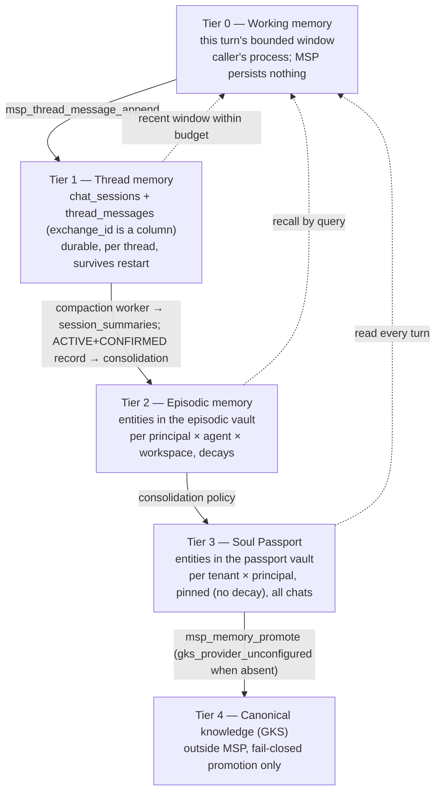

# DESIGN — Session, episodic, thread and instance memory for multi-user, multi-agent continuity

## สรุปภาษาไทย

**ฉบับ 0.9.7b (ล่าสุด)**: แก้ไขสองจุดที่ coordinator จับได้ใน 0.9.6b ก่อนส่ง
รีวิว — (1) `stableId` (`ids.mjs`) ใช้ NUL byte จริง ไม่ใช่ space ตามที่
0.9.6b เขียนผิด (ตรวจสอบซ้ำอิสระด้วย ripgrep binary-detection บนไฟล์จริง
ยืนยันแล้ว); `computeEntityId` ต่างหากที่ใช้ space จริง — เนื้อหาด้านล่าง
แก้ไขในที่เดิมแล้วให้ถูกต้อง ข้อสรุป (random ชนะ) ไม่เปลี่ยน แต่เหตุผล
"space พบบ่อยกว่า NUL จึงยิ่ง exploit ง่าย" ถูกถอนออก เพราะ NUL หายากใน id
จริง — random ยังชนะด้วยสองเหตุผลที่เหลือ (คีย์รั่วถาวร, ไม่ผูก tenant)
เพียงพอ ระบุไว้ชัดเจน. (2) ตรวจสอบ caller ของ zuri-ai เองโดยตรงแล้วที่
`scratchpad\zuri-extract\` (เดิมหาไม่เจอเพราะค้นจาก repo root ไม่ถึง Temp
directory) — ยืนยันตรงตามที่อ้าง: ไม่มี grant, ทิ้ง field principal,
ไม่ส่ง `allow_passport`, และ memory port แตะเฉพาะ `workspacePrivateVaultId`
เท่านั้น. ขอบเขตงานที่ขยายจาก coordinator ("fix it all") ได้รับการยืนยัน
จากเจ้าของจริงในบทสนทนาหลักแล้ว ไม่ใช่การส่งต่อที่ตรวจสอบไม่ได้อีกต่อไป.

**ฉบับ 0.9.6b**: RKOI และ Fable รีวิว v0.9.5b คู่ขนาน — ทั้งคู่ยืนยันกลไก
keyed `vault_id` ทนทาน (erasure/re-provision/rotation ทั้งสองทิศ/rotation
ระหว่างมีแถวใช้งาน/race สองการเชื่อมต่อ/receipt inversion 100k candidate)
แต่ทั้งคู่ตอบ NEEDS REVISION. รอบนี้**ทบทวนกลไกใหม่ทั้งหมดและเปลี่ยนไปใช้
`vault_id` แบบสุ่ม (`vaultRef(randomUUID())`)** แทนการคีย์ — เหตุผลที่เคยใช้
ปฏิเสธ id สุ่ม (ทำลาย GoVibe matching, ทำลายความหมาย `provision_epoch`) ทั้ง
สองข้อไม่จริงอีกต่อไปเมื่อคีย์เองก็ทำลายทั้งสองอย่างแล้ว ขณะที่คีย์ทิ้ง
ร่องรอยที่ id สุ่มไม่มี: คีย์รั่วคือถาวร (invert ได้ตลอดชีวิต vault, re-key
ไม่ได้), การชนกันจาก NUL byte ใน `stableId` ของ id หลายส่วน (แก้ไขจากที่
เคยเขียนผิดว่าเป็น space — ตรวจสอบระดับไบต์แล้ว: `ids.mjs` ใช้ `\0` จริง
ตามที่ comment หัวไฟล์บอกไว้ถูกต้อง; `computeEntityId` ต่างหากที่ใช้ space
จริง — Fable NOTE 1 กับ NOTE 2 คือคนละฟังก์ชันกัน), และ dictionary ไม่ผูกกับ
tenant. `provision_epoch`, probe loop และ `PROVISION_EPOCH_PROBE_LIMIT`
**ถูกตัดออกทั้งหมด** — ไม่จำเป็นอีกต่อไป. `DEC-MEMOS-50` REOPEN แก้ไขครั้งที่
หก, `RSK-MEMOS-14` ปิดจริง (ไม่ใช่แค่แคบลง) เพราะ `vault_id` ไม่เข้ารหัส
`principal_id` อีกต่อไปไม่ว่าจะมีคีย์หรือไม่.

**เพิ่มเติม (คำสั่งเจ้าของ "fix it all" ในบทสนทนาหลัก, ถ่ายทอดผ่าน
coordinator, ยืนยันแล้ว 2026-09-16 — ขยายขอบเขตงานนี้สามข้อ):** (1) trust
model ของ vault การเข้าถึง principal vault เปลี่ยนจาก self-asserted เป็น
ต้องมี signed grant จริง — ใช้กลไกเดียวกับ API-011 (`verifyThreadGrant`),
ไม่ใช่คิดกลไกใหม่; `DEC-MEMOS-40` REOPEN, `RSK-MEMOS-12` แก้ไข. (2)
`RSK-MEMOS-16` (`global_private` ไม่มีการกั้นเลย) ผูกกับ grant เดียวกัน
เมื่อทำได้; Fable NOTE 2 (`computeEntityId` ชนกันที่ตัวคั่นช่องว่างจริง —
ตรวจสอบระดับไบต์แล้ว) แก้ด้วยการปฏิเสธตัวคั่นที่ validation ไม่ใช่เปลี่ยน
derivation; Fable NOTE 1 (การชนกันจาก NUL byte ใน `stableId`, คนละฟังก์ชัน
กับ NOTE 2) ปิดโดยโครงสร้างเมื่อเปลี่ยนไปใช้ id สุ่ม. (3) กลไก keyed กับสุ่ม
ยังตัดสินด้วยความถูกต้องเป็นหลัก ไม่ใช่ด้วยข้อ (1). **ข้อเท็จจริงเกี่ยวกับ
caller ของ zuri-ai ที่อ้างในคำสั่งนี้ ตรวจสอบเองโดยตรงแล้ว (ไม่ใช่แค่อ้างจาก
คำสั่ง) โดยอ่านไฟล์จริงที่ coordinator ชี้ตำแหน่งให้ถูกต้อง —
`msp-vault-resolver.js` (`resolve()`, บรรทัด 126-146) ส่ง `{actor,
access_context, authorization}` เท่านั้น ไม่มี `access`/`grant`/`signature`
เลย; `validateVaultSet` (บรรทัด 89-114) คืนเฉพาะ
`workspacePrivateVaultId`/`globalPrivateVaultIds`/`sharedVaultIds`/
`permissions` — ทิ้ง field principal ทุกตัวจริง; `authorizationFacts()`
(บรรทัด 71-87) ไม่มี key `allow_passport` เลย; และ
`msp-vault-memory-port.test.js` (บรรทัด 46-96) พิสูจน์ว่า
`recallAuthorized`/`rememberAuthorized` เรียก `msp_memory_list`/
`msp_memory_upsert` ด้วย `vault_id: 'opaque-workspace-vault'`
(`workspacePrivateVaultId`) เท่านั้น ไม่แตะ principal vault field ใดเลย
และไม่ส่ง `access_context`/grant บน call เหล่านี้เลยเช่นกัน — ยืนยันเต็มที่
ว่าการบังคับ signed grant กับ principal vault ไม่กระทบ caller ที่ deploy
จริงนี้ เพราะมันไม่เคยแตะ principal vault ตั้งแต่แรก.**

**ฉบับ 0.9.5b**: Fable รีวิวอิสระพบ critical ใหม่ — journal receipt
ของ `msp_vault_resolve` (`ref: vault_id` บวก payload plaintext ของ
tenant/agent/workspace) กู้คืน `principal_id` ดิบได้จริงด้วย dictionary
attack เพราะ `vault_id` เป็น keyless hash, ทั้งที่ `actor` ทำ HMAC ไว้แล้ว —
พิสูจน์จริงกับ `principal_id` ที่ resolve จริง. รวมกับช่องโหว่เดิม (v0.9.4b)
และ `msp_vault_mount` ที่เป็น oracle ที่สอง ทั้งสามเรื่องสืบไปที่รากเดียวกัน:
`vault_id` เป็น keyless hash ของ person identifier — **จึงทบทวนทางเลือก (b)
คีย์ vault_id ใหม่ตามเนื้อผ้า**: พบว่าคีย์เฉพาะส่วน `principal_id` (คำนวณที่
handler ไม่ใช่ `VaultRegistry`) ไม่ขัดกับข้อจำกัดเดิม เพราะ lookup ของ active
row ใช้ plaintext WHERE clause อยู่แล้ว (ไม่เคยคำนวณ/เทียบ vault_id) และ
epoch probe ใช้ input สดของ call นั้นเองเสมอ — ไม่มี migration ใหม่, ไม่มี
column ใหม่. `DEC-MEMOS-50` ถูก REOPEN แก้ไขครั้งที่ห้า, เพิ่ม `DEC-MEMOS-55`
ปิด journal leak เป็นผลพลอยได้โดยตรง, และแก้ข้อความ error ของ
`links_create`. สิ่งที่ยังไม่ปิด: ผู้โจมตีที่มีคีย์ยังคง invert ได้ (เหมือน
`erasure_receipts`), `tenant_id`/`agent_id`/`workspace_id` ยังเป็น
plaintext, `global_private` ยัง keyless ด้วย `agent_id`, และ
`msp_vault_resolve` provision วอลต์ legacy ทั้งสามแบบไม่มีเงื่อนไขอยู่แล้ว
(บันทึกไว้ ไม่ได้แก้). รายละเอียดเต็มใน ADR's สอง revision notes และ
§5.2/§5.3/§5.5/§15/§19.

**ฉบับ 0.9.4b**: RKOI พบช่องโหว่ vault-isolation ระหว่างรีวิวโค้ด
PH-MEMOS-5 ของ KIN — เก้าเครื่องมือ `msp_memory_*` เช็ค `access_context`
**หลัง** จาก lookup vault/entity, และ `vault_id`/`entity_id` เป็น unkeyed
hash คำนวณออฟไลน์ได้ ผู้โจมตีจึงแยก `not_found` (ไม่มีจริง) ออกจาก
`access_context_required`/`access_context_denied` (มีจริงแต่ไม่ได้รับอนุญาต)
ได้โดยไม่ต้องส่ง `access_context` เลย — เป็นช่องโหว่ใน spec ที่อนุมัติแล้ว
ไม่ใช่ข้อผิดพลาดของโค้ด. ทางแก้ (b) คีย์ `vault_id` ด้วย
`MSP_IDENTITY_HMAC_KEY` ถูกปฏิเสธทันที เพราะขัดกับกลไก derive-then-probe
ของ `DEC-MEMOS-50` ที่ RKOI อนุมัติแล้วและสั่งห้ามแก้; ทางแก้ (a) ตามที่เสนอ
ครั้งแรก ("absent เหมือน denied") ก็ถูกปฏิเสธเช่นกัน เพราะขัดกับสัญญาที่ว่า
`access_context` ที่หายไปต้องไม่เปลี่ยนพฤติกรรม legacy — **รับทางกลับด้าน
แทน**: vault/entity ที่มีจริงแต่ไม่ได้รับอนุญาต ตอบ `not_found` เหมือนกับไม่มี
จริงทุกประการ (message เดียวกัน, code เดียวกัน) เพราะ `not_found` คือคำตอบ
เดิมของ legacy caller อยู่แล้วเมื่อไม่ส่ง `access_context`. `DEC-MEMOS-44`/
`49` ถูก REOPENED และแก้ไข, เพิ่ม `DEC-MEMOS-54` ใหม่ (ครอบคลุม
`msp_vault_mount` และเครื่องมือ context) — ทั้งหมดรอเจ้าของยืนยันใหม่ ไม่ใช่
ส่วนหนึ่งของการยืนยัน `DEC-MEMOS-36..53` เดิม. สิ่งที่ยังไม่ปิด: timing side
channel บน stdio boundary เดียวกัน (`RSK-MEMOS-15` ใหม่, ยอมรับไว้ไม่ปิด).
รายละเอียดเต็มอยู่ใน ADR's revision note และ §5.1/§5.2/§5.4/§14/§15/§19.

**ฉบับ 0.9.3b**: เจ้าของยืนยัน `DEC-MEMOS-36..53` แล้ว ("ตามนั้น")
ตอบสรุปที่มีคำถามเปิดสามข้อจาก `DEC-MEMOS-53` — status-only, ไม่แก้เนื้อหา
decision ใดเลย. สองในสามคำถามมีข้อสรุป: work factor ของ `scrypt` ยืนยันตามที่
สเปคไว้ — `BL-MEMOS-076` วัด wall-clock cost จริงก่อนแล้วค่อยปรับ ดังนั้น
`N=16384, r=8, p=1` คือจุดเริ่มต้น ไม่ใช่ค่าสุดท้ายที่ตรึงไว้. คำถามที่สาม —
ควรขยาย domain separation/key versioning ของ `DEC-MEMOS-53` ไปถึง
`hmacPrincipal` pseudonym ของ journal เองและ room-ref hashing หรือไม่ —
ถูกยกขึ้นมาโดยไม่มีข้อเสนอแนบมาด้วย **ไม่ถูกยืนยัน**, ยังเปิดอยู่, บันทึกไว้ใน
§19 ควบคู่กับคำถามเปิดอื่นของ design นี้ ไม่ถูกเขียนเป็น decision ใดว่า adopted.

**ฉบับ 0.9.2b**: New owner decision (PH-MEMOS-6 deliverable,
not PH-MEMOS-5 — ไม่แตะ/ไม่บล็อก PH-MEMOS-5 ที่ RKOI อนุมัติให้ implement
แล้ว): `erasure_receipts` เลิกเก็บ `principal_id` ดิบ — เปลี่ยนเป็น keyed
HMAC (`MSP_IDENTITY_HMAC_KEY`, domain-separated จาก journal actor
pseudonym) ต่อด้วย slow KDF (`scrypt`, per-row salt) เก็บคู่กับ
`identity_key_version` ใหม่ (ต้องมี `MSP_IDENTITY_HMAC_KEY_VERSION`, และ
`MSP_IDENTITY_HMAC_KEYRING` ใหม่สำหรับ retained historical key ตอน
rotation) — **`DEC-MEMOS-53`, ใหม่, adopted default pending owner
confirmation**, supersede เฉพาะครึ่ง storage ของ `DEC-MEMOS-28`
(ครึ่ง permanence ไม่เปลี่ยน — receipt ยังถาวรและ immutable เหมือนเดิม).
Migration ใหม่ `0013` (§12.5, vaults-shaped rebuild ของ `erasure_receipts`
เอง, ไม่ใช่ additive — ต้อง drop+recreate สอง immutability trigger ของ
ตารางนี้เอง). `RSK-MEMOS-14`'s "dominated by `erasure_receipts`" sentence
ถูกจำกัดขอบเขตใหม่ (ไม่ใช่ปิดทั้งหมด — บอกตรงๆ ว่าเหลืออะไรที่ยัง
re-identify ได้). Backlog ใหม่ `BL-MEMOS-076` (PH-MEMOS-6).

**ฉบับ 0.9.1b**: RKOI PH-MEMOS-5 review รอบ 5 ปิดงาน (CLOSED, 0
critical, 2 warnings ที่เป็นแก้ถ้อยคำอย่างเดียว) ต่อ v0.9.0b — กลไก
provisioning ไม่แตะอีก แก้แค่ (1) ข้อความ trigger `trg_vaults_no_delete`
ให้ตรงกับ sibling triggers ทุกตัว (`'<table> rows may never be deleted'`)
และแก้ proof requirement ทั้งสามจุดที่เขียนว่า `changes = 0` ให้ตรงกับพฤติกรรม
จริง (`RAISE(ABORT)` โยน error ไม่คืนค่า `changes`) และ (2) เพิ่มประโยคอ้างอิง
`DEC-MEMOS-28`/`erasure_receipts` ใน `RSK-MEMOS-14` (ทั้งที่นี่และใน plan)
และใน §19's `DEC-MEMOS-50` ว่า receipt table เก็บ `principal_id` ดิบถาวร
อยู่แล้ว ทำให้ risk ที่วัดได้ (~2.5 core-hours) เป็นแค่ต้นทุนของอีกหนึ่งเส้นทาง
ไม่ใช่ต้นทุนของการเปิดเผยทั้งหมด — ไม่มี decision ใดถูกเปิดใหม่.

**ฉบับ 0.9.0b**: ตอบ RKOI PH-MEMOS-5 review รอบ 4 (NEEDS
REVISION, 1 critical, 3 warnings) ต่อ v0.8.0b — กลไก provisioning เอง
**อนุมัติแล้ว ไม่แก้อีก**: RKOI รัน provision/erase/re-provision/erase/
re-provision ซ้ำ, ข้าม `MSP_IDENTITY_HMAC_KEY` rotation จำลอง, ข้าม key
ที่ไม่ตั้งค่าเลย, และ race จริงสองคอนเนกชันบน WAL แล้วพังไม่ได้เลย
สิ่งที่เหลือคือปัญหาเอกสาร/decision ที่มี schema deadline ผูกอยู่
**CRITICAL**: การลบแค่ `principal_id` ตอน erase ไม่ใช่ disposition —
`0011`'s CHECK เว้นเฉพาะ `principal_id`, `tenant_id`/`agent_id`/
`workspace_id`/`provision_epoch` ของแถวที่ erase แล้วยังเป็น plaintext
ทั้งหมด ทำให้ `vault_id` (unkeyed `stableId` hash ของ tuple) เหลือ
unknown แค่ตัวเดียว RKOI brute-force กู้ `principal_id` คืนได้จริง 3/3
แถวทดสอบ ที่ 1,095,290 candidate/sec ไม่ใช้ key เลย (~2.5 core-hours สำหรับ
id สิบหลัก) — ไม่ใช่การถอยหลังจากรอบก่อน (round 2 ก็ derive จาก raw tuple
เหมือนกัน อยู่แล้ว) แต่ §5.2's "same scheme every other vault type...
already uses" (บรรทัด 902 เดิม) เป็นการอ้าง precedent ที่ผิด — ทุก legacy
type อื่น hash จาก project/workspace/agent id เท่านั้น ไม่มีชื่อคน;
`principal_private`/`principal_passport` เป็นสอง vault type แรกที่
preimage ของ id มีชื่อคนอยู่จริง แก้โดย: (1) แก้ถ้อยคำ §5.2 บรรทัด 902 ให้
ตรง (2) แก้ §11.1's `vaults` row ให้บอกตรงๆ ว่าการลบ `principal_id`
ทำอะไรได้/ไม่ได้ (3) ขยาย (ไม่ใช่บังคับ) `trg_vaults_update_guard` branch
(b) ให้ `NEW.tenant_id`/`NEW.agent_id`/`NEW.workspace_id` เป็น NULL ได้ด้วย
ตอน `active -> erased` — ตรวจแล้วว่าไม่กระทบ probe scheme/partial unique
index/query อื่นใด เพราะ `0011`'s CHECK เดิมก็อนุญาตค่าพวกนี้เป็นอะไรก็ได้
ตอน erased อยู่แล้ว มีแค่ trigger เท่านั้นที่ pin เกินจำเป็น — เปิดทางให้
PH-MEMOS-6 เสริมความเข้มได้โดยไม่ต้อง rebuild migration รอบสอง (4)
บันทึกความเสี่ยงที่เหลือเป็น `RSK-MEMOS-14` ใหม่ พร้อมตัวเลขที่วัดได้
พร้อมประโยคเพิ่มใน §19's `DEC-MEMOS-50` **คำเตือนที่แก้**: `vaults` ไม่มี
trigger กัน `DELETE` เลย ขณะที่ตารางอื่นทุกตัวใน `0008`/`0009`/`0010` มี —
ถ้าแถวที่ erase แล้วถูกลบจริง epoch 0 จะ mint ซ้ำได้อีก เพิ่ม
`trg_vaults_no_delete` เข้าไปใน `0011` (W1); `PROVISION_EPOCH_PROBE_LIMIT`
โยน error ธรรมดา ไม่มี code, ไม่อยู่ใน §14/GATE-MEMOS-5/proof column ของ
`BL-MEMOS-060/061` — แก้โดยเพิ่ม proof row ให้ `BL-MEMOS-061` พิสูจน์ว่า
bound นี้ไม่มีทางถึงจริงภายใต้การทำงานปกติ ไม่ใช่เพิ่ม client-facing code
ใหม่ (W2); §0.1/ADR บรรทัดที่พูดถึง `principal_hmac` ไม่ถูกลบตอน erase
เป็นข้อเท็จจริงของ schema รอบ 2 (v0.7.0b) ณ ตอนตรวจเท่านั้น ไม่ใช่สถานะของ
v0.8.0b เอง — ทำเครื่องหมายเป็นบันทึกประวัติ ไม่ใช่สถานะปัจจุบัน (W3)

**ฉบับ 0.8.0b**: ตอบ RKOI PH-MEMOS-5 review รอบ 3 (NEEDS
REVISION, 3 critical, 5 warnings) ต่อ v0.7.0b — schema `0011` กับ lifecycle
erase/re-provision ถูกรันจริงกับ populated database แล้วยืนยันถูกต้อง
(epoch เดินหน้า, id ไม่ชนกัน, `principal_hmac` ไม่ถูกลบ/แก้ตอน erase, ไม่มี
row ที่ epoch ต้องพึ่งแล้วขาด `principal_hmac`) **— บันทึกประวัติ (ทำ
เครื่องหมายชัดเจน แก้ไขรอบ 4, WARNING 3): ข้อเท็จจริงชุดนี้เป็นของ schema
v0.7.0b ที่ RKOI ตรวจ ณ ตอนนั้น ไม่ใช่สถานะของ v0.8.0b เอง — CRITICAL 2
ของรอบนี้เอง (ด้านล่าง) ลบคอลัมน์ `principal_hmac` ออกทั้งหมดไปแล้ว** —
CRITICAL 3 ของรอบ 2
(unified gate) ปิดจริงตามที่ยืนยัน **CRITICAL 1 (รอบ 3)**: ย่อหน้าอ้างว่ามี
catch `SQLITE_BUSY_SNAPSHOT` ใน `#provisionPrincipalVault` แต่ code block
เองไม่มี try/catch เลย ทำให้ raw `SqliteError` หลุดออกไปจริง
`vault_provision_conflict` ไม่เคยเกิดขึ้น — แก้โดยใส่ catch เข้าไปใน code
block จริง ลบประโยค "no catch/retry lives here" ที่ขัดแย้งกันเองออก
**CRITICAL 2 (รอบ 3, สำคัญที่สุด)**: กลไก epoch ทั้งหมดพึ่ง
`MSP_IDENTITY_HMAC_KEY` ไม่เปลี่ยนตลอดอายุระบบ ซึ่งไม่จริง — RKOI พิสูจน์
ว่า provision ใต้ KEY1, erase, หมุนกุญแจเป็น KEY2, แล้ว re-engage ทำให้ชน
PRIMARY KEY ซ้ำเหมือนเดิมทุกประการ ทบทวนสามทางเลือก (เก็บ
`principal_hmac` รับ gap; หา `vault_id` ก่อนแล้ว probe หาว่ามีอยู่หรือยัง;
เลิกอิง owner tuple สร้าง id แบบสุ่ม) แล้วเลือกทางที่สอง — probe
`vault_id` ตรงๆ ไม่ query ผ่านคอลัมน์ที่เก็บไว้เลย จึงไม่ขึ้นกับ key
rotation และไม่ขึ้นกับ erasure ทั้งคู่ ลบคอลัมน์ `vaults.principal_hmac`
ออกทั้งหมด (column, CHECK สองจุด, index สองตัว, trigger pin) —
`principal_hmac` เหลือแค่ actor pseudonym ใน journal ของ §5.3 เท่านั้น ไม่
ผูกกับ provisioning อีกต่อไป บันทึกความเสี่ยงที่เหลือ (journal actor
ไม่ต่อเนื่องข้าม rotation, ไม่ crash) เป็น `RSK-MEMOS-13` ใหม่ **CRITICAL
3 (รอบ 3)**: `DEC-MEMOS-49`/`50` ใน §19 (ลิสต์ที่ owner ใช้ยืนยัน) ยังบรรยาย
กลไกเก่าที่ถูกแทนที่ไปแล้ว — แก้ทั้งสองรายการให้ตรงกับกลไกจริงล่าสุด
พร้อม grep ทุกเอกสาร (ADR checklist, plan decision table/backlog) หา
ข้อความกลไกเก่าที่เหลือ **คำเตือนที่แก้**: SQLITE_BUSY ธรรมดาใช้เวลาจริง
5511ms หลัง `busy_timeout=5000` ไม่ใช่ untyped ทันที (W1); §5.3.1 บอก
พฤติกรรม caller จริงผิด — zuri-ai ไม่มี retry เลย ทำให้
`rememberAuthorized` เสีย memory write จริงถ้าชน race, เพิ่มไว้ที่
`BL-MEMOS-113` (W2); HMAC input เดิมกำกวมที่ตัวคั่น `|` แก้เป็น
length-prefixed (W3); §14 เพิ่มตารางสรุป error class ใหม่สามตัวของ
PH-MEMOS-5 ไว้อ้างอิง (W4); `mountVault` ก็ได้รับผลจาก status refusal
ใหม่ด้วย ระบุไว้หนึ่งประโยค (W5)

**ฉบับ 0.7.0b**: ตอบ RKOI PH-MEMOS-5 review รอบ 2 (NEEDS
REVISION, 3 critical, 7 warnings) ต่อ v0.6.1b — เฉพาะ critical 1/3/4 ของรอบ 1
ที่ปิดจริง ส่วน critical 2 ของรอบ 1 ยังไม่ปิด **CRITICAL 1 (รอบ 2)**:
กลไก `provision_epoch` ของรอบก่อนยัง query หา generation เดิมด้วย
`principal_id` ซึ่งถูกลบเป็น NULL ตอน erasure (ตาม CHECK ของ §12.4 เอง)
ทำให้หา MAX(provision_epoch) ไม่เจอหลัง erasure แล้วชน PRIMARY KEY ซ้ำ
อย่างเดิม — แก้ด้วยคอลัมน์ใหม่ `vaults.principal_hmac` (HMAC ของ
tenant_id+principal_id ที่คำนวณครั้งเดียวฝั่ง `msp_vault_resolve` handler
ไม่ใช่ใน VaultRegistry) ซึ่ง trigger ใหม่ pin ไว้ไม่ให้ erasure ลบทิ้ง
ใช้คอลัมน์นี้แทน principal_id ในการหา epoch **CRITICAL 2 (รอบ 2)**: ข้อความ
race ของรอบก่อนยังอ้าง constraint ผิดอีกครั้ง — ตรวจกับ connection จริง
สองตัวบน WAL database แล้วพบว่าเป็น SQLITE_BUSY/SQLITE_BUSY_SNAPSHOT
ไม่ใช่ PRIMARY KEY เลย (SQLite serialize writer เดียว ผู้แพ้ไม่เคยถึงจุด
insert จริง) — เอา retry loop ภายในออกทั้งหมด เปลี่ยนเป็น catch
SQLITE_BUSY_SNAPSHOT พอดีแล้วโยน error ชนิดใหม่ `vault_provision_conflict`
ให้ผู้เรียกลองใหม่เอง (ตรงกับ pattern ที่ §7.1 ใช้อยู่แล้ว) เพราะ retry
ภายใน transaction เดียวกับที่ §5.3 ครอบไว้ (SAVEPOINT ซ้อน) มองไม่เห็น
commit ของอีกฝั่งอยู่ดี **CRITICAL 3 (รอบ 2, พบใหม่)**: จุดเช็ค
`access_context` ไม่เคยตรวจ `status` ของ vault เลย ทำให้ vault ที่ถูก
erase แล้ว (ซึ่ง tenant/agent/workspace ยังอยู่ แค่ principal_id ถูกลบ)
ยังอ่านผ่านได้ถ้า access_context ตรงกับค่าที่เหลือ — แก้โดยรวม
`isVaultAccessibleTo`/`classifyPrincipalAccess` เป็นชุด branch เดียว
(`#isVaultRowAccessibleTo`) ที่เช็ค status ก่อนเทียบ tuple ใดๆ ทั้งหมด และ
ลบ pseudocode ที่ซ้ำกันใน §5.1 ออก เหลือจุดอ้างอิงเดียว ส่วนคำเตือนทั้งเจ็ด
ข้อถูกพับเข้าตามจุดที่ระบุ (unknown key ของ access_context ถูกรับไว้เฉยๆ
ไม่ error; เอกสาร MSP_IDENTITY_HMAC_KEY เพิ่มใน §13/§14; `isVaultAccessibleTo`
ไม่ SELECT ซ้ำอีกต่อไป; branch ของ principal type ย้ายมาก่อน mount
short-circuit; `include_payload` แก้เหตุผลไม่ให้อ้างว่าปิดช่องที่ยังไม่เปิด
จริง; ประโยคเรื่อง context_id คือจุดแข็งจริงของ control ถูกเพิ่มใน §5.4)

**ฉบับ 0.6.1b**: ตอบ RKOI PH-MEMOS-5 review รอบ 1 (NEEDS
REVISION, 4 critical, 7 warnings) ต่อ v0.6.0b **CRITICAL 1**: จุดเช็ค
`access_context` ไม่ได้ใช้ call site เดิมของ `assertVaultScope` ตามที่
เขียนไว้ผิด — `isVaultAccessibleTo` มี caller จริงจุดเดียวคือ
`msp_vault_mount`; แก้เป็นจุดเช็คใหม่เก้าจุดใน `memory-handlers.mjs`
ผ่านฟังก์ชันใหม่ `classifyPrincipalAccess` (domain) และ
`assertAccessContext` (contracts, error class ใหม่สองตัว) **CRITICAL 2**:
การ provision vault ซ้ำหลัง erasure ชน `PRIMARY KEY` ของ `vault_id` เดิม
(ไม่ใช่ partial unique index ตามที่เขียนผิด) และเสี่ยง "ฟื้นคืนชีพ"
เนื้อหาของ principal ที่ถูกลบไปแล้ว — แก้ด้วยคอลัมน์ใหม่
`vaults.provision_epoch` ผสมเข้าไปใน id แบบ deterministic **CRITICAL 3**:
`msp_context_resolve` ไม่เคยมีฟิลด์ `access_context` หรือ write path จริง
เลย — กำหนดครบตั้งแต่ request จนถึง `insertContext`, พร้อมแก้
`include_payload` ให้จำกัดเฉพาะ `msp_context_diff` เท่านั้น (audit/replay
ไม่มี payload ให้ปิดกั้นอยู่แล้ว) **CRITICAL 4**: มีเครื่องมือ
`msp_memory_*` จริงสิบตัว ไม่ใช่เก้า — ตัวที่สิบ `msp_memory_promote`
อยู่ใต้ API-006 ถูกต้องแล้วที่ไม่รวมในเก้าตัวของ §5.1 แต่ข้อความเดิมอ้างผิด
ว่า "ไม่ต้อง special-case" — จริงๆ แล้วเครื่องมือนี้ไม่เคยอ่าน source vault
เลยจึงไม่มีคำถามเรื่อง eligibility ให้ตรวจสอบตั้งแต่แรก แก้ไขคำกล่าวอ้าง
และบันทึกไว้ว่าถ้าจะขยายเครื่องมือนี้ในอนาคตต้องเพิ่ม gate เอง เพิ่ม
**`DEC-MEMOS-49..52`** ใหม่

**ฉบับ 0.6.0b**: กำหนดสเปก PH-MEMOS-5 (principal vault, API-010
`msp_vault_resolve`, ส่วนขยาย `access_context` ของ API-009, ใบเสร็จ
`contexts` แบบ scoped, กติกา vault หลาย agent) แบบละเอียดครั้งแรก ยังไม่ผ่าน
RKOI review — เขียนขึ้นตามที่ `docs/IMPLEMENTATION-PLAN-MEMORY-OS.md`'s
`BL-MEMOS-060..068`/`105` กำหนดไว้ ประเด็นหลัก: เพิ่ม vault สองชนิดใหม่
`principal_private` (episodic, ผูกกับ tenant×principal×agent×workspace)
และ `principal_passport` (ผูกกับ tenant×principal เท่านั้น, อ่านได้เมื่อมี
`allow_passport` เท่านั้น) โดยย้าย `vaults` ตาราง (migration ใหม่ `0011`,
เพราะ `0008`-`0010` มีจริงบน `main` แล้ว) ด้วยลำดับปลอดภัย (สร้างตารางใหม่
คัดลอก ลบ เปลี่ยนชื่อ) พร้อม `-- msp-migration: foreign-keys=off` เนื่องจาก
มีตารางลูกจริงสี่ตารางอ้างอิงอยู่ `msp_vault_resolve` ถูกออกแบบให้ตรงกับ
caller จริงของ zuri-ai (`msp-vault-resolver.js`, `origin/main` ที่
`4ca28c1d`) ซึ่งไม่มีลายเซ็น ไม่มี `allow_passport` เลย และตรวจสอบ
`project_id` ที่ไม่มีความหมายฝั่ง principal vault — ทุกจุดไม่ตรงกันถูกระบุ
ไว้ตรงๆ พร้อมทางแก้แบบเพิ่มเติมเท่านั้น (additive) ไม่ทำลายของเดิม ส่วน
API-009 ได้ `access_context` เป็นฟิลด์ใหม่ทางเลือก (บังคับเฉพาะ vault
ประเภท principal) บนทั้งเก้าเครื่องมือ `msp_memory_*` รวมถึงเครื่องมือที่
รับแค่ `entity_id`

**ฉบับ 0.4.2b**: RKOI **อนุมัติ** stage-2 spec round 2 ที่
`72e593f` (0 critical) พร้อมขอให้พับคำเตือนก่อน KIN ลงมือ ประเด็นหลัก:
**คำตอบตอน supersede ขัดแย้งกันเอง** — รอบก่อนเพิ่ม `thread_scope_denied`
เป็นคำตอบที่สาม ซึ่งกลายเป็น oracle เอง (บอกได้ว่า agent อื่นเคยบันทึก
อะไรไว้) คำสั่งเจ้าของ: รวมทุกกรณี (id ไม่มีจริง, แถว AGENT ของ agent อื่น,
และกรณี ownership/status เดิมของ stage 1 ที่เคยเป็น `conflict`) ให้เป็น
`validation_failed` คำตอบเดียวกันทั้งหมด จำกัดเฉพาะแถว `AGENT`-visibility
เท่านั้น ส่วนแถว `THREAD`/legacy ยัง supersede ได้ตามกติกาเดิม; แก้
`trg_thread_pending_deliveries_update_guard` ให้ pin `agent_id`/
`workspace_id` ด้วย (ไม่ใช่ trigger เดียวที่ drop+recreate ตามที่คอมเมนต์
เดิมเข้าใจผิด); จุดเช็ค agent ตอน drain ต้องเทียบกับ thread ของ inbound
message เอง ไม่ใช่ ACTIVE thread ของห้องที่หามาใหม่; ระบุชัดว่าไม่มี
`speakerId` คงที่ที่ไหนเลยใน MSP — resolved path ใช้ `grant.agentId`,
drain path ใช้ agent ที่บันทึกไว้; nonce ของ resolve ถูกบันทึกทุกผลลัพธ์
(mint, attach, no-op); เพิ่ม `thread_kind`/`channel_type` ใน response ของ
`msp_session_sweep`; และเพิ่ม **`DEC-MEMOS-21`** (ขอบเขตความยาว
`agentId`/`workspaceId` ที่ 128 ตัวอักษร) จากข้อความที่ไม่เคยมีเลขกำกับ

**ฉบับ 0.4.1b**: ตอบ RKOI stage-2 review round 1 (`f74ad0d`,
NEEDS REVISION, 2 critical) — schema §12.2 เองผ่าน ใช้กับ runner จริงได้
ทั้งฐานข้อมูลใหม่และมีข้อมูลอยู่แล้ว ไม่ rebuild ตารางไหนเลย **CRITICAL 1**:
เส้นทาง delivery ที่ยังไม่มี inbound message ไม่เก็บ agent เลย ทำให้
`#drainDeliveries` ใส่ข้อความ OUTBOUND ภายใต้ `speakerId` คงที่
`'zuri-line-agent'` ได้ไม่ว่า delivery-writer คนไหนของห้องนั้น — แก้โดยให้
`thread_pending_deliveries` เก็บ `agent_id`/`workspace_id`, ต้องเป็น agent
ปัจจุบันของ ACTIVE thread ของห้องนั้นก่อนคิว, และตอน drain ต้องเช็คซ้ำว่า
agent ยังเป็น current อยู่ ไม่งั้นปล่อยแถวไว้ไม่ reconcile
(`reconcile_skipped`) **CRITICAL 2**: hash ของ `record_id` ไม่รวม
`agent_id`/`visibility` ทำให้ agent B บันทึกเนื้อหาเดียวกับ agent A แล้ว
ได้แถว AGENT ของ A กลับมา, และ supersede แถวของ agent อื่นได้โดยไม่เช็ค
`agent_id` เลย — แก้โดยรวมสองคอลัมน์นี้เข้า hash และปฏิเสธการ supersede
ข้าม agent ด้วย `thread_scope_denied` (เหมือน id ที่ไม่มีอยู่จริง ไม่ให้
เป็น oracle) นอกจากนี้แก้ keyring ให้ตรงกับโค้ดที่ KIN กำลังทำอยู่ (JSON
object เท่านั้น ไม่มี file path, refuse to start ด้วย
`thread_keyring_config_invalid`), ย้าย nonce insert เข้า transaction ของ
store เอง (เพราะ handler เป็น async), ถอนคำอธิบาย "revocation" ที่ผิดออก
จาก `DEC-MEMOS-18`, และเพิ่ม `DEC-MEMOS-19`/`DEC-MEMOS-20` จากข้อความที่
ไม่เคยมีเลขกำกับมาก่อน

**ฉบับ 0.4.0b**: กำหนดสเปก stage 2 (multi-agent) แบบละเอียด
ครบทุกจุดเป็นครั้งแรก ตามคำสั่งเจ้าของ 2026-09-14 ให้เดินหน้างานที่วางแผนไว้
ต่อ — เขียนจากโค้ด stage 1 จริงที่ `feat/memos-002-thread-memory` commit
`707406d`. ประเด็นหลัก: grant เพิ่ม `agentId`/`workspaceId` (บังคับทุก
เครื่องมือ) กับ `nonce` (บังคับทุกเครื่องมือที่เขียนข้อมูล ยกเว้น
`msp_thread_message_append`) พร้อม error code ใหม่สองตัว
`grant_nonce_required`/`grant_replayed`; ตาราง `thread_agents` (โครงสร้าง
เดียวกับ `thread_participants`) กำหนดว่า agent ไหน "current" บน thread
ไหน; **`DEC-MEMOS-18`**: worker ใช้ `agentId` ของตัวเอง เข้าร่วม thread ผ่าน
`assertAgents` และ resolve จาก grant ของ worker สร้าง thread ใหม่ไม่ได้; `protected_memory_records`
เพิ่มคอลัมน์ `agent_id`/`visibility` (`AGENT`/`THREAD`) ผ่าน `ALTER TABLE`
เท่านั้น ไม่ rebuild ตาราง; **`DEC-MEMOS-18`** และ **`DEC-MEMOS-17`**
(stage 2 ไม่มี compatibility flag ให้ zuri-ai เพราะ activation ถูกกัน
ด้วย `BL-MEMOS-090` อยู่แล้ว) เจ้าของยืนยัน `DEC-MEMOS-17..21` แล้วเมื่อ 2026-09-14
ส่วน `DEC-MEMOS-01..16` เจ้าของยืนยันแล้วเมื่อ 2026-09-14 ("ยืนยัน") บันทึก
ไว้ที่ commit `214a7d2` บนสาขาเดิม

**ฉบับ 0.3.4b**: รอบที่ RKOI **อนุมัติแล้ว (0 critical)** แต่ขอให้พับ
คำเตือน 9 ข้อเข้ามาก่อน merge จึงไม่ใช่การแก้ NEEDS REVISION เหมือนสามรอบ
ก่อนหน้า ประเด็นสำคัญที่สุดคือ **ช่องโหว่ cross-room ที่ยังไม่มีงานในแผน**:
การเรียกเครื่องมือบน thread ที่มีอยู่แล้วตรวจ tenant/business/account
แต่ไม่ตรวจ "ห้อง" เลย และ `msp_session_compaction_claim` ไม่ตรวจ scope
อะไรเลย ทำให้ grant ของ worker ห้อง R1 claim งานของห้อง R2 แล้วได้
`sources` ของห้องอื่นไปได้ — เพิ่ม **BL-MEMOS-111** ให้ทุกเครื่องมือที่ผูกกับ
thread ต้องเทียบ room hash ของ grant กับ hash ที่เก็บไว้ของ thread นั้น
รวมถึง claim/commit/retry ผ่าน thread ของ job ด้วย

รอบนี้ยังแก้การวินิจฉัยที่ผิดของรอบก่อน: ค่า `DEFAULT ''` เดิมทำให้ trigger
**ปฏิเสธ** การ insert ที่ tenant ไม่ตรง (ไม่ใช่ปล่อยผ่านเงียบ ๆ อย่างที่เขียนไว้ผิด)
บั๊กจริงคือพอเปลี่ยนเป็น `NOT NULL` แล้ว handler ที่ยังใช้ `INSERT OR IGNORE`
จะกลืน NOT NULL violation แบบเงียบ ๆ (`changes=0`) ไม่ insert อะไรเลย ต้องเปลี่ยน
handler เป็น `ON CONFLICT(summary_id) DO NOTHING` และ trigger ต้องใช้ `IS NOT`
แทน `<>` เพื่อไม่พลาดค่า NULL

กติกา audience ก็เปลี่ยนทิศทาง: `audienceKind` เป็นข้อบังคับ (required) บน
ทุกเครื่องมือยกเว้น `msp_thread_delivery_record` ไม่ใช่แค่ "เช็คถ้ามีมา" อย่างที่
เขียนไว้ก่อนหน้า ส่วนกติกาความจำ session ก็แก้จากเดิมที่บอกว่ามีสถานะเปิดอยู่
อย่างละหนึ่งเสมอ เป็น "OPEN ได้อย่างมากหนึ่งเดียว" เพราะ reconciliation ทำให้มี
สถานะกำลังปิดกับสถานะเปิดพร้อมกันได้จริงตามปกติ

**DEC-MEMOS-15** ถูกเข้มขึ้น: ต้องเช็ค `person_id` ของแถวที่เก็บไว้จริงด้วย
ไม่ใช่แค่ค่าที่ส่งมา, การอัปเกรดต้องปิดแถวเก่าแล้วเปิดแถวใหม่ในธุรกรรมเดียว
(ไม่ใช่ทางเลือกของ implementation) และบันทึกไว้ชัดว่าการ "ถอนการยืนยัน" ยัง
ทำไม่ได้จนกว่าจะมีเครื่องมือ lifecycle — MSP ยังพึ่ง zuri-ai ไม่ตั้ง
`readPrivate` อีกต่อไปเป็นกลไกเดียว

การอ้างอิงไฟล์ probe ชั่วคราวของ RKOI (ที่อยู่นอก repo) ถูกลบออกทั้งหมด
ตามคำขอ เพราะไฟล์เหล่านั้นอยู่นอก repo และไม่คงทน แทนที่ด้วยการชี้ไปที่
backlog item ที่มี acceptance test ยืนยันแทน

ส่วนที่เหลือของเอกสารเป็นภาษาอังกฤษตามแบบแผนของ repo ดู §0.1 สำหรับตารางแก้ไข
ฉบับนี้ทั้งหมด

## 0. Review response

### 0.1 Round eight (0.3.3b → 0.3.4b) — RKOI round-4 review, APPROVED with 9 warnings

RKOI reviewed the docs at commit `1c4a62f` and **APPROVED it with 0
critical findings**, conditioned on nine warnings being folded in before
merge. Unlike every prior round, nothing here is a rejection — this
revision is a pre-merge cleanup pass. Per RKOI's own instruction, every citation of RKOI's session-scratch probe
scripts as evidence is removed throughout this document: those files are
session-temporary and were never part of this repository, so a stable
citation must name the actual acceptance test instead. Where an earlier
round cited a probe directly, this revision either points at the backlog
item whose acceptance test now proves the same fact, or simply states the
finding without a file citation.

| # | Warning | Correction |
|---|---|---|
| 1 | **Cross-room guard gap had no BL row.** A call against an existing thread matched tenant, business and channel account, but not the room; `msp_session_compaction_claim` took no scope check at all — a worker grant scoped to room R1 could claim room R2's compaction job and receive its `sources`, since `claimCompaction` never compares any room identity | New backlog item **BL-MEMOS-111** (owner KIN): the grant's own room hash (`tenant_id\|channel_account_id\|external_room_ref` under `MSP_IDENTITY_HMAC_KEY`) must be recomputed and compared against the resolved thread's stored `external_room_ref_hmac` on **every** thread-bound call, including `claim`/`commit`/`retry` via the job's own thread — not only `resolve`. Added as a `BL-MEMOS-033` dependency and a `GATE-MEMOS-2` bullet. §6.3's "listed in §12.1/§15/the plan" is now true: §12.1 specifies the check, §15 has an invariant row, the plan has BL-MEMOS-111 | §6.3, §12.1, §15, plan |
| 2 | **The `thread_summary_invalidations` failure was described backwards.** With the old `DEFAULT ''`, the tenant-consistency trigger's `<>` comparison actually *refused* the mismatched insert (`'' <> '<real tenant>'` is true, so the trigger fires) — it did not succeed silently, contrary to what round seven claimed. The real bug is different and only appears with the *fixed* `NOT NULL` column plus the *unfixed* handler: `INSERT OR IGNORE` silently absorbs a `NOT NULL` violation exactly as it absorbs a `PRIMARY KEY` conflict, so a handler that still omits `tenant_id` now inserts **nothing at all** (`changes: 0`) instead of failing loudly or succeeding wrong. Separately, the trigger's `<>` is not NULL-safe: if `tenant_id` were ever `NULL` (not merely empty), `NULL <> x` evaluates to `NULL`, which `WHERE` treats as false, so the trigger would not fire at all for a `NULL` value | §12.1's trigger now compares with **`IS NOT`**, not `<>`; the handler must use `INSERT … ON CONFLICT(summary_id) DO NOTHING`, not `INSERT OR IGNORE`, so a `NOT NULL` violation on a forgotten `tenant_id` raises loudly instead of being swallowed by the same blanket clause that also handles the legitimate duplicate-insert case; the reconcile-after-close acceptance case now explicitly asserts the invalidation row **exists** (not merely that the reconcile call "succeeds") | §12.1, §15, BL-MEMOS-102 |
| 3 | **Plan rows contradicted v0.3.3b.** `BL-MEMOS-023` still said "assurance upgrade only via the lifecycle tool," ignoring DEC-MEMOS-15 entirely; `BL-MEMOS-021` still said "`thread_bindings` restored as its own table," directly contradicting `BL-MEMOS-100`'s own cancellation two rounds earlier | Both rewritten in the plan; `BL-MEMOS-020`..`033` scanned as a block for the same class of drift | plan |
| 4 | **The audience rule was "check only when present"; owner direction is per-tool required.** `audienceKind` is not merely optional-and-checked-if-sent — zuri-ai's signer sends it unconditionally on `resolve`, and `claimsFor` includes it on every other non-delivery tool, so its absence on any of those five is itself a signal something is wrong, not a normal case to tolerate silently | `audienceKind` is now **required** on `resolve`, `append`, `context`, `memory_record` and `injection_record`; missing it on any of those five is refused. Only `delivery_record`'s grant carries none — its scope is the inbound message's own thread plus the room hash, never `audienceKind`. A delivery grant that *does* happen to carry `audienceKind` is still checked against the thread, not ignored | §9.2, §13, plan BL-MEMOS-109 |
| 5 | **Session uniqueness was mis-stated as an existing "one OPEN/CLOSING" rule.** It is not existing behaviour, and it is the wrong invariant: reconciliation legitimately leaves one `CLOSING` and one new `OPEN` session on the same thread at once (a session being wound down while its successor is already accepting messages) | Restated as **"at most one `OPEN` session per thread"** — never a claim about `CLOSING`. `UNIQUE (thread_id) WHERE status = 'OPEN'` is proposed, **conditional on `BL-MEMOS-033` proving every flow (rotation, delivery reconciliation, idle sweep) still holds it**; until proven, the invariant is code-enforced only, not schema-enforced, and this document says so plainly rather than asserting a constraint that might reject a legitimate reconciliation state | §0.1 (this row, replacing round six's wrong framing), §12.1, plan BL-MEMOS-102 |
| 6 | **Uncommitted fixes were described as already-true facts.** §6.1 said `channelType` "does not exist anywhere on either side of the wire," and §13 said "no `channelType` claim exists" — both stated as settled fact. At the reviewed commit the code still required a `channelType` claim | Both reworded as a **tracked gap** (`BL-MEMOS-109`), not an accomplished fact — this document specifies the target, the code has not yet been verified to match it. `BL-MEMOS-109` gains an explicit task to update `docs/API-011-THREAD-MEMORY-CONTRACT.md:54,196` and the cross-repo test's own header comment, both of which still describe the four-segment hash. Also corrected: an earlier changelog entry said the room-hash input lives in §6.3 — it is §6.2 | §6.1, §13, plan BL-MEMOS-109 |
| 7 | **DEC-MEMOS-15 needed tightening in three places.** (a) The rule checked only the *incoming* `person_id` value, not the *stored* row's own `person_id` — a row whose stored `person_id` already names someone else must not self-upgrade just because the incoming value happens to be null or match the principal. (b) §7 rule 6 called "insert a new row vs. update in place" an implementation choice; it is not — the append-only trigger permits only `left_at NULL → NOT NULL`, so a self-upgrade **must** close the old row and insert a new one in one transaction, exactly like every other membership change. (c) Nothing recorded what happens when zuri-ai *de-verifies* someone: since a `VERIFIED → PENDING` downgrade is silently ignored, MSP's own row stays `VERIFIED` after zuri-ai's own state has moved on — revocation is not implemented and today relies entirely on zuri-ai no longer setting `readPrivate` for that principal | ADR decision 15, design §7 rule 2 and rule 6, §9.1 all corrected; the revocation gap stated explicitly rather than left implicit | ADR, §7, §9.1 |
| 8 | **Gates and evidence.** `GATE-MEMOS-4/5/6` named no suite files; scratch probe paths were cited as if they were durable evidence | `GATE-MEMOS-4/5/6` now each name their §15 suite file; every scratch-probe citation in this document is removed, replaced by naming the finding directly or pointing at the backlog item whose acceptance test proves it; `BL-MEMOS-110` reworded to "make `test:cross-zuri` pass against a read-only extract of zuri-ai `origin/main`, and wire it into `GATE-MEMOS-2`" — the script and the test already exist; the item is about making it pass and gating on it, not building it from nothing | plan |
| 9 | **`RSK-MEMOS-01` referenced a risk it never actually stated.** The ADR and §19 both said the `personId`-change lock-up risk was "recorded in `RSK-MEMOS-01`," but the risk row itself never named the mechanism | The plan's `RSK-MEMOS-01` row now states it directly: a zuri-ai account merge into an existing Person changes that Person's `personId`; the next append passes the first-membership check (§7 rule 2) but the *lifetime* single-`HUMAN` trigger (§6.3) still refuses a second distinct `HUMAN` speaker on that `DIRECT` thread; every later append then fails closed until `BL-MEMOS-092`'s relink caller exists; the merged Person never inherits the old thread's history in the meantime | plan |

### 0.2 Round seven (0.3.2b → 0.3.3b) — RKOI round-3 review, 1 critical

RKOI reviewed commit `6d1a801` (design v0.3.2b, ADR v0.1.2b, plan 0.1.2b)
and returned **NEEDS REVISION, 1 critical**. RKOI supplied a set of
session-scratch probe scripts run directly against zuri-ai's real code and
the shipped migration; this revision reads their findings directly rather
than working from prose alone, the same discipline §0.3 established.
**Note added in round four**: those probe scripts were never part of this
repository and are not cited here as durable evidence — every finding
below is described on its own merits, or by pointing at the named backlog
item whose acceptance test now proves it.

**Critical**

| # | Finding | Change in 0.3.3b | Where |
|---|---|---|---|
| 1 | The delivery grant does not carry `channelType` (or `audienceKind`) at all. zuri-ai's real signer (`msp-thread-memory-port.js:420-422`, `origin/main`) sends exactly `{ tenantId, businessId, channelAccountId, externalRoomRef, principalId, policyRevision, deliveryWriter }`. §0.3's fix invented a `channelType` claim that does not exist on either side of the wire. **Owner direction: option (a)** — drop `channel_type` from the room HMAC entirely (three segments: `tenant_id\|channel_account_id\|external_room_ref`), and stop requiring `channelType` on any grant. KIN is fixing the code this way in the same pass | §6.1 (grant examples and claim list rebuilt), §6.3 (room-hash input corrected to three segments, normative), §9.2 (delivery scope corrected), §13 (delivery row corrected) | §6.1, §6.3, §9.2, §13 |

**New adopted default**

| ID | Decision | Where |
|---|---|---|
| DEC-MEMOS-15 | Assurance upgrade without a claim: a later append's `PENDING → VERIFIED` transition is accepted with no `assertParticipants` only when `speaker_id === grant.principalId`, `speaker_kind === HUMAN`, `person_id ∈ {null, grant.principalId}`, and the membership is that principal's own current row. A later append's `VERIFIED → PENDING` is silently ignored (not stored, not refused) rather than treated as a change. Every other assurance or membership change still requires `assertParticipants`. This closes a real correctness gap: zuri-ai sends `identity_assurance: VERIFIED` with `person_id = principalId` the moment a user is verified (`server-line-answer.js:186-199`), and without this rule that call would need `assertParticipants` it never carries, leaving a DIRECT thread permanently unwritable past first verification | §7, §9.1 |

**Warnings, verified against RKOI's round-three findings**

| # | Warning | Verified | Change |
|---|---|---|---|
| 1 | `thread_summary_invalidations`: a `DEFAULT ''` plus a naive trigger breaks the shipped `INSERT … SELECT` reconciliation write, and `tenant_id` could still be rewritten | Confirmed by `probe-ddl.mjs`'s V1 (KIN's shipped `#refreshSummaryAfterDelivery` INSERT omits `tenant_id` from its column list; a `DEFAULT ''` would let that INSERT silently succeed with the wrong tenant instead of failing loudly) and V3 (no UPDATE-pinning trigger existed to stop a later rewrite) | §12.1: `tenant_id TEXT NOT NULL` with **no default** in the `CREATE TABLE` (0008 is unshipped, so this is an ordinary edit, not a follow-up migration); the handler must be changed to select and supply the tenant explicitly; an UPDATE-pinning trigger added; no DELETE |
| 2 | The injection trigger must also pin `injection_id` itself | Confirmed by `probe-ddl.mjs`'s I3: a `PRIMARY KEY`-only UPDATE (`injection_id` rewritten, state/version left untouched) was accepted by the trigger this document previously specified | §12.1: `NEW.injection_id IS OLD.injection_id` added to the trigger's pinned-column list |
| 3 | The consistency-trigger list was incomplete | Confirmed by `probe-jobs.mjs`'s J1 (a job naming a session of a different thread, same tenant, was accepted), J2 (a job naming a session of a different tenant was accepted) and J3 (`tenant_id`/`thread_id`/`session_id` were all rewritable by UPDATE); the same session-belongs-to-thread shape applies to `session_summaries` and `protected_memory_records`, neither of which had it either | §12.1: `session_compaction_jobs` gains an INSERT-time session-belongs-to-thread-and-tenant check and an UPDATE-pinning trigger; the same check is added to `session_summaries` and `protected_memory_records`; the existing one-OPEN/CLOSING-session-per-thread, `chat_sessions` tenant/thread pinning and `thread_participants` tenant trigger are restated as part of the same list, not scattered |
| 4 | `RSK-MEMOS-01` overclaimed that `assertParticipants` "needs no zuri-ai change," which contradicts items 4 and 5 of the same risk | The sentence was true only for the specific *first-membership* case DEC-MEMOS-12 covers; it read as a blanket claim. DEC-MEMOS-15 now resolves item 5 (the assurance-upgrade caller) MSP-side, so *that* item needs no zuri-ai change — but item 4 (relink/merge) still does | ADR, plan |
| 5 | Gates must name concrete suite files; `GATE-MEMOS-1` still said design v0.3.0b; `GATE-MEMOS-7` still said `DEC-MEMOS-01..10` | Checked against the plan directly | plan |
| 6 | `BL-MEMOS-033`'s acceptance must include the cross-repo contract test | Not yet present | plan: `tests/cross/zuri-thread-contract.test.mjs` via `npm run test:cross-zuri` with `MSP_TEST_ZURI_ROOT` added to BL-MEMOS-033 and BL-MEMOS-109 |

Every `DEC-MEMOS-01..14` reference in this design, the ADR and the plan is
updated to `01..15` in this revision.

### 0.3 Round six (0.3.1b → 0.3.2b) — RKOI round-2 review, 1 critical

RKOI reviewed commit `92cb591` and returned **NEEDS REVISION, 1 critical**.
Round-1 criticals 1 and 3 are closed; 2 is mostly closed. KIN's stage-1 port
(`feat/memos-002-thread-memory`, worktree `agent-ab508b7a790efd268`) is now
the source of truth for every wire value and schema shape the code already
implements; this revision reads that code directly rather than re-deriving
shapes from RKOI's prose. Where the code is itself wrong on an item, this
revision keeps the *design* correct and records the discrepancy for
BL-MEMOS-033 (the parallel code review) rather than silently matching a bug.

**Critical**

| # | Finding | Change in 0.3.2b | Where |
|---|---|---|---|
| 1 | Values on the "frozen" wire were wrong: `operation` example said `thread_resolve` (must be the full tool name, e.g. `msp_thread_resolve`, confirmed at `thread-access.mjs:48`); `expiresAt` was documented in seconds (it is **epoch milliseconds**, `now + 60_000`, bound `<= now + 65_000` — confirmed at `thread-access.mjs:49,91`); `direction`'s CHECK used `IN`/`OUT` (the shipped enum is `INBOUND`/`OUTBOUND` — confirmed at `migrations/0008_thread_memory.sql:173`); the injection state machine refused `RESOLVED→FAILED` (the shipped machine allows it, allows a same-state replay as a handler no-op, requires `injection_id` UNIQUE, and requires the first insert to be `RESOLVED` — all confirmed at `thread-memory.mjs:1082-1092`) | §6.1, §9.1, §9.3, §12.1, §13, §14 rebuilt from the shipped code | throughout |

**Checks from RKOI**

| # | Check | Resolution |
|---|---|---|
| a | zuri-ai's `delivery_record` grant carries no `audienceKind`; the audience check must apply only when the claim is present, or exempt `deliveryWriter` grants | **Design says the exemption is required. Code discrepancy found and flagged**: `thread-guard.mjs`'s `else if (thread)` branch (lines 81-97) runs the audience check unconditionally whenever `threadLookupFor` resolves a thread — including for `msp_thread_delivery_record` once its `inbound_message_id` already names an existing message. A delivery grant never carries `audienceKind` (only `channelAccountId`/`externalRoomRef`/`channelType`, per line 186-191), so `grant.audienceKind !== thread.audienceKind` is always `true` there and the call is always wrongly refused. §13 specifies the fix (skip the audience check when `name === "msp_thread_delivery_record"`); this is a real gap for BL-MEMOS-033, not a documentation-only mismatch |
| b | Stage-1 resolve of an existing thread wrongly implied `agent_not_current`, but stage 1 has no `thread_agents`/`assertAgents` (DEC-MEMOS-14) | **Confirmed against the code**: `thread-guard.mjs` has no agent concept anywhere. §8's opening now states plainly that every rule in that section is inert until the stage-2 migration exists; §13 states resolve of an existing thread in stage 1 returns `{ thread, created: false }` with no agent check at all | §8, §13 |

**Warnings, checked against the shipped code one by one**

| # | Warning | Status against `feat/memos-002-thread-memory` | Design change |
|---|---|---|---|
| 1 | DEC-MEMOS-12 wording: `assertParticipants` required only for (a) a membership whose principal is not `grant.principalId`, (b) OPERATOR rows, (c) assurance/`person_id` changes | **Code confirms (a) and (c)** exactly (`thread-guard.mjs:118-158`); **code does not implement (b) at all** — only `HUMAN`-kind appends are ever gated or turned into participant rows; `AGENT`/`OPERATOR`/`UNKNOWN` speakers are message-only and never become a `thread_participants` row under any claim, per the contract doc's own text ("Only a HUMAN speaker is ever recorded as a participant") and confirmed by the guard code checking `speaker_kind === "HUMAN"` before any participant logic runs at all. **Design records both**: the two conditions the code implements, and that an OPERATOR-participant path does not exist in stage 1 — a discrepancy against this warning's own wording, not a code bug (the code and its own contract doc agree with each other; RKOI's warning appears to describe a broader model than stage 1 actually built) | §7 |
| 2 | Delivery reconciliation needs pending-row scope fields, a forward-only reconcile transition with every non-state column pinned, room-scoped reconciliation, and consistency triggers | **All already shipped**: `thread_pending_deliveries` carries `inbound_message_id`, `channel_account_id`, `external_room_ref_hmac`, `business_id`, `tenant_id` and `reconcile_state`; `trg_thread_pending_deliveries_update_guard` pins every other column via `IS` on both the reconcile and the tombstone transition; `ThreadMemoryStore#drainDeliveries` joins on `tenant_id`, `business_id`, `channel_account_id` and `external_room_ref_hmac` together, so a pending reply for room R1 cannot reconcile against R2's thread. No design change needed beyond describing this accurately | §9.2 |
| 3 | Pin every column during permitted UPDATEs, using `IS`, on four tables | **Message, record-supersession and summary tombstones already pin every column listed**, confirmed line-by-line against the shipped triggers. **Two named columns do not exist where the warning places them**: `thread_messages` has no `policy_revision` column (it lives on `chat_sessions.policy_revision` instead — the append request accepts it but the store does not persist it on the message row); `session_summaries` has no `invocation_state` column (that lives on `session_compaction_jobs.invocation_state`). **Injection has no update-pinning trigger at all** — the shipped `UPDATE thread_injection_receipts SET state=?,updated_at=?,version=version+1 ...` is JS-only, with the migration's own comment admitting "the existing state-machine UPDATE ... is unrestricted." This is a real gap; §12.1 specifies the trigger BL-MEMOS-033 should add | §9.1, §9.3, §12.1 |
| 4 | Consistency triggers: `thread_bindings` tenant trigger; `thread_summary_invalidations` tenant trigger; `chat_sessions`/exchanges refuse `UPDATE OF tenant_id, thread_id`; a message cannot reference another thread's session/exchange/`reply_to_message_id` | **No separate `thread_bindings` table exists in the shipped code** — binding fields (`channel_type`, `channel_account_id`, `external_room_ref_hmac`, `business_id`) live directly on `threads`, already tenant-consistent by construction (one row, one `tenant_id`) and already pinned for life by `trg_threads_pin_identity`. This revision **withdraws** the separate `thread_bindings` table 0.3.1b introduced and states plainly that identity-key **rotation is not implemented in stage 1** (§6.2) — the accepted gap that table existed to close. **Real gaps, confirmed against the migration**: `thread_summary_invalidations` has no `tenant_id` column or trigger at all; `chat_sessions` has an insert-time tenant check but no `UPDATE` trigger barring `tenant_id`/`thread_id` from changing later; `thread_messages` has no trigger checking that its `session_id` belongs to its own `thread_id`, that a caller-supplied `exchange_id` was previously used only within the same thread, or that `reply_to_message_id` names a message of the same thread. §12.1 specifies all of these as required additions | §12.1 |
| 5 | Closed threads refuse append/record/injection/delivery; readable only through export | **Already shipped**: `thread-guard.mjs`'s `else if (thread)` branch requires `thread.status === "ACTIVE"` for every tool that resolves a thread this way (append, context, memory_record, injection_record, and delivery once its message exists) — a closed thread is refused everywhere this branch applies. No export tool exists yet in stage 1, so "readable only through export" is aspirational for a later phase; nothing today reads a closed thread at all. No design change needed beyond stating this precisely | §11 |
| 6 | `close_for_relink` gated by a distinct claim, not `operator` | Not code-checkable — stage 1 ships no lifecycle tool at all (confirmed: `msp_thread_participant_lifecycle` is not among the ten registered tools). This is purely a design correction to 0.3.1b's own §7 rule 8 | §7 |
| 7 | `person_id` means `principalId` for a verified HUMAN speaker and null otherwise | The shipped store (`#applyHumanParticipant`, `thread-memory.mjs:1199-1208`) does not itself enforce this — it stores whatever `person_id` the caller sends, defaulting to the existing value when omitted. RKOI's characterization describes **zuri-ai's own sending convention** (a fact about the caller this design cannot verify without reading `server-line-answer.js`), not an MSP-enforced invariant. §9.1 is corrected to state it as exactly that: a caller convention MSP stores as given, not a rule MSP derives or checks | §9.1 |
| 8 | Assurance upgrades need a caller (the lifecycle tool); add to `RSK-MEMOS-01` and the ADR cross-repo list, next to relink | Added | ADR |
| 9 | Worker tool shapes must match `thread-summary-worker.mjs`: `sweep` returns `{jobs, closed}`, not `{jobsCreated}`; `claim`'s response is read as `sources`/`sourceDigest`/`sessionId`/`sourceStartSequence`/`sourceEndSequence`/`jobId`/`leaseToken`, not a `window{}` envelope | Confirmed against `thread-summary-worker.mjs:8,19-36` exactly; §13's worker tool table rebuilt to the real shapes | §13 |
| 10 | Governance wording: RKOI's rulings are not owner consent; ADR ruling 1 called new required fields "out of bounds" rather than "cross-repo changes listed in RSK-MEMOS-01/BL-MEMOS-090" | §19 no longer says RKOI's rulings "no longer need owner attention" — restored to pending owner confirmation. ADR wording corrected | §19, ADR |
| 11 | Plan: BL-MEMOS-102 table list; BL-MEMOS-100/021 duplication; BL-MEMOS-107 merge target; BL-MEMOS-101 gate placement; reopen RSK-MEMOS-03; keep ids, burn merged ones as cancelled | Addressed in the plan, not this design document | plan |
| 12 | Suites: restore or rename `provenance-ids-are-not-owners` and `context-tools-ownership`; align relink cases under `participant-lifecycle-relink` | §15 updated | §15 |

**Nonce gap — RKOI accepted for stage 1, conditions verified against the code:**

| Condition | Verified |
|---|---|
| `record_id` stays content-derived | Yes — `thread-memory.mjs:703`: `` `memory-record_${sha256(JSON.stringify([threadId, sessionId, kind, speaker, person, scope, body, sortedSourceRefs, supersedesRecordId, verificationState, status]))}` `` |
| `injection_id` is UNIQUE with RESOLVED-first | Yes — `injection_id TEXT PRIMARY KEY` (migration line 434); handler throws unless `(!old && status === 'RESOLVED')` or a valid transition from an existing row (`thread-memory.mjs:1082,1089`) |
| `receipt_id` stays the delivery primary key | Yes — `thread_pending_deliveries.receipt_id TEXT PRIMARY KEY` (migration line 455); `thread_delivery_receipts` keys on `receipt_id` with `UNIQUE(message_id, receipt_id)` |

Recorded in §6.1 and §19 as an accepted stage-1 posture, not a silent gap.

### 0.4 Round five (0.3.0b → 0.3.1b) — RKOI round-1 review, 3 criticals

RKOI reviewed commit `2f4d584` and returned NEEDS REVISION, 3 critical
findings, against a version of this design written **before** KIN's stage-1
code existed, so it necessarily guessed at wire shapes. Superseded in every
particular by §0.3 above, which reads the actual shipped code instead of
reconstructing it from a branch this document's author could not read
directly. Kept as provenance.

| # | Finding | Status |
|---|---|---|
| 1 | Migration 0008 did not apply (`CHECK` used a forbidden subquery) | The shipped migration never had this defect — every cross-row rule is a `BEFORE INSERT` trigger from the start (`trg_protected_memory_records_subject_rules`). §0.3's finding 1 was about wire *values*, not this structural point, which was never wrong in the code |
| 2 | §12.1/§13 broke DEC-MEMOS-02 (frozen wire) with an invented nested/camelCase grant shape | Superseded — §0.3 rebuilds every shape from the actual shipped flat/epoch-ms/hex grant |
| 3 | Any agent could attach itself to any thread by calling resolve | Moot in stage 1 — the shipped code has no agent-attachment concept of any kind (§0.3 check b) |

Adopted defaults DEC-MEMOS-11..14 and the four rulings on ATHER's judgement
calls (capability growth, keyring, nonce split, single `thread_kind`) from
this round stand, adjusted where §0.3 found the shipped code does something
more specific than the rulings anticipated (notably: `thread_kind` and
`audience_kind` are not two columns kept equal by a trigger — `threads` has
only `thread_kind`, and every response mirrors it as `audienceKind`; there
was never a second column to keep in sync).

### 0.5 Round four (0.2.3b → 0.3.0b) — reconciling the unmerged branch

Historical; unchanged from prior revisions' record. Reconciled this design
against the independently-built, unmerged branch `codex/msp-thread-memory`
per the owner's ten adopted defaults; superseded in wire-shape detail by
§0.3/§0.4, unchanged in the multi-user/multi-agent model's substance.

### 0.6 Round three (0.2.1b → 0.2.2b)

Historical. RKOI's third review approved v0.2.1b with zero criticals and
eight warnings folded into v0.2.2b (instance-attachment surrogate key,
`redaction_marked_at` pinning, archived-episode erasure path, one-statement
vault erasure, populated-db unexpected-status test, identity-key default
and rotation procedure, `entities_fts` erasure row, non-empty-summary
CHECK). Several of the tables this round discusses are withdrawn as of
0.3.0b (§3.1).

### 0.7 Round two (0.2.0b → 0.2.1b)

Historical. RKOI's second review confirmed round-one closures and raised
two criticals, twelve warnings, closed at the mechanism; superseded by the
`thread_agents` model (§8) and the erasure table (§11.1).

### 0.8 Round one (0.1.0b → 0.2.0b)

Historical. Thirteen criticals, eleven warnings, closed at the mechanism;
not repeated here — see `git log` of this file.

## 1. Why this document exists

zuri-ai has already decided what it expects from MSP as Tier 2, and stage 1
of it is now **built**, reviewed once by RKOI, and under a second review
pass (`BL-MEMOS-033`):

| Upstream decision | What it asks of MSP | State as of 0.3.2b |
|---|---|---|
| ADR-043 D2 | "sole gateway for agent session control, episodic conversation state, and vault permission validation" | `msp_vault_resolve` (API-010) is now fully specified against zuri-ai's real caller (§5.3, `BL-MEMOS-062`/`105`), unstarted; the thread/session/protected-memory model is API-011, **now built** on `feat/memos-002-thread-memory` (`docs/API-011-THREAD-MEMORY-CONTRACT.md` v0.3.0b is its own contract document, the primary source of truth alongside the code itself) |
| ADR-044 D1/D2 | Unified thread id authority, session lifecycle, channel isolation | Threads/sessions/messages exist, C-1 and C-2 closed; this revision reconciles this design's prose with the shipped shapes and flags the remaining gaps for the code review |
| ADR-022 D4–D7 | API-010 `msp_vault_resolve`; private memory owned by Tenant × Principal × Agent × Workspace; thread/session/instance are provenance only | Vault ownership model (§5) is now fully specified (`principal_private`/`principal_passport`, PH-MEMOS-5, unstarted); instances are withdrawn as a concept for server channels — stage 1 has no agent concept at all yet (§8) |
| PHASE-04 | `ChannelThread`, `ThreadParticipant`, `ConversationEvent`, `Session`, `Episode`, summaries, retention/tombstone, export/erase, persistence port | Threads/participants/messages/sessions/records/summaries exist; export/erase are a later phase (003/004) |

This revision's job is narrow: make every wire value and schema detail this
document specifies **match the shipped code exactly** where the code
already implements it, and specify precisely (flagged as a gap, not
silently assumed) whatever the code has not yet added.

## 2. Terms

Id and ref convention is unchanged from earlier revisions
(`packages/msp-core/src/domain/vault-registry.mjs` `rowToVault`).

| Term | Meaning | Id / column | Who mints |
|---|---|---|---|
| **Principal** | The canonical human (zuri-ai `Person.id`). Owner of permanent memory. | opaque, supplied | zuri-ai identity |
| **Tenant / business / channel** | Server-owned scope from AuthContext | opaque, supplied | zuri-ai |
| **Thread** | One conversation container: `DIRECT`, `GROUP` or `ROOM`. Its channel binding (`channel_type`, `channel_account_id`, `external_room_ref_hmac`, `business_id`) is a set of columns on `threads` itself — **there is no separate binding table** | `thread_id` | MSP, on `msp_thread_resolve` |
| **Grant** | A flat, signed, capability-flagged, short-lived (epoch-millisecond) authorization object wrapping every API-011 call | opaque JSON + hex HMAC-SHA256 signature | zuri-ai (Tier 1), keyed by `MSP_THREAD_SERVICE_KEY` |
| **Speaker / participant** | A `HUMAN`-kind row in `thread_participants`. `AGENT`, `OPERATOR` and `UNKNOWN` are message-only `speaker_kind` values — they never become a participant row in stage 1 | `membership_id` | MSP, under DEC-MEMOS-12's first-append rule or `assertParticipants` |
| **Exchange** | A caller-supplied identifier (`exchange_id`) grouping one inbound message and its reply. **A plain column on `thread_messages`, not a separate table** | opaque, supplied or MSP-assigned | zuri-ai, or MSP when omitted |
| **Chat session** | One bounded stretch of message activity on a thread | `session_id` | MSP |
| **Message** | One append-only turn record | `message_id` | MSP |
| **Protected memory record** | A thread-scoped assertion pending consolidation into a subject's own vault | `record_id`, content-derived | MSP, under a signer's own grant |
| **Session summary** | The compacted record of a stretch of messages, produced by a host-injected worker | `summary_id` | MSP, via the compaction worker tools |
| **Episodic vault** | The principal's private memory with one agent in one workspace (`principal_private`) | `vault_id` | MSP, via `msp_vault_resolve` |
| **Soul Passport vault** | The principal's permanent memory across every agent and workspace in a tenant (`principal_passport`) | `vault_id` | MSP, via `msp_vault_resolve` |

## 3. What exists today and what is missing

Reused unchanged: `vaults`/`vault_mounts`/`VaultRegistry`; API-009 entities;
append-only `journal`; the fail-closed GKS bridge; `vault-scope-guard.mjs`'s
pattern.

**Built and reviewed once (stage 1, `feat/memos-002-thread-memory`,
`migrations/0008_thread_memory.sql`):** `threads`, `thread_participants`,
`chat_sessions`, `thread_messages`, `protected_memory_records`,
`session_compaction_jobs`, `session_summaries`, `thread_delivery_receipts`,
`thread_pending_deliveries`, `thread_injection_receipts`,
`thread_summary_invalidations`; the ten API-011 tools; the
`thread-access.mjs`/`thread-guard.mjs` C-2 fix; the `thread-summary-worker.mjs`
host-injected worker. Under a second RKOI code review (`BL-MEMOS-033`) as
of this revision.

Confirmed gaps in the shipped code, listed once here and detailed at their
owning section:

- `thread_summary_invalidations` has no `tenant_id` column or trigger (§12.1).
- `chat_sessions` has no `UPDATE` trigger barring `tenant_id`/`thread_id`
  from changing after insert (§12.1).
- `thread_messages` has no trigger checking that its `session_id`,
  `exchange_id` history, or `reply_to_message_id` all belong to the same
  `thread_id` (§12.1).
- `thread_injection_receipts` has no `UPDATE`-pinning trigger at all — the
  state machine is enforced in JS only (§9.3, §12.1).
- `thread-guard.mjs`'s audience check wrongly applies to
  `msp_thread_delivery_record` once its inbound message exists, because a
  delivery grant never carries `audienceKind` (§9.2, §13).

Missing, net-new relative to stage 1: identity-key **rotation** (no
mechanism exists — the separate `thread_bindings` table 0.3.1b proposed to
support it is withdrawn, §6.2); tenant/principal-scoped vault types and
`msp_vault_resolve` (§5, PH-MEMOS-5, now fully specified, unstarted);
every agent concept (§8, entirely
stage 2, not started); a participant lifecycle tool, agent detach, and
erasure/retention/export (§7.1, §8.6, §11.2 — PH-MEMOS-4, precisely
scoped, unstarted); a grant nonce table (§6.1, accepted stage-1 gap);
consolidation from `ACTIVE`+`CONFIRMED` protected records into principal
vaults (§10.2).

### 3.1 Concept mapping: earlier design vocabulary → shipped API-011

| Earlier term | Shipped equivalent | What changed |
|---|---|---|
| `exchanges` table (0.3.1b) | `thread_messages.exchange_id` column | No separate table exists; grouping is a plain string column |
| `thread_bindings` table (0.3.1b) | Columns on `threads` itself | No separate table exists; rotation is consequently not implemented (§6.2) |
| `instances`, `msp_instance_open/heartbeat/close` | *withdrawn* | Not part of stage 1 at all |
| `sessions` | `chat_sessions` | Same one-open-session-per-thread invariant |
| `conversation_events` | `thread_messages` | Append-only, MSP-ordered, `source_event_id`-idempotent |
| `episodes` | `session_summaries` + compaction worker tools | Asynchronous, host-injected, leased-job model |
| Extractive fallback | `coverageGap` (`{fromSequence, throughSequence, ranges, reason}` or `null`) | Confirmed shipped shape, `thread-memory.mjs:797-817` |
| `msp_turn_context` | `msp_thread_context` | Same bounded-packet idea; response is `{thread, recentExchanges, threadSummaries, protectedRecords, participants, coverageGap}` exactly |

## 4. Five memory tiers



| Tier | Owner key | Lifetime | Store | Decay | Read by |
|---|---|---|---|---|---|
| 0 Working | the caller's process | one turn | not persisted by MSP | — | the calling process |
| 1 Thread | thread | open → closed, then retained per policy | `chat_sessions`, `thread_messages`, `protected_memory_records`, `session_summaries` | retention tick tombstones content (future phase) | current `VERIFIED` `HUMAN` participant of a `DIRECT` thread, with `readPrivate`; nobody else, ever |
| 2 Episodic | tenant × principal × agent × workspace | months | API-009 entities in the episodic vault | Ebbinghaus | this principal's turns with this agent in this workspace |
| 3 Passport | tenant × principal | until erasure | API-009 entities in the passport vault | pinned | every turn of this principal in the tenant, any agent, when `allow_passport` |
| 4 Canonical | portfolio/tenant (GKS) | permanent | GKS | n/a | governed retrieval |

## 5. Ownership model — vaults

Five vault types exist once this phase ships. The three legacy types
(`shared`, `workspace_private`, `global_private`) are unchanged from
WP-13/WP-14 — nothing in this revision touches their owner tuples, their
decay behaviour, or `VaultRegistry`'s existing `provisionSharedVault`/
`provisionWorkspacePrivateVault`/`provisionGlobalPrivateVault` methods.
Two new types are specified here for the first time (new, v0.6.0b,
PH-MEMOS-5, `BL-MEMOS-060`, unstarted — full DDL in §12.4):

| Vault type | Owner tuple (`NOT NULL` while `status = 'active'`; §12.4's per-type `CHECK`) | Decay | Mountable | Reader-facing name (§2) |
|---|---|---|---|---|
| `shared` | `project_id` | n/a | yes | — |
| `workspace_private` | `workspace_id` (`project_id` optional, backfilled) | ebbinghaus | yes | — |
| `global_private` | `agent_id` (`role` optional) | ebbinghaus | yes | — |
| `principal_private` (**new**) | `tenant_id`, `principal_id`, `agent_id`, `workspace_id` | ebbinghaus | **never** — §5.2 | Episodic vault |
| `principal_passport` (**new**) | `tenant_id`, `principal_id` (`agent_id`/`workspace_id` always `NULL`) | **pinned** (no decay) | **never** — §5.2 | Soul Passport vault |

`decay_policy` is a new column on `vaults` (§12.4), pinned per type by a
`CHECK`, not a free-standing setting a caller can choose: every
`principal_passport` row is `'pinned'`, every other row (including
`principal_private`) is `'ebbinghaus'`. This is what lets
`msp_memory_decay_tick` (§5.1) answer a passport vault with zero
transitions without a separate code path per vault type — it reads the
column, it does not re-derive the rule from `vault_type` a second time.

Thread/session/message ids are **never** vault owners and **never**
authorization input, unchanged from every earlier revision of this
design — a `thread_id`/`session_id`/`instance_id` appearing anywhere in a
request is provenance only (§15's
`provenance-ids-are-not-owners.security.mjs` row). **Principal vault ids
are random (`vaultRef(randomUUID())`), corrected a second time (RKOI/Fable
joint review round 2, CRITICAL, 2026-09-16, §5.2's own "Round six"
comparison) — this paragraph previously stated the opposite ("not
random") for two reasons that no longer hold, both retired in full, not
merely narrowed:** idempotent resolution (§5.2, §5.3) never actually
depended on `vault_id` itself being derived from the owner tuple — it
depends on the plaintext active-row `SELECT` (`WHERE tenant_id = ? AND
principal_id = ? AND agent_id = ? AND workspace_id = ? AND status =
'active'`) always finding the same row for the same tuple, which a random
`vault_id` satisfies identically to a derived one, since that lookup never
reads `vault_id` at all. What a random id gives up is only the
*secondary* property that a caller who already knows the tuple could
independently recompute the id offline — which is exactly the property
`RSK-MEMOS-14`/`DEC-MEMOS-55` needed removed, not preserved. Uniqueness
for the *active* row is enforced by the partial unique indexes in §12.4,
unchanged; uniqueness of the id itself is enforced by `vault_id`'s own
`PRIMARY KEY`, with a bounded, non-determinism-preserving retry on the
vanishingly rare collision (§5.2's own code). "Same tuple, next
generation, different id" — the erasure/re-provision property round three
through five's epoch scheme existed to guarantee — falls out trivially
under a random id: a fresh random draw is, for all practical purposes,
already different from every prior generation's id, with no epoch, no
probe, and no counter needed to prove it.

**Fable NOTE 2 (RKOI/Fable joint review round 2, CRITICAL, 2026-09-16) —
a related, pre-existing preimage-join issue on `entity_id`, verified
directly against the real, shipped
`packages/msp-core/src/domain/entity-store.mjs:34-40`, not this phase's
own mechanism but adjacent to it and found in the same review: `entity_id
= computeEntityId(vaultId, category, key)` hashes `["entity", vaultId,
category, key].join(" ")` — a genuine, literal **space** (`0x20`),
distinct from `stableId`'s own separator (§5.2's "Round six" comparison:
a literal NUL byte, `0x00`, confirmed at the byte level, not a space —
the two functions use two different separators, and Fable's two notes
describe two different collisions, not one restated twice: NOTE 1 is
NUL-byte injection into `stableId`'s preimage; NOTE 2, here, is
space injection into `computeEntityId`'s). `(category="a b",
key="c")` and `(category="a", key="b c")`, in the same vault, derive the
identical `entity_id` — a real preimage collision, not merely theoretical,
and its practical consequence is a same-`PRIMARY KEY` `INSERT` failure on
the second upsert, not a silent one, since `entities.entity_id` is a
`PRIMARY KEY`. **Deliberately not fixed by changing the derivation** —
`computeEntityId`'s own join is unchanged, since every already-stored
`entity_id` is computed from it, and changing the join would silently
change the id of every existing entity, breaking every stored
cross-reference (`entity_history`, `links`, `promotions`, `entity_id`
values already returned to and cached by callers). **Fixed by validation
instead, at `msp_memory_upsert`'s own request-parsing layer, ahead of
`computeEntityId`'s call**: `category`/`key` (already `requireString`-
validated non-empty, `memory-handlers.mjs:133-134`) additionally reject an
embedded literal space character, refusing `validation_failed` before any
`computeEntityId` call, closing the collision at the one write path that
can create it. **Before this validation ships, an operational check is
required, not assumed safe (`BL-MEMOS-115`, new, plan): a direct query
against the real, deployed `entities` table for any existing `category`/
`key` value containing a space** — if any legitimate stored data already
relies on a space in one of these fields, this validation cannot ship
unconditionally without breaking real callers, and the plan item must
record what was found and how it was resolved (grandfather existing rows,
read-only exemption, or confirmation that none exist) before the
write-side rejection activates.

Principal vault types are **never mountable** — enforced at the database
layer (§12.4's `vault_mounts` triggers), not merely by `VaultRegistry`'s
own code path (§5.2) — and every read/write/search/link/decay/promotion
path that touches one requires a matching `access_context` (§5.1). This is
the same "vault isolation is never optional" rule the rest of this
codebase already lives under (`CLAUDE.md`); PH-MEMOS-5's job is to extend
it to the two new types, not to invent a new posture for them.

### 5.1 Caller identity on the nine API-009 `msp_memory_*` tools — the `access_context` amendment (new, v0.6.1b, PH-MEMOS-5, `BL-MEMOS-063`, unstarted)

**Nothing below exists in the shipped API-009 contract or code.** This
subsection is the full specification KIN implements `BL-MEMOS-063`
against. The actual edit to `docs/API-009-Persistent-Memory-Contract.md`
(version bump to `0.2.0+draft`, its own Changelog row) is that backlog
item's own implementation-time deliverable, matching how §6.1.1 specifies
API-011's stage-2 grant additions ahead of that contract file's own
edit — **not part of this design pass** (`DEC-MEMOS-47`).

**Scope note, corrected (RKOI PH-MEMOS-5 review round 1, CRITICAL 4):
"nine" is exact and deliberate, not an undercount.** `docs/API-009-
Persistent-Memory-Contract.md` §4 documents exactly nine tool contracts
(`msp_memory_upsert`/`get`/`list`/`history`/`forget`/`search`/
`decay_tick`/`links_list`/`links_create`) — confirmed by reading its own
§4 headings directly, not assumed. A tenth tool, `msp_memory_promote`,
also matches the `msp_memory_*` name pattern but is **governed by API-006,
not API-009** (`apps/msp-server/src/transport/handlers/lifecycle-
handlers.mjs`'s own header comment: "WP-13 Bounded Scope item 6," and
API-009 §5's own closing line, "...or any other tool in this contract,"
naming `msp_memory_promote` as outside it). This amendment is API-009's
own `access_context` field — it therefore reaches exactly the nine tools
API-009 governs, by construction, not by an incomplete enumeration.
`msp_memory_promote`'s own relationship to a principal-vault-type source
is specified separately, in the new §5.6 below, since it needs a
different answer than "add it to this branch set."

**Call-site correction (RKOI PH-MEMOS-5 review round 1, CRITICAL 1):**
every occurrence below of "`assertVaultScope`'s call site" in the prior
revision of this section and §5.2 was wrong. Read directly:
`apps/msp-server/src/transport/handlers/memory-handlers.mjs`'s own header
comment (lines 7–39) states, as of `main`, that this file **deliberately
does not call** `contracts/vault-scope-guard.mjs`'s `assertVaultScope` for
any of these nine tools, because API-009's documented request shapes carry
no caller-identity field at all — the *sole* existing call site anywhere
in the repository for `domain/vault-registry.mjs`'s `isVaultAccessibleTo`
is `apps/msp-server/src/transport/handlers/vault-handlers.mjs:128`
(`msp_vault_mount`); `memory-handlers.mjs`'s own one `assertVaultScope`
call (`msp_memory_links_create`, line 402) passes an endpoint-consistency
boolean (`fromEntity.vault_id === toEntity.vault_id`), never a caller-
ownership one. `access_context` is exactly the caller-identity field that
comment says these tools have never had — this amendment does not reuse
an existing enforcement call site because none exists on these tools; it
**adds nine new call sites**, one per tool below, each immediately after
that tool's own existing `requireKnownVault(vaultId)` (or, for the
entity-id-only tools, `requireEntityById(entityId)` plus a
`vaultRegistry.getVaultById(entity.vault_id)` lookup) — both of which
already run on every request today and already have the vault row in
hand. The exact mechanism (new domain function, new contracts guard,
answering `WARNING 1` below too) is specified immediately after the
branch set.

**New, optional request field on every `msp_memory_*` tool: `access_context`
— superseded by a signed vault grant, corrected below, not deleted from
this document (kept as the shape the grant's own claims mirror).**

```ts
type AccessContext = {
  tenant_id: string;
  principal_id: string;
  agent_id?: string;        // required only when the target vault is principal_private
  workspace_id?: string;    // required only when the target vault is principal_private
  allow_passport?: boolean; // default false; must be true to touch a principal_passport vault
};
```

**Corrected (RKOI/Fable joint review round 2 plus owner-directed course
correction, 2026-09-16): a plain, self-asserted `AccessContext` object is
no longer sufficient on its own to reach a `principal_private`/
`principal_passport` target.** §5.3's "Mechanism"/"Wiring" (below, the
`msp_vault_resolve` subsection) specifies the replacement precisely: the
request field becomes `access: {grant, signature}`, and the grant's own
claims are exactly the five fields above (`snake_case` request field,
`camelCase` grant claims, matching API-011's own convention split between
wire field names and grant claim names), verified by the same
`verifyThreadGrant`-derived primitive API-011 already uses, before
`classifyPrincipalAccess` ever sees them. Everything below in this
subsection that refers to "`access_context`" describes the **shape** of
the now-signed claim set unless stated otherwise — the branch logic, the
nine call sites, and the not-found collapse are all unchanged in
substance; only the source of the values `classifyPrincipalAccess`
receives changes, from an unverified request body to a verified grant.

Field names and casing are **snake_case**, deliberately matching
`msp_vault_resolve`'s own `access_context` object (§5.3) field-for-field
(`tenant_id`, `principal_id`, `agent_id`, `workspace_id`), so a caller that
already builds one object for `msp_vault_resolve` can reuse it — trimmed
or widened per tool as below — for every `msp_memory_*` call in the same
turn, rather than building a second, differently-shaped scope object for
what is, at the wire level, the same claimed identity. `allow_passport` is
folded directly onto this flat object rather than nested under a second
`authorization` object the way `msp_vault_resolve` nests it — API-009's
tool bodies are already flat per-tool objects, and one new boolean does
not warrant a second nesting level a caller must additionally unwrap.
**Stated normatively (RKOI PH-MEMOS-5 review round 2, WARNING 5), since
the reuse recommendation above is meaningless without it:**
`msp_vault_resolve`'s own `access_context` (§5.3) carries a wider field set
(`business_id`, `instance_id`, `thread_id`, `session_id`, `policy_version`,
`project_id`) than this `AccessContext` type recognizes. A caller reusing
that object verbatim on a `msp_memory_*` call therefore sends extra keys
this type does not declare — **every extra key is accepted and silently
ignored, never a `validation_failed`.** The request-parsing layer for
`access_context` on these nine tools reads only the five keys the
`AccessContext` type above declares (`tenant_id`, `principal_id`,
`agent_id`, `workspace_id`, `allow_passport`) and does not run a
strict/exact-shape validator (`additionalProperties: false` or
equivalent) against the object as a whole — the same permissive-object
parsing style API-009's existing request bodies already use elsewhere in
this contract, not a new exception invented for this field. A validator
built to this type without reading this paragraph would reject the reuse
§5.1 itself recommends; this is the single normative statement settling
that, so KIN does not have to guess.

**The full branch set — every `msp_memory_*` tool, every path a target
vault can be identified through, avoiding the single-table trap
`DEC-MEMOS-34` already corrected once in PH-MEMOS-4 (a rule checked
against one table and missed a second path the same kind of row can
arrive through). Nine named call sites in `memory-handlers.mjs`, one per
tool (`DEC-MEMOS-49`, RKOI PH-MEMOS-5 review round 1, CRITICAL 1):**

1. **Vault-identifying tools** — `msp_memory_upsert` (new call site right
   after its existing `requireKnownVault(vaultId)`, currently
   `memory-handlers.mjs:132`), `msp_memory_get`/`msp_memory_list`/
   `msp_memory_search`/`msp_memory_decay_tick` (new call site right after
   each one's own existing `requireKnownVault(vaultId)`, currently lines
   173/198(approx.)/294(approx.)/334 — the exact line numbers shift as
   `BL-MEMOS-063` lands other changes first; the anchor is
   "immediately after `requireKnownVault`," not a pinned line number): the
   target vault is named directly on the request, and `requireKnownVault`
   already fetches the full row this branch needs — no second `SELECT`.
   ```
   const vault = requireKnownVault(vaultId);   // unchanged, already runs today
   // NEW (BL-MEMOS-063): classify against this SAME vault row --
   // domain/vault-registry.mjs's new VaultRegistry#classifyPrincipalAccess
   // (§5.2), no second DB read.
   const outcome = vaultRegistry.classifyPrincipalAccess(vault, args.access_context);
   assertAccessContext(outcome, `<tool_name>: access_context ...`);   // contracts/vault-scope-guard.mjs, new export
   ```
   **`classifyPrincipalAccess`'s own branch logic is not restated here
   (RKOI PH-MEMOS-5 review round 2, CRITICAL 3): §5.2 below is its single
   normative specification, including the `status !== 'active'` refusal
   that specification exists to add.** The prior revision of this
   subsection inlined a second, looser copy of that branch set here,
   independently of §5.2's own `isVaultAccessibleTo` text — the two
   disagreed (§5.2's copy carried a presence guard this one did not, and
   neither checked `vault.status`), which is exactly the failure mode
   "one, precise gap... not a parallel reimplementation" a few paragraphs
   below already warns against for the domain/contracts split. Restating
   the branch set a second time here would only reopen that risk; read
   §5.2's `#isVaultRowAccessibleTo`/`classifyPrincipalAccess` pairing for
   the actual logic every call site in this subsection reaches.

   An unknown `vault_id` is unaffected by any of this — `requireKnownVault`
   already throws `MemoryNotFoundError` (`not_found`) before
   `classifyPrincipalAccess` is ever called, exactly as it does today; this
   amendment adds no `vault_scope_denied` case to these nine tools, since
   none of them performs a caller-ownership check today (`memory-
   handlers.mjs`'s own header comment, unchanged by this amendment) — the
   two new codes below are the only new refusals it introduces.

2. **Entity-id-only tools** — `msp_memory_history`, `msp_memory_forget`,
   `msp_memory_links_list` (single `entity_id`): resolve the entity first
   (existing `requireEntityById(entityId)`), then the vault it names, then
   apply case 1's identical classification against *that* vault.
   ```
   const entity = requireEntityById(entityId);           // unchanged, already runs today
   const vault = vaultRegistry.getVaultById(entity.vault_id);  // NEW -- entity.vault_id is a real
                                                                 // FK, so this is guaranteed non-null
   const outcome = vaultRegistry.classifyPrincipalAccess(vault, args.access_context);
   assertAccessContext(outcome, `<tool_name>: access_context ...`);
   ```

3. **`msp_memory_links_create`** (`from_entity_id`, `to_entity_id`) — the
   two-endpoint case a single-endpoint check would miss, **reordered (RKOI
   PH-MEMOS-5 code review round 2/Fable joint review, CRITICAL,
   2026-09-16 — both reviewers proved the naive "resolve both, then
   compare" order byte-distinguishable):** verified directly against the
   real, shipped
   `apps/msp-server/src/transport/handlers/memory-handlers.mjs:394-406` —
   the current code resolves `fromEntity`
   (`requireEntityById(fromEntityId)`) then `toEntity`
   (`requireEntityById(toEntityId)`), **both unconditionally**, before the
   endpoint-consistency `assertVaultScope` runs. With no `access_context`
   sent at all, a real principal entity as `from` and `to_entity_id="zzz"`
   (unknown) throws `requireEntityById`'s own not-found naming `"zzz"`,
   while a nonexistent `from` throws the not-found naming `from`'s own id
   — the caller learns which slot held the id that did not resolve, a
   distinction this design's own not-found collapse must not leak. Worse:
   the caller's own `entity_id` as `from` and a real principal entity as
   `to` reaches the endpoint-consistency check and throws
   `vault_scope_denied`, while a nonexistent `to` throws `not_found` at
   the `requireEntityById` stage instead — two different error classes for
   "the call did not succeed," distinguishable regardless of message
   wording. **Removing the two real `vault_id` values from the
   cross-vault message (`DEC-MEMOS-55`, above) does not fix this: the
   *class* and the *stage reached* still differ, and DEC-55's own "the
   caller learns only that they differ" framing is itself the residual
   existence confirmation this reordering closes.** Corrected: evaluate
   `from` **fully** — resolve, then classify against `access_context`,
   collapsing any non-`ok` classification to the identical not-found this
   tool already throws for `fromEntityId` — **before touching `to` at
   all**; then evaluate `to` fully, the identical way; **only once both
   endpoints are individually resolved and authorized** does the
   cross-vault endpoint-consistency comparison run. A caller who supplies
   an invalid `from` never learns anything about `to`, and vice versa —
   both stages produce the tool's own single not-found shape, never a
   different class, message template, or stage-reached signal between the
   two slots.
   ```
   // Reordered per-endpoint evaluation -- from is fully resolved and
   // authorized before to is looked up at all.
   function resolveAndAuthorizeLinkEndpoint(entityId) {
     const entity = requireEntityById(entityId);              // unchanged
     const vault = vaultRegistry.getVaultById(entity.vault_id);
     const outcome = vaultRegistry.classifyPrincipalAccess(vault, args.access_context);
     if (outcome !== null && outcome !== "ok") {
       // SAME class + SAME message template requireEntityById already
       // uses for this entityId -- the identical not-found collapse
       // §5.1's "Existence-indistinguishability correction" specifies.
       throw new MemoryNotFoundError(`No memory entity found for entity_id "${entityId}".`);
     }
     return entity;
   }

   const fromEntity = resolveAndAuthorizeLinkEndpoint(fromEntityId);  // fully resolved first
   const toEntity = resolveAndAuthorizeLinkEndpoint(toEntityId);      // only reached after from succeeds
   assertVaultScope(fromEntity.vault_id === toEntity.vault_id, ...);  // unchanged mechanism, message
                                                                        // no longer names either real
                                                                        // vault_id (DEC-MEMOS-55)
   ```
   Pre-existing WP-17 rule (migrations/0006_links.sql's own header
   comment; `assertVaultScope`'s own endpoint-consistency call, unchanged
   in mechanism) still means a link whose two endpoints resolve to
   DIFFERENT vaults is refused — that check now runs only after both
   endpoints have individually cleared existence and authorization, so a
   link always has exactly one vault to classify by the time either
   `classifyPrincipalAccess` call happens, exactly as before.

**Mechanism (`DEC-MEMOS-49`, answers `WARNING 1` too — `assertVaultScope`'s
existing signature stays a single boolean; a new, separate export carries
the extra distinction instead of widening it):**

- `domain/vault-registry.mjs` gains one new pure method,
  `classifyPrincipalAccess(vault, accessContext)`, specified in full in
  §5.2 below, together with `#isVaultRowAccessibleTo`, the single
  row-taking branch set it is built on **(corrected, RKOI PH-MEMOS-5
  review round 2, WARNING 3 and CRITICAL 3): the prior revision said
  `classifyPrincipalAccess` "calls the existing `isVaultAccessibleTo(vault.
  vault_id, {...})`" — that call takes a `vault_id`, not a row, and its
  own first line is `this.#selectById.get(vaultId)`, so routing through it
  would perform a second `SELECT` for a row `classifyPrincipalAccess`
  already has in hand from the tool's own `requireKnownVault`/
  `getVaultById` call, falsifying case 1's own "no second `SELECT`" claim
  above.** `classifyPrincipalAccess` instead calls the new, private,
  row-taking `#isVaultRowAccessibleTo(vault, {...})` directly with the row
  it was given — no second `SELECT` — and the existing public
  `isVaultAccessibleTo(vaultId, ctx)` (mountVault's sole caller) becomes a
  thin `SELECT`-then-delegate wrapper around that same private helper, so
  the two callers share one branch set rather than two independently
  maintained copies. A `false` result from `#isVaultRowAccessibleTo` maps
  to `'access_context_denied'`, `true` maps to `'ok'`. The only logic
  `classifyPrincipalAccess` adds on top of the shared helper is the
  "legacy vault -> `null`" and "principal vault, `access_context`
  entirely absent -> `'access_context_required'`" distinction a boolean
  return cannot express — this is the one, precise gap
  `#isVaultRowAccessibleTo` was never asked to close, not a parallel
  reimplementation of it.
- `packages/msp-contracts/src/contracts/vault-scope-guard.mjs` still gains
  the `assertAccessContext(outcome, message)` export described in the
  prior revision (`null`/`'ok'` returns without throwing;
  `'access_context_required'`/`'access_context_denied'` throw
  `AccessContextRequiredError`/`AccessContextDeniedError`,
  `packages/msp-contracts/src/contracts/errors.mjs`) — **but none of the
  nine call sites below (nor `links_create`'s tenth, case 3) call it any
  longer.** See "Existence-indistinguishability correction" below for why
  and for what each call site does instead. `assertAccessContext` and its
  two error classes stay defined, unused by this design — the same "still
  reserved, still not raised anywhere" posture §14 already documents for
  `PrincipalErasedError` — available to a future surface whose ids are not
  offline-derivable the way `vault_id`/`entity_id` are, not deleted.
  Neither class, and `assertAccessContext` itself, reads a database row or
  imports `domain/`/`db/` — this preserves `dependency-boundaries.test.mjs`'s
  structural proof (§15, C-2) that `msp-contracts` contains no
  `.prepare(`/`.exec(`/`.pragma(` call anywhere, unchanged by this
  amendment.
- `assertVaultScope`'s own signature and its one existing call site
  (`msp_memory_links_create`'s endpoint-consistency check, case 3 above)
  are **unchanged** — it keeps meaning exactly what it means today, and
  is never asked to carry the `access_context_required`/
  `access_context_denied` distinction.

**Existence-indistinguishability correction (RKOI PH-MEMOS-5 code review
round 1, CRITICAL, 2026-09-16 — a gap in this section's own prior text, not
an implementation error; full comparison of fixes considered lives in
`docs/ADR-MSP-MEMORY-OS-MULTI-USER-MULTI-AGENT.md`'s matching revision
note and `DEC-MEMOS-44`/`49`'s revised paragraphs, not repeated here).**
The branch set above runs `classifyPrincipalAccess` **after** each tool's
own existing `requireKnownVault`/`requireEntityById` lookup, exactly as
specified — but `vault_id` (`domain/ids.mjs#stableId`) and `entity_id`
(`domain/entity-store.mjs#computeEntityId`) are both **unkeyed** hashes of
caller-suppliable material (the owner tuple; `vault_id`/`category`/`key`).
A caller who computes a candidate `vault_id`/`entity_id` offline, sends no
`access_context` at all, and calls any of these nine tools (or
`links_create`) learns whether that computed id names a real principal
vault/entity from the difference between `not_found`
(`requireKnownVault`/`requireEntityById`, id does not exist) and
`access_context_required` (id exists, is a principal type, no
`access_context` sent) — no signed grant, no `msp_vault_resolve` call, and
no correct guess of any owner-tuple field beyond the one being probed is
needed. `RSK-MEMOS-09`'s "ids are random and unguessable" acceptance does
not extend to this case (design's own §15, "named stage-1 gaps" row,
corrected below) — these ids are neither.

**Fix: `classifyPrincipalAccess`'s three-way outcome (unchanged, above) is
translated into a wire error differently than the prior revision
specified.** A `null`/`'ok'` outcome is unaffected. Any other outcome
(`'access_context_required'` or `'access_context_denied'` — deliberately
not distinguished from each other here either, continuing
`DEC-MEMOS-44`'s original no-new-sub-oracle reasoning one level further)
now raises the **identical `MemoryNotFoundError`** — same class, same
message text, constructed from the same string template — the calling
tool's own existing not-found path already raises for that same
caller-supplied `vault_id`/`entity_id` when it does not exist at all:

```
const outcome = vaultRegistry.classifyPrincipalAccess(vault, args.access_context);
if (outcome !== null && outcome !== "ok") {
  // SAME class + SAME message template requireKnownVault/requireEntityById
  // already use for this id -- never assertAccessContext, never
  // AccessContextRequiredError/AccessContextDeniedError.
  throw new MemoryNotFoundError(<the tool's own existing not-found message for vaultId/entityId>);
}
```

This makes "vault/entity exists but `access_context` is absent or wrong"
byte-identical, in class, message text and response shape, to "vault/entity
does not exist" — for the same reason `not_found` is the only direction
this collapse can safely go: a legacy vault's `access_context` is optional
and ignored (`DEC-MEMOS-43`), so "absent `access_context` leaves legacy
behavior unchanged" already means every legacy caller gets today's
`not_found` on a bad id and today's success on a real one; collapsing
toward the `access_context_required`/`denied` shape instead would have
changed that legacy `not_found` behavior for every caller probing a bad id,
which this design must not do. **Not closed by this fix, stated plainly**:
a caller on this stdio-only trust boundary can still observe a timing
difference between a `SELECT` that finds nothing and one that finds a row
and compares a tuple against it — this design claims no constant-time
comparison anywhere, and this residual is accepted on the same basis
`RSK-MEMOS-05`/`RSK-MEMOS-11` already rely on for a co-located caller, not
eliminated (tracked as `RSK-MEMOS-15`, plan §7). `msp_vault_mount` and
`msp_context_diff`/`audit`/`replay` need the identical correction for their
own, separate existence-oracle paths — specified where each tool already
lives, §5.2 and §5.4 below, not restated a third time here.

**A second, independent fix closes offline derivability itself (RKOI/Fable
joint review, CRITICAL, 2026-09-16), not merely the online oracle above.**
The not-found collapse only stops a caller from *learning* whether a
computed id is real; it does nothing for a caller who already possesses a
real `vault_id` (a leak, or their own legitimate resolve), since `vault_id`
was, until this correction, a keyless hash any holder of the owner tuple
could compute or, given the id, could not un-compute either — except that
`tenant_id`/`agent_id`/`workspace_id` are typically already known, leaving
only `principal_id` as the unknown a brute force needed to recover, which
RKOI measured directly (§5.2's own `RSK-MEMOS-14` entry). §5.2 below
specifies the fix: `vault_id`'s `principal_id` component is now keyed by
`MSP_IDENTITY_HMAC_KEY`, closing both directions — a caller without the
key can no longer compute a candidate `vault_id` for a guessed
`principal_id` (closing this section's own oracle at its source, not only
at the wire-error layer) and can no longer invert a real `vault_id` back
to `principal_id` (closing `RSK-MEMOS-14`). The not-found collapse above
is retained regardless, as defense in depth for a caller who obtains a
real `vault_id` through some channel this design does not otherwise
control (see §5.2's own residual statement for what a with-key attacker
can still do).

**`msp_memory_decay_tick`'s new `pinned` response field**
(`DEC-MEMOS-45`): `{ evaluated, transitioned, dry_run, pinned: boolean }`.
`pinned` reads the target vault's own `decay_policy` column (§5) —
`true` for a `principal_passport` vault, `false` for every other vault
type including `principal_private`. When `pinned: true`, `evaluated` is
always `0` and `transitioned` is always `[]`, **regardless of
`dry_run`** — a passport vault's entities never decay, so there is
nothing to evaluate, not merely nothing to persist; this is a distinct
statement from `dry_run`'s existing "computed but not persisted"
contract, and the two are never conflated.

**Error-code note (`DEC-MEMOS-44`, corrected RKOI PH-MEMOS-5 review round 1
CRITICAL 1; REVISED a second time, RKOI PH-MEMOS-5 code review round 1,
CRITICAL, 2026-09-16 — see "Existence-indistinguishability correction"
above):** the prior revision said `vault_scope_denied` is "broadened
additively" to also cover an `access_context` mismatch on these nine
tools. **That is withdrawn — it does not, because nothing on these nine
tools ever produced `vault_scope_denied` in the first place**
(`memory-handlers.mjs`'s own header comment: these tools perform no
caller-ownership check at all for a legacy vault, "accepted and ignored"
is the whole rule). `vault_scope_denied`'s meaning and its two existing
producers — `VaultRegistry#mountVault` (`msp_vault_mount`) and
`msp_memory_links_create`'s own pre-existing endpoint-consistency
`assertVaultScope` call (case 3 above, unchanged) — stay exactly as they
are today; this amendment neither adds a third producer nor changes what
either existing one means. **`access_context_required`/`access_context_denied`
are withdrawn as producible codes for these nine tools (and for
`links_create`'s tenth case)** — they were the oracle the correction above
closes, and no call site in this section raises either any longer:

| Code | Meaning | Applies to |
|---|---|---|
| `not_found` | Target `vault_id`/`entity_id` does not exist, **or exists as a `principal_private`/`principal_passport` vault/entity the request's `access_context` does not authorize** (absent, mismatched, erased target, or a passport target missing `allow_passport: true` — all one answer, byte-identical to true nonexistence) | every `msp_memory_*` tool, per the branch set above |
| `vault_scope_denied` | Unchanged, not broadened: still only `VaultRegistry#mountVault`'s caller-ownership refusal (§5.2 below, itself now also folding a principal-type `vault_id` into `not_found`, never this code) and `msp_memory_links_create`'s pre-existing endpoint-consistency refusal | unchanged from API-009 §5 |
| `access_context_required` / `access_context_denied` | Declared (`contracts/errors.mjs`), never produced by any tool in this design — retained only as a primitive a future, genuinely-unguessable-id surface could use | not raised anywhere in this design |

A `msp_memory_*` refusal under these codes is never conflated with an
API-011 `thread_scope_denied` (§14) — the two tool families do not share
an error-class hierarchy, and this amendment introduces no cross-family
code reuse.

### 5.2 `VaultRegistry` — principal branches (new, v0.6.1b, PH-MEMOS-5, `BL-MEMOS-061`, unstarted)

**Provisioning, rewritten (`DEC-MEMOS-50`, RKOI PH-MEMOS-5 review round 1,
CRITICAL 2).** The prior revision computed `vault_id` deterministically
from the raw owner tuple alone (`stableId("vault", "principal-private",
tenantId, principalId, agentId, workspaceId)`) and relied on the §12.4
partial unique index as its only race backstop. RKOI applied migration
`0011` to a real `0001`-`0010` database and ran the provision path against
an erased row: the `SELECT ... WHERE status = 'active'` finds nothing (the
row is erased), so the code proceeds to `INSERT` — and the `INSERT` fails
on **`vault_id`'s own `PRIMARY KEY`**, not the partial unique index, because
the erased row still holds that exact `vault_id` (§12.4's per-type `CHECK`
keeps an erased row alive with `vault_id` intact). Re-`SELECT`ing with the
`status = 'active'` filter after that still finds nothing (infinite retry
loop); re-`SELECT`ing without the filter returns the erased row, which
would resurrect an erased principal's own vault — and, since this phase
does not erase the vault's `entities` (that is PH-MEMOS-6's job), that
resurrection would restore access to the erased principal's actual old
content, not merely an empty vault row. §14 line 4264 already states
re-engagement after erasure is an expected path, so this is reachable, not
theoretical.

**Resolution, corrected a second time (RKOI PH-MEMOS-5 review round 2,
CRITICAL 1) — a new, `NOT NULL DEFAULT 0` column, `vaults.provision_epoch
INTEGER`, folded into the deterministic id computation, keyed on a column
erasure does not blank (§12.4).** The prior revision's own `epochWhere`
still filtered on `principal_id = ?` (no `status` filter, "every
generation, active or erased," by its own comment) — but erasure **blanks
`principal_id`** (§12.4's per-type `CHECK`: `(status = 'erased' AND
principal_id IS NULL)`; `trg_vaults_update_guard` branch (b) requires
`NEW.principal_id IS NULL`). Against an erased row, `epochWhere`'s own
`principal_id = ?` parameter (the real, still-known principal id) can never
match the erased row's now-`NULL` column, so `MAX(provision_epoch)` returns
`NULL` again, the epoch resets to `0`, and `stableId` recomputes the erased
row's own `vault_id` — the identical `PRIMARY KEY` collision this column
was added to prevent, reproduced by RKOI directly against the real runner
(`re-provision after erasure THREW: SQLITE_CONSTRAINT_PRIMARYKEY`).

**Fix, corrected a third time (RKOI PH-MEMOS-5 review round 3, CRITICAL 2
— round 2's own fix depended on exactly the kind of stability nothing in
this system guarantees).** Round 2's `vaults.principal_hmac` column made
the epoch lookup survive *erasure* by keying it on a value the erasure
transition does not blank. It did not make the lookup survive
`MSP_IDENTITY_HMAC_KEY` *rotation* — `principal_hmac` is itself computed
from that key, so a rotated key changes every future computation of it
while every already-stored row keeps whichever value was live when it was
written. RKOI reproduced the failure directly: provision under `KEY1`,
erase, rotate to `KEY2`, re-engage — the epoch lookup's freshly-computed
`principal_hmac = ?` parameter matches nothing stored, `MAX(provision_epoch)`
returns `NULL` again, the epoch resets to `0`, and the resulting `vault_id`
— which depends only on the raw tuple and the epoch, never on
`principal_hmac` or any key — collides with the erased row's own `PRIMARY
KEY`: the identical crash this column was built to prevent, reached from a
third direction.

**Three candidates were weighed against the same questions RKOI posed —
does re-engagement after erasure work; does it survive key rotation; can
an erased row be resurrected or re-identified; what does it cost under
concurrency — plus one this design adds: does `provision_epoch` stay a
meaningful, correct value.**

1. **Keep `principal_hmac`, and treat key rotation as an accepted gap —
   the same posture §6.2 already takes for thread-binding rotation.**
   Erasure: works. Rotation: does not, and not in the same *shape* as
   §6.2's accepted gap — §6.2's rotation gap orphans existing bindings
   (they simply stop resolving); this one crashes the very next
   re-engagement for every principal ever erased before the rotation.
   That is a strictly worse failure mode than the precedent it would be
   claiming, so it is not a like-for-like acceptance and is rejected.
2. **Derive the candidate `vault_id` first, at epoch `0`, from the tuple
   this call already has in hand — never from a stored lookup — then
   probe for that id's own existence and increment on collision
   (`WHERE vault_id = ?`, never `WHERE principal_hmac = ?`).** Erasure:
   works, for the same reason round 2's fix did, minus the dependency —
   the probe finds the erased row by the id derived from the tuple, not by
   reading a column back off a stored row. Rotation: irrelevant — nothing
   in the probe reads `MSP_IDENTITY_HMAC_KEY` or any value computed from
   it; the tuple this call received is plaintext, not a hash of anything,
   so there is nothing for a key change to invalidate. Resurrection/
   re-identification: the erased row's `vault_id` is exactly what round
   2's scheme already produced — a `stableId` hash of the raw tuple — so
   this is no worse than round 2 on that axis, and strictly better in one
   respect: it removes the one stored, keyed correlation value round 2 put
   on every erased row, since nothing needs `principal_hmac` as a column
   any more. **Corrected (RKOI PH-MEMOS-5 review round 4, CRITICAL) — "the
   same scheme every other vault type in this table already uses" is
   withdrawn as written; that precedent does not transfer, and this
   sentence claimed it did.** Every legacy vault type's `stableId`
   preimage is `project_id`/`workspace_id`/`agent_id` — none of those is a
   person identifier, so hashing them re-identifies no one.
   `principal_private`/`principal_passport` are the first two vault types
   in this table whose id preimage contains a person identifier
   (`principal_id`) at all; an unkeyed hash of that preimage is a
   materially different exposure than the legacy scheme, not a
   continuation of it. What that residual exposure actually costs,
   measured, and what this revision does about it, is stated below as
   `RSK-MEMOS-14`. Concurrency: one extra `SELECT ... WHERE vault_id = ?` per
   *already-existing* generation of the tuple — typically zero extra
   queries, since most tuples are never erased, and bounded by how many
   times this exact tuple has actually been erased when they are; the
   write-phase race is identical to round 2's own analysis below (one
   writer at a time, the loser refused before its own `INSERT`, the same
   `SQLITE_BUSY`/`SQLITE_BUSY_SNAPSHOT` split). `provision_epoch` stays
   exactly as meaningful as round 2 intended — it is the probe loop's own
   terminal index, always correct, never dependent on a key or a column
   that might not match.
3. **Stop deriving `vault_id` from owner material at all — mint it at
   random, and rely solely on the partial unique index (§12.4) for the
   active-row invariant.** Erasure and rotation: both fine, for the same
   reason as (2) — nothing about a random id depends on any lookup at all.
   Resurrection: fine, same as (2). Concurrency: the cheapest of the three
   — one query, one insert, no probe loop. **Originally rejected on two
   grounds specific to this table's own conventions, not to correctness —
   both grounds withdrawn in round six below, RKOI/Fable joint review round
   2, 2026-09-16, CRITICAL:** it would be the only vault type in `vaults`
   minting a non-deterministic id — every legacy type, and both principal
   types under (2), keep `stableId`'s existing scheme, which
   `domain/ids.mjs`'s own comment ties to cross-repo id agreement with
   GoVibe's `vaults.mjs`; and it discards `provision_epoch` as a meaningful
   value — a random scheme has no way to answer "how many prior
   generations has this tuple had" without exactly the erasure-survivorship
   lookup this whole critical is about, so the column would have to be
   dropped or frozen at a placeholder. (2) buys the same safety at the same
   concurrency cost as (3) without either loss, so (2) was adopted and (3)
   was not.

4. **Keyed `vault_id` (round five's own fix, superseded below): key only
   the `principal_id` component of the preimage
   (`HMAC-SHA256(MSP_IDENTITY_HMAC_KEY, "vault-id:" + principal_id)`),
   keep (2)'s derive-then-probe structure otherwise.** Full mechanism and
   why it was adopted in round five: below, kept as provenance. Superseded
   in round six.

**Round six — re-weighed a second time (RKOI/Fable joint review round 2,
2026-09-16, both NEEDS REVISION on the independently-sound round-five
mechanism, findings converge on the same root question: why keyed and not
random) — (3) is re-opened on its own two original grounds, both now
false, and weighed against (4) directly on every axis RKOI's original
question asked plus the two this document's own history since added
(rotation, key leak):**

- **GoVibe id-matching.** Already broken by (4)'s own keying — a keyed
  `principal_id` component cannot match a GoVibe-side `stableId` computed
  over the raw id either, so this ground is not merely weakened, it no
  longer distinguishes (3) from (4) at all: neither matches GoVibe, both
  equally.
- **`provision_epoch`'s meaning.** Already lost under (4): re-engagement
  after a key rotation computes its epoch-0 candidate under the new key,
  which cannot collide with the old key's row, so the probe never
  increments — the second real generation for that tuple is recorded as
  `provision_epoch = 0`, identical to a true first generation. `(4)` does
  not preserve the property (3) was rejected for lacking; it merely fails
  to admit it lacks it too.
- **Idempotency.** Identical for both — the active-row lookup is a plain
  `WHERE tenant_id = ? AND principal_id = ? AND agent_id = ? AND
  workspace_id = ? AND status = 'active'` query against stored columns; it
  never computes or compares `vault_id` at all, so neither a keyed nor a
  random preimage changes it.
- **The race.** Identical, and already proven identical: RKOI's rotation
  probe (two connections, two different `MSP_IDENTITY_HMAC_KEY` values)
  showed two concurrent first-provisions for the same tuple compute two
  *different* `vault_id`s under (4) — `vault_id`'s own `PRIMARY KEY` never
  fires, and the race is caught **only** by the §12.4 partial unique index
  on the active-row tuple, raising `SQLITE_CONSTRAINT_UNIQUE`, observed
  live. Two racers under (3) always compute two different (random)
  `vault_id`s for the same reason, every time, not only under key
  rotation — so the identical `SQLITE_CONSTRAINT_UNIQUE` backstop is (3)'s
  **primary** race path, not an edge case; (4)'s own proof already shows
  the mechanism works, it merely also works for (2).
- **Erasure.** Both fine. (3) is structurally simpler: a re-engagement
  mints a fresh random id in an entirely disjoint space from the erased
  row's id, so there is nothing to probe for at all — no epoch, no
  collision check against the tuple's own history.
- **Rotation.** Irrelevant to (3) by construction — nothing about a random
  id reads any key. (4) is also unaffected in the narrow sense round five
  already established (the probe reads no key either) — but rotation is
  exactly what breaks `provision_epoch`'s meaning under (4), above.
- **Key leak.** This is where (3) and (4) actually diverge, and decisively.
  Under (4), `MSP_IDENTITY_HMAC_KEY` is never rotated away from an id
  already minted under it — every existing `principal_private`/
  `principal_passport` row's `vault_id` was computed under whichever key
  was live at provision time, the update trigger blocks any later
  `vault_id` rewrite (§12.4), foreign keys and `entities`'
  `computeEntityId(vaultId, ...)` depend on that exact string, and
  `erasure_receipts` is append-only — there is no re-keying path for an
  id once minted. **A single leak of `MSP_IDENTITY_HMAC_KEY`, at any
  point in the vault's lifetime, permanently and retroactively lets its
  holder invert every `principal_private`/`principal_passport` `vault_id`
  ever minted under that key, for the life of the vault** — this is a
  materially different, and worse, exposure than `RSK-MEMOS-14`'s
  brute-force framing suggested: it is not "expensive without the key,"
  it is "trivial and permanent with it," and nothing in this design
  records which key generation minted which `vault_id` the way
  `DEC-MEMOS-53`'s `identity_key_version` does for `erasure_receipts`, so
  there is not even a way to know which rows a given leaked key generation
  exposes. Under (3), there is nothing to invert — `vault_id` carries no
  function of `principal_id` at all, keyed or not, so a leaked
  `MSP_IDENTITY_HMAC_KEY` (which (3) still needs, for the journal-actor
  pseudonym, §5.3) exposes nothing about any `vault_id`'s own preimage.
- **Artifact leakage (exported rows, journal payloads, a database copy).**
  Under (4), a with-key attacker can still invert an exported `vault_id`
  offline — round five's own "what this closes and what it does not"
  paragraph already says so. Under (3), an exported `vault_id` alone
  encodes nothing about `principal_id` regardless of key possession — the
  `DEC-MEMOS-55` journal-receipt fix (`ref: vault_id`) becomes
  unconditionally true rather than true-conditional-on-key-secrecy.
- **Tuple-injection collision (RKOI/Fable joint review round 2, Fable NOTE
  1) — corrected a second time against the byte-level ground truth, not
  the rendered text a normal file read shows: `packages/msp-core/src/
  domain/ids.mjs` line 15's separator is a literal NUL byte (`0x00`)
  between the quotes, confirmed independently via ripgrep's own binary-file
  detection on this exact file (a text-rendering tool displays that byte
  as an apparently-blank/space-like gap, which is what misled this
  document's own prior revision into stating the opposite). `ids.mjs`'s
  own header comment claiming NUL-joining is therefore **correct, not
  wrong** — withdrawing this document's prior correction of it.
  `vault-registry.mjs`'s own header comment (lines 8-21), which itself
  claims `ids.mjs`'s implementation does NOT NUL-join, is the one that is
  actually inaccurate — not this design's file to fix, noted here only so
  a future reader does not repeat the same misreading from that comment
  either.** `stableId("vault", "principal-private", tenantId, principalId,
  agentId, workspaceId, String(epoch))` joins six-plus parts with `"\0"`
  with no rejection of an embedded NUL byte (or other control character)
  in any part, so `(agent_id="a\0b", workspace_id="c")` and
  `(agent_id="a", workspace_id="b\0c")` derive the identical `vault_id` for
  two genuinely different tuples (holding `tenant_id`/`principal_id`/epoch
  fixed) — a real preimage collision, not merely a theoretical one,
  confirmed reachable through the real `VaultRegistry`. **Weighed
  honestly, not overstated: a NUL byte is genuinely rare in a real, human-
  or system-assigned `agent_id`/`workspace_id` string — this is not the
  "spaces are common" framing this document's own prior revision wrongly
  attached to it, and that framing is withdrawn, not merely softened.**
  The collision is still real and still worth closing — a deliberately
  malicious or malformed caller can embed a NUL byte regardless of how
  rare it is in ordinary use, and this table's own established discipline
  is to close a proven preimage ambiguity on its own merits, not on how
  likely a given caller is to exploit it. **This is not a residual under
  (4)** — round five's `HMAC-SHA256(key, "vault-id:" + principal_id)` only
  keys the single-valued `principal_id` component and never joins it
  against another variable field, so the ambiguity there was already
  narrower than the four-plus-field `idParts` join this finding targets —
  but round five's own code blocks (§ below) still pass the *unkeyed*
  `idParts` array into `stableId` for the id's other segments, so the
  collision is real under (4) too. **Under (3), it does not apply at all:
  a random `vault_id` has no `idParts` join to collide in the first
  place** — this is not a fix to `stableId`, it removes the call site,
  and this conclusion is unaffected by the space/NUL correction above.
  **Other `stableId` callers checked for the same exposure, since this
  finding is about the primitive, not only this one call site:** the three
  legacy vault types each call `stableId` with exactly **one**
  caller-supplied variable segment after the fixed type tag
  (`stableId("vault","shared",projectId)`, `stableId("vault",
  "workspace-private",workspaceId)`, `stableId("vault","global-private",
  agentId)`, `vault-registry.mjs:101,136,174`) — a single variable field
  has no adjacent field for an embedded NUL to shift a split point into,
  so this specific collision class does not reach them, and they need no
  rejection for it. **One real, additional residual this check surfaced
  that neither review named: `mountId = stableId("vault-mount", vaultId,
  workspaceId, mountAlias)` (`vault-registry.mjs:293`) joins **three**
  variable segments, two of them caller-supplied on every `msp_vault_mount`
  call (`workspaceId`, `mountAlias`) — the identical ambiguity class, not
  fixed by this revision, not required by this task's own scope, but named
  here rather than left for a fourth review to find** — a candidate for a
  future backlog item pairing request-side control-character rejection on
  `mount_alias`/`workspace_id` with this same finding, should PH-MEMOS-6 or
  later touch `mountVault`.
- **Not tenant-bound (RKOI/Fable joint review round 2, Fable NOTE 3).**
  `"vault-id:" + principal_id` under (4) hashes `principal_id` alone —
  no `tenant_id` segment. A single leaked `MSP_IDENTITY_HMAC_KEY` therefore
  inverts every tenant's `principal_id`s through one shared dictionary,
  not a per-tenant one; a multi-tenant deployment's key-leak blast radius
  under (4) is every tenant at once. Moot under (3): there is no
  dictionary to build.
- **What entity ids become.** Unaffected in mechanism either way —
  `computeEntityId(vaultId, category, key)` (`packages/msp-core/src/
  domain/entity-store.mjs:34-40`) treats `vaultId` as an opaque string
  regardless of how it was minted. Under (3), entity ids also stop
  indirectly resting on any principal-identifying preimage via
  `vault_id`'s own construction — a `vault_id` leak (or a leaked entity id,
  which already contains `vault_id` as a hashed component) reveals nothing
  about `principal_id` under (3), a strictly better property than (4)'s,
  where a leaked key still lets an attacker correlate entity ids across an
  erased and re-provisioned vault for the same principal.

**Decided on correctness, not on the trust-boundary widening recorded
elsewhere in this revision (§5.1/§5.3 below): an authenticated grant
changes what a self-asserted `access_context` exposes to a live,
unsigned-request wire caller, but changes nothing about what an exported
artifact — a journal row, a database copy, a log — exposes to a holder of
`MSP_IDENTITY_HMAC_KEY`. The keyed-vs-random comparison above is entirely
about the latter and stands on its own regardless of how §5.1/§5.3 resolve
the former.**

**Adopted: (3), random `vault_id`, minted the same way `context_id`
already is (§6, `contextRef(randomUUID())`) — a new, parallel helper,
`vaultRef(randomUUID())`, `domain/ids.mjs`.** `stableId` is no longer
called for `principal_private`/`principal_passport` `vault_id`s at all —
not merely re-keyed, removed from this call site entirely. `provision_epoch`,
the epoch-probe loop and `PROVISION_EPOCH_PROBE_LIMIT` are **removed**,
not merely unused — with no id derivation left that depends on a
generation counter, there is nothing left for the column to mean; see
"What this removes" below for `0011`'s own resulting shape.
`vaults.principal_hmac` (round two's own addition) is likewise removed
from this design entirely — not re-keyed a third time — and with it its
column, its two per-type `CHECK` clauses, its two indexes and its pin
clause in `trg_vaults_update_guard` (all §12.4, below).
`principal_hmac` survives only where it always independently existed for a
different reason: as the `msp_vault_resolve` handler's own, transient,
per-call journal-actor pseudonym (§5.3) — it is no longer threaded into
`VaultRegistry` at all, and `domain/vault-registry.mjs` needs no
crypto/env dependency for provisioning, which was already true of round
2's design and stays true here.

**Revised a fifth time (RKOI/Fable joint review round 1, CRITICAL,
2026-09-16): `vault_id`'s `principal_id` component was keyed
(`HMAC-SHA256(MSP_IDENTITY_HMAC_KEY, "vault-id:" + principal_id)`, computed
in `vault-resolve-handler.mjs`). Superseded in full by round six above
(RKOI/Fable joint review round 2, 2026-09-16): kept below only as
provenance for the reasoning the "why this does not repeat round 1/2's
failures" paragraph still usefully states about the derive-then-probe
*structure*, which round six's random scheme inherits without the key.**
The keyed HMAC computation itself, and every code block below that still
shows it, is withdrawn — §5.2's actual, current mechanism is "Adopted: (3),
random `vault_id`" above; `#provisionPrincipalVault`'s real, current code
is restated fresh immediately after this historical block, not patched
in place a sixth time.

**Why this does not repeat round 1/2's failures, traced through the same
three questions §5.2 already asks of every candidate**: the active-row
lookup (`WHERE tenant_id = ? AND principal_id = ? AND agent_id = ? AND
workspace_id = ? AND status = 'active'`) is, and stays, a **plaintext**
query against stored columns — it never computed or compared `vault_id`
under any of rounds two through five, and it does not under round six's
random scheme either; this is the check that answers "does this tuple
already have an active vault," unaffected by minting mechanism, key
material, or rotation regardless of which candidate above is adopted.

**Round six's actual mechanism, replacing the epoch-existence probe
entirely (not patching it a sixth time):** on the active-row `SELECT`
returning nothing, the handler mints `vaultId = vaultRef(randomUUID())`
— no `idParts`, no `stableId` call, no key, no epoch — and attempts the
`INSERT`. `vaults.provision_epoch`, `PROVISION_EPOCH_PROBE_LIMIT` and the
probe loop itself are **removed**, not merely unused (`0011`'s own shape
is corrected below). Two outcomes are now possible on `INSERT`, both
mapped to the identical `VaultProvisionConflictError`/
`vault_provision_conflict` round two already established, never retried
internally, exactly as before:

```js
// domain/vault-registry.mjs -- replaces the epoch-probe block in full.
#provisionPrincipalVault({ vaultType, activeWhere, activeParams, row }) {
  return this.#db.transaction(() => {
    const existing = this.#db.prepare(`SELECT * FROM vaults WHERE ${activeWhere}`).get(...activeParams);
    if (existing) return rowToVault(existing);   // idempotent path, unchanged

    // No active row for this tuple. Mint a fresh, owner-material-free id --
    // vaultRef(randomUUID()), the same primitive contextRef(randomUUID())
    // already uses (§6) -- and attempt to insert it. A collision on
    // vault_id's own PRIMARY KEY is astronomically unlikely (random UUIDv4
    // against a 24-hex-char-equivalent id space) and, unlike the old
    // tuple-derived epoch scheme, carries no determinism obligation to
    // preserve: on that specific collision, simply mint a new random id and
    // retry, bounded (PROVISION_ID_MINT_RETRY_LIMIT = 5, generous, never
    // expected to bind).
    let vaultId = vaultRef(randomUUID());
    let attempts = 0;
    for (;;) {
      try {
        this.#insertPrincipalVault.run({ vault_id: vaultId, ...row, status: "active",
          created_at: new Date().toISOString() });
        break;
      } catch (err) {
        if (err.code === "SQLITE_CONSTRAINT_PRIMARYKEY" && attempts < PROVISION_ID_MINT_RETRY_LIMIT) {
          attempts += 1;
          vaultId = vaultRef(randomUUID());
          continue;
        }
        // SQLITE_CONSTRAINT_UNIQUE (the partial unique index on the
        // active-row tuple, §12.4): the PRIMARY, expected concurrent-race
        // backstop under a random id -- two racers for the SAME tuple
        // always mint two DIFFERENT random ids, so vault_id's own PRIMARY
        // KEY is never what stops the loser; the partial unique index is.
        // SQLITE_BUSY_SNAPSHOT: the same transaction-locking-layer race
        // round two already documented, unchanged in shape under a random
        // id. Both re-thrown as the same typed conflict; a plain
        // SQLITE_BUSY is not remapped, matching §7.1's own precedent.
        if (err.code === "SQLITE_CONSTRAINT_UNIQUE" || err.code === "SQLITE_BUSY_SNAPSHOT") {
          throw new VaultProvisionConflictError(
            "a concurrent vault-resolve call is provisioning the same principal vault; retry");
        }
        throw err;
      }
    }
    return rowToVault(this.#db.prepare(`SELECT * FROM vaults WHERE vault_id = ?`).get(vaultId));
  })();
}
```

`#insertPrincipalVault` keeps its own column list from round two
(`decay_policy`, `tenant_id`, `principal_id`) minus `provision_epoch` and
`principal_hmac`, both removed. **The race is now caught primarily by
`SQLITE_CONSTRAINT_UNIQUE`, not by `SQLITE_BUSY_SNAPSHOT` alone** — RKOI's
own rotation probe (two connections, two different keys, §5.2's history
above) already proved this exact code path live under round five's keyed
scheme, where two racers computed two different `vault_id`s for the same
tuple; a random id reaches that same shape on *every* concurrent
first-provision of one tuple, not only under key rotation, so this design
now specifies it as the primary path rather than defense in depth.

**What this closes, stated precisely, superseding round five's
key-conditional framing:** `vault_id` for `principal_private`/
`principal_passport` is no longer a function of `principal_id` (or any
other owner-tuple field) **at all** — not "unkeyed" and not "keyed," simply
absent from the id's construction. A caller, with or without
`MSP_IDENTITY_HMAC_KEY`, cannot compute a candidate `vault_id` for a
guessed `principal_id` offline, and cannot invert a real `vault_id` back to
`principal_id` from the id alone, under any circumstance — this closes
`RSK-MEMOS-14` outright (below), not merely narrows it to "safe without the
key, exposed with it," which is what round five achieved. `tenant_id`/
`agent_id`/`workspace_id` are no longer part of `vault_id`'s preimage
either, so the case they stay plaintext on an erased row (§12.4, below,
unchanged) no longer feeds any id-inversion path at all.

**`RSK-MEMOS-14` (RKOI PH-MEMOS-5 review round 4, CRITICAL, originally):
blanking `principal_id` on erase is not a disposition; the raw tuple's
other three owner fields survive it in plaintext.** Originally measured
against the pre-round-five unkeyed `stableId` scheme at 1,095,290 candidate
ids/sec, recovering the blanked `principal_id` for 3 of 3 erased test
rows. **CLOSED, not merely narrowed (RKOI/Fable joint review round 2,
2026-09-16, round six above): round five already stopped a no-key
attacker; round six removes the preimage relationship entirely, so a
with-key attacker gains nothing either — there is no `principal_id`
function left in `vault_id` for any key to invert.** Retained here, not
deleted, as the record of why this table's per-type erasure `CHECK`
(§12.4) still leaves `tenant_id`/`agent_id`/`workspace_id` plaintext on an
erased row: that choice was made against this exposure and remains
correct now that the exposure itself is closed by a different mechanism,
not because the choice stopped mattering.

**Widened, not fixed, this round** (round 4's own text, describing
the erasure-disposition question no version of the id mechanism touches): (round 4's own text, describing
the erasure-disposition question that keying `principal_id` does not
touch): `0011`'s `trg_vaults_update_guard` branch (b) now *permits*
(never requires) `NEW.tenant_id`/`NEW.agent_id`/`NEW.workspace_id` to also
be `NULL` on the `active → erased` transition (§12.4, below, and design
§11.1's corrected `vaults` disposition row) — checked against every other
consumer of an erased row's tuple columns (the probe scheme above, which
never reads a stored row's tuple back; the two partial unique indexes,
both `WHERE status = 'active'`; `#isVaultRowAccessibleTo`, which refuses
`status !== 'active'` before any tuple comparison at all) and none of them
depends on those three columns surviving erasure, so the widening is safe
today. This design does not itself blank those three columns — doing so
is a deliberate disposition for PH-MEMOS-6 (`BL-MEMOS-073`/`074`) to make,
not a side effect of this migration — but `0011`'s own trigger no longer
forecloses it, so PH-MEMOS-6 needs no second rebuild of `vaults` to close
this gap (§12.4's own "so PH-MEMOS-6 needs no second rebuild" promise,
line above, now actually covers this case too). Accepted as a stated,
quantified residual for this phase, not mitigated by it — revisit at
PH-MEMOS-6 (`DEC-MEMOS-50`, §19).

**Was dominated by `erasure_receipts` (`DEC-MEMOS-28`); narrowed, not
fully closed, by `DEC-MEMOS-53` (PH-MEMOS-6, §12.5) — stated precisely
rather than left as a blanket "still dominated."** `migrations/
0010_erasure_receipts.sql` (already merged, checksum-locked on `main`)
used to store every erasure's raw `tenant_id`/`principal_id` permanently
and immutably, reachable at zero cost via a direct `SELECT`, which made
the `vault_id` brute-force cost above moot — a cheaper path already
existed. `DEC-MEMOS-53`'s migration (`0013`, §12.5) replaces that raw
column with a keyed-then-slow-derived `principal_hmac`, closing the
*zero-cost* path specifically: with `MSP_IDENTITY_HMAC_KEY` (or the
row's own recorded `identity_key_version`'s retained key) unknown, an
attacker gains nothing from `erasure_receipts` at all, and even holding
the key, matching a candidate id against a receipt now costs one `scrypt`
evaluation per (candidate, row) pair, not a free `SELECT`. **This does
not touch `vaults.vault_id`'s own unkeyed exposure at all** — the
brute-force cost measured above, and the widened-but-unused
`trg_vaults_update_guard` branch (b) (§12.4), are both exactly as
`DEC-MEMOS-50`/round 4 left them; `DEC-MEMOS-53` closes only the
`erasure_receipts`-side dominance this paragraph named, not the
`vault_id`-side residual `RSK-MEMOS-14` was actually opened for. A future
PH-MEMOS-6 disposition that also blanks `vaults.tenant_id`/`agent_id`/
`workspace_id` (still unadopted, `BL-MEMOS-073`/`074`) remains the only
thing that would close the `vault_id`-side path itself.

**What does not go away: the journal actor pseudonym still depends on
`MSP_IDENTITY_HMAC_KEY` staying configured, and a rotation still breaks
its cross-rotation continuity — stated plainly, not left implicit, and
carried as `RSK-MEMOS-13` (new, §6.2), the same treatment §6.2 already
gives thread-binding rotation.** Two principals' journal `actor` values
computed under different keys are simply different pseudonyms for audit
purposes — a rotation loses cross-rotation correlation in the journal, the
same "orphaned," never-a-crash shape §6.2 already accepts for thread
bindings: nothing in provisioning or resolution depends on this value
matching anything stored, anywhere, after this revision.

The owner-tuple-to-`vault_id` mapping stays deterministic — RKOI's own
instruction was to decide this here, not merely to make the crash go
away — but it is now deterministic over the tuple **plus the tuple's own
current provisioning generation**, found by probing for the candidate id's
own existence, not the tuple alone; "the SAME owner tuple always deriving
the SAME `vault_id`" (§5) is now scoped precisely to "...while no erasure
has happened for that tuple," which is the only case idempotent resolution
(§5.3's `GATE-MEMOS-5` criterion) actually needs to hold.

**Superseded by round six (RKOI/Fable joint review round 2, 2026-09-16):
the module-level `PROVISION_EPOCH_PROBE_LIMIT` constant, the two thin
`provisionPrincipalPrivateVault`/`provisionPrincipalPassportVault`
wrappers' own `idParts` arrays, and `#provisionPrincipalVault`'s
epoch-probe loop below are all withdrawn — round six's own code block
(§5.2 above, "Round six's actual mechanism") is the current, normative
specification.** `provisionPrincipalPrivateVault`/
`provisionPrincipalPassportVault` keep their own public signatures
unchanged (`{tenantId, principalId, agentId, workspaceId}`/
`{tenantId, principalId}`) and still call the shared, now-simpler
`#provisionPrincipalVault({vaultType, activeWhere, activeParams, row})` —
`idParts` is dropped from that shared call's parameter object entirely,
since nothing downstream derives an id from it any more.
`#insertPrincipalVault` keeps its column list from round two
(`decay_policy`, `tenant_id`, `principal_id`) minus `provision_epoch`
(round six, above) and minus `principal_hmac` (round three, RKOI
PH-MEMOS-5 review round 3, CRITICAL 2 — it was round two's own addition,
removed along with the column itself, §12.4 below) — not the existing
`#insertVault` legacy three-type methods share, whose fixed column list
(`vault_id, vault_type, project_id, workspace_id, agent_id, role, status,
created_at`) carries none of `decay_policy`/`tenant_id`/`principal_id`;
RKOI proved a `principal_passport` `INSERT` routed through `#insertVault`
fails the `decay_policy = 'pinned'` CHECK for exactly this reason.

**Race handling — superseded by round six's own code comment above (§5.2,
"Round six's actual mechanism"), kept here only as the historical record
of why `SQLITE_BUSY_SNAPSHOT` was the identified backstop under rounds two
through five's tuple-derived id, and why `vault_id`'s own `PRIMARY KEY`
was never what actually stopped a same-tuple race under any of those
rounds either — round six's `SQLITE_CONSTRAINT_UNIQUE` backstop is the
direct continuation of this same finding, not a departure from it.**
Rounds two through five all derived `vault_id` from the tuple (plus, in
round five, a key), so two racers on the *same* tuple computed the
*identical* candidate id, and SQLite's single-writer-at-a-time discipline
meant the loser was refused at the transaction-locking layer
(`SQLITE_BUSY`/`SQLITE_BUSY_SNAPSHOT`) before `vault_id`'s own `PRIMARY
KEY` was ever reached — RKOI proved this directly against two real
`better-sqlite3` connections. RKOI's later rotation probe (two
connections, two different `MSP_IDENTITY_HMAC_KEY` values, §5.2's history
above) went one step further and proved the *other* half of this same
story: once two racers compute two **different** candidate ids for the
same tuple (there, because of rotation; under round six's random scheme,
always), `vault_id`'s `PRIMARY KEY` still never fires — the race is caught
by the §12.4 partial unique index on the active-row tuple instead, raising
`SQLITE_CONSTRAINT_UNIQUE`, observed live. Round six's code (§5.2 above)
catches both `SQLITE_CONSTRAINT_UNIQUE` and `SQLITE_BUSY_SNAPSHOT` and maps
either to the identical `VaultProvisionConflictError`/
`vault_provision_conflict`, never retried internally, for the identical
reason rounds two through five already established: `msp_vault_resolve`
wraps both provision calls in one outer transaction (§5.3's "Provisioning,
in one transaction"), `better-sqlite3` nests an inner `.transaction()` as a
`SAVEPOINT` of that same outer `BEGIN`, and a retry inside that `SAVEPOINT`
would read the same stale snapshot the conflict was detected against — the
retry that actually resolves the race is the caller's own next, genuinely
top-level `msp_vault_resolve` call, unchanged by any round including this
one. A plain `SQLITE_BUSY` from ordinary lock contention is still not
caught or remapped, matching §7.1's own precedent, unchanged.

**Re-engagement after erasure — round six's version, replacing the
epoch-probe account above:** the active-row `SELECT` finds nothing
(erased), and the mint path generates a fresh random `vault_id` — drawn
from an effectively disjoint id space from the erased row's own id, so
there is no collision to check for and nothing to probe. The erased row
(and whatever `entities` still reference it) is untouched, permanently
orphaned exactly as erasure intends until PH-MEMOS-6 gives it its own
disposition; the re-engaged principal gets a brand-new, empty episodic (or
passport) vault under a fresh, unrelated id. This holds unconditionally —
there is no `MSP_IDENTITY_HMAC_KEY` state, rotated or not, for a random id
to depend on in the first place, which is a strictly simpler guarantee
than round five's "holds regardless of rotation" claim, since round six
needs no such claim at all.

**`isVaultAccessibleTo`/`#isVaultRowAccessibleTo` — split into a
`SELECT`-then-delegate wrapper and one row-taking branch set, the single
normative statement of this gate (RKOI PH-MEMOS-5 review round 2, CRITICAL
3 and WARNING 3 — two findings closed by the same restructuring):**

```
isVaultAccessibleTo(vaultId, ctx = {}) {
  const vault = this.#selectById.get(vaultId);      // the ONLY SELECT this path performs
  return this.#isVaultRowAccessibleTo(vault, ctx);
}
```

`isVaultAccessibleTo(vaultId, ctx)` keeps its existing signature and
remains `mountVault`'s sole path to this check (unaffected, still
backward-compatible for every existing `{workspaceId, agentId}`-only
caller) — it is now a thin wrapper: one `SELECT`, then delegation. **One
behavior change flows through to `mountVault` itself (WARNING 5, RKOI
PH-MEMOS-5 review round 3): the new `status !== 'active'` refusal
(CRITICAL 3) is in `#isVaultRowAccessibleTo`, so `mountVault` inherits it
too, for every vault type, not only the two principal types this critical
was about.** Not reachable today — `trg_vaults_update_guard`'s branch (b),
the only trigger that permits `active -> erased`, requires
`OLD.vault_type IN ('principal_private', 'principal_passport')`, so a
legacy `shared`/`workspace_private`/`global_private` row can never actually
reach `status = 'erased'` — but it is a real tightening of a shipped
tool's behavior, stated here rather than left as an unannounced side
effect of the CRITICAL 3 fix.
`classifyPrincipalAccess` (§5.1) never calls this public, `SELECT`-ing
form — it calls `#isVaultRowAccessibleTo` directly with the row it already
has (case 1's "no second `SELECT`" claim, §5.1), closing `WARNING 3`
plainly: the prior revision's claim that `classifyPrincipalAccess` "calls
the existing `isVaultAccessibleTo(vault.vault_id, {...})`" would have
performed exactly the second `SELECT` that claim denied.

```
#isVaultRowAccessibleTo(vault, { workspaceId, agentId, tenantId,
principalId, allowPassport } = {}) {
  if vault not found: -> false                                        (unchanged)
  // NEW (CRITICAL 3): an erased vault is never accessible through this
  // gate, of any type, checked first, before any tuple comparison --
  // neither this function's prior revision nor requireKnownVault (which
  // is existence-only by design, §5.1, and stays that way: this is the
  // single place the status gate lives, not a second one bolted onto
  // requireKnownVault) checked vault.status at all, so an
  // access_context tuple that matched an ERASED principal_private/
  // principal_passport row's still-populated owner-tuple columns --
  // reachable up to and including the instant erasure runs, since §12.4
  // blanks only principal_id, never tenant_id/agent_id/workspace_id --
  // read as 'ok'. RKOI reproduced this directly: an erased row with
  // access_context {tenant_id, principal_id omitted, agent_id,
  // workspace_id} still classified 'ok' under the prior branch set.
  if vault.status !== 'active': -> false
  // Reordered (WARNING 4): the two principal-type branches now sit ahead
  // of the workspace-mount short-circuit below, so principal-vault
  // isolation does not rest on the separate, cross-table invariant that
  // vault_mounts can never name a principal vault (true today, §12.4's
  // triggers, but a dependency this ordering removes at zero cost).
  if vault.vault_type == 'principal_private':
    return Boolean(tenantId && principalId && agentId && workspaceId)
      && vault.tenant_id === tenantId && vault.principal_id === principalId
      && vault.agent_id === agentId && vault.workspace_id === workspaceId
  if vault.vault_type == 'principal_passport':
    return Boolean(tenantId && principalId && allowPassport === true)
      && vault.tenant_id === tenantId && vault.principal_id === principalId
  if workspaceId && an active vault_mounts row exists: -> true         (unchanged;
    principal types can never reach this branch even without the
    reordering above -- §12.4's vault_mounts triggers refuse the INSERT
    that would ever create such a row -- the reordering removes the
    dependency, it does not merely restate it)
  if vault.vault_type == 'workspace_private': -> ...                   (unchanged)
  if vault.vault_type == 'global_private': -> ...                      (unchanged)
  if vault.vault_type == 'shared': -> ...                              (unchanged)
  return false                                                         (unchanged fallthrough)
}
```

`classifyPrincipalAccess` (§5.1) folds the `status !== 'active'` refusal
above into its own existing `'access_context_denied'` answer — it is
**not** a third, distinguishable outcome (no `'vault_erased'` code, no new
oracle): an erased vault's tuple simply fails
`#isVaultRowAccessibleTo`'s `false` return the same way a genuine tuple
mismatch does, mirroring the exact "no new oracle" reasoning §5.1 already
states for the passport tuple-vs-`allow_passport` case (`DEC-MEMOS-33`) —
a caller cannot learn "this vault is erased" apart from "this
tenant/principal/agent/workspace does not match" from the response code
alone.

**Corrected (RKOI PH-MEMOS-5 review round 1, CRITICAL 1): this is not "the
same check `assertVaultScope` already calls today" — `isVaultAccessibleTo`
has exactly one existing caller in the whole repository
(`vault-handlers.mjs:128`, `msp_vault_mount`), and `assertVaultScope`
never calls it directly at all (`assertVaultScope` takes a boolean its
caller already computed; `vault-handlers.mjs` is what calls
`isVaultAccessibleTo` and passes the result in).** §5.1's
`access_context_denied` is `classifyPrincipalAccess` (§5.1) calling
`#isVaultRowAccessibleTo` from a **new** call site inside itself, not a
call site `assertVaultScope` already owns — the branches above are
genuinely new logic reached through a genuinely new path, not new
branches on an already-wired check.

**`mountVault` refuses principal types** (`DEC-MEMOS-39`, **revised, RKOI
PH-MEMOS-5 code review round 1, CRITICAL, 2026-09-16 — see §5.1's own
"Existence-indistinguishability correction" for the full reasoning, not
repeated here**): `mountVault` now also checks
`getVaultById(vaultId).vault_type`, and — for `principal_private`/
`principal_passport` — throws the **identical** `MspRuntimeError`
`not_found` message it already throws when `vaultId` does not exist at all
(`mountVault: unknown vault_id "<id>".`), **never**
`vault_scope_denied`, **before** ever calling `#insertMount`. A principal
`vault_id` is not merely refused a mount, it is unnameable through this
tool — indistinguishable from one that does not exist.

**Ordering, corrected (RKOI PH-MEMOS-5 code review round 2, CRITICAL,
2026-09-16 — the prior revision's "ahead of its existing... validation"
placement did not go far enough, and RKOI proved it live against the real,
shipped `mountVault`).** The shipped, pre-amendment `mountVault`
(`packages/msp-core/src/domain/vault-registry.mjs:275-299`, `main`) runs,
in this exact order: (1) `TypeError` presence checks on
`vaultId`/`workspaceId`/`mountAlias`; (2) `accessMode` enum validation
(`"read"`/`"read_write"` only, else `MspRuntimeError(..., "invalid_request")`,
line 279-283); (3) the unknown-`vaultId` `not_found` throw (line 287,
**after** accessMode). RKOI proved this ordering directly: an unknown
`vault_id` sent with `access_mode: "bogus"` answers `invalid_request`, not
`not_found` — request-shape validation resolves before existence does, for
*every* `vault_id`, not only a principal-type one. Placing the new
`vault_type` check merely "ahead of" that whole block (as the prior
revision of this paragraph did) fixes the principal-type case specifically
without touching this pre-existing ordering for a genuinely unknown id —
inconsistent behavior between "unknown" and "known-but-principal-type"
remains observable. **The correction: the existence-and-type check —
`getVaultById(vaultId)`; if absent, or its `vault_type` is
`principal_private`/`principal_passport`, throw the identical `not_found`
— now runs immediately after step (1)'s presence checks and *before* step
(2)'s `accessMode` validation, for every call, not only a principal-type
one.** `accessMode`'s own enum-membership check does not need to precede
existence: it consumes no value the existence lookup produces, so nothing
about performing the lookup first requires validating `accessMode` first.
The resulting order is: presence checks → existence-and-type check
(`not_found`, covering both "does not exist" and "is a principal type") →
`accessMode` validation (`invalid_request`) → `#insertMount`.

**The oracle otherwise resurfaces one layer up — `vault-handlers.mjs`'s
own pre-check needs the identical correction, verified against the real,
shipped handler
(`apps/msp-server/src/transport/handlers/vault-handlers.mjs:116-133`).**
That handler's `msp_vault_mount` calls `vaultRegistry.getVaultById(vaultId)`
itself (line 125) and, if the row exists, runs
`assertVaultScope(vaultRegistry.isVaultAccessibleTo(vaultId, {workspaceId}), ...)`
(lines 126-131) **before ever calling `mountVault`** (line 133) — and
`isVaultAccessibleTo`/`#isVaultRowAccessibleTo`'s own branch set above
already returns `false` for a known `principal_private`/`principal_passport`
row when no `tenantId`/`principalId`/`agentId` is passed (this handler
passes only `{workspaceId}`), so this pre-check throws
`vault_scope_denied` for a *known* principal vault_id — the exact wrong
oracle-revealing code, reached before `mountVault`'s own corrected not_found
ever runs. **Fix:** this handler's pre-check gains the identical
existence-and-type collapse, checked before the `isVaultAccessibleTo` call:
if `knownVault` is absent, fall through unchanged (mountVault's own
not_found fires downstream); if `knownVault.vault_type` is
`principal_private`/`principal_passport`, throw the identical
`MspRuntimeError` `not_found` (`mountVault: unknown vault_id "<id>".`)
directly, never reaching `isVaultAccessibleTo`/`assertVaultScope`; only for
a known *legacy* vault does the existing `isVaultAccessibleTo`-based
`vault_scope_denied` check apply. **Request-shape validation's place
relative to this, stated for both layers:** this handler's own
presence/type checks on `actor`/`workspace_id`/`workspace_path`/`vault_id`/
`mount_alias` (lines 117-121) necessarily precede the existence check,
since the existence check consumes `vaultId`; `access_mode`'s own
enum-validity is not checked at this layer at all (it defaults and is
validated inside `mountVault` itself, per the ordering fix above) — so
this layer introduces no comparable ordering hazard of its own, and the
one that exists lives entirely in `mountVault`'s own body, fixed above.

This closes a zero-effort version of §5.1's own oracle: `msp_vault_mount`
carries no `access_context` field at all (it is API-006-governed, not
API-009), so before this correction any caller who computed a candidate
principal `vault_id` offline could learn whether it was real from
`mountVault`'s `vault_scope_denied` (exists) versus `not_found` (does
not), for the cost of one call naming any `workspace_id`/`mount_alias`/
`access_mode`/`reason` — no `access_context`, no signed grant, no correct
guess of any other owner-tuple field required. This is the JS-layer half
of the never-mountable rule; §12.4's `vault_mounts` triggers are the
DB-layer half, and either alone already refuses every code path this
design specifies — the second is deliberate defense in depth, not
redundant belt-and-suspenders for its own sake, matching this codebase's
established pattern of pairing an application-layer guard with a
schema-level backstop (`grant-scope-guard.mjs`/`thread-guard.mjs`'s own
relationship to `0008`'s triggers is the same shape). The DB-layer
triggers' own `RAISE(ABORT, ...)` text is unaffected — it is reachable
only by a caller that has already bypassed the JS layer entirely (e.g. a
mocked-DB test), never by a real wire request, so it carries no
wire-facing oracle to fix.

**Normative rule — the single minting path, stated for every future
caller (RKOI PH-MEMOS-5 code review round 2/Fable joint review, WARNING,
2026-09-16):** no code, anywhere in this codebase, ever recomputes a
`principal_private`/`principal_passport` `vault_id` from an owner tuple.
There is exactly one way to obtain one: `#provisionPrincipalVault`'s own
plaintext active-row `SELECT` (idempotent — returns the existing row if
one is active) or, on a miss, its own random mint (§5.2 above). No other
function, in `domain/`, `contracts/` or `transport/`, is ever specified to
build a `principal_private`/`principal_passport` `vault_id` string itself
— every caller that needs one calls `provisionPrincipalPrivateVault`/
`provisionPrincipalPassportVault` (or, read-only, resolves an
already-known id) and nothing else. This was always implicitly true under
the tuple-derived schemes (rounds two through five), where "recomputing"
and "looking up" happened to produce the same value for an active row; it
becomes a hard requirement under round six's random scheme, where the two
are no longer equivalent even by accident — a caller that reimplements
`stableId(...)`-style derivation against a raw tuple, expecting to
reproduce an existing `vault_id`, gets a string that simply does not
match any stored row. **This rule is written here specifically for
`PH-MEMOS-6`'s `BL-MEMOS-070` consolidation** (plan, TASK-MEMOS-009): an
in-process caller that must obtain a vault for a principal who may never
have called `msp_vault_resolve` must call
`provisionPrincipalPrivateVault` itself (its own lazy-provision,
idempotent path handles both "already exists" and "first ever" correctly)
— never call `VaultRegistry` with a raw tuple expecting a derived id back,
and never mint an unkeyed/ad-hoc vault id of its own that the plaintext
active-row lookup would then treat as canonical forever. The helper this
rule points at lives in `domain/vault-registry.mjs`, the same module and
the same two public methods every other caller already uses.

### 5.3 `msp_vault_resolve` — API-010 (new, v0.6.1b, PH-MEMOS-5, `BL-MEMOS-062`, unstarted)

**Read against zuri-ai's actual, already-shipped caller
(`msp-vault-resolver.js`, `origin/main` at `4ca28c1d` — not the local
checkout, which is stale, per this repo's own cross-repo memory note), not
designed from a clean slate** — §5.3.1 records the full verification this
closes (`BL-MEMOS-105`). **This is the first real implementation of
`msp_vault_resolve`: every earlier revision of this design (back to
v0.1.0b) named it in vocabulary only ("unbuilt", §1), and it has never had
MSP-side code.** The request/response shape below is therefore not a
compatibility shim for something MSP already does differently — it is
built to match the one real caller that exists.

**Request — transcribed exactly from `createMspVaultResolver`'s
`transport` call, not reconstructed:**

```json
{
  "actor": "zuri-agent",
  "access_context": {
    "tenant_id": "…", "business_id": "…", "principal_id": "…",
    "agent_id": "…", "instance_id": "…", "project_id": "…",
    "workspace_id": "…", "thread_id": "…", "session_id": "…",
    "policy_version": "…"
  },
  "authorization": {
    "membership_active": true, "allowed": true,
    "allow_global_private": false, "allow_tenant_global_private": false,
    "allow_shared": false,
    "read": true, "write_private": false, "write_shared": false
  }
}
```

- **`actor`** is a plain string (client-side default `'zuri-agent'`),
  carried for audit only — it is not a vault key and not a grant field.
- **`access_context.tenant_id`, `.principal_id`, `.agent_id`,
  `.workspace_id`, `.project_id`** are all **required non-empty strings**
  on the wire — the client itself (`required(...)`) throws before ever
  calling the transport if any is missing, so every real call MSP
  receives already carries all five. `.business_id`, `.instance_id`,
  `.thread_id`, `.session_id` are optional/nullable, provenance only
  (§5), never authorization input.
- **`access_context.project_id` is consumed by this tool's *legacy*
  vault-set resolution only** (workspace_private/shared, "Composed
  response" below) — **it has no principal-vault meaning and is never
  stored on, or checked against, a `principal_private`/
  `principal_passport` row.** This is a real, load-bearing mismatch
  between the caller's one unified request shape and MSP's two
  independent resolution concerns, stated here explicitly rather than
  left for an implementer to notice by accident, per this task's own
  instruction not to silently design past a real disagreement:
  zuri-ai's client-side `authorizedVaults[0]` check requires `project_id`
  to equal the caller's own asserted legacy scope's `project_id` — a
  concept `principal_private`/`principal_passport` simply do not have —
  and MSP's resolution of the new vault types ignores the field entirely
  rather than inventing a use for it.
- **`authorization.*` are plain caller-asserted booleans, exactly like
  every `authorization.*`/capability flag on an API-011 grant (§13.1) —
  Tier-1 claims MSP does not independently verify beyond structural
  presence and type.** `msp_vault_resolve` reads `authorization.allowed`
  (must be exactly `true`, else `vault_scope_denied` — the caller's own
  `currentScope()` already refuses client-side before ever calling
  transport when this would be `false`, but MSP does not trust that
  client-side gate and re-checks it server-side, per this codebase's
  standing "vault isolation is never optional" rule) for the legacy
  resolution, and (new) `authorization.allow_passport` for the passport
  half (below).
- **No `grant`/`signature` field, no HMAC, no expiry, on the *legacy* half
  only — narrowed from the whole tool (RKOI's original round-1 ruling
  stands for `workspacePrivateVaultId`/`globalPrivateVaultIds`/
  `sharedVaultIds`; it is withdrawn for the principal half, below,
  owner-directed course correction, 2026-09-16).** `DEC-MEMOS-40`
  originally accepted the whole request unsigned, reasoning that the
  shipped caller sends none and a "clean" design would sign it the same
  way API-011 does. That reasoning is unchanged, and still controls, for
  `workspace_private`/`shared`/`global_private` resolution — the legacy
  model was already a self-asserted `workspace_id`/`agent_id`, RKOI's
  original ruling that this opens nothing API-011 closed still holds for
  exactly that surface, and it continues to work unsigned, byte-identical
  to today, for every call including the shipped caller's own. **It is
  withdrawn for the *principal* half — `principalPrivateVaultId`/
  `principalPassportVaultId` — where the same stdio-only-boundary
  reasoning no longer carries the weight `DEC-MEMOS-40` originally put on
  it, because §5.1 gives that boundary something new and concrete to
  reach: a self-asserted `access_context` that, on this same unsigned
  boundary, lets any caller who can reach the process at all read any
  principal's episodic memory by resolving a guessed `principal_id` and
  then calling a `msp_memory_*` tool with a matching, self-asserted
  `access_context` — proved live (below, `DEC-MEMOS-40`'s revision note
  and §15's new case).** See "Trust model" immediately below for the full
  statement; the mechanism is specified here.

**Trust model, stated once, in the one place the owner reads it before
re-confirming this decision (RKOI/Fable joint review round 2 plus
owner-directed course correction, 2026-09-16 — this replaces §19's prior
open question, which asked whether this should eventually be required;
the answer is yes, in this phase, not deferred):** principal-vault
isolation under `DEC-MEMOS-40`'s original, self-asserted `access_context`
model protected against a *trusted* caller's mistake — asserting the wrong
`principal_id` by accident — never against a malicious one. Any caller
able to reach this stdio process at all could resolve any guessed
`principal_id` (no authorization needed — `msp_vault_resolve`'s legacy
`authorization.*` flags gate only which legacy fields the response
includes, never whether the principal half resolves) and then read that
principal's episodic vault directly through any of the nine
`msp_memory_*` tools by echoing the identical `tenant_id`/`principal_id`/
`agent_id`/`workspace_id` back as `access_context` — no signature, no
grant, nothing the tools' own "Tier-1 claims MSP does not independently
verify beyond structural presence and type" property did not already
warn about. **Verified directly over stdio, not assumed: a caller with no
ids of its own, resolving only a guessed `principal_id`, obtains the
victim's real `principalPrivateVaultId` from `msp_vault_resolve`, then
reads the victim's entities via `msp_memory_list` using that same
self-asserted `access_context` — this is not a hypothetical, it is the
exact case §15's new `access-context-requires-grant.security.mjs` row
proves now fails.** This changes the guarantee text elsewhere in this
document claims: `docs/ADR-MSP-MEMORY-OS-MULTI-USER-MULTI-AGENT.md`'s "closes
§5.1's oracle at its source" and this design's own "a caller without the
key cannot compute a candidate `vault_id` ... online or offline" (§5.2)
were both true only against someone reading *exported artifacts* — a
journal row, a database copy, a log — never against a live wire caller,
who could simply resolve and read; both are corrected where they appear
to say exactly that, no more. **Stated as the standing rule this revision
establishes: principal-vault access requires an authenticated principal
claim from this point forward; a self-asserted `access_context` alone is
no longer sufficient for a `principal_private`/`principal_passport`
target, on any of the paths that reach one.**

**Mechanism — reused, not invented, per this correction's own governing
instruction.** API-011 already has exactly this primitive:
`packages/msp-contracts/src/contracts/thread-access.mjs`'s
`verifyThreadGrant` — a flat object, `HMAC-SHA256(key,
JSON.stringify(grant))`, hex-encoded, compared with `timingSafeEqual`
(§6.1), keyed by `MSP_THREAD_SERVICE_KEY`/a future per-tenant keyring
(`keyFor`), with `expiresAt` an epoch-millisecond bound
(`now + 60_000`, `<= now + 65_000`) and `payloadHash` binding the grant to
the specific request body it accompanies. This section reuses that exact
primitive as a **second, independent consumer** — a **vault grant** —
rather than inventing a second signing scheme: `verifyThreadGrant`'s
verification logic (signature compare, `expiresAt` window, `payloadHash`
binding, per-tenant `keyFor`) is generalized into a shared, claim-set-
agnostic core both `thread-access.mjs` and a new
`contracts/vault-grant-guard.mjs` call, each supplying its own required-
claim list and `operation` value. A **vault grant**'s claims:

```json
{
  "grant": {
    "operation": "msp_vault_resolve",
    "expiresAt": 1757836865123,
    "payloadHash": "…",
    "tenantId": "…", "principalId": "…",
    "agentId": "…", "workspaceId": "…",
    "allowPassport": false
  },
  "signature": "…"
}
```

`operation` must equal the exact tool name being called, matching
`verifyThreadGrant`'s own existing check — a grant minted for
`msp_vault_resolve` cannot be replayed against `msp_memory_list`, or vice
versa. `tenantId`/`principalId` are always required (`grant_signature_invalid`
if absent, reusing API-011's own vocabulary for "signature is fine but a
required claim is missing," matching the reasoning §6.1.1 already gives
for extending that same bucket); `agentId`/`workspaceId` are required only
when the target is (or would be) a `principal_private` vault;
`allowPassport` is optional, defaulting to `false`, and — unlike the
retired `authorization.allow_passport` self-asserted boolean — is now
itself a signed claim: a caller cannot unlock a passport vault by simply
setting a request-body flag, since the flag is inside the signed grant
and a forged `true` fails signature verification exactly like a forged
`tenantId` would. **What the signature defends on this boundary, stated
plainly, matching API-011's own established posture (§6.1's per-tenant
keying note): the gateway component that authenticates the end user signs
a grant; lower-trust components downstream of it (workers, agents,
anything that only *carries* a grant forward) hold and forward that grant
but cannot mint one of their own, since minting requires
`MSP_THREAD_SERVICE_KEY` (or its per-tenant keyring entry), never present
outside the signer.** This is exactly API-011's own trust shape, reused —
not a stronger claim than that surface already makes, and not weaker
either.

**Wiring — `msp_vault_resolve`'s principal half, and every
`access_context`-gated path, all require a valid vault grant now, never a
self-asserted `access_context` alone:**

- **`msp_vault_resolve`.** The request gains an optional top-level
  `access: {grant, signature}` field, structurally parallel to API-011's
  own `access` argument. The **legacy** half (`workspacePrivateVaultId`/
  `globalPrivateVaultIds`/`sharedVaultIds`/`permissions.{read,writePrivate,
  writeShared,policyVersion}`) is computed exactly as before, `access`
  absent or present, unaffected — `DEC-MEMOS-40`'s original reasoning
  still governs this half alone. The **principal** half is gated on
  `access`: absent, malformed, or failing `verifyThreadGrant`-style
  verification ⇒ `principalPrivateVaultId`/`principalPassportVaultId` are
  both `null`, **and — this is the behavior change from `DEC-MEMOS-42`'s
  original "resolves on every well-formed call, unconditionally" —
  neither vault is provisioned at all**, not merely omitted from the
  response; a valid grant matching the request's own `tenant_id`/
  `principal_id`/`agent_id`/`workspace_id` (and, for the passport field,
  carrying `allowPassport: true`) is required to reach §5.2's
  provisioning call at all. The whole call is **never refused** for a
  missing or invalid vault grant — this is additive-gating on the
  principal half only, exactly the shape `allow_passport` already used,
  so the shipped caller (which sends no `access` field and reads no
  principal fields) is unaffected byte-for-byte.
- **The nine `msp_memory_*` tools (§5.1) and the two scoped context tools
  (§5.4).** `access_context`'s plain object is replaced by the identical
  `access: {grant, signature}` shape, with the grant's claim set narrowed
  per tool exactly as `AccessContext` narrowed the plain object today
  (`tenantId`/`principalId` always, `agentId`/`workspaceId` only for a
  `principal_private` target, `allowPassport` only for a
  `principal_passport` one) and `operation` equal to that exact tool's own
  name. `classifyPrincipalAccess`'s second argument becomes the
  **verified** grant claims, never the raw request body — a request
  carrying a syntactically-shaped but unsigned or wrongly-signed `access`
  object is treated identically to one carrying none, through the same
  not-found collapse §5.1's "Existence-indistinguishability correction"
  already specifies (this changes what triggers that collapse, not the
  collapse itself). Legacy vaults are unaffected — this section's own
  "accepted and ignored" rule for a legacy target is unchanged, and no
  vault-grant verification is attempted for one.
- **What zuri-ai must change before any of this is usable in production
  (extends `BL-MEMOS-113`, `DEC-MEMOS-48`):** the shipped caller must gain
  a vault-grant signer alongside its existing thread-grant signer (same
  key material, same `HMAC-SHA256(key, JSON.stringify(grant))`
  mechanism, a new claim set per tool above) before it can read or write
  any principal vault at all — today it cannot, and does not try to,
  since it never reads `principalPrivateVaultId`/`principalPassportVaultId`
  off the response in the first place (§5.3.1). This is a strictly later
  prerequisite than `BL-MEMOS-113`'s original scope (reading the new
  response fields); filed on the same item, since both block on the same
  zuri-ai-side change window, `PH-MEMOS-8`.

**Two residual limits, stated plainly rather than left implicit (RKOI
PH-MEMOS-5 review round 1, WARNING 4, narrowed by the grant requirement
above, not eliminated by it):**

- **A vault grant authenticates the *claim*, not a directory entry — MSP
  still has no principal/agent/workspace identity registry of its own**
  (matching `DEC-MEMOS-21`'s existing reasoning for `agentId`/
  `workspaceId` on API-011 grants). A vault grant proves the signer — the
  gateway holding `MSP_THREAD_SERVICE_KEY` — vouches for this exact
  `(tenant_id, principal_id, agent_id, workspace_id)` tuple *for this
  call*; it does not prove that tuple corresponds to a real Tier-1
  principal, the same limit API-011's own signed thread grants already
  live under. Recorded here, in `RSK-MEMOS-12` (plan, corrected), so
  `PH-MEMOS-8` does not inherit an overstated guarantee when channel
  activation resumes.
- **This tool still provisions the *legacy* three vault types on an
  unsigned call — an unbounded row-creation primitive for those three,
  unchanged by this revision.** The principal half is no longer reachable
  without a valid grant, closing the unbounded-provisioning exposure for
  `principal_private`/`principal_passport` specifically; `RSK-MEMOS-12`'s
  own text is corrected to say so precisely rather than naming "all four
  vault types" as it did before this course correction — the legacy three
  remain exactly as exposed as `DEC-MEMOS-40`'s original, narrower
  acceptance always said they were.

**`allow_passport` — the field the shipped caller does not send at all
(`DEC-MEMOS-42`).** `authorizationFacts()`'s fixed key set
(`membership_active`, `allowed`, `allow_global_private`,
`allow_tenant_global_private`, `allow_shared`, `read`, `write_private`,
`write_shared`) has no passport-related boolean — a "clean" design
mirroring `allow_global_private`'s own pattern would want
`allow_passport` sent explicitly. **Resolution, additive and fail-safe by
construction, corrected (RKOI/Fable joint review round 2 plus
owner-directed course correction, 2026-09-16 — `allow_passport` moved
inside the signed vault grant, "Mechanism"/"Wiring" above, superseding the
plain `authorization.allow_passport` boolean this paragraph originally
specified):** the passport gate now reads the vault grant's own
`allowPassport` claim, verified as part of that grant's signature — a
self-asserted request-body boolean is no longer sufficient by itself.
**Absent grant, absent `allowPassport` claim, or any value other than the
literal `true` on a verified grant is treated identically to `false`** —
no passport vault is provisioned, no passport-related response field is
populated beyond its own safe default (below). This costs nothing on the
wire today (the shipped caller sends neither `access` nor
`authorization.allow_passport`) and needs no zuri-ai change to remain
safe — it only becomes *useful* once zuri-ai's signer starts sending a
vault grant that carries it, tracked as cross-repo item `BL-MEMOS-113`
(`DEC-MEMOS-48`, §5.3.1, extended above), deferred to PH-MEMOS-8 exactly
like `BL-MEMOS-106`/`092`/`093`.

**Composed response — legacy fields byte-for-byte unchanged in shape and
casing, new fields additive (`DEC-MEMOS-41`):**

```json
{
  "workspacePrivateVaultId": "opaque-workspace-vault",
  "globalPrivateVaultIds": ["opaque-global-vault"],
  "sharedVaultIds": ["opaque-shared-vault"],
  "principalPrivateVaultId": "opaque-principal-private-vault",
  "principalPassportVaultId": null,
  "permissions": {
    "read": true, "writePrivate": false, "writeShared": false,
    "policyVersion": "…",
    "allowPassport": false
  }
}
```

- **`workspacePrivateVaultId`/`globalPrivateVaultIds`/`sharedVaultIds`/
  `permissions.{read,writePrivate,writeShared,policyVersion}`**: computed
  exactly as `VaultRegistry.getVaultStatus`/the existing
  `provision*Vault` methods already do, gated by
  `authorization.{allowed,read,write_private,write_shared,
  allow_global_private,allow_tenant_global_private,allow_shared}`. This
  tool did not exist before, so "unchanged" here means "matches what the
  shipped client-side `validateVaultSet` already requires," which is the
  actual compatibility bar (§5.3.1). Every one of these five fields is
  **always present with the correct type**, even when a permission is
  denied (`false`, not omitted) — `validateVaultSet` throws on a missing
  or wrongly-typed field, so MSP must never omit one.
- **`principalPrivateVaultId`** (new): the id
  `provisionPrincipalPrivateVault` (§5.2) returns for
  `(access_context.tenant_id, .principal_id, .agent_id, .workspace_id)`,
  resolved and lazily provisioned on **every** well-formed call — the
  episodic vault is not gated by any `authorization.*` flag the way the
  passport is, matching §4's tier table ("this principal's turns with
  this agent in this workspace," every turn, no separate opt-in named
  anywhere in the design for the episodic tier).
- **`principalPassportVaultId`** (new): `null` unless
  `authorization.allow_passport === true`, in which case it is
  `provisionPrincipalPassportVault`'s id for `(tenant_id, principal_id)`.
  **Never provisioned when the gate does not hold** — no row is created
  "just in case," matching the same lazy-provisioning discipline the
  legacy types already use, and avoiding creating passport vaults for
  principals whose policy never allows one.
- **`permissions.allowPassport`** (new): echoes the same boolean MSP just
  read from the request (`true` only if `authorization.allow_passport`
  was exactly `true`) — confirmation, not an independent decision, the
  same relationship `permissions.read`/`writePrivate`/`writeShared`
  already have to their own request-side `authorization.*` inputs.

**Why additive is actually safe against the shipped client, not merely
assumed to be:** `validateVaultSet` (`msp-vault-resolver.js:89-114`)
destructures only the five fields it recognizes into its returned object
and **silently drops every other key** — it is not a strict-schema
validator. A response carrying the three new fields above therefore still
passes `validateVaultSet` unchanged, and the caller's own `.resolve()`
return value is unaffected; the three new fields are present on MSP's
wire response but invisible to the shipped client until it is updated to
read them (§5.3.1, `BL-MEMOS-113`) — this is the concrete mechanism
behind "additive-only," not an assertion taken on faith.

**Provisioning, in one transaction (`BL-MEMOS-062`'s own proof
requirement) — the boundary restated precisely (RKOI PH-MEMOS-5 review
round 2, CRITICAL 2):** a single `msp_vault_resolve` call that needs to
newly provision BOTH the episodic vault and (when gated) the passport
vault does so inside one `this.#db.transaction(...)`, mirroring how
`getVaultStatus` already composes multiple `provision*Vault` calls today —
a failure partway through never leaves one vault created and the other
not, **including** the failure §5.2's race handling now produces: if
either nested `#provisionPrincipalVault` call throws
`VaultProvisionConflictError` (`vault_provision_conflict`, §5.2), this
outer transaction rolls back in full and the error propagates to the
caller unremapped — this tool never internally retries a
`vault_provision_conflict`, matching §5.2's own "the retry happens one
level up" resolution; the caller's next `msp_vault_resolve` call is what
actually resolves the race, since it opens a genuinely fresh top-level
transaction and snapshot.

**Journal receipt, `principal_hmac`, no raw principal id — computed once,
its own purpose only (`BL-MEMOS-062`, matching W5; extended, RKOI
PH-MEMOS-5 review round 2, CRITICAL 1; decoupled from provisioning and its
input canonicalized, RKOI PH-MEMOS-5 review round 3, CRITICAL 2/WARNING
3):** before any provisioning runs, the handler computes `principalHmac =
HMAC-SHA256(MSP_IDENTITY_HMAC_KEY, String(tenant_id.length) + ":" +
tenant_id + "|" + principal_id)` exactly once (reusing the same
`MSP_IDENTITY_HMAC_KEY` room-ref hashing mechanism §6.2 already
establishes, applied here to a principal id instead of a room ref). **The
length prefix is new (WARNING 3): a bare `tenant_id + "|" + principal_id`
concatenation is ambiguous at the delimiter —
`HMAC-SHA256(k, "t1" + "|" + "x|y")` and `HMAC-SHA256(k, "t1|x" + "|" +
"y")` produce the identical input string, so two different
`(tenant_id, principal_id)` pairs could hash identically.** The epoch
lookup this ambiguity was first found against (§5.2) no longer reads
`principal_hmac` at all as of this same round, so it was never exposed
there in practice — but the journal `actor` string below has no
independent tenant filter the way a `WHERE tenant_id = ? AND
principal_hmac = ?` query would, so two principals in different tenants
could still collide in the audit trail alone; prefixing the tenant
segment with its own length makes the split point unambiguous regardless
of either string's own content, closing the gap at its source rather than
only in the one query that happened to have a second filter. **This value
is no longer passed into `VaultRegistry` at all (round 3) — §5.2's
provisioning no longer needs it for anything, so it exists solely as this
journal receipt's own actor pseudonym,** computed and used entirely inside
the `msp_vault_resolve` handler. Every `msp_vault_resolve` call —
resolving an existing vault or provisioning a new one — writes one
`journal` row: `actor: "principal_hmac:" + principalHmac`, `tool_name:
"msp_vault_resolve"`, `ref: <the resolved episodic vault_id>`,
`payload_json: { tenant_id, agent_id, workspace_id, provisioned_episodic:
boolean, provisioned_passport: boolean, passport_requested: boolean }` —
no raw `principal_id` field on the payload, no `business_id`, no other
provenance field. **Corrected (RKOI/Fable joint review, CRITICAL,
2026-09-16): "no raw `principal_id`" was true of the payload's own field
list but false of the row as a whole — `ref` is `vault_id`, and before
this same round's `principal_id`-keying fix (§5.2, "Revised a fifth
time"), `vault_id` was a keyless hash whose preimage was exactly
`(tenant_id, principal_id, agent_id, workspace_id, provision_epoch)`; with
three of those five fields sitting in this row's own plaintext payload,
`ref` was invertible for the remaining unknown, `principal_id`, by a plain
dictionary attack — proved live by RKOI/Fable against a real resolved id.
HMAC-ing `actor` while `ref` stayed keyless over the identical tuple was
self-cancelling.** Closed as a direct, verified consequence of §5.2's
own id-mechanism fix, not by changing this row's own shape: `ref`/
`payload_json` are **unchanged** — still `vault_id`, still the plaintext
tuple minus `principal_id`. **Strengthened a second time (RKOI/Fable
joint review round 2, 2026-09-16, §5.2's round six): `ref` is now a
random `vault_id` with no function of `principal_id` (or any tuple field)
in its preimage at all, not a keyed one — this closure no longer depends
on `MSP_IDENTITY_HMAC_KEY` staying secret, since there is no preimage
relationship left for any key to invert.** A separate random receipt id
or an excised payload tuple were both considered and rejected as
redundant, at a real cost to an operator's ability to correlate this row
to the vault it resolved. **This receipt's reachability through
`msp_context_audit`'s journal read, corrected (RKOI PH-MEMOS-5 code review
round 2, WARNING, 2026-09-16 — see §5.4's own correction, not repeated
here in full): "also reachable in-band ... unaffected either way" is
withdrawn as overstated against KIN's already-committed `bd47594` fix**,
which gates `journal.read` behind `context_id` resolving to a real,
owned `contexts` row before this design's own not-found collapse is
applied in the corrected order §5.4 specifies — an attacker without a
real, authorized `context_id`/`cache_id`/`injection_id` triple cannot
reach this journal row through `msp_context_audit` at all, in-band or
otherwise, once §5.4's ordering fix lands; this row remains reachable to
an operator with direct database access, which was never in question.
**Stated, not changed, by this revision (RKOI/Fable joint review,
2026-09-16): every well-formed `msp_vault_resolve` call provisions
`workspace_private`, `shared` and `global_private` unconditionally, before
any `authorization.allow_*` flag is read** — the flags gate only which
vault ids the response includes, not whether the rows themselves are
created (`vaultRegistry.provisionWorkspacePrivateVault`/`provisionSharedVault`/
`provisionGlobalPrivateVault` all run inside the same outer transaction as
the two principal-type provisions, unconditionally). The "unbounded
row-creation primitive" exposure named for principal vaults (`RSK-MEMOS-12`)
therefore names all four vault types this unsigned, self-asserted call can
mint for an invented tuple, not only the two principal ones — corrected
here rather than left implicit; not fixed by this revision, since it is
pre-existing (`DEC-MEMOS-40`'s own unsigned-request design, WP-13) and
production use of principal vaults is itself still deferred to PH-MEMOS-8.

A missing `MSP_IDENTITY_HMAC_KEY` is `identity_hmac_unconfigured` (reusing
the existing API-011 code, §14), refusing the whole call before any
provisioning happens — a principal vault is never provisioned without a
matching, pseudonymized audit trail, and `VaultRegistry` itself never
computes this hash or reads `MSP_IDENTITY_HMAC_KEY` — both stay the
handler's own responsibility, keeping `domain/vault-registry.mjs` free of
any new crypto/env dependency (§5.2). **What a rotation of
`MSP_IDENTITY_HMAC_KEY` still costs, stated plainly (`RSK-MEMOS-13`,
§6.2): the same principal's `actor` pseudonym differs before and after a
rotation, so cross-rotation journal correlation for one principal is lost
— an accepted, "orphaned" consequence, the same shape §6.2 already accepts
for thread bindings, never a crash, and no longer anything provisioning
itself depends on.**

**This makes `MSP_IDENTITY_HMAC_KEY` mandatory for `msp_vault_resolve` as
a whole, stated plainly (`DEC-MEMOS-51`, RKOI PH-MEMOS-5 review round 1,
WARNING 2) — not merely for a principal-vault-specific sub-path.**
`apps/msp-server/src/server.mjs:98,116` configures
`MSP_IDENTITY_HMAC_KEY` as optional today (`env.MSP_IDENTITY_HMAC_KEY ??
null`), required in practice only by API-011's thread tools. §5.3's own
`principalPrivateVaultId` resolves and is lazily provisioned **on every
well-formed call, unconditionally** (`DEC-MEMOS-42`, no gating flag) —
there is no "legacy-only" `msp_vault_resolve` call under this design, so
this journal receipt (and the key it needs) runs on every real call, not
a subset of them. A deployment that omits `MSP_IDENTITY_HMAC_KEY` cannot
serve `msp_vault_resolve` **at all**, including for a caller that only
wants the legacy `workspacePrivateVaultId`/`sharedVaultIds` fields and has
no interest in principal vaults — every call gets
`identity_hmac_unconfigured` uniformly, before any of the legacy
resolution logic runs. This is a deliberate consequence of `DEC-MEMOS-42`'s
own unconditional-episodic-resolve choice, not an oversight: making the
episodic resolve conditional instead (so a legacy-only caller could skip
it) would break §5.5 rule 1's "every turn" tier-table guarantee and
`GATE-MEMOS-5`'s idempotent-resolve criterion for callers that expect it.
**Operationally:** a deployment must configure `MSP_IDENTITY_HMAC_KEY`
before enabling `msp_vault_resolve` for any caller, zuri-ai's shipped one
included — this is a new MSP-side deployment prerequisite this phase
introduces, not a zuri-ai wire change, and §5.3.1's "no mismatch blocks
the shipped caller" conclusion is corrected below to state this
precisely, so it is not read as a stronger, unconditional guarantee than
it is.

**Idempotent resolve (`BL-MEMOS-062`'s "same resolve returns the same
vault" gate criterion, `GATE-MEMOS-5`), restated for the corrected race
mechanism (RKOI PH-MEMOS-5 review round 2, CRITICAL 2):** two calls with
the identical `(tenant_id, principal_id, agent_id, workspace_id)` always
return the identical `principalPrivateVaultId` — a later call always finds
the already-`active` row via the plain active-row `SELECT` (§5.2); a call
truly concurrent with the tuple's first-ever provision either wins (mints
the row and returns it) or loses and is refused `vault_provision_conflict`
(§5.2's `SQLITE_BUSY_SNAPSHOT` remap, never a raw `SqliteError` and never
a second row) — the loser's own **next** call, not an internal retry,
finds the winner's row and returns it. There is no code path that mints a
second `principal_private` row for one owner tuple while the first is
still `active`. **Narrowed (RKOI PH-MEMOS-5 review round 3, WARNING 1 —
the prior sentence overclaimed):** no code path surfaces an unmapped
driver error for the specific `SQLITE_BUSY_SNAPSHOT` interleaving this
race produces — but a plain `SQLITE_BUSY` from ordinary lock contention on
the same tuple is not caught by this design at all (§5.2's own "a plain
`SQLITE_BUSY`... is not remapped" statement), and does reach the caller as
an untyped driver error, only after this connection's own `busy_timeout`
(`packages/msp-storage/src/db/connection.mjs:80`, `5000`ms) elapses — RKOI
measured this directly against the real runner: `SQLITE_BUSY_SNAPSHOT`
arrives at 0ms (the snapshot conflict is detected immediately), plain lock
contention arrives at 5511ms (a five-second stall waiting out
`busy_timeout`, then the untyped error). Both are the same underlying
race; only the interleaving differs. This is not a new gap this round
introduces — §5.2 already stated it — but the sentence just above did not
carry the same precision, and does now.

**Error table (`msp_vault_resolve`-specific; reuses the API-009
vocabulary otherwise):**

| Code | Trigger |
|---|---|
| `validation_failed` | `access_context` missing a required field (`tenant_id`/`principal_id`/`agent_id`/`workspace_id`/`project_id`), or `authorization` is absent or not an object |
| `vault_scope_denied` | `authorization.allowed` is not exactly `true` |
| `identity_hmac_unconfigured` | No `MSP_IDENTITY_HMAC_KEY` configured (§6.2's existing mechanism, reused — also required by this tool's own journal-actor `principal_hmac` computation, §5.3 above (round 3: no longer §5.2, which needs no key at all as of this revision), not only by the thread-memory room-hash use `identity_hmac_unconfigured`'s vocabulary originally covered) |
| `vault_provision_conflict` (new, RKOI PH-MEMOS-5 review round 2, `VaultProvisionConflictError`, §5.2) | A concurrent `msp_vault_resolve` call is provisioning the identical `(tenant_id, principal_id, agent_id, workspace_id)` or `(tenant_id, principal_id)` tuple's first-ever generation (`SQLITE_BUSY_SNAPSHOT` on the losing `INSERT`, §5.2) — retry the whole call; the retry's own fresh transaction sees the winner's committed row |

No `access_context_required`/`access_context_denied` here — those two were
originally scoped to the nine `msp_memory_*` tools' amendment (§5.1) and
are, as of the correction there (RKOI PH-MEMOS-5 code review round 1,
2026-09-16), never produced by any tool in this design at all. Unaffected
either way: a `msp_vault_resolve` call's `access_context` is the thing
being resolved *from*, not a claim being checked *against* an
already-resolved vault, so these codes never applied to it.

#### 5.3.1 Cross-repo verification against zuri-ai's `msp-vault-resolver.js` (`BL-MEMOS-105`)

**Source read**: `msp-vault-resolver.js`, `msp-vault-resolver.test.js`,
`msp-vault-memory-port.test.js`, extracted from zuri-ai `origin/main` at
commit `4ca28c1d` (not the local zuri-ai checkout, which is stale — see
this repo's own cross-repo memory note). All three files read in full
before writing §5.3 above.

| Item | zuri-ai's actual code | This design | Verdict |
|---|---|---|---|
| Tool name | `msp_vault_resolve` | `msp_vault_resolve` | match |
| Top-level request shape | `{ actor, access_context, authorization }`, flat, no `grant`/`signature` | same three keys, same nesting, unsigned (§5.3, `DEC-MEMOS-40`) | match, by design decision |
| `access_context` field names/casing | snake_case: `tenant_id`, `business_id`, `principal_id`, `agent_id`, `instance_id`, `project_id`, `workspace_id`, `thread_id`, `session_id`, `policy_version` | identical field set and casing | match |
| `authorization` field names/casing | snake_case: `membership_active`, `allowed`, `allow_global_private`, `allow_tenant_global_private`, `allow_shared`, `read`, `write_private`, `write_shared` | identical field set and casing consumed for the legacy half | match |
| `operation` (`'read'`\|`'write'`) | **client-side only** — never sent on the wire; used locally to pick which `permissions.*` field to enforce after the response returns | never a request field (§5.3) | match — and a real trap avoided: an earlier internal draft of this section assumed `operation` was a wire field, which it is not, withdrawn before merge |
| Response field names/casing | camelCase: `workspacePrivateVaultId`, `globalPrivateVaultIds`, `sharedVaultIds`, `permissions.{read,writePrivate,writeShared,policyVersion}` | identical, unchanged, plus additive camelCase new fields (§5.3) | match; new fields additive-safe per `validateVaultSet`'s own field-dropping behaviour, confirmed by reading its source (§5.3) |
| `allow_passport` / passport vault concept | **absent entirely** — no field, no response shape, no test case | new, additive, safe-by-default when absent (§5.3, `DEC-MEMOS-42`) | **mismatch, resolved additively** — filed as `BL-MEMOS-113` (`DEC-MEMOS-48`), not silently assumed to already work |
| `project_id` | required, checked against `authorizedVaults[0].projectId` client-side, sent to MSP | consumed for legacy resolution only, no principal-vault meaning (§5.3) | **mismatch in purpose, not in wire shape** — documented, not silently ignored |
| Error handling | no per-code branching at all — any thrown/rejected transport call propagates as-is (`resolver.resolve(...).rejects.toThrow(...)` matches only on message substrings, e.g. `/vault_scope_denied/`) | typed codes defined in §5.3's error table regardless (`GATE-MEMOS-5` needs typed-error tests on MSP's own side) | no wire-shape mismatch, but the practical consequence of `vault_provision_conflict` is real and stated precisely (RKOI PH-MEMOS-5 review round 3, WARNING 2, replacing the vaguer claim this cell previously made): `msp-vault-resolver.js`'s `resolve()` has no retry and no error-code branching, and `msp-memory-port.js:200-218`'s `recallAuthorized`/`rememberAuthorized` simply `await` and propagate whatever `resolve()` throws. A `vault_provision_conflict` on the losing side of §5.2's race is therefore not a hang — it is that turn's `msp_vault_resolve` call failing outright, and for `rememberAuthorized` specifically that means a dropped memory write with no automatic recovery; nothing retries it until some later, independent call happens to resolve the same tuple again. Retry-on-`vault_provision_conflict` is not implemented client-side today — tracked on `BL-MEMOS-113` (zuri-ai's own caller-update item), not a new backlog id |
| Response validation strictness | `validateVaultSet` requires `workspacePrivateVaultId` (non-empty string), `globalPrivateVaultIds`/`sharedVaultIds` (string arrays, every element non-empty), `permissions` (object) with `read`/`writePrivate`/`writeShared` (booleans) and `policyVersion` (non-empty string) — **all required on every response**, unrecognized fields silently dropped | every required field always present with the correct type (§5.3) | match |

**No wire-shape mismatch found that blocks the shipped caller from working
exactly as it does today**, corrected to say precisely this and no more
(RKOI PH-MEMOS-5 review round 1, WARNING 2) — the request/response shapes
above are fully compatible, but a real deployment prerequisite exists
independent of any wire shape: **`MSP_IDENTITY_HMAC_KEY` must be
configured for `msp_vault_resolve` to answer any call at all** (§5.3
above), since every well-formed call, including the shipped caller's
legacy-only-looking one, resolves and journals a `principal_private`
vault unconditionally. This is an MSP operator's own configuration step,
not a change zuri-ai's client code needs to make, so it does not affect
the wire-compatibility verdict below — but it is a precondition the
shipped caller's *deployment* now depends on that it did not before.
Once that key is configured: every required field the shipped caller
sends is read, every field it requires back is always present with the
right type, and the two genuinely new concerns (`allow_passport`,
`project_id`'s dual meaning) are additive or purpose-only mismatches, not
wire breaks, both recorded above rather than discovered later. **One
mismatch is filed as its own item, per
`BL-MEMOS-105`'s own instruction:** `BL-MEMOS-113` (zuri-ai's
`validateVaultSet` must be extended to read and forward
`principalPrivateVaultId`/`principalPassportVaultId`/
`permissions.allowPassport` before a caller can actually *use* a
principal vault this tool resolves) — deferred to `PH-MEMOS-8` alongside
`BL-MEMOS-106`/`092`/`093`, since production use is itself deferred by
owner direction (2026-09-14).

### 5.4 Scoped `contexts` receipts (new, v0.6.1b, PH-MEMOS-5, `BL-MEMOS-064`, unstarted)

**Schema (own migration, `0012` provisional — §12.4.1):** two new,
nullable columns on the existing `contexts` table (`0002_phase2.sql`):
`tenant_id TEXT`, `principal_id TEXT`. A plain, additive
`ALTER TABLE ... ADD COLUMN`, no rebuild — `contexts` is not referenced by
any other table's foreign key, and neither column carries a `NOT NULL`
constraint, the same shape `vaults.role` already used in `0003` for
exactly this reason.

**The write path, specified end to end (`DEC-MEMOS-51`, RKOI PH-MEMOS-5
review round 1, CRITICAL 3).** The prior revision defined a "scoped" row
as one `msp_context_resolve` produced "against a principal vault's own
access context" without ever giving `msp_context_resolve` an
`access_context` field, a branch set, or a rule for what "named a
principal vault" means — read directly, `context-handlers.mjs:71-115`'s
`msp_context_resolve` takes `workspace_id`/`agent_id`/`workspace_root`/
`knowledge_refs`/`state_keys`, names no vault at all, hard-codes all three
`*_vault_refs` to `[]`, and its `insertContext.run(...)` call is a fixed
column list (`context_id, cache_id, workspace_id, agent_id, refs_json,
source_hash, policy_decision, recorded_at`) that does not include the two
new columns — so no row could ever become scoped under the prior text.
Specified now:

- **New, optional request field on `msp_context_resolve`: `access_context`
  — `{ tenant_id: string, principal_id: string }`, the same two required
  fields §5.1's `AccessContext` shares** (`agent_id`/`workspace_id`/
  `allow_passport` are not read here, unchanged from the prior revision's
  own reasoning: a `contexts` row is not itself owned by an
  agent/workspace tuple the way a `principal_private` **vault** is).
  ```
  async msp_context_resolve(args = {}) {
    const workspaceId = requireString(args.workspace_id, "workspace_id");   // unchanged
    const agentId = requireString(args.agent_id, "agent_id");               // unchanged
    requireString(args.workspace_root, "workspace_root");                   // unchanged
    requireNoGksRefs(args.knowledge_refs ?? [], "knowledge_refs");          // unchanged

    // NEW (BL-MEMOS-064): both-or-neither, straight from one object.
    let scopeTenantId = null, scopePrincipalId = null;
    if (args.access_context !== undefined && args.access_context !== null) {
      if (typeof args.access_context !== "object")
        throw new ValidationError("access_context must be an object.");
      scopeTenantId = requireString(args.access_context.tenant_id, "access_context.tenant_id");
      scopePrincipalId = requireString(args.access_context.principal_id, "access_context.principal_id");
    }
    // ... unchanged refs/contextId/cacheId/sourceHash computation ...

    insertContext.run({
      context_id: contextId, cache_id: cacheId,
      workspace_id: workspaceId, agent_id: agentId,
      tenant_id: scopeTenantId, principal_id: scopePrincipalId,   // NEW columns
      refs_json: refsJson, source_hash: sourceHash,
      policy_decision: "allow", recorded_at: recordedAt,
    });
    // ... unchanged journal.append/return ...
  }
  ```
  `insertContext`'s own prepared statement (`context-handlers.mjs:47-50`)
  gains the two new columns in its `INSERT` column list and its
  `VALUES (@...)` placeholder list — an in-place edit to an existing
  statement (unlike §5.2's principal vaults, `contexts` needs no *new*
  prepared statement, since it was never a fixed three-legacy-type insert
  to begin with).
- **This is a self-asserted scope, not a verified one — stated plainly,
  matching §5.3's own `DEC-MEMOS-40` reasoning for `msp_vault_resolve`.**
  `msp_context_resolve` does **not** look up a `vaults` row to confirm a
  `principal_private` vault for `(tenant_id, principal_id, agent_id,
  workspace_id)` actually exists before persisting a scoped row — it
  records the caller's own claimed scope, on the same stdio-only trust
  boundary every other unsigned tool in this surface already accepts. A
  caller can therefore create a scoped `contexts` row naming a
  `(tenant_id, principal_id)` pair with no corresponding principal vault
  at all; this is harmless by construction, since a scoped row's own
  `access_context` re-check (below) only ever compares against what the
  row itself stored, never against a vault's existence.

**Stated plainly, per RKOI's ruling on this design's own self-asserted
`access_context` pattern (round 2): this control's actual strength rests
on `context_id` — `contextRef(randomUUID())`, a random, non-derivable
value the caller must already possess to name a row at all on
`msp_context_diff`/`audit`/`replay` — not on the self-asserted
`tenant_id`/`principal_id` pair itself.** The pair only narrows *which*
already-`context_id`-identified row a caller may act on further; it is not
what makes a row hard to find or address in the first place, and it never
substitutes for possessing the `context_id`. A later reader must not treat
the self-asserted pair as the control's strength — that reading would
overstate what this mechanism actually guards against, the same class of
overstatement §5.3's own `access_context`-authorizes-not-authenticates
note (above) exists to head off for `msp_vault_resolve`.

**"Scoped" vs. legacy rows — both-or-neither, enforced at the contracts
layer:** a `contexts` row is **scoped** when both `tenant_id` and
`principal_id` are non-null, and **legacy/unscoped** when both are
null — both are read from the same object above, or neither is read at
all, so there is no partial-write case to guard against at the handler
level; **this invariant (never one column set without the other) is
additionally enforced in `contracts/context-scope-guard.mjs`, not by a
database `CHECK`** — SQLite's `ALTER TABLE ADD COLUMN` cannot add a
multi-column table-level `CHECK` referencing the pre-existing columns
without a full rebuild, and this table is not otherwise a rebuild
candidate this phase; this mirrors `migrations/0006_links.sql`'s own
precedent of an app-layer-only cross-column invariant, stated there for
the same reason.

**`msp_context_diff`/`msp_context_audit`/`msp_context_replay` — the
access-context requirement:** these three tools are governed by the
existing, frozen API-006 contract (`docs/api/API-006-Vault-Context-and-
Replay-Contracts.md`, not this document's surface, and not rewritten
here). This subsection amends only their **scoping behaviour**, the same
narrow way API-009's §1 already describes API-006 tools it touches
without redefining their full shape. **Read against the actual, shipped
request shapes (`context-handlers.mjs:149,191,247`), which differ from
tool to tool and were not distinguished in the prior revision:**

- **`msp_context_diff`** (`base_context_id`, `target_context_id`,
  `include_payload`) names **two** rows. The check applies independently
  to each: a **legacy** row (both new columns `NULL`) is unaffected,
  `access_context` accepted if sent and ignored; a **scoped** row
  requires a matching `access_context` (`tenant_id`/`principal_id` must
  exactly match that row's own stored values — `agent_id`/`workspace_id`
  are not part of this check, `contexts` rows are not agent/workspace-
  owned the way `principal_private` **vaults** are). **Corrected (RKOI
  PH-MEMOS-5 code review round 1, CRITICAL, 2026-09-16, below): missing or
  mismatched `access_context` on either row answers `not_found`, not
  `access_context_required`/`access_context_denied` — see the correction
  at the end of this list for why.** **Ordering, corrected a second time
  (RKOI PH-MEMOS-5 code review round 2/Fable joint review, CRITICAL,
  2026-09-16 — proved against the shipped `context-handlers.mjs:149` shape
  directly): "the check applies independently to each" described *which*
  check runs, not *when* — as specified, both rows' existence is resolved
  before either row's access-context match is evaluated, so a real,
  correctly-scoped `base_context_id` paired with an unknown
  `target_context_id` answers `Unknown target_context_id "<id>".`, while an
  unknown `base_context_id` (any `target_context_id`) answers `Unknown
  base_context_id "<id>".` — a caller who already holds one real,
  correctly-scoped `context_id` can use which message comes back to learn
  whether their *other* guessed id exists, one slot at a time, exactly the
  per-slot leak §5.1's `links_create` fix closes for the same reason.**
  Corrected: evaluate `base_context_id` **fully** — existence, then its
  `access_context` match, collapsing any failure to the identical
  `Unknown base_context_id "<id>".` not-found this tool already throws for
  a nonexistent id — **before resolving `target_context_id` at all**; only
  once `base_context_id` clears both checks does `target_context_id` get
  looked up, resolved, and checked the identical way. A caller supplying a
  bad `base_context_id` never learns anything about `target_context_id`,
  and a caller who has already cleared `base_context_id` still learns
  nothing about *why* `target_context_id` failed (unknown vs. wrong
  `access_context`) beyond the one collapsed not-found message. If
  `base_context_id` and `target_context_id` are scoped to *different*
  principals, no single `access_context` can match both, so the mismatch
  still fires naturally on whichever row it does not match — no separate
  cross-principal-diff rule is needed, and this ordering fix changes only
  *when* each row is touched, not the matching rule itself.
- **`msp_context_audit`** (`context_id`, `cache_id`, `injection_id`) and
  **`msp_context_replay`** (`context_id`, `source_hash`) each name **one**
  row — the identical single-row check as §5.1's `principal_private`
  branch, applied to that one `context_id`. **Corrected a second time
  (RKOI PH-MEMOS-5 code review round 1, CRITICAL, 2026-09-16 — vocabulary
  consistency with §5.1's own correction, not a comparably severe
  exposure; see that section's "Existence-indistinguishability
  correction" for the full reasoning): "Missing → `access_context_required`;
  either row mismatched → `access_context_denied`" is withdrawn.**
  `msp_context_diff` now answers the identical `ValidationError(...,
  "not_found")` — same message text (`Unknown base_context_id/
  target_context_id "<id>".`) — for a row that exists but whose
  `access_context` is absent or does not match, that it already answers
  for a genuinely unknown `context_id`; `msp_context_audit`/
  `msp_context_replay` (which never threw for an unknown `context_id` to
  begin with — both already return a quiet, non-throwing "not
  found"-shaped success: `replayable: false`/`hash_valid: false` for
  audit, `context_reproducible: false` with a `context_not_found`
  diagnostic for replay) now route a found-but-access-context-denied row
  through that identical no-throw path instead — the row is treated as
  not found for the rest of the call, never read. This does not rest on
  the same offline-guessability exposure §5.1 closes (`context_id` is a
  server-minted `randomUUID()`, not derivable from any caller-known
  identifier — RKOI's own round-2 ruling above already states this
  control's real strength is `context_id` possession, not the
  self-asserted `tenant_id`/`principal_id` pair), but the same collapsed
  answer removes a structural inconsistency this design would otherwise
  ship: an authorization failure that *throws* where an unrelated unknown
  id silently returns success is itself an observable difference a caller
  who already possesses a real, scoped `context_id` (through any means —
  a shared log, a prior legitimate call, a future feature) could use to
  confirm that `context_id` is scoped without needing a matching
  `access_context`. `access_context_required`/`access_context_denied` are
  retired as producible codes for all three tools, same as §5.1.
  **Ordering against KIN's already-committed `msp_context_audit` fix
  (RKOI PH-MEMOS-5 code review round 2, WARNING, 2026-09-16 — this
  design's own specification, read against real code committed
  independently on the implementation branch, not a code defect this
  document is reporting): `bd47594` makes `msp_context_audit` never call
  `journal.read` unless `context_id` resolves to a real `contexts` row,
  and requires the caller-supplied `cache_id`/`injection_id` to belong to
  that same row before reading further.** This design's own
  not-found/no-throw collapse above must sit **before** `bd47594`'s
  ownership checks, not after: a `context_id` naming a real row that fails
  this section's `access_context` check must be treated as not-found (and
  short-circuit to `replayable: false`/etc.) **before** `cache_id`/
  `injection_id` ownership is ever evaluated against it — otherwise a
  caller who supplies a denied row's own *real* `cache_id`/`injection_id`
  (learned some other way) succeeds past the ownership check that
  `bd47594` added, while a caller who guesses wrong on an *unrelated,
  unknown* `context_id` gets `bd47594`'s own `context_identifier_mismatch`
  instead — two different outcomes for "this call should not succeed,"
  the identical class of leak this whole subsection exists to close.
  **Also stale as of `bd47594`: §5.3's own "This receipt is also reachable
  in-band through `msp_context_audit`'s journal read" sentence** — that
  statement described a real reachability path before `bd47594` gated
  `journal.read` behind row ownership; with the gate in place and ordered
  correctly (this correction), an attacker without a real, owned
  `cache_id`/`injection_id` for a `context_id` they are also authorized
  against cannot reach that journal read at all, so the sentence overstates
  the current exposure and is corrected where it appears, §5.3 below.
- **`include_payload`, corrected (RKOI PH-MEMOS-5 review round 1, CRITICAL
  3): this field exists on `msp_context_diff` only.** The prior revision
  named all three tools as needing an `include_payload` refusal; read
  directly, `msp_context_audit` returns only journal `findings` (ids,
  timestamps, actor, tool name, ref, policy decision, reason —
  `context-handlers.mjs:220-235`) and `msp_context_replay` returns only a
  hash-comparison boolean plus two hard-coded-`false` execution flags
  (`:281-289`) — **neither ever carries a payload field to begin with**,
  so the side-channel `DEC-MEMOS-46` closes is specific to `diff`'s own
  `response.payload = { base, target }` branch (`:182-184`). The rule is
  narrowed to match: **`include_payload` is refused for `msp_context_diff`
  unconditionally when either `base_context_id` or `target_context_id`
  resolves to a scoped row, even with a correctly-matching
  `access_context`** — a scoped diff may report *that* a payload changed
  and *what its hash is*, never the payload body itself; the underlying
  content already has its own dedicated read path
  (`msp_memory_get`/`msp_memory_list`, themselves now `access_context`-
  gated per §5.1) and this tool is not a second one. `msp_context_audit`/
  `msp_context_replay` need no equivalent suppression — their own
  per-row `access_context` match (above) is the only gate they need,
  since neither exposes payload content through any field at all.
  **Rationale corrected (RKOI PH-MEMOS-5 review round 2, WARNING 6): the
  refusal is kept, but it does not presently close an open channel.**
  `msp_context_resolve` hard-codes all three `*_vault_refs` to `[]` and
  nothing in this subsection changes that (this section's own request/
  write-path spec above) — no principal-vault content reaches a
  `msp_context_diff` payload through any path today, refusal or not, since
  the `payload = { base, target }` branch's own `base`/`target` values
  derive from `context-handlers.mjs`'s existing, unchanged `refs_json`
  computation, never from vault content directly. The refusal is retained
  as defense in depth against a future state where `*_vault_refs` is
  populated (or `diff`'s payload composition otherwise changes to include
  vault-derived content) and against this tool ever becoming a second read
  path for principal-vault content by later, uncoordinated edits — not
  because it closes a channel this revision found open. §15's
  `context-tools-ownership.security.mjs` row is corrected to match this
  precisely (§15 below).

### 5.5 Multi-agent vault rules (new, v0.6.1b, PH-MEMOS-5, `BL-MEMOS-065`, unstarted)

**Supersedes §8.5's own placeholder** ("not built in any stage yet") —
the three rules named there are now specified precisely, not merely
promised:

1. **Two agents serving the same person get distinct episodic vaults.**
   `principal_private`'s owner tuple includes `agent_id` (§5); agent A's
   and agent B's `msp_vault_resolve` calls for the same
   `(tenant_id, principal_id)` but different `agent_id` values resolve
   two different `principalPrivateVaultId`s, each independently
   provisioned, each independently decaying — this falls directly out of
   §5.2's `provisionPrincipalPrivateVault` being keyed on all four tuple
   fields, not a separate rule requiring its own enforcement code.
2. **The passport is readable only with `allow_passport`.** Both at
   resolve time (§5.3 — `principalPassportVaultId` is `null` without it)
   and at every later direct-vault-touching call (§5.1's
   `principal_passport` branch — `access_context_denied` without
   `allow_passport: true`, even given a correct `tenant_id`/
   `principal_id`) — the gate is checked on **every path**, not only the
   resolve call, per this task's own instruction to name every path a row
   can be reached through.
3. **The `global_private` agent vault is never targeted by principal
   facts.** `global_private`'s owner tuple is `agent_id` alone (unchanged,
   §5) — no code path in §5.1's branch set, §5.2's `isVaultAccessibleTo`,
   or §5.3's `msp_vault_resolve` ever writes a `tenant_id`/`principal_id`
   onto a `global_private` row, or resolves one from an `access_context`.
   Consolidation (PH-MEMOS-6, `BL-MEMOS-070`) only ever targets
   `principal_private`/`principal_passport`, unchanged from this phase's
   own scope boundary — an agent's own cross-principal memory stays
   structurally unreachable from any principal's own facts, by
   construction, not by a check that could be bypassed.

**Stated, not fixed, by this revision (RKOI/Fable joint review,
2026-09-16, `RSK-MEMOS-16`, new): rule 3's "structurally unreachable"
guarantee is scoped to the principal-vault surface, not to `global_private`
itself.** `global_private`'s own `vault_id` (`stableId("vault",
"global-private", agentId)`) is an unkeyed hash of `agent_id` alone —
unlike `principal_id`, `agent_id` is not treated as a sensitive
identifier anywhere in this design (it is Tier-1-assigned and often
enumerable) — and the vault is fully ungated for every `msp_memory_*`
read/write once its `vault_id` is known, exactly as every other legacy
vault type already is (§5.1's own scope note: this amendment adds no
check for legacy vaults). This is pre-existing (WP-13/14), not introduced
by PH-MEMOS-5, and this phase does not extend `DEC-MEMOS-49`'s
`access_context` gate to it — rule 3 should be read as "an agent's own
cross-principal memory is unreachable *through the principal-vault
surface*," not as a claim that `global_private` is itself
access-controlled or unguessable.

**Re-examined, not fixed this phase (owner-directed course correction,
2026-09-16 — "gate it on the grant machinery if within reach"): out of
reach as a mandatory gate without breaking the shipped caller, stated
precisely rather than left as a bare risk row.** §5.1/§5.3's new vault
grant (above) does carry an authenticated `agentId` claim, and a
`global_private` target's own `agent_id` column could in principle be
compared against it the same way a `principal_private` target's tuple is.
**The blocker is not the grant's shape, it is `global_private`'s own
current, unconditional accessibility:** every `msp_memory_*` call against
a `global_private` `vault_id` today succeeds with no `access_context` and
no grant of any kind — this predates PH-MEMOS-5 entirely (WP-13/14) — so
making a valid, matching grant *mandatory* for this vault type would
refuse calls the shipped caller has always made successfully, the exact
kind of regression `DEC-MEMOS-43`'s own "mandatory only for a
principal-vault-type target" scoping was written to avoid for every
legacy type. An *optional* grant (checked only when present, ignored when
absent, mirroring legacy vaults' existing "accepted and ignored" rule)
would not close the exposure — a caller can simply omit it, exactly as
today. **Filed as `BL-MEMOS-114` (plan, new), not merely `RSK-MEMOS-16`'s
existing risk row: gate `global_private` on a mandatory, matching `agentId`
grant claim once zuri-ai's caller can supply one, with a named proof
(a call naming a real `global_private` `vault_id` with no grant, or a
grant whose `agentId` does not match that vault's own `agent_id`, is
refused; a call with a correctly-matching grant succeeds; a deprecation
window sized to the actual PH-MEMOS-8 channel-activation timeline, since
today's unconditional access cannot be revoked mid-flight for a caller
already depending on it) — this is a breaking change for a future phase
to schedule deliberately, not a same-phase fix.**

### 5.6 `msp_memory_promote` — out of §5.1's branch set, and why that is
correct today (new, v0.6.1b, PH-MEMOS-5, `DEC-MEMOS-52`, RKOI PH-MEMOS-5
review round 1, CRITICAL 4)

**There are ten `msp_memory_*`-named tools in this repository, not nine
— confirmed directly (`grep -rho "msp_memory_[a-z_]*" packages/ apps/ |
sort -u`).** §5.1's nine are API-009's own contract surface (§5.1's own
scope note explains why "nine" there is correct, not an undercount). The
tenth, `msp_memory_promote`, is governed by API-006
(`apps/msp-server/src/transport/handlers/lifecycle-handlers.mjs`'s own
header: "WP-13 Bounded Scope item 6") and was never in §5.1's branch set.

**The prior revision of §15 (now corrected there too) asserted a
principal vault's entities are eligible for `msp_memory_promote`'s
existing GKS-target promotion path "with no special-casing."** Read
directly, `lifecycle-handlers.mjs:196-233`'s `runGlobalPrivatePromotion`
— the only write path behind `msp_memory_promote`'s `target_scope:
'global_private'` branch — **never reads a source entity or a source
vault at all.** `source_memory_ref` is an opaque string the caller
supplies and that is stored verbatim as provenance metadata on a *new*
entity (`bodyJson: { candidate, sourceMemoryRef, evidenceRefs, reason }`)
written into `provisionGlobalPrivateVault(agentId)`'s own vault — the
caller's own `global_private` vault, always, regardless of what
`source_memory_ref` names or what vault (if any) it resolves to. The
assertion was false about the tool's actual mechanics: there is no
"eligibility" question to answer, because nothing in this promotion path
ever resolves `source_memory_ref` to a `vaults` row, principal or
otherwise, to check eligibility against. An implementer who took the
prior claim at face value and tried to make it literally true — by
adding a source-vault lookup so promotion could "read" the principal
vault's content — would be adding a wholly new read path this design
never gated with `access_context` at all, exactly the gap RKOI's finding
warns against.

**Resolution: `msp_memory_promote` is explicitly excluded from §5.1's
branch set, stated here rather than left implicit.** No `access_context`
field is added to this tool by this design pass; no `classifyPrincipalAccess`
call site is added to `lifecycle-handlers.mjs`. This is safe today
specifically *because* the tool has no source-vault read path to gate —
not a general claim that promotion can never touch principal-vault
content. **If `msp_memory_promote` is ever extended to actually resolve
and copy content from a source entity/vault (a change no current backlog
item schedules), that extension must add an `access_context` gate at that
time**, using the exact same `classifyPrincipalAccess`/`assertAccessContext`
mechanism §5.1 specifies — tracked as a forward-looking note, not a
backlog item, since nothing schedules the extension itself.

## 6. Grant, identity key and thread minting

### 6.1 The signed per-room grant

Every API-011 tool requires an `access` argument: `{ grant, signature }`.
**This section is rebuilt to match `packages/msp-contracts/src/contracts/
thread-access.mjs` exactly** — the earlier revision's grant shape (nested
`route`/`capabilities`, ISO timestamps, an `sha256:`-prefixed hash) never
existed in code and is withdrawn.

**The resolve grant, exactly as zuri-ai's signer builds it**
(`msp-thread-memory-port.js`'s `resolveThread`, `origin/main`) — no
`readPrivate`/`writePrivate` at all, since resolve makes no private-read
decision:

```json
{
  "grant": {
    "operation": "msp_thread_resolve",
    "expiresAt": 1757836865123,
    "payloadHash": "9f2c1a…e4",
    "tenantId": "…", "businessId": "…", "channelAccountId": "…",
    "externalRoomRef": "…", "audienceKind": "DIRECT",
    "principalId": "…", "policyRevision": "route-v1"
  },
  "signature": "…"
}
```

**The append/context/memory_record grant** additionally carries
`readPrivate`/`writePrivate` (computed by the caller as `route.audienceKind
=== 'DIRECT' && policy.mspAuthorization.{read,writePrivate} === true`) and
`assertParticipants` when the caller is asserting a participant change:

```json
{
  "grant": {
    "operation": "msp_thread_message_append",
    "expiresAt": 1757836865123,
    "payloadHash": "9f2c1a…e4",
    "tenantId": "…", "businessId": "…", "channelAccountId": "…",
    "externalRoomRef": "…", "audienceKind": "DIRECT",
    "principalId": "…", "policyRevision": "…",
    "readPrivate": true, "writePrivate": true
  },
  "signature": "…"
}
```

**The delivery grant is a distinct, smaller claim set — normative, not an
example** (`msp-thread-memory-port.js`'s `recordDelivery`, `origin/main`,
exactly): `{ tenantId, businessId, channelAccountId, externalRoomRef,
principalId, policyRevision, deliveryWriter }`. **It carries no
`audienceKind` and no `channelType`** — see §9.2/§13 for what this means
for the audience check and the room-hash input.

- **`operation` is the exact, full tool name** (e.g. `"msp_thread_resolve"`,
  not `"thread_resolve"`) — `verifyThreadGrant` rejects a grant whose
  `operation` does not equal the tool being called
  (`thread-access.mjs:83-85`).
- **`expiresAt` is an epoch-**millisecond** integer**, not seconds and not
  an ISO string. `signThreadRequest` mints it as `now + 60_000`
  (`thread-access.mjs:49`); `verifyThreadGrant` requires
  `grant.expiresAt > now` and `grant.expiresAt <= now + 65_000`
  (`thread-access.mjs:91`) — a 5-second slack window past the signer's own
  60-second lifetime, both in **milliseconds**.
- **`payloadHash` is a hex-encoded SHA-256** of `JSON.stringify(input)`,
  where `input` is the request body with `access` stripped
  (`thread-access.mjs:50,94`) — not `sha256:`-prefixed.
- **The signature is `HMAC-SHA256(key, JSON.stringify(grant))`,
  hex-encoded**, compared with `timingSafeEqual`
  (`thread-access.mjs:52,86-90`).
- **Required claims, checked explicitly**: `tenantId`, `principalId`,
  `policyRevision` (`thread-access.mjs:97-99`) — a grant missing any of
  these is `grant_signature_invalid`. Every other field
  (`businessId`, `channelAccountId`, `externalRoomRef`, `audienceKind`,
  the boolean capabilities, `assertParticipants`) is read by the
  per-tool guard logic in `thread-guard.mjs`, not by `verifyThreadGrant`
  itself, and its absence is whatever that tool's own check makes of it
  (usually `thread_scope_denied` for a missing capability).
- **Shipped additive claim: `assertParticipants`** (boolean; see §7).
  **`channelType` should not be a grant claim, and this is a tracked gap,
  not yet a settled fact (RKOI round four).** An earlier revision of this
  document invented `channelType` as a grant claim, reasoning that a
  delivery grant would need it to re-derive a room hash before the thread
  exists. zuri-ai's actual delivery grant
  (`msp-thread-memory-port.js:420-422`, `origin/main`) carries no
  `channelType` and no `audienceKind` at all — its full claim set is
  exactly `{ tenantId, businessId, channelAccountId, externalRoomRef,
  principalId, policyRevision, deliveryWriter }`, and the target room-hash
  input (§6.2) has no `channel_type` segment either. **This is what the
  wire and the hash *should* be — at the reviewed commit, the shipped code
  still required a `channelType` claim.** `BL-MEMOS-111`'s sibling backlog
  item `BL-MEMOS-109` tracks removing that requirement; this document
  specifies the target, not a claim that the removal has already landed.
  **`assertAgents`, `agentId`, `workspaceId` and a `nonce` do not exist in
  the stage-1 grant at all** — they are stage-2, unstarted.
- **Per-tenant keying is already a supported seam, not yet wired to a real
  keyring.** `verifyThreadGrant`'s `keyFor` parameter accepts either a
  plain string or `(claimedTenantId) => key` function
  (`thread-access.mjs:66-73,79`); the untrusted claimed `tenantId` selects
  a candidate key, and only that key can make the signature verify — a
  wrong tenant claim can never produce a valid signature under another
  tenant's key. **Stage 1's composition root always passes the single
  `MSP_THREAD_SERVICE_KEY`** (`thread-guard.mjs:33-37`); wiring an actual
  `MSP_THREAD_SERVICE_KEYRING` environment variable to a real per-tenant
  function is stage-2 work that needs no change to this function's shape
  when it happens.

**Nonce gap — accepted for stage 1, RKOI-verified against the shipped
code (§0.3).** There is no `grant_nonces` table in `0008`, and no nonce
field on the grant at all. This is accepted because three properties
already hold, all confirmed against the code rather than assumed:
`record_id` is content-derived (a duplicate `msp_thread_memory_record`
call with identical content is naturally idempotent, not merely
un-replay-protected); `injection_id` is the table's own `PRIMARY KEY`,
and the first insert must be `RESOLVED`, so a forged injection cannot be
planted mid-sequence; `receipt_id` remains the delivery primary key.
**Stage 2 closes this gap outright rather than continuing to rely on
per-tool idempotency arguments** — see the grant additions immediately
below and the `grant_nonces` DDL (§12.2).

### 6.1.1 Stage-2 grant additions — normative, unstarted (new, v0.4.0b)

**Nothing below exists in the stage-1 grant or the stage-1 code.** This
subsection is the single specification KIN builds `BL-MEMOS-040..046`,
`048` and `049` against; it is written as a target contract, not a claim
about what is shipped. The flat, epoch-millisecond, hex,
`JSON.stringify(grant)`-signed shape (§6.1 above) is unchanged — stage 2
adds claims to the same flat object, it does not restructure it.

| Claim | Type | Required on | Verified by | Absent/invalid → |
|---|---|---|---|---|
| `agentId` | non-empty string, ≤ 128 chars | **Every API-011 tool** — the ten stage-1/2 tools (`resolve`, `append`, `context`, `memory_record`, `injection_record`, `delivery_record`, `sweep`, `claim`, `commit`, `retry`) **plus the five PH-MEMOS-4 tools** (`msp_thread_participant_lifecycle`, `msp_thread_agent_detach`, `msp_thread_principal_erase`, `msp_thread_principal_export`, `msp_thread_retention_tick`, §7.1/§8.6/§11.2 — fifteen in total) | Extends `verifyThreadGrant`'s existing required-claim check (`thread-access.mjs:97-99`), which today refuses a grant missing `tenantId`/`principalId`/`policyRevision` with `grant_signature_invalid` — `agentId` and `workspaceId` join that same list, reusing the same code and the same "missing required claim" message shape, not a new error class | `grant_signature_invalid` |
| `workspaceId` | non-empty string, ≤ 128 chars | Same as `agentId` | Same as `agentId` | `grant_signature_invalid` |
| `nonce` | non-empty string, ≤ 128 chars — signers must use ≥ 128 random bits (`DEC-MEMOS-20`, below) | **Every mutating tool except `msp_thread_message_append`**: `resolve` (it can mint), `memory_record`, `injection_record`, `delivery_record`, all four worker tools, and **all five PH-MEMOS-4 tools** (`participant_lifecycle`, `agent_detach`, `principal_erase`, `principal_export`, `retention_tick` — every one of them mutates or, for export, is sensitive enough to warrant the same replay protection). **Not required on `append`** (`source_event_id` already gives it replay protection — a second nonce layer would be redundant with an existing, already-reviewed mechanism) **or on `context`** (read-only; nothing to replay) | A new per-tool guard check in `thread-guard.mjs`, alongside the existing `audienceKind`/`deliveryWriter`/`operator` checks — not part of `verifyThreadGrant`, since the requirement is per-tool, not universal. **Corrected (RKOI stage-2 review round 1, warning 2): the nonce is not inserted by the guard itself.** `thread-guard.mjs`'s handlers are `async`, and better-sqlite3 refuses to run inside an `async` transaction callback (`this.#db.transaction()` requires a synchronous function) — so the guard cannot wrap "insert the nonce, then call the handler" in one `better-sqlite3` transaction itself. Instead, the guard passes the verified `nonce` (and `tenantId`) down as an ordinary parameter into the store method the handler calls; that store method's own **synchronous** `this.#db.transaction(() => { ... })()` body — the same one that already performs its mutation — does the bounded prune (§12.2) and the `(tenantId, nonce, expiresAt)` insert *inside* that existing transaction, immediately alongside its own write. A `PRIMARY KEY` conflict on the nonce insert aborts the whole transaction (mutation included) and is re-thrown as `GrantReplayedError` once outside it. Every nonce-required store method (`resolve`, `recordMemory`, `recordInjection`, `recordDelivery`'s **both** paths, and the four worker-tool methods) gains this same shape. **Corrected (RKOI stage-2 review round 2, finding 5): `resolve`'s nonce is recorded on every one of its outcomes, not only the mint path** — mint (`created: true`), self-assert attach (`assertAgents` inserting a `thread_agents` row on an existing thread), and the no-op case (already-current agent, existing thread, nothing changes) all still run inside `resolve`'s own transaction and all still consume the nonce there; the nonce insert rolls back only when the call itself is refused end-to-end (e.g. `agent_not_current`, `thread_scope_denied`), never merely because the outcome happened to be a no-op | Missing on a nonce-required tool: `grant_nonce_required` (new). A nonce already recorded for that tenant and not yet expired: `grant_replayed` (new) |
| `assertAgents` | boolean, optional | `resolve` only, to self-attach to an *existing* thread the calling agent did not mint (§8) | Read by the per-tool guard logic, exactly like `assertParticipants` (§6.1) — not part of `verifyThreadGrant` | n/a — its absence is not an error by itself; it only changes whether a non-current agent's resolve succeeds (§8) |
| `assertRelink` | boolean, optional | `msp_thread_participant_lifecycle`'s `close_for_relink` action only, **additive to** `assertParticipants` (both required together, `DEC-MEMOS-23`) | Read by the per-tool guard logic, exactly like `assertParticipants`/`assertAgents` — not part of `verifyThreadGrant` (new, PH-MEMOS-4, §7.1) | `thread_scope_denied` — no new code |
| `dataSubjectAccess` | boolean, optional | `msp_thread_principal_erase`/`msp_thread_principal_export`, required on every call (self or cross-principal, `DEC-MEMOS-25`) | Read by the per-tool guard logic — not part of `verifyThreadGrant` (new, PH-MEMOS-4, §11.2) | `thread_scope_denied` — no new code |
| `dataSubjectAdmin` | boolean, optional | Same two tools, **additive to** `dataSubjectAccess`, required only when `principal_id` names someone other than `grant.principalId` (`DEC-MEMOS-25`) | Read by the per-tool guard logic — not part of `verifyThreadGrant` (new, PH-MEMOS-4, §11.2) | `thread_scope_denied` — no new code |

**Reasoning for the error-code choices (both reused, not invented, where
the existing vocabulary already fits — task instruction "reuse existing
codes where they fit"):**
- `agentId`/`workspaceId` become part of the SAME "missing required
  claim" bucket `tenantId`/`principalId`/`policyRevision` already occupy,
  because the shipped check already treats "signature is fine but a
  required claim is absent" as `grant_signature_invalid`, not a scope
  question — the grant itself is malformed before scope is even
  evaluated. Extending that one list is simpler than adding a whole
  parallel class for an identically-shaped failure.
- `nonce` cannot join that list, because it is not universal (`append`
  and `context` never require it) — a per-tool guard check is the only
  place that can express "required on these eight tools, not those
  two," matching exactly how `audienceKind`'s exemption for
  `msp_thread_delivery_record` already works (§9.2). Two **new** codes
  are minted rather than reusing `thread_scope_denied`, mirroring why
  `thread_audience_mismatch` got its own code instead of folding into
  `thread_scope_denied`: "no nonce sent" and "nonce reused" are common
  and diagnostically distinct enough to name, not generic scope denials.
- `agent_not_current` (§8, §14) is likewise its own code for the same
  reason `thread_audience_mismatch` and `record_subject_mismatch` are —
  a caller needs to tell "you're not authorized for this thread at all"
  apart from "you're not this thread's *current agent*," since the fix
  differs (attach via `assertAgents`, vs. a scope problem entirely).

**`DEC-MEMOS-21`, confirmed by the owner, 2026-09-14
(promoted from unnumbered prose, RKOI stage-2 review round 2, finding
8): `agentId`/`workspaceId` length and charset are unconstrained beyond
a 128-character bound and non-emptiness** — MSP has no agent/workspace
identity registry of its own (mirroring `principalId`, which is
likewise an opaque Tier-1-owned string MSP never validates against a
directory), so the bound exists only to cap storage and `payloadHash`
cost, not to validate shape.

**Per-tenant keyring, corrected to match the stricter shape KIN is
implementing now (`BL-MEMOS-049`, RKOI stage-2 review round 1, warning
1 — the earlier revision's file-path sniff is withdrawn, not merely
narrowed).**

- **JSON object only, no file path.** `MSP_THREAD_SERVICE_KEYRING` is a
  literal JSON object, `{"<tenantId>": "<key>", ...}` — there is no
  filesystem-path form, and no sniffing between the two. The earlier
  revision's "resolves as a readable path" fallback is withdrawn
  entirely, not narrowed; it needs no `DEC-MEMOS` id of its own to
  withdraw, since removing an unbuilt option is not itself a decision
  with more than one reasonable answer.
- **Malformed configuration refuses to start the server outright, with
  a new error code, `thread_keyring_config_invalid` (§14)** — not a
  per-grant `grant_unconfigured` deferred to first use. A keyring is
  parsed once, **before the database opens**, so a bad keyring is a
  deployment-time failure caught immediately, not a runtime surprise on
  whichever tenant's grant happens to be verified first.
- **Map and lookup, RKOI-approved and final (approved at commit
  `fd8095f`): the parsed keyring is built with no prototype
  (`Object.create(null)`), and lookup checks own properties only**
  (`Object.hasOwn`, never a bare `keyring[tenantId]` or a `for...in`).
  **Prototype-named ids — `__proto__`, `constructor`, `toString` and
  similar — are accepted and honoured as ordinary tenant ids, not
  refused.** `keyFor("__proto__")` returns the configured key when
  `"__proto__"` is actually listed as an entry, and `undefined` when it
  is not — behaving exactly like any other id, because a null-prototype
  object has no inherited `Object.prototype` members for these names to
  shadow. **Reason (RKOI's final ruling): tenant ids are opaque
  strings, and single-key mode already accepts any id as a valid
  `tenantId` claim — refusing these specific names only in keyring mode
  would reject tenants that single-key mode already serves without
  complaint, an inconsistency between the two modes with no
  corresponding security benefit**, since the null-prototype map
  already removes the actual risk (a prototype-chain id shadowing a
  built-in and being read back as something other than its own
  configured value). This finalizes the design; no further correction
  is expected here.
- Every one of the following is refused at start with the stable
  `thread_keyring_config_invalid` code. **Corrected (RKOI stage-2
  review round 2, finding 6): the code does give a distinct,
  per-rule message for each case below** ("entry 3: key shorter than
  32 characters" is a real, specific message, not a single generic
  string reused everywhere) — **the earlier claim that there is "no
  per-condition message variety" was wrong; what is actually true, and
  the property that matters, is that none of those per-rule messages
  ever names the offending tenant id or key value itself**, only the
  entry's 1-based position and which rule it violated:
  - the value fails to parse as JSON at all;
  - **an empty env value is treated as unset** (no keyring configured,
    falling back to the single `MSP_THREAD_SERVICE_KEY` exactly as
    today), never as an error — this is the one case that is *not* a
    startup failure;
  - an empty object, `{}`;
  - a duplicate tenant id, **including escaped equivalents** (e.g. two
    JSON keys that are byte-distinct in source but the same string once
    unescaped, such as a plain hyphen versus its `-` escape, or a
    plain "a" versus its `a` escape — JSON's own object-literal
    duplicate-key collapsing means an exact duplicate can only be
    detected during parsing with a duplicate-aware reader, not after
    `JSON.parse` has already silently kept the last value; the
    escaped-equivalents case needs the same duplicate-aware comparison
    applied post-unescaping);
  - a tenant id that differs from its own trimmed form — **explicitly
    including non-ASCII whitespace (e.g. a leading/trailing NBSP,
    U+00A0) and an escaped tab (`\t`) inside the JSON string**, not
    only plain ASCII space;
  - a key value that is whitespace-only, or that differs from its own
    trimmed form (padded);
  - a key value under 32 characters — the same bar `MSP_THREAD_SERVICE_KEY`
    already has.
- **Errors name only a 1-based entry position, never an id or a key, and
  never carry a `cause`.** A `thread_keyring_config_invalid` failure
  says which numbered entry in the keyring failed and which rule it
  violated (e.g. "entry 3: key shorter than 32 characters"), never the
  offending tenant id or key value itself, and never attaches the
  underlying parse/validation exception as `.cause` either — a `cause`
  chain is exactly the kind of secondary channel that could leak the
  same information the message itself is designed to withhold. This
  matches this design's existing "never journal/echo a secret"
  discipline for `MSP_THREAD_SERVICE_KEY` and `MSP_IDENTITY_HMAC_KEY`.
- **Test evidence**: `tests/security/thread-service-keyring.security.mjs`
  (9 cases) plus `tests/contract/thread-service-keyring.test.mjs` for
  the startup-parse contract shape — not `thread-agent-scoping.security.mjs`
  (§15).
- Every surviving value in the keyring must be ≥ 32 characters, the same
  bar as `MSP_THREAD_SERVICE_KEY` (`signThreadRequest`/`verifyThreadGrant`
  already enforce this bound on whatever string they receive — the
  keyring's own job is only to select *which* string reaches that
  existing check, and the startup validation above is defense in depth
  ahead of it, not a replacement for it).
- Once a keyring is configured (and valid), it **replaces** — not
  supplements — `MSP_THREAD_SERVICE_KEY` for every tenant, with no
  fallback: a tenant absent from a *valid* keyring is `grant_unconfigured`
  at grant-verification time (this one case stays a per-grant runtime
  code, not a startup failure, since "tenant not provisioned yet" is an
  ordinary, expected runtime condition, unlike a malformed keyring).
- The keyring is resolved once by the composition root
  (`thread-guard.mjs`'s existing `keyFor` seam, §6.1, already shaped for
  exactly this function-per-tenant substitution) and passed down as the
  `(claimedTenantId) => key` function `verifyThreadGrant` already accepts
  — no change to that function's shape, confirmed unnecessary in §6.1.
  `MSP_THREAD_SERVICE_KEYRING` is added to `MSP_RUNTIME_ENV_NAMES` (§16)
  and is never journaled, echoed in an error, or forwarded to a client —
  identical treatment to `MSP_THREAD_SERVICE_KEY` today.
- **Per-tenant key rotation (replacing one tenant's key while grants
  signed under the old one are still in flight) is explicitly
  deferred** — the keyring is a lookup table, not a rotation mechanism;
  a tenant's key change takes effect for every subsequent grant
  immediately and invalidates any grant already signed under the old
  key mid-flight, which is accepted as a stage-2 gap, not solved here.
- **New risk, `RSK-MEMOS-11` (plan), next to `RSK-MEMOS-09`**: whether a
  tenant is present in the keyring is observable from the difference
  between `grant_unconfigured` (tenant absent) and `grant_signature_invalid`
  (tenant present, signature simply wrong) — a tenant-existence signal,
  the same shape of leak `RSK-MEMOS-09` already accepts for other ids.
  **Accepted, not fixed**, because the trust boundary is stdio-only
  (§6.1's own trust-boundary paragraph): a caller able to reach this
  server at all is already inside the same process boundary that holds
  every tenant's actual keys, so learning "tenant X is provisioned" adds
  nothing a co-located caller could not already infer some other way.

**Trust boundary.** Every capability flag on a grant is a Tier 1 assertion
MSP does not independently verify. The signature, payload hash and short
(65-second) expiry harden transport integrity, not identity. If a network
transport is ever added, this design is re-opened for review.

### 6.2 The identity key: presence, and rotation is not implemented

`MSP_IDENTITY_HMAC_KEY` (≥ 32 characters) HMACs `threads.external_room_ref_hmac`
and every journal `actor` field. A tool that must compute this hash with no
key configured throws `IdentityHmacUnconfiguredError`
(`identity_hmac_unconfigured`) and writes nothing.

**Room-hash input, normative target (RKOI round three, tracked as a gap
by `BL-MEMOS-109`, not yet confirmed shipped): `HMAC-SHA256(key,
"<tenant_id>|<channel_account_id>|<external_room_ref>")` — three segments,
no `channel_type`.** zuri-ai's own delivery grant (§6.1) has no
`channelType` claim to hash with in the first place, and `channel_type` is
not part of the room-hash *input* — the hash stays three segments
regardless. **This corrects an earlier, wrong version of this design,
which computed the hash over four segments including `channel_type`** —
the same mistake `docs/API-011-THREAD-MEMORY-CONTRACT.md:54` on KIN's
branch makes. `BL-MEMOS-109` is where the code change (three-segment
hash, no `channelType` grant requirement, §9.2) and the matching
contract-doc update (`docs/API-011-THREAD-MEMORY-CONTRACT.md:54,196`)
both live; this document specifies the target, and does not claim the
change has already landed.

**DEC-MEMOS-16 (confirmed by the owner, 2026-09-14):
`channel_type` mismatch on resolve is a typed `conflict`, never a silent
cross-channel hit.** The room hash's three segments alone do not
distinguish, say, a LINE OA account and a web-chat integration that
happen to share a `channel_account_id`/`external_room_ref` pair — an
adversarial or merely coincidental collision there must not let one
channel's resolve silently return the other channel's thread. **This
replaces this section's earlier claim that "the same `channel_account_id`/
`external_room_ref` pair names the same room regardless of which
transport label a given call happens to carry"** — that claim is wrong on
its own terms: two different `channel_type` values naming the same
tenant/account/room-hash triple are not automatically the same room, and
must not be treated as interchangeable. The rule: a `msp_thread_resolve`
whose `channel_type` differs from the `channel_type` already stored on the
existing `ACTIVE` thread for the same tenant, account and room hash is
refused with the typed `conflict` error — it never returns the other
channel's thread, and it never mints a second thread for the same
`(tenant_id, channel_account_id, external_room_ref_hmac)` triple either
(that triple's uniqueness, §6.3, is unconditional on `channel_type`).
`channel_type` remains a pinned column on `threads`
(`trg_threads_pin_identity`, §6.3) — this decision does not add it to the
room-hash input, only uses the already-stored value as an independent
mismatch check at resolve time. — *confirmed by the owner, 2026-09-14.*

**Correction from 0.3.1b: rotation is not implemented, and this revision
does not invent a table to support it.** An earlier revision proposed a
separate `thread_bindings` table specifically so an
`MSP_IDENTITY_HMAC_KEY_PREVIOUS` dual-read window could insert a second
binding row under a new key while the old one still resolved. **The
shipped code has no such table** — the binding fields are columns of
`threads` itself, pinned for the row's whole life by
`trg_threads_pin_identity` (migration lines 61-70), which does not permit
`external_room_ref_hmac` to change at all, ever. Rotating
`MSP_IDENTITY_HMAC_KEY` in the shipped schema would therefore orphan every
existing thread's binding (its stored hash would no longer match a
freshly-computed one under the new key), with no migration path back to
the same `thread_id`. **This is a stated, accepted gap for stage 1** —
rotation is out of scope until a later packet actually needs it, at which
point it requires its own migration (extracting binding fields into a
table `threads` can reference many-to-one, exactly as 0.3.1b sketched,
but not built now).

**A second, narrower rotation gap, PH-MEMOS-5-specific (new, RKOI
PH-MEMOS-5 review round 3, CRITICAL 2; `RSK-MEMOS-13`) — the journal
actor's `principal_hmac:`-prefixed pseudonym (§5.3), the only remaining
use of `principal_hmac` anywhere in this design.** Provisioning itself
(§5.2) has no dependency on `MSP_IDENTITY_HMAC_KEY` staying stable across
its whole history as of this revision — that was round 2's design, found
broken by rotation and replaced, not carried forward. What is still true,
and worth stating with the same directness as the paragraph above: two
journal rows for the same principal, written before and after a rotation,
carry two different `actor` pseudonyms, so a support engineer correlating
one principal's audit history across a rotation loses that correlation.
This is the identical "orphaned, not broken" shape the thread-binding gap
above already accepts — never a crash, never a resurrected or
misattributed row, and, unlike the thread-binding gap, not on any path
that returns wrong data to a caller; it only weakens one pseudonym's
continuity in the audit trail. Accepted for the same reason: rotation
support is out of scope until a later packet needs it.

### 6.3 Thread minting, kind, and tenant-scoped uniqueness

- **Minting is idempotent on `(tenant_id, channel_account_id,
  external_room_ref_hmac)`, scoped to `status = 'ACTIVE'` rows**
  (`idx_threads_active_binding`, migration line 55) — tenant-scoped,
  matching the design's original intent exactly.
- **There is no independently-stored `audience_kind` column.** `threads`
  has only `thread_kind`; `audienceKind` on every response is that same
  value under a different wire name (`thread-memory.mjs:184`:
  `audienceKind: row.thread_kind`). `msp_thread_resolve`'s request accepts
  both `thread_kind` and an optional `audience_kind`, and requires
  `thread_kind === grant.audienceKind` and (when `audience_kind` is sent)
  `audience_kind === thread_kind`, or `thread_audience_mismatch`
  (`thread-guard.mjs:73-80`). On every later call against an *existing*
  thread, `grant.audienceKind` must equal the thread's own (immutable)
  `thread_kind`, or the same error (`thread-guard.mjs:93-97`). **`ROOM`
  behaves exactly like `GROUP`** everywhere a private-read gate checks for
  `DIRECT` — the code's own comment states this plainly ("ROOT behaves
  exactly like GROUP here"; sic — the comment's own typo for ROOM, noted
  as a discrepancy worth a one-line code fix, not a design concern).
- **A `DIRECT` thread accepts at most one `HUMAN` participant for its
  whole life, unconditionally**, enforced by
  `trg_thread_participants_direct_single_human`, independent of every
  other authorization check — the last line of defense the migration's
  own comment describes.
- **Every thread-bound call must re-derive the room hash from the grant's
  own `channelAccountId`/`externalRoomRef` and compare it to the thread's
  stored `external_room_ref_hmac` — not merely to `channelAccountId`
  alone, and not only on `resolve`.** Two rooms under the same channel
  account are two different hashes and therefore two different threads;
  matching only the account id would let a grant scoped to room R1 pass
  the scope check against a thread that actually belongs to room R2 of the
  same account. **Confirmed gap, not existing behaviour, and confirmed
  worse than first found: `thread-guard.mjs`'s general scope check
  (tenant/business/channel-account only, no room) applies to every tool
  that resolves a thread through `thread_id`/`session_id` — but
  `msp_session_compaction_claim` resolves its thread through `job_id` with
  no scope check of any kind**, so a worker grant scoped to room R1 could
  claim room R2's compaction job outright and receive its `sources`. This
  is now **listed in §12.1 (the check's exact placement), §15 (an
  invariant row) and the plan (`BL-MEMOS-111`, a `BL-MEMOS-033` dependency
  and a `GATE-MEMOS-2` bullet)** — every one of those three actually names
  it, closing the earlier promise this bullet made and did not keep.
- **CRITICAL, confirmed on the code, KIN fixing it: the room claim itself
  is required, not merely compared when present.** Any thread-bound call
  whose grant lacks `externalRoomRef` or `channelAccountId` is refused
  with `thread_scope_denied` — it must never fall back to comparing on
  tenant and business alone, and it must never pass because the room
  fields happened to be absent. The shipped guard's own room-hash check
  (immediately above) is currently gated by `if (grant.externalRoomRef)`
  — an absent `externalRoomRef` **skips** the comparison rather than
  refusing outright, which is exactly the hole this fix closes: a grant
  minted with no room claims at all would otherwise pass on
  tenant/business/account alone. This applies to every thread-bound tool:
  `context`, `append`, `memory_record`, `injection_record`,
  `delivery_record`, and `claim`/`commit`/`retry` via the job's own
  thread. `BL-MEMOS-111`'s acceptance and `GATE-MEMOS-2` both gain an
  explicit "no room claim" case for this reason (§15, plan).
- **DEC-MEMOS-11, relink, is unchanged in intent and not yet built.** The
  migration's own header comment for `idx_threads_active_binding`
  describes exactly this: "the old thread is CLOSED (a later lifecycle
  packet; this migration only makes the schema allow it) and the SAME
  binding mints a brand new `thread_id` for the new principal, who never
  inherits the old thread's history." `threads.status` already includes
  `'CLOSED'` and `'REVOKED'` alongside `'ACTIVE'` for exactly this future
  use; nothing in stage 1 sets either value yet.

## 7. Participants — the multi-user model

MSP has no identity store and cannot verify who is in a LINE group or
room. Participation is a **server-derived fact asserted by the trusted
Tier 1 process**, constrained to one narrow creation path.

1. **Only a `HUMAN` speaker is ever recorded as a participant.** `AGENT`,
   `OPERATOR` and `UNKNOWN` speakers live only in `thread_messages` rows —
   confirmed as the shipped behaviour, not merely a design intent: the
   guard's participant-creation logic only ever runs `if (input.speaker_kind
   === "HUMAN")` (`thread-guard.mjs:122`); nothing else touches
   `thread_participants` under any claim. **This corrects RKOI's own
   warning 1 wording** ("`assertParticipants` is required ... for ...
   OPERATOR rows") against what the code and its own contract document
   ("Only a HUMAN speaker is ever recorded as a participant") both already
   say — there is no OPERATOR-participant path in stage 1 to gate. If a
   future stage adds one, it needs its own review.
2. **DEC-MEMOS-12: the first `HUMAN` membership of a thread is created by
   the first `HUMAN`-kind `msp_thread_message_append` whose `speaker_id
   === grant.principalId`**, with no separate claim required — zuri-ai's
   frozen flow is exactly "resolve, then append," and `msp_thread_resolve`
   carries no `participants` field at all.

   **Corrected (RKOI PH-MEMOS-4 review, CRITICAL 1) — "the first
   membership" means the first membership *ever*, not merely the first
   *current* one.** The shipped guard decided this branch by asking
   whether `findCurrentParticipant(thread.threadId, input.speaker_id)`
   returns a row — a query filtered to `left_at IS NULL`. That makes the
   free "first membership" path fire again for a principal who has
   already left: the very next `HUMAN` append after a `leave`
   (§7.1) finds no *current* row, so it re-creates membership through the
   exact same claim-free path DEC-MEMOS-12 exists for, defeating the
   whole point of `leave` requiring `assertParticipants` in the first
   place. **DEC-MEMOS-12 is restated precisely: the claim-free path
   applies only to a genuine first-ever join — a principal who has never
   had a `thread_participants` row on this thread at all, current or
   departed.** A rejoin (a row exists for this `(thread_id, speaker_id)`,
   whether its `left_at` is `NULL` or set) is an ordinary participant
   change and needs `assertParticipants` like any other — it is refused
   `thread_scope_denied` exactly as any other unclaimed third-party
   participant change already is, giving a departed principal the same
   `agent_not_current`-equivalent refusal a stranger would get, never a
   silent free rejoin. **This is a correction to the already-shipped
   `thread-guard.mjs` (stage 1, `main`), not merely an unstarted spec
   item** — tracked as `BL-MEMOS-058` (§13, plan).

   **Corrected again (RKOI PH-MEMOS-4 review round 2, CRITICAL 1 still
   open) — round 1's fix was under-specified as "swap the first branch's
   condition," and both literal readings of that instruction fail.**
   Reading the shipped code as two branches (§7 rule 2's existing prose,
   `thread-guard.mjs:279-320`) and changing only the first branch's test
   either (a) leaves the `else` branch's `current.personId` dereference
   in place, which throws on a departed rejoin because `current` is
   `null` there — RKOI's probe reproduced this as an uncaught
   `TypeError` — or (b) if that dereference is merely null-hardened
   (`current?.personId ?? null`) without changing anything else, the
   rejoin falls into the DEC-MEMOS-15 self-upgrade branch, whose only
   gate is `storedPerson !== null && storedPerson !== grant.principalId`
   — and a departed rejoin has `storedPerson === null` by construction,
   so it is silently **accepted with no claim at all**, which is exactly
   the bug this correction exists to close. **The actual fix is not a
   modified condition on the existing two branches — it is a third,
   distinct branch.** Today's code conflates three cases the guard must
   tell apart:

   1. **No row has ever existed** for `(thread_id, speaker_id)` — a
      genuine first-ever join. Condition:
      `!hasEverParticipated(threadId, speakerId)`. Unchanged from
      DEC-MEMOS-12's fast path: `assertThreadScope(input.speaker_id ===
      grant.principalId, ...)`, no claim, no `current` row read at all.
   2. **A row has existed before, but none is current** — a rejoin after
      everyone holding this `speaker_id` on this thread has left.
      Condition: `hasEverParticipated(threadId, speakerId) === true AND
      findCurrentParticipant(threadId, speakerId) === null`. This is the
      case CRITICAL 1 is about. It **always** requires
      `assertThreadScope(grant.assertParticipants === true, ...)`,
      **unconditionally** — it must **never** fall through to the
      DEC-MEMOS-15 self-upgrade exception, because DEC-MEMOS-15 exists to
      upgrade an assurance level on an *already-current* row, not to
      re-materialize a departed membership. **This branch never reads
      `current.personId` or any other field of `current`, because
      `current` is `null` by this case's own definition** — there is no
      stored row to compare against; the only question is whether the
      caller carries the claim a rejoin (like any other unclaimed
      participant change) requires. **Named explicitly, not left implicit
      (RKOI PH-MEMOS-4 review round 3, WARNING 1): this case's condition
      is keyed on `speakerId` alone, not on `speakerId ===
      grant.principalId`, so a Tier-1 caller with `assertParticipants` can
      re-attach a departed *third party* to a `GROUP`/`ROOM` thread — not
      merely its own former membership. This is an intended, defensible
      consequence of the three-way branch (consistent with the general
      `assertParticipants` model, which already lets a caller with that
      claim change a third-party row, case 3a below), confined to
      `GROUP`/`ROOM` threads: it is refused unconditionally on `DIRECT`
      threads by the existing single-HUMAN schema constraint (§6.3).**
   3. **A current row exists** —
      `findCurrentParticipant(threadId, speakerId) !== null`. Today's
      existing logic, unchanged: if `input.speaker_id !==
      grant.principalId`, `assertParticipants` is required (third-party
      change); otherwise DEC-MEMOS-15's self-upgrade exception applies
      exactly as already specified (checking `current.personId`, which is
      safe to read here because `current` is non-null by this case's own
      definition), or `assertParticipants` is required for any other
      change to the caller's own row.

   Stated as pseudocode, replacing `thread-guard.mjs:279-320`'s two-branch
   `if (!current) { ... } else if (...) { ... } else { ... }` with a
   three-way branch keyed on `hasEverParticipated`/`findCurrentParticipant`
   together, not on `current` truthiness alone:

   ```
   const everParticipated = hasEverParticipated(threadId, speakerId);
   const current = findCurrentParticipant(threadId, speakerId);
   if (!everParticipated) {
     // case 1 — never reads current, current is also null here but that
     // is incidental, not the branch's condition
     assertThreadScope(speakerId === grant.principalId, ...);
   } else if (current === null) {
     // case 2 — THE REJOIN CASE. Never reads current.personId or any
     // field of current. Unconditional, no DEC-MEMOS-15 exception.
     assertThreadScope(grant.assertParticipants === true, ...);
   } else if (speakerId !== grant.principalId) {
     // case 3a — third-party change to a current row
     assertThreadScope(grant.assertParticipants === true, ...);
   } else {
     // case 3b — self, current row: DEC-MEMOS-15's existing self-upgrade
     // exception, reading current.personId (safe: current is non-null)
     const storedPerson = current.personId ?? null;
     if (storedPerson !== null && storedPerson !== grant.principalId) {
       assertThreadScope(grant.assertParticipants === true, ...);
     }
   }
   ```

   The exact query shape the guard must use for `hasEverParticipated` (a
   new `ThreadRegistry` method) is an *existence* check over every row for
   that thread and speaker, not just the open one:
   `SELECT 1 FROM thread_participants WHERE thread_id = ? AND speaker_id
   = ? LIMIT 1` — no `left_at` filter at all. `findCurrentParticipant` is
   unchanged (`left_at IS NULL`). Everywhere else in this section that
   already reasons about "the current row" (rule 6's append-only shape,
   the self-upgrade conditions) is unaffected — case 3b is the only place
   `current.personId` is ever read, and it is only ever reached when
   `current` is known non-null by the branch structure itself, not by a
   defensive null check.

   **Required test cases (`BL-MEMOS-058`, `participant-lifecycle-relink.security.mjs`), all four, corrected to name the exact branch each proves:**
   - Never joined → accepted, no claim (case 1, regression-proofing
     existing behavior).
   - Departed, rejoining with no claim → refused `thread_scope_denied`
     (case 2, the actual bug this correction closes).
   - Departed, rejoining WITH `assertParticipants` → accepted, creates a
     new row (case 2, the legitimate path).
   - Current row, DEC-MEMOS-15 self-upgrade with no claim → still accepted
     (case 3b, regression-proofing DEC-MEMOS-15 against this same fix).

   **`assertParticipants` is
   required only for** (confirmed exactly against
   `thread-guard.mjs:118-158`, corrected above):
   - a `speaker_id` different from the current speaker's own most recent
     value, i.e. the append names a `HUMAN` participant who is not the
     grant's own principal;
   - an *explicit, different* `person_id` (omitting `person_id` on a
     routine follow-up append is "no change requested," never "unlink" —
     only a value different from the current stored one counts as a
     change), **except the one case DEC-MEMOS-15 carves out immediately
     below**;
   - an `identity_assurance` **upgrade** (a higher `ASSURANCE_RANK` than
     the participant's current stored value: `UNRESOLVED < PENDING <
     VERIFIED`), **except the same DEC-MEMOS-15 case**.

   **DEC-MEMOS-15: a `PENDING → VERIFIED` self-upgrade needs no claim when
   the person verifying is unambiguously themselves.** A later append's
   assurance upgrade is accepted with **no `assertParticipants`** when
   *all* of the following hold simultaneously:
   - `speaker_id === grant.principalId` (the append still speaks as the
     grant's own principal — rule 2's baseline condition, unchanged);
   - `speaker_kind === 'HUMAN'`;
   - `person_id ∈ { null, grant.principalId }` **on the incoming request**;
   - **and (tightened, RKOI round four) the *stored* current membership
     row's own `person_id` is likewise `∈ { null, grant.principalId }`.**
     Checking only the incoming value is not enough: a row whose stored
     `person_id` already names a *different* person (however that got
     there) must not be allowed to silently self-upgrade just because the
     next append happens to send a null or matching value — that would let
     a claim-free append paper over a state that can only have arisen from
     an `assertParticipants`-gated change or a data problem, either of
     which deserves a denial, not a quiet upgrade;
   - the row being updated is that same principal's own current
     membership (not a different speaker's row).

   **The reverse, `VERIFIED → PENDING`, is never accepted as a claim-free
   change — it is silently ignored**, not stored and not refused: the new
   row §7 rule 6 would otherwise insert is simply not inserted, and the
   append still succeeds as an ordinary message append. A caller cannot
   use a later, lower-assurance append to quietly downgrade a participant
   any more than it could before this decision. **This has a real
   consequence for revocation, stated plainly rather than left implicit
   (RKOI round four):** if zuri-ai itself later de-verifies this person
   (its own state moves the identity back to unverified), MSP's stored
   membership row simply stays `VERIFIED` — nothing in this design revokes
   it, because a downgrade is defined to be a no-op. Until the lifecycle
   tool exists, the only thing actually protecting a de-verified person's
   privacy is that zuri-ai is expected to stop setting `readPrivate` for
   them going forward (the private-read predicate in rule 5 still requires
   it); MSP's own participant state is not part of that protection today.

   **Why this exists**: zuri-ai sends exactly `identity_assurance:
   'VERIFIED'` with `person_id` set to the same `principalId` the instant
   a user's identity is confirmed, on an ordinary follow-up append — never
   through a separate claim-bearing call. Without this exception, that
   append would need `assertParticipants` it structurally cannot carry
   (zuri-ai's own grant-building logic never sets it for a normal message
   append), and a `DIRECT` thread would become permanently unwritable the
   instant its one participant is verified.

   A routine follow-up append by the already-current `HUMAN` participant,
   naming their own `speaker_id`, with the same `person_id` and no
   assurance change of either kind, needs no claim at all — there is
   nothing to create or change.
3. **A `DIRECT` thread holds exactly one `HUMAN` participant for its whole
   life**, schema-enforced unconditionally (§6.3).
4. **The participation predicate is `left_at IS NULL`.**
5. **A private read requires ALL of** (confirmed exactly against
   `thread-guard.mjs:102-116`): the thread's `audienceKind` (mirroring
   `thread_kind`) is `DIRECT`; the grant's `principalId` is that thread's
   current `VERIFIED` `HUMAN` participant; the grant carries
   `readPrivate: true`. `GROUP`/`ROOM` threads never produce a private
   read, regardless of any other claim.
6. **Membership rows are append-only**: `left_at NULL → NOT NULL` is the
   only permitted `UPDATE`
   (`trg_thread_participants_append_only`); every other column, including
   `person_id` and `identity_assurance`, is pinned for the row's life —
   a person_id/assurance **change under `assertParticipants`** always
   inserts a **new** row via `#applyHumanParticipant`, never an `UPDATE`
   of the old one. **DEC-MEMOS-15's self-upgrade is not an exception to
   this shape, and is not an implementation choice (corrected, RKOI round
   four): it must close the old row and insert the new one in one
   transaction, exactly like every other membership change.** The
   append-only trigger's own shape makes this the *only* legal way to
   change `identity_assurance` at all — it permits `left_at NULL → NOT
   NULL` and nothing else, so there is no `UPDATE` path by which
   `identity_assurance` could change in place even if `BL-MEMOS-023` tried
   one. Re-joining after leaving is likewise a new row.
7. **`msp_thread_participant_lifecycle`** (PH-MEMOS-4, **precisely scoped
   in §7.1 below, unstarted**) supports `leave` (`assertParticipants`
   required, unconditionally) and `close_for_relink` (**corrected from
   0.3.1b**: gated by `assertParticipants` **plus** a distinct relink
   claim, `assertRelink` — not `operator`, which the shipped grant model
   reserves for the worker/sweep tools and has no natural connection to a
   participant-facing action). Nothing calls `close_for_relink` yet;
   wiring zuri-ai's actual relink/merge flow to it is a cross-repo change
   recorded in the ADR's cross-repo change list, now specifying the exact
   claim shape (`assertParticipants` **and** `assertRelink`) that caller
   must send. **The assurance-upgrade caller is no longer on that list**:
   DEC-MEMOS-15 resolves the normal case entirely MSP-side, needing no
   zuri-ai change — only the relink/merge caller remains an open cross-repo
   item.
8. `docs/API-011-THREAD-MEMORY-CONTRACT.md`'s "Participants (C-1)" section
   is the authoritative prose for this section; this design summarizes it
   and adds nothing the contract does not already state.

### 7.1 `msp_thread_participant_lifecycle` — fully scoped (new, v0.5.0b, PH-MEMOS-4, `BL-MEMOS-050`, unstarted)

**Nothing below exists in any shipped code.** This subsection is the
single specification KIN builds `BL-MEMOS-050`/`052` against, mirroring
how §6.1.1/§8 scoped stage 2 before it was built. It reuses the frozen
flat/epoch-millisecond/hex grant shape (§6.1) and introduces no new
tables or triggers — every mutation it performs is a shape the shipped
`0008` schema already permits (`thread_participants.left_at NULL → NOT
NULL`, and `threads.status ACTIVE → CLOSED`).

**Request, both actions**: `thread_id`, `action` (`'leave'` |
`'close_for_relink'`), `access`. **`leave` additionally requires**:
`speaker_id` (the `HUMAN` participant whose membership closes — may equal
`grant.principalId` or name another current `HUMAN` participant of the
same thread; both cases require the same claim, `DEC-MEMOS-22`).
`close_for_relink` takes no additional request fields — it closes the
thread named by `thread_id` outright, and does not itself name which
`speaker_id` is departing (the trigger already permits only one `HUMAN`
per `DIRECT` thread for life, so there is at most one to close).

**Grant claims, both actions (§6.1.1's universal set, plus)**:
`agentId`/`workspaceId` required (every tool); `nonce` required (this
tool is mutating, and is not `msp_thread_message_append` or
`msp_thread_context`, so it joins the existing `NONCE_REQUIRED_TOOLS`
set, §6.1.1). `assertParticipants: true` required on **both** actions.
`close_for_relink` additionally requires `assertRelink: true`
(`DEC-MEMOS-23`) — a new boolean claim, added to §6.1.1's grant claims
table, checked by the per-tool guard logic exactly like
`assertParticipants`/`assertAgents` are (not part of `verifyThreadGrant`
itself). Missing either claim on the action that requires it is
`thread_scope_denied` — no new error code (§14).

**Gate, both actions**: this tool is thread-bound in the guard's ordinary
sense (`input.thread_id`), so it already receives the full generic
`else if (thread)` check (§6.3/§8.2): tenant/business/channel-account
match, the re-derived room hash against the thread's stored one, a
present room claim, `audienceKind` agreement, `thread.status ===
'ACTIVE'`, and — once stage 2 exists — the calling agent must be current
on the thread (`agent_not_current` otherwise). **Neither action needs any
special-casing in that generic branch** — both simply add their own
extra checks on top of it, exactly like `msp_thread_memory_record` adds
`writePrivate`+`DIRECT` on top of the same generic gate.

**`leave`**:
- Refused `thread_scope_denied` if `grant.assertParticipants !== true`
  (`DEC-MEMOS-22` — unconditional, no self-exception).
- Looks up the open (`left_at IS NULL`) `thread_participants` row for
  `(thread_id, speaker_id)`. **Refused `not_found` if none exists** —
  reusing `ThreadNotFoundError`, the same code every other "no matching
  row" case in this design already uses; no new code for "not currently a
  participant."
- On success: `UPDATE thread_participants SET left_at = ? WHERE
  membership_id = ?` — the exact, already-permitted `left_at NULL → NOT
  NULL` transition `trg_thread_participants_append_only` (§12.1) already
  enforces; no schema change.
- **Never transitions `threads.status`** (`DEC-MEMOS-22`). A `DIRECT`
  thread's last `HUMAN` leaving is a real, permanent consequence — the
  single-`HUMAN`-for-life trigger (§6.3) means no replacement `HUMAN` can
  ever join that thread again, and the private-read predicate (§7 rule 5)
  can never be satisfied again either, since it requires a *current*
  `VERIFIED` `HUMAN` participant. The thread stays `ACTIVE` regardless —
  reclaiming the channel binding for a new principal is `close_for_relink`'s
  job, a separate, explicit call, never an implicit side effect of `leave`.
- Response: `{ threadId, speakerId, leftAt }`.

**`close_for_relink`**:
- Refused `thread_scope_denied` if `thread.audienceKind !== 'DIRECT'`
  (`DEC-MEMOS-23` — `GROUP`/`ROOM` threads have no single-Person binding
  to relink).
- Refused `thread_scope_denied` if `grant.assertParticipants !== true`
  **or** `grant.assertRelink !== true` — both required, neither
  substitutes for the other, and `grant.operator === true` never
  substitutes for either.
- On success, in one transaction: (a) if a current `HUMAN` participant
  row exists, closes it (`left_at = now`, the same transition `leave`
  performs — if the `HUMAN` already left earlier via `leave`, this step
  is a no-op, not an error); (b) `UPDATE threads SET status = 'CLOSED',
  updated_at = ? WHERE thread_id = ?` — the exact, already-permitted
  `ACTIVE → CLOSED` transition `trg_threads_status_close_only` (`0008`)
  already enforces; no schema change.
- **The status race, specified precisely (RKOI PH-MEMOS-4 review,
  WARNING 2).** The `threads` `UPDATE` in step (b) above is exactly
  `UPDATE threads SET status = 'CLOSED', updated_at = ? WHERE thread_id
  = ? AND status = 'ACTIVE'` — the `AND status = 'ACTIVE'` clause is
  load-bearing, not decorative. The handler checks the driver's own
  affected-row count and refuses with a typed error (`conflict`, §14)
  if it is `0` (the thread was already `CLOSED` by a concurrent call).
  **This alone is not sufficient**: the append and participant-insert
  code paths must **also** re-check `thread.status === 'ACTIVE'` inside
  their own synchronous store transaction (`ThreadMemoryStore`'s own
  `this.#db.transaction()` body), not only at the guard layer that ran
  before this call started — otherwise a `close_for_relink` that commits
  in the window between the guard's read and the store's write could
  leave a message or membership row stuck on a thread that is, by the
  time the write actually lands, already `CLOSED`. This exact race — a
  concurrent `close_for_relink` racing an in-flight append — is a
  required test case (§15, `BL-MEMOS-050`'s acceptance list).
  **Error mapping, narrowed precisely (RKOI PH-MEMOS-4 review round 3,
  WARNING 2)**: one interleaving of the store-layer re-check — the one
  where the re-check runs *before* the concurrent `close_for_relink`'s own
  `UPDATE` commits, but the append's write itself lands just after — never
  applies the append either way, but surfaces the raw driver error
  `SQLITE_BUSY_SNAPSHOT: database is locked` instead of any typed code in
  §14's vocabulary. **Corrected — the prior revision's catch was too
  broad.** This specific race only ever raises `SQLITE_BUSY_SNAPSHOT`; a
  plain `SQLITE_BUSY` (an ordinary lock-timeout, unrelated to this race)
  would have matched the same "code starts with `SQLITE_BUSY`" catch and
  been remapped to the identical "the thread's status changed" message,
  which is false for that cause. The store's write path must therefore
  catch **exactly** `code === "SQLITE_BUSY_SNAPSHOT"` and re-map only that
  to a typed `conflict` (`ThreadMemoryConflictError`, message: `"the
  thread's status changed while this call was in flight; retry"`) — §14's
  `conflict` row gains this narrowed mapping explicitly. **A plain
  `SQLITE_BUSY` from an unrelated cause is not remapped by this rule at
  all**: this design defines no other catch for it, so it propagates
  as-is, an untyped driver error, exactly like any other native error this
  design does not otherwise map — not a new, silently-added case. A test
  asserting the raw SQLite error code/message never reaches a caller for
  the `SQLITE_BUSY_SNAPSHOT` race is required alongside the race case
  itself.
- **Mints no new thread.** DEC-MEMOS-11's existing mechanism is
  unchanged: the same channel binding's uniqueness is `ACTIVE`-scoped
  only (`idx_threads_active_binding`), so the very next `msp_thread_resolve`
  for that binding, under the *new* principal's own grant, mints a fresh
  `thread_id` that inherits none of the closed thread's history. This
  tool's only job is closing the old thread; it never itself creates the
  new one.
- Response: `{ threadId, status: 'CLOSED', closedAt }`.

**Errors, both actions — no new codes (§14)**: `thread_scope_denied`
(missing claim, wrong `audienceKind`, wrong room/tenant scope, closed
thread, or — stage 2 — non-current agent); `not_found` (`leave`'s
speaker not currently a participant, or no thread at all); `grant_nonce_required`/
`grant_replayed` (the universal nonce gate, §6.1.1).

**Journal, both actions**: following §8.4's existing rule that a journal
entry's actor reflects whose identity/content the action concerns, not
merely who called it — `leave` and `close_for_relink` both concern a
`HUMAN` participant's membership, so `actor` is `principalHmac` of the
affected `speaker_id` (`leave`) or the closed thread's last `HUMAN`
participant, if any (`close_for_relink`), never `grant.agentId` and never
a raw id (W5). `toolName: "msp_thread_participant_lifecycle"`, `ref:
thread_id`, `payload: { action, speaker_id_hmac_only_if_present }` —
never the raw `speaker_id`.

## 8. Agents — the multi-agent model (stage 2, precisely scoped, unstarted)

**Every rule in this section is inert in stage 1 today.** The shipped code
(`thread-guard.mjs`, `thread-memory.mjs`, the migration) has no concept of
an agent attaching to a thread, no `thread_agents` table, no `assertAgents`
claim, and no `agent_not_current` check anywhere. **A stage-1 resolve of an
existing thread simply returns `{ thread, created: false }`** — nothing
about which agent is calling changes that response or gates anything else.
**This section is no longer a sketch: it is precise enough for KIN to
implement `BL-MEMOS-040..046`, `048` and `049` against, and for RKOI to
review, without needing a second pass to fill in gaps.** Every citation of
`DEC-MEMOS-01..16` below refers to decisions the owner confirmed on
2026-09-14, and `DEC-MEMOS-17`..`21` (this section, §6.1.1, §9.4, §12.2, §19)
were confirmed by the owner later the same day.

### 8.1 `thread_agents` — attachment, in one sentence

An agent is "current" on a thread exactly when a `thread_agents` row for
`(thread_id, agent_id, workspace_id)` exists with `left_at IS NULL` — the
exact structural analogue of `thread_participants`' `left_at IS NULL`
predicate for HUMAN participants (§7 rule 4), built the same way, on
purpose, so the two gates read identically to a reviewer. Full DDL is
§12.2; this section states the rules the DDL exists to enforce.

1. **Attachment happens exactly two ways, never a third:**
   - **Auto-attach**: the calling agent's own `msp_thread_resolve` is the
     call that mints the thread (`created: true`). The minting agent
     becomes its first `thread_agents` row with no claim beyond the
     grant's own `agentId`/`workspaceId` — the direct agent analogue of
     DEC-MEMOS-12's HUMAN first-membership rule (§7 rule 2), which also
     needs no separate claim for the very first membership. **A grant
     whose capabilities are worker-only (`operator`, with no
     `readPrivate`/`writePrivate`/`confirmMemory`/`deliveryWriter`) never
     mints a thread** (§8.3, `DEC-MEMOS-18`) — a worker's own resolve
     against a room with no `ACTIVE` thread yet is refused `not_found`,
     never `created: true`; minting is caller-facing behaviour only. **Mint-race
     rule, new (RKOI stage-2 review round 1, defense in depth): auto-attach
     happens only after this call's own `INSERT INTO threads` actually
     succeeded**, never merely because the resolve found no existing row
     *before* attempting the insert. Two concurrent resolves for the same
     room can both observe "no thread yet"; the unique index
     (`idx_threads_active_binding`) lets only one `INSERT` win, and the
     other must fall back to reading the row the winner just created —
     that loser is **not** the minting agent and does not auto-attach; it
     goes through the normal existing-thread gate (current-or-`assertAgents`)
     like any other caller resolving a thread it did not create. Basing
     auto-attach on "did I find a row before I looked" rather than "did my
     own insert succeed" would let the race's loser auto-attach anyway.
   - **Self-assert on an existing thread**: the calling agent's own grant
     carries `assertAgents === true` against a thread it did not mint.
     This is the *only* way a second, third, or later agent ever attaches
     to an existing thread — there is no operator-style bulk-attach path,
     matching how `assertParticipants` is likewise the only path for a
     HUMAN participant change beyond the first (§7 rule 2).
   - **There is no third path.** A non-current agent calling **any**
     thread-bound tool against an *existing* thread, without
     `assertAgents === true` on a `msp_thread_resolve` call specifically,
     is refused `agent_not_current`. `assertAgents` is read **only** on
     `msp_thread_resolve`; sending it on any other tool has no effect —
     an agent cannot "assert" its way into `append`/`context`/etc.
     directly, it must resolve first, exactly as a HUMAN participant must
     append (not resolve) to establish membership. This asymmetry is
     intentional: resolve is idempotent and side-effect-light, the
     natural place to gate a one-time attach decision; the other nine
     tools assume attachment already happened.
2. **Re-attachment after departure is a new row**, never a revival of the
   old one — `thread_agents` is append-only via the same
   `left_at NULL → NOT NULL`-only shape as `thread_participants`
   (§7 rule 6), so there is no `UPDATE` path that could resurrect a
   departed agent's old row even if some future code tried one.
3. **`thread_agents.tenant_id`** is compared against the grant's
   `tenantId` on every lookup and pinned by its own INSERT-time
   tenant-consistency trigger, matching every other tenant-scoped table
   in `0008` (§12.1) — the stage-2 migration extends the *same pattern*,
   not a new one.

### 8.2 The agent gate — every tool, stated explicitly

| Tool | Requires a current agent? | Detail |
|---|---|---|
| `msp_thread_resolve` (new thread, `created: true`) | N/A — the calling agent auto-attaches as part of this call, so "current" and "not yet current" both describe the same moment | No `agent_not_current` possible here; there is nothing to be current *on* yet |
| `msp_thread_resolve` (existing thread) | **Yes, unless `assertAgents === true`** | Already-current agent: succeeds, no-op on `thread_agents`. Non-current agent with `assertAgents === true`: attaches (§8.1). Non-current agent without it: `agent_not_current` |
| `msp_thread_message_append` | **Yes** | The calling agent (`grant.agentId`) must be current on the resolved thread, independent of and in addition to every HUMAN participant rule in §7 — an agent gate failure and a participant gate failure are different checks that can each fail independently. **For an `AGENT`-kind message, `speaker_id` must equal `grant.agentId`** — the direct analogue of the HUMAN rule requiring `speaker_id === grant.principalId` on the first membership (§7 rule 2); an agent can never author a message as a different agent's `speaker_id`. **For a `HUMAN`-kind message** (the far more common case — a human's message, relayed by whichever agent is currently serving them), the calling agent must still be current on the thread; §7's rules about `speaker_id`/`person_id`/`identity_assurance` are entirely unchanged and apply exactly as today, on top of this new, independent agent check |
| `msp_thread_context` | **Yes** | On top of, not instead of, the existing HUMAN private-read predicate (§7 rule 5, §10.1) — a call needs both `readPrivate`+`DIRECT`+verified-principal-match **and** a current `agentId`. Protected-record visibility (AGENT/THREAD, §9.4) is filtered *after* both gates pass |
| `msp_thread_memory_record` | **Yes** | On top of the existing `writePrivate`+`DIRECT`+`asserted_by_speaker_id === principalId` checks (§7 rule 2, §13). The recording agent's id is stamped onto the new `agent_id` column (§9.4) — required going forward once `agentId` is a required grant claim |
| `msp_thread_injection_record` | **Yes** | On top of the existing `readPrivate`+`DIRECT` check |
| `msp_thread_delivery_record` | **Yes, on both its paths, not just the resolved one — corrected, RKOI critical 1** | **Resolved path** (the inbound message already exists): resolved through the inbound message's own thread (§6.3), same as every other scope check this tool already runs; the delivery-writing agent must be current on that thread, or `agent_not_current`. **Pending path** (the inbound message has not arrived yet — no `thread_id` to check anything against): the guard looks up the room's `ACTIVE` thread directly by its stored binding (`tenant_id`, `channel_account_id`, `external_room_ref_hmac` — the same triple `idx_threads_active_binding` already uniques on, via a new `ThreadRegistry#findThreadByRoom` lookup, §12.2) and requires the calling agent be current on *that* thread. **If the room has no `ACTIVE` thread at all, the call is refused `not_found`** (reusing the existing `ThreadNotFoundError`/`not_found` code — not a new `thread_not_found` string; the meaning is exactly that code's existing definition, "no matching thread"). This closes the critical gap RKOI found: the pending path previously stored no agent at all, so any delivery-writer for the room could queue a pending receipt that, once drained, appended an `OUTBOUND` `AGENT` message under a hard-coded `speakerId: 'zuri-line-agent'` (`thread-memory.mjs:1131` at `707406d`), regardless of which agent (if any) was actually attached. |
| `msp_session_sweep` | **No** — see §8.3 | Requires `agentId`/`workspaceId` **present** (§6.1.1) but is not bound to any single thread's roster yet; it is the tool that *discovers* jobs across the grant's own room/tenant scope, before any one thread is in play |
| `msp_session_compaction_claim` | **Yes, once the job resolves to a thread** | §8.3 |
| `msp_session_compaction_commit` | **Yes** | Same thread as the claim that produced the lease token being committed |
| `msp_session_compaction_retry` | **Yes** | Same thread as the claim that produced the lease token being retried |
| `msp_thread_participant_lifecycle` (future, phase 003) | **Yes** | Not built in any stage yet (§7 rule 7); when it ships, the calling agent must be current on the thread whose participant it is changing, exactly like every other thread-bound tool above |

**Delivery, corrected in full — CRITICAL 1, RKOI stage-2 review round 1
(commit `f74ad0d`).** The pending-delivery path is the one place in
stage 1 where a call proceeds with no thread to check anything against
at all (§9.2) — delivery can legitimately race the inbound webhook. This
is exactly the gap that let the hard-coded `'zuri-line-agent'` speaker id
mask a missing authorization check: nothing stored *which* agent queued
the pending receipt, so nothing could later ask whether that agent was
still current.

- **Schema (`BL-MEMOS-043`'s sibling change, §12.2)**: `thread_pending_deliveries`
  gains `agent_id TEXT` and `workspace_id TEXT`, both nullable at the
  schema level (a pre-stage-2 pending row, if one is ever still
  in flight at cutover, has neither) but **required by the stage-2
  handler on every new insert** — the same "required going forward, not
  retrofitted onto old rows" shape `protected_memory_records.agent_id`
  already has (§9.4).
- **Insert time (the pending path itself)**: the guard resolves the
  room's `ACTIVE` thread via `ThreadRegistry#findThreadByRoom` (new,
  §12.2) and requires the calling agent be current on it before the
  pending row is ever written — never `not_found`'s absence being
  silently treated as "nothing to check." A room with no `ACTIVE`
  thread yet is refused `not_found` outright (above); it is never
  possible to queue a pending delivery for a room MSP has never seen a
  thread for.
- **Drain time (`#drainDeliveries`), corrected (RKOI stage-2 review
  round 2, findings 3–4).** The stored `(agent_id, workspace_id)` pair
  is **re-checked** for currency against `thread_agents` — **on the
  *inbound message's own* thread, not the room's `ACTIVE` thread**: by
  drain time the matching inbound message already exists (that is what
  triggers a drain attempt in the first place), so it already names a
  concrete `thread_id` directly, the same thread `#drainDeliveries`
  already joins through (`thread-memory.mjs:1159-1162`); re-deriving the
  room's *current* `ACTIVE` thread instead would be both unnecessary and
  wrong the instant a relink or closure ever changes which thread is
  `ACTIVE` for that room between queue time and drain time. An agent
  current when the delivery was queued may have departed by the time the
  matching inbound message finally arrives — if it is no longer current,
  the row is **left unreconciled** (`reconcile_state` stays `'pending'`).
  **A legacy pending row with a `NULL` stored `agent_id` (queued before
  stage 2 existed) is never drained either — this fails closed by
  construction**, not by a special case: a `NULL` agent trivially never
  satisfies "is this agent current," so it takes the identical refusal
  path as a departed agent, with the identical stable journal code.
  **No new journal shape is needed at all**: `#drainDeliveries`'s
  existing catch block already journals every reconciliation failure
  under the fixed `toolName: "msp_thread_message_append.reconcile_skipped"`
  label with a `payload.error_code` field set from the thrown error's
  own `.code` (falling back to `"internal"`, `thread-memory.mjs:1196-1204`)
  — this is the same shipped mechanism `RSK-MEMOS-09` already documents
  for a `receipt_id` collision. Stage 2 adds exactly one new typed throw
  (a dedicated `AgentNotCurrentError` with `.code = 'agent_not_current'`)
  inside the reconciliation attempt itself, covering both the
  departed-agent and the `NULL`-agent case identically; that error flows
  through the *existing* `error_code` field the exact same way
  `'conflict'`/`'internal'` already do. A later drain attempt (the next
  matching inbound, or a future reconciliation sweep) tries again from
  scratch — a legacy `NULL`-agent row stays permanently un-drainable
  under stage 2's rules unless something backfills its agent identity,
  which this design does not attempt.
- **Speaker id, both paths, stated precisely (RKOI stage-2 review round
  2, finding 3) — there is no hard-coded `'zuri-line-agent'` label
  anywhere in this specification, on either path.** The **resolved
  path**'s internal `appendMessage` call uses `speakerId: grant.agentId`
  — the calling agent's own id at the moment of the call, exactly like
  every other `AGENT`-kind append (§8.2's `speaker_id === grant.agentId`
  rule applies here identically, since a delivery-record call's internal
  append is still an `AGENT`-kind message). The **drain path**'s
  internal `appendMessage` call uses `speakerId:` the **stored**
  `agent_id` from the pending row — the agent that queued the delivery,
  not whichever agent (if any) happens to be current when the drain
  attempt actually runs, since drain can happen long after the original
  call returned and no caller is left to supply a fresh `grant.agentId`.
  Both paths write a real, attributable agent id; neither ever writes a
  fixed string.

### 8.3 Worker identity — `DEC-MEMOS-18`, revised (RKOI stage-2 review round 1), confirmed by the owner 2026-09-14

**Revised: the worker acts under its own `agentId`. It never
impersonates the serving agent.** Two reasonable shapes exist; this
design adopts the first, corrected in this revision to close a
mint-authority gap RKOI found in the first draft and to withdraw a wrong
claim about what "revocation" means (below).

- **Adopted: the worker attaches through `msp_thread_resolve` with
  `assertAgents: true`, using the room claims its own grant already
  carries** — exactly the same self-assert attach path §8.1 already
  defines for any other agent joining an existing thread, not a special
  worker-only path. **A resolve from a grant whose capabilities are
  worker-only (`operator`, with no `readPrivate`/`writePrivate`/
  `confirmMemory`/`deliveryWriter`) must never mint a new thread** — a
  worker's grant is never the credential that brings a room's first
  thread into existence; if the room has no `ACTIVE` thread at all when
  such a grant resolves, the call is refused `not_found` (the same
  reused code as the delivery pending-path case above), never `created:
  true`. Once attached, `msp_session_compaction_claim` resolving
  `job_id` to a specific thread (exactly as it does today for the
  room-hash check, `BL-MEMOS-111`) requires the claiming agent be
  current on *that* thread, or `agent_not_current` — `commit`/`retry`
  inherit the same requirement via the lease token's own job/thread.
  `msp_session_sweep` stays exempt from being current on anything (it is
  room-scoped via `operator`, precedes thread resolution, and its
  response never carries `sources`) but still requires `agentId`/
  `workspaceId` present. **The journal actor is the worker's own agent
  id** for `claim`/`commit`/`retry` (§8.4); `sweep` keeps its fixed
  system label (`msp:session-router`, already shipped), since it spans
  many threads/agents at once and no single `agentId` is the right actor
  for that one entry.
- **Rejected: a dedicated worker role, exempt from the agent gate but
  still room- and tenant-checked.** This would need its own capability
  flag (a `workerRole` claim, or overloading `operator` further beyond
  its current "may call any `msp_session_*` tool" meaning), a second
  authorization code path parallel to the agent gate, and a second
  invariant for RKOI/GHOST to prove alongside the first — for a
  worker that, in the shipped code today, already signs its own grants
  per job via `signThreadRequest` (`thread-summary-worker.mjs`'s `call`
  is fully caller-supplied and caller-signed) and could just as easily
  sign as a normal attached agent. Rejected because it duplicates a
  mechanism this design already needs for every other tool, for no
  proven benefit.
- **Worker resolve inputs, new — RKOI stage-2 review round 2, finding 6,
  ruling.** Attaching via `assertAgents` means the worker must actually
  call `msp_thread_resolve`, whose **required** request fields include
  `thread_kind` and `channel_type` (§13) — fields `msp_session_sweep`'s
  job metadata does not carry today, leaving the worker with no way to
  construct a valid resolve call for a given job's room. **Ruling:
  `msp_session_sweep`'s per-job metadata gains `thread_kind` and
  `channel_type` as additive response fields.** Both are non-sensitive
  (they name a room's *kind* and channel *type*, never its content),
  already room-scoped by the sweep grant itself, and the response
  already carries no `sources` for a worker to leak in the first place —
  adding two more room-identity fields changes nothing about what a
  compromised worker could already learn from being handed the job at
  all. **The worker's own resolve-time grant carries its `audienceKind`
  from the same source as its room claims — its Tier-1 room
  configuration** (whatever process configures the worker with a room's
  `channelAccountId`/`externalRoomRef` also configures its
  `thread_kind`/`audienceKind` for that room), not from `sweep`'s
  response — `sweep`'s new fields tell the worker what to *send* on its
  own subsequent resolve request; they do not themselves populate the
  worker's grant.

**This decision widens nothing, stated plainly (RKOI's own framing).**
The worker signs with the tenant's own service key (`MSP_THREAD_SERVICE_KEY`
or its keyring entry, §6.1.1) — the same key that could already assert
*any* claim on *any* grant for that tenant, including `readPrivate`,
`writePrivate` or `principalId` values matching a real HUMAN. A
compromised worker key was already, before this decision existed, a
compromise of the whole tenant's trust boundary (§6.1's own trust-
boundary paragraph: every capability flag is a Tier 1 assertion MSP does
not independently verify). Requiring the worker to attach as a normal
agent, rather than exempting it from the agent gate, closes a *specific*
authorization gap (an unattached grant claiming an arbitrary job/thread)
without claiming to solve, or worsen, that pre-existing key-compromise
risk (`RSK-MEMOS-05`) — the two are independent.

**Revocation, corrected (RKOI stage-2 review round 1) — withdrawing a
wrong claim in the prior revision.** The prior text said a worker's (and
by extension any agent's) access "is revoked... by ending its
`thread_agents` row." **This is wrong: `msp_thread_agent_detach` is
self-only** (plan `BL-MEMOS-051`, PH-MEMOS-4, **precisely scoped in §8.6
below, unstarted**) — an agent can only close its own
row, and having done so, it can simply re-attach to the same thread on
its very next call using its own grant's `assertAgents: true`, since
nothing about detaching revokes the grant *itself*. "A departed agent is
denied on its next call" (§15, `GATE-MEMOS-3`) is therefore a true
**per-call property** of the agent gate, not a revocation *control* —
it describes what happens between one call and the next for an agent
that has voluntarily stepped back, not a way to keep a specific agent
out permanently. **Real revocation means one of two things, neither of
which this design builds**: Tier 1 stops issuing that agent's grants at
all (an orchestration-layer decision entirely outside MSP), or the
tenant's service key (or its keyring entry, §6.1.1) is rotated, which
invalidates every grant signed under the old key — agent-specific or
not, exactly `RSK-MEMOS-05`'s existing per-tenant-key risk, unchanged by
anything in this section.

### 8.4 Journal — actor becomes the agent id, not a raw id or a fixed label

Stage 1's journal actor is the HMAC of the raw speaker id for
HUMAN-attributable entries (`principalHmac`, §9.1, W5) and a fixed system
label for worker-driven entries (`"msp:session-router"`,
`"msp:compaction-worker"`, `"msp:delivery-drain"`,
`thread-memory.mjs:931,1037,1198`). **Stage 2 changes this for
agent-attributable entries only**: once `agentId` is a required grant
claim, `actor` becomes `grant.agentId` directly — **not** HMAC'd, unlike
a person's raw id. This is not a W5 regression: W5 protects a *person's*
raw identifier from appearing in a durable log; `agentId`/`workspaceId`
are Tier-1-owned workspace/process identifiers, not personal data, so
logging them directly is the same category of decision as already
logging `toolName`/`ref`/`policyDecision` in plain text today. The
existing `workspaceId` journal field (already present on worker-driven
entries, currently populated with `job.tenant_id`/`thread.tenantId` as a
**stage-1 placeholder**, `thread-memory.mjs:931,1037`) is replaced by the
real `grant.workspaceId` once it exists — this is a placeholder being
retired, not a new field being added. A replayed grant refused by the
new nonce check (§6.1.1) never reaches the journal at all, matching how
every other guard refusal today short-circuits before any write.

### 8.5 Episodic vaults and passport (unchanged in intent, now fully specified at §5.5)

Two agents serving the same person keep separate episodic vaults (owner
tuple includes `agent_id`), share the passport only through
`allow_passport`-gated reads, and see each other's protected records only
when the `visibility` column (§9.4) says so. **§5.5 is now the precise
specification of the vault-layer half of this** (PH-MEMOS-5,
`BL-MEMOS-065`); §9.4 remains the precise specification of the
protected-record-`visibility` half. Nothing in this subsection is stage-2
thread-memory work itself — it describes the vault-layer consequence of
`agent_id` existing at all, which PH-MEMOS-5 now builds.

### 8.6 `msp_thread_agent_detach` — fully scoped (new, v0.5.0b, PH-MEMOS-4, `BL-MEMOS-051`, unstarted)

**Self-only, no new grant claim, no schema change.** Closes the calling
agent's own `thread_agents` row via `left_at` — the direct agent
analogue of §7.1's `leave`, but with no third-party case at all
(`DEC-MEMOS-24`): unlike `leave`, which can name another `HUMAN`
participant under `assertParticipants`, there is no way to detach a
*different* agent's identity, matching §8.1's "attachment happens exactly
two ways, never a third" (there is likewise no third-party detach path).

**Request**: `thread_id`, `access`. No `agent_id` field — the row closed
is always `(thread_id, grant.agentId, grant.workspaceId)`.

**Grant claims**: the universal `agentId`/`workspaceId` (§6.1.1) and
`nonce` (this tool is mutating and is not `append`/`context`, so it joins
`NONCE_REQUIRED_TOOLS`). **No new claim** — `DEC-MEMOS-24`'s reasoning:
this tool is thread-bound in the guard's ordinary sense, so it already
receives the full generic `else if (thread)` check (§6.3/§8.2)
*including* the agent-currency check every other thread-bound tool gets.
That check already requires `grant.agentId` be a current row on
`thread_id` before the handler is ever reached — so by the time the
handler runs, the row to close is **guaranteed to exist**. There is no
"agent isn't currently attached" case for the handler itself to handle:
that case is refused `agent_not_current` at the guard, before this tool's
own logic runs at all.

**On success**: `UPDATE thread_agents SET left_at = ? WHERE
agent_attachment_id = ?` — the exact, already-permitted `left_at NULL →
NOT NULL` transition `trg_thread_agents_append_only` (`0009`) already
enforces; no schema change, no new trigger.

**What the very next call from that agent gets**: every subsequent
thread-bound call from the same `(agentId, workspaceId)` against this
`thread_id` — including a second `msp_thread_agent_detach` — is refused
`agent_not_current` at the guard, before reaching any handler, until the
agent resolves again with `assertAgents: true` (§8.1). This makes a
double-detach naturally refuse at the gate rather than silently
no-opping or erroring inside the tool itself — there is nothing for the
tool to distinguish, since it is never reached a second time in a row.

**Response**: `{ threadId, agentId, workspaceId, leftAt }`.

**Errors — no new codes (§14)**: `agent_not_current` (not currently
attached — refused before the handler runs, on the second call);
`thread_scope_denied`/`not_found` (the generic thread-bound gate, same as
every other tool); `grant_nonce_required`/`grant_replayed` (the universal
nonce gate).

**Journal**: agent-attributable, per §8.4's existing rule — `actor:
grant.agentId` in plain text (not a W5 regression, `agentId` is not
personal data), `toolName: "msp_thread_agent_detach"`, `ref: thread_id`,
`payload: { workspace_id: grant.workspaceId }`.

## 9. Sessions, exchanges and messages

### 9.1 `chat_sessions` and `thread_messages`

**Rebuilt to match the shipped migration and store exactly.**

- **One open chat session per thread** in principle; the shipped schema
  does not yet have a partial-unique index enforcing it (`chat_sessions`
  has no such constraint in `0008` as read) — `ThreadMemoryStore`'s own
  session-opening logic is responsible for finding or opening the single
  live session per thread today. `chat_sessions` columns: `session_id`,
  `tenant_id`, `thread_id`, `status` (`OPEN`/`CLOSING`/`CLOSED`),
  `opened_at`, `last_human_at`, `idle_deadline`, `closed_at`,
  `latest_sequence`, `summary_watermark`, `policy_revision`, `version`.
  The idle deadline refreshes **only on an inbound human message**
  (per the contract doc); the default is `MSP_THREAD_IDLE_TIMEOUT_MINUTES`
  (default 30).
- **There is no `exchanges` table.** `exchange_id` is a plain, required
  `TEXT` column on `thread_messages`, supplied by the caller or assigned
  by MSP, grouping one inbound message and its reply for one turn. This
  corrects 0.3.1b, which invented a separate table.
- **`thread_messages` columns** (exact, `migrations/0008_thread_memory.sql:162-183`):
  `message_id`, `tenant_id`, `thread_id`, `session_id`, `exchange_id`,
  `sequence` (MSP-assigned, total order per thread), `speaker_id`,
  `speaker_kind` (`HUMAN`/`AGENT`/`OPERATOR`/`UNKNOWN`), `person_id`,
  `identity_assurance` (`VERIFIED`/`PENDING`/`UNRESOLVED`), `direction`
  (**`INBOUND`/`OUTBOUND`** — corrected from 0.3.1b's wrong `IN`/`OUT`),
  `text`, `occurred_at`, `received_at`, `source_event_id` (required),
  `reply_to_message_id`, `delivery_state`
  (`RECEIVED`/`QUEUED`/`ACCEPTED`/`DELIVERED`/`FAILED`/`UNKNOWN`),
  `redaction_state`. `UNIQUE(thread_id, sequence)`,
  `UNIQUE(thread_id, source_event_id)` — no global unique, tenant-scoped
  via the thread.
- **`policy_revision` lives on `chat_sessions`, not on the message row.**
  The append request accepts a `policy_revision` field, but nothing in
  the shipped store persists it onto `thread_messages` — it is session
  metadata. A design correction against a warning that assumed it was a
  message column (§0.3).
- **`person_id` is a caller convention this design records but does not
  itself enforce**: zuri-ai's own sending behavior sets it to the
  speaker's `principalId` when the speaker is a verified `HUMAN` and
  leaves it `null` otherwise (`server-line-answer.js:186-199`'s shape:
  `speakerId = principal`; `personId = verified ? principal : null`), but
  `#applyHumanParticipant` simply stores whatever value is sent
  (`personId || existing.person_id` when omitted) — MSP does not derive
  `person_id` from anything and does not validate this convention on its
  own. **This exact convention is what DEC-MEMOS-15 (§7 rule 2) keys off
  of, on both sides of the check**: the incoming `person_id ∈ { null,
  grant.principalId }` condition is satisfiable precisely because zuri-ai
  never sends anything else, and the *stored* row's own `person_id` must
  independently satisfy the same membership before a self-upgrade is
  accepted (§7 rule 2's round-four tightening) — checking only the
  incoming value would have let a row with someone else's stored
  `person_id` slip through on a claim-free append. This corrects 0.3.1b,
  which stated a stronger, MSP-enforced rule that the code does not
  actually have.
- **Idempotency and conflict.** `source_event_id` is **required** on
  append (the contract doc's own words: "zuri-ai always sends one"). A
  replayed identical append returns `deduplicated: true` with the
  original ids; a replay with the same `source_event_id` and different
  content is `conflict`.
- **Authorship.** A `HUMAN`-kind append's `speaker_id` must always equal
  the grant's `principalId` on the very first membership (§7 rule 2); a
  caller can never mint or act as a different person's speaker id there.
  Continuing as an already-current, unchanged participant needs no extra
  claim; anything else needs `assertParticipants`.
- **Tombstone.** `trg_thread_messages_tombstone_only` permits exactly one
  transition (`redaction_state: 'none' → 'tombstoned'`, `text → ''`) and
  pins every other column via `IS`, including `person_id`,
  `identity_assurance`, `delivery_state` and `reply_to_message_id` —
  **already shipped correctly** (`migrations/0008_thread_memory.sql:195-208`).
- **Gap, confirmed against the migration, none of the below exists yet**:
  no trigger checks that `thread_messages.session_id` names a session of
  the *same* `thread_id`; none checks that a given `exchange_id` was
  previously used only within the same thread; none checks that
  `reply_to_message_id` names a message of the same thread. §12.1
  specifies the additions.

### 9.2 Delivery reconciliation

**Already shipped correctly** (§0.3 warning 2), described here for
completeness rather than as a correction:

- `thread_pending_deliveries` carries `receipt_id` (its own primary key),
  `inbound_message_id`, `source_event_id`, `tenant_id`, `business_id`,
  `channel_account_id`, `external_room_ref_hmac`, `outcome`, `text`,
  `provider_ref`, `reconcile_state` (`pending`/`reconciled`),
  `redaction_state`. **Deliberately no foreign key to `threads` or
  `thread_messages`** — a receipt can race the inbound webhook and arrive
  first; that is the entire point of "pending."
- `trg_thread_pending_deliveries_update_guard` permits exactly two
  transitions: `pending → reconciled` (every other column pinned via
  `IS`), or the one-way tombstone (`text → ''`, every other column
  including `reconcile_state` pinned). `DELETE` is forbidden. **Stage 2,
  unstarted (§12.2, RKOI stage-2 review round 2, finding 2): this
  trigger is dropped and recreated to also pin the new `agent_id`/
  `workspace_id` columns in both permitted transitions** — without this,
  a reconcile `UPDATE` could rewrite the very agent id the drain-time
  currency re-check (§8.2) depends on, defeating that check by moving
  the value it reads out from under it.
- **Room-scoped reconciliation is already enforced**:
  `ThreadMemoryStore#drainDeliveries` joins a pending row to a newly-arrived
  inbound message's thread on `tenant_id`, `business_id`,
  `channel_account_id` **and** `external_room_ref_hmac` together
  (`thread-memory.mjs:1046-1053`) — a pending reply for room R1 cannot
  attach to R2's thread even if both share a `channel_account_id`.
- `thread_delivery_receipts` carries `receipt_id`, `tenant_id`,
  `message_id` (FK to `thread_messages`), `outcome`, `text`,
  `provider_ref`, `redaction_state`, `recorded_at`,
  `UNIQUE(message_id, receipt_id)`. Its tenant-consistency trigger derives
  the expected tenant by joining through `message_id → thread_id →
  threads.tenant_id`, so there is no independent `thread_id` column to
  drift out of sync with the message it names.
- **Delivery scope, normative, corrected against zuri-ai's real grant
  (RKOI round three): `tenantId` + `businessId` + `channelAccountId` +
  `externalRoomRef` — no `channelType`.** An earlier revision of this
  document invented a `channelType` claim for delivery grants; zuri-ai's
  actual signer never sends one (§6.1), and the room-hash input itself no
  longer includes a channel-type segment either (§6.2). The delivery
  handler's own scope check must be re-derived from exactly
  `tenantId`/`businessId`/`channelAccountId`/`externalRoomRef`, hashing
  `externalRoomRef` the same three-segment way every other room-hash
  computation does.
- **`audienceKind` is required on every thread tool except
  `msp_thread_delivery_record` — corrected from "check only when present"
  (RKOI round four, owner direction).** zuri-ai's signer sends
  `audienceKind` unconditionally on `resolve`, and `claimsFor` includes it
  on `append`, `context`, `memory_record` and `injection_record` as well —
  its absence on any of those five tools is not a normal case to tolerate
  silently, it is itself a signal something is wrong upstream. **Missing
  the claim on any of those five is refused** (the same
  `thread_audience_mismatch` family of error, or a dedicated
  `validation_failed` if the guard chooses to distinguish "absent" from
  "present but wrong"). **Only `msp_thread_delivery_record`'s grant
  legitimately carries no `audienceKind` at all** — confirmed a real code
  gap: delivery grants carry no `audienceKind`, but `thread-guard.mjs`'s
  general `else if (thread)` branch nonetheless runs the audience-mismatch
  check unconditionally whenever `threadLookupFor` resolves a thread —
  which it does for `msp_thread_delivery_record` once `inbound_message_id`
  already names an existing message, wrongly refusing every such delivery
  call today. Its scope instead comes from the inbound message's own
  thread plus the room hash (tenant + account + room, §6.2/§6.3) — no
  `audienceKind` is ever required or derived for it. **If a delivery grant
  ever does happen to carry an `audienceKind` claim anyway, it is still
  checked against the thread**, never silently ignored just because the
  tool is normally exempt. This is a real code gap for
  `BL-MEMOS-033`/`BL-MEMOS-109`, not merely a documentation mismatch.
  **Compaction and sweep, corrected (RKOI round five).** `msp_session_compaction_claim`,
  `_commit` and `_retry` are thread-bound through the job's own thread: the
  guard checks the grant's room hash (`BL-MEMOS-111`) and, like the five
  caller tools, requires and checks `audienceKind` against that thread.
  **There is no `msp_session_*` caller in zuri-ai** (confirmed against
  `origin/main@1ddccb70`) — the only worker that ever signs one of these
  grants is MSP's own `thread-summary-worker.mjs`, and its caller's grant
  does carry `audienceKind`; this is a fact about MSP's own worker code,
  not something `BL-MEMOS-033` needs to "confirm" against zuri-ai, since
  zuri-ai is not involved in this path at all. **`msp_session_sweep` is
  room-scoped, not tenant-scoped — corrected from this document's own
  earlier claim.** The guard overwrites `channel_account_id` and
  `external_room_ref` on the sweep request from the grant's own claims
  (`thread-guard.mjs:274-280`), exactly as it does `tenant_id`/
  `business_id`; a tenant-wide sweep is not how this tool works, and could
  not coexist with every other tool's room-checked scope in the first
  place — a sweep that ignored room scope could enqueue or touch sessions
  belonging to a room the caller's grant does not name. Sweep therefore
  needs the room-claim-required fix above just as much as the six
  thread-bound tools do: a sweep grant with no room claim is refused, not
  treated as "the whole tenant."

### 9.3 Injection receipts

**State machine corrected to match the shipped handler exactly** (§0.3
critical finding 1): `thread_injection_receipts` carries `injection_id`
(**`PRIMARY KEY`**, not merely unique — stronger than originally required),
`thread_id`, `exchange_id`, `packet_hash`, `policy_revision`, `model_ref`,
`state`, `version`. The allowed transitions
(`thread-memory.mjs:1088`): `RESOLVED → SUBMITTED | FAILED`,
`SUBMITTED → COMPLETED | FAILED | UNKNOWN`. **`RESOLVED → FAILED` directly
is allowed** — the SUBMITTED write itself can fail, and the receipt must
still be able to record that outcome without ever having reached
SUBMITTED. **A same-state write is a handler no-op**, not a rejected
transition: `if (old?.state === status) return { injectionId, state,
version: old.version }` runs before the transition-table check, so a
worker's own retry of an identical state is idempotent rather than an
error. **The first insert must be `RESOLVED`** — `(!old && status !==
'RESOLVED')` is a `conflict`.

**Confirmed code gap, requires a fix (§0.3 warning 3):** the `UPDATE
thread_injection_receipts SET state=?,updated_at=?,version=version+1
WHERE injection_id=?` that implements this is **JS-only** — no database
trigger backs it, unlike every other content-bearing table's tombstone or
status-transition trigger. §12.1 specifies the trigger to add:
`thread_id`, `exchange_id`, `packet_hash`, `policy_revision` and
`model_ref` pinned via `IS`; `version` must equal `OLD.version + 1`; the
new `state` must be a member of the allowed-transition table for
`OLD.state`, or (as a same-state no-op) equal `OLD.state` with `version`
unchanged — matching the JS handler's own two behaviours exactly, so a
future code path cannot bypass the handler and write an invalid
transition directly.

### 9.4 Protected records and summaries under multiple agents — new, stage 2 (`BL-MEMOS-043`, `BL-MEMOS-044`)

**Unstarted, specified now so `BL-MEMOS-043`/`044` build against one
target.** Two additive columns on `protected_memory_records`
(`ALTER TABLE`, §12.2 — no table rebuild, no `foreign-keys=off` runner
directive needed, since neither column is a primary key, a unique
constraint, or a foreign key with retroactive-validation concerns):

- **`agent_id TEXT`** — the recording agent, i.e. `grant.agentId` at
  insert time. **Nullable at the schema level** (existing stage-1 rows,
  and any row inserted before stage 2 ships, have none) but **required
  by the stage-2 handler once `agentId` is a required grant claim** — a
  stage-2-era insert with no `agentId` is refused before it reaches the
  database at all, the same "required going forward, not retrofitted
  onto old rows" shape `redaction_state`/`identity_assurance` already
  have elsewhere in this schema. **This is distinct from
  `asserted_by_speaker_id`, which is unchanged**: `asserted_by_speaker_id`
  stays the HUMAN principal on whose behalf the record was asserted
  (§7's existing subject-binding rules apply exactly as today);
  `agent_id` records *which serving agent* did the recording, since two
  different agents can serve the same person and each needs its own
  provenance trail (§8.5).
- **`visibility TEXT NOT NULL DEFAULT 'THREAD' CHECK (visibility IN
  ('AGENT', 'THREAD'))`** — satisfies SQLite's `ALTER TABLE ADD COLUMN`
  restrictions directly (the column has no `PRIMARY KEY`/`UNIQUE`
  constraint, and its own default, `'THREAD'`, trivially satisfies its
  own `CHECK`), so this is a single, ordinary statement in the stage-2
  migration, not a rebuild. **`DEC-MEMOS-19`, confirmed by the owner 2026-09-14: `THREAD` is the default visibility**, not `AGENT` —
  a recorded fact is shared with every other current agent serving the
  same thread unless the recording agent explicitly opts into `AGENT`
  (a new optional `visibility` request field on `msp_thread_memory_record`,
  additive to the frozen stage-1 request shape, §13). Reasoning: the
  least-surprising default keeps stage-1's existing behaviour (every
  record on a thread is visible to whichever single caller is
  authorized to read it) intact for the common single-agent-per-thread
  case, and `THREAD` is also what every legacy stage-1 row backfills to
  (below) — a caller reading old and new records together sees one
  consistent rule, not two.

**Backfill for existing stage-1 rows**: none needed beyond the column
defaults themselves — `agent_id` is `NULL` (there is no agent to assign;
these rows predate stage 2 entirely) and `visibility` is `'THREAD'` (the
column's own `DEFAULT`, applied by SQLite to every existing row when the
column is added, per `ALTER TABLE ADD COLUMN`'s standard semantics — no
separate `UPDATE` statement is needed or should be run). **A legacy row
(`agent_id IS NULL`, `visibility = 'THREAD'`) is readable by any current
agent** — it falls through the same `THREAD` branch a new row would, so
"no agent recorded it" and "every agent may read it" are the same
outcome, not a special case.

**Read rule, layered on top of the existing HUMAN private-read filter
(§10.1), not replacing it — corrected (RKOI stage-2 review round 1,
warning 5): the "no `requesterAgentId`" case must never mean "show every
`AGENT` record too."**

```text
visible = (existing HUMAN filter: no requesterSpeakerId, OR
           record.assertedBySpeakerId === requesterSpeakerId)
      AND (record.visibility === 'THREAD', OR
           (record.visibility === 'AGENT' AND requesterAgentId IS NOT NULL
            AND record.agentId === requesterAgentId))
```

`requesterAgentId` is `grant.agentId` for the calling `msp_thread_context`
request, threaded through the same way `requesterSpeakerId` already is
(`thread-guard.mjs` sets it once the private-read/agent gates both pass,
§10.1/§8.2). **Stage 1 has no `requesterAgentId` and no `visibility`
concept at all** — every existing row is a legacy `agent_id IS NULL`,
`visibility = 'THREAD'` row by construction (above), so it always passes
the first branch regardless, leaving stage-1 behaviour unchanged. **In
stage 2, an absent `requesterAgentId` must see `THREAD` records only,
never fall through to showing every `AGENT` record** — the earlier
draft's `OR (no requesterAgentId)` clause was wrong on exactly this
point: it made the *whole* agent-visibility filter vacuously true
whenever `requesterAgentId` happened to be absent, which would have
shown every `AGENT`-visibility record to a caller with no agent identity
at all, the opposite of the filter's purpose. Since `agentId` is a
required grant claim on every thread tool once stage 2 ships (§6.1.1),
`requesterAgentId` should in practice always be present by the time this
filter runs; this rule is the correct, restrictive default for any case
where it somehow is not. An `AGENT`-visibility record is invisible to
every agent but the one that recorded it, including the human's own
reads (the HUMAN filter and the agent-visibility filter are both `AND`ed
together — a record must pass both, not either).

**Summaries need no equivalent column.** `session_summaries` carries no
per-agent authorship concept (a summary is synthesized by the compaction
worker, not "recorded by" a serving agent) and is not filtered by
`requesterSpeakerId` today (§10.1's table already shows `threadSummaries`
gated only by the private-read predicate, not by asserter identity) —
`BL-MEMOS-044`'s "shared among the thread's current agents" requirement
is therefore already the correct behaviour by construction, once the
agent gate (§8.2) itself is the only thing standing between an agent and
`msp_thread_context` at all: **an agent that is current sees every
summary the thread has; a departed agent sees none of them, because its
very next call to `msp_thread_context` is refused `agent_not_current`
before any summary is ever read** — the denial happens at the tool-call
gate, not via a per-summary filter, which is simpler and needs no schema
change.

**Dedup and supersession, corrected — CRITICAL 2, RKOI stage-2 review
round 1.** Two mechanisms already shipped in stage 1 were built before
`agent_id`/`visibility` existed, and both leak an `AGENT`-visibility
record across agents once those columns are added without also fixing
these two spots:

- **Dedup.** `record_id` is `sha256(JSON.stringify([threadId, sessionId,
  kind, speaker, person, scope, body, sourceRefs, supersedesRecordId,
  verification, status]))` (`thread-memory.mjs:795`) — **`agent_id` and
  `visibility` are not in that list.** If agent A records an `AGENT`-
  visibility fact and agent B later asserts the identical content
  (same thread, speaker, body, etc. — a realistic case, since two agents
  serving the same person can easily reach the same conclusion
  independently), B's call collides on A's existing `record_id` and the
  handler's own dedup path (`existingRecord` found → `return
  rowProtected(existingRecord)`, `thread-memory.mjs:796-797`) hands B
  back **A's row**, `AGENT`-visibility and all — B's own record is never
  created, and B has just been shown a record it should never see the
  existence of, let alone its content. **Fix: `agent_id` and
  `visibility` join the hash's input list.** Two agents recording
  identical content now get two distinct records (one per agent) unless
  they also agree on `visibility`/`agent_id`, which — for two different
  agents — they structurally cannot (each supplies its own `agentId`),
  so this collision cannot recur for a genuinely `AGENT`-visibility
  record.
- **Supersession, corrected again — RKOI stage-2 review round 2
  (commit `72e593f`), owner-direction ruling.** Stage 1 already gives
  **two different answers** for a bad `supersedes_record_id`: an
  unknown id is `validation_failed` (`ThreadMemoryValidationError`,
  `thread-memory.mjs:800`), and a known id the caller cannot supersede
  (wrong speaker, wrong subject, or not `ACTIVE`) is `conflict`
  (`ThreadMemoryConflictError`, `thread-memory.mjs:801`). **The prior
  revision of this design added a *third* answer, `thread_scope_denied`,
  for the new cross-agent case — RKOI found that a third, distinct code
  is itself an oracle**: an agent could tell "this id exists and belongs
  to a different agent" (`thread_scope_denied`) apart from "this id
  exists but I can't supersede it for an ordinary stage-1 reason"
  (`conflict`) apart from "this id doesn't exist" (`validation_failed`)
  — three distinguishable outcomes is three bits of leaked information,
  not the flat "no" every other existence-sensitive check in this schema
  gives. **Ruling: one identical answer, same code and the same fixed
  message, for all three cases** — unknown id, another agent's
  `AGENT`-visibility record, and a record the caller cannot supersede
  under the existing stage-1 rules (wrong speaker, wrong subject, or not
  `ACTIVE`):
  ```text
  validation_failed: "supersedes_record_id does not name a record this
  caller can supersede"
  ```
  **Check order, exact**: existence and other-agent `AGENT`-visibility
  are checked first (an id naming no row, or naming an `AGENT`-visibility
  row whose `agent_id` differs from the calling agent's own
  `grant.agentId`, both fail here; ownership of an `AGENT` record is by
  `agent_id` alone, so the same `agentId` attached in two workspaces is
  one owner, which is intended because records carry no `workspace_id`); only if both pass does the existing
  stage-1 ownership/status check run (`asserted_by_speaker_id`/
  `subject_person_id`/`status`) — and it too now returns the identical
  `validation_failed`/fixed-message answer, not its old `conflict`. Every
  one of these branches produces byte-identical output; there is no
  branch a caller could distinguish by code, message, or shape.
  **The cross-agent refusal is scoped to `AGENT`-visibility records
  only.** A `THREAD`-visibility record, or a legacy row with `agent_id
  IS NULL`, remains supersedable by any agent under exactly the
  pre-existing stage-1 rules (same speaker, same subject, `ACTIVE`
  status) — visibility governs *reading*, and this decision does not
  extend it to *superseding* THREAD-shared facts, only to protecting
  AGENT-private ones from being closed by an agent that could never have
  read them.
- **§13's tool-surface row for `msp_thread_memory_record` drops the
  "idempotent by construction, no nonce needed" wording** — it is no
  longer true unqualified once `agent_id` is part of the hash: dedup is
  idempotent *per agent*, not globally, since two different agents
  asserting the same content now legitimately get two different records
  by design, not a single shared one.

**Defense in depth, new (RKOI stage-2 review round 1, item 9) — two
more stage-2 triggers on `protected_memory_records`, folded into the
same migration §12.2 specifies:**

- A record with `visibility = 'AGENT'` must have a non-`NULL` `agent_id`
  — enforced by a **trigger**, not a `CHECK` constraint: SQLite's `ALTER
  TABLE` has no `ADD CONSTRAINT` form at all, so a cross-column rule
  like this one cannot be expressed as a table-level `CHECK` added after
  the fact; only a single-column `CHECK` on the new column itself
  (`visibility`'s own domain check, already specified above) can be
  added that way. This is deliberately **not** the same trigger as the
  agent-attachment check immediately below, but the two are combined
  into one new `BEFORE INSERT` trigger in the DDL for economy.
- A record's `agent_id`, when present, must name an agent that has
  **ever** attached to this record's own `thread_id` — a `thread_agents`
  row exists for `(thread_id, agent_id)`, current or departed; the
  record does not become invalid retroactively if that agent later
  leaves (§9.4's own "departure denies future calls, not past records"
  principle, matching how a departed HUMAN's already-written messages
  stay exactly as they were). This closes the schema-level half of "an
  agent cannot record memory it was never entitled to attach to in the
  first place," backstopping the handler-level check the guard already
  performs.

**No table rebuild for either change.** Both columns are `ALTER TABLE
ADD COLUMN` on a table that already exists; the existing
`trg_protected_memory_records_update_guard` trigger, however, **must be
dropped and recreated** in the stage-2 migration (SQLite triggers cannot
be altered in place) so its two permitted `UPDATE` shapes — supersession
and tombstone (§12.1) — also pin `agent_id`/`visibility`, keeping both
immutable once inserted, consistent with every other column that
trigger already protects. §12.2 has the exact DDL.

## 10. Per-thread context, and consolidation to principal vaults

### 10.1 `msp_thread_context`

**Response shape corrected to the shipped, `additionalProperties`-shaped
output schema** (`packages/msp-contracts/schemas/API-011.tools.json`):
`{ thread, recentExchanges, threadSummaries, protectedRecords,
participants, coverageGap }` — **no `recentExchangeCount`, `contextId`,
`cache_id` or `asOf` field**; an earlier revision invented these. Request:
`thread_id`, optional `recent_exchange_count`, optional
`current_exchange_id`.

| Field | Source | Gate |
|---|---|---|
| `recentExchanges` | `thread_messages` grouped by `exchange_id`, default six exchanges (`MSP_THREAD_RECENT_EXCHANGES`), every message and its own `speaker_id` shown — never flattened to one generic actor | current `VERIFIED` `HUMAN` participant of a `DIRECT` thread with `readPrivate` |
| `participants` | `thread_participants`, current rows only | same |
| `threadSummaries` | `session_summaries`, `redaction_state != 'tombstoned'`, non-invalidated (§9.3's sibling table, `thread_summary_invalidations`) | same |
| `protectedRecords` | `protected_memory_records`, `status = 'ACTIVE'`; a null-subject record only to its own asserter; stage 2 adds an `AGENT`/`THREAD` visibility filter on top, unstarted (§9.4) | same |
| `coverageGap` | `{ fromSequence, throughSequence, ranges, reason }` when a gap exists between the recent window and the last committed summary's coverage, else `null` (`thread-memory.mjs:797-817`) | same |

The private-read predicate (§7 rule 5) gates the **entire call**, not
individual fields — `msp_thread_context` requires `readPrivate` and
`DIRECT` before any of the above is assembled at all; there is no partial
response for a `GROUP`/`ROOM` thread or a non-participant caller.

### 10.2 Consolidation authority (unbuilt)

Unchanged from prior revisions in substance: a `status = 'ACTIVE'`,
`verification_state = 'CONFIRMED'` protected record consolidates into the
subject's own vault only under that subject's own access context; a
bystander cannot consolidate it into their own vault; `global_private` is
never a valid target. Not built in any stage yet.

### 10.3 No extractive fallback — `coverageGap`

Confirmed shipped exactly as described in §10.1: MSP never truncates
messages into a stand-in summary; a stretch with no committed summary
coverage is named directly in `coverageGap`, never silently absorbed.

## 11. Retention, erasure, export

Not built yet — PH-MEMOS-4 (TASK-MEMOS-004), **precisely scoped in §11.2
below, unstarted**. What stage 1 already does, confirmed against the
code:

- **Closed threads already refuse everything.** `thread-guard.mjs`'s
  `else if (thread)` branch requires `thread.status === "ACTIVE"` for
  every tool that resolves a thread through `thread_id`/`session_id`/
  `job_id` — append, context, memory_record, injection_record, and
  delivery once its message exists. There is no read path for a closed
  thread today; "readable only through export" (§7's lifecycle-tool
  design intent) describes a future state, not a current gap, since
  nothing at all reads a closed thread right now.
- **Every content-bearing table is tombstone-ready today**: `thread_messages`,
  `session_summaries`, `protected_memory_records`, `thread_delivery_receipts`
  and `thread_pending_deliveries` each carry `redaction_state` and a
  trigger permitting exactly one `none → tombstoned` transition that
  blanks the content column and pins everything else. `thread_injection_receipts`
  stores no user-facing content (only a packet hash and a model
  reference), so it needs no tombstone trigger at all — the migration's
  own comment states this explicitly.
- **Erasure itself — the tool, the tenant/principal binding, the
  cross-table transaction — is a later, separately reviewed packet.** This
  migration only makes room for it, per the migration's own header
  comment.

### 11.1 Erasure — every table, and what happens to it (disposition table; operationalized precisely in §11.2)

**Corrected (RKOI PH-MEMOS-4 review, CRITICAL 2/3/4) — this table's
`session_summaries`/`thread_delivery_receipts`/`thread_pending_deliveries`
rows were wrong in three ways in the prior revision: (a) "current
participant at erasure time" scooped in a GROUP/ROOM thread's shared
summary/receipt based on one member's erasure request, leaking or
destroying content the erasing principal never authored; (b)
`thread_pending_deliveries` was listed as tombstonable at all, though it
holds AGENT/system-authored outbound reply text, not principal-authored
content, and carries no reliable principal-attribution column; (c) "at
erasure time" excluded a principal who had already left the thread,
though their own past participation still entitles their contribution to
disposition. All three are fixed below; see §11.2 for the exact
operationalized query.**

| Table | Holds for the principal | Disposition on erase (future) |
|---|---|---|
| `thread_messages` | authored content | `text → ''`, `redaction_state → 'tombstoned'` for the principal's own `speaker_kind = 'HUMAN'` rows |
| `protected_memory_records` | asserted or subject-bound bodies and scope | `body_json → '{}'`, `scope_json → '{}'`, `redaction_state → 'tombstoned'` for rows where the principal is the asserter or the subject |
| `session_summaries`, `thread_delivery_receipts` | summaries/delivery text on threads the principal took part in | **`DEC-MEMOS-34`, corrected (RKOI PH-MEMOS-4 review round 2, CRITICAL 2) — two independent conditions, both required:** (a) across the thread's *entire* participant history, the principal has never shared it with a second distinct HUMAN — checked as **two separate counts, either of which disqualifies**: `COUNT(DISTINCT speaker_id)` and, separately, `COUNT(DISTINCT person_id) WHERE person_id IS NOT NULL`, both over that thread's HUMAN `thread_participants` rows; a thread disqualifies if *either* count exceeds 1, deliberately the stricter of the two readings (two different `person_id`s under one shared `speaker_id` are schema-legal and must not slip through a `speaker_id`-only count); **and (b), new** `thread_messages` contains **no** row on that thread with `speaker_kind NOT IN ('HUMAN', 'AGENT')` — a single `UNKNOWN`- or `OPERATOR`-authored message anywhere on the thread disqualifies it unconditionally, since `OPERATOR`/`AGENT` and (especially) `UNKNOWN` speakers post messages with no `thread_participants` row at all (the guard's participant-creation logic only ever runs for `speaker_kind === 'HUMAN'`), so condition (a) alone cannot see them. `AGENT` is excluded from this disqualifying set because it is the assistant's own generated reply, never another principal's content; `UNKNOWN`/`OPERATOR` are not excluded because either could represent an unresolved real person whose content cannot be confidently attributed as belonging only to the requesting principal — this is the normal, expected shape of an unresolved LINE group member, not an edge case. A `GROUP`/`ROOM` thread failing either (a) or (b) is **left untouched** by this principal's erasure — a conservative default that under-erases rather than risk destroying or leaking another principal's (or an unresolved speaker's) content; scrubbing one person's contribution out of a shared summary is out of scope for this phase. Qualification under (a) is by *ever* having been a `HUMAN` participant of a qualifying thread, current or departed — not "current at erasure time" |
| `thread_pending_deliveries` | **not principal content** — outbound `AGENT`/system-authored reply text queued for delivery, generated in response to the principal but not authored by them, and the row carries no reliable principal-attribution column (only `channel_account_id`/`external_room_ref_hmac`/`agent_id`/`workspace_id`) | **untouched by principal erasure** — removed from scope entirely (corrected from the prior revision, which listed it as tombstonable with no schema support for selecting "this principal's" rows) |
| `thread_participants` | membership | every open row closed |
| `threads` | binding columns | untouched — already pseudonymous (HMAC), holds no raw content |
| `thread_injection_receipts`, `thread_summary_invalidations`, `session_compaction_jobs` | — | untouched — no principal content |
| `thread_agents` (stage 2, unstarted) | agent attachment, keyed by `agent_id`/`workspace_id`, not a principal | untouched — no principal content; an agent's own departure is a normal `left_at` close, not an erasure concern |
| `grant_nonces` (stage 2, unstarted) | replay-protection bookkeeping, no principal content, self-expiring | untouched — rows age out via the existing bounded opportunistic pruning (§12.2), never a target of principal erasure |
| `entities`/`entity_history` (both principal vaults), `embeddings`, `entities_fts` | fact bodies | unchanged from the original vault-erasure design |
| `vaults` | owner ids | **Corrected (RKOI PH-MEMOS-5 review round 4, CRITICAL): this row previously implied a completed disposition; it is not one.** One `UPDATE` statement blanks `status → 'erased'`, `principal_id → NULL` — and only `principal_id`. `tenant_id`/`agent_id`/`workspace_id`/`provision_epoch` stay plaintext on the erased row (`0011`'s per-type `CHECK`, §12.4, exempts only `principal_id`), and `vault_id` — an unkeyed `stableId` hash of the full owner tuple — is therefore recoverable by brute-forcing the one remaining unknown (measured cost: `RSK-MEMOS-14`, design §5.2). `0011`'s `trg_vaults_update_guard` branch (b) is widened (§12.4, below) to *permit*, not require, also blanking those three columns; whether to actually do so is PH-MEMOS-6's own disposition to make (`BL-MEMOS-073`/`074`), not something this row should be read as already having decided |

### 11.2 Erasure, retention and export — fully scoped (new, v0.5.0b, PH-MEMOS-4, `BL-MEMOS-053..056`, unstarted)

**Nothing below exists in any shipped code.** This subsection operationalizes
§11.1's disposition table exactly — it does not redesign it — into three
tool specifications precise enough for KIN to implement without another
pass, mirroring how §6.1.1/§8 scoped stage 2. `vaults` is **out of scope
here**: §11.1's `vaults` row belongs to PH-MEMOS-6's vault-erasure
extension (`BL-MEMOS-073`), not to any tool in this subsection —
`msp_thread_principal_erase` never touches `vaults`.

**One trigger must be replaced; nothing else changes (corrected, RKOI
PH-MEMOS-4 review, CRITICAL 4 item 1).** The prior revision claimed "no
new triggers or `CHECK`s anywhere" for the whole subsection; that is
false for `protected_memory_records`. `0009`'s shipped
`trg_protected_memory_records_update_guard` pins `scope_json` unchanged
(`NEW.scope_json IS OLD.scope_json`) on **both** of its permitted `UPDATE`
shapes, including the tombstone branch — so a `body_json → '{}'` erasure
`UPDATE` today leaves `scope_json` fully intact, which can itself carry
personal content (§11.1's own row says this table holds "asserted or
subject-bound bodies **and scope**"). Since SQLite triggers cannot be
`ALTER`ed in place, the fix is the identical drop-then-recreate pattern
`0009` already used twice on this same table's own guard and on
`trg_thread_pending_deliveries_update_guard` — this is an **additive
trigger replacement**, not a table rebuild: no column is added, no
rootpage changes, and the migration needs no `foreign-keys=off` runner
directive, exactly like `0009`'s own two drop+recreate pairs. This one
change ships in the new `0010` migration (§12.3, not `0009`, which is
already merged and checksum-locked): `0010` opens with
`DROP TRIGGER trg_protected_memory_records_update_guard;` followed by a
`CREATE TRIGGER` of the same name whose tombstone branch (the second of
the two permitted shapes) now also allows `NEW.scope_json = '{}'` in
place of the old `NEW.scope_json IS OLD.scope_json`, with every other
pinned column and the supersession branch copied verbatim from `0009`'s
version. `msp_thread_principal_erase`'s own `protected_memory_records`
`UPDATE` (below) sets `scope_json = '{}'` alongside `body_json = '{}'`
from the moment `0010` ships.

Every *other* table `0008`/`0009` already ships a tombstone-permitting
`UPDATE` shape for exactly the transition erasure/retention need
(`none → 'tombstoned'`, content column blanked, everything else pinned —
§12.1), and `thread_participants` already permits exactly the
`left_at NULL → NOT NULL` transition `leave` (§7.1) also uses. This was
confirmed table by table, not assumed: `thread_messages`
(`trg_thread_messages_tombstone_only`), `session_summaries`
(`trg_session_summaries_tombstone_only`), `thread_delivery_receipts`
(`trg_thread_delivery_receipts_tombstone_only`), `thread_participants`
(`trg_thread_participants_append_only`). `thread_pending_deliveries` is
no longer in erasure's scope at all (§11.1, corrected) — its own
tombstone-permitting trigger (`trg_thread_pending_deliveries_update_guard`)
remains available for `msp_thread_retention_tick`'s age-based pass only
(§11.2 below), which needs no per-principal selection. Every `UPDATE`
either tool issues is exactly the shape one of these existing (or, for
`protected_memory_records`, the one recreated) triggers permits.

**No new error codes (§14) for any of the three tools** — every refusal
below reuses `thread_scope_denied`, `conflict` or `validation_failed`.

#### `msp_thread_principal_erase` (`BL-MEMOS-053`)

**Request**: `principal_id` (optional — defaults to `grant.principalId`,
the self-erasure case), `idempotency_key` (required, 1–128 chars,
opaque, caller-supplied, `DEC-MEMOS-27`), `access`.

**Who may call it for whom**: self (`principal_id` absent, or equal to
`grant.principalId`) requires `dataSubjectAccess: true`. Naming a
*different* `principal_id` additionally requires `dataSubjectAdmin: true`
(`DEC-MEMOS-25`) — both claims together, `dataSubjectAdmin` alone is not
sufficient (mirroring `close_for_relink`'s `assertParticipants` +
`assertRelink` double-gate, §7.1). Neither claim is `operator` — this is
not a worker/compaction concern.

**Not thread-bound.** Unlike every tool in §7.1/§8.6, this tool has no
`thread_id` and is never routed through `threadLookupFor` — it is
tenant-and-principal scoped, spanning every thread that principal has
ever touched in the calling grant's own `tenantId`. It needs a new guard
branch (name-matched, not the generic `else if (thread)` path), requiring
only `grant.tenantId` and the claims above — exactly like
`msp_session_sweep`'s exemption from thread-binding, though this tool
does **not** reuse `operator` (`DEC-MEMOS-26`). **Guard edit site, named
explicitly (RKOI PH-MEMOS-4 review, WARNING 4), the same way §6.1.1
already names `NONCE_REQUIRED_TOOLS` as one**: `thread-guard.mjs`'s
deny-all fall-through —
`else if (!["msp_session_sweep", "msp_thread_delivery_record"].includes(name))
{ assertThreadScope(false, SCOPE_MESSAGE); }` — currently refuses any
name it does not recognize as thread-bound or explicitly listed. It must
be extended to also exclude the three new non-thread-bound tools,
`msp_thread_principal_erase`, `msp_thread_retention_tick` and
`msp_thread_principal_export` (all three tools this subsection and
`msp_thread_retention_tick` below specify), or every one of them is
refused `thread_scope_denied` unconditionally the instant it is
registered, regardless of any claim it carries.

**Grant claims**: `agentId`/`workspaceId` required (universal, §6.1.1);
`nonce` required (mutating); `dataSubjectAccess` required; `dataSubjectAdmin`
required only for a cross-principal call, as above.

**Idempotency (`DEC-MEMOS-27`)**: before any write, look up
`erasure_receipts` by `(tenant_id, idempotency_key)`. **Found, same
`principal_id`**: return the stored receipt unchanged (`replay: true`),
**no writes at all** — not even a no-op `UPDATE` pass. **Found, different
`principal_id`**: refuse `conflict` (mirroring how a `source_event_id`
replay with different content is already `conflict`, `BL-MEMOS-028`).
**Not found**: proceed.

**Unknown principal (`DEC-MEMOS-33`)**: a `principal_id` that has never
appeared in this tenant's data is not an error — the pass below simply
finds and changes nothing, and a zero-count receipt is still inserted and
returned (`replay: false`). This avoids a new cross-principal existence
oracle alongside the already-accepted `RSK-MEMOS-09` family.

**The pass, one transaction, in a fixed order (`DEC-MEMOS-32`/`34`,
operationalizing §11.1 exactly) — corrected (RKOI PH-MEMOS-4 review,
CRITICAL 2/3/4): resolve every matching row set first, then tombstone,
then close participants last.** **Ordering rationale, corrected (RKOI
PH-MEMOS-4 review round 2, WARNING 1) — the prior revision's claim that
this ordering is "load-bearing" was factually wrong against the query
actually specified below.** The `DEC-MEMOS-34` qualifying-thread query has
no `left_at` filter at all — it counts every `thread_participants` row a
thread has ever had, current or departed, so closing this call's own
participant rows first vs. last produces an *identical* qualifying set and
an identical tombstone result for this query, proven directly (RKOI's own
probe ran both orderings and observed no difference). **The real,
honestly-stated reason to close participants last is defense in depth
against a *future* query that does filter on `left_at`** — if a later
revision of the sole-ever-HUMAN test (or any other per-table selection)
ever keys off "is this principal currently a member," running the
participant-close first would make that future query see "never a
member" for a row this same call just closed, silently changing its
result. Keeping the close last costs nothing today and forecloses that
failure mode in advance; it is not something today's disposition
currently depends on. The transaction therefore still runs in three
strict stages, never interleaved, but §15/`BL-MEMOS-056`'s acceptance
case is corrected below to test this honestly (a property test, not a
false "closing first would break the result" case, which cannot be
written since it is currently false):

1. **Resolve.** Compute, and hold, every row id this call will touch,
   using the queries below — nothing is written yet.
2. **Tombstone.** Issue every content-table `UPDATE` from the resolved
   sets. Every `UPDATE` is scoped `AND redaction_state = 'none'` so it is
   naturally a no-op on anything already tombstoned.
3. **Close participants.** Only after every content-table `UPDATE` above
   has run, close this principal's own open `thread_participants` rows.

**Stage 1/2, per table:**

- `thread_messages`: `WHERE speaker_id = :principal AND speaker_kind =
  'HUMAN' AND tenant_id = :tenant` → `redaction_state = 'tombstoned',
  text = ''`.
- `protected_memory_records`: `WHERE (asserted_by_speaker_id = :principal
  OR subject_person_id = :principal) AND tenant_id = :tenant` →
  `redaction_state = 'tombstoned', body_json = '{}', scope_json = '{}'`
  (`scope_json` blanking requires the recreated `0010` trigger above,
  CRITICAL 4 item 1 — before `0010` ships this `UPDATE` is refused, so
  this tool's own delivery gate is `0010` merged, not merely `0009`).
- **`DEC-MEMOS-34` qualifying-thread set, computed once and reused by
  both rows below — corrected (RKOI PH-MEMOS-4 review round 2, CRITICAL 2
  and WARNING 4): two independent disqualifying conditions, both
  required to hold for a thread to qualify.** (a) Across the thread's
  *entire* `thread_participants` history (current or departed rows alike,
  not filtered by `left_at`), this principal must be the thread's
  only-ever `HUMAN` participant — checked as **two separate counts,
  either of which disqualifies** (deliberately the stricter of the two
  readings, since two different `person_id`s under one shared
  `speaker_id` are schema-legal and would wrongly still qualify under a
  `speaker_id`-only count): `COUNT(DISTINCT speaker_id)` and, separately,
  `COUNT(DISTINCT person_id) WHERE person_id IS NOT NULL`, both over that
  thread's `HUMAN` participant rows. (b) **New**: the thread must carry no
  `thread_messages` row with `speaker_kind NOT IN ('HUMAN', 'AGENT')` —
  `HUMAN` is the only `speaker_kind` that ever gets a `thread_participants`
  row at all (the guard's participant-creation logic runs only for
  `speaker_kind === 'HUMAN'`, confirmed against `thread-guard.mjs` and
  `API-011.tools.json`, which accepts `speaker_kind: 'UNKNOWN'` on
  append), so condition (a) alone is blind to an `UNKNOWN`- or
  `OPERATOR`-authored message from a second, unresolved person — the
  normal shape of an unresolved LINE group member, not an edge case.
  `AGENT` is excluded from this disqualifying set because it is the
  assistant's own generated reply, not another principal's content;
  `UNKNOWN`/`OPERATOR` are not excluded because either could represent an
  unresolved real person whose content cannot be confidently attributed as
  belonging only to the requesting principal:

  ```sql
  SELECT thread_id FROM thread_participants
  WHERE tenant_id = :tenant AND speaker_kind = 'HUMAN'
  GROUP BY thread_id
  HAVING COUNT(DISTINCT speaker_id) = 1
     AND COUNT(DISTINCT CASE WHEN person_id IS NOT NULL THEN person_id END) <= 1
     AND MIN(speaker_id) = :principal
  EXCEPT
  SELECT thread_id FROM thread_messages
  WHERE tenant_id = :tenant AND speaker_kind NOT IN ('HUMAN', 'AGENT')
  ```

  A `GROUP`/`ROOM` thread that has ever had a second distinct `HUMAN`
  `speaker_id` or `person_id`, **or** that carries even one `UNKNOWN`- or
  `OPERATOR`-authored message anywhere on it, fails this set and is
  excluded, regardless of who is current now.
- `session_summaries`, `thread_delivery_receipts`: **`WHERE thread_id IN
  (<the DEC-MEMOS-34 set above, joined via `message_id →
  thread_messages.thread_id` for delivery receipts>) AND tenant_id =
  :tenant`** → content column blanked (`summary_json`/`text → '{}'`/`''`
  as each table's own tombstone shape requires) exactly as its existing
  trigger permits. **No further participation check beyond the
  DEC-MEMOS-34 set is needed or applied**: once a thread qualifies
  (sole-HUMAN-ever = this principal), every one of its summaries and
  delivery receipts is this principal's own content by construction —
  there is no second HUMAN whose contribution could be mixed in.
- `thread_pending_deliveries`: **out of scope, untouched** — removed
  from erasure entirely (§11.1, corrected); this tool issues no `UPDATE`
  against this table at all.
- `thread_participants` (**stage 3, last**): every open (`left_at IS
  NULL`) row for `speaker_id = :principal AND speaker_kind = 'HUMAN'` is
  closed (`left_at = now`) — the identical operation `leave` (§7.1)
  performs, reusing the identical trigger. **The explicit
  `speaker_kind = 'HUMAN'` filter is required (RKOI PH-MEMOS-4 review,
  WARNING 8), matching the filter `thread_messages`' own `WHERE` clause
  above already carries** — even though it is currently unreachable in
  practice (only `HUMAN` speakers are ever recorded as participants at
  all, §7 rule 1), this makes it structurally impossible to close a
  non-`HUMAN` row through this path if that ever changes.
- `threads`, `thread_injection_receipts`, `thread_summary_invalidations`,
  `session_compaction_jobs`: **untouched**, exactly as §11.1 states.
- `thread_agents`, `grant_nonces`: **untouched** — neither is principal
  content (§11.1); an agent's own departure is an ordinary `left_at`
  close, not an erasure concern, and this tool never closes a
  `thread_agents` row.
- `erasure_receipts` (new table, §12.3, storage shape superseded in part
  by `DEC-MEMOS-53`, §12.5, PH-MEMOS-6): insert the new receipt row,
  carrying `principal_hmac`/`principal_hmac_salt`/`identity_key_version`
  (§12.5's two-stage derivation, never the raw `principal_id` as of
  `DEC-MEMOS-53`) and the row counts actually changed by every `UPDATE`
  above. **The identity-key-configured check (`hmacPrincipal`'s own
  ≥32-character bar) now gates the whole erasure transaction, not only
  the post-commit journal write** — computing `principal_hmac` requires
  `MSP_IDENTITY_HMAC_KEY`/`MSP_IDENTITY_HMAC_KEY_VERSION` inside the same
  transaction that tombstones content, so an unconfigured deployment now
  refuses the entire call atomically (nothing tombstoned, no receipt row)
  instead of committing every content-table `UPDATE` and only failing
  later at the separate journal-append step (§12.5's own correction to
  this section's prior, DEC-MEMOS-28-era behavior).

**Response (corrected — `threadPendingDeliveries` removed, no longer in
scope, §11.1)**: `{ erasureReceiptId, principalId, tenantId,
tablesAffected: { threadMessages, protectedMemoryRecords,
sessionSummaries, threadDeliveryReceipts, threadParticipants },
replay: boolean }`.

**Journal — pseudonym only (W5), stated precisely.** `actor:
principalHmac(principal_id)`, never the raw id. `toolName:
"msp_thread_principal_erase"`, `ref: erasureReceiptId` (an opaque,
freshly-minted id — not a personal identifier), `payload: { idempotency_key,
tables_affected, replay }` — **no raw `principal_id`, no message/record
content, nothing beyond aggregate counts and the caller-supplied
idempotency key itself** (which is Tier-1-chosen, not derived from the
principal's identity). This is distinct from `erasure_receipts` itself
(§12.3/§12.5), which, as of `DEC-MEMOS-53` (PH-MEMOS-6, superseding the
storage half of `DEC-MEMOS-28`), stores a **keyed-then-slow-derived**
`principal_hmac` — never the raw `principal_id`, and never the journal's
own `principalHmac(principal_id)` value either (§12.5's own domain
separation: reusing the journal's exact pseudonym as `erasure_receipts`'
own stage-1 input would let anyone with ordinary journal-read access
correlate the two directly, since the journal's pseudonym is displayed
in plain text on every entry). W5's pseudonym rule stays scoped to the
journal specifically, not to every durable table, exactly as it already
is for `thread_participants.speaker_id` today — `erasure_receipts` now
follows a *third*, stricter convention of its own (§12.5), neither the
journal's fast pseudonym nor the pre-`DEC-MEMOS-53` raw column.

**No interaction with the keyring, transport pre-scan, or migration
lock.** The request body is an ordinary flat object (`principal_id`,
`idempotency_key`, `access`) validated by the existing ajv-based
`thread-schema.mjs` contract, the same as every other tool — no new
nested or caller-controlled JSON blob is introduced, so this tool adds no
new `JSON.parse` surface. `0010` itself (§12.3) is purely additive (one
new table, zero altered/rebuilt tables), so it needed no
`foreign-keys=off` runner directive and no change to the migration
cold-start lock — that stays true of `0010` specifically; the *later*
`DEC-MEMOS-53` migration (§12.5, `0013`) rebuilds `erasure_receipts`
itself and is a different case, addressed there.

#### `msp_thread_retention_tick` (`BL-MEMOS-054`)

**Request**: `dry_run` (optional boolean, default `false`), `access`.

**Operator-bound to its own tenant (`DEC-MEMOS-26`)**: requires
`grant.operator === true`, reusing the exact capability the `msp_session_*`
worker tools already require — but via an **explicit name check** in the
guard (`name === "msp_thread_retention_tick"`, alongside the existing
`name.startsWith("msp_session_")` check), since this tool's name does not
share their prefix. A cross-tenant operator case is refused the same way
every other tenant-scoped tool refuses one: the tick only ever acts on
`grant.tenantId`'s own rows — there is no tenant parameter to request a
different one, so "cross-tenant" here means a grant scoped to tenant A
can never see or touch tenant B's rows, which is true by construction
(every `WHERE` clause below is `tenant_id = grant.tenantId`), not a
separate refusal to test for.

**Deliberately tenant-wide, not room-scoped — stated as a ruling, not an
oversight.** An `operator` grant issued with room-specific claims (the
shape the `msp_session_*` compaction/sweep tools expect) still correctly
sweeps the tick across the calling grant's **whole tenant**, not merely
the grant's own room, when used for retention. Retention is a
tenant-level compliance sweep, not a per-room operation — the tick's own
`WHERE tenant_id = grant.tenantId` clause on every table intentionally
carries no room/channel-account filter at all, unlike every thread-bound
tool in this design.

**Not thread-bound**, exactly like `msp_thread_principal_erase` and
`msp_session_sweep` — no `thread_id` in the request.

**Grant claims**: `agentId`/`workspaceId` required (universal); `operator`
required, as above. **`nonce` — corrected (`DEC-MEMOS-35`, new): required
only when `dry_run` is **not** `true`.** The prior revision required a
nonce unconditionally, "since a dry run is read-only in effect but the
same tool/claim surface covers both" — that reasoning is withdrawn:
`dry_run: true` is now **fully read-only by construction** with respect to
mutation and replay, exempt from the nonce requirement the same way the
genuinely low-stakes `msp_thread_context` already is (§6.1.1). **Revised
again (RKOI PH-MEMOS-4 review round 2, WARNING 6): the nonce exemption is
the *only* thing that is dry-run-specific — `dry_run: true` still writes a
journal entry, exactly like `dry_run: false` does** (see the dry-run and
journal notes below). `dry_run: false` consumes a nonce and journals
normally, unchanged from before.

**Scope for this phase (`DEC-MEMOS-29`)**: retention is **age-based and
principal-agnostic** — it tombstones content past a uniform horizon
regardless of which principal is involved, the opposite of erasure's
principal-driven, identity-scoped pass. The horizon is a single
deployment-wide environment variable, `MSP_THREAD_RETENTION_DAYS`
(optional; absent or `0` means the tick is a documented, always-callable
no-op that mutates nothing and returns all-zero counts — never refused).
**A per-tenant policy table is explicitly out of scope for this phase** —
carried forward as the open half of `RSK-MEMOS-06`, whose mitigation note
is updated (not duplicated) to record this as a partial close: the tick
*mechanism* ships now; a richer, per-tenant-configurable policy is a
later phase's work.

**The pass**: for each of `thread_messages`, `protected_memory_records`,
`session_summaries`, `thread_delivery_receipts`, `thread_pending_deliveries`,
tombstone rows for `grant.tenantId` whose own age timestamp
(`occurred_at`/`created_at`/`recorded_at` as each table has it) is older
than `now - MSP_THREAD_RETENTION_DAYS` and `redaction_state = 'none'` —
reusing the identical tombstone `UPDATE` shapes erasure uses above, the
same existing triggers, no new schema. **Bounded to 200 rows per table
per call** (`DEC-MEMOS-29`, reusing `DEC-MEMOS-20`'s existing bound, not
a new number) — a deployment with more aged-out rows than that simply
needs more tick calls, exactly like nonce pruning already works.
**Never touches** `thread_participants`, `thread_agents`, `threads`,
`grant_nonces` — retention is about content aging out, not about a
principal or an agent's membership, so none of these tables (which hold
membership/attachment state, not tombstonable content) are in scope.

**`dry_run: true` — fully read-only with respect to mutation
(`DEC-MEMOS-35`, revised RKOI PH-MEMOS-4 review round 2, WARNING 6)**:
runs the exact same `SELECT`s the live pass would `UPDATE` from,
returning the same per-table candidate counts and the computed cutoff
timestamp, **without issuing any `UPDATE` at all**, and consumes no nonce
(genuinely non-mutating and replay-safe, so there is nothing to protect
against replaying). **It is not exempt from journaling, though** —
`msp_thread_context`'s own no-journal precedent does not transfer
cleanly here: `msp_thread_context` is thread-scoped and returns only the
calling grant's own thread, while `dry_run: true` here returns
**tenant-wide** aged-content counts, and with no nonce a caller could
otherwise invoke it unboundedly to enumerate a tenant's content profile
with zero audit trail. `dry_run: true` **does** write a journal entry
(see below) — only the nonce exemption is dry-run-specific. `dry_run:
false` is unchanged: consumes its nonce and journals normally (below).
**Accepted tradeoff, named explicitly (RKOI PH-MEMOS-4 review round 3,
WARNING 3)**: because `dry_run: true` consumes no nonce, its journal
write is itself unbounded — a caller can invoke it repeatedly with no
replay protection, and each call appends a new, undeletable `journal` row
(per `journal`'s own no-delete trigger) with no nonce and no retention
coverage of its own. This is operator-gated (the tool requires `operator`,
§11.2 above), so the severity is low, but it is a real, stated tradeoff,
not a silent side effect. It sits deliberately outside RKOI ruling 3's
"nonce on every mutating tool except append" pattern: `dry_run: true`'s
nonce exemption is the *second* stated exception to that pattern —
`msp_thread_message_append`'s own `source_event_id` idempotency (§6.1.1,
§12.2) was the first.

**Response**: `{ dryRun: boolean, cutoff: <ISO8601>, tablesAffected: {
threadMessages, protectedMemoryRecords, sessionSummaries,
threadDeliveryReceipts, threadPendingDeliveries } }` — identical shape
whether `dryRun` is `true` (candidates) or `false` (rows actually
changed in this call). `threadPendingDeliveries` stays in this response
(unlike erasure's) — retention's age-based pass has no per-principal
attribution problem to solve; it tombstones by age alone.

**Journal — both `dry_run: true` and `dry_run: false` (`DEC-MEMOS-35`,
revised RKOI PH-MEMOS-4 review round 2, WARNING 6)**: worker-driven, per
§8.4's existing convention for tenant/room-spanning entries — `actor:
"msp:retention-tick"` (new fixed system label, alongside the
already-shipped `"msp:session-router"`/`"msp:compaction-worker"`/
`"msp:delivery-drain"`), `toolName: "msp_thread_retention_tick"`, `ref:
grant.tenantId`, `payload: { cutoff, dry_run, tables_affected }` — **on
both arms**, carrying only the aggregate per-table counts and the
`dry_run` flag itself, no per-row content, consistent with the existing
journal-pseudonym convention (W5) this design already applies elsewhere.
The prior revision's "`dry_run: false` only" was withdrawn: only the
*nonce* exemption is dry-run-specific, not the journal entry.

#### `msp_thread_principal_export` (`BL-MEMOS-055`)

**Request**: `principal_id` (optional — defaults to `grant.principalId`),
`access`. No idempotency key — a read, not a mutation.

**Who may call it for whom**: identical rule to erasure
(`DEC-MEMOS-25`) — self requires `dataSubjectAccess: true`; a different
`principal_id` additionally requires `dataSubjectAdmin: true`. Reusing
the same two flags rather than inventing a second pair, since the
underlying question ("may this grant act on someone else's data-subject
rights?") is identical for both tools.

**Not thread-bound**, same shape as erasure/retention.

**Grant claims**: `agentId`/`workspaceId` required (universal); `nonce`
required — export is read-only, but is sensitive enough (a full data
dump) to warrant the same replay-bounded-call discipline every other
mutating-or-sensitive tool gets, rather than being treated like the
genuinely low-stakes `msp_thread_context` read; `dataSubjectAccess`/
`dataSubjectAdmin` as above.

**Selection, operationalizing §11.1 (`DEC-MEMOS-32`/`34`), identical
criteria to erasure's own pass — corrected (RKOI PH-MEMOS-4 review,
CRITICAL 3): summaries were thread-scoped, not principal-scoped, and
leaked a GROUP/ROOM thread's shared summary based on one member's export
request even when that member authored none of it.** Messages: `WHERE
speaker_id = principal_id AND speaker_kind = 'HUMAN'`, any thread kind
(their own authored content, never another participant's, even in a
`GROUP` thread they belong to) — unchanged, already principal-scoped and
correct. Protected records: `WHERE asserted_by_speaker_id = principal_id
OR subject_person_id = principal_id` — unchanged, already
principal-scoped and correct. **Session summaries: restricted to the
identical `DEC-MEMOS-34` qualifying-thread set erasure computes (§11.2
above, corrected RKOI PH-MEMOS-4 review round 2, CRITICAL 2) — a thread
where this principal is, across its entire participant history, the
thread's only-ever `HUMAN` participant, **and** the thread carries no
`UNKNOWN`- or `OPERATOR`-authored message anywhere on it.** A `GROUP`/`ROOM`
thread that has ever had a second distinct `HUMAN` `speaker_id`/`person_id`,
or that carries even one `UNKNOWN`/`OPERATOR` message, is **excluded
entirely** from export, the same "not filtered, not redacted, just not
returned" rule erasure applies, never partially included or shown with
another person's content stripped out. Export's
right-to-access breadth over erasure's current-only criterion survives
inside the qualifying set — a departed-but-sole-HUMAN-ever principal's
summaries are still exported, matching the DEC-MEMOS-34 test's own
current-or-departed participation check, not "current at call time."

**Excludes every tombstoned row (`DEC-MEMOS-30`)** — `WHERE
redaction_state != 'tombstoned'` on every table read, including the
exporting principal's **own** erased content: once erased, content is
permanently unexportable too. Justification against erasure's own
semantics: erasure's entire purpose is defeated if the identical content
remains retrievable through a second tool — that would make tombstoning
cosmetic. This mirrors how `msp_thread_context` already excludes
tombstoned `threadSummaries` (§10.1's own table), extended here to every
table export reads, not merely the one stage 1 already filters.

**Ignores agent `visibility` entirely (`DEC-MEMOS-31`)**: an
`AGENT`-visibility protected record (§9.4) is included in its own
asserter's or subject's export regardless of which agent recorded it or
which agent's grant is calling — `visibility` governs agent-to-agent
confidentiality during ordinary operation, not the data subject's own
access right, and this tool is principal-scoped, never agent-scoped, by
construction (it has no `requesterAgentId` concept at all).

**Unknown principal (`DEC-MEMOS-33`)**: an empty export (`{ messages:
[], protectedRecords: [], summaries: [] }`), never `not_found` — same
reasoning as erasure's zero-count receipt.

**Response**: `{ principalId, tenantId, generatedAt, messages: [{
messageId, threadId, exchangeId, sequence, text, occurredAt, direction
}], protectedRecords: [{ recordId, threadId, kind, body, verificationState,
status }], summaries: [{ summaryId, threadId, summaryVersion, summary,
coveredFromSequence, coveredThroughSequence }] }` — shapes mirror
`msp_thread_context`'s own field naming (§10.1) rather than inventing a
parallel vocabulary.

**Journal**: pseudonym only, same convention as erasure — `actor:
principalHmac(principal_id)`, `toolName: "msp_thread_principal_export"`,
`ref: grant.tenantId`, `payload: { message_count, record_count,
summary_count }` — counts only, never the exported content itself (too
large and too sensitive to duplicate into a durable audit log) and never
the raw `principal_id`. Journaling every successful export call is itself
a compliance-relevant access log: who exported whose data, and when.

**No interaction with the keyring, transport pre-scan, or migration
lock** — same reasoning as erasure's own note above.

## 12. Storage schema

### 12.0 Runner mode for a parent-table rebuild

*(Kept unchanged — nothing in this round touches the runner; `0008` is
purely additive and needs no `foreign-keys=off` directive, confirmed by
the migration's own header comment.)*

### 12.1 `migrations/0008_thread_memory.sql` — shipped, stage 1 (with required additions)

The tables and triggers below marked **shipped** are transcribed from the
actual migration file; those marked **required addition** are gaps this
revision found against the warnings in §0.3 and specifies for
`BL-MEMOS-033` to add before merge (the migration is not yet merged, so
these are ordinary edits to `0008`, not a follow-up migration).

```sql
-- SHIPPED
CREATE TABLE threads (
  thread_id TEXT PRIMARY KEY,
  thread_kind TEXT NOT NULL CHECK (thread_kind IN ('DIRECT', 'GROUP', 'ROOM')),
  channel_type TEXT NOT NULL,
  channel_account_id TEXT NOT NULL,
  external_room_ref_hmac TEXT NOT NULL,
  tenant_id TEXT NOT NULL,
  business_id TEXT,
  status TEXT NOT NULL DEFAULT 'ACTIVE' CHECK (status IN ('ACTIVE', 'CLOSED', 'REVOKED')),
  created_at TEXT NOT NULL,
  updated_at TEXT NOT NULL
);
CREATE UNIQUE INDEX idx_threads_active_binding ON threads (tenant_id, channel_account_id, external_room_ref_hmac) WHERE status = 'ACTIVE';
-- trg_threads_pin_identity: thread_kind/channel_type/tenant_id/channel_account_id/
-- external_room_ref_hmac/created_at are immutable for life; only status,
-- business_id and updated_at may ever change.

-- SHIPPED
CREATE TABLE thread_participants (
  membership_id TEXT PRIMARY KEY,
  tenant_id TEXT NOT NULL,
  thread_id TEXT NOT NULL REFERENCES threads (thread_id),
  speaker_id TEXT NOT NULL,
  speaker_kind TEXT NOT NULL CHECK (speaker_kind IN ('HUMAN', 'AGENT', 'OPERATOR', 'UNKNOWN')),
  person_id TEXT,
  identity_assurance TEXT NOT NULL CHECK (identity_assurance IN ('VERIFIED', 'PENDING', 'UNRESOLVED')),
  joined_at TEXT NOT NULL,
  left_at TEXT,
  source_ref TEXT
);
CREATE UNIQUE INDEX idx_thread_participants_open ON thread_participants (thread_id, speaker_id) WHERE left_at IS NULL;
-- trg_thread_participants_append_only: only left_at NULL -> NOT NULL, everything
-- else pinned. trg_thread_participants_direct_single_human: a DIRECT thread's
-- second distinct HUMAN speaker_id is refused unconditionally, even after the
-- first has left.
--
-- REQUIRED ADDITION (§0.2 warning 3, consolidated consistency list): no
-- INSERT-time tenant check exists for this table at all today. Add:
CREATE TRIGGER trg_thread_participants_tenant_consistency
BEFORE INSERT ON thread_participants
BEGIN
  SELECT RAISE(ABORT, 'thread_participants.tenant_id must match its thread''s tenant_id')
  WHERE NEW.tenant_id <> (SELECT tenant_id FROM threads WHERE thread_id = NEW.thread_id);
END;

-- SHIPPED
CREATE TABLE chat_sessions (
  session_id TEXT PRIMARY KEY,
  tenant_id TEXT NOT NULL,
  thread_id TEXT NOT NULL REFERENCES threads (thread_id),
  status TEXT NOT NULL CHECK (status IN ('OPEN', 'CLOSING', 'CLOSED')),
  opened_at TEXT NOT NULL,
  last_human_at TEXT,
  idle_deadline TEXT NOT NULL,
  closed_at TEXT,
  latest_sequence INTEGER NOT NULL DEFAULT 0,
  summary_watermark INTEGER NOT NULL DEFAULT 0,
  policy_revision TEXT NOT NULL,
  version INTEGER NOT NULL DEFAULT 1
);
-- trg_chat_sessions_tenant_consistency (INSERT only, shipped).
--
-- REQUIRED ADDITION (§0.3 warning 4): no trigger stops tenant_id or
-- thread_id from changing after insert. Add:
CREATE TRIGGER trg_chat_sessions_pin_tenant_and_thread
BEFORE UPDATE ON chat_sessions
BEGIN
  SELECT CASE WHEN NOT (NEW.tenant_id IS OLD.tenant_id AND NEW.thread_id IS OLD.thread_id)
  THEN RAISE(ABORT, 'chat_sessions.tenant_id and thread_id are immutable') END;
END;

-- SHIPPED (columns and the tombstone-only trigger, exhaustively pinning
-- every column but the ones listed here)
CREATE TABLE thread_messages (
  message_id TEXT PRIMARY KEY,
  tenant_id TEXT NOT NULL,
  thread_id TEXT NOT NULL REFERENCES threads (thread_id),
  session_id TEXT NOT NULL REFERENCES chat_sessions (session_id),
  exchange_id TEXT NOT NULL,
  sequence INTEGER NOT NULL,
  speaker_id TEXT NOT NULL,
  speaker_kind TEXT NOT NULL CHECK (speaker_kind IN ('HUMAN', 'AGENT', 'OPERATOR', 'UNKNOWN')),
  person_id TEXT,
  identity_assurance TEXT NOT NULL CHECK (identity_assurance IN ('VERIFIED', 'PENDING', 'UNRESOLVED')),
  direction TEXT NOT NULL CHECK (direction IN ('INBOUND', 'OUTBOUND')),
  text TEXT NOT NULL,
  occurred_at TEXT NOT NULL,
  received_at TEXT NOT NULL,
  source_event_id TEXT NOT NULL,
  reply_to_message_id TEXT,
  delivery_state TEXT NOT NULL DEFAULT 'RECEIVED' CHECK (delivery_state IN ('RECEIVED', 'QUEUED', 'ACCEPTED', 'DELIVERED', 'FAILED', 'UNKNOWN')),
  redaction_state TEXT NOT NULL DEFAULT 'none' CHECK (redaction_state IN ('none', 'tombstoned')),
  UNIQUE (thread_id, sequence),
  UNIQUE (thread_id, source_event_id)
);
-- REQUIRED ADDITION (§0.3 warning 4): cross-row consistency the shipped
-- migration does not yet check. Add:
CREATE TRIGGER trg_thread_messages_cross_consistency
BEFORE INSERT ON thread_messages
BEGIN
  SELECT RAISE(ABORT, 'thread_messages.session_id must belong to thread_id')
  WHERE NEW.session_id NOT IN (SELECT session_id FROM chat_sessions WHERE thread_id = NEW.thread_id);
  SELECT RAISE(ABORT, 'thread_messages.exchange_id was previously used on a different thread')
  WHERE EXISTS (SELECT 1 FROM thread_messages m WHERE m.exchange_id = NEW.exchange_id AND m.thread_id <> NEW.thread_id);
  SELECT RAISE(ABORT, 'thread_messages.reply_to_message_id must name a message of the same thread')
  WHERE NEW.reply_to_message_id IS NOT NULL
    AND NEW.reply_to_message_id NOT IN (SELECT message_id FROM thread_messages WHERE thread_id = NEW.thread_id);
END;

-- SHIPPED (subject-binding triggers, exactly as in prior revisions)
CREATE TABLE protected_memory_records (
  record_id TEXT PRIMARY KEY,               -- content-derived, see design §6.1
  tenant_id TEXT NOT NULL,
  thread_id TEXT NOT NULL REFERENCES threads (thread_id),
  session_id TEXT REFERENCES chat_sessions (session_id),
  kind TEXT NOT NULL CHECK (kind IN ('CONSTRAINT', 'INSTRUCTION', 'CORRECTION', 'PREFERENCE')),
  status TEXT NOT NULL DEFAULT 'ACTIVE' CHECK (status IN ('ACTIVE', 'REVOKED', 'SUPERSEDED')),
  asserted_by_speaker_id TEXT NOT NULL,
  subject_person_id TEXT,
  scope_json TEXT NOT NULL,
  body_json TEXT NOT NULL,
  source_message_refs_json TEXT NOT NULL,
  supersedes_record_id TEXT REFERENCES protected_memory_records (record_id),
  verification_state TEXT NOT NULL CHECK (verification_state IN ('CANDIDATE', 'CONFIRMED', 'CONTESTED')),
  redaction_state TEXT NOT NULL DEFAULT 'none' CHECK (redaction_state IN ('none', 'tombstoned')),
  version INTEGER NOT NULL DEFAULT 1,
  created_at TEXT NOT NULL,
  updated_at TEXT NOT NULL
);
-- Note the two distinct status domains (§0.3 finding, "record status is
-- ACTIVE|REVOKED|SUPERSEDED, with verification_state a separate domain"):
-- `status` tracks the record's own lifecycle (superseded/revoked);
-- `verification_state` tracks whether its content is trusted
-- (candidate/confirmed/contested). trg_protected_memory_records_subject_rules
-- (BEFORE INSERT): subject_person_id absent or equal to asserted_by_speaker_id;
-- a HUMAN asserter's subject may never be absent; the asserter must be a
-- current participant of thread_id in the same tenant. No CHECK-with-subquery
-- exists or ever existed in the shipped file.
--
-- REQUIRED ADDITION (§0.2 warning 3): a record's own session_id, when
-- present, must belong to its own thread_id -- the same shape as
-- thread_messages' cross-consistency trigger, not present for this table
-- today. Fold this into trg_protected_memory_records_subject_rules'
-- existing BEFORE INSERT body rather than a second trigger:
--   SELECT RAISE(ABORT, 'protected_memory_records.session_id must belong to thread_id')
--   WHERE NEW.session_id IS NOT NULL
--     AND NEW.session_id NOT IN (SELECT session_id FROM chat_sessions WHERE thread_id = NEW.thread_id);

-- SHIPPED
CREATE TABLE session_compaction_jobs (
  job_id TEXT PRIMARY KEY,
  tenant_id TEXT NOT NULL,
  session_id TEXT NOT NULL REFERENCES chat_sessions (session_id),
  thread_id TEXT NOT NULL REFERENCES threads (thread_id),
  status TEXT NOT NULL CHECK (status IN ('PENDING', 'RUNNING', 'COMMITTED', 'RETRYABLE', 'FAILED')),
  source_start_sequence INTEGER NOT NULL,
  source_end_sequence INTEGER NOT NULL,
  idempotency_key TEXT NOT NULL UNIQUE,
  attempts INTEGER NOT NULL DEFAULT 0,
  leased_until TEXT, lease_token TEXT, worker_id TEXT,
  invocation_state TEXT, summary_id TEXT, last_error TEXT,
  created_at TEXT NOT NULL, updated_at TEXT NOT NULL
);
-- trg_session_compaction_jobs_tenant_consistency (INSERT only, shipped)
-- checks tenant_id against threads -- but not that session_id actually
-- belongs to thread_id, or to the same tenant. REQUIRED ADDITION
-- (§0.2 warning 3: a job naming a session of a different thread, or of a
-- different tenant, is wrongly accepted today):
CREATE TRIGGER trg_session_compaction_jobs_session_consistency
BEFORE INSERT ON session_compaction_jobs
BEGIN
  SELECT RAISE(ABORT, 'session_compaction_jobs.session_id must belong to thread_id and tenant_id')
  WHERE NEW.session_id NOT IN (
    SELECT session_id FROM chat_sessions WHERE thread_id = NEW.thread_id AND tenant_id = NEW.tenant_id
  );
END;
-- REQUIRED ADDITION: no UPDATE trigger exists at all today, so tenant_id/
-- thread_id/session_id are all freely rewritable (confirmed by J3). Pin
-- the identity columns; status/lease/attempt columns remain writable by
-- the worker tools:
CREATE TRIGGER trg_session_compaction_jobs_pin_identity
BEFORE UPDATE ON session_compaction_jobs
BEGIN
  SELECT CASE WHEN NOT (
    NEW.tenant_id IS OLD.tenant_id AND NEW.thread_id IS OLD.thread_id AND NEW.session_id IS OLD.session_id
  ) THEN RAISE(ABORT, 'session_compaction_jobs.tenant_id/thread_id/session_id are immutable') END;
-- `BL-MEMOS-111` (§6.3, §15): the room-hash comparison itself is a
-- HANDLER-level check (thread-guard.mjs resolves job_id -> session_id ->
-- thread_id, then must recompute and compare the grant's own room hash
-- against that thread's stored external_room_ref_hmac), not a database
-- trigger -- there is no column on this table to compare against without
-- the join above. This table's own contribution to closing the
-- cross-room gap is exactly the two triggers above: without them, even a
-- correct room-hash check on `claim` could not stop a job from being
-- inserted against the wrong thread in the first place.
END;

-- SHIPPED
CREATE TABLE session_summaries (
  summary_id TEXT PRIMARY KEY,
  tenant_id TEXT NOT NULL,
  session_id TEXT NOT NULL REFERENCES chat_sessions (session_id),
  thread_id TEXT NOT NULL REFERENCES threads (thread_id),
  summary_version INTEGER NOT NULL,
  covered_from_sequence INTEGER NOT NULL,
  covered_through_sequence INTEGER NOT NULL,
  covered_sequences_json TEXT,               -- zuri-ai reads this as coveredSequences
  source_digest TEXT NOT NULL,
  previous_summary_id TEXT REFERENCES session_summaries (summary_id),
  summary_json TEXT NOT NULL,
  policy_revision TEXT NOT NULL,
  summarizer_version TEXT NOT NULL,
  redaction_state TEXT NOT NULL DEFAULT 'none' CHECK (redaction_state IN ('none', 'tombstoned')),
  created_at TEXT NOT NULL,
  UNIQUE (session_id, summary_version)
);
-- tombstone trigger already pins every column shown above except
-- redaction_state/summary_json. No `invocation_state` column exists here
-- (it lives on session_compaction_jobs) -- a warning that named it here
-- was mistaken about which table holds it.
-- REQUIRED ADDITION (§0.2 warning 3): the same session-belongs-to-thread
-- check `session_compaction_jobs` needs. Add to the existing
-- trg_session_summaries_tenant_consistency trigger's body:
--   SELECT RAISE(ABORT, 'session_summaries.session_id must belong to thread_id')
--   WHERE NEW.session_id NOT IN (SELECT session_id FROM chat_sessions WHERE thread_id = NEW.thread_id);

-- SHIPPED
CREATE TABLE thread_delivery_receipts (
  receipt_id TEXT PRIMARY KEY,
  tenant_id TEXT NOT NULL,
  message_id TEXT NOT NULL REFERENCES thread_messages (message_id),
  outcome TEXT NOT NULL CHECK (outcome IN ('ACCEPTED', 'DELIVERED', 'FAILED', 'UNKNOWN')),
  text TEXT NOT NULL,
  provider_ref TEXT,
  redaction_state TEXT NOT NULL DEFAULT 'none' CHECK (redaction_state IN ('none', 'tombstoned')),
  recorded_at TEXT NOT NULL,
  UNIQUE (message_id, receipt_id)
);

-- SHIPPED
CREATE TABLE thread_injection_receipts (
  injection_id TEXT PRIMARY KEY,
  thread_id TEXT NOT NULL REFERENCES threads (thread_id),
  exchange_id TEXT NOT NULL,
  packet_hash TEXT NOT NULL,
  policy_revision TEXT NOT NULL,
  model_ref TEXT NOT NULL,
  state TEXT NOT NULL CHECK (state IN ('RESOLVED', 'SUBMITTED', 'COMPLETED', 'FAILED', 'UNKNOWN')),
  version INTEGER NOT NULL DEFAULT 1,
  updated_at TEXT NOT NULL
);
-- REQUIRED ADDITION (§0.3 warning 3, §9.3; corrected §0.2 warning 2 —
-- injection_id itself must also be pinned): no UPDATE trigger exists
-- today; the state machine is JS-only. RKOI found that a PRIMARY-KEY-only
-- rewrite (state and version left untouched) was accepted by an earlier
-- draft of this trigger that pinned every OTHER column but not the key
-- itself. Add, matching the handler's own two behaviours (a real
-- transition, or a same-state no-op) exactly, and pinning `injection_id`:
CREATE TRIGGER trg_thread_injection_receipts_state_machine
BEFORE UPDATE ON thread_injection_receipts
BEGIN
  SELECT CASE WHEN NOT (
    NEW.injection_id IS OLD.injection_id
    AND NEW.thread_id IS OLD.thread_id AND NEW.exchange_id IS OLD.exchange_id
    AND NEW.packet_hash IS OLD.packet_hash AND NEW.policy_revision IS OLD.policy_revision
    AND NEW.model_ref IS OLD.model_ref
    AND (
      (NEW.state = OLD.state AND NEW.version = OLD.version)
      OR (NEW.version = OLD.version + 1 AND (
           (OLD.state = 'RESOLVED' AND NEW.state IN ('SUBMITTED', 'FAILED'))
           OR (OLD.state = 'SUBMITTED' AND NEW.state IN ('COMPLETED', 'FAILED', 'UNKNOWN'))
      ))
    )
  ) THEN RAISE(ABORT, 'thread_injection_receipts permits only the allowed state transitions or a same-state no-op') END;
END;

-- SHIPPED
CREATE TABLE thread_pending_deliveries (
  receipt_id TEXT PRIMARY KEY,
  inbound_message_id TEXT NOT NULL,
  source_event_id TEXT NOT NULL,
  tenant_id TEXT NOT NULL,
  business_id TEXT,
  channel_account_id TEXT NOT NULL,
  external_room_ref_hmac TEXT NOT NULL,
  outcome TEXT NOT NULL,
  text TEXT NOT NULL,
  provider_ref TEXT,
  reconcile_state TEXT NOT NULL DEFAULT 'pending' CHECK (reconcile_state IN ('pending', 'reconciled')),
  redaction_state TEXT NOT NULL DEFAULT 'none' CHECK (redaction_state IN ('none', 'tombstoned')),
  recorded_at TEXT NOT NULL
);
-- update guard already permits exactly pending->reconciled or the
-- tombstone, pinning everything else via IS. No thread_id FK, deliberately.

-- SHIPPED, but missing a tenant_id column entirely.
-- REQUIRED FIX, diagnosis corrected (RKOI round four — round two's own fix
-- got the failure mode backwards). KIN's shipped
-- `#refreshSummaryAfterDelivery` reconciliation write is exactly
-- `INSERT OR IGNORE INTO thread_summary_invalidations(summary_id,reason,recorded_at)
-- SELECT summary_id,'DELIVERY_RECONCILED',? FROM session_summaries WHERE session_id=?`
-- -- it never names tenant_id at all. WITH THE OLD `DEFAULT ''`, the
-- tenant-consistency trigger's `<>` comparison actually REFUSED that
-- insert ('' <> '<real tenant>' is true, so the trigger fired) -- it did
-- not succeed silently, contrary to what an earlier round claimed. The
-- REAL bug only appears once tenant_id is NOT NULL with no default: since
-- the handler still uses `INSERT OR IGNORE`, and IGNORE silently absorbs
-- a NOT NULL violation exactly as it absorbs a PRIMARY KEY conflict, the
-- statement now inserts NOTHING AT ALL (`changes: 0`) instead of either
-- failing loudly or succeeding wrong -- the invalidation record simply
-- never exists. Fix has two parts, both required:
--   (1) the handler must change to `INSERT INTO thread_summary_invalidations(...)
--       SELECT ... ON CONFLICT(summary_id) DO NOTHING`, an explicit
--       conflict target rather than a blanket IGNORE, so a NOT NULL
--       violation on a forgotten tenant_id still raises loudly while the
--       legitimate duplicate-insert case (the same summary reconciled
--       twice) is still a harmless no-op;
--   (2) the trigger's comparison must be NULL-safe: `<>` against a NULL
--       tenant_id evaluates to NULL, which WHERE treats as false, so the
--       trigger would not fire at all for a NULL value -- use `IS NOT`.
-- Since 0008 has not shipped, both are ordinary edits, not a follow-up
-- migration: declare the column NOT NULL with **no default**, and the
-- handler must be changed to select and supply the tenant explicitly (a
-- one-line join through session_summaries -> threads, the same join the
-- trigger below already needs):
CREATE TABLE thread_summary_invalidations (
  summary_id TEXT PRIMARY KEY REFERENCES session_summaries (summary_id),
  tenant_id TEXT NOT NULL,
  reason TEXT NOT NULL,
  recorded_at TEXT NOT NULL
);
CREATE TRIGGER trg_thread_summary_invalidations_tenant_consistency
BEFORE INSERT ON thread_summary_invalidations
BEGIN
  SELECT RAISE(ABORT, 'thread_summary_invalidations.tenant_id must match its summary''s thread tenant_id')
  WHERE NEW.tenant_id IS NOT (SELECT t.tenant_id FROM session_summaries s JOIN threads t ON t.thread_id = s.thread_id WHERE s.summary_id = NEW.summary_id);
END;
-- REQUIRED ADDITION (round three: a bare UPDATE rewriting tenant_id was
-- accepted with no trigger at all to stop it): pin every column; nothing
-- about an invalidation record is ever meant to change once written.
CREATE TRIGGER trg_thread_summary_invalidations_no_update
BEFORE UPDATE ON thread_summary_invalidations
BEGIN
  SELECT RAISE(ABORT, 'thread_summary_invalidations rows are immutable');
END;
CREATE TRIGGER trg_thread_summary_invalidations_no_delete
BEFORE DELETE ON thread_summary_invalidations
BEGIN
  SELECT RAISE(ABORT, 'thread_summary_invalidations rows may never be deleted');
END;
```

### 12.2 Stage-2 migration — multi-agent, now fully scoped (unstarted; placeholder name below, number assigned at merge, `DEC-MEMOS-14`)

**Scoped in full, v0.4.0b — no longer deferred.** `DEC-MEMOS-14`
(confirmed by the owner, 2026-09-14) already settled that this
migration's number is assigned in merge order, not pre-bound; this
section names it `00NN_thread_agents.sql` in prose (KIN names it `0009`
on the branch unless something else merges into `main` first, exactly
as `DEC-MEMOS-07`/`14` already describe for every post-`0008` migration).
Every statement below is either a brand-new `CREATE TABLE` or an additive
`ALTER TABLE`/`DROP TRIGGER`+`CREATE TRIGGER` pair against the
already-shipped, checksum-locked `0008` — **nothing here rebuilds an
existing table**, so `0008`'s own header comment about the runner's
`foreign-keys=off` directive not applying (§12.0) holds for this
migration too, unchanged.

```sql
-- NEW TABLE. Structural analogue of thread_participants (§12.1) for
-- agents instead of HUMAN speakers: append-only, one open row per
-- (thread_id, agent_id, workspace_id), no DELETE. See design §8.1.
CREATE TABLE thread_agents (
  agent_attachment_id TEXT PRIMARY KEY,
  tenant_id TEXT NOT NULL,
  thread_id TEXT NOT NULL REFERENCES threads (thread_id),
  agent_id TEXT NOT NULL,
  workspace_id TEXT NOT NULL,
  joined_at TEXT NOT NULL,
  left_at TEXT
);

CREATE UNIQUE INDEX idx_thread_agents_open ON thread_agents (thread_id, agent_id, workspace_id) WHERE left_at IS NULL;
CREATE INDEX idx_thread_agents_thread ON thread_agents (thread_id, left_at);

-- Design §8.1 rule 3: same tenant-consistency shape every other
-- thread-scoped table in 0008 already has.
CREATE TRIGGER trg_thread_agents_tenant_consistency
BEFORE INSERT ON thread_agents
BEGIN
  SELECT RAISE(ABORT, 'thread_agents.tenant_id must match its thread''s tenant_id')
  WHERE NEW.tenant_id IS NOT (SELECT tenant_id FROM threads WHERE thread_id = NEW.thread_id);
END;

-- Design §8.1 rule 2: append-only, exactly like trg_thread_participants_append_only.
CREATE TRIGGER trg_thread_agents_append_only
BEFORE UPDATE ON thread_agents
BEGIN
  SELECT CASE WHEN NOT (
    OLD.left_at IS NULL AND NEW.left_at IS NOT NULL
    AND NEW.agent_attachment_id IS OLD.agent_attachment_id
    AND NEW.tenant_id IS OLD.tenant_id
    AND NEW.thread_id IS OLD.thread_id
    AND NEW.agent_id IS OLD.agent_id
    AND NEW.workspace_id IS OLD.workspace_id
    AND NEW.joined_at IS OLD.joined_at
  ) THEN RAISE(ABORT, 'thread_agents rows are append-only: only left_at NULL -> NOT NULL is permitted')
  END;
END;

CREATE TRIGGER trg_thread_agents_no_delete
BEFORE DELETE ON thread_agents
BEGIN
  SELECT RAISE(ABORT, 'thread_agents rows may never be deleted');
END;

-- NEW TABLE. Anti-replay bookkeeping for the nonce claim (design §6.1.1).
-- Keyed (tenant_id, nonce) rather than a surrogate PRIMARY KEY, so the
-- INSERT itself is the uniqueness check -- a PRIMARY KEY conflict IS the
-- replay signal the handler catches and re-raises as grant_replayed.
CREATE TABLE grant_nonces (
  tenant_id TEXT NOT NULL,
  nonce TEXT NOT NULL,
  expires_at TEXT NOT NULL,
  PRIMARY KEY (tenant_id, nonce)
);

-- Supports both the replay check's own lookup shape and the pruning
-- statement below.
CREATE INDEX idx_grant_nonces_expiry ON grant_nonces (expires_at);

-- ALTER, additive, no rebuild (design §9.4). visibility's own DEFAULT
-- satisfies its own CHECK, and neither column is a PRIMARY KEY or UNIQUE
-- constraint -- both are within SQLite's ALTER TABLE ADD COLUMN rules.
ALTER TABLE protected_memory_records ADD COLUMN agent_id TEXT;
ALTER TABLE protected_memory_records ADD COLUMN visibility TEXT NOT NULL DEFAULT 'THREAD' CHECK (visibility IN ('AGENT', 'THREAD'));

-- REQUIRED: 0008's trg_protected_memory_records_update_guard cannot be
-- ALTERed in place (SQLite triggers are immutable once created) -- it
-- must be dropped and recreated so both of its permitted UPDATE shapes
-- (supersession, tombstone) also pin the two new columns, exactly as
-- every column that trigger already protects. CORRECTED (RKOI stage-2
-- review round 2, `72e593f`): this is NOT the only drop+recreate in this
-- migration -- trg_thread_pending_deliveries_update_guard below needs
-- the identical treatment, for the identical reason, once
-- thread_pending_deliveries also gains two columns whose pinned-column
-- list this trigger governs.
DROP TRIGGER trg_protected_memory_records_update_guard;
CREATE TRIGGER trg_protected_memory_records_update_guard
BEFORE UPDATE ON protected_memory_records
BEGIN
  SELECT CASE WHEN NOT (
    (
      OLD.redaction_state = 'none' AND NEW.redaction_state = 'none'
      AND OLD.status = 'ACTIVE' AND NEW.status IN ('SUPERSEDED', 'REVOKED')
      AND NEW.version = OLD.version + 1
      AND NEW.record_id IS OLD.record_id AND NEW.tenant_id IS OLD.tenant_id AND NEW.thread_id IS OLD.thread_id AND NEW.session_id IS OLD.session_id
      AND NEW.kind IS OLD.kind AND NEW.asserted_by_speaker_id IS OLD.asserted_by_speaker_id
      AND NEW.subject_person_id IS OLD.subject_person_id AND NEW.scope_json IS OLD.scope_json
      AND NEW.body_json IS OLD.body_json AND NEW.source_message_refs_json IS OLD.source_message_refs_json
      AND NEW.supersedes_record_id IS OLD.supersedes_record_id AND NEW.verification_state IS OLD.verification_state
      AND NEW.created_at IS OLD.created_at
      AND NEW.agent_id IS OLD.agent_id AND NEW.visibility IS OLD.visibility
    ) OR (
      OLD.redaction_state = 'none' AND NEW.redaction_state = 'tombstoned' AND NEW.body_json = '{}'
      AND NEW.record_id IS OLD.record_id AND NEW.tenant_id IS OLD.tenant_id AND NEW.thread_id IS OLD.thread_id AND NEW.session_id IS OLD.session_id
      AND NEW.kind IS OLD.kind AND NEW.status IS OLD.status AND NEW.asserted_by_speaker_id IS OLD.asserted_by_speaker_id
      AND NEW.subject_person_id IS OLD.subject_person_id AND NEW.scope_json IS OLD.scope_json
      AND NEW.source_message_refs_json IS OLD.source_message_refs_json AND NEW.supersedes_record_id IS OLD.supersedes_record_id
      AND NEW.verification_state IS OLD.verification_state AND NEW.version IS OLD.version AND NEW.created_at IS OLD.created_at
      AND NEW.agent_id IS OLD.agent_id AND NEW.visibility IS OLD.visibility
    )
  ) THEN RAISE(ABORT, 'protected_memory_records rows may only be superseded (ACTIVE -> SUPERSEDED/REVOKED) or tombstoned (body blanked)')
  END;
END;

-- NEW, defense in depth (design §9.4, RKOI stage-2 review round 1, item
-- 9). A cross-column rule like the first check below cannot be a table-
-- level CHECK added via ALTER TABLE -- SQLite has no ADD CONSTRAINT form
-- at all -- so both rules are a single new BEFORE INSERT trigger instead.
CREATE TRIGGER trg_protected_memory_records_agent_rules
BEFORE INSERT ON protected_memory_records
BEGIN
  SELECT RAISE(ABORT, 'protected_memory_records: visibility=AGENT requires a non-NULL agent_id')
  WHERE NEW.visibility = 'AGENT' AND NEW.agent_id IS NULL;

  SELECT RAISE(ABORT, 'protected_memory_records.agent_id must have attached to thread_id at some point')
  WHERE NEW.agent_id IS NOT NULL
    AND NOT EXISTS (SELECT 1 FROM thread_agents WHERE thread_id = NEW.thread_id AND agent_id = NEW.agent_id);
END;

-- ALTER, additive, no rebuild (design §8.2's delivery pending-path fix,
-- CRITICAL 1). Both columns are nullable at the schema level -- a
-- pre-stage-2 pending row, if one is still in flight at cutover, has
-- neither -- but required by the stage-2 handler on every new insert.
ALTER TABLE thread_pending_deliveries ADD COLUMN agent_id TEXT;
ALTER TABLE thread_pending_deliveries ADD COLUMN workspace_id TEXT;

-- REQUIRED, NEW (RKOI stage-2 review round 2, finding 2): without this,
-- a reconcile UPDATE (or any other write reaching this trigger) could
-- silently rewrite the stored agent_id/workspace_id between the moment
-- a pending delivery is queued and the moment it drains, defeating the
-- drain-time agent re-check (design §8.2) by rewriting the very value
-- that check reads. Same drop+recreate shape as
-- trg_protected_memory_records_update_guard above, same reason: SQLite
-- triggers cannot be ALTERed in place, and both of this trigger's
-- existing permitted UPDATE shapes (reconcile, tombstone) must now also
-- pin the two new columns.
DROP TRIGGER trg_thread_pending_deliveries_update_guard;
CREATE TRIGGER trg_thread_pending_deliveries_update_guard
BEFORE UPDATE ON thread_pending_deliveries
BEGIN
  SELECT CASE WHEN NOT (
    (
      OLD.reconcile_state = 'pending' AND NEW.reconcile_state = 'reconciled' AND NEW.redaction_state IS OLD.redaction_state
      AND NEW.receipt_id IS OLD.receipt_id AND NEW.inbound_message_id IS OLD.inbound_message_id AND NEW.source_event_id IS OLD.source_event_id
      AND NEW.tenant_id IS OLD.tenant_id AND NEW.business_id IS OLD.business_id AND NEW.channel_account_id IS OLD.channel_account_id
      AND NEW.external_room_ref_hmac IS OLD.external_room_ref_hmac AND NEW.outcome IS OLD.outcome AND NEW.text IS OLD.text
      AND NEW.provider_ref IS OLD.provider_ref AND NEW.recorded_at IS OLD.recorded_at
      AND NEW.agent_id IS OLD.agent_id AND NEW.workspace_id IS OLD.workspace_id
    ) OR (
      OLD.redaction_state = 'none' AND NEW.redaction_state = 'tombstoned' AND NEW.text = '' AND NEW.reconcile_state IS OLD.reconcile_state
      AND NEW.receipt_id IS OLD.receipt_id AND NEW.inbound_message_id IS OLD.inbound_message_id AND NEW.source_event_id IS OLD.source_event_id
      AND NEW.tenant_id IS OLD.tenant_id AND NEW.business_id IS OLD.business_id AND NEW.channel_account_id IS OLD.channel_account_id
      AND NEW.external_room_ref_hmac IS OLD.external_room_ref_hmac AND NEW.outcome IS OLD.outcome
      AND NEW.provider_ref IS OLD.provider_ref AND NEW.recorded_at IS OLD.recorded_at
      AND NEW.agent_id IS OLD.agent_id AND NEW.workspace_id IS OLD.workspace_id
    )
  ) THEN RAISE(ABORT, 'thread_pending_deliveries rows permit only a pending -> reconciled transition or a tombstone redaction')
  END;
END;
```

**`ThreadRegistry#findThreadByRoom` (new, `msp-core`)**, used by the
delivery pending-path agent check above (§8.2): `SELECT * FROM threads
WHERE tenant_id = ? AND channel_account_id = ? AND
external_room_ref_hmac = ? AND status = 'ACTIVE'` — the exact query
`resolveThread`'s own binding lookup already runs inline
(`thread-memory.mjs:474,518`), promoted to a named, reusable method on
`ThreadRegistry` alongside `findThreadById`/`findThreadBySession`/
`findThreadByJob`/`findThreadByMessage`, following that class's own
naming convention rather than inlining a fifth ad hoc query.

**Nonce lifecycle, corrected (RKOI stage-2 review round 1, warning 2)
— the transaction lives in the store, not the guard:**

- **Insert.** `thread-guard.mjs`'s handlers are `async`; better-sqlite3's
  `db.transaction(fn)` requires `fn` to be **synchronous**, so the guard
  itself cannot open a transaction, insert the nonce, `await` the async
  handler, and commit. Instead, the verified `nonce` (plus `tenantId`)
  is passed down as an ordinary parameter into whichever `msp-core` store
  method the handler calls. That method's own existing, synchronous
  `this.#db.transaction(() => { ... })()` body performs
  `INSERT INTO grant_nonces(tenant_id, nonce, expires_at) VALUES (?, ?, ?)`
  immediately alongside its own mutation (e.g. the same transaction that
  inserts the `protected_memory_records` row, or claims the compaction
  job). A `PRIMARY KEY` conflict on `(tenant_id, nonce)` means the nonce
  was already consumed; the store catches that specific conflict inside
  the transaction body and re-raises `GrantReplayedError`/`grant_replayed`
  once the transaction has rolled back, so a replayed call never
  partially applies its mutation while also failing to record the reuse.
  `expires_at` is derived from the grant's own `expiresAt` (already
  epoch-ms, §6.1), converted to the same ISO-8601 `TEXT` shape every
  other timestamp column in this schema uses. **`msp_thread_delivery_record`'s
  pending-insert path (§8.2, §12.2's `thread_pending_deliveries` change)
  gains the same treatment**: that insert is not wrapped in any
  transaction at all in the shipped stage-1 code today
  (`thread-memory.mjs:1115-1116`, a single bare `INSERT ... ON
  CONFLICT(receipt_id) DO NOTHING`) — stage 2 wraps it in
  `this.#db.transaction()` too, so the pending row's own insert and its
  nonce-consumption insert commit or roll back together, exactly like
  every other nonce-required mutation.
- **Pruning is bounded and opportunistic, never a separate scheduled
  job**, and **always uses the server's own wall clock, never a caller-
  supplied `now`** — even when `MSP_TEST_CLOCK=1` lets a test control
  `now` for deterministic expiry/lease checks elsewhere in this design
  (§6.1, §16), pruning is memory-hygiene bookkeeping, not business logic
  a test needs to control precisely; letting a caller-supplied clock
  reach the prune statement would let a misconfigured or malicious
  caller influence which rows get swept, for no legitimate testing
  benefit this design already relies on. Immediately before the insert
  above, the same transaction runs:
  ```sql
  DELETE FROM grant_nonces WHERE rowid IN (
    SELECT rowid FROM grant_nonces WHERE expires_at < ? LIMIT 200
  );
  ```
  bound to `Date.now()` (converted to the same ISO-8601 form), never
  `MSP_TEST_CLOCK`'s `now`. The `LIMIT` lives inside the subquery
  deliberately — a bare `DELETE ... LIMIT` requires a non-default SQLite
  compile flag (`SQLITE_ENABLE_UPDATE_DELETE_LIMIT`) this project does
  not rely on; wrapping the row selection in a `SELECT ... LIMIT`
  subquery works on stock SQLite and bounds the worst-case cost of every
  nonce-consuming call to a constant 200-row scan of the expiry index,
  regardless of how large `grant_nonces` has grown.

**`DEC-MEMOS-20`, confirmed by the owner, 2026-09-14 —
nonce rules, formalized** (promoted from unnumbered prose, RKOI stage-2
review round 1, item 7): a signed nonce must carry **at least 128
random bits** and be **at most 128 characters** on the wire; the
anti-replay key is `(tenant_id, nonce)`, not a global nonce namespace,
so two different tenants' agents can never collide with each other even
by coincidence; the opportunistic prune batch is **200 rows**, bounded,
run on every nonce-consuming insert, never dependent on a separate
retention tick. The ≥ 128-random-bit floor is a signer-side requirement,
not something MSP itself can enforce on an opaque string it only ever
compares for equality — it exists so that agents sharing one tenant
cannot collide into a spurious `grant_replayed` refusal merely by
generating short or low-entropy nonces (`RSK-MEMOS-01`'s cross-repo item
for `BL-MEMOS-107` states this requirement for zuri-ai's signer
directly).

### 12.3 New migration — participant lifecycle and erasure (`migrations/0010_erasure_receipts.sql`, provisional name — corrected, RKOI PH-MEMOS-4 review: `0008` and `0009` are now merged to `main` and checksum-locked, so nothing below may edit either file's trigger or table definitions in place; every change here ships as a new, additive migration instead)

**Provisional number, per `DEC-MEMOS-14`'s merge-order rule (restated by
`DEC-MEMOS-07`): this file claims `0010` only because nothing else has
merged ahead of it as of this writing. If another migration merges first,
KIN renumbers this file to whatever number the runner actually assigns at
merge time — the same rule `0009`'s own header comment already states for
itself, applied here for the same reason.**

**Scoped in full — no longer a placeholder, and no longer schema-free.**
The prior revision claimed §7.1/§8.6/§11.2 above need "no new triggers on
any existing table." That is still true for `thread_participants` and
`threads` (§7.1/§8.6 reuse `0008`'s existing `left_at`/`status`
transitions unchanged), but **false for `protected_memory_records`**
(corrected, CRITICAL 4 item 1, §11.2 above): `0009`'s shipped
`trg_protected_memory_records_update_guard` pins `scope_json` unchanged
even on its tombstone branch, so erasure's `scope_json → '{}'` write is
refused today. This migration therefore contains **two** pieces of new
schema, both against `main`'s already-shipped `0008`/`0009` state, never
editing either file:

**1. Drop and recreate `trg_protected_memory_records_update_guard`** —
the exact same additive-replacement pattern `0009` itself already used
twice (once on this very trigger, to pin `agent_id`/`visibility`; once on
`trg_thread_pending_deliveries_update_guard`, to pin `agent_id`/
`workspace_id`). No column is added, no table is rebuilt, no rootpage
changes — this is a trigger-only replacement, confirmed against the same
"no rebuild" proof style KIN used for `0009`'s own two drop+recreate
pairs (`PRAGMA table_info`/`table_list` before and after showing the
table's rootpage unchanged, its own acceptance case, §13):

```sql
-- 0010_erasure_receipts.sql (API-011, PH-MEMOS-4) -- REQUIRES 0009, not
-- merely 0008 (RKOI PH-MEMOS-4 review round 2, WARNING 7): the trigger
-- body below references the agent_id/visibility columns 0009 adds to
-- protected_memory_records. SQLite resolves trigger bodies lazily, so
-- this migration would apply cleanly on top of 0008 alone and only fail
-- the first time the trigger actually fires -- stated explicitly here so
-- the runner's ordering is never in doubt, the same way 0009's own header
-- states its own dependency on 0008.
--
-- ADDITIVE TRIGGER REPLACEMENT, no table rebuild (design §11.2, CRITICAL 4
-- item 1). 0009's shipped tombstone branch pins scope_json unchanged
-- (NEW.scope_json IS OLD.scope_json), which refuses
-- msp_thread_principal_erase's own scope_json -> '{}' write -- protected
-- records can carry personal content in scope_json, not only body_json
-- (design 11.1). Same drop-then-recreate shape 0009 already used twice on
-- this table's own guard and on thread_pending_deliveries' guard.
DROP TRIGGER trg_protected_memory_records_update_guard;
CREATE TRIGGER trg_protected_memory_records_update_guard
BEFORE UPDATE ON protected_memory_records
BEGIN
  SELECT CASE WHEN NOT (
    (
      OLD.redaction_state = 'none' AND NEW.redaction_state = 'none'
      AND OLD.status = 'ACTIVE' AND NEW.status IN ('SUPERSEDED', 'REVOKED')
      AND NEW.version = OLD.version + 1
      AND NEW.record_id IS OLD.record_id AND NEW.tenant_id IS OLD.tenant_id AND NEW.thread_id IS OLD.thread_id AND NEW.session_id IS OLD.session_id
      AND NEW.kind IS OLD.kind AND NEW.asserted_by_speaker_id IS OLD.asserted_by_speaker_id
      AND NEW.subject_person_id IS OLD.subject_person_id AND NEW.scope_json IS OLD.scope_json
      AND NEW.body_json IS OLD.body_json AND NEW.source_message_refs_json IS OLD.source_message_refs_json
      AND NEW.supersedes_record_id IS OLD.supersedes_record_id AND NEW.verification_state IS OLD.verification_state
      AND NEW.created_at IS OLD.created_at
      AND NEW.agent_id IS OLD.agent_id AND NEW.visibility IS OLD.visibility
    ) OR (
      -- The ONLY change from 0009's version: this branch now also permits
      -- NEW.scope_json = '{}' alongside NEW.body_json = '{}', instead of
      -- pinning scope_json unchanged.
      OLD.redaction_state = 'none' AND NEW.redaction_state = 'tombstoned' AND NEW.body_json = '{}' AND NEW.scope_json = '{}'
      AND NEW.record_id IS OLD.record_id AND NEW.tenant_id IS OLD.tenant_id AND NEW.thread_id IS OLD.thread_id AND NEW.session_id IS OLD.session_id
      AND NEW.kind IS OLD.kind AND NEW.status IS OLD.status AND NEW.asserted_by_speaker_id IS OLD.asserted_by_speaker_id
      AND NEW.subject_person_id IS OLD.subject_person_id
      AND NEW.source_message_refs_json IS OLD.source_message_refs_json AND NEW.supersedes_record_id IS OLD.supersedes_record_id
      AND NEW.verification_state IS OLD.verification_state AND NEW.version IS OLD.version AND NEW.created_at IS OLD.created_at
      AND NEW.agent_id IS OLD.agent_id AND NEW.visibility IS OLD.visibility
    )
  ) THEN RAISE(ABORT, 'protected_memory_records rows may only be superseded (ACTIVE -> SUPERSEDED/REVOKED) or tombstoned (body and scope blanked)')
  END;
END;
```

**2. The new table**, for `msp_thread_principal_erase`'s idempotency
receipts (§11.2, `DEC-MEMOS-27`/`28`):

```sql
-- NEW TABLE. Idempotency and audit record for msp_thread_principal_erase
-- (design §11.2). Stores the RAW principal_id, like every other content
-- table's speaker/person columns -- W5 pseudonymization is scoped to the
-- JOURNAL entry for the erasure event (design §11.2), not to this table
-- (DEC-MEMOS-28).
CREATE TABLE erasure_receipts (
  erasure_receipt_id TEXT PRIMARY KEY,
  tenant_id TEXT NOT NULL,
  principal_id TEXT NOT NULL,
  idempotency_key TEXT NOT NULL,
  requested_by_agent_id TEXT NOT NULL,
  tables_affected_json TEXT NOT NULL,
  created_at TEXT NOT NULL,
  UNIQUE (tenant_id, idempotency_key)
);

CREATE INDEX idx_erasure_receipts_principal ON erasure_receipts (tenant_id, principal_id);

-- Pure audit record: never updated, matching thread_summary_invalidations'
-- own two-trigger immutability shape (design §12.1) exactly.
CREATE TRIGGER trg_erasure_receipts_no_update
BEFORE UPDATE ON erasure_receipts
BEGIN
  SELECT RAISE(ABORT, 'erasure_receipts rows are immutable');
END;

CREATE TRIGGER trg_erasure_receipts_no_delete
BEFORE DELETE ON erasure_receipts
BEGIN
  SELECT RAISE(ABORT, 'erasure_receipts rows may never be deleted');
END;
```

`msp_thread_retention_tick` and `msp_thread_principal_export` need no
schema of their own — retention reuses erasure's own tombstone mechanism
with no receipts table (it is not idempotency-keyed, §11.2), and export
is read-only. `msp_thread_participant_lifecycle`/`msp_thread_agent_detach`
(§7.1/§8.6) need no schema at all beyond `0008`/`0009`'s existing
`left_at`/`status` transitions — **including the CRITICAL 1 rejoin fix
(§7 rule 2)**, which is a guard-code change (`thread-guard.mjs`'s query
shape), not a schema change, and so ships as an ordinary code fix
(`BL-MEMOS-058`) independent of this migration.

### 12.4 Principal vault types (`migrations/0011_principal_vaults.sql`, provisional name — new, v0.6.1b, PH-MEMOS-5, `BL-MEMOS-060`, unstarted)

**Provisional number, per `DEC-MEMOS-14`'s merge-order rule, now concrete
(`DEC-MEMOS-37`): `0008` (thread memory), `0009` (`thread_agents`) and
`0010` (`erasure_receipts`) are all already merged to `main` and
checksum-locked as of this revision — confirmed against the repository's
own `migrations/` directory, not assumed. This file therefore claims
`0011` only because nothing else has merged ahead of it as of this
writing; if another migration merges first, KIN renumbers this file to
whatever number the runner actually assigns at merge time, the same rule
`0009`/`0010`'s own header comments already state for themselves.**

**This is the first migration in this repository's history that needs the
`-- msp-migration: foreign-keys=off` directive (`docs/MIGRATION.md`'s own
"Database schema migration runner" section) for a genuine reason, not
merely a documented possibility.** `vaults` is rebuilt — SQLite cannot
drop or alter a `CHECK` constraint in place, and this migration both
widens `vault_type`'s existing `CHECK` and adds new per-type owner
`CHECK`s — and `vaults` is a real parent table with four existing child
tables that reference it by foreign key on a populated database:
`vault_mounts`, `entities`, `promotions`, `links` (all
`REFERENCES vaults (vault_id)`, migrations `0002`/`0003`/`0006`). The safe
rebuild order (`CREATE vaults_new` → `INSERT ... SELECT` → `DROP TABLE
vaults` → `ALTER TABLE vaults_new RENAME TO vaults`) is exactly the one
`docs/MIGRATION.md` documents and `0003_vault_scoping.sql` already used for
`entities`/`promotions` — but unlike `0003` (written before the directive
existed, and safe in practice only because both tables were verified empty
at every real migration time), this migration cannot assume `vaults` is
empty: every prior migration since `0002` provisions vaults, so a
populated database is the expected case, not an edge case. The migration's
own first line is therefore exactly `-- msp-migration: foreign-keys=off`,
and `BL-MEMOS-067`'s own proof requirement (real-graph migration tests,
fresh **and populated**) is what actually exercises the populated path.

```sql
-- msp-migration: foreign-keys=off
-- 0011_principal_vaults.sql (API-010, PH-MEMOS-5, DEC-MEMOS-36..39)
--
-- Adds two new vault types, principal_private (the "episodic vault",
-- owner tuple tenant_id/principal_id/agent_id/workspace_id) and
-- principal_passport (the "Soul Passport vault", owner tuple
-- tenant_id/principal_id only), plus a type-pinned decay_policy column.
-- vaults is a real parent table with existing rows and four existing
-- child tables (vault_mounts, entities, promotions, links) referencing
-- it by foreign key -- this directive and the safe CREATE-new/INSERT/
-- DROP/RENAME rebuild order (docs/MIGRATION.md) are both required, not
-- optional, on a populated database.
--
-- CHECK cannot be altered or dropped in place in SQLite -- this rebuild
-- is the only way to widen vault_type's existing CHECK and add the new
-- per-type owner CHECKs below.

CREATE TABLE vaults_new (
  vault_id TEXT PRIMARY KEY,
  vault_type TEXT NOT NULL CHECK (vault_type IN (
    'shared', 'workspace_private', 'global_private',
    'principal_private', 'principal_passport'
  )),
  project_id TEXT,
  workspace_id TEXT,
  agent_id TEXT,
  tenant_id TEXT,
  principal_id TEXT,
  -- principal_hmac (RKOI PH-MEMOS-5 review round 2, CRITICAL 1) is
  -- REMOVED here, not merely re-keyed a third time (RKOI PH-MEMOS-5
  -- review round 3, CRITICAL 2): it made the epoch lookup below survive
  -- erasure by keying it on a value the erasure transition does not
  -- blank, but it did not make that lookup survive MSP_IDENTITY_HMAC_KEY
  -- rotation, since principal_hmac is itself computed from that key.
  -- Round 3 replaces the lookup with a probe against vault_id's own
  -- PRIMARY KEY (design §5.2), which needs no stored, owner-keyed column
  -- at all -- so there is nothing left for this column to do in this
  -- table. It survives only where it always independently existed for a
  -- different reason: msp_vault_resolve's own transient, per-call
  -- journal-actor pseudonym (design §5.3), never stored here.
  status TEXT NOT NULL DEFAULT 'active' CHECK (status IN ('active', 'erased')),
  decay_policy TEXT NOT NULL DEFAULT 'ebbinghaus' CHECK (decay_policy IN ('ebbinghaus', 'pinned')),
  -- provision_epoch (rounds two-five, DEC-MEMOS-50) is REMOVED as of round
  -- six (RKOI/Fable joint review round 2, CRITICAL, 2026-09-16): vault_id
  -- for the two principal types is now random (vaultRef(randomUUID()),
  -- design §5.2), so there is no generation counter left for this column
  -- to mean -- re-provisioning after erasure needs no epoch to disambiguate,
  -- since a fresh random id is already disjoint from every prior
  -- generation's id. Column dropped from this table entirely, not merely
  -- unused; the INSERT ... SELECT below carries no provision_epoch value.
  role TEXT,
  created_at TEXT NOT NULL,
  -- decay_policy is type-pinned (design §5): a principal_passport vault
  -- never decays; every other type, including principal_private, uses
  -- the ordinary Ebbinghaus schedule. This is a fact about the type, not
  -- a caller-chosen setting.
  CHECK (
    (vault_type = 'principal_passport' AND decay_policy = 'pinned')
    OR (vault_type != 'principal_passport' AND decay_policy = 'ebbinghaus')
  ),
  -- Legacy vault types never carry a tenant_id/principal_id -- those two
  -- columns exist only for the two principal vault types. This keeps a
  -- legacy row from coincidentally satisfying a principal-vault CHECK
  -- branch below. (principal_hmac was added to this guard in round 2 and
  -- is removed along with the column in round 3.)
  CHECK (
    (vault_type IN ('shared', 'workspace_private', 'global_private')
      AND tenant_id IS NULL AND principal_id IS NULL)
    OR vault_type IN ('principal_private', 'principal_passport')
  ),
  -- principal_private: owner tuple is tenant_id, principal_id, agent_id,
  -- workspace_id, all NOT NULL while active. An erased row (status =
  -- 'erased') is exempted with principal_id blanked -- design §11.1's
  -- vaults disposition row -- but vault erasure ITSELF is out of this
  -- phase's scope (PH-MEMOS-6, BL-MEMOS-074); this CHECK only makes the
  -- row shape correct in advance so PH-MEMOS-6 needs no second rebuild.
  CHECK (
    vault_type != 'principal_private'
    OR (status = 'erased' AND principal_id IS NULL)
    OR (status = 'active' AND tenant_id IS NOT NULL AND principal_id IS NOT NULL
        AND agent_id IS NOT NULL AND workspace_id IS NOT NULL)
  ),
  -- principal_passport: owner tuple is tenant_id, principal_id only;
  -- agent_id/workspace_id are always NULL for this type, active or
  -- erased -- a passport is never agent- or workspace-scoped.
  CHECK (
    vault_type != 'principal_passport'
    OR (agent_id IS NULL AND workspace_id IS NULL
        AND (
          (status = 'erased' AND principal_id IS NULL)
          OR (status = 'active' AND tenant_id IS NOT NULL AND principal_id IS NOT NULL)
        ))
  )
);

INSERT INTO vaults_new
  (vault_id, vault_type, project_id, workspace_id, agent_id, tenant_id,
   principal_id, status, decay_policy, role, created_at)
SELECT
  vault_id, vault_type, project_id, workspace_id, agent_id, NULL,
  NULL, status, 'ebbinghaus', role, created_at
FROM vaults;

DROP TABLE vaults;
ALTER TABLE vaults_new RENAME TO vaults;

-- vault_mounts.vault_id / entities.vault_id / promotions.vault_id /
-- links.vault_id REFERENCES vaults (vault_id): SQLite resolves each by
-- table name at check time, so all four re-attach to the rebuilt
-- `vaults` automatically once the rename above completes -- none of the
-- four child tables is itself recreated by this migration.

CREATE INDEX idx_vaults_project_id ON vaults (project_id);
CREATE INDEX idx_vaults_workspace_id ON vaults (workspace_id);
CREATE INDEX idx_vaults_agent_id ON vaults (agent_id);
CREATE INDEX idx_vaults_tenant_id ON vaults (tenant_id);
CREATE INDEX idx_vaults_principal_id ON vaults (principal_id);

-- Idempotent-resolve backstop for VaultRegistry.provisionPrincipal*Vault
-- (design §5.2): at most one ACTIVE row per owner tuple, per type. Under
-- round six's random-id scheme (DEC-MEMOS-50, revised a sixth time) this
-- index is the PRIMARY concurrent-race backstop, not defense in depth --
-- two racers on one tuple always mint two different random ids, so
-- vault_id's own PRIMARY KEY never fires; this index does, raising
-- SQLITE_CONSTRAINT_UNIQUE, which #provisionPrincipalVault catches and
-- maps to VaultProvisionConflictError exactly like SQLITE_BUSY_SNAPSHOT.
CREATE UNIQUE INDEX idx_vaults_principal_private_active
  ON vaults (tenant_id, principal_id, agent_id, workspace_id)
  WHERE vault_type = 'principal_private' AND status = 'active';

CREATE UNIQUE INDEX idx_vaults_principal_passport_active
  ON vaults (tenant_id, principal_id)
  WHERE vault_type = 'principal_passport' AND status = 'active';

-- Round 2 added idx_vaults_principal_private_all/idx_vaults_principal_
-- passport_all here, keyed on principal_hmac, to support
-- #provisionPrincipalVault's own MAX(provision_epoch) lookup across every
-- generation of a tuple. Round 3 (CRITICAL 2) removes both: the epoch is
-- now found by probing vault_id's own PRIMARY KEY directly (design §5.2),
-- which is already indexed by the PRIMARY KEY constraint above and needs
-- no supporting index of its own, and no lookup keyed on any owner-tuple
-- or owner-hash column at all.

-- Identity-pin UPDATE guard (design §5.2, DEC-MEMOS-39), corrected
-- (RKOI PH-MEMOS-5 review round 1, WARNING 5): branch (a), the legacy
-- project_id backfill, now also pins OLD.vault_type NOT IN the two
-- principal types -- the prior revision's branch (a) had no type
-- predicate at all, so it would also have permitted a project_id
-- backfill onto a principal_private/principal_passport row, a column
-- those two types never carry any meaning for (design §5's own owner-
-- tuple table). The only two permitted UPDATE shapes stay (a) the
-- pre-existing legacy project_id backfill, now legacy-types-only, and
-- (b) the future PH-MEMOS-6 erasure transition (active -> erased,
-- principal_id blanked, principal vault types only) -- not built by this
-- migration, only made possible by it. Every other column is pinned on
-- both branches, EXCEPT as widened below. provision_epoch itself is
-- REMOVED as of round six (design §5.2, DEC-MEMOS-50 revised a sixth
-- time) -- there is no such column left to pin.
-- Round 2 added NEW.principal_hmac IS OLD.principal_hmac to branch (b)
-- here, the specific line that pinned principal_hmac across the erasure
-- transition. Round 3 (CRITICAL 2) removes it along with the column --
-- there is nothing left to pin, since nothing reads it back off a stored
-- row any more.
-- Round 4 (RKOI PH-MEMOS-5 review round 4, CRITICAL; RSK-MEMOS-14, design
-- §5.2) widens branch (b) to PERMIT (never require) NEW.tenant_id/
-- NEW.agent_id/NEW.workspace_id to also be NULL on this same transition.
-- This phase's own erasure prose still only blanks principal_id (design
-- §11.1's vaults row) -- this widening does not change that -- but with
-- CHECK already forbidding it (above, both principal-type CHECKs impose
-- no NOT-NULL requirement on an erased row's tenant_id/agent_id/
-- workspace_id), the trigger was the only thing standing between "the
-- schema permits a stronger disposition" and "0011 forecloses it until a
-- second rebuild." Checked against every reader of these columns on an
-- erased row before widening: the epoch-mint probe (design §5.2) derives
-- vault_id from the CALLER'S tuple, never a stored row's; both partial
-- unique indexes below are WHERE status = 'active' only; and
-- #isVaultRowAccessibleTo (design §5.2) refuses status != 'active' before
-- any tuple comparison at all -- none of the three depends on these
-- columns surviving erasure, so this widening is safe today and requires
-- no other change in this migration.
CREATE TRIGGER trg_vaults_update_guard
BEFORE UPDATE ON vaults
BEGIN
  SELECT CASE WHEN NOT (
    (
      OLD.project_id IS NULL AND NEW.project_id IS NOT NULL
      AND OLD.vault_type NOT IN ('principal_private', 'principal_passport')
      AND NEW.vault_id IS OLD.vault_id AND NEW.vault_type IS OLD.vault_type
      AND NEW.workspace_id IS OLD.workspace_id AND NEW.agent_id IS OLD.agent_id
      AND NEW.tenant_id IS OLD.tenant_id AND NEW.principal_id IS OLD.principal_id
      AND NEW.status IS OLD.status AND NEW.decay_policy IS OLD.decay_policy
      AND NEW.role IS OLD.role AND NEW.created_at IS OLD.created_at
    ) OR (
      OLD.status = 'active' AND NEW.status = 'erased'
      AND OLD.vault_type IN ('principal_private', 'principal_passport')
      AND NEW.principal_id IS NULL
      AND NEW.vault_id IS OLD.vault_id AND NEW.vault_type IS OLD.vault_type
      AND NEW.project_id IS OLD.project_id
      AND (NEW.workspace_id IS OLD.workspace_id OR NEW.workspace_id IS NULL)
      AND (NEW.agent_id IS OLD.agent_id OR NEW.agent_id IS NULL)
      AND (NEW.tenant_id IS OLD.tenant_id OR NEW.tenant_id IS NULL)
      AND NEW.decay_policy IS OLD.decay_policy
      AND NEW.role IS OLD.role AND NEW.created_at IS OLD.created_at
    )
  ) THEN RAISE(ABORT, 'vaults rows may only backfill project_id (legacy types only) or transition active -> erased (principal_id blanked, tenant_id/agent_id/workspace_id optionally blanked)')
  END;
END;

-- No-delete enforcement (new, RKOI PH-MEMOS-5 review round 4, WARNING 1):
-- every other append-only table 0008/0009/0010 added already carries a
-- *_no_delete trigger; vaults did not, and a direct DELETE against it was
-- confirmed to succeed with no trigger firing. The probe-based epoch
-- scheme (design §5.2) depends on an erased row's own vault_id staying in
-- this table forever -- if it were ever deleted, epoch 0 of that tuple
-- becomes mintable again, and a re-provisioned vault would silently
-- inherit an id that erasure_receipts, journal `ref` values and
-- promotions/links provenance still name. Refuses every DELETE on
-- `vaults`, legacy and principal rows alike -- no tool deletes a vaults
-- row today either, so this closes an unenforced invariant, not a new
-- restriction on any shipped behavior.
CREATE TRIGGER trg_vaults_no_delete
BEFORE DELETE ON vaults
BEGIN
  SELECT RAISE(ABORT, 'vaults rows may never be deleted');
END;

-- Never-mountable enforcement, DB layer (design §5.2, DEC-MEMOS-39): the
-- JS-layer half is VaultRegistry#mountVault's own new pre-check. Fires on
-- vault_mounts, the table that actually records a mount, not on vaults
-- itself -- a mount is a row in vault_mounts naming a vault_id, so that
-- is where an attempt to create or repoint one must be refused.
CREATE TRIGGER trg_vault_mounts_refuse_principal_insert
BEFORE INSERT ON vault_mounts
BEGIN
  SELECT RAISE(ABORT, 'principal vaults are never mountable')
  WHERE (SELECT vault_type FROM vaults WHERE vault_id = NEW.vault_id)
    IN ('principal_private', 'principal_passport');
END;

CREATE TRIGGER trg_vault_mounts_refuse_principal_update
BEFORE UPDATE ON vault_mounts
BEGIN
  SELECT RAISE(ABORT, 'principal vaults are never mountable')
  WHERE (SELECT vault_type FROM vaults WHERE vault_id = NEW.vault_id)
    IN ('principal_private', 'principal_passport');
END;
```

`msp_vault_resolve`/`VaultRegistry` (§5.2, §5.3) need no schema beyond
this file. **Corrected (RKOI PH-MEMOS-5 review round 1, WARNING 3): the
two new `provision*Vault` methods are *not* "exactly like the three
legacy `provision*Vault` methods already are."** The three legacy methods
share one fixed-column-list prepared statement,
`VaultRegistry`'s existing `#insertVault` (`vault-registry.mjs:73-76`:
`INSERT INTO vaults (vault_id, vault_type, project_id, workspace_id,
agent_id, role, status, created_at)`), which omits `decay_policy`,
`tenant_id` and `principal_id` entirely
— routing a `principal_passport` row through it would insert with no
`decay_policy` value, falling to the column's own `DEFAULT 'ebbinghaus'`,
which then fails this file's own `decay_policy = 'pinned'` CHECK for that
type. **KIN must add a new prepared statement**, `#insertPrincipalVault`
(design §5.2), with a column list that includes: `(vault_id, vault_type,
tenant_id, principal_id, agent_id, workspace_id, decay_policy, status,
created_at)` (no `project_id`/`role`, which principal vault types never
carry; no `provision_epoch`, removed as of round six, design §5.2) — not
a reuse of `#insertVault`. **`principal_hmac`
was this list's sixth column in round 2 (RKOI PH-MEMOS-5 review round 2,
CRITICAL 1); round 3 (CRITICAL 2) drops the column, the parameter and this
statement's need for it entirely** — `VaultRegistry` reads no
`principal_hmac` value from anywhere, and the caller (`msp_vault_resolve`'s
handler) no longer passes one in.

### 12.4.1 Scoped `contexts` receipts (`migrations/0012_contexts_access_scope.sql`, provisional name — new, v0.6.1b, PH-MEMOS-5, `BL-MEMOS-064`, unstarted)

**Provisional number `0012`, one past `0011` above, same merge-order rule
(`DEC-MEMOS-14`/`37`).** Additive only — `contexts` is not referenced by
any other table's foreign key, and neither new column is `NOT NULL`, so
this is a plain `ALTER TABLE`, needing no `foreign-keys=off` directive
(the same shape `0003`'s own `vaults.role` addition already used, for the
identical reason):

```sql
-- 0012_contexts_access_scope.sql (API-006/API-009, PH-MEMOS-5, DEC-MEMOS-46)
--
-- Additive, nullable columns. A "scoped" contexts row (both columns
-- non-null) is one msp_context_resolve produced with a caller-supplied,
-- self-asserted access_context (design §5.4 -- not verified against an
-- actual vaults row); a legacy row (both columns null) is everything
-- before this migration and every call that sent no access_context
-- after it. Both-or-neither is enforced in contracts/context-scope-
-- guard.mjs, not here -- ALTER TABLE ADD COLUMN cannot add a
-- multi-column table-level CHECK without a full rebuild, and this table
-- is not otherwise a rebuild candidate this phase (design §5.4, mirroring
-- migrations/0006_links.sql's own app-layer-only cross-column precedent).
ALTER TABLE contexts ADD COLUMN tenant_id TEXT;
ALTER TABLE contexts ADD COLUMN principal_id TEXT;

CREATE INDEX idx_contexts_tenant_principal ON contexts (tenant_id, principal_id);
```

### 12.5 Erasure-receipt pseudonymization (`migrations/0013_erasure_receipts_pseudonymize.sql`, provisional name — new, v0.9.2b, PH-MEMOS-6, `DEC-MEMOS-53`, `BL-MEMOS-076`, unstarted)

**Owner decision (2026-09-16), scoped as its own PH-MEMOS-6 deliverable —
does not touch, reopen or block PH-MEMOS-5, which RKOI has already
approved for implementation.** RKOI's PH-MEMOS-5 round-4 finding
(`RSK-MEMOS-14`, §5.2 above) named `erasure_receipts` as the *dominant*
term in `vault_id`'s own residual re-identification exposure: whatever
the brute-force cost of recovering a blanked `principal_id` from
`vault_id` is, `erasure_receipts` already names the same principal for
free, via a direct, unauthenticated `SELECT`. That table's own two
columns of interest — `tenant_id`, `principal_id` — were themselves
never the subject of any PH-MEMOS-5 review round; they are exactly as
`migrations/0010_erasure_receipts.sql` shipped them, under `DEC-MEMOS-28`
(PH-MEMOS-4, owner-confirmed 2026-09-15). This section supersedes only
the *storage* half of that decision.

**Facts checked against the shipped code, not assumed:**

- The only `SELECT` against `erasure_receipts` anywhere in this
  repository is `packages/msp-core/src/domain/thread-memory.mjs:1973`,
  scoped `WHERE tenant_id = ? AND idempotency_key = ?` — the idempotency
  check. `idx_erasure_receipts_principal ON (tenant_id, principal_id)`
  (`migrations/0010`) has no reader anywhere in this codebase; nothing
  looks a receipt up by `principal_id` today.
- The insert is at `thread-memory.mjs:2102`, inside the same
  `db.transaction(...)` that tombstones content (§11.2 above); the
  journal write (`#hmacPrincipal(principal)` as `actor`, never the raw
  id) happens afterward, outside that transaction, at
  `thread-memory.mjs:2112-2122` — a distinction this section's own
  transaction-boundary fix (below) depends on.
- The journal already pseudonymizes the same principal for the same
  call, via `hmacPrincipal(key, speakerId)`
  (`thread-memory.mjs:244-248`), which throws
  `IdentityHmacUnconfiguredError` for any key shorter than 32 characters
  — confirming `erasure_receipts` was always the outlier table for this
  one principal, not the journal.

**The HMAC-versus-KDF question, decided on correctness, not on what was
already written (matching the owner's own standing instruction for this
kind of call).** A bare keyed HMAC — `HMAC-SHA256(MSP_IDENTITY_HMAC_KEY,
principal_id)` — is not adopted alone. It is the right primitive for
exactly one half of the threat model: an attacker **without**
`MSP_IDENTITY_HMAC_KEY` cannot compute it at all, for any candidate id,
regardless of how small or guessable the id space is — this is a
complete closure, not merely a slowdown, and is a different case from
`RSK-MEMOS-14`'s own `vault_id` exposure, which is an **unkeyed**
`stableId` hash anyone can compute with no secret at all. But an
attacker who **does** hold the key — the current one, or, after this
section's own rotation mechanism exists, any retained historical one —
gains nothing from a bare HMAC's speed being reduced: HMAC-SHA256 costs
roughly the same per candidate as the plain SHA-256 `RSK-MEMOS-14`
measured at 1,095,290 candidates/sec, so a small or guessable
`principal_id` space (a phone number, a short account id) is exhausted
by a with-key attacker just as cheaply as `vault_id` was. Principal ids
in this system are Tier-1-owned opaque strings with no guaranteed
minimum entropy (`DEC-MEMOS-21`'s own precedent: MSP imposes no charset
or entropy floor on caller-supplied ids) — the owner's own framing ("an
attacker with the key can brute-force it; an attacker without the key
cannot") is exactly right, and a bare HMAC leaves the "with the key"
half as cheap as no encoding at all. **Adopted: a two-stage derivation,
keyed HMAC first, slow KDF second — not a per-row-salted KDF used as an
indexed lookup key (a per-row salt cannot be looked up before the row is
found, and an *unsalted* fast intermediate stored as the lookup key
would just reopen the with-key brute-force case this decision exists to
close).**

```
stage1 = HMAC-SHA256(MSP_IDENTITY_HMAC_KEY, "erasure-receipt:" + principal_id)
principal_hmac = scrypt(password = stage1, salt = principal_hmac_salt,
                         N = 16384, r = 8, p = 1, keylen = 32)
```

- **`stage1` is domain-separated from the journal's own
  `hmacPrincipal(principal_id)` pseudonym by a fixed `"erasure-receipt:"`
  prefix — deliberately, not incidentally.** Reusing the exact same
  keyed value the journal already writes in plain text on every
  `msp_thread_principal_erase` entry (`actor: principalHmac(principal)`,
  §11.2) would let anyone with ordinary journal-read access correlate an
  `erasure_receipts` row against a journal entry directly, with no key
  and no brute force at all — silently reopening the same "reachable for
  free" problem this decision exists to close, just moved from
  `erasure_receipts` to the journal. The prefix is a plain string
  concatenation, not length-prefixed like `msp_vault_resolve`'s own
  journal-actor input (§5.3, RKOI PH-MEMOS-5 review round 3, WARNING 3)
  — no ambiguity risk exists here, since `principal_id` is the sole
  variable input and the prefix is fixed and constant.
- **`scrypt` (Node's built-in `crypto.scrypt`/`scryptSync`, no new
  dependency)**, not Argon2id or a native module — this codebase already
  treats adding a native dependency as a real cost (`better-sqlite3`'s
  own pin, `CLAUDE.md`/`README.md`'s Toolchain section), and `scrypt` is
  memory-hard and available in the Node runtime this project already
  requires (`>=22`). `N = 16384, r = 8, p = 1` (Node's own documented
  interactive-use defaults) is a starting parameter, not a claim this
  design proves tuned — `BL-MEMOS-076`'s own proof requirement includes
  measuring wall-clock cost per candidate on real hardware before this
  ships, so the parameter can be raised if it is not actually slow
  enough relative to a `SHA-256`/`HMAC-SHA256` baseline.
- **`principal_hmac_salt`, 16 random bytes per row, hex-encoded, stored
  alongside `principal_hmac` in the clear (a salt is not a secret).** Its
  purpose is exactly the standard one — defeating a precomputed table
  shared across every row of a given `principal_id` guess — not
  defeating a *targeted*, per-row brute force, which the `scrypt` work
  factor above is what actually slows.
- **What this raises the cost by, quantified rather than asserted:** the
  `RSK-MEMOS-14` baseline (1,095,290 candidates/sec, ~2.5 core-hours for
  a ten-digit id space) is a raw-SHA-256-class cost. A `scrypt`
  evaluation at the parameters above costs on the order of 10-100ms per
  candidate on ordinary server hardware — roughly four to five orders of
  magnitude slower per candidate. The identical ten-digit id space that
  cost ~2.5 core-hours unkeyed now costs on the order of tens of
  thousands of core-hours, *for an attacker who already holds the key*.
  **This is a measured, quantified increase in cost, not a claim of
  infeasibility** — the same honest framing `RSK-MEMOS-14` itself already
  uses for its own withdrawn precedent claim; a sufficiently small id
  space (four or five digits) is still exhaustible even at this rate.
  `BL-MEMOS-076`'s own proof requirement states this as a stated,
  bounded residual, not a closed risk.
- **No fast, indexed lookup value is stored anywhere in this table.**
  Matching a presented id against a receipt (below) is necessarily an
  O(rows-for-this-tenant-and-version) scan, not an O(1) index hit — an
  accepted tradeoff, since `erasure_receipts` rows are rare, compliance-
  triggered events (never a hot path), and `idx_erasure_receipts_tenant`
  (below) bounds the scan to one tenant's own receipts.

**`identity_key_version` — new column, required alongside
`principal_hmac`/`principal_hmac_salt`, closing the exact gap three
review rounds of PH-MEMOS-5 lost time to for a different mechanism
(`vaults.principal_hmac`, RKOI PH-MEMOS-5 review rounds 2/3): a keyed
value that does not record which key generation produced it cannot be
matched again once that key rotates.** Two new environment variables,
neither shared with any existing `MSP_IDENTITY_HMAC_KEY` use (room-ref
hashing, the journal actor pseudonym — both stay exactly as they are
today, unversioned, unrotatable, `RSK-MEMOS-13`'s own accepted gap
unchanged):

- **`MSP_IDENTITY_HMAC_KEY_VERSION`** — a plain, operator-chosen,
  non-empty string, bounded at 128 characters with no further charset
  constraint (mirroring `DEC-MEMOS-21`'s own precedent for an opaque,
  Tier-1/operator-owned identifier), naming the generation of
  `MSP_IDENTITY_HMAC_KEY` currently active. **Required whenever
  `msp_thread_principal_erase` runs** — a deployment carrying
  `MSP_IDENTITY_HMAC_KEY` but not `MSP_IDENTITY_HMAC_KEY_VERSION` cannot
  honestly stamp the fact this decision requires every receipt to
  carry, and refuses the whole call with the existing
  `identity_hmac_unconfigured` code (no new code — the missing-version
  case is a variant of "identity hashing cannot proceed," not a
  different failure mode).
- **`MSP_IDENTITY_HMAC_KEYRING`** — new, optional, a JSON object mapping
  a past `identity_key_version` string to its retired key value,
  mirroring `MSP_THREAD_SERVICE_KEYRING`'s own already-shipped shape and
  validation conventions exactly (`apps/msp-server/src/config/
  thread-service-keyring.mjs`): JSON object only, no file-path form,
  every value at least 32 characters, parsed and validated before the
  database opens, refusing to boot on malformed configuration, never
  journaled, allowlisted in the client transport
  (`MSP_RUNTIME_ENV_NAMES`) the same way `MSP_IDENTITY_HMAC_KEY`/
  `MSP_THREAD_SERVICE_KEYRING` already are. **Scoped strictly to
  `erasure_receipts` matching** — never a fallback signing or
  verification key for room refs or the journal actor pseudonym, and
  never consulted by `stage1`'s own computation for a *new* receipt
  (which always uses the live `MSP_IDENTITY_HMAC_KEY`/`_VERSION` pair) —
  precisely so a retired key present in this ring for matching purposes
  cannot be replayed against any other `MSP_IDENTITY_HMAC_KEY` use.

**What a rotation actually requires, stated as an ordered procedure —
the owner's own explicit ask, and the exact question the withdrawn
`vaults.principal_hmac` mechanism got wrong three times running:**

1. Choose the new key value and a new `identity_key_version` label,
   distinct from the currently active one.
2. Add the **outgoing** key to `MSP_IDENTITY_HMAC_KEYRING`, keyed by its
   own (about-to-be-superseded) version label, alongside any earlier
   versions already retained there.
3. Set `MSP_IDENTITY_HMAC_KEY` to the new key value and
   `MSP_IDENTITY_HMAC_KEY_VERSION` to the new label.
4. Restart. Every erasure from this point stamps `identity_key_version`
   with the new label; every other `MSP_IDENTITY_HMAC_KEY` use (room
   refs, journal actor pseudonym) also now runs under the new key value,
   exactly as it already does across a rotation today (`RSK-MEMOS-13`'s
   existing, unchanged posture).
5. A receipt stamped under an **older** version stays matchable for as
   long as that version's key stays present in
   `MSP_IDENTITY_HMAC_KEYRING`. Retaining every prior key forever keeps
   every prior receipt matchable forever — an accepted, unbounded
   operational cost, the same posture already accepted for retaining the
   receipt rows themselves forever. **Pruning an old key from the
   keyring makes every receipt stamped under that version permanently
   unmatchable** — the row itself is untouched (still permanent,
   immutable, present), only the ability to re-derive and compare
   against a presented id is lost, one-way, no crash — the identical
   "orphaned, never a crash" posture `RSK-MEMOS-13` already accepts for
   the journal actor pseudonym's own rotation gap, extended here to
   `erasure_receipts`.

**Matching mechanism — specified for completeness, since the owner's own
justification for keeping any derived value at all rests on it, but not
built as a callable tool this phase; no new `msp_thread_*` tool is added
by this decision.** Given a presented `principal_id` and `tenant_id`:
compute `stage1` using the key for each `identity_key_version` value
actually present among that tenant's rows (the live key for the current
version; `MSP_IDENTITY_HMAC_KEYRING`'s retained entry for any older
version still present there); for every row of that tenant and version
(bounded by `idx_erasure_receipts_tenant`, below — rare, compliance-only
rows, never a hot path), recompute `scrypt(stage1, row.principal_hmac_salt,
...)` and compare to `row.principal_hmac` in constant time. A version
whose key has been pruned from the keyring is skipped — those rows
answer "cannot be matched," never "does not exist" and never a silent
false negative conflated with a true one.

**Migration shape — a `vaults`-shaped rebuild of `erasure_receipts`
itself, per RKOI's own warning: `0010` is checksum-locked, its two
immutability triggers are defined `ON erasure_receipts` by name, and the
one existing index (`idx_erasure_receipts_principal`) is on the column
being removed.** Unlike `0011`'s rebuild of `vaults` (§12.4), no other
table's trigger body references `erasure_receipts` by name, and nothing
references `erasure_receipts` by foreign key at all (confirmed: `grep`
for `REFERENCES erasure_receipts` across `migrations/` and the schema
returns nothing) — so this migration needs **no**
`-- msp-migration: foreign-keys=off` directive; the cross-table
name-reference hazard `docs/MIGRATION.md`'s "A future `vaults` rebuild"
section documents (a sibling table's trigger body still naming the
old, mid-rebuild table at `RENAME` time) does not arise here, because
nothing outside `erasure_receipts` itself names it. **The hazard that
does arise here is the sibling one `docs/MIGRATION.md`'s core "safe
rebuild order" section already documents generically: `DROP TABLE
erasure_receipts` also drops the table's own two triggers
(`trg_erasure_receipts_no_update`/`_no_delete`) automatically, since a
trigger is a schema object owned by the table it is defined `ON`, not a
free-standing one — they must be explicitly recreated after the rename,
the same way `0011`'s own `trg_vault_mounts_refuse_principal_insert`/
`_update` are created only after `0011`'s own `vaults_new → vaults`
rename completes (§12.4, `docs/MIGRATION.md`'s own informational note).**
`PRAGMA legacy_alter_table = ON` is not needed here either — that
pragma exists specifically to suppress SQLite's cross-table
`REFERENCES`-clause rewrite during a `RENAME`, which only matters when
some *other* table's trigger or foreign key names the table being
renamed; `erasure_receipts` has no such referrer, so the plain
`CREATE ..._new` → `INSERT ... SELECT` → `DROP TABLE` → `ALTER TABLE
..._new RENAME TO erasure_receipts` → recreate-this-table's-own-two-
triggers sequence is sufficient on its own.

**What happens to rows written before this key/version existed, or
under an older key — answered precisely, not assumed away.** No real
deployment holds any `erasure_receipts` row today (owner-confirmed
fact; the only production code path that writes one,
`msp_thread_principal_erase`, has not yet been called against real user
data). This migration is therefore written as a schema replacement
**guarded by an explicit precondition**, not a data-preserving
transform: SQLite has no built-in HMAC or `scrypt` function, so a raw
`principal_id` cannot be converted into `principal_hmac` inside a pure
`.sql` migration file at all — there is no `INSERT ... SELECT`
expression that could compute it. The migration's first statement is
therefore:

```sql
SELECT CASE WHEN (SELECT COUNT(*) FROM erasure_receipts) > 0
  THEN RAISE(ABORT, 'erasure_receipts is not empty; this migration cannot
compute principal_hmac for an existing raw row inside pure SQL -- a
JS-level backfill using the live MSP_IDENTITY_HMAC_KEY must run and
convert every existing row before this migration applies. Contact KIN.')
END;
```

This turns the owner's own "converting existing rows is straightforward
... the raw id is still present, so the HMAC can be computed in the
migration" framing into what is actually true given this repository's
plain-SQL migration runner: straightforward **because** the table is
empty in every real deployment today, not because pure SQL can compute
an HMAC. If a real deployment somehow gains a receipt before this
migration ships, it fails loudly and refuses to start rather than
silently dropping the row (violating permanence) or leaving it
half-converted (writing a receipt that can never be matched against
anything, since no `stage1`/`scrypt` value was ever computed for it).
`BL-MEMOS-076` carries this precondition as a required, direct test
case, not an assumption.

```sql
-- 0013_erasure_receipts_pseudonymize.sql (PH-MEMOS-6, DEC-MEMOS-53)
--
-- Supersedes only the STORAGE half of DEC-MEMOS-28 (migrations/
-- 0010_erasure_receipts.sql, checksum-locked, unedited by this file).
-- The permanence half (immutable, never deleted) is unchanged and
-- reasserted below by two recreated triggers.
--
-- Vaults-shaped rebuild of erasure_receipts itself: no foreign-keys=off
-- needed (nothing references this table by FK or by trigger body naming
-- it, confirmed against migrations/ and packages/), but DROP TABLE below
-- also drops this table's own two 0010 triggers automatically (a
-- trigger is owned by the table it is defined ON) -- both are
-- explicitly recreated after the rename, matching 0011's own
-- trg_vault_mounts_* precedent for a trigger created only after its
-- target table's rename completes (docs/MIGRATION.md).

SELECT CASE WHEN (SELECT COUNT(*) FROM erasure_receipts) > 0
  THEN RAISE(ABORT, 'erasure_receipts is not empty; this migration cannot
compute principal_hmac for an existing raw row inside pure SQL -- a
JS-level backfill using the live MSP_IDENTITY_HMAC_KEY must run and
convert every existing row before this migration applies. Contact KIN.')
END;

CREATE TABLE erasure_receipts_new (
  erasure_receipt_id TEXT PRIMARY KEY,
  tenant_id TEXT NOT NULL,
  principal_hmac TEXT NOT NULL,
  principal_hmac_salt TEXT NOT NULL,
  identity_key_version TEXT NOT NULL,
  idempotency_key TEXT NOT NULL,
  requested_by_agent_id TEXT NOT NULL,
  tables_affected_json TEXT NOT NULL,
  created_at TEXT NOT NULL,
  UNIQUE (tenant_id, idempotency_key)
);

-- Empty-table copy, guarded above; written as INSERT ... SELECT anyway,
-- not a bare CREATE, so this migration is the correct shape to extend
-- if a future revision ever removes the emptiness guard in favor of a
-- real backfill.
INSERT INTO erasure_receipts_new
  (erasure_receipt_id, tenant_id, principal_hmac, principal_hmac_salt,
   identity_key_version, idempotency_key, requested_by_agent_id,
   tables_affected_json, created_at)
SELECT erasure_receipt_id, tenant_id, '', '', '', idempotency_key,
   requested_by_agent_id, tables_affected_json, created_at
FROM erasure_receipts;

DROP TABLE erasure_receipts;
ALTER TABLE erasure_receipts_new RENAME TO erasure_receipts;

-- idx_erasure_receipts_principal (0010, indexed the now-removed raw
-- column) is not recreated. Nothing in this codebase reads it (design
-- 12.5 above, verified against thread-memory.mjs). Replaced with a
-- tenant-only index bounding the future matching scan (design 12.5's
-- own "matching mechanism" paragraph).
CREATE INDEX idx_erasure_receipts_tenant ON erasure_receipts (tenant_id);

-- Reasserts DEC-MEMOS-28's PERMANENCE half exactly -- text unchanged
-- from 0010, since DROP TABLE above silently dropped both triggers
-- along with the old table.
CREATE TRIGGER trg_erasure_receipts_no_update
BEFORE UPDATE ON erasure_receipts
BEGIN
  SELECT RAISE(ABORT, 'erasure_receipts rows are immutable');
END;

CREATE TRIGGER trg_erasure_receipts_no_delete
BEFORE DELETE ON erasure_receipts
BEGIN
  SELECT RAISE(ABORT, 'erasure_receipts rows may never be deleted');
END;
```

**Store-layer consequence, not merely a schema note: the
identity-key-configured check now gates the whole erasure transaction.**
Today's shipped code (`thread-memory.mjs:2032-2107`) commits the
tombstoning transaction — including the `INSERT INTO erasure_receipts`
— before the separate, post-commit journal write is what actually calls
`#hmacPrincipal` and could throw `IdentityHmacUnconfiguredError` (§11.2
above, confirmed against the code directly). Once `principal_hmac`
itself must be computed to perform that same `INSERT`, the identity-key
check must move **inside** the transaction, ahead of the `INSERT` — an
unconfigured deployment (or one missing `MSP_IDENTITY_HMAC_KEY_VERSION`)
now refuses the whole call atomically, with nothing tombstoned and no
receipt row written, rather than the pre-`DEC-MEMOS-53` behavior of
committing every content-table `UPDATE` and only failing afterward, at
the journal step, leaving a receipt behind with no matching journal
entry. `BL-MEMOS-076` carries this as a required regression case against
the corrected behavior, not merely the new derivation.

**What this closes, and what it does not — stated precisely, per the
owner's own ask:**

- **Closes**: the zero-cost path `RSK-MEMOS-14` itself named as
  dominant — a direct, unauthenticated `SELECT` against
  `erasure_receipts` naming an erased principal outright. An attacker
  **without** `MSP_IDENTITY_HMAC_KEY` (current or any retained
  historical version) gains nothing from this table at all, for any id
  space, small or large.
- **Raises, does not eliminate**: for an attacker who **does** hold the
  relevant key, matching or brute-forcing a small/guessable
  `principal_id` space against `erasure_receipts` now costs the `scrypt`
  work factor per candidate (four to five orders of magnitude over a
  bare HMAC/SHA-256), not zero — a measured, quantified increase, not a
  claim that a sufficiently small id space becomes infeasible.
- **Does not touch**: `vaults.vault_id`'s own unkeyed exposure
  (`RSK-MEMOS-14`'s original subject, §5.2, §12.4) — that remains exactly
  as round 4 left it, accepted for PH-MEMOS-5, revisit at PH-MEMOS-6
  (`BL-MEMOS-073`/`074`, unadopted). Does not touch the journal's own
  `principalHmac` pseudonym (unkeyed rotation gap, `RSK-MEMOS-13`,
  unchanged) or room-ref hashing (also unrotatable, unchanged) — neither
  gains `identity_key_version` or keyring support by this decision; both
  stay scoped exactly as they already are.
- **Remains identifiable elsewhere, unaffected by this decision**: a
  principal's own content in `thread_messages`/`protected_memory_records`/
  `session_summaries`/`thread_delivery_receipts` is tombstoned by
  erasure (text/body blanked) but the row itself, and its `speaker_id`/
  `asserted_by_speaker_id`/`subject_person_id` columns, are not blanked
  by this or any prior phase (§11.1's disposition table, unchanged);
  `erasure_receipts.requested_by_agent_id`/`idempotency_key`/
  `tables_affected_json`/`created_at`/`tenant_id` all stay plaintext,
  none of which identifies the erased principal on its own
  (`idempotency_key` is Tier-1-chosen, not derived from identity,
  already stated at §11.2).

### 12.6 Future migrations (not specified here)

Unchanged: consolidation provenance (PH-MEMOS-6, `BL-MEMOS-070`); actual
vault erasure (PH-MEMOS-6, `BL-MEMOS-074`) — `0011`'s CHECK/trigger shapes
above already accommodate the eventual erased-row state, but the erasure
tool itself, and any migration it might still need, are not specified
here. **No longer listed here: erasure's own thread-table schema needs**
(§12.3 specifies them in full)**, principal vault types / scoped
`contexts` receipts** (§12.4/§12.4.1 above now specify both in full)**,
or erasure-receipt pseudonymization** (§12.5 above now specifies it in
full).

## 13. Tool surface — API-011

All ten stage-1/2 tools, and all five PH-MEMOS-4 tools below (unstarted),
take `access = { grant, signature }` (§6.1). **Every field
name, requirement and response shape below is transcribed from
`packages/msp-contracts/schemas/API-011.tools.json` and the corresponding
handler**, not reconstructed from prose.

### The six zuri-ai calls

| Tool | Required request fields | Optional fields | Response | Rule |
|---|---|---|---|---|
| `msp_thread_resolve` | `thread_kind`, `channel_type`, `channel_account_id`, `external_room_ref`, `tenant_id`, `access`; **grant's `audienceKind` required** | `audience_kind`, `business_id`, `actor`, `now` | Stage 1: `{ thread: { threadId, threadKind, channelType, channelAccountId, externalRoomRef, tenantId, businessId, audienceKind, status }, created }`. **Stage 2 adds `agentAttached: boolean`** — `true` when *this* call caused a new `thread_agents` row (auto-attach or a successful `assertAgents` self-assert), `false` when the calling agent was already current; a caller can tell "I just attached" apart from "I was already here" without a separate lookup | HMAC key required. Mint requires `thread_kind === grant.audienceKind` and (if sent) `audience_kind === thread_kind`, else `thread_audience_mismatch`. A grant with no `audienceKind` at all is refused, not silently unchecked. **Stage 1: resolving an existing thread just returns `created: false` — no agent concept applies at all.** **Stage 2, unstarted (§8): grant's `agentId`/`workspaceId`/`nonce` required (§6.1.1); on a new thread the calling agent auto-attaches, but only after this call's own thread `INSERT` actually wins the mint race (§8.1) — a worker-only grant (`operator`, no reader/writer flags) never mints, `not_found` if the room has no `ACTIVE` thread (`DEC-MEMOS-18`); on an existing thread, current or `assertAgents === true`, else `agent_not_current`.** |
| `msp_thread_message_append` | `thread_id`, `speaker_id`, `speaker_kind`, `identity_assurance`, `direction`, `text`, `source_event_id`, `access`; **grant's `audienceKind` required** | `session_id`, `exchange_id`, `person_id`, `occurred_at`, `received_at`, `reply_to_message_id`, `delivery_state`, `idle_timeout_minutes`, `policy_revision`, `message_id`, `now` | `{ message: { messageId, exchangeId, sequence }, session: { sessionId }, deduplicated }` | First-**ever** `HUMAN` append with `speaker_id === grant.principalId` — never having had a `thread_participants` row on this thread before, current or departed — creates the membership (`DEC-MEMOS-12`, §7 rule 2, corrected round 2/round 3 to the exact three-way branch, confirmed by the owner 2026-09-14); a rejoin (a row exists, however it ended) is not this free path and needs `assertParticipants` like any other participant change (§7 rule 2 case 2); a self-upgrade under `DEC-MEMOS-15`'s four conditions (confirmed by the owner) needs no claim; every other participant change needs `assertParticipants`. Idempotent on `(thread_id, source_event_id)`; a content-mismatched replay is `conflict`. `direction` is `INBOUND`/`OUTBOUND`. **Stage 2, unstarted (§8.2): grant's `agentId`/`workspaceId` required, no `nonce` (this tool is exempt — `source_event_id` already covers replay); the calling agent must be current on the thread; an `AGENT`-kind message's `speaker_id` must equal `grant.agentId`.** |
| `msp_thread_memory_record` | `thread_id`, `kind`, `asserted_by_speaker_id`, `body`, `source_message_refs`, `access`; **grant's `audienceKind` required** | `session_id`, `subject_person_id`, `scope`, `supersedes_record_id`, `status`, `verification_state`, `now` | Stage 1: `{ recordId, threadId, assertedBySpeakerId, sourceMessageRefs, verificationState, ... }`. **Stage 2 adds `agentId` and `visibility` to the response**, mirroring the two new stored columns (§9.4) | Requires `writePrivate` and `thread.audienceKind === 'DIRECT'`. `asserted_by_speaker_id` must equal `grant.principalId`. `verification_state: 'CONFIRMED'` requires `confirmMemory`. `record_id` is content-derived (§6.1). **Corrected (RKOI stage-2 review round 1, CRITICAL 2): "idempotent by construction, no nonce needed" is no longer true unqualified once stage 2 ships** — the content hash must also include `agent_id`/`visibility` (§9.4), so dedup is idempotent *per agent*, not globally; two different agents asserting identical content now get two distinct records by design. **Corrected again (RKOI stage-2 review round 2, owner-direction ruling): superseding an unknown id, another agent's `AGENT`-visibility record, or a record failing the existing stage-1 ownership/status check are all now the identical `validation_failed` with a single fixed message** — the round-1 fix's own `thread_scope_denied` answer was itself a third, distinguishable oracle value; unifying to one code and message removes it. `THREAD`-visibility and legacy `agent_id IS NULL` records stay supersedable under the stage-1 rules alone. Stage 2 still requires the `nonce` claim itself as defense in depth regardless of dedup (§6.1.1). **Stage 2, unstarted (§8.2, §9.4): grant's `agentId`/`workspaceId`/`nonce` required; the calling agent must be current; new optional request field `visibility` (`AGENT`\|`THREAD`, default `THREAD`); `agent_id` on the stored row is `grant.agentId`.** |
| `msp_thread_context` | `thread_id`, `access`; **grant's `audienceKind` required** | `recent_exchange_count`, `current_exchange_id`, `now` | `{ thread, recentExchanges, threadSummaries, protectedRecords, participants, coverageGap }` | Requires `readPrivate` and `thread.audienceKind === 'DIRECT'`; grant principal must be the current `VERIFIED` `HUMAN` participant (§7 rule 5). **Stage 2, unstarted (§8.2, §9.4): grant's `agentId`/`workspaceId` required, no `nonce` (read-only); the calling agent must be current, on top of the existing HUMAN private-read gate; `protectedRecords` additionally filtered by `AGENT`/`THREAD` visibility against `requesterAgentId`.** |
| `msp_thread_injection_record` | `thread_id`, `exchange_id`, `injection_id`, `packet_hash`, `policy_revision`, `model_ref`, `state`, `access`; **grant's `audienceKind` required** | `now` | `{ injectionId, state, version }` | Requires `readPrivate` and `DIRECT`. State machine per §9.3; same-state calls are a no-op, not an error. **Stage 2, unstarted (§8.2): grant's `agentId`/`workspaceId`/`nonce` required; the calling agent must be current.** |
| `msp_thread_delivery_record` | `source_event_id`, `receipt_id`, `outcome`, `text`, `inbound_message_id`, `access`; **the one tool whose grant carries no `audienceKind` at all — this is the only exemption, not a general "check when present" rule** | `provider_ref`, `now` | `{ receiptId, ... }` (pending, or reconciled with `messageId`) | Requires `deliveryWriter` and the grant's `tenantId`/`businessId`/`channelAccountId`/`externalRoomRef` scope, plus the room hash (§6.2/§6.3). Scope comes from the inbound message's own thread and the room hash, never from `audienceKind`; if a delivery grant ever does carry one anyway it is still checked, never ignored. **Stage 2, unstarted (§8.2, corrected CRITICAL 1): grant's `agentId`/`workspaceId`/`nonce` required on both paths.** Resolved path (inbound message exists): the delivery-writing agent must be current on that message's own thread. **Pending path (inbound message not yet arrived): the agent must be current on the room's `ACTIVE` thread, found via `ThreadRegistry#findThreadByRoom` (§12.2); `not_found` if the room has no `ACTIVE` thread.** `thread_pending_deliveries` stores the agent/workspace id, immutable once written (§12.2's recreated update guard); at drain time the stored agent is re-checked for currency **on the inbound message's own thread, not a freshly re-derived room `ACTIVE` thread** (RKOI stage-2 review round 2, finding 4), and a departed or `NULL` stored agent leaves the row unreconciled — the already-shipped `msp_thread_message_append.reconcile_skipped` journal entry (`RSK-MEMOS-09`) records `error_code: 'agent_not_current'`, no new journal shape. The resolved path's internal append uses `speakerId: grant.agentId`; the drain path's uses the stored `agent_id` — neither ever writes a fixed label (finding 3). |

### The four worker tools

**Rebuilt to match `thread-summary-worker.mjs`'s actual usage exactly** —
0.3.1b's `{jobsCreated}`/`window{}` shapes never existed.

| Tool | Required request fields | Response (as the worker actually reads it) | Rule |
|---|---|---|---|
| `msp_session_sweep` | `access` | Stage 1: `{ jobs: [{ jobId, sessionId, sourceStartSequence, sourceEndSequence, sourceDigest, leaseToken, ... }], closed }`. **Stage 2 adds `thread_kind` and `channel_type` to each job's metadata** (RKOI stage-2 review round 2, finding 6, ruling) — non-sensitive, room-scoped, still no `sources`; the worker needs both to construct its own subsequent `msp_thread_resolve` call for that job's room, since `resolve` requires them | Requires `operator`; every scope field (`tenant_id`, `business_id`, `channel_account_id`, `external_room_ref`) is **overwritten from the grant**, never trusted from the request body. Optional `limit`, test-only `now`. **Stage 2, unstarted (§8.2, §8.3, `DEC-MEMOS-18`): grant's `agentId`/`workspaceId`/`nonce` required and present, but the calling agent need not be "current" on anything — sweep precedes thread resolution.** The worker's own subsequent resolve grant carries `audienceKind` from its Tier-1 room configuration, the same source as its room claims, not from `sweep`'s response. |
| `msp_session_compaction_claim` | `job_id`, `worker_id`, `access` | Job fields including `sources` (message evidence only — **never `protectedRecords`**, §0.3 item 9), `sourceStartSequence`, `sourceEndSequence`, `sourceDigest`, `sessionId`, `jobId`, `leaseToken` | Requires `operator`. Optional `lease_seconds` (1–300, default 120). **Stage 2, unstarted (§8.3): grant's `agentId`/`workspaceId`/`nonce` required; once `job_id` resolves to a thread, the claiming agent must be current on it, or `agent_not_current`.** |
| `msp_session_compaction_commit` | `session_id`, `job_id`, `source_start_sequence`, `source_end_sequence`, `summary`, `policy_revision`, `summarizer_version`, `invocation_state`, `lease_token`, `source_digest`, `access` | commit result | Requires `operator`. `invocation_state` must be the literal `"TERMINAL"`. Presence of `lease_token` and `source_digest` is checked before any job lookup (RKOI review item 11: refused the same way whether or not `job_id` happens to resolve). **Stage 2, unstarted (§8.3): same agent-currency requirement as `claim`, via the same job's thread; grant's `agentId`/`workspaceId`/`nonce` required.** |
| `msp_session_compaction_retry` | `job_id`, `error`, `lease_token`, `access` | `{ status: 'RETRYABLE', ... }` | Requires `operator`. Lease token presence checked before lookup, same as commit. **Stage 2, unstarted (§8.3): same agent-currency requirement as `claim`; grant's `agentId`/`workspaceId`/`nonce` required.** |

### The lifecycle, erasure, retention and export tools (new, v0.5.0b, PH-MEMOS-4, unstarted — full detail in §7.1, §8.6, §11.2)

| Tool | Required request fields | Optional fields | Response | Rule |
|---|---|---|---|---|
| `msp_thread_participant_lifecycle` | `thread_id`, `action` (`'leave'`\|`'close_for_relink'`), `access`; `leave` also requires `speaker_id` | — | `leave`: `{ threadId, speakerId, leftAt }`. `close_for_relink`: `{ threadId, status: 'CLOSED', closedAt }` | Thread-bound (full generic gate, §6.3/§8.2). `leave` requires `assertParticipants` unconditionally (`DEC-MEMOS-22`); `close_for_relink` requires `assertParticipants` **and** `assertRelink`, `DIRECT`-only (`DEC-MEMOS-23`). Grant's `agentId`/`workspaceId`/`nonce` required (§6.1.1). |
| `msp_thread_agent_detach` | `thread_id`, `access` | — | `{ threadId, agentId, workspaceId, leftAt }` | Thread-bound; self-only by construction, no new claim (`DEC-MEMOS-24`) — the generic agent-currency gate already guarantees the row exists. Grant's `agentId`/`workspaceId`/`nonce` required. |
| `msp_thread_principal_erase` | `idempotency_key`, `access` | `principal_id` (defaults to `grant.principalId`) | `{ erasureReceiptId, principalId, tenantId, tablesAffected: {...}, replay: boolean }` | Not thread-bound; tenant/principal-scoped. Requires `dataSubjectAccess`, plus `dataSubjectAdmin` for a cross-principal call (`DEC-MEMOS-25`). Idempotent by `(tenant_id, idempotency_key)` (`DEC-MEMOS-27`). Grant's `agentId`/`workspaceId`/`nonce` required. |
| `msp_thread_retention_tick` | `access` | `dry_run` (default `false`) | `{ dryRun, cutoff, tablesAffected: {...} }` | Not thread-bound; tenant-scoped via `grant.tenantId`, deliberately whole-tenant not room-scoped even under a room-claimed operator grant. Requires `operator` via an explicit name check, not the `msp_session_` prefix match (`DEC-MEMOS-26`). Age-based on `MSP_THREAD_RETENTION_DAYS`, principal-agnostic (`DEC-MEMOS-29`). Grant's `agentId`/`workspaceId` always required; `nonce` required only when `dry_run` is not `true` — a `dry_run: true` call consumes no nonce, but (revised, RKOI PH-MEMOS-4 review round 2, WARNING 6) it **does** write a journal entry, the same as `dry_run: false` — only the nonce exemption is dry-run-specific (`DEC-MEMOS-35`). |
| `msp_thread_principal_export` | `access` | `principal_id` (defaults to `grant.principalId`) | `{ principalId, tenantId, generatedAt, messages: [...], protectedRecords: [...], summaries: [...] }` | Not thread-bound. Requires `dataSubjectAccess`, plus `dataSubjectAdmin` for a cross-principal call (`DEC-MEMOS-25`) — same two flags as erasure. Excludes tombstoned rows (`DEC-MEMOS-30`); ignores agent `visibility` (`DEC-MEMOS-31`). Grant's `agentId`/`workspaceId`/`nonce` required. |

### The vault-resolution tool (API-010, new, v0.6.0b, PH-MEMOS-5, `BL-MEMOS-062`, unstarted — full detail in §5.3)

| Tool | Required request fields | Response | Rule |
|---|---|---|---|
| `msp_vault_resolve` | `access_context` (`tenant_id`, `principal_id`, `agent_id`, `workspace_id`, `project_id`), `authorization` (object) | `{ workspacePrivateVaultId, globalPrivateVaultIds, sharedVaultIds, principalPrivateVaultId, principalPassportVaultId, permissions: { read, writePrivate, writeShared, policyVersion, allowPassport } }` | **No `access`/`grant`/`signature` field — unsigned, on the same stdio-only trust boundary as every pre-API-011 tool (§5.3, `DEC-MEMOS-40`).** `authorization.allowed` must be exactly `true`, else `vault_scope_denied`. Episodic (`principal_private`) resolves and lazily provisions on every well-formed call; passport (`principal_passport`) only when `authorization.allow_passport === true`, else `principalPassportVaultId: null`. **`MSP_IDENTITY_HMAC_KEY` is a mandatory deployment prerequisite for this tool as a whole (`DEC-MEMOS-51`, RKOI PH-MEMOS-5 review round 1, WARNING 2 — named here, not only in §5.3's prose, since this is the table a reader checking per-tool requirements lands on): every well-formed call resolves and journals a `principal_hmac`-attributed episodic vault unconditionally (§5.3), so a deployment lacking the key answers every call, including a legacy-fields-only-looking one, with `identity_hmac_unconfigured` — before any resolution logic runs.** A concurrent first-ever provision of the same owner tuple is refused `vault_provision_conflict` (§5.2, §5.3) rather than surfacing a raw driver error; retry the whole call. |

### Existing surfaces touched

**API-010 is no longer unbuilt vocabulary** — `msp_vault_resolve` is
specified in full above and in §5.3, unstarted (`BL-MEMOS-062`). API-006
is amended only for `contexts` scoping (§5.4); its own tool shapes are not
rewritten here. API-009 gains the `access_context` amendment (§5.1); its
existing nine tool bodies are otherwise unaffected by this surface.

### 13.1 Trust boundary

*(Kept unchanged — see §6.1's own trust-boundary paragraph, which now
carries this content; retained here as a cross-reference for readers
following the original section numbering.)*

## 14. Errors

**Rebuilt to the exact vocabulary in `packages/msp-core/src/domain/errors.mjs`
and `packages/msp-contracts/src/contracts/errors.mjs`** — every code below
is transcribed, not reconstructed.

| Code | Class | Meaning |
|---|---|---|
| `grant_unconfigured` | `GrantUnconfiguredError` | No thread service key configured for the grant's claimed tenant |
| `grant_signature_invalid` | `GrantSignatureInvalidError` | Missing/wrong-operation grant, or the HMAC does not verify, or a required claim (`tenantId`/`principalId`/`policyRevision`) is absent |
| `grant_expired` | `GrantExpiredError` | `expiresAt` (epoch **ms**) in the past, or more than 65,000ms ahead of issue |
| `grant_payload_mismatch` | `GrantPayloadMismatchError` | `payloadHash` does not match the actual request body |
| `thread_scope_denied` | `ThreadScopeDeniedError` | Every authorization-boolean failure `thread-guard.mjs` computes: wrong channel/tenant scope, missing capability, non-`DIRECT` private read, `assertParticipants` required and absent, missing lease presence, etc. |
| `thread_audience_mismatch` | `ThreadAudienceMismatchError` | `thread_kind`/`audience_kind`/`grant.audienceKind` disagree, on mint or on any later call |
| `record_subject_mismatch` | `RecordSubjectMismatchError` | A protected-record insert violates the subject-binding trigger |
| `compaction_lease_conflict` | `CompactionLeaseConflictError` | A claim/commit/retry named a lease token or range that does not match the currently-leased job, or whose lease has expired |
| `validation_failed` | `ThreadValidationError` | Domain-layer shape/business-rule validation failure |
| `conflict` | `ThreadConflictError` | An append replay with mismatched content; an invalid injection-state transition; other concurrent-write conflicts. **New (RKOI PH-MEMOS-4 review round 2, WARNING 3, §7.1), narrowed (RKOI PH-MEMOS-4 review round 3, WARNING 2): the `close_for_relink`/in-flight-append race's raw `SqliteError` from the store-layer's `status = 'ACTIVE'` re-check is caught and re-mapped here only when `code === "SQLITE_BUSY_SNAPSHOT"` exactly** — the only code this specific race ever raises — message `"the thread's status changed while this call was in flight; retry"`, never a raw driver error to the caller for that race. **A plain `SQLITE_BUSY` from an unrelated lock timeout is not remapped by this rule; it is not caught by this design at all and propagates as an untyped driver error, the same as any other native error this design does not otherwise map.** **Stage 1 also raises this for a `supersedes_record_id` the caller cannot supersede for an ownership/status reason** (`thread-memory.mjs:801`) — **stage 2 changes this one case to `validation_failed`** (§9.4, RKOI stage-2 review round 2, owner-direction ruling), unifying it with the unknown-id and cross-agent-`AGENT`-visibility cases into one identical answer. **Verified this is safe against a real caller**: the local `zuri-ai` checkout (`apps/server/src/modules/agent/*`, `server-line-runtime.js`) never sends `supersedes_record_id` on any `msp_thread_memory_record` call, and `agent-msp-thread-memory.test.js`'s own stub for that tool returns only `{ recordId }` with no branch on the response's error code at all — zuri-ai does not distinguish `conflict` from `validation_failed` today because it never reaches either path. **Re-verified by RKOI at zuri-ai `origin/main` `3994f934`**: `recordProtectedMemory` (`msp-thread-memory-port.js:313-341`) forwards `supersedes_record_id` when given but has no caller anywhere in `origin/main`, and `unwrap` (`:47-49`) never branches on an error code. The change breaks nothing in zuri-ai today. Also folded into the same answer: stage 1's race-time `conflict` ("Protected record changed during supersession", `thread-memory.mjs:834`) becomes the identical `validation_failed` (BL-MEMOS-043) |
| `not_found` | `ThreadNotFoundError` | No matching thread/session/job/record |
| `identity_hmac_unconfigured` | `IdentityHmacUnconfiguredError` | No `MSP_IDENTITY_HMAC_KEY` configured for a call that must hash a channel reference **or a principal id** — corrected (RKOI PH-MEMOS-5 review round 2, WARNING 2): the prior wording named only the channel-reference (room-hash) use; `msp_vault_resolve` (§5.3, `DEC-MEMOS-51`) raises the identical code for the same missing key when it needs `principal_hmac` instead, and is refused by it uniformly, before any of its own resolution logic runs |
| `payload_too_large` | `ThreadPayloadTooLargeError` | A text/body/scope payload exceeded its bound |
| `principal_erased` | `PrincipalErasedError` | **Still reserved, still not raised anywhere — PH-MEMOS-4 (§11.2) does not need it either.** Erasure removes *existing* content; it does not ban the principal from MSP going forward. A principal who re-engages after erasure simply starts a fresh `thread_participants` membership under DEC-MEMOS-12's ordinary first-membership rule, exactly like any other new participant — there is no "this principal was erased" state anywhere for a later call to check, and this design does not add one. `PrincipalErasedError`/`principal_erased` stays declared-but-unused, exactly as before |

**Stage-2 codes, fully specified now, unstarted (`BL-MEMOS-040..049`) —
these do not exist in stage 1's code today, but are no longer merely
named placeholders; each has a precise trigger condition below, so KIN
builds the three new `*Error` classes against this table, not a
one-line mention.**

| Code | Class | Meaning |
|---|---|---|
| `agent_not_current` | `AgentNotCurrentError` (new) | A thread-bound call's `grant.agentId` is not a current (`left_at IS NULL`) row in `thread_agents` for the resolved thread, and (on `msp_thread_resolve` against an existing thread specifically) `assertAgents` was not `true` either (§8.1, §8.2) |
| `grant_nonce_required` | `GrantNonceRequiredError` (new) | A tool in the nonce-required set (§6.1.1: every mutating tool except `msp_thread_message_append`, i.e. `resolve`, `memory_record`, `injection_record`, `delivery_record`, `sweep`, `claim`, `commit`, `retry`) was called with no `nonce` claim on the grant at all |
| `grant_replayed` | `GrantReplayedError` (new) | The grant's `(tenantId, nonce)` pair already exists in `grant_nonces` and has not yet expired (§12.2) — the `INSERT` that would record this call's own nonce hit a `PRIMARY KEY` conflict |
| `thread_keyring_config_invalid` | `ThreadKeyringConfigInvalidError` (new) | `MSP_THREAD_SERVICE_KEYRING` fails one of §6.1.1's startup validation rules (malformed JSON, empty object, a duplicate — including escaped-equivalent — tenant id, a tenant id differing from its own trimmed form (including non-ASCII whitespace or an escaped tab), a whitespace-only or padded or under-32-character key value) — raised **before the database opens**, refusing the server to start, naming only the failing entry's 1-based position, never an id or a key, and never carrying a `cause`; never raised for an absent/empty env value, which is treated as unset. **Prototype-named ids are not refused, RKOI-approved and final (`fd8095f`)** — the keyring map has no prototype (`Object.create(null)`), so `__proto__`/`constructor`/`toString` and similar are accepted and honoured as ordinary tenant ids, stored and read back as ordinary own properties (§6.1.1) |

**PH-MEMOS-4 (§7.1, §8.6, §11.2) introduces no new error codes at all** —
every refusal in those subsections reuses the vocabulary above:
`thread_scope_denied` for every missing claim (`assertParticipants`,
`assertRelink`, `dataSubjectAccess`, `dataSubjectAdmin`) and for
`close_for_relink` on a non-`DIRECT` thread; `not_found` for `leave`
naming a non-participant `speaker_id`; `agent_not_current` for
`msp_thread_agent_detach`'s second call; `conflict` for an erasure
idempotency-key replay naming a different `principal_id`;
`grant_nonce_required`/`grant_replayed` for the universal nonce gate on
all five new tools.

`agentId`/`workspaceId` missing from a grant that requires them (every
tool, once stage 2 ships, §6.1.1) is **not** a new code — it extends the
existing `grant_signature_invalid`/`GrantSignatureInvalidError`'s
required-claim check (`thread-access.mjs:97-99`) alongside `tenantId`/
`principalId`/`policyRevision`, reusing the exact class and message
shape that check already has, per §6.1.1's own reasoning.

**PH-MEMOS-5's vocabulary is deliberately separate (new, v0.6.0b,
unstarted; corrected RKOI PH-MEMOS-5 code review round 1, CRITICAL,
2026-09-16 — see §5.1's "Existence-indistinguishability correction").**
`msp_vault_resolve`'s own `validation_failed`/`vault_scope_denied`/
`identity_hmac_unconfigured` (§5.3) are API-010 errors, not `ThreadError`
subclasses, and are never raised by any API-011 tool above.
`access_context_required`/`access_context_denied` (originally §5.1's
API-009 amendment) are **not raised by any tool in this design any
longer** — every `msp_memory_*`/`msp_context_*` call site that would have
produced one now answers `not_found`, byte-identical to a nonexistent
target, per §5.1/§5.4's own corrections. A `msp_memory_*` refusal is never
`thread_scope_denied`; a `msp_thread_*` refusal is never `access_context_*`
in any case. The two tables above stay the complete API-011 vocabulary;
§5.1 and §5.3 each carry their own complete table rather than growing this
one.

**Index only, for `contracts/errors.mjs` readers (new, RKOI PH-MEMOS-5
review round 3, WARNING 4) — not a second normative definition.** This
section's own "new classes" table above already lists stage-2 API-011
classes that are not shipped yet, by the same forward-declaring pattern;
the three PH-MEMOS-5 classes below belong to the same source file and are
listed here for the identical reason, even though their vocabulary stays
API-009/API-010, not `ThreadError`. §5.1/§5.2/§5.3 remain each one's single
normative specification.

| Code | Class | Meaning | Normative source |
|---|---|---|---|
| `access_context_required` | `AccessContextRequiredError` (new) | **Declared, never raised by any tool in this design (RKOI PH-MEMOS-5 code review round 1, 2026-09-16)** — a non-`ok` `classifyPrincipalAccess`/`classifyContextAccess` outcome now answers `not_found` instead, everywhere this class would previously have been thrown. Retained only as a primitive a future, genuinely-unguessable-id surface could use | §5.1 (declared), superseded by §5.1's own correction |
| `access_context_denied` | `AccessContextDeniedError` (new) | **Declared, never raised by any tool in this design**, same correction and same reason as the row above | §5.1, §5.2 (declared), superseded by §5.1's own correction |
| `vault_provision_conflict` | `VaultProvisionConflictError` (new) | A concurrent `msp_vault_resolve` call is provisioning the identical owner tuple's first-ever generation — **corrected, round six (RKOI/Fable joint review round 2, 2026-09-16): raised on either `SQLITE_CONSTRAINT_UNIQUE` (the partial unique index, the primary path under a random `vault_id`) or `SQLITE_BUSY_SNAPSHOT` (the losing `INSERT`'s own transaction-locking-layer refusal) — both map to this identical typed error** | §5.2, §5.3 |

**`PROVISION_EPOCH_PROBE_LIMIT`'s internal `Error` (RKOI PH-MEMOS-5 review
round 4, WARNING 2) is removed, not merely absent from the table above
(RKOI/Fable joint review round 2, CRITICAL, 2026-09-16, §5.2 "Round
six").** `vault_id` for both principal types is now random, minted with no
probe loop and no generation bound to guard — there is no internal
invariant left for this error to name. Retained here only as a historical
note: it was never a `MspRuntimeError` subclass, carried no code, and was
never surfaced to a `msp_vault_resolve` caller by design.

## 15. Security invariants and the tests that prove them

One list, reconciled with the plan (§0.3 warning 12): stage-1 code is
already creating `tests/security/thread-memory-scoping.security.mjs`; it
is the umbrella file for every stage-1 case below.

| Invariant | Suite |
|---|---|
| A second `HUMAN` cannot join a `DIRECT` thread; `AGENT`/`OPERATOR`/`UNKNOWN` never get a private read and never become a participant; `assurance` cannot rise except via an explicit `assertParticipants` claim, the (unbuilt) lifecycle tool, or DEC-MEMOS-15's narrow self-upgrade exception (§7 rule 2) — proven both ways: the exception fires only when all its conditions hold, and is refused the instant any one does not (a different `person_id` sent or already stored on the participant row, a different `speaker_id`, or a downgrade attempt, which must be silently ignored rather than stored); a `HUMAN`-asserted record is self-bound; a null-subject record is asserter-only | `thread-memory-scoping.security.mjs` |
| Two tenants, same external ref → two threads; a grant scoped to room R1's hash cannot act against a thread that only shares R1's `channelAccountId` (room-hash comparison, not account-id-only, §6.3) on **any** thread-bound tool; an append replay with mismatched content is `conflict`; the raw external ref, raw person id and `MSP_IDENTITY_HMAC_KEY`/`MSP_THREAD_SERVICE_KEY` never appear in a journal payload, error or response | `thread-memory-scoping.security.mjs` |
| **`BL-MEMOS-111`: a worker grant scoped to room R1 cannot `claim`, `commit` or `retry` a compaction job belonging to room R2's thread**, even though those three tools resolve their thread through `job_id` rather than `thread_id` — the room-hash comparison applies via the job's own thread just as it does everywhere else, and a claim response never leaks R2's `sources` to an R1-scoped grant. **A grant with no room claim at all (`externalRoomRef` or `channelAccountId` absent) is refused with `thread_scope_denied`, never allowed to pass on tenant/business/account alone** — proven on every thread-bound tool: `context`, `append`, `memory_record`, `injection_record`, `delivery_record`, and `claim`/`commit`/`retry` | `thread-memory-scoping.security.mjs` |
| `audienceKind` is refused as missing on `resolve`/`append`/`context`/`memory_record`/`injection_record` (§9.2, §13); `msp_thread_delivery_record` succeeds for a thread whose inbound message already exists (no wrongful `thread_audience_mismatch`, since its grant carries no `audienceKind` claim at all — the one exemption, not a general rule); its scope check uses exactly `tenantId`/`businessId`/`channelAccountId`/`externalRoomRef` plus the room hash, and requiring a `channelType` claim is closed as a tracked gap (`BL-MEMOS-109`); a delivery reconciled after its session has already closed still succeeds, and the resulting invalidation row for the affected summary can be found directly in the database, not merely inferred from the call succeeding | `thread-memory-scoping.security.mjs` |
| Every consistency-trigger gap this revision found is refused, not merely documented: a job/summary/record naming a session of a different thread or tenant; a post-insert rewrite of `chat_sessions`/`session_compaction_jobs` identity columns; a `thread_participants` row inserted under the wrong tenant; a `thread_summary_invalidations` insert omitting `tenant_id` is refused (by the tenant-consistency trigger, which fires before the NOT NULL check — assert refusal, not a specific message) and is not swallowed by the handler's own conflict-handling clause (i.e. `ON CONFLICT(summary_id) DO NOTHING` does not also hide this failure) rather than silently inserting nothing; an injection-receipt update that rewrites `injection_id` while leaving state/version untouched; at most one `OPEN` session exists per thread at any time (never a claim about `CLOSING`, which may legitimately coexist with a new `OPEN` session during reconciliation) | `thread-memory-scoping.security.mjs` |
| **PH-MEMOS-4, unstarted, one row per `GATE-MEMOS-4` bullet (§7.1, §8.6).** A relinked `DIRECT` thread is closed (`threads.status = 'CLOSED'`) via `close_for_relink`, its binding freed only for `ACTIVE`-scoped uniqueness, and the *new* thread the next `resolve` mints for that binding carries none of the closed thread's history — including messages/records/summaries from **before** the departure, not merely after `close_for_relink` itself, since the new thread is a distinct `thread_id` with no rows of its own yet. `close_for_relink` without `assertRelink` (`assertParticipants` alone) is refused `thread_scope_denied` (`DEC-MEMOS-23`); the same call on a `GROUP`/`ROOM` thread is refused `thread_scope_denied` too. `leave` without `assertParticipants` is refused `thread_scope_denied` on both the self and third-party case (`DEC-MEMOS-22`); `leave` naming a `speaker_id` with no open row is `not_found`; `leave` never flips `threads.status`. **A departed principal cannot silently rejoin by appending again (corrected, CRITICAL 1, `BL-MEMOS-058`; re-specified as an explicit three-way branch, RKOI PH-MEMOS-4 review round 2, §7 rule 2): after `leave` closes a `HUMAN` participant's only open row, that same `speaker_id`'s very next `HUMAN` `msp_thread_message_append` is refused `thread_scope_denied` (case 2 of §7 rule 2's three-way branch — the same "creating, upgrading or reassigning a HUMAN participant requires `assertParticipants`" answer a stranger gets, unconditionally, never falling through to DEC-MEMOS-15's self-upgrade exception), never silently re-created via the free first-membership path — proven by a direct `SELECT` showing the `HUMAN` participant count for that thread stays `0` across the refused append, and only rises again once a call carrying `assertParticipants` succeeds (creating a new row). **All five required cases (§7 rule 2), corrected (RKOI PH-MEMOS-4 review round 3, WARNING 1) — a fifth case named for the first time**: never-joined append succeeds with no claim (case 1, regression); departed rejoin with no claim is refused (case 2, the bug); departed rejoin with `assertParticipants` succeeds (case 2, the legitimate path); a current row's DEC-MEMOS-15 self-upgrade with no claim still succeeds (case 3b, regression-proofing DEC-MEMOS-15 against this same fix, since a naive reading could have broken it too); **and (case 2b, new) a Tier-1 caller with `assertParticipants` can re-attach a departed *third party* to a `GROUP`/`ROOM` thread — not merely their own former membership — since case 2's condition is keyed on `speakerId` alone, not `speakerId === grant.principalId`; this is refused unconditionally on `DIRECT` threads by the existing single-HUMAN schema constraint (§6.3), and is an intended, defensible consequence of the three-way branch, not a gap**. A detached agent (`msp_thread_agent_detach`) is refused `agent_not_current` on its very next call, on every thread-bound tool, exactly like the existing stage-2 departed-agent case (§8.2) — and can re-attach on its own `assertAgents`. **`close_for_relink`'s status race (WARNING 2)**: a concurrent `close_for_relink` racing an in-flight append is refused via the store's own transaction-internal `status = 'ACTIVE'` re-check, not merely the guard's earlier read — the append never lands on a thread that has, by the time its own write runs, already closed. **Error mapping, narrowed (RKOI PH-MEMOS-4 review round 3, WARNING 2)**: the interleaving that surfaces a raw `SqliteError` from that same re-check is asserted to reach the caller only as a typed `conflict` ("the thread's status changed while this call was in flight; retry") when its `code` is **exactly** `SQLITE_BUSY_SNAPSHOT` — the only code this race ever raises — a direct assertion that the raw SQLite code/message never appears in the caller-visible error for that race; a plain `SQLITE_BUSY` from an unrelated cause is asserted to reach this design's own error mapping unremapped, propagating as an untyped driver error — asserted at the unit level, against the store's catch predicate directly (`code === "SQLITE_BUSY_SNAPSHOT"` and nothing broader), not by inducing a genuine lock-timeout end-to-end, which would be slow and flaky | `participant-lifecycle-relink.security.mjs` (`BL-MEMOS-052`, one suite file for lifecycle **and** detach cases, not split, per the plan's own placement) |
| **PH-MEMOS-4, unstarted, one row per `GATE-MEMOS-4` bullet (§11.2). Corrected (RKOI PH-MEMOS-4 review, CRITICAL 2/3/4): "removes all traces" was an overstatement — restated as "no *content* of the erased person" (`DEC-MEMOS-28`'s own pinned-id convention); the erasure/export scope is now restricted by `DEC-MEMOS-34`, and `thread_pending_deliveries` is out of erasure's scope entirely.** `msp_thread_principal_erase` leaves no *content* of the erased principal reachable in `thread_messages`/`protected_memory_records`/`session_summaries`/`thread_delivery_receipts` — direct `SELECT`s after `close()` show `redaction_state = 'tombstoned'` and a blanked content column (`text`/`body_json`/`scope_json`/`summary_json` as applicable) for every qualifying row, and every open `thread_participants` row for that principal is closed; raw ids (`speaker_id`/`person_id`/`asserted_by_speaker_id`/`subject_person_id`) are pinned and survive by design (`DEC-MEMOS-28`), not a leak. `thread_pending_deliveries` is asserted **untouched** by erasure (row count and content both unchanged), since it holds AGENT-authored reply text, not the principal's own. **`DEC-MEMOS-34` — the required GROUP/ROOM reproduction, both directions**: on a `GROUP` thread where a second principal (`p2`) authored the summarized content and the erasing/exporting principal (`p1`) authored none of it, (a) `msp_thread_principal_erase` for `p1` leaves that thread's `session_summaries`/`thread_delivery_receipts` rows completely untouched (`redaction_state` stays `'none'`, content unchanged) — proven by a direct re-`SELECT`, not merely "the call succeeded"; (b) `msp_thread_principal_export` for `p1` on the same thread returns **no** summary from it at all, not a redacted or partial one. **New, required (RKOI PH-MEMOS-4 review round 2, CRITICAL 2) — the UNKNOWN-speaker reproduction, both directions and both suites**: a `GROUP` thread with exactly one HUMAN participant (`p1`, sole-ever) that also carries one `UNKNOWN`-speaker message from an unresolved second person — (a) `msp_thread_principal_erase` for `p1` leaves that thread's `session_summaries`/`thread_delivery_receipts` untouched (the second, message-level disqualifying condition excludes the thread even though the participant-level condition alone would have qualified it); (b) `msp_thread_principal_export` for `p1` returns no summary from that thread either — required in both `thread-erasure.security.mjs` (this row) and its own equivalent case wherever export is separately exercised. **New, required (WARNING 4) — the `speaker_id`/`person_id` disagreement case**: a thread with one shared `speaker_id` used by two different `person_id`s across its participant history (schema-legal) is disqualified by the `person_id` count alone, even though the `speaker_id` count is 1. **Ordering, corrected (RKOI PH-MEMOS-4 review round 2, WARNING 1) — a property test, not the withdrawn false "closing first would break the result" claim**: running the full three-stage transaction with `thread_participants` closed last (as specified) and, separately, an otherwise-identical run with participants closed first, against the `DEC-MEMOS-34` query as actually specified (no `left_at` filter), produce an **identical** erasure result on both row counts and content — proving today's ordering-independence explicitly, while the close-participants-last ordering itself is kept in the implementation as defense in depth for a future `left_at`-filtered query, not because today's result depends on it. Every open (SUPERSEDED/REVOKED, `agent_id`, `visibility`)-adjacent tombstone `UPDATE` on `protected_memory_records` blanks **both** `body_json` and `scope_json` to `'{}'` (CRITICAL 4 item 1) — asserted directly, not merely that `redaction_state` flipped. Erasure is idempotent: a second call with the **same** `(tenant_id, idempotency_key)` and the **same** `principal_id` returns the stored receipt with **no further writes** (confirmed by an unchanged row count on a direct re-`SELECT`, not merely a successful second response); the same key with a **different** `principal_id` is refused `conflict`. Self-erase/export needs `dataSubjectAccess`; naming another principal without `dataSubjectAdmin` is refused `thread_scope_denied` (`DEC-MEMOS-25`). `msp_thread_retention_tick` refuses a cross-tenant case by construction (every row touched is `WHERE tenant_id = grant.tenantId`, never a parameter), and is asserted to sweep the **whole tenant** even under a room-claimed operator grant, never merely its own room (deliberate, not a gap); **`dry_run` assertion, corrected (RKOI PH-MEMOS-4 review round 2, WARNING 2) — row counts cannot distinguish a dry run from a live pass, since both use `UPDATE`, never `DELETE`.** Asserted instead: `COUNT(*) WHERE redaction_state != 'none'` across the five content tables is `0` after a `dry_run: true` pass and non-zero after an otherwise-identical `dry_run: false` pass on the same aged content; the tombstoned content columns (`text`/`body_json`/`summary_json` etc.) are unchanged after `dry_run: true` and blanked after `dry_run: false`; **`dry_run: true` consumes no nonce but does write a journal entry (`DEC-MEMOS-35`, revised)** — both arms are asserted to write one, with the `dry_run` flag itself distinguishing them in the payload, only the nonce-consumption differs. `msp_thread_principal_export` contains only the requesting/named principal's own authored `thread_messages` and own asserted/subject `protected_memory_records` always, plus `session_summaries` only for a thread where that principal was the thread's sole-ever `HUMAN` participant with no disqualifying `UNKNOWN`/`OPERATOR` message (`DEC-MEMOS-34`) — never another principal's, never another `AGENT`-visibility asserter's thread-unrelated content — and nothing tombstoned, including the exporting principal's own previously-erased content (`DEC-MEMOS-30`) | `thread-erasure.security.mjs` (`BL-MEMOS-056`) |
| `msp-contracts` contains no `.prepare(`, `.exec(` or `.pragma(` call anywhere in its source tree (C-2 structural proof) | `dependency-boundaries.test.mjs` |
| **Stage 2, unstarted, one row per `GATE-MEMOS-3` bullet.** An agent's own `msp_thread_resolve` on an existing thread without `assertAgents === true` is `agent_not_current`; auto-attach happens only when `created: true`, never on a resolve of an existing thread regardless of any other claim | `thread-agent-scoping.security.mjs` |
| **Agent B cannot read agent A's `AGENT`-visibility protected records** (§9.4) — a record inserted with `visibility: 'AGENT'` and `agent_id = A` is absent from agent B's `msp_thread_context` response even though B is a current, fully-authorized agent of the same thread; a `THREAD`-visibility record, and every legacy stage-1 row (`agent_id IS NULL`), is visible to both | `thread-agent-scoping.security.mjs` |
| **A departed agent is denied on its very next call, on every thread-bound tool, not merely `msp_thread_context`** — `left_at` set on a `thread_agents` row refuses that agent's next `append`/`context`/`memory_record`/`injection_record`/`delivery_record`/`claim`/`commit`/`retry` with `agent_not_current`, the same shape a departed HUMAN participant already has via `left_at IS NULL` (§7 rule 4) | `thread-agent-scoping.security.mjs` |
| **No agent can act on a thread it is not attached to** — an agent that has never resolved this specific thread (no `thread_agents` row at all, current or departed) is refused `agent_not_current` on every thread-bound tool exactly like a departed one, not merely a weaker warning | `thread-agent-scoping.security.mjs` |
| **The journal actor is the agent id, and no raw principal id appears anywhere in the journal** — an agent-attributable entry's `actor` is `grant.agentId` in plain text (§8.4, not a W5 regression: `agentId` is not personal data), while every HUMAN-attributable entry's `actor` stays `principalHmac`, never the raw `speaker_id`/`person_id`, exactly as W5 already requires | `thread-agent-scoping.security.mjs` |
| **A replayed grant on any mutating tool other than `msp_thread_message_append` is refused `grant_replayed`** — the same `(tenantId, nonce)` pair reused before its `expires_at` is refused on `resolve`, `memory_record`, `injection_record`, `delivery_record`, `sweep`, `claim`, `commit` and `retry`, and the guarded mutation's own transaction is rolled back with it, never partially applied; a nonce-required tool called with no `nonce` claim at all is `grant_nonce_required`; `msp_thread_message_append` needs neither, keeping only its existing `source_event_id` idempotency (§6.1.1, §12.2) | `thread-agent-scoping.security.mjs` |
| **Keyring, RKOI-approved (`fd8095f`), corrected suite (warning 1) — moved out of `thread-agent-scoping.security.mjs`, since keyring correctness is orthogonal to the agent gate.** A grant signed under tenant A's key never verifies against tenant B's key, even when both are configured simultaneously; a tenant absent from a *valid* keyring is `grant_unconfigured` at grant-verification time, never falling back to `MSP_THREAD_SERVICE_KEY`'s single default once a keyring exists; every startup-invalid case (malformed JSON, empty object, a duplicate — including escaped-equivalent — tenant id, a tenant id differing from its own trimmed form including non-ASCII whitespace/an escaped tab, a whitespace-only or padded or under-32-character key value) refuses the server to start with `thread_keyring_config_invalid`, naming only the failing entry's 1-based position and never a `cause`, parsed before the database opens; an empty env value is treated as unset, not an error; the keyring map has no prototype (`Object.create(null)`) and lookup is own-property only, so `__proto__`/`constructor`/`toString` and similar are accepted and honoured as ordinary tenant ids — final, not pending (§6.1.1) | `tests/security/thread-service-keyring.security.mjs` (9 cases) plus `tests/contract/thread-service-keyring.test.mjs` — **not** `thread-agent-scoping.security.mjs` |
| **Worker gate (`DEC-MEMOS-18`)**: `msp_session_compaction_claim`/`commit`/`retry` refuse `agent_not_current` unless the worker's own `grant.agentId` is a current agent of the job's resolved thread; `msp_session_sweep` itself is never refused for "not being current" on anything, since it precedes any single thread's resolution, but is still refused `grant_signature_invalid` if `agentId`/`workspaceId` are absent (§8.3) | `thread-agent-scoping.security.mjs` |
| **Legacy-record visibility**: every `protected_memory_records` row inserted before stage 2 existed (`agent_id IS NULL`) is visible to any current agent once stage 2 ships, identically to a new `visibility: 'THREAD'` row — confirms the backfill produces no silent access change for old data and no row becomes newly hidden by the migration itself (§9.4) | `thread-agent-scoping.security.mjs` |
| **CRITICAL 1, corrected (RKOI stage-2 review round 1), re-targeted (RKOI stage-2 review round 2, findings 2–4): the delivery pending path is agent-gated on both ends, and the check runs against the right thread.** An agent not current on a room's `ACTIVE` thread cannot queue a pending delivery for it (refused `agent_not_current`, or `not_found` if the room has no `ACTIVE` thread at all); at drain time the stored `(agent_id, workspace_id)` is re-checked for currency on the **inbound message's own thread** (not a freshly re-derived room `ACTIVE` thread, which could have changed since queue time) — a delivery-writer that *was* current when it queued the pending row, but has since departed, or a legacy pending row with a `NULL` stored agent, both leave the row unreconciled (`reconcile_state` stays `'pending'`; the already-shipped `msp_thread_message_append.reconcile_skipped` journal entry, `RSK-MEMOS-09`, records `error_code: 'agent_not_current'` — no new journal shape) rather than minting the `OUTBOUND` reply. A reconcile `UPDATE` that changes the stored `agent_id`/`workspace_id` is refused by the recreated `trg_thread_pending_deliveries_update_guard` (§12.2). A resolved-path delivery's internal append uses `speakerId: grant.agentId`; a drained message's uses the stored `agent_id` — neither path ever writes a fixed label (§8.2) | `thread-agent-scoping.security.mjs` |
| **CRITICAL 2, corrected (RKOI stage-2 review round 1), then unified (RKOI stage-2 review round 2, `72e593f`): `AGENT`-visibility records cannot leak through dedup or supersession.** Agent A recording an `AGENT`-visibility fact, followed by agent B asserting byte-identical content, produces **two** distinct records, not one shared one — `record_id`'s hash includes `agent_id`/`visibility` (§9.4). Superseding agent A's `AGENT`-visibility record as agent B, superseding an id that does not exist, and superseding a record that fails the pre-existing stage-1 ownership/status check are **one identical answer**: `validation_failed` with the single fixed message "supersedes_record_id does not name a record this caller can supersede" — not three distinguishable codes, and not stage 1's own `conflict` for the ownership/status case either, which stage 2 folds into the same unified answer. `THREAD`-visibility and legacy `agent_id IS NULL` records stay supersedable by any agent under the stage-1 rules alone | `thread-agent-scoping.security.mjs` |
| **Mint-race**: two concurrent `msp_thread_resolve` calls for the same room, from two different agents, produce exactly one minted thread and exactly one auto-attached agent (the `INSERT` winner) — the race's loser is refused, or falls through to the existing-thread gate (current-or-`assertAgents`), never auto-attaching merely because its own lookup ran before the winner's `INSERT` committed (§8.1) | `thread-agent-scoping.security.mjs` |
| **`requesterAgentId` absent in stage 2 sees `THREAD` records only** — corrected from an earlier draft's vacuous-pass bug (§9.4): a stage-2 `msp_thread_context` call that somehow reaches the record-visibility filter with no `requesterAgentId` at all never sees any `AGENT`-visibility record, only `THREAD`-visibility ones | `thread-agent-scoping.security.mjs` |
| **PH-MEMOS-5, unstarted, one row per `GATE-MEMOS-5` bullet (§5.1, §5.2). Corrected (RKOI PH-MEMOS-5 code review round 1, CRITICAL, 2026-09-16 — vault-isolation existence oracle).** Provenance ids (`instance_id`/`thread_id`/`session_id` inside an `access_context`, or anywhere else) never widen vault scope — an `access_context` naming a correct `tenant_id`/`principal_id` but the WRONG `thread_id`/`session_id`/`instance_id` (or none at all, since these fields are optional) resolves and authorizes identically to one carrying the right ones, proving they are read for provenance only, never as a scoping input; a request naming a wrong `tenant_id`, `principal_id`, `agent_id` or `workspace_id` (for `principal_private`) or a missing/false `allow_passport` (for `principal_passport`) is `not_found` — **not** `access_context_denied` — on every one of the nine `msp_memory_*` tools, including the entity-id-only ones (`msp_memory_history`/`forget`/`links_list`, resolved via the entity's own `vault_id`, and `msp_memory_links_create`, resolved via `from_entity_id`'s vault under the pre-existing same-vault-as-`to_entity_id` refusal, §5.1); an `access_context` entirely absent on a principal-vault-type request is the identical `not_found`, not `access_context_required` and not distinguished from the mismatched case. **The required proof, restated for the correction**: for every one of the nine tools, a call against a real, provisioned principal vault/entity with no (or a wrong) `access_context` and a call against a computed-but-never-provisioned `vault_id`/`entity_id` of the identical shape produce **byte-identical** responses — same error class, same message text (down to the substituted id, which the caller already supplied either way), same absence of any journal write. **New, required (RKOI PH-MEMOS-5 review round 2, CRITICAL 3), restated against the corrected vocabulary:** an `access_context` whose `tenant_id`/`principal_id`/`agent_id`/`workspace_id` (or `tenant_id`/`principal_id`/`allow_passport` for a passport target) **exactly matches** an **erased** `principal_private`/`principal_passport` vault's own still-populated owner-tuple columns (reachable, since §12.4 blanks only `principal_id` on erasure, never `tenant_id`/`agent_id`/`workspace_id`) still answers `not_found`, on every one of the nine tools — a direct `SELECT` confirms the target row's `status = 'erased'` for this case, proving the gate refuses on `status` before any tuple comparison, not merely that a since-blanked `principal_id` happens to no longer match. **`AccessContextRequiredError`/`AccessContextDeniedError` are asserted never thrown by any of the nine tools in this suite** — a regression case, proving the retirement holds, not merely that `not_found` is reachable | `provenance-ids-are-not-owners.security.mjs` (restored — dropped from an earlier revision's §15 by mistake; the plan and `GATE-MEMOS-5` both still name it) |
| **PH-MEMOS-5, unstarted (§5.4, corrected RKOI PH-MEMOS-5 review round 1, CRITICAL 3; corrected a second time, RKOI PH-MEMOS-5 code review round 1, CRITICAL, 2026-09-16).** `msp_context_resolve` with a well-formed `access_context` (`tenant_id`/`principal_id`) persists a **scoped** `contexts` row (both new columns non-null); a call with no `access_context` persists a **legacy** row (both null) — proving the write path actually produces both kinds, not merely that the read side branches on them. `msp_context_diff` on a **scoped** row it names with a missing or mismatched `access_context` now answers `not_found` — the identical class and message text it already answers for a genuinely unknown `context_id` — never `access_context_required`/`access_context_denied`; a legacy row (both null) is unaffected and needs no `access_context`, proving the amendment does not silently widen to every row; for `msp_context_diff` specifically, whose two-row request can name a legacy row and a scoped row together, each row is checked independently, and either row's failure produces the identical `not_found`. `msp_context_audit`/`msp_context_replay` on a scoped row they name with a missing or mismatched `access_context` now answer the **identical no-throw "not found"-shaped response** they already answer for a genuinely unknown `context_id` (`replayable: false`/`hash_valid: false` for audit; `context_reproducible: false` with the `context_not_found` diagnostic for replay) — proven by asserting the response is byte-identical between a real, existing scoped row (wrong/absent `access_context`) and a `randomUUID()` that was never persisted at all, not merely that both "fail" in some sense. `AccessContextRequiredError`/`AccessContextDeniedError` are asserted never thrown by any of the three tools in this suite (regression case, mirroring `provenance-ids-are-not-owners.security.mjs`'s own). `include_payload` — a field `msp_context_diff` alone carries (`msp_context_audit`/`msp_context_replay` expose no payload field at all, corrected from the prior revision's claim that all three needed suppressing) — is refused on `msp_context_diff` for a scoped row **even when `access_context` correctly matches it**, proving the refusal is unconditional for scoped rows, not merely a fallback for an unauthorized caller. **Reworded (RKOI PH-MEMOS-5 review round 2, WARNING 6): this proves the refusal holds as defense in depth, not that it "closes a second read path around §5.1's own entity-level checks" — `msp_context_resolve` hard-codes all three `*_vault_refs` to `[]` (§5.4), so no principal-vault content reaches a `msp_context_diff` payload through any path today; the refusal guards against a future state where that stops being true, and the required case above is unchanged (`include_payload` still refused unconditionally for a scoped row), only the claim about what it currently prevents is corrected.** | `context-tools-ownership.security.mjs` (restored — same mistake) |
| **PH-MEMOS-5, unstarted, one row per `GATE-MEMOS-5` bullet (§5, §12.4). Corrected (RKOI PH-MEMOS-5 code review round 1, CRITICAL, 2026-09-16 — vault-isolation existence oracle).** A wrong tenant, principal, agent or workspace is denied (`not_found`, never `access_context_denied` — the row above) on every new tool and on all nine `msp_memory_*` tools; principal vault types are **never mountable, and are unnameable through `msp_vault_mount` at all** — a `principal_private`/`principal_passport` `vault_id`, known or not, answers the identical `not_found` `mountVault: unknown vault_id "<id>".` message, at both `vault-handlers.mjs`'s own pre-check and `VaultRegistry#mountVault`'s internal check, **never `vault_scope_denied`** (§5.2) — required, proven by a direct comparison against a truly-unknown `vault_id` of the same shape (byte-identical class and message), closing the zero-`access_context`, zero-effort version of this oracle `msp_vault_mount` carried before this correction, since it takes no `access_context` field at all; and — proven independently, since either alone must already refuse it — a direct `INSERT`/`UPDATE` against `vault_mounts` naming a principal-type `vault_id` is refused by `trg_vault_mounts_refuse_principal_insert`/`_update` at the database layer even if the JS-layer check were somehow bypassed (§12.4); **the same resolve returns the same vault** — two `msp_vault_resolve` calls with the identical `(tenant_id, principal_id, agent_id, workspace_id)` tuple return the identical `principalPrivateVaultId` when called sequentially, and the same for `(tenant_id, principal_id)` against `principalPassportVaultId`. **Race case, corrected a second time (`DEC-MEMOS-50`, RKOI PH-MEMOS-5 review round 2, CRITICAL 2 — round 1's own "name the constraint" fix named the wrong one again); re-verified unchanged against the round-3 probe mechanism (CRITICAL 2):** under a genuine two-process race for a never-before-provisioned tuple (two real `better-sqlite3` connections against one WAL database, the only way to reach this race at all), the losing `INSERT` is refused at the transaction-locking layer — `SQLITE_BUSY` if it races while the winner's write transaction is still open, `SQLITE_BUSY_SNAPSHOT` if its own read snapshot is already stale relative to the winner's commit — **never `vault_id`'s own `PRIMARY KEY`**, since SQLite serializes writers and the loser's `INSERT` never reaches the storage engine's constraint check at all; the loser is refused `vault_provision_conflict` **caught inside `#provisionPrincipalVault`'s own `try`/`catch`, confirmed present in the code, not only asserted in prose (RKOI PH-MEMOS-5 review round 3, CRITICAL 1 — round 2's own code block had no such catch, so this exact proof requirement was previously unmeetable)**, never a raw `SqliteError` (§5.2/§5.3), and its own **next** call (not an internal retry — a nested `SAVEPOINT` inside `msp_vault_resolve`'s own outer transaction cannot see a commit made after that outer transaction's snapshot was taken, §5.2) finds the winner's already-committed row and returns it, never minting a second row. **Re-provisioning after erasure, corrected a third time (`DEC-MEMOS-50`, RKOI PH-MEMOS-5 review round 3, CRITICAL 2 — round 2's own fix, keyed on `vaults.principal_hmac`, collided again after a `MSP_IDENTITY_HMAC_KEY` rotation, reproduced directly by RKOI against the real runner):** re-provisioning a tuple whose only prior row is erased mints a genuinely different `vault_id`, found by **probing for the candidate id's own existence** (epoch `0` upward, against `vault_id`'s own `PRIMARY KEY`) rather than by any lookup keyed on a stored column — so this holds regardless of `MSP_IDENTITY_HMAC_KEY`'s state, including a rotation between the original provision and the re-engagement — never colliding with and never reactivating the erased row, proven by a direct `SELECT` showing the erased row's own columns are unchanged after the new provision succeeds, run once under a stable key and once across a simulated rotation; the principal-vaults migration (`0011`, §12.4) migrates both a fresh database and one already populated through `0010` (`BL-MEMOS-067`) — confirmed against the real, checksum-locked `0001`–`0010` graph on `main`, not a hypothetical one — with `vault_mounts`/`entities`/`promotions`/`links`'s `REFERENCES vaults` clauses still naming `vaults` after the rebuild (not a dropped `vaults_old`, the exact "rename away" mistake `docs/MIGRATION.md` documents), and an `UPDATE`/`INSERT` producing an unexpected `vaults.status` value outside `('active', 'erased')` refused by the widened `CHECK`. **New, required (RKOI PH-MEMOS-5 review round 2, CRITICAL 3; restated against the corrected vocabulary, RKOI PH-MEMOS-5 code review round 1):** an `access_context` whose tuple exactly matches an **erased** principal vault row answers `not_found`, not `ok` — the identical case named in the `provenance-ids-are-not-owners.security.mjs` row above, proven here too since `principal-vault-scoping.security.mjs` is `mountVault`'s own suite and this gate is shared code (`#isVaultRowAccessibleTo`, §5.2). **New, required (RKOI PH-MEMOS-5 review round 4, WARNING 1):** a direct `DELETE FROM vaults WHERE vault_id = ?` against any row — active, erased, legacy or principal-type — is refused by `trg_vaults_no_delete` (§12.4): the statement **throws** (`RAISE(ABORT, 'vaults rows may never be deleted')`), asserted by catching that exact error, not by reading a `changes` count the throw never returns; run once against an erased `principal_private` row specifically, confirming the exact `DELETE` RKOI's own probe used to reproduce the pre-fix gap no longer succeeds | `principal-vault-scoping.security.mjs` |
| **`msp_memory_decay_tick`'s `pinned` field (§5.1, `DEC-MEMOS-45`).** A `principal_passport` vault's decay tick always reports `pinned: true`, `evaluated: 0`, `transitioned: []`, on both `dry_run: true` and `dry_run: false` — proving `pinned` is read from the vault's own `decay_policy` column, not re-derived per call, and that it is a distinct statement from `dry_run`'s own persistence contract, not a restatement of it; a `principal_private` vault's decay tick reports `pinned: false` and decays normally, identically to a `workspace_private` vault under the same aged content | `principal-vault-scoping.security.mjs` |
| **Random `vault_id` derivation, superseding the keyed case (RKOI/Fable joint review round 2, CRITICAL, 2026-09-16, `DEC-MEMOS-50` revised a sixth time, §5.2).** Given a real, resolved `vault_id` and the other three owner-tuple fields (`tenant_id`/`agent_id`/`workspace_id`, exactly what a `msp_vault_resolve` journal payload already carries), a brute force over a realistic `principal_id` space recovers **no** match **regardless of whether `MSP_IDENTITY_HMAC_KEY` is supplied** — unlike round five's key-conditional case (retained below as a superseded regression proof, not deleted), this asserts the negative result twice, once with the key and once without, since `vault_id` no longer has any function-of-`principal_id` relationship for a key to invert either way. Two concurrent first-ever provisions of the identical tuple (two real connections, the same tuple, no key rotation involved) mint two different `vault_id`s and the loser is refused `vault_provision_conflict` on `SQLITE_CONSTRAINT_UNIQUE`, asserted by the caught error's own `code`, not merely that the call failed — proving the partial unique index, not `vault_id`'s own `PRIMARY KEY`, is what stops this race under a random id. Idempotence is unaffected by key rotation, trivially — a `MSP_IDENTITY_HMAC_KEY` rotation between two `msp_vault_resolve` calls for the identical tuple returns the identical `principalPrivateVaultId` both times, since the active-row lookup never reads a key at all. **Superseded regression proof, kept for provenance (round five, RKOI/Fable joint review round 1):** the same brute force *with* `MSP_IDENTITY_HMAC_KEY` supplied against round five's now-withdrawn keyed mechanism recovered `principal_id` — this suite no longer reproduces round five's mechanism to prove that (there is nothing left to key), so this is now a historical note in the design record, not a live test case | `principal-vault-scoping.security.mjs` |
| **`msp_vault_resolve` journal-receipt leak, closed unconditionally (RKOI/Fable joint review round 2, CRITICAL, 2026-09-16, `DEC-MEMOS-55` restated, §5.3).** After a real `msp_vault_resolve` call, a direct read of the journal row's `ref` and `payload_json` no longer yields a match for any candidate in a realistic `principal_id` space, with or without `MSP_IDENTITY_HMAC_KEY` — asserted both ways, since round six's fix removes the preimage relationship rather than keying it; `ref`/`payload_json`'s own shape is asserted unchanged (still `vault_id`, still the plaintext `tenant_id`/`agent_id`/`workspace_id`, still no `principal_id` field). `msp_memory_links_create`'s cross-vault refusal message, given two `entity_id`s in different vaults, is asserted to name neither vault's real `vault_id` string. **New, required (RKOI PH-MEMOS-5 code review round 2/Fable joint review round 2, CRITICAL, 2026-09-16) — per-endpoint ordering:** with no `access` grant at all, `links_create` called with a real, authorized `from_entity_id` and an unknown `to_entity_id` is asserted to throw the identical class/message as `to_entity_id` being the ONLY unknown thing in the call (i.e. as if `from_entity_id` had never been resolved) — never a message or class that differs based on which slot held the bad id; and `links_create` called with the caller's own entity as `from` and a real principal entity as `to` (no matching grant) answers the identical not-found `to_entity_id` collapse, never `vault_scope_denied`, proving `to` is authorized before the endpoint-consistency comparison ever runs, not after | `principal-vault-scoping.security.mjs` |
| **Authenticated principal-vault grant, new, required (owner-directed course correction plus RKOI/Fable joint review round 2, CRITICAL, 2026-09-16, `DEC-MEMOS-40` revised, §5.1/§5.3).** Reproducing Fable's exact finding as a permanent regression case: a caller holding no ids of its own calls `msp_vault_resolve` with a guessed `principal_id` and no `access` grant — `principalPrivateVaultId`/`principalPassportVaultId` are both `null` and **no row is provisioned** (a direct `SELECT` against `vaults` for that tuple finds nothing), where round five/six's own `DEC-MEMOS-42` behavior would have provisioned and returned it unconditionally; the same caller cannot obtain the victim's real `principalPrivateVaultId` by any means without a validly-signed vault grant for that exact tuple. With a valid vault grant for the correct tuple, resolution and provisioning proceed exactly as before (regression, unaffected). Separately: a caller holding a victim's real, previously-resolved `principalPrivateVaultId` (obtained through a legitimate earlier call for a *different* tuple, simulating a leaked id) and a self-asserted, unsigned `access_context`-shaped object matching the victim's tuple is refused on every one of the nine `msp_memory_*` tools with the identical not-found collapse §5.1 already specifies for an unauthorized tuple — proving a plain `access_context` object, syntactically well-formed but unsigned, is treated identically to one entirely absent, never as authorization. A grant whose `signature` does not verify, whose `expiresAt` has passed, or whose `operation` claim names a different tool, is refused the same way as no grant at all — one case each, not collapsed into a single generic failure | `principal-vault-scoping.security.mjs` |
| **`msp_context_diff` per-row ordering, new, required (RKOI PH-MEMOS-5 code review round 2/Fable joint review round 2, CRITICAL, 2026-09-16, §5.4).** A real, correctly-scoped `base_context_id` paired with an unknown `target_context_id` and an unknown `base_context_id` paired with any `target_context_id` are asserted to answer the identical class and message-template shape appropriate to whichever id is actually bad — proving `target_context_id` is never resolved at all until `base_context_id` has fully cleared both existence and `access_context` (a call with a bad `base_context_id` never reaches any code path that would distinguish a real from an unreal `target_context_id`, confirmed by a spy/count on the `target_context_id` lookup showing it is never invoked in this case) | `context-tools-ownership.security.mjs` |
| **`msp_vault_mount` ordering, new, required (RKOI PH-MEMOS-5 code review round 2, CRITICAL, 2026-09-16, §5.2).** An unknown `vault_id` sent with a syntactically-invalid `access_mode` (e.g. `"bogus"`) answers the identical `not_found` `mountVault: unknown vault_id "<id>".` this tool answers for the same unknown `vault_id` with a valid `access_mode` — never `invalid_request` — proving existence (including the principal-type collapse, same row above) is checked before `access_mode`'s own enum validity, at both `vault-handlers.mjs`'s pre-check and `VaultRegistry#mountVault`'s own body; a *known*, legacy `vault_id` with an invalid `access_mode` still answers `invalid_request`, proving the reordering does not suppress genuine request-shape validation, only reorders it relative to existence | `principal-vault-scoping.security.mjs` |
| **`msp_context_audit` ordering against KIN's `bd47594` fix, new, required (RKOI PH-MEMOS-5 code review round 2, WARNING, 2026-09-16, §5.4).** A `context_id` naming a real, `access_context`-denied row, called with that row's own real `cache_id`/`injection_id`, answers the identical no-throw not-found shape (`replayable: false`) this tool already answers for a genuinely unknown `context_id` — never reaching `bd47594`'s own `context_identifier_mismatch` (which requires the row to be treated as found first); a genuinely unknown `context_id` with any `cache_id`/`injection_id` still answers the same not-found shape, unaffected (regression) | `context-tools-ownership.security.mjs` |
| **Cross-repo compatibility (§5.3.1, `BL-MEMOS-105`).** A `msp_vault_resolve` request shaped exactly as zuri-ai's shipped `msp-vault-resolver.js` sends it (no `grant`/`signature`, snake_case `access_context`/`authorization`, no `allow_passport`) is accepted and answered with a response that satisfies the shipped `validateVaultSet`'s own strict field checks unchanged (`workspacePrivateVaultId`/`globalPrivateVaultIds`/`sharedVaultIds`/`permissions.{read,writePrivate,writeShared,policyVersion}` all present, correctly typed) — proving the additive new fields do not break the existing caller, without actually running zuri-ai's own test suite (out of this repo's reach); a request whose `authorization.allowed` is not exactly `true` is refused `vault_scope_denied` server-side even though the shipped client-side `currentScope()` already refuses first in practice — proving MSP does not trust that client-side gate alone | `principal-vault-scoping.security.mjs` |
| **Corrected (RKOI PH-MEMOS-5 review round 1, CRITICAL 4, `DEC-MEMOS-52`).** Nothing in this surface calls GKS; `gks_provider_unconfigured` still answers when no provider is configured, unaffected by this phase. **Withdrawn**: the prior revision's claim that a `principal_private`/`principal_passport` vault's own entities are "eligible for `msp_memory_promote`'s existing GKS-target promotion path with no special-casing" was false about that tool's actual mechanics (§5.6) — `runGlobalPrivatePromotion` never reads a source entity or vault at all, so there is no eligibility question this suite can prove either way. Proven instead: a `msp_memory_promote` call whose `source_memory_ref` names an entity inside a `principal_private`/`principal_passport` vault still writes only into the caller's own `global_private` vault, identically to any other `source_memory_ref` value, including one naming no real entity at all — confirming the tool performs no source-vault read of any kind, principal or otherwise, not merely that principal vaults are unaffected | extend `shared-scope-fail-closed.security.mjs` |
| **DEC-MEMOS-16**: a `msp_thread_resolve` whose `channel_type` differs from the existing `ACTIVE` thread's stored `channel_type`, for the same tenant/account/room hash, is refused `conflict` — it never returns that other channel's thread, and `msp_session_sweep` is refused when its grant's room claim is absent, exactly like every other thread-bound tool (§6.2, §9.2) | `thread-memory-scoping.security.mjs` |
| **Named stage-1 gaps, tracked rather than silently accepted**: a delivery record naming a foreign tenant's `receipt_id` answers *differently* from one naming an unused `receipt_id` — an existence oracle across tenants, low-severity but real, accepted for stage 1 (RKOI code review round 3, RSK-MEMOS-09): message text is uniform since `d5b518a`, but outcomes still differ for pending `receipt_id`, inbound `exchange_id`, `message_id`, `injection_id` and `inbound_message_id`; **these API-011 ids are random and unguessable — corrected (RKOI PH-MEMOS-5 code review round 1, CRITICAL, 2026-09-16): this acceptance is scoped to exactly these stage-1 API-011 ids and does not, and never did, extend to PH-MEMOS-5's `vault_id`/`entity_id`, which are neither random nor unguessable (unkeyed hashes of caller-suppliable material) — see §5.1's "Existence-indistinguishability correction" for the fix that finding required, and `RSK-MEMOS-09`'s own corrected entry (plan §7) for the withdrawal stated directly**; `outputSchema` conformance (API-011.tools.json) is enforced by a contract test only, never at runtime, so a handler bug that returns a malformed response is not caught by the server itself; only 2 of 10 tools declare one, and resolve, append, delivery and injection must declare one before activation (RSK-MEMOS-10) | `thread-memory-scoping.security.mjs` (the oracle case); `tests/contract/api-011-output-schema.test.mjs` (the `outputSchema` case, contract-level only, not a security suite) |

## 16. Package placement and layering

**DEC-MEMOS-13, confirmed shipped exactly**: the thread store lives in
`msp-core` (`packages/msp-core/src/domain/thread-memory.mjs`), not a
separate package. `packages/msp-contracts/src/contracts/thread-access.mjs`
is the pure grant-verification layer (no DB access, confirmed by reading
its full source — it imports only `node:crypto` and this repo's own
`errors.mjs`); `apps/msp-server/src/transport/handlers/thread-guard.mjs`
is the one module that composes both `msp-core`'s `ThreadRegistry` and
`msp-contracts`'s `assertThreadScope`/`verifyThreadGrant`, exactly
mirroring how `vault-scope-guard.mjs` is orchestrated for the vault
surface.

```text
msp-core            (leaf: +thread-memory.mjs, ThreadRegistry, following
                     entity-store.mjs's own pattern)
  ^
  +-- msp-contracts (+ thread-access.mjs: pure grant verification, no DB;
  |                  thread-schema.mjs: ajv-based request/response
  |                  validation against API-011.tools.json)
  +-- msp-retrieval (unchanged)
msp-storage         (no runner change needed — 0008 is purely additive)
msp-server          composes; thread-handlers.mjs (thin per-tool mapping),
                    thread-guard.mjs (the C-2 composition point),
                    thread-summary-worker.mjs (host-injected worker)
msp-client-js       (+ env names below)
```

- **C-2 structural proof, already shipped**: `thread-access.mjs`'s own
  header comment states `tests/contract/dependency-boundaries.test.mjs`
  scans every `msp-contracts` source file for `.prepare(`, `.exec(` and
  `.pragma(`, not only this one file's imports — confirming §0.3 warning
  7/12 is already closed in code, not merely planned.
- **Environment names, confirmed against the contract doc and
  `thread-guard.mjs`**: `MSP_THREAD_SERVICE_KEY` (the grant-signing
  secret) and `MSP_IDENTITY_HMAC_KEY` (the room-hashing secret) are both
  in `MSP_RUNTIME_ENV_NAMES`. **`MSP_TEST_CLOCK=1`** (not
  `MSP_ALLOW_TEST_CLOCK`, an earlier revision's invented name) gates
  caller-supplied `now`, read once at `apps/msp-server/src/server.mjs`
  startup and threaded down to `createThreadHandlers` — it is a
  composition-root flag, not something a client forwards.
  `MSP_THREAD_IDLE_TIMEOUT_MINUTES` (default 30) and
  `MSP_THREAD_RECENT_EXCHANGES` (default 6) are deployment ceilings; a
  per-request value may only reduce them, never raise them. None of these
  is a `GKS_*` name. **Stage 2, unstarted: `MSP_THREAD_SERVICE_KEYRING`**
  (§6.1.1, `BL-MEMOS-049`) joins the same `MSP_RUNTIME_ENV_NAMES` list —
  never journaled, echoed, or forwarded to a client, identical treatment
  to `MSP_THREAD_SERVICE_KEY` today.

## 17. End-to-end sequences

*(Lightly corrected: no separate exchange/binding tables; resolve of an
existing thread carries no agent implication in stage 1.)*

### 17.1 One turn (server channel)

```text
inbound message
  → msp_vault_resolve            (unchanged, every turn; API-010, unbuilt)
  → msp_thread_resolve           (idempotent; created:false on an existing thread, no agent check in stage 1)
  → msp_thread_message_append (direction: INBOUND)
  → msp_thread_context            (bounded packet; coverageGap where uncovered)
  → model reply in Tier 1
  → msp_thread_message_append (direction: OUTBOUND)
  → msp_thread_injection_record  (links the reply to the packet)
```

### 17.2 Async compaction, no model call from MSP

```text
worker: msp_session_sweep(limit) -> { jobs: [...], closed }
for each job: msp_session_compaction_claim(job.jobId, workerId, leaseSeconds)
  -> { sources, sourceStartSequence, sourceEndSequence, sourceDigest, sessionId, jobId, leaseToken }
worker summarizes off-process (MSP never calls a model)
msp_session_compaction_commit(sessionId, jobId, sourceStartSequence, sourceEndSequence,
  sourceDigest, leaseToken, invocationState: 'TERMINAL', policyRevision, summarizerVersion, summary)
if the worker fails: msp_session_compaction_retry(jobId, leaseToken, error) requeues it
msp_thread_context for a range with no committed summary reports coverageGap, never a guess
```

## 18. Delivery order

Unchanged epic-id table and phase split from the prior revision (thread
memory stage 1/2 = 002, lifecycle = 003, erasure = 004, channel = deferred
005–007, vaults = 008, consolidation = 009, hardening = 010). Stage 1
(002) is now built and under its second RKOI code review
(`BL-MEMOS-033`); nothing else has started.

## 19. Decisions for the owner

**`DEC-MEMOS-01` through `DEC-MEMOS-16` were confirmed by the owner on
2026-09-14** ("ยืนยัน"), recorded on `docs/memos-001-adr-design-plan`
(commit `214a7d2`) — every citation of them in this design, from here
on, describes a confirmed decision, not a pending one. RKOI's rulings on
ATHER's four prior judgement calls (grant capability growth, per-tenant
keyring, nonce split, single `thread_kind`) were **confirmed by the owner
on 2026-09-14** in a separate answer ("ยืนยัน RKOI rulings 1-4"),
including ruling 3's named stage-1 nonce gap. **DEC-MEMOS-17..21 were confirmed by the owner on 2026-09-14** in a separate, later answer ("ยืนยัน DEC 17-21"). **DEC-MEMOS-22..35 (PH-MEMOS-4 scoping, v0.5.1b — `34`/`35` added in this revision, answering RKOI's PH-MEMOS-4 review) were confirmed by the owner on 2026-09-15** ("ยืนยัน"), the same way `17..21` were confirmed on 2026-09-14. The open questions below are not covered by any of these confirmations.

New items this round (stage-2 scoping, v0.4.0b):

- **`DEC-MEMOS-17`, no zuri-ai compatibility flag for stage 2 — confirmed by the owner, 2026-09-14** (§8, ADR, plan
  `RSK-MEMOS-01`/`BL-MEMOS-090`): stage 2's `agentId`/`workspaceId`/
  `nonce` requirements (§6.1.1) make zuri-ai's *current* grant shape
  fail closed the moment stage-2 verification ships, with no
  interim compatibility mode. Adopted because channel activation is
  already gated behind `BL-MEMOS-090` (owner direction, 2026-09-14: no
  LINE OA yet) — nothing production-facing depends on stage-2 tools
  working against zuri-ai's pre-`agentId` grant today, so a hard cutover
  costs nothing now and avoids building and later retiring a
  compatibility flag no deployment would ever need. `test:cross-zuri`
  changes accordingly: one case asserts zuri-ai's unmodified grant is
  refused with a typed grant error (`grant_signature_invalid` for the
  missing `agentId`/`workspaceId`); a second wraps zuri-ai's port with
  the stage-2 fields added, proving the shapes line up once zuri-ai
  adopts `BL-MEMOS-107`.
- **`DEC-MEMOS-18`, revised (RKOI stage-2 review round 1) — the worker
  acts under its own `agentId`; it never impersonates the serving
  agent — confirmed by the owner, 2026-09-14** (§8.3):
  the worker attaches through `msp_thread_resolve` with `assertAgents:
  true`, using its own grant's room claims — the same self-assert path
  every other agent uses, not a special worker-only one. A worker-only
  grant (`operator`, no reader/writer flags) never mints a thread; if
  the room has no `ACTIVE` thread, it gets `not_found`.
  `msp_session_compaction_claim`/`commit`/`retry` require the worker's
  own `grant.agentId` to be a current agent of the job's resolved
  thread; `msp_session_sweep` (which precedes thread resolution) stays
  exempt from "current," though it still requires `agentId`/
  `workspaceId` present. **This widens nothing**: the worker signs with
  the tenant's own service key, which could already assert any claim on
  any grant for that tenant — a compromised worker key was already a
  compromise of the whole tenant's trust boundary (`RSK-MEMOS-05`),
  independent of this decision. **Revocation wording, corrected — a
  wrong claim in the prior revision is withdrawn**: `msp_thread_agent_detach`
  is self-only, and a detached agent can simply re-attach with its own
  `assertAgents`, so "ending a `thread_agents` row" is **not** a
  revocation mechanism — "a departed agent is denied on its next call"
  is a per-call property of the agent gate, not a way to keep a specific
  agent out permanently. Real revocation means Tier 1 stops issuing that
  agent's grants, or the tenant's service key (or keyring entry) is
  rotated — neither of which this design builds.
- **`DEC-MEMOS-19`, the default record `visibility` is `THREAD` — confirmed by the owner, 2026-09-14** (§9.4, promoted from
  unnumbered prose, RKOI stage-2 review round 1, item 7): keeps stage-1's
  existing single-visibility behaviour intact for the common
  single-agent-per-thread case, and matches what every legacy stage-1
  row backfills to.
- **`DEC-MEMOS-20`, nonce rules — confirmed by the owner, 2026-09-14** (§6.1.1, §12.2, promoted from unnumbered prose, RKOI
  stage-2 review round 1, item 7): a signed nonce carries at least 128
  random bits and at most 128 characters on the wire; the anti-replay
  key is `(tenant_id, nonce)`, not global; the opportunistic prune batch
  is 200 rows, bounded, run on every nonce-consuming insert, never
  dependent on a separate retention tick. The ≥ 128-random-bit floor is
  what keeps agents sharing one tenant from colliding into a spurious
  `grant_replayed` refusal by generating short or low-entropy nonces.
- **`DEC-MEMOS-21`, `agentId`/`workspaceId` bound — confirmed by the owner, 2026-09-14** (§6.1.1, promoted from
  unnumbered prose, RKOI stage-2 review round 2, finding 8): both claims
  are non-empty strings bounded at 128 characters, with no further
  charset constraint — MSP has no agent/workspace identity registry of
  its own, mirroring `principalId`'s existing treatment as an opaque
  Tier-1-owned string; the bound exists only to cap storage and
  `payloadHash` cost.
- **Confirm identity-key rotation remaining unimplemented is still
  acceptable** for stage 1 and stage 2 alike (§6.2) — unrelated to
  `DEC-MEMOS-01..16`'s confirmation, this open question is unchanged by
  the owner's 2026-09-14 answer and stays open on its own: the separate
  `thread_bindings` table that would have supported rotation is
  withdrawn from this design because the shipped code has no such table.
  **Partially answered, PH-MEMOS-6, for `erasure_receipts` specifically
  (`DEC-MEMOS-53`, §12.5, new): a rotation procedure — retain the
  outgoing key in a new `MSP_IDENTITY_HMAC_KEYRING`, keyed by the
  outgoing `MSP_IDENTITY_HMAC_KEY_VERSION`, before switching
  `MSP_IDENTITY_HMAC_KEY`/`_VERSION` to the new pair — is now specified,
  but only for matching an `erasure_receipts` row; room-ref hashing and
  the journal actor pseudonym still have no rotation support at all, and
  this open question stays open for both of those.** **A related, broader
  question raised alongside `DEC-MEMOS-53` — not itself a decision, no
  `DEC-MEMOS` id, and not answered by the owner's 2026-09-16 confirmation
  of `DEC-MEMOS-36..53` (that answer covered the decisions in front of it,
  not this unattached question): should `DEC-MEMOS-53`'s own
  domain-separation-plus-versioning treatment be extended beyond
  `erasure_receipts` to the journal's own `hmacPrincipal` pseudonym and to
  room-ref hashing?** No proposal is on the record for either extension.
  This stays open, and both identifiers remain exactly as they are today —
  unrotatable, `RSK-MEMOS-13` naming the journal pseudonym's own gap — with
  no change adopted by this revision.
- **Relink still needs a caller** zuri-ai has not yet built (§7 rule 7,
  §7.1) — recorded in the ADR's cross-repo change list and `RSK-MEMOS-01`
  (unrelated to `DEC-MEMOS-01..16`'s confirmation, and still open): if
  zuri-ai's `principal.personId` itself ever changes at the moment of
  verification, the lifetime single-`HUMAN` trigger (§6.3) locks that
  `DIRECT` thread until the relink caller exists to close it and mint a
  fresh one. **Updated (PH-MEMOS-4 scoping): the caller's exact grant
  shape is now specified** — `BL-MEMOS-092`'s caller must send **both**
  `assertParticipants: true` and the new `assertRelink: true` (`DEC-MEMOS-23`)
  on `close_for_relink`; neither claim alone is sufficient. **Note
  (informational, RKOI PH-MEMOS-4 review): once CRITICAL 1's rejoin fix
  (§7 rule 2, `BL-MEMOS-058`) lands, the asymmetry between `leave`
  (needing only `assertParticipants`) and `close_for_relink` (needing the
  stronger `assertParticipants`+`assertRelink` pair) stops being an
  availability concern, since a genuine rejoin now requires a real claim
  either way.**

New items this round (PH-MEMOS-4 scoping, v0.5.0b — §7.1, §8.6, §11.2;
full text and reasoning for each in the ADR's own decision list, not
repeated here):

**`DEC-MEMOS-22..33` below were confirmed by the owner on 2026-09-15**
("ยืนยัน").

- **`DEC-MEMOS-22`**: `leave` always requires `assertParticipants`
  unconditionally, self or other, and never itself closes the thread.
- **`DEC-MEMOS-23`**: `close_for_relink`'s distinct claim is `assertRelink`,
  additive to `assertParticipants`, `DIRECT`-only, never `operator`.
- **`DEC-MEMOS-24`**: `msp_thread_agent_detach` needs no new grant claim
  — the existing agent-currency gate already makes it self-only.
- **`DEC-MEMOS-25`**: cross-principal erasure/export authority is the
  grant flag pair `dataSubjectAccess`/`dataSubjectAdmin`, not a
  Membership role — resolves the "carry-forward" `data_subject_admin`
  question below.
- **`DEC-MEMOS-26`**: tool names `msp_thread_principal_erase`/
  `msp_thread_principal_export`/`msp_thread_retention_tick`; retention
  reuses `operator` via an explicit name check.
- **`DEC-MEMOS-27`**: erasure idempotency key shape and replay behavior.
- **`DEC-MEMOS-28`**: `erasure_receipts` stores the raw `principal_id`;
  W5 pseudonymization stays scoped to the journal entry. **Storage half
  superseded, PH-MEMOS-6, 2026-09-16 (`DEC-MEMOS-53`, §12.5, new,
  confirmed by the owner 2026-09-16): `erasure_receipts` no longer stores the
  raw `principal_id` at all — see `DEC-MEMOS-53` below. The permanence
  half of this decision (the row itself is never updated or deleted) is
  unchanged and not reopened.**
- **`DEC-MEMOS-29`**: retention scope for this phase — one deployment-wide
  `MSP_THREAD_RETENTION_DAYS` horizon, no per-tenant policy table yet.
- **`DEC-MEMOS-30`**: export excludes tombstoned content, including the
  exporting principal's own erased rows.
- **`DEC-MEMOS-31`**: export ignores agent `visibility` entirely.
- **`DEC-MEMOS-32`**: erasure/export per-table selection operationalizes
  §11.1 exactly.
- **`DEC-MEMOS-33`**: an unknown principal is a trivial success on both
  erase and export, never `not_found`.

New items this round (RKOI PH-MEMOS-4 review response, v0.5.1b —
answering NEEDS REVISION, 4 critical). **`DEC-MEMOS-34`/`35` below were
confirmed by the owner on 2026-09-15** ("ยืนยัน"):

- **`DEC-MEMOS-34`, new — erasure/export summary and delivery-table
  disposition is restricted to threads where the principal was the
  thread's sole-ever `HUMAN` participant** (§11.1, §11.2, CRITICAL 2/3):
  for a `GROUP`/`ROOM` thread with more than one distinct `HUMAN`
  `person_id`/`speaker_id` across its participant history,
  `session_summaries` and `thread_delivery_receipts` are **left
  untouched** by erasure and **excluded entirely** from export — not
  filtered, not redacted, just not touched or returned. A conservative
  default, stated plainly as such: it under-erases a group-shared summary
  rather than risk destroying or leaking another principal's content;
  scrubbing one person's contribution out of a shared summary is out of
  scope for this phase. `thread_pending_deliveries` is removed from
  erasure's scope entirely by the same review round, for an unrelated
  reason (CRITICAL 4 item 2 — it holds `AGENT`-authored reply text, not
  the principal's own, and carries no reliable principal-attribution
  column), not by `DEC-MEMOS-34` itself. **Revised again (RKOI PH-MEMOS-4
  review round 2, CRITICAL 2) — a second, independent disqualifying
  condition is ANDed to the first**: a thread also fails to qualify if
  `thread_messages` carries even one row with `speaker_kind NOT IN
  ('HUMAN', 'AGENT')` anywhere on it, since `UNKNOWN`/`OPERATOR` speakers
  post messages with no `thread_participants` row at all, so the
  participant-only test was blind to an unresolved second person's
  content (the normal shape of an unresolved LINE group member, not an
  edge case — RKOI's probe reproduced it directly: a sole-HUMAN-participant
  `GROUP` thread with one `UNKNOWN`-speaker message qualified and leaked
  that speaker's content into both erasure-exemption and export). `AGENT`
  stays excluded from this disqualifying set (the assistant's own
  generated reply); `UNKNOWN`/`OPERATOR` do not, since either could be an
  unresolved real person. **Also revised (WARNING 4) — the participant
  disqualifying condition is two separate counts, either of which
  disqualifies**: `COUNT(DISTINCT speaker_id)` and, separately,
  `COUNT(DISTINCT person_id) WHERE person_id IS NOT NULL`, both over the
  thread's `HUMAN` participant rows — the prior revision's prose said
  "`speaker_id`/`person_id`" but its own SQL counted `speaker_id` only,
  which would wrongly still qualify a thread where two different
  `person_id`s share one `speaker_id` (schema-legal). The exact combined
  query is §11.2's own EXCEPT-based form, not repeated here.
- **`DEC-MEMOS-35`, new — `msp_thread_retention_tick`'s `dry_run: true`
  is fully read-only** (§11.2, WARNING 6): it consumes no nonce, the same
  exemption `msp_thread_context` already has for being genuinely
  read-only; `dry_run: false` is unchanged — consumes a nonce and
  journals normally. **Revised (RKOI PH-MEMOS-4 review round 2, WARNING
  6) — the no-nonce part stands, but the no-journal part is withdrawn.**
  `msp_thread_context`'s own no-journal precedent does not transfer
  cleanly: `msp_thread_context` is thread-scoped and returns only the
  caller's own thread, while retention's `dry_run` returns tenant-wide
  aged-content counts and, with no nonce, could otherwise be called
  unboundedly to enumerate a tenant's content profile with zero audit
  trail. **Both `dry_run: true` and `dry_run: false` now write a journal
  entry** (aggregate per-table counts and the `dry_run` flag only, no
  per-row content, per the existing journal-pseudonym convention) — only
  the nonce exemption remains dry-run-specific. `GATE-MEMOS-4`'s case is
  updated to match. **Accepted tradeoff, named (RKOI PH-MEMOS-4 review
  round 3, WARNING 3):** because `dry_run: true` carries no nonce, this
  journal write is itself unbounded — a caller can invoke it repeatedly
  with no replay protection, each call appending a new, undeletable
  `journal` row with no nonce and no retention coverage. Low severity,
  since the tool is `operator`-gated, but stated as a real tradeoff, not a
  silent side effect: it is the *second* stated exception to RKOI ruling
  3's "nonce on every mutating tool except append" pattern —
  `msp_thread_message_append`'s own `source_event_id` idempotency was the
  first.
- **New open owner question (RKOI keyring approval, `fd8095f`) — not a
  decision, not adopted, no `DEC-MEMOS` id: should tenant ids be
  restricted to a safe character set, in *both* keyring and single-key
  modes?** Today neither mode restricts the `tenantId` claim's
  character set at all — a zero-width or control-character id is
  accepted in both. Restricting it would reject those today-accepted
  ids, and would also remove an **unconfirmed** fail-closed anomaly
  RKOI's fuzz testing found: a server startup refusal when a keyring
  entry's tenant id is a bare quote character. **This is a spec
  question for the owner, not a merge blocker, and the default is no
  restriction** — §6.1.1's keyring validation rules (duplicate,
  trimmed-form, key-length) stand regardless of how this question is
  eventually answered, since they do not depend on any particular
  character-set choice.

Unchanged carry-forward list: passport promotion policy, ceiling→tier
policy, tombstone retention horizon (partially addressed by
`msp_thread_retention_tick`'s uniform `MSP_THREAD_RETENTION_DAYS`
mechanism, §11.2 — a richer per-tenant policy remains open, `RSK-MEMOS-06`).
**`RSK-MEMOS-06` gains a stated consequence (RKOI PH-MEMOS-4 review round
2, WARNING 5) — not a new risk id, an addition to the existing one**:
`DEC-MEMOS-34`'s sole-ever-HUMAN test means a thread's qualification can
only ever go from "qualifies" to "disqualified," never back — once a
thread that was `DIRECT`-like (sole-HUMAN-ever) later gains a second
distinct `HUMAN` participant (or a disqualifying `UNKNOWN`/`OPERATOR`
message), that principal's own solo-era `session_summaries`/
`thread_delivery_receipts` become **permanently non-erasable and
non-exportable by this phase's tools** — not merely deferred, since
nothing in this design ever re-admits a disqualified thread to the
qualifying set later. This is a real right-to-erasure/right-to-access
limitation of the conservative `DEC-MEMOS-34` default, stated here
plainly rather than left as an implicit consequence of the conservative
scope note above.
**No longer carried forward: data-subject administration** — `DEC-MEMOS-25`
now answers it (a grant flag pair, not a Membership role).

New items this round (PH-MEMOS-5 scoping, v0.6.0b — §5.1, §5.2, §5.3,
§5.3.1, §5.4, §5.5, §12.4, §12.4.1; full text and reasoning for each in
the ADR's own decision list, not repeated here). **`DEC-MEMOS-36..52`
below were confirmed by the owner on 2026-09-16** ("ตามนั้น"), the same
way `22..35` were confirmed on 2026-09-15. `DEC-MEMOS-49..52` were added
answering RKOI's PH-MEMOS-5 review round 1 (NEEDS REVISION, 4 critical,
2026-09-16, v0.6.1b) — `36..48` are the original round's defaults,
revised in place where the review changed what they say; `49..52` are the
genuinely new decisions that round required:

- **`DEC-MEMOS-36`**: principal vault owner tuples and `decay_policy`
  pinning — `principal_private` decays (`ebbinghaus`), `principal_passport`
  never does (`pinned`), pinned by a `CHECK`, not a caller choice.
- **`DEC-MEMOS-37`**: the principal-vaults migration is `0011`; scoped
  `contexts` receipts is its own migration, `0012` — both provisional per
  `DEC-MEMOS-14`'s merge-order rule, concrete now that `0008`/`0009`/`0010`
  are confirmed already merged.
- **`DEC-MEMOS-38`**: `vaults` is rebuilt with the `foreign-keys=off`
  directive (safe order); the per-type owner `CHECK`s exempt an erased row
  in advance, but the erasure transition itself stays out of this phase's
  scope (PH-MEMOS-6).
- **`DEC-MEMOS-39`**: never-mountable enforcement is two triggers on
  `vault_mounts` (`INSERT`/`UPDATE`), not a `CHECK` on `vaults`; plus a
  `vaults` identity-pin `UPDATE` trigger permitting only the legacy
  `project_id` backfill and the (deferred) erasure transition.
- **`DEC-MEMOS-40`**: `msp_vault_resolve` matches zuri-ai's shipped,
  unsigned `{actor, access_context, authorization}` request — no HMAC
  grant — on the same stdio-only trust boundary already accepted for
  API-011 (`RSK-MEMOS-05`).
- **`DEC-MEMOS-41`**: `msp_vault_resolve`'s response is additive-only;
  legacy fields keep their exact shape and casing; new principal-vault
  fields use the same camelCase convention.
- **`DEC-MEMOS-42`**: `allow_passport` gating — absent or not exactly
  `true` is a safe default (no passport vault provisioned or returned);
  episodic (`principal_private`) resolves on every well-formed call,
  lazily and idempotently.
- **`DEC-MEMOS-43`**: API-009's `access_context` is one flat, snake_case
  object reusing `msp_vault_resolve`'s own field names; mandatory only for
  a principal-vault-type target; entity-id-only tools resolve entity →
  vault first, and `msp_memory_links_create` needs no independent
  second check, since its two endpoints are already refused cross-vault.
- **`DEC-MEMOS-44`, corrected (RKOI PH-MEMOS-5 review round 1, CRITICAL
  1)**: `vault_scope_denied` is **not** broadened by this amendment —
  withdrawn, since nothing on the nine `msp_memory_*` tools ever produced
  it in the first place (they perform no caller-ownership check on a
  legacy vault). Two genuinely new codes, both produced exclusively by the
  new `assertAccessContext` call sites (`DEC-MEMOS-49`): `access_context_required`
  (absent) and `access_context_denied` (present but wrong — tuple
  mismatch, or a passport target without `allow_passport`).
- **`DEC-MEMOS-45`**: `msp_memory_decay_tick` gains a `pinned` response
  field; a `principal_passport` vault always reports zero transitions
  regardless of `dry_run`.
- **`DEC-MEMOS-46`, corrected (RKOI PH-MEMOS-5 review round 1, CRITICAL
  3)**: scoped `contexts` rows add nullable `tenant_id`/`principal_id` via
  a plain `ALTER TABLE`; both-or-neither is enforced at the contracts
  layer, not a DB `CHECK`; `include_payload` — a field `msp_context_diff`
  alone carries — is refused unconditionally for a scoped row on
  `msp_context_diff`, independent of an `access_context` match;
  `msp_context_audit`/`msp_context_replay` need no equivalent suppression,
  since neither exposes any payload field.
- **`DEC-MEMOS-47`**: the live edit to
  `docs/API-009-Persistent-Memory-Contract.md` is `BL-MEMOS-063`'s own
  implementation-time deliverable, not part of this design pass —
  matching the precedent already set for API-011's own contract file
  versus its design-doc specification (§6.1.1).
- **`DEC-MEMOS-48`**: new cross-repo item `BL-MEMOS-113` — zuri-ai's
  `msp-vault-resolver.js`/`validateVaultSet` must be updated to read and
  forward the new principal-vault response fields before they are usable
  in production; until then they are safely, silently dropped (additive,
  non-breaking), deferred to PH-MEMOS-8 like `BL-MEMOS-106`/`092`/`093`.

New items this round, answering RKOI's PH-MEMOS-5 review round 1 (NEEDS
REVISION, 4 critical, `2026-09-16`, v0.6.1b — §5.1, §5.2, §5.3, §5.4,
§5.6, §12.4). **`DEC-MEMOS-49`/`50` below are revised in place again by
round 2 (NEEDS REVISION, 3 critical, v0.7.0b) and round 3 (NEEDS
REVISION, 3 critical, v0.8.0b) — round 3's own CRITICAL 3 was exactly
this list going stale against round 2's mechanism change without being
updated to match, found and fixed here:**

- **`DEC-MEMOS-49`, new — the `access_context` gate is nine new call
  sites in `memory-handlers.mjs`, one per API-009 tool, via a new domain
  classification function and a new contracts guard, never a reuse of
  `assertVaultScope`'s existing call site** (§5.1, §5.2, CRITICAL 1;
  answers WARNING 1 too). **Revised in place (RKOI PH-MEMOS-5 review round
  2, CRITICAL 3/WARNING 3 — this entry had gone stale against its own
  round-2 fix, corrected round 3, CRITICAL 3):** `domain/vault-registry.mjs`
  gains `classifyPrincipalAccess(vault, accessContext)`, returning a
  three-way outcome (`null`/`'access_context_required'`/
  `'access_context_denied'`/`'ok'`) a plain boolean cannot express; it is
  built on a new, private, row-taking `#isVaultRowAccessibleTo(vault, ctx)`,
  which `classifyPrincipalAccess` calls directly with the row it already
  has — no second `SELECT` — and which refuses `status !== 'active'`
  before any tuple comparison, folded into the existing
  `access_context_denied` answer, never a third oracle value (this is the
  fix for an erased principal vault's still-populated `tenant_id`/
  `agent_id`/`workspace_id` columns reading `'ok'`, since erasure blanks
  only `principal_id`). The public `isVaultAccessibleTo(vaultId, ctx)`
  (`mountVault`'s sole caller) becomes a thin `SELECT`-then-delegate
  wrapper around the same private helper. `contracts/vault-scope-guard.mjs`
  gains a new export, `assertAccessContext(outcome, message)`, throwing
  one of two new error classes (`AccessContextRequiredError`/
  `AccessContextDeniedError`, `contracts/errors.mjs`, same shape as the
  existing `VaultScopeDeniedError`); `assertVaultScope`'s own signature
  and its one existing call site are unchanged.
- **`DEC-MEMOS-50`, new — principal-vault re-provisioning after erasure
  mints a genuinely new `vault_id` for the tuple's next generation, never
  colliding with or reactivating an erased row** (§5.2, §12.4, CRITICAL 2).
  **Superseded in full a sixth time (RKOI/Fable joint review round 2,
  CRITICAL, 2026-09-16 — see design §5.2's own "Round six" for the full
  re-weighing; rounds one through five below are retained as provenance,
  not deleted, since the document's own history depends on them):** the
  adopted mechanism is no longer derive-then-probe. `vault_id` for
  `principal_private`/`principal_passport` is now **random**
  (`vaultRef(randomUUID())`), carrying no function of the owner tuple —
  keyed or not — at all. `vaults.provision_epoch` and
  `PROVISION_EPOCH_PROBE_LIMIT` are **removed**, not merely unused: with no
  id derivation left that depends on a generation counter, there is
  nothing left for either to mean. Re-provisioning after erasure needs no
  probe at all — a fresh random draw is, for all practical purposes,
  already disjoint from every prior generation's id. The concurrent-race
  backstop is now primarily the §12.4 partial unique index
  (`SQLITE_CONSTRAINT_UNIQUE`), not `vault_id`'s own `PRIMARY KEY` — two
  racers on one tuple always compute two *different* random ids, so the
  `PRIMARY KEY` is never what stops the loser; both `SQLITE_CONSTRAINT_UNIQUE`
  and `SQLITE_BUSY_SNAPSHOT` map to the identical typed
  `VaultProvisionConflictError`/`vault_provision_conflict`, still with **no
  internal retry**, unchanged from round two's original resolution. **Why:
  round one's own two grounds for rejecting a random id — GoVibe
  id-matching, and preserving `provision_epoch`'s meaning — are both
  false as of round five: round five's own keying already broke GoVibe
  matching, and a key rotation between two generations already resets
  `provision_epoch` to `0` for the second generation, identical to a true
  first generation (Fable's own finding). With both original objections
  gone, random wins decisively on every other axis: it needs no key at
  all, so a leaked `MSP_IDENTITY_HMAC_KEY` — permanent and un-rotatable
  against any already-minted id, since the update trigger blocks a
  `vault_id` rewrite — exposes nothing about any `vault_id`'s preimage,
  closing `RSK-MEMOS-14` outright rather than narrowing it to "safe
  without the key." `RSK-MEMOS-14`'s own brute-force measurement (round
  four) and round five's key-conditional closure are both retained as
  provenance below, superseded, not deleted.**
- **`DEC-MEMOS-51`, new — two corrections to `msp_context_resolve`/
  `msp_vault_resolve`, unrelated to each other, filed under one id since
  both close CRITICAL/WARNING findings against the same two tools**
  (§5.3, §5.4): (a) `msp_context_resolve` gains the `access_context`
  request field and write path this design's prior revision never
  specified (CRITICAL 3) — a self-asserted, unverified scope, matching
  `msp_vault_resolve`'s own `DEC-MEMOS-40` reasoning; `include_payload`'s
  refusal narrows to `msp_context_diff` alone, since `msp_context_audit`/
  `msp_context_replay` expose no payload field to begin with; (b)
  `MSP_IDENTITY_HMAC_KEY` is stated as mandatory for `msp_vault_resolve`
  as a whole (WARNING 2), since `DEC-MEMOS-42`'s own unconditional
  episodic-resolve choice means every well-formed call needs it, not a
  principal-vault-specific subset.
- **`DEC-MEMOS-52`, new — `msp_memory_promote` is explicitly excluded
  from §5.1's `access_context` branch set, and the prior revision's claim
  that it needs "no special-casing" is withdrawn as false about the
  tool's actual mechanics** (§5.6, CRITICAL 4): `runGlobalPrivatePromotion`
  never reads a source entity or vault at all — `source_memory_ref` is
  opaque, caller-supplied provenance metadata, never resolved against
  `entities`/`vaults` — so there is no source-vault eligibility check for
  this design to gate. If `msp_memory_promote` is ever extended to
  actually read source-entity content, that extension must add an
  `access_context` gate at that time, using the same mechanism
  `DEC-MEMOS-49` specifies.
- **`DEC-MEMOS-53`, new (PH-MEMOS-6 scoping, 2026-09-16 — a new owner
  decision, not part of PH-MEMOS-5's already-RKOI-approved scope, and
  does not reopen or block it) — `erasure_receipts` stops storing the
  raw `principal_id`; a keyed-then-slow-derived `principal_hmac` replaces
  it, `identity_key_version` records which key generation produced it,
  and the row stays permanent and immutable exactly as `DEC-MEMOS-28`
  already established.** Full derivation, migration and rotation detail:
  §12.5. Storage half of `DEC-MEMOS-28` superseded; its permanence half
  stands, unchanged. — *confirmed by the owner, 2026-09-16, including the
  `scrypt` work factor as a measured starting point `BL-MEMOS-076` tunes
  from real wall-clock cost, not a frozen final value.* Whether this
  decision's domain-separation-plus-versioning treatment should also
  extend to the journal's own `hmacPrincipal` pseudonym or to room-ref
  hashing was raised alongside this decision but not adopted by it — see
  the open owner question above, which stays open.

**`DEC-MEMOS-44` and `DEC-MEMOS-49` are REOPENED, 2026-09-16 (RKOI
PH-MEMOS-5 code review round 1, CRITICAL — the vault-isolation existence
oracle).** Both were confirmed by the owner as part of `DEC-MEMOS-36..52`
on 2026-09-16 ("ตามนั้น"); that confirmation covered a version of each this
finding shows was wrong (the `access_context_required`/
`access_context_denied` vocabulary was itself the oracle a caller with no
`access_context` and no signed grant could exploit against an offline-
computed `vault_id`/`entity_id`). Neither decision's underlying mechanism
changes — `classifyPrincipalAccess`'s three-way outcome, `#isVaultRowAccessibleTo`'s
branch set, and the nine-call-site placement are all unchanged — only the
translation of a non-`ok` outcome into a wire error changes, from
`access_context_required`/`access_context_denied` to the calling tool's
own existing `not_found`. Full reasoning, including why (a) as literally
proposed and (b) a keyed `vault_id` were both rejected rather than
adopted: `docs/ADR-MSP-MEMORY-OS-MULTI-USER-MULTI-AGENT.md`'s matching
revision note, not repeated here.

- **`DEC-MEMOS-54`, new (RKOI PH-MEMOS-5 code review round 1, 2026-09-16),
  adopted default, pending owner confirmation** — the identical
  not-found-collapse extends beyond the nine `msp_memory_*` tools to every
  other path that can leak a principal vault's or a scoped `contexts`
  row's existence: `msp_vault_mount` (§5.2) answers the identical
  `not_found` for a known-but-principal-type `vault_id` that it already
  answers for an unknown one, never `vault_scope_denied` — closing a
  zero-`access_context`, zero-effort version of the same oracle, since
  `msp_vault_mount` carries no `access_context` field at all;
  `msp_context_diff`/`audit`/`replay` (§5.4) get the identical treatment
  for vocabulary consistency, though `context_id`'s randomness means this
  application closes a structural inconsistency (a thrown authorization
  error where an unknown id already answered with a quiet, non-throwing
  "not found"-shaped success) rather than a comparably severe
  offline-guessability exposure. `msp_vault_resolve` and
  `msp_memory_promote` were checked and need no change — neither ever
  produced this oracle (§5.3's own self-asserted, always-succeeding
  resolve; §5.6's `runGlobalPrivatePromotion`, which reads no source
  vault at all, `DEC-MEMOS-52`). **Stated plainly, what this decision does
  not close, and re-pointed at its real subject (RKOI/Fable joint review
  round 2, WARNING, 2026-09-16 — Fable measured this directly over stdio,
  not assumed):** the not-found collapse's own timing was never the
  dominant oracle on this boundary — `msp_vault_resolve` itself is.
  `msp_vault_resolve` performs no existence-gated authorization check
  (`DEC-MEMOS-40`), so its own error-code behavior is unaffected by
  timing, but its **latency** distinguishes an already-provisioned tuple
  from a never-seen one: over 300 interleaved paired calls, an existing
  tuple's active-row `SELECT` hit took a median **317 µs**, a never-seen
  tuple's first-provision path (`SELECT` miss, `INSERT`, journal append)
  took a median **414 µs**, and a single-sample classifier distinguishing
  the two from latency alone scored **0.84 accuracy**. `RSK-MEMOS-15` is
  re-pointed at this measurement, not at the nine `msp_memory_*` tools'
  own not-found-collapse comparison, which Fable also measured directly
  and found **negligible**: a lookup-miss versus a hit-plus-tuple-compare
  on those tools scored **143 µs** against **146 µs** medians, **0.525**
  single-sample accuracy — noise, recorded as measured-negligible rather
  than left as an unquantified acceptance. This residual is dominated by
  §5.1's trust-boundary correction below (the authenticated principal-vault
  grant, superseding `DEC-MEMOS-40`'s self-asserted model): once
  `msp_vault_resolve`'s principal half requires a valid grant, the timing
  channel measured here is only observable to a caller that can already
  produce one, narrowing it from "any co-located caller" to "a caller
  already holding a valid grant for *some* principal" — say so here rather
  than leave the two corrections looking independent. Accepted on the
  same basis `RSK-MEMOS-05`/`RSK-MEMOS-11` already rely on for a
  co-located/grant-holding caller, not eliminated; tracked as
  `RSK-MEMOS-15` (plan §7), text corrected there to match.

**`DEC-MEMOS-50` was REOPENED and revised a fifth time, 2026-09-16 (RKOI/Fable
joint review round 1, CRITICAL) — an independent Fable review of the same
commit found the not-found collapse above does not touch offline
derivability itself, and a new critical (the `msp_vault_resolve` journal
receipt's `ref` inverts to a raw `principal_id`), both tracing to
`vault_id` being a keyless hash.** Round five's fix, `HMAC-SHA256
(MSP_IDENTITY_HMAC_KEY, "vault-id:" + principal_id)` as `vault_id`'s
`principal_id` component, is **superseded in full by round six, above
(RKOI/Fable joint review round 2, CRITICAL, 2026-09-16) — `vault_id` is
now random, carrying no function of any owner-tuple field, keyed or
otherwise. No new column, no new migration, either round.**

- **`DEC-MEMOS-55`, new (RKOI/Fable joint review round 1, CRITICAL,
  2026-09-16), adopted default, pending owner confirmation, strengthened
  by round six (above): closes the journal-receipt leak, and does so
  unconditionally rather than key-conditionally** — not by changing the
  receipt's own shape (§5.3: `ref`/`payload_json` stay exactly as
  specified — a separate random receipt id or an excised payload tuple
  were both considered and rejected as redundant, at a real
  debuggability cost). `msp_memory_links_create`'s pre-existing
  cross-vault refusal message stops naming the two real `vault_id` values
  (§5.1 case 3, mechanism unchanged, **ordering corrected**, RKOI PH-MEMOS-5
  code review round 2/Fable joint review round 2, §5.1 above and §15) — a
  narrower, related leak Fable found in the same review: a caller who
  already holds one real `entity_id` and guesses another could otherwise
  use the message, or the stage each call reached, to confirm the guess
  named a real vault.

**`DEC-MEMOS-40` is REOPENED and revised, 2026-09-16 (owner-directed
course correction plus RKOI/Fable joint review round 2, CRITICAL) —
superseding the "unsigned, matching zuri-ai's shipped caller" text above
for the *principal* half only; the legacy half is unaffected and the
original decision's reasoning still governs it in full.** Full mechanism:
§5.1/§5.3 above ("Trust model," "Mechanism," "Wiring"). In one sentence:
`msp_vault_resolve`'s principal half and every `access_context`-gated
path now require a valid, signed vault grant — reusing API-011's own
`verifyThreadGrant` primitive, a new claim set — never a self-asserted
`access_context` alone; the legacy `workspacePrivateVaultId`/
`globalPrivateVaultIds`/`sharedVaultIds` half keeps working unsigned,
byte-identical to today, for every caller including the shipped one.
`RSK-MEMOS-12`'s text is corrected to match (§5.3, "Two residual limits,"
above) — it no longer claims all four vault types are exposed to
unbounded, unsigned provisioning; only the legacy three still are, by the
same, narrower acceptance `DEC-MEMOS-40` originally made for them alone.

**Stated, not changed, by this round (§5.3, §5.5): `msp_vault_resolve`
provisions `workspace_private`/`shared`/`global_private` unconditionally,
before any `allow_*` flag; `global_private` stays an unkeyed hash of
`agent_id` alone, fully ungated once known — both pre-existing, out of
PH-MEMOS-5's scope, tracked as `RSK-MEMOS-16` (plan §7) plus new backlog
item `BL-MEMOS-114` (§5.5 above, owner-directed course correction,
2026-09-16 — re-examined and found genuinely out of reach as a mandatory
gate this phase without breaking the shipped caller; not fixed here, but
no longer left as a bare risk row either).**

## 20. What this design does not claim

Unchanged, plus: this design does not claim `BL-MEMOS-033`'s code review
is complete — the five gaps listed in §3 are this document's own findings
against the shipped code as of commit review, not a statement that they
have been fixed. **Nor does it claim PH-MEMOS-4 (§7.1, §8.6, §11.2, §12.3)
is implemented — every tool and table in those subsections is
specification only, mirroring stage 2's own "nothing below exists in any
shipped code" framing.** Nothing past stage 2 is implemented. **One
exception, stated precisely: §7 rule 2's CRITICAL 1 correction
(`BL-MEMOS-058`) targets `thread-guard.mjs`, already-shipped stage-1
code on `main` — it is a bug fix to existing behaviour, not an unstarted
spec item, and this document does not claim that fix has landed either,
only that it is now precisely specified.**

## CHANGELOG

| Version | Date | Status | Summary | Commit Hash | Agent |
|---|---|---|---|---|---|
| 0.9.7b | 2026-09-16 | proposed | **Corrects two errors in 0.9.6b, caught by the coordinator before submission for review — same session, edited in place rather than left as a separately-versioned mistake.** (1) `stableId`'s (`packages/msp-core/src/domain/ids.mjs:15`) separator is a literal NUL byte (`0x00`), confirmed independently via ripgrep's own binary-file detection on the real file — 0.9.6b wrongly stated it was a plain space, having been misled by a text-rendering tool that displays the NUL as a blank gap; `ids.mjs`'s own header comment claiming NUL-joining is correct, not wrong as 0.9.6b said. `computeEntityId`'s (`entity-store.mjs:40`) separator is a genuine space — unaffected, Fable NOTE 1 (`stableId`/NUL) and NOTE 2 (`computeEntityId`/space) are separate findings against separate functions, not one restated twice. The "spaces are common, so more exploitable" framing is withdrawn; random `vault_id` is confirmed to still win, stated explicitly, on the key-leak-permanence and non-tenant-binding points alone. Checked whether other `stableId` callers need the same fix: the three legacy vault types' single-field calls do not (no adjacent field for a split-point ambiguity); `mountId`'s three-field call (`vault-registry.mjs:293`) does, named as a new, unfixed residual. (2) The zuri-ai caller premise underlying the grant requirement's no-breakage argument is now verified directly against the actual extracted source (`msp-vault-resolver.js`, `msp-vault-memory-port.test.js`, found at the Temp-directory scratchpad path after a repo-root-only search missed it) rather than taken from the relayed instruction: confirmed exactly as claimed — no grant sent, `validateVaultSet` drops the principal fields, no `allow_passport`, and the memory port touches only `workspacePrivateVaultId`. The owner-directed scope widening itself is now confirmed genuine (the owner typed "fix it all" in the main conversation), so the caution recorded in 0.9.6b about an unverifiable relay is resolved, not merely noted. Corrected everywhere the space/NUL claim landed: §5, §5.2 ("Round six"), CHANGELOG's own 0.9.6b row (edited in place, not superseded by a separate entry), and the Thai summary. Mirrored in `docs/ADR-MSP-MEMORY-OS-MULTI-USER-MULTI-AGENT.md` and `docs/IMPLEMENTATION-PLAN-MEMORY-OS.md`. No id reused; no decision's substance changes, only the NUL/space attribution and the verification status of the zuri-ai premise. | working-tree | ATHER |
| 0.9.6b | 2026-09-16 | proposed | **Answers RKOI's and Fable's parallel review of commit `1b92c69` (both NEEDS REVISION on an independently-sound keyed mechanism), plus an owner-directed mid-task course correction widening this revision's scope.** **Mechanism re-weighed and changed (RKOI/Fable joint review round 2, CRITICAL, §5.2 "Round six"):** `vault_id` for `principal_private`/`principal_passport` is now **random** (`vaultRef(randomUUID())`), not keyed — round one's two grounds for rejecting a random id (GoVibe id-matching, `provision_epoch`'s meaning) are both already false as of round five's keying, so they no longer distinguish random from keyed, while keying leaves three residuals random removes outright: a permanent, un-rotatable key-leak inversion; a real NUL-byte-injection preimage collision in `stableId`'s own `idParts` (confirmed at the byte level — a literal `0x00` between the quotes at `packages/msp-core/src/domain/ids.mjs:15`, matching that file's own header comment, not the space a plain text read of the file renders it as; `computeEntityId`'s separate, genuinely space-joined collision is Fable NOTE 2, a distinct finding against `entity-store.mjs`, fixed below); and a dictionary not bound to any tenant. `vaults.provision_epoch`, the epoch-probe loop and `PROVISION_EPOCH_PROBE_LIMIT` are removed; the concurrent-race backstop is now primarily `SQLITE_CONSTRAINT_UNIQUE` on the partial unique index, not `vault_id`'s own `PRIMARY KEY` — proven live by RKOI's own key-rotation race probe. `RSK-MEMOS-14` is closed outright, not merely narrowed; `DEC-MEMOS-50` revised a sixth time. **Trust model corrected and the boundary closed (owner-directed course correction plus RKOI/Fable joint review round 2, CRITICAL, §5.1/§5.3):** `msp_vault_resolve`'s principal half and every `access_context`-gated path now require a valid, signed vault grant, reusing API-011's own `verifyThreadGrant` primitive and keyring rather than a self-asserted `access_context` alone; the legacy half stays unsigned, unaffected. `DEC-MEMOS-40` revised, reopened; `RSK-MEMOS-12` corrected. Closes the live victim-read Fable proved (resolve a guessed `principal_id`, then `msp_memory_list` with a matching self-asserted `access_context`). **Not-found-collapse ordering fixed on four paths, each proved byte-distinguishable over stdio**: `msp_memory_links_create` (per-endpoint resolve-then-authorize, §5.1 case 3); `msp_context_diff` (per-row, base before target, §5.4); `msp_vault_mount` (existence-and-type before `access_mode` validity, both `vault-handlers.mjs` and `VaultRegistry#mountVault`, verified against the real shipped code, §5.2); `msp_context_audit` ordered against KIN's already-committed `bd47594` fix (§5.4). **Widened-scope items**: `RSK-MEMOS-16` (`global_private` ungated) re-examined and found genuinely out of reach as a mandatory gate this phase without a breaking change — filed as `BL-MEMOS-114`, not left as a bare risk row (§5.5); Fable NOTE 2 (`computeEntityId`'s own space-join collision, verified against the real `entity-store.mjs`) fixed by request-side validation, not by changing the derivation, with a required pre-ship data audit (`BL-MEMOS-115`, §5); Fable NOTE 1's NUL-byte-injection collision in `stableId` closed structurally for `vault_id` by the random-id switch, with the three single-field legacy vault types checked and found not exposed to this specific class, and one further residual (`mountId`'s own three-field `stableId` join) named but not fixed (§5). `RSK-MEMOS-15` re-pointed at `msp_vault_resolve`'s own measured timing channel (317µs/414µs medians, 0.84 single-sample accuracy) rather than the memory-tools' own negligible one (143µs/146µs, 0.525 accuracy), and noted as dominated by the trust-model fix above. New normative rule: no code ever recomputes a principal-vault id; `provisionPrincipalPrivateVault`/`PassportVault` are the only minting path, named for `BL-MEMOS-070`'s future reuse (§5.3). §15 gains new/rewritten rows for all of the above. **Completeness**: every stated-as-fact reference to the withdrawn keyed/unsigned mechanism this document could locate is corrected in the same pass (§5, §5.1, §5.2, §5.3, §19); grep terms and remaining hits reported alongside this revision, not repeated here. Mirrored in `docs/ADR-MSP-MEMORY-OS-MULTI-USER-MULTI-AGENT.md` and `docs/IMPLEMENTATION-PLAN-MEMORY-OS.md`. `DEC-MEMOS-40`/`44`/`49`/`50`/`54`/`55` all reopened, pending the owner's re-confirmation — none of the two reviews' NEEDS REVISION status is resolved by this revision alone; it answers the findings, it does not stand in for the owner's own confirmation. No id reused. New ids: none renumbered; `BL-MEMOS-114`/`115` new (plan). | working-tree | ATHER |
| 0.9.3b | 2026-09-16 | proposed | Owner confirmed DEC-MEMOS-36..53 ("ตามนั้น"), answering a summary that listed three open questions from decision 53; status-only change, no decision text altered. §19's framing paragraph and `DEC-MEMOS-53`'s own bullet updated to confirmed. Two of the three raised questions carry dispositions: the `scrypt` work factor is confirmed as specified, `BL-MEMOS-076` measuring real wall-clock cost first and tuning from the measurement, so `N=16384, r=8, p=1` is a starting point, not frozen. The third — extending decision 53's domain-separation-plus-versioning treatment to the journal's own `hmacPrincipal` pseudonym and to room-ref hashing — was raised with no proposal attached and is **not** confirmed; recorded as a new, explicit open item in §19's identity-key-rotation paragraph, alongside the design's other remaining owner questions, not written into any decision as adopted. Mirrored in `docs/ADR-MSP-MEMORY-OS-MULTI-USER-MULTI-AGENT.md` v0.1.23b and `docs/IMPLEMENTATION-PLAN-MEMORY-OS.md` v0.1.25b. No id renumbered or reused. | working-tree | ATHER |
| 0.9.2b | 2026-09-16 | proposed | **New owner decision, PH-MEMOS-6 deliverable — does not touch, reopen or block PH-MEMOS-5, already RKOI-approved for implementation.** `erasure_receipts` stops storing the raw `principal_id` (superseding only the storage half of `DEC-MEMOS-28`, PH-MEMOS-4; its permanence half is unchanged). Added **`DEC-MEMOS-53`** (§19, pending owner confirmation) and new §12.5, replacing the prior placeholder (renumbered §12.6): a keyed-then-slow derivation, `principal_hmac = scrypt(HMAC-SHA256(MSP_IDENTITY_HMAC_KEY, "erasure-receipt:" + principal_id), principal_hmac_salt, N=16384, r=8, p=1)`, domain-separated from the journal's own `hmacPrincipal` pseudonym so journal-read access cannot correlate the two; new `principal_hmac_salt`/`identity_key_version` columns. **HMAC-vs-KDF decided on correctness**: a bare keyed HMAC fully blocks an attacker without `MSP_IDENTITY_HMAC_KEY` (unlike `RSK-MEMOS-14`'s unkeyed `vault_id` hash) but leaves a with-key attacker as fast as the unkeyed case for a small/guessable id space; `scrypt` raises that cost by roughly four to five orders of magnitude, a measured increase, not a claim of infeasibility. New env vars `MSP_IDENTITY_HMAC_KEY_VERSION` (required whenever `msp_thread_principal_erase` runs) and `MSP_IDENTITY_HMAC_KEYRING` (optional, retains historical keys for matching only, mirrors `MSP_THREAD_SERVICE_KEYRING`'s shape/validation exactly, never a fallback for any other `MSP_IDENTITY_HMAC_KEY` use) — rotation procedure specified as an ordered five-step sequence; pruning an old key from the keyring makes receipts stamped under that version permanently unmatchable, same "orphaned, never a crash" posture as `RSK-MEMOS-13`. New migration `migrations/0013_erasure_receipts_pseudonymize.sql`: a `vaults`-shaped rebuild of `erasure_receipts` itself (checked, confirmed no FK/trigger-body reference to this table exists anywhere, so no `foreign-keys=off` directive is needed, unlike `0011`), guarded by an explicit precondition that `RAISE(ABORT)`s if the table is non-empty at migration time (SQLite has no HMAC/`scrypt` function, so an existing raw row cannot be converted inside pure SQL; no real deployment holds one today, confirmed) rather than silently dropping or mis-converting a row; `DROP TABLE` auto-drops `0010`'s own two immutability triggers (schema objects owned by the table), explicitly recreated after the rename with unchanged text, matching `0011`'s own `trg_vault_mounts_*`-after-rename precedent (`docs/MIGRATION.md`); `idx_erasure_receipts_principal` (confirmed to have no reader anywhere in the codebase) is not recreated, replaced by a tenant-only `idx_erasure_receipts_tenant` bounding a future matching scan. **Store-layer correction**: the identity-key-configured check must move inside the erasure transaction (ahead of the `erasure_receipts` insert), since computing `principal_hmac` now requires it there — previously the transaction could commit and only the separate, post-commit journal write could throw `IdentityHmacUnconfiguredError`, leaving a receipt with no matching journal entry. **What this closes**: the zero-cost, unauthenticated-`SELECT` path `RSK-MEMOS-14` named as dominant. **What it does not close**: `vaults.vault_id`'s own unkeyed exposure (`RSK-MEMOS-14`'s original subject, unchanged, revisit at PH-MEMOS-6 `BL-MEMOS-073`/`074`), the journal actor pseudonym's rotation gap (`RSK-MEMOS-13`, unchanged), room-ref hashing (unrotatable, unchanged), and every non-tombstoned content-table column erasure already left plaintext (§11.1, unchanged). `RSK-MEMOS-14`'s own "dominated by `erasure_receipts`" text (§5.2, §19's `DEC-MEMOS-50`) is corrected to state the narrowing precisely, not claim full closure. New backlog item `BL-MEMOS-076` (PH-MEMOS-6). Mirrored in `docs/ADR-MSP-MEMORY-OS-MULTI-USER-MULTI-AGENT.md` v0.1.22b, `docs/IMPLEMENTATION-PLAN-MEMORY-OS.md` v0.1.24b and `docs/MIGRATION.md` v0.1.19b. No id renumbered or reused; new id: `DEC-MEMOS-53`. | working-tree | ATHER |
| 0.9.1b | 2026-09-16 | proposed | **Answers RKOI's PH-MEMOS-5 review round 5 closure (commit `1f1d4a9`), 0 critical, 2 warnings, both text-only.** The provisioning mechanism and every confirmed decision are untouched and not reopened. **WARNING 1**: §5, §12.4's `trg_vaults_no_delete` proof requirement named an observable the trigger cannot produce — `RAISE(ABORT)` throws, it does not return `changes = 0` — corrected in all three places that said so (this design §5, §12.4's own SQL comment block is unaffected, only the proof-requirement prose at §15's GATE-MEMOS-5 row); the trigger's own message is changed from `'vaults rows are never deleted'` to `'vaults rows may never be deleted'`, matching the `/never be deleted/` convention every one of the eight existing `*_no_delete` triggers already uses (`migrations/0008`/`0009`/`0010`) — the one SQL change this round permits, made because a copy-pasted sibling test would otherwise silently not match. **WARNING 2**: `RSK-MEMOS-14` (§5.2) and §19's `DEC-MEMOS-50` each gain one cross-reference sentence naming `DEC-MEMOS-28`/`erasure_receipts` (`migrations/0010_erasure_receipts.sql`, already merged and checksum-locked, raw `tenant_id`/`principal_id`, immutable via its own two no-update/no-delete triggers) as the dominant retained term: the measured ~2.5 core-hour brute-force cost is the price of one path to re-identifying an erased principal, not the price of the exposure itself, since the same principal is already reachable at zero cost via a direct `SELECT` against `erasure_receipts` — so a future PH-MEMOS-6 disposition that blanks `vaults.tenant_id`/`agent_id`/`workspace_id` would not, by itself, make an erased principal non-re-identifiable while `DEC-MEMOS-28` stands; `DEC-MEMOS-28` itself is not reopened, only cross-referenced. §11.1's `vaults` row (unchanged) and the ADR's checklist row 50 (unchanged) were checked against both new sentences and do not contradict them. **Informational, not a finding**: recorded in `docs/MIGRATION.md` (not this design) that any migration after `0011` rebuilding `vaults` again must drop and recreate `0011`'s own `trg_vault_mounts_refuse_principal_insert`/`_update` (or use `PRAGMA legacy_alter_table = ON`), since those triggers reference `vaults` by name and otherwise break `0011`-and-later's own safe-rebuild `RENAME` step; `0011` itself is unaffected, since it creates those two triggers only after its own rename completes. No `DEC-MEMOS`/`RSK-MEMOS` id added or reopened this round. Mirrored in `docs/IMPLEMENTATION-PLAN-MEMORY-OS.md` v0.1.23b; `docs/ADR-MSP-MEMORY-OS-MULTI-USER-MULTI-AGENT.md` needed no edit (its checklist row 50 already did not contradict the new sentence). | working-tree | ATHER |
| 0.9.0b | 2026-09-16 | proposed | **Answers RKOI's PH-MEMOS-5 review round 4, NEEDS REVISION 1 critical plus 3 warnings**, against design v0.8.0b/ADR v0.1.20b/plan v0.1.21b (commit `c84a9ee`). **The provisioning mechanism itself is approved and not touched this round** — RKOI ran provision/erase/re-provision/erase/re-provision, the same lifecycle across a simulated `MSP_IDENTITY_HMAC_KEY` rotation and with the key unset, and a genuine two-connection WAL race, and could not break it; `0011` is self-consistent after `principal_hmac`'s removal and the completeness grep came back clean for the first time in four rounds. **CRITICAL** (§5.2, §11.1, §12.4, §19 `DEC-MEMOS-50`): blanking `principal_id` on erase is not a disposition. `0011`'s per-type `CHECK` exempts only `principal_id` — an erased `principal_private` row's `tenant_id`/`agent_id`/`workspace_id`/`provision_epoch` all stay plaintext — and `vault_id` is an unkeyed `stableId` hash of the full tuple, so the erased row's own preimage has exactly one unknown. RKOI recovered the blanked `principal_id` for 3 of 3 erased test rows at 1,095,290 candidates/sec single-threaded with no key (~2.5 core-hours for a ten-digit id space). Not a regression against round 2/3 (round 2's `vault_id` was already raw-tuple-derived) — but §5.2's "the same scheme every other vault type in this table already uses" (the derive-then-probe scheme's own precedent claim) is withdrawn: every legacy type's preimage is project/workspace/agent ids, which re-identify no one; `principal_private`/`principal_passport` are the first two vault types whose id preimage names a person at all, and §11.1's `vaults` disposition row previously implied a completed disposition it does not achieve. Fixed both textual claims; widened (never required) `0011`'s `trg_vaults_update_guard` branch (b) to permit `NEW.tenant_id`/`NEW.agent_id`/`NEW.workspace_id` also being `NULL` on `active → erased`, checked against every reader of an erased row's tuple columns (the epoch probe, both partial unique indexes, `#isVaultRowAccessibleTo`) and confirmed none depends on those columns surviving erasure — so PH-MEMOS-6 can adopt a stronger disposition without a second `vaults` rebuild; this phase does not itself adopt one. Recorded the quantified residual as new `RSK-MEMOS-14` (§5.2, plan) and added one sentence to §19's `DEC-MEMOS-50` surfacing this tradeoff for the owner-confirmation list directly, not only in a risk table. **Warnings folded in**: (1) `vaults` carried no `*_no_delete` trigger, unlike every other append-only table `0008`/`0009`/`0010` added — RKOI confirmed a direct `DELETE` against an erased row succeeds with no trigger firing, which would make a future epoch mintable again and orphan erasure-receipt/journal/promotion provenance referencing the deleted id; added `trg_vaults_no_delete` to `0011` (§12.4) plus a required §15 case; (2) `PROVISION_EPOCH_PROBE_LIMIT`'s internal `Error` had no code, no §14 row and no `BL-MEMOS-060`/`061` proof column — stays deliberately unmapped and client-invisible (stated explicitly now, §14), but `BL-MEMOS-061`'s own proof column (plan) gains a required property test that the bound cannot bind under any real erasure count plus a forced-past-the-bound unit test on the thrown message; (3) §0.1's Thai summary and the ADR's round-3 revision note stated in the present tense that `principal_hmac` is not blanked/changed on erase and that no row the epoch depends on lacks it — true of round 2's schema at the moment RKOI verified it, four lines above the same entry's own paragraph removing that column — marked explicitly as history in both documents, not restated as current. Mirrored in `docs/ADR-MSP-MEMORY-OS-MULTI-USER-MULTI-AGENT.md` v0.1.21b and `docs/IMPLEMENTATION-PLAN-MEMORY-OS.md` v0.1.22b. New id: `RSK-MEMOS-14`. `DEC-MEMOS-50` revised in place a fourth time (one sentence added, mechanism unchanged); `49`/`51`/`52` unaffected. | working-tree | ATHER |
| 0.8.0b | 2026-09-16 | proposed | **Answers RKOI's PH-MEMOS-5 review round 3, NEEDS REVISION 3 critical plus 5 warnings**, against design v0.7.0b/ADR v0.1.19b/plan v0.1.20b (commit `e58fe2a`). Migration `0011` and the erase/re-provision lifecycle re-run end to end against a real populated database and confirmed correct (epoch advances, ids do not collide, `principal_hmac` cannot be nulled or changed on the erase transition, and is not missing on any row the epoch depended on); round 2's CRITICAL 3 (the unified `#isVaultRowAccessibleTo` gate) confirmed closed. **CRITICAL 1** (§5.2): the prose said `#provisionPrincipalVault` catches `SQLITE_BUSY_SNAPSHOT` and re-throws `VaultProvisionConflictError`, but the code block itself had no `try`/`catch` at all and two comments explicitly said none belonged there — the raw `SqliteError` escaped, `vault_provision_conflict` was never produced, and §5.3's error-table row for it was unreachable. Added the `try`/`catch` to the code block; removed the contradictory "no catch/retry lives here" comments (the retry *loop* removal from round 2 was correct and stays; a catch that is not a retry is not the same claim). **CRITICAL 2** (§5.2, §5.3, §6.2, §12.4, `DEC-MEMOS-50` revised in place a third time — the most consequential finding): round 2's `vaults.principal_hmac` column made the epoch lookup survive erasure but not `MSP_IDENTITY_HMAC_KEY` rotation, since the column is itself computed from that key — RKOI proved a rotation between an original provision and a later re-engagement reproduces the identical `PRIMARY KEY` collision the column was built to prevent. Weighed three candidates on re-engagement correctness, rotation survival, resurrection/re-identification risk, concurrency cost and `provision_epoch`'s own continued meaningfulness (full comparison in §5.2): keeping `principal_hmac` and accepting rotation as a gap (rejected — crashes, not merely orphans, worse than the precedent it would claim); deriving the candidate `vault_id` from the tuple already in hand and probing for its own existence, epoch `0` upward, rather than looking it up by any stored column (**adopted**); dropping deterministic ids for principal vaults and minting at random (rejected — breaks this table's one-scheme convention and discards `provision_epoch` as a meaningful value, for no correctness gain over the probe scheme). Removed `vaults.principal_hmac` entirely — column, both per-type `CHECK` clauses, both supporting indexes, and the trigger pin clause (§12.4) — since the probe scheme needs no stored, owner-keyed lookup column at all; `principal_hmac` survives only as §5.3's own transient, per-call journal-actor pseudonym, decoupled from provisioning. Canonicalized that pseudonym's own HMAC input with a length prefix (closing WARNING 3, below, at its source) and recorded the pseudonym's own residual rotation gap as new `RSK-MEMOS-13` (§6.2, same "orphaned, never a crash" posture §6.2 already gives thread-binding rotation). **CRITICAL 3** (§19): `DEC-MEMOS-50`'s entry still described round 1's fully-withdrawn mechanism (`MAX(provision_epoch)` keyed on `principal_id`, a `PRIMARY KEY` race, a bounded 5-attempt retry) and never mentioned `principal_hmac` — round 2's entire CRITICAL 1 fix — at all; `DEC-MEMOS-49`'s entry likewise never gained round 2's `#isVaultRowAccessibleTo`/status-refusal mechanism. Both rewritten to match the current mechanism; the ADR's own paragraphs 49/50 were already correct and needed no change, but its checklist row 50 and the plan's `GATE-MEMOS-5`/`BL-MEMOS-060..062` prose all still named `principal_hmac` and were rewritten to match. **Warnings folded in**: (1) §5.3's "no code path surfaces an unmapped driver error for this race" narrowed — a plain `SQLITE_BUSY` still isn't caught by this design and does reach the caller, only after `connection.mjs`'s `busy_timeout=5000` elapses (RKOI measured 5511ms vs. 0ms for `SQLITE_BUSY_SNAPSHOT`); (2) §5.3.1's error-handling row rewritten to state plainly that zuri-ai's real caller has no retry, so a `vault_provision_conflict` is a dropped `rememberAuthorized` write today, not a self-correcting hang — retry tracked on `BL-MEMOS-113`, not a new id; (3) the journal actor's `HMAC-SHA256(key, tenant_id + "|" + principal_id)` input is ambiguous at the delimiter (RKOI: `H("t1","x|y") === H("t1|x","y")`) — changed to a length-prefixed `String(tenant_id.length) + ":" + tenant_id + "|" + principal_id`; (4) §14 gains a short index table pointing at `AccessContextRequiredError`/`AccessContextDeniedError`/`VaultProvisionConflictError`, matching how this section already forward-lists unshipped API-011 classes, without duplicating §5.1/§5.2/§5.3's own normative tables; (5) stated in §5.2 that `mountVault` inherits the new `status !== 'active'` refusal for every vault type, not only the two principal types, unreachable today since only principal types can ever reach `status = 'erased'`. New id: `RSK-MEMOS-13`. `DEC-MEMOS-49`/`50` revised in place a third time; `51`/`52` unaffected. Mirrored in `docs/ADR-MSP-MEMORY-OS-MULTI-USER-MULTI-AGENT.md` v0.1.20b and `docs/IMPLEMENTATION-PLAN-MEMORY-OS.md` v0.1.21b. | working-tree | ATHER |
| 0.7.0b | 2026-09-16 | proposed | **Answers RKOI's PH-MEMOS-5 review round 2, NEEDS REVISION 3 critical plus 7 warnings**, against design v0.6.1b (commit `38caf08`). Round 1 criticals 1/3/4 confirmed closed by RKOI; round 1 critical 2 was not, and reopens as this round's own CRITICAL 1. **CRITICAL 1** (§5.2, §12.4, `DEC-MEMOS-50` revised in place): round 1's `provision_epoch` fix still keyed the epoch lookup (`epochWhere`) on `principal_id`, which §12.4's own `CHECK` blanks to `NULL` on erasure — so `MAX(provision_epoch)` against an erased row still returned `NULL`, the epoch still reset to `0`, and re-provisioning after erasure still collided on `vault_id`'s own `PRIMARY KEY`, reproduced directly against the real runner. Added a new column, `vaults.principal_hmac` (an HMAC of the owner principal, computed once by the `msp_vault_resolve` handler — never inside `VaultRegistry` — and pinned across the erasure transition by `trg_vaults_update_guard`'s extended branch (b)); the epoch lookup is now keyed on this column instead, which erasure never blanks. **CRITICAL 2** (§5.2, §5.3, `DEC-MEMOS-50` revised in place): round 1's race-handling text again named the wrong constraint (`vault_id`'s `PRIMARY KEY`) — probed against two real `better-sqlite3` connections on one WAL database, the actual codes are `SQLITE_BUSY`/`SQLITE_BUSY_SNAPSHOT`, since SQLite serializes writers and the loser's `INSERT` never reaches the constraint check at all. Removed the internal bounded-retry loop entirely (a retry inside `#provisionPrincipalVault`'s own transaction, itself nested as a `SAVEPOINT` under `msp_vault_resolve`'s outer "one transaction" wrap per §5.3, cannot observe a concurrent commit made after that outer transaction's snapshot was taken); now catches exactly `SQLITE_BUSY_SNAPSHOT` (matching §7.1's own narrowed `close_for_relink` precedent) and throws a new typed error, `VaultProvisionConflictError`/`vault_provision_conflict` (added to §5.3's own error table), leaving the actual retry to the caller's next top-level call. **CRITICAL 3** (§5.1, §5.2, new finding — the access_context gate `DEC-MEMOS-49` mechanism it corrects had this gap since round 1): neither `classifyPrincipalAccess`/`isVaultAccessibleTo` nor `requireKnownVault` ever checked `vault.status`, so an `access_context` tuple matching an **erased** principal vault's still-populated `tenant_id`/`agent_id`/`workspace_id` columns (erasure blanks only `principal_id`) read as `'ok'`, reproduced directly. Unified `isVaultAccessibleTo`/`classifyPrincipalAccess` into one row-taking branch set, `#isVaultRowAccessibleTo`, that refuses `status !== 'active'` before any tuple comparison (folded into the existing `access_context_denied` answer, no new oracle) and that `classifyPrincipalAccess` calls directly with the row it already has (also closes WARNING 3: the round-1 text's "calls the existing `isVaultAccessibleTo(vault.vault_id, {...})`" would have performed a second `SELECT`); removed §5.1's own duplicate, looser restatement of the branch set, leaving §5.2 as the single normative source. **Warnings folded in**: (1) §5's owner-tuple claim (a reader's first stop) rescoped to "while no erasure has happened," matching §5.2/§12.4; (2) `MSP_IDENTITY_HMAC_KEY` named in §13's `msp_vault_resolve` row and §14's `identity_hmac_unconfigured` meaning broadened beyond "channel reference," not only in §5.3's prose — plan's `BL-MEMOS-062` gains a README documentation deliverable, owner JANUS; (3) `isVaultAccessibleTo` no longer performs a second `SELECT` when reached via `classifyPrincipalAccess` (folded into the CRITICAL 3 fix above); (4) the two principal-type branches in `#isVaultRowAccessibleTo` now sit ahead of the workspace-mount short-circuit, removing (not merely restating) the dependency on `vault_mounts`'s own principal-exclusion triggers; (5) stated normatively in §5.1's `AccessContext` type block that unknown keys (e.g. `msp_vault_resolve`'s wider `access_context` fields) are accepted and ignored, not `validation_failed`; (6) kept `msp_context_diff`'s `include_payload` refusal but reworded its rationale (§5.4, §15 row 31) — it is defense in depth, since `msp_context_resolve` hard-codes `*_vault_refs` to `[]` today, not a channel this revision found open and closed; (7) plan's `BL-MEMOS-062` proof column rewritten to a race case that can actually pass under CRITICAL 2's corrected mechanism. Also added, per RKOI's ruling on the self-asserted `access_context` pattern: one paragraph in §5.4 stating this control's actual strength rests on the random, non-derivable `context_id`, not the self-asserted `tenant_id`/`principal_id` pair. New ids: none — `DEC-MEMOS-49`/`50` revised in place where the mechanism changed a second time; `DEC-MEMOS-51`/`52` unaffected. Mirrored in `docs/ADR-MSP-MEMORY-OS-MULTI-USER-MULTI-AGENT.md` v0.1.19b and `docs/IMPLEMENTATION-PLAN-MEMORY-OS.md` v0.1.20b. | working-tree | ATHER |
| 0.6.1b | 2026-09-16 | proposed | **Answers RKOI's PH-MEMOS-5 review round 1, NEEDS REVISION 4 critical plus 7 warnings**, against design v0.6.0b. **CRITICAL 1** (§5.1, §5.2, `DEC-MEMOS-49`): the "reuse `assertVaultScope`'s existing call site" claim was false — `isVaultAccessibleTo` has exactly one caller (`vault-handlers.mjs:128`, `msp_vault_mount`), and `memory-handlers.mjs`'s own header comment documents that these nine tools call no ownership check at all. Rewrote §5.1's branch set to name nine new call sites (one per tool, immediately after each existing `requireKnownVault`/`requireEntityById`), and specified the actual mechanism: a new `domain/vault-registry.mjs#classifyPrincipalAccess` plus a new `contracts/vault-scope-guard.mjs#assertAccessContext` export (two new error classes, `AccessContextRequiredError`/`AccessContextDeniedError`), leaving `assertVaultScope` itself untouched (also answers WARNING 1). **CRITICAL 2** (§5.2, §12.4, `DEC-MEMOS-50`): re-provisioning an erased principal vault collided on `vault_id`'s own `PRIMARY KEY` (not the partial unique index the prior text named) and, without the status filter, would have resurrected the erased row's own content. Added `vaults.provision_epoch`, folded into the deterministic id; provisioning now mints the next epoch when no active row exists, never colliding with or reactivating an erased generation. **CRITICAL 3** (§5.4, `DEC-MEMOS-51`): `msp_context_resolve` never actually had an `access_context` field or a write path for a scoped row — specified now end to end, self-asserted and unverified against an actual vault (matching `DEC-MEMOS-40`'s own precedent); corrected `include_payload`'s refusal to `msp_context_diff` alone, since `msp_context_audit`/`msp_context_replay` expose no payload field at all. **CRITICAL 4** (§5.6, `DEC-MEMOS-52`): there are ten `msp_memory_*` tools, not nine — the tenth, `msp_memory_promote`, is API-006-governed and was correctly out of §5.1's nine-tool API-009 scope, but §15 falsely asserted it needs "no special-casing" for principal-vault eligibility; `runGlobalPrivatePromotion` never reads a source entity/vault at all, so there was never an eligibility question to gate — corrected, with a forward-looking note for if the tool is ever extended to actually read source content. **Warnings folded in**: (1) `assertVaultScope`'s signature stays a single boolean, unchanged; (2) `MSP_IDENTITY_HMAC_KEY` stated as mandatory for `msp_vault_resolve` as a whole, not principal-vault-specific, since episodic resolution is unconditional; §5.3.1's "no mismatch" conclusion narrowed to "no wire-shape mismatch," with the key requirement stated as a separate deployment prerequisite; (3) §12.4's "exactly like the three legacy `provision*Vault` methods" claim withdrawn — a new `#insertPrincipalVault` prepared statement is required, since `#insertVault`'s fixed column list omits `decay_policy`/`tenant_id`/`principal_id`/`provision_epoch`; (4) stated `access_context`'s authorization-not-authentication limit plainly in §5.3 (self-asserted identity on an unauthenticated boundary) and the unbounded-row-creation-primitive exposure, both also carried into the plan's `RSK-MEMOS-12`; (5) `trg_vaults_update_guard`'s legacy `project_id`-backfill branch now pins `OLD.vault_type NOT IN ('principal_private','principal_passport')`; (6)/(7) plan-only fixes (see that document's own CHANGELOG). New ids: `DEC-MEMOS-49..52`. `DEC-MEMOS-36..48` revised in place where the review changed what they say (`44`, `46`); none renumbered or reused. Mirrored in `docs/ADR-MSP-MEMORY-OS-MULTI-USER-MULTI-AGENT.md` v0.1.18b and `docs/IMPLEMENTATION-PLAN-MEMORY-OS.md` v0.1.19b. | working-tree | ATHER |
| 0.6.0b | 2026-09-16 | proposed | **PH-MEMOS-5 (principal vaults, API-010, API-009 `access_context` amendment, scoped `contexts` receipts, multi-agent vault rules) fully scoped for the first time — design pass only, not yet RKOI-reviewed.** Rewrote §5/§5.1 from placeholder stubs into full specifications and added §5.2 (`VaultRegistry` principal branches, `isVaultAccessibleTo` extension, `mountVault` refusal, `BL-MEMOS-061`), §5.3/§5.3.1 (`msp_vault_resolve`, read against zuri-ai's real shipped caller `msp-vault-resolver.js` at `origin/main@4ca28c1d`, full cross-repo verification table, `BL-MEMOS-062`/`105`), §5.4 (scoped `contexts` receipts, `BL-MEMOS-064`), §5.5 (multi-agent vault rules, superseding §8.5's own placeholder, `BL-MEMOS-065`). Replaced §12.4's stub with the full `migrations/0011_principal_vaults.sql` DDL (this repository's first real use of the `foreign-keys=off` directive on a populated-database rebuild, since `vaults` has four real child tables) and added §12.4.1 (`migrations/0012_contexts_access_scope.sql`). Added §13's new `msp_vault_resolve` tool row and corrected the stale "API-010 unaffected" line. Added §14's PH-MEMOS-5 error-vocabulary separation note. Replaced §15's three placeholder rows with full invariant/test detail and added two new rows (`pinned` decay-tick field; cross-repo compatibility). Added **`DEC-MEMOS-36..48`** (13 new adopted defaults, pending owner confirmation — full text and reasoning in the ADR) to §19. Key finding from the cross-repo read (`BL-MEMOS-105`): zuri-ai's shipped `msp_vault_resolve` caller has no signature, no `allow_passport`, and a `project_id` field with no principal-vault meaning — all three resolved additively (`DEC-MEMOS-40`/`42`, and `project_id` documented as legacy-only), with one real gap filed as new cross-repo item `BL-MEMOS-113` (`DEC-MEMOS-48`). No id renumbered or reused. | working-tree | ATHER |
| 0.5.5b | 2026-09-15 | proposed | Owner confirmed DEC-MEMOS-22..35 ("ยืนยัน"); status-only change, no decision text altered. | working-tree | ATHER |
| 0.5.4b | 2026-09-15 | proposed | RKOI PH-MEMOS-4 closure-round carry-forward (non-blocking): the plain-`SQLITE_BUSY`-unremapped assertion in section 15's PH-MEMOS-4 lifecycle row is specified as a unit-level check on the store's catch predicate, not a flaky end-to-end lock-timeout induction. | working-tree | COORD |
| 0.5.3b | 2026-09-15 | proposed | **Answers RKOI's PH-MEMOS-4 review round 3, NEEDS REVISION 1 critical plus 5 warnings — this document's own sections were already correct; the critical was against the ADR's decision-record paragraphs specifically (fixed there, see the ADR's own CHANGELOG).** **Warnings folded in here**: (1) §7 rule 2's rejoin case (case 2) is keyed on `speakerId` alone, not `speakerId === grant.principalId` — named explicitly that a caller with `assertParticipants` can therefore re-attach a *different*, departed third party to a `GROUP`/`ROOM` thread, an intended, defensible consequence of the three-way branch (consistent with the general `assertParticipants` model), refused unconditionally on `DIRECT` by the existing single-HUMAN schema constraint (§6.3); added as `BL-MEMOS-052`'s fifth required case (case 2b) in §15's invariant row. (2) Narrowed the `close_for_relink`/in-flight-append race's error mapping (§7.1, §14, §15) from "any `SqliteError` whose code starts with `SQLITE_BUSY`" to exactly `code === "SQLITE_BUSY_SNAPSHOT"`, the only code this specific race raises; stated explicitly that a plain `SQLITE_BUSY` from an unrelated lock timeout is not remapped by this rule and propagates as an untyped driver error, since this design defines no other catch for it. (3) Named `msp_thread_retention_tick`'s `dry_run: true` journal write's own accepted tradeoff (§11.2, §19): with no nonce, the write is itself unbounded — operator-gated so low severity, but a real, stated consequence, and the second stated exception to RKOI ruling 3's "nonce on every mutating tool except append" pattern (`msp_thread_message_append`'s own `source_event_id` idempotency was the first). (4) §13's `msp_thread_message_append` row gains the missing "first-**ever**" qualifier, matching §7 rule 2's three-way branch exactly (a rejoin is not this free path). (5) Plan fixes (mirrored there): `BL-MEMOS-050`'s stale `design v0.5.1b` citation bumped to v0.5.3b; `BL-MEMOS-052`'s test list expanded from two named cases to all five required branch cases plus the raw-SQLite-error-never-reaches-caller assertion. Mirrored in `docs/ADR-MSP-MEMORY-OS-MULTI-USER-MULTI-AGENT.md` v0.1.15b and `docs/IMPLEMENTATION-PLAN-MEMORY-OS.md` v0.1.15b. **No new `DEC-MEMOS`/`BL-MEMOS`/`RSK-MEMOS` id this round** — every change revises existing text in place. | working-tree | ATHER |
| 0.5.2b | 2026-09-15 | proposed | **Answers RKOI's PH-MEMOS-4 review round 2, NEEDS REVISION 2 critical (both subtler than round 1).** **CRITICAL 1 (still open after 0.5.1b)**: round 1's fix — "the first-branch decision changes from 'no current row' to 'no row at all'" — was under-specified: both literal readings fail (a bare swap dereferences `current.personId` on `null` and throws; a null-hardened swap falls into DEC-MEMOS-15's self-upgrade exception, which a departed rejoin's `storedPerson === null` satisfies trivially, silently re-admitting the rejoin with no claim at all — the exact bug the fix exists to close). §7 rule 2 is rewritten as an explicit **three-way branch**: (1) never participated — unchanged fast path; (2) participated before, none current (a rejoin) — **unconditionally** requires `assertParticipants`, **never** reads `current.personId` or any field of `current` since `current` is `null` by this case's own definition, and **never** falls through to DEC-MEMOS-15; (3) a current row exists — today's existing self-upgrade/third-party logic, unchanged. Pseudocode added so the three branches cannot be collapsed back into two. Four required test cases restated against the exact branch each proves. **CRITICAL 2 (new)**: `DEC-MEMOS-34`'s sole-ever-HUMAN qualifying-thread query reads `thread_participants` only, but `HUMAN` is the only `speaker_kind` that ever gets a participant row — `OPERATOR`/`UNKNOWN` speakers post messages with none at all (confirmed against `API-011.tools.json` and the guard's `speaker_kind === 'HUMAN'`-gated participant-creation logic) — so a `GROUP` thread with one sole-ever HUMAN participant plus one `UNKNOWN`-speaker message wrongly qualified and leaked that speaker's content into both erasure-exemption and export (RKOI's probe reproduced this directly). §11.1/§11.2/§19's `DEC-MEMOS-34` gains a second, independent, ANDed disqualifying condition: no `thread_messages` row with `speaker_kind NOT IN ('HUMAN', 'AGENT')` anywhere on the thread; `AGENT` stays excluded (the assistant's own reply) while `UNKNOWN`/`OPERATOR` do not (either could be an unresolved real person) — stated as the combined `EXCEPT`-based SQL in §11.2. RKOI's exact reproduction added as a required case to both the erasure and export sides of `thread-erasure.security.mjs`. **Warnings folded in**: (1) the ordering rationale was factually wrong for the query as actually specified (no `left_at` filter, so both orderings produce an identical result, RKOI's probe confirmed) — rewritten honestly as defense in depth for a future `left_at`-filtered query, the false "closing first would break the result" acceptance case dropped and replaced with a property test of both orderings; (2) the `dry_run` row-count assertion was vacuous (both dry and live passes use `UPDATE`, never `DELETE`) — replaced with `COUNT(*) WHERE redaction_state != 'none'` before/after plus content-column unchanged/blanked; (3) named the exact error mapping for the `close_for_relink`/in-flight-append race's remaining raw `SQLITE_BUSY_SNAPSHOT` interleaving — the store's write path catches any `SqliteError` with a `SQLITE_BUSY`-prefixed `code` from this race and re-maps to a typed `conflict`, added to §14's table and to §7.1's race description, with a required test that the raw code never reaches a caller; (4) fixed the `speaker_id`/`person_id` disagreement — the disqualifying check is now two separate `COUNT(DISTINCT ...)`s (over `speaker_id`, and separately over non-null `person_id`), either of which disqualifies, deliberately the stricter reading; (5) stated `RSK-MEMOS-06`'s new consequence explicitly (no new risk id): a thread that later gains a second HUMAN after being sole-ever-HUMAN makes that principal's own solo-era summaries permanently non-erasable/non-exportable by this phase's tools — a real right-to-erasure limitation, not merely a scope note; (6) revised `DEC-MEMOS-35` — `dry_run: true` still consumes no nonce (stands), but now **also** writes a journal entry like `dry_run: false` does (aggregate counts and the `dry_run` flag only), since `msp_thread_context`'s no-journal precedent does not transfer to a tenant-wide, unbounded-without-a-nonce read; `GATE-MEMOS-4`'s case updated to match; (7) added the `0010` migration's dependency on `0009` (not merely `0008`) as an explicit header comment, since the new trigger body references `agent_id`/`visibility`, columns `0009` adds, and SQLite's lazy trigger-body resolution would otherwise apply cleanly on `0008` alone and fail only at first use. Consistency grep re-run: no duplicate ids; `DEC-MEMOS-34`/`35` and `BL-MEMOS-058`/`059` remain the only ids introduced across both PH-MEMOS-4 review rounds — this round revises their text in place and introduces none of its own. Mirrored in `docs/ADR-MSP-MEMORY-OS-MULTI-USER-MULTI-AGENT.md` v0.1.14b and `docs/IMPLEMENTATION-PLAN-MEMORY-OS.md` v0.1.14b. | working-tree | ATHER |
| 0.5.1b | 2026-09-15 | proposed | **Answers RKOI's PH-MEMOS-4 review, NEEDS REVISION 4 critical.** **CRITICAL 1**: `thread-guard.mjs`'s "first membership" branch keyed off `findCurrentParticipant` (an open-row-only lookup), so a departed principal's next `HUMAN` append silently re-created membership with no `assertParticipants` — restated `DEC-MEMOS-12`/§7 rule 2 precisely as "no `thread_participants` row for this thread+speaker at all, current or departed," specified the exact existence-check query the guard must use instead, and tracked the shipped-code fix as new **`BL-MEMOS-058`**; added the rejoin-refusal case to §15's `GATE-MEMOS-4` row. **CRITICAL 2/3**: erasure and export both leaked/lost other principals' content on GROUP/ROOM threads because the "current-or-departed participant of the thread" test was thread-level, not principal-level — added **`DEC-MEMOS-34`** (new): summary/delivery-table disposition for both tools is restricted to threads where the principal is the thread's sole-ever `HUMAN` participant; rewrote §11.1's table and §11.2's erasure/export selection logic with this as the first filter, stated as a conservative under-erasure default, not an oversight; added the GROUP-thread reproduction (p1 erases/exports, p2 authored the summary) to §15 and to `BL-MEMOS-056`'s required cases. **CRITICAL 4**: (a) `protected_memory_records.scope_json` was never blanked by `0009`'s tombstone trigger — since `0008`/`0009` are now merged and checksum-locked, the fix ships as a new, additive migration, **`migrations/0010_erasure_receipts.sql`** (provisional name per `DEC-MEMOS-14`, KIN renumbers if something merges first), dropping and recreating `trg_protected_memory_records_update_guard` to also permit `scope_json → '{}'` on the tombstone branch — an additive trigger replacement, no table rebuild; (b) `thread_pending_deliveries` has no `thread_id` column and holds `AGENT`-authored reply text, not the principal's own, with no reliable attribution key — removed from erasure's scope entirely (§11.1, §11.2, response shape corrected), kept in retention's age-based scope unchanged; (c) restated the departed-principal disposition criterion as "ever a `HUMAN` participant of a qualifying (`DEC-MEMOS-34`) thread," not "current at erasure time"; (d) specified the exact transaction order — resolve every row set, then tombstone, then close `thread_participants` last — and required `BL-MEMOS-056` to assert full erasure results, not just call success. **Warnings folded in**: extended the ADR's owner-confirmation checklist with unchecked items 22–35 (the changelog previously claimed this was done; it wasn't); specified `close_for_relink`'s exact `UPDATE ... WHERE status='ACTIVE'` affected-row-count race guard and the store-layer re-check, as a required test case; listed the generic thread-bound gate's full caller shape for `close_for_relink` in the ADR's cross-repo item; named `thread-guard.mjs`'s deny-all fall-through as the edit site for the three new non-thread-bound tools; stated retention's whole-tenant (not room-scoped) behavior as a deliberate ruling in `GATE-MEMOS-4`; added **`DEC-MEMOS-35`** (new): `msp_thread_retention_tick`'s `dry_run: true` consumes no nonce and writes no journal entry; changed "removes all traces" to "no *content* of the erased person" everywhere it appeared (design and plan), consistent with `DEC-MEMOS-28`; added an explicit `speaker_kind = 'HUMAN'` filter note to the `thread_participants` close clause; added §19's one-sentence note that CRITICAL 1's fix retires the `leave`/`close_for_relink` claim-strength asymmetry as an availability concern. Mirrored in `docs/ADR-MSP-MEMORY-OS-MULTI-USER-MULTI-AGENT.md` v0.1.13b and `docs/IMPLEMENTATION-PLAN-MEMORY-OS.md` v0.1.13b. New ids: `DEC-MEMOS-34`, `DEC-MEMOS-35`, `BL-MEMOS-058`. No id renumbered or reused. | working-tree | ATHER |
| 0.5.0b | 2026-09-15 | proposed | **PH-MEMOS-4 (participant lifecycle, erasure, retention, export — TASK-MEMOS-003/004) spec, fully scoped for the first time**, mirroring how stage 2 (PH-MEMOS-3) was scoped before KIN implemented it. §7 rule 7 and §11/§11.1 previously only sketched these as "forward-looking; no tool exists yet" — every such phrase this revision makes false is now fixed. **New §7.1**: `msp_thread_participant_lifecycle` — `leave` (`assertParticipants` unconditional, self or other, `DEC-MEMOS-22`, never closes the thread) and `close_for_relink` (`assertParticipants` **plus** the new `assertRelink` claim, `DIRECT`-only, `DEC-MEMOS-23`, reuses the already-shipped `ACTIVE → CLOSED`/`left_at` transitions with no schema change). **New §8.6**: `msp_thread_agent_detach` — self-only by construction, no new claim, since the existing generic agent-currency gate already guarantees the row exists (`DEC-MEMOS-24`). **New §11.2**: `msp_thread_principal_erase` (idempotent by `(tenant_id, idempotency_key)`, `DEC-MEMOS-27`; not thread-bound; requires the two new grant flags `dataSubjectAccess`/`dataSubjectAdmin`, `DEC-MEMOS-25`, resolving the ADR's own open "`data_subject_admin`: role or flag?" question; per-table selection operationalizes §11.1 exactly, `DEC-MEMOS-32`; an unknown principal is a trivial success, `DEC-MEMOS-33`); `msp_thread_retention_tick` (operator-bound via an explicit name check, `DEC-MEMOS-26`; age-based and principal-agnostic on a deployment-wide `MSP_THREAD_RETENTION_DAYS` horizon, no per-tenant policy yet, `DEC-MEMOS-29`, partially addressing `RSK-MEMOS-06`; `dry_run` supported; 200-row-per-table bound reusing `DEC-MEMOS-20`); `msp_thread_principal_export` (same two grant flags as erasure; excludes tombstoned rows including the exporter's own erased content, `DEC-MEMOS-30`; ignores agent `visibility`, `DEC-MEMOS-31`). **New §12.3**: the only new schema for the whole phase — one table, `erasure_receipts` (stores the raw `principal_id`, `DEC-MEMOS-28`; W5 pseudonymization stays scoped to the journal), with the existing `12.3`/`12.4` renumbered to `12.4`/`12.5`. **§13** gains a new tool table; **§14** confirms no new error codes anywhere in this phase, and `principal_erased` stays declared-but-unused; **§15** replaces the placeholder relink invariant row and adds a full erasure/retention/export row, both naming their already-planned suite files (`participant-lifecycle-relink.security.mjs`, `BL-MEMOS-052`; `thread-erasure.security.mjs`, `BL-MEMOS-056`) — no new suite files invented. **§19** adds `DEC-MEMOS-22..33` (twelve new adopted defaults, pending owner confirmation) and updates the relink cross-repo item with `assertRelink`'s exact shape; removes `data_subject_administration` from the carry-forward list. Mirrored in `docs/ADR-MSP-MEMORY-OS-MULTI-USER-MULTI-AGENT.md` v0.1.12b and `docs/IMPLEMENTATION-PLAN-MEMORY-OS.md` v0.1.12b (`GATE-MEMOS-4` rewritten with concrete cases; `RSK-MEMOS-01`/`06` updated, no new id; no new `BL-MEMOS` id — `BL-MEMOS-050..057` already covered this scope precisely and are now precise enough to implement). No id renumbered or reused. | working-tree | ATHER |
| 0.4.5b | 2026-09-14 | proposed | Records the owner's confirmation of RKOI rulings 1–4 (2026-09-14) in §19, including ruling 3's stage-1 nonce gap; only §19's open questions remain. | working-tree | COORD |
| 0.4.4b | 2026-09-14 | proposed | Records the owner's confirmation of DEC-MEMOS-17..21 (2026-09-14) in §6.1.1, §8, §8.3, §9.4, §12.2, §19 and the Thai summary, whose stale DEC-18 description is also corrected. | working-tree | COORD |
| 0.4.3b | 2026-09-14 | proposed | Closure-check follow-ups from RKOI (APPROVED at `0f3f15a`): §14's `conflict` caveat now records RKOI's re-verification at zuri-ai `origin/main` `3994f934`, and the race-time supersession `conflict` joins the single `validation_failed` answer; §9.4 states that `AGENT` record ownership is by `agent_id` alone across workspaces. | working-tree | COORD |
| 0.4.2b | 2026-09-15 | proposed | **Folds RKOI's stage-2 review round 2 warnings after APPROVAL at commit `72e593f` (0 critical).** **Finding 1, supersession unified**: round 1's own `thread_scope_denied` fix for the cross-agent case was itself a third, distinguishable oracle value alongside stage-1's existing `validation_failed` (unknown id) and `conflict` (not-yours); owner-direction ruling collapses all three into one identical `validation_failed` with the fixed message "supersedes_record_id does not name a record this caller can supersede," checked existence-and-cross-agent-`AGENT`-visibility first, then the pre-existing ownership/status check; scoped to `AGENT`-visibility records only — `THREAD` and legacy `NULL`-agent records stay supersedable under stage-1 rules alone (§9.4, §13, §14, §15). Verified against the local `zuri-ai` checkout (not `origin/main` — no git access) that no caller sends `supersedes_record_id` and the test stub never branches on the response code. **Finding 2**: `trg_thread_pending_deliveries_update_guard` is now also dropped and recreated to pin `agent_id`/`workspace_id`, correcting the migration comment that wrongly called the records guard the only drop+recreate (§9.2, §12.2); a reconcile `UPDATE` that rewrites the stored agent is now refused (§15). **Finding 3**: stated precisely that neither delivery path ever writes a fixed `speakerId` — the resolved path's internal append uses `grant.agentId`, the drain path's uses the stored `agent_id` (§8.2, §9.2, §13, §15). **Finding 4**: the drain-time re-check targets the inbound message's own thread, not a freshly re-derived room `ACTIVE` thread; a legacy `NULL`-agent pending row fails closed, never drained, via the same `agent_not_current`/`reconcile_skipped` journal shape (§8.2, §13, §15). **Finding 5**: `resolve`'s nonce is consumed on every outcome — mint, `assertAgents` attach, and no-op — not only the mint path (§6.1.1). **Finding 6**: withdrew the wrong "no per-condition message variety" claim about the keyring — the code gives a distinct per-rule message, it just never names an id or key (§6.1.1); ruled that `msp_session_sweep`'s per-job metadata gains `thread_kind`/`channel_type` so the worker can construct its own resolve call, with `audienceKind` sourced from the worker's own Tier-1 room configuration (§8.3, §13). **Finding 7**: `GATE-MEMOS-2` (plan) now states the `test:cross-zuri` pre-/post-`BL-MEMOS-107` flip explicitly, matching `GATE-MEMOS-3`. **Finding 8**: promoted `agentId`/`workspaceId`'s 128-character bound to **`DEC-MEMOS-21`**, a new adopted default pending owner confirmation (§6.1.1, §19). No id renumbered or reused. | working-tree | ATHER |
| 0.4.1b | 2026-09-15 | proposed | **Answers RKOI's stage-2 review round 1 on commit `f74ad0d` (NEEDS REVISION, 2 critical).** §12.2's schema itself passed — applies fresh/populated, no table rebuilt, every `0008` trigger kept. **CRITICAL 1**: the delivery pending path stored no agent, so `#drainDeliveries` could mint an `OUTBOUND` `AGENT` message under a hard-coded `speakerId: 'zuri-line-agent'` (`thread-memory.mjs:1131`) for any delivery-writer of the room. Fixed (§8.2, §12.2): `thread_pending_deliveries` gains `agent_id`/`workspace_id`; the pending path requires the agent be current on the room's `ACTIVE` thread (new `ThreadRegistry#findThreadByRoom`), `not_found` if none exists; drain re-checks the stored agent and leaves a non-current agent's row unreconciled — the already-shipped `msp_thread_message_append.reconcile_skipped` journal entry (`RSK-MEMOS-09`) records `error_code: 'agent_not_current'`, no new journal shape — rather than minting under a fixed label; the drained message's `speaker_id` is the stored agent id. **CRITICAL 2**: `record_id`'s dedup hash excluded `agent_id`/`visibility` (`thread-memory.mjs:795`), so agent B recording identical content got back agent A's `AGENT`-visibility row; supersession checked only `asserted_by_speaker_id` (`:833`), so B could supersede A's record. Fixed (§9.4): both columns join the hash; cross-agent supersession is refused `thread_scope_denied`, indistinguishable from an unknown id (no oracle); §13 drops "idempotent by construction" for an unqualified claim. **Keyring rewritten to match the code, RKOI-approved at `fd8095f`** (warning 1): JSON object only, no file-path form; malformed configuration refuses to start with new code `thread_keyring_config_invalid` (§14), parsed before the database opens, naming only the failing entry's 1-based position and never an id, a key or a `cause`; duplicate (including escaped-equivalent) tenant ids, a tenant id differing from its own trimmed form (including non-ASCII whitespace and an escaped tab), an empty `{}`, and whitespace-only, padded, or sub-32-char keys all refused at start; empty env value treated as unset; the keyring map has no prototype (`Object.create(null)`) with own-property-only lookup — **RKOI's final ruling: `__proto__`/`constructor`/`toString` and similar are accepted and honoured as ordinary tenant ids, not refused**, superseding this revision's own earlier "refuse prototype-chain keys" draft, because refusing them only in keyring mode would reject tenants single-key mode already serves; tests cited: `tests/security/thread-service-keyring.security.mjs` (9 cases) plus `tests/contract/thread-service-keyring.test.mjs`, out of `thread-agent-scoping.security.mjs`; new `RSK-MEMOS-11` (keyring-membership visible from `grant_unconfigured` vs `grant_signature_invalid`, accepted — stdio trust boundary); new open owner question for §19, not a decision: whether to restrict tenant ids to a safe character set in both modes, default no restriction. **Nonce transaction corrected** (warning 2): the guard's handlers are `async` and better-sqlite3 refuses an async transaction, so the nonce insert moves into each store method's own synchronous transaction alongside its mutation; delivery's pending insert (previously unwrapped) is now transactional too; pruning always uses the server clock, never `MSP_TEST_CLOCK`. **Revocation wording withdrawn** (warning 3): "ending a `thread_agents` row" is not revocation — detach is self-only and reversible via `assertAgents`; real revocation is Tier 1 withholding grants or a key rotation (§8.3, §19, ADR decision 18). **`DEC-MEMOS-18` revised** (warning 4): the worker attaches via `assertAgents`, never mints from a worker-only grant (`not_found` if the room has no thread), and widens nothing (a compromised worker key already broke the whole tenant, `RSK-MEMOS-05`). **`requesterAgentId` absent now sees `THREAD` records only** (warning 5), correcting a vacuous-pass bug that would have shown every `AGENT` record. **`DEC-MEMOS-17` cross-test wording tightened, and its cross-repo item added directly** (warning 6): the wrapped-port case is labelled "proves MSP accepts the shape" only; `GATE-MEMOS-2`/`3` name the pre-/post-`BL-MEMOS-107` flip explicitly; a missing cross-repo item added (zuri-ai's `speakerId: 'zuri-line-agent'` outbound append needs a matching `agentId` under §8.2's AGENT-speaker rule). **§19 self-contradiction fixed** (warning 7): removed the leftover "confirm the nonce gap/DEC-15/DEC-16" asks now that `01..16` are confirmed; promoted **`DEC-MEMOS-19`** (default visibility `THREAD`) and **`DEC-MEMOS-20`** (nonce: ≥128 random bits, ≤128 chars, `(tenant_id, nonce)` key, 200-row bounded prune) from unnumbered prose. **Defense in depth** (item 9): a new `protected_memory_records` trigger refuses `visibility='AGENT'` with a `NULL agent_id`, and refuses an `agent_id` that never attached to the record's thread (a `CHECK` cannot express this — SQLite has no `ADD CONSTRAINT`); the mint-race rule states auto-attach fires only after this call's own thread `INSERT` wins, never merely "no row found before"; new stage-2 response fields named (`msp_thread_resolve`'s `agentAttached`, `msp_thread_memory_record`'s `agentId`/`visibility`). No id renumbered or reused. | working-tree | ATHER |
| 0.4.0b | 2026-09-15 | proposed | **PH-MEMOS-3 stage-2 (multi-agent) spec, scoped in full for the first time** (owner direction 2026-09-14: proceed with the next planned work), based on `feat/memos-002-thread-memory` at `707406d`. §6.1.1 (new): the stage-2 grant additions table (`agentId`/`workspaceId` required on all ten tools, extending `verifyThreadGrant`'s existing required-claim check and reusing `grant_signature_invalid`; `nonce` required on every mutating tool except `msp_thread_message_append`, two new codes `grant_nonce_required`/`grant_replayed`; `assertAgents`, resolve-only) and the `MSP_THREAD_SERVICE_KEYRING` format (`BL-MEMOS-049`: JSON object or file path, ≥32-char values, no fallback to the single default once configured, fail-closed per tenant). §8 rewritten in full: `thread_agents` attachment rules (§8.1, auto-attach on `created: true` or `assertAgents` on an existing thread, the *only* two paths); the agent gate stated per tool (§8.2); **`DEC-MEMOS-18`, new adopted default** — the worker signs as the thread's own agent, `claim`/`commit`/`retry` require agent-currency on the job's thread, `sweep` is exempt from "current" but still requires the claims present (§8.3); the journal actor becomes `grant.agentId` in plain text for agent-driven entries, replacing the `workspaceId` placeholder already shipped as `job.tenant_id` (§8.4, not a W5 regression). §9.4 (new): `protected_memory_records` gains `agent_id`/`visibility` (`AGENT`\|`THREAD`, default `THREAD`) via `ALTER TABLE`, no rebuild; legacy rows backfill to `agent_id NULL`/`visibility THREAD`, readable by any current agent; the read-time filter layers on top of, not instead of, the existing HUMAN private-read filter; summaries need no equivalent column since the agent gate itself already fully gates `msp_thread_context`. §12.2 (new): full DDL for `thread_agents` and `grant_nonces`, the `protected_memory_records` `ALTER TABLE` pair, and the required drop+recreate of `trg_protected_memory_records_update_guard` (SQLite triggers cannot be altered in place) to pin the two new columns; nonce insert/replay/bounded-opportunistic-pruning (200 rows, subquery-`LIMIT` form, no `SQLITE_ENABLE_UPDATE_DELETE_LIMIT` dependency) specified exactly. §11.1 gains `thread_agents`/`grant_nonces` erasure rows (both untouched — no principal content). §13 and §14 updated per tool/per code. §15 gains one invariant row per `GATE-MEMOS-3` bullet plus nonce replay, keyring cross-tenant, worker gate and legacy-record visibility, all pointing at `thread-agent-scoping.security.mjs`. §16 gains `MSP_THREAD_SERVICE_KEYRING` in `MSP_RUNTIME_ENV_NAMES`. §19 gains `DEC-MEMOS-17` (no zuri-ai compatibility flag — activation is already gated behind `BL-MEMOS-090`) and `DEC-MEMOS-18`, both adopted defaults pending owner confirmation; every citation of `DEC-MEMOS-01..16` in this round's new text reflects the owner's 2026-09-14 confirmation (`214a7d2`), not pending status. No id renumbered or reused. | working-tree | ATHER |
| 0.3.6b | 2026-09-14 | proposed | Records the owner's confirmation of DEC-MEMOS-01..16 (2026-09-14) in §6.2 (DEC-MEMOS-16) and §19; RKOI's four rulings and the other §19 owner questions stay open. | working-tree | COORD |
| 0.3.5b | 2026-09-15 | proposed | Folds RKOI's stage-1 code-review round-2 spec items (commit `445bd90`). **CRITICAL on the code, KIN fixing it**: the room claim itself must be required, not merely compared when present — the shipped guard's `if (grant.externalRoomRef)` skips the room-hash comparison entirely when the claim is absent, so a grant with no room claims at all would pass on tenant/business/account alone. §6.3, §9.2 and §15 now state plainly that any thread-bound call whose grant lacks `externalRoomRef` or `channelAccountId` is refused `thread_scope_denied`, and `BL-MEMOS-111`'s acceptance/`GATE-MEMOS-2` gain a "no room claim" case across `context`/`append`/`memory_record`/`injection`/`delivery`/`claim`/`commit`/`retry`. Added **DEC-MEMOS-16** (§6.2, pending owner confirmation): a resolve whose `channel_type` differs from the existing `ACTIVE` thread's stored `channel_type`, for the same tenant/account/room-hash triple, is refused `conflict` — it never returns the other channel's thread. This replaces §6.2's earlier, wrong claim that the same tenant/account/room-hash triple "names the same room regardless of transport label"; the room hash itself stays three segments, and `channel_type` remains a pinned `threads` column, not a hash input. Every `DEC-MEMOS-01..15` reference updated to `01..16`. Corrected §9.2's sweep claim: `msp_session_sweep` is **room-scoped**, not tenant-scoped — the guard overwrites the sweep request's `channel_account_id`/`external_room_ref` from the grant, exactly like every other tenant/business field, and a tenant-wide sweep could not coexist with every other tool's room-checked scope. Replaced the sentence "`BL-MEMOS-033` confirms zuri-ai's worker grant carries it" with the actual fact: zuri-ai has no `msp_session_*` caller at all (`origin/main@1ddccb70`); the only worker is MSP's own `thread-summary-worker.mjs`, whose caller signs the grant and does carry `audienceKind`. Named two stage-1 gaps in §15: a foreign-tenant pending `receipt_id` collision answering differently from an unused id (a cross-tenant existence oracle, low severity, open pending KIN's own fix); `outputSchema` conformance enforced by a contract test only, never at runtime. | working-tree | ATHER |
| 0.3.4b | 2026-09-15 | proposed | Folds RKOI's nine round-four warnings (docs **APPROVED, 0 critical**, at commit `1c4a62f`) ahead of merge — not a NEEDS REVISION response. Added **`BL-MEMOS-111`**: the room-hash comparison must run on every thread-bound call, including `claim`/`commit`/`retry` via the job's own thread, closing a cross-room gap that had no backlog row at all — a worker grant scoped to room R1 could otherwise claim room R2's compaction job outright. Corrected the `thread_summary_invalidations` diagnosis, which round three got backwards: the old `DEFAULT ''` made the tenant trigger *refuse* the mismatched insert, not succeed silently; the real bug is that `INSERT OR IGNORE` on the new `NOT NULL` column silently inserts nothing at all, fixed by switching the handler to `ON CONFLICT(summary_id) DO NOTHING` and the trigger's comparison to `IS NOT`. Restated session uniqueness as "at most one `OPEN` session per thread" (never a claim about `CLOSING`, since reconciliation legitimately leaves one of each). Changed the audience rule from "check only when present" to **`audienceKind` required on every thread tool except `msp_thread_delivery_record`** — zuri-ai's signer sends it unconditionally everywhere else. Reworded the `channelType` removal and the room-hash three-segment form as a **tracked gap** (`BL-MEMOS-109`), not an already-true fact, since the code at the reviewed commit still required it. Tightened **DEC-MEMOS-15**: the check now also requires the *stored* row's own `person_id` to already be null-or-principal, not only the incoming value; §7 rule 6 states plainly that a self-upgrade must close-then-insert in one transaction (not an implementation choice — the append-only trigger allows nothing else); recorded that a `VERIFIED → PENDING` downgrade being ignored means MSP's own revocation today depends entirely on zuri-ai no longer setting `readPrivate`. Named `GATE-MEMOS-4/5/6`'s suite files explicitly. Removed every citation of RKOI's session-scratch probe scripts as evidence throughout this document, replacing each with the finding itself or the backlog item whose acceptance test proves it. | working-tree | ATHER |
| 0.3.3b | 2026-09-14 | proposed | Answers RKOI's round-3 NEEDS REVISION on commit `6d1a801` (1 critical). **Critical**: the delivery grant carries neither `channelType` nor `audienceKind` — zuri-ai's real signer sends exactly `{tenantId, businessId, channelAccountId, externalRoomRef, principalId, policyRevision, deliveryWriter}`. Owner direction (a): dropped `channel_type` from the room-hash input entirely (three segments now, §6.2, normative), removed every `channelType` grant claim from §6.1/§9.2/§13, and generalized the audience-check exemption to "check only when the claim is present" rather than a delivery-specific carve-out (**corrected in 0.3.4b**: owner direction is actually per-tool required, not "check when present"). Added **DEC-MEMOS-15** (§7 rule 2, §9.1): a later append's `PENDING → VERIFIED` self-upgrade needs no `assertParticipants` when `speaker_id`/`speaker_kind`/`person_id`/the target row all resolve to the grant's own principal; a `VERIFIED → PENDING` downgrade is silently ignored; every other change still needs the claim, without which a DIRECT thread becomes unwritable the moment its participant is verified. Fixed three trigger gaps (**one diagnosis corrected in 0.3.4b**: the `thread_summary_invalidations` failure mode described here was backwards): `thread_summary_invalidations.tenant_id` is `NOT NULL` with no default (0008 is unshipped, so this is an ordinary edit) rather than a `DEFAULT ''`, plus a no-update/no-delete trigger; the injection state-machine trigger now also pins `injection_id` itself, closing a primary-key-only rewrite the prior trigger accepted; `session_compaction_jobs` gains an INSERT-time session-belongs-to-thread-and-tenant check and an identity-pinning UPDATE trigger, and the same session-belongs-to-thread check is noted for `session_summaries` and `protected_memory_records`; `thread_participants` gains the tenant-consistency trigger it never had; every thread-bound call must compare the grant's re-derived room hash against the thread's own stored hash, not merely `channelAccountId`, listed here as a confirmed gap rather than existing behaviour (**0.3.4b found this gap was worse than described**: `msp_session_compaction_claim` had no scope check of any kind, not merely a weaker one). Every `DEC-MEMOS-01..14` reference updated to `01..15`. | working-tree | ATHER |
| 0.3.2b | 2026-09-14 | proposed | Answers RKOI's round-2 NEEDS REVISION on commit `92cb591` (1 critical: wrong wire values for `operation`, `expiresAt`, `direction`, and an incomplete injection state machine). Read KIN's shipped stage-1 code (`feat/memos-002-thread-memory`) directly as the new source of truth and rebuilt §6.1 (flat grant, epoch-**millisecond** `expiresAt`, hex payload hash, exact required/additive claims), §9.1–9.3 (no separate `exchanges` table — a column; `INBOUND`/`OUTBOUND`; `person_id` restated as a caller convention MSP does not enforce; the injection state machine's real transition table including `RESOLVED→FAILED` and same-state no-ops), §12.1 (transcribed the shipped migration exactly, marking five confirmed code gaps — `thread_summary_invalidations` tenant column/trigger, `chat_sessions` UPDATE-pinning, `thread_messages` cross-table consistency, an injection state-machine trigger, and the delivery/audience-check exemption — as required additions for `BL-MEMOS-033`, not silently assumed fixed), §13 (exact tool shapes from `API-011.tools.json` and the real worker-tool response shapes `thread-summary-worker.mjs` reads), and §14 (the exact typed-error vocabulary from `errors.mjs`, dropping `agent_not_current`/`grant_nonce_required`/`grant_replayed`, none of which exists in stage 1). Withdrew the separate `thread_bindings` table 0.3.1b introduced — the shipped code puts binding columns directly on `threads`, so identity-key rotation is recorded as a stated, accepted gap rather than something a table exists to support. Corrected §7's DEC-MEMOS-12 wording to the shipped guard's exact three conditions and removed an OPERATOR-participant path the code does not implement; corrected §7 rule 7's `close_for_relink` claim from `operator` to `assertParticipants` + a relink claim. Stated plainly in §8 that every agent rule is inert in stage 1. Restored §19's "pending owner confirmation" wording for RKOI's rulings, corrected in the ADR too. Restored `provenance-ids-are-not-owners` and `context-tools-ownership` to §15. Recorded RKOI's accepted nonce-gap conditions, now verified against the code rather than merely asserted. | working-tree | ATHER |
| 0.3.1b | 2026-09-14 | proposed | Answers RKOI's round-1 NEEDS REVISION on commit `2f4d584` (3 critical findings), written before stage-1 code existed. Superseded in wire-shape detail by 0.3.2b, which reads the shipped code directly instead. | working-tree | ATHER |
| 0.3.0b | 2026-09-14 | proposed | TASK-MEMOS-001: reconciled this design with the then-unmerged `codex/msp-thread-memory` branch. Superseded in significant part by 0.3.1b/0.3.2b. | working-tree | ATHER |
| 0.2.3b | 2026-09-14 | proposed | Erratum from RKOI's WP-E0 implementation review. Superseded in relevant part by later revisions. | feat/wp-e0-migration-runner-fk-off | Claude Opus 5 |
| 0.2.2b | 2026-09-14 | proposed | Folds RKOI's eight round-three warnings. Superseded in relevant part by later revisions (instance/episode tables withdrawn). | working-tree | Claude Fable 5.1 |
| 0.2.1b | 2026-09-14 | proposed | Answers RKOI review round two. Superseded in relevant part by later revisions. | working-tree | Claude Fable 5.1 |
| 0.2.0b | 2026-09-13 | proposed | Answers RKOI review round one. Superseded in relevant part by later revisions. | working-tree | Claude Fable 5.1 |
| 0.1.0b | 2026-09-13 | proposed | Initial design. Superseded in relevant part by later revisions. | working-tree | Claude Fable 5.1 |
