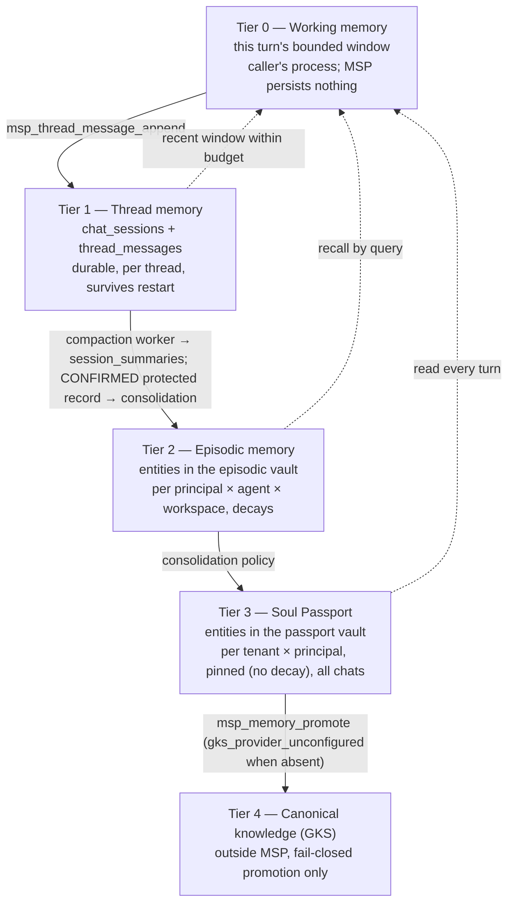
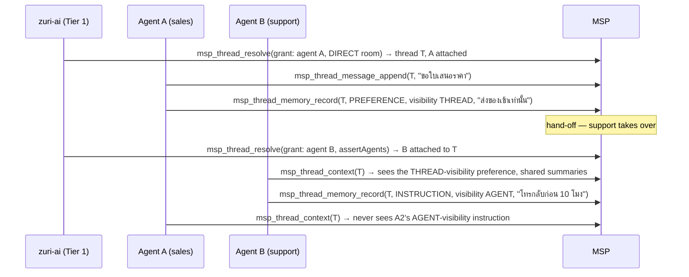

# DESIGN — Session, episodic, thread and instance memory for multi-user, multi-agent continuity

## สรุปภาษาไทย

ฉบับ 0.3.0b คือการรวมสองงานที่ไม่รู้จักกันมาก่อนเข้าเป็นเอกสารเดียว:
เอกสารนี้เอง (0.2.3b, RKOI อนุมัติแล้วแต่ยังไม่มีโค้ด) กับโค้ดที่สร้างไว้แล้วบน
branch `codex/msp-thread-memory` ที่ไม่รู้เรื่องเอกสารนี้เลย โดยยึดตาม
`ADR-MSP-MEMORY-OS-MULTI-USER-MULTI-AGENT.md` ที่ RKOI เสนอค่า default ไว้ 10
ข้อ (ทุกข้อรอเจ้าของอนุมัติ) และคำสั่งเจ้าของ: "ยังไม่เชื่อม LINE OA แต่ทำให้
MSP สมบูรณ์ รองรับหลายผู้ใช้หลาย agent"

หลักการที่เปลี่ยนจาก 0.2.3b:

- **ไม่มี instance/agent-leg สำหรับช่องทางฝั่งเซิร์ฟเวอร์อีกต่อไป** — ความสัมพันธ์
  ระหว่าง agent กับ thread คือ **grant ที่เซ็นชื่อต่อห้อง** บวกความสัมพันธ์
  `thread_agents` ที่บันทึกไว้จริง ไม่ใช่ lease ของ instance
- **DIRECT thread ต้องมีคนจริง (HUMAN) ได้แค่คนเดียวตลอดอายุ thread** — นี่คือ
  จุดที่ช่องโหว่ร้ายแรงที่สุดของ branch (C-1) เกิดขึ้น: คนที่สองแอบเข้ามาอ่าน
  ข้อความส่วนตัวของคนแรกได้ 4 ทาง ทุกทางถูกปิดในฉบับนี้
- **guard การตรวจสิทธิ์ต้องไม่รัน SQL เอง** (C-2) — ต้องรับ boolean ที่คำนวณไว้
  แล้วจาก store ชั้นล่าง เหมือน `vault-scope-guard.mjs` ทุกประการ
- **ความจำระดับ thread (protected record, summary) ยังไม่ใช่ vault** — เป็น
  ที่พักข้อมูลจนกว่าจะ CONFIRMED แล้วค่อย consolidate เข้าความจำถาวรของ
  principal ภายใต้ access context ของเจ้าของเองเท่านั้น (เหมือนกฎเดิม §9.1
  ของ 0.2.3b แต่ทั่วไปกว่า)
- **agent หลายตัวดูแลคนเดียวกันได้** — แต่ละ agent มี episodic vault แยกกัน,
  passport ใช้ร่วมกันได้เฉพาะผ่านสิทธิ์ `allow_passport`, protected record
  เลือกได้ว่าเห็นเฉพาะ agent ตัวเอง (`AGENT`) หรือทุก agent ที่ยังอยู่ใน thread
  (`THREAD`)
- **ไม่มี extractive fallback อีกต่อไป** — ช่วงที่ไม่มีสรุปครอบคลุม ระบบตอบ
  `coverageGap` ตรง ๆ ไม่แต่งเรื่องหรือตัดทอนแทน

ส่วนที่เหลือของเอกสารเป็นภาษาอังกฤษตามแบบแผนของ repo ดู §3.1 สำหรับตาราง
เทียบศัพท์ 0.2.3b → API-011

## 0. Review response

### 0.1 Round four (0.2.3b → 0.3.0b) — reconciling the unmerged branch

TASK-MEMOS-001 asked ATHER to reconcile this design (0.2.3b, zero code) with
the independently-built, unmerged branch `codex/msp-thread-memory`
(`50859fb`, `e4303cb`), following RKOI's clause-by-clause comparison and
the owner's ten adopted defaults recorded in
`docs/ADR-MSP-MEMORY-OS-MULTI-USER-MULTI-AGENT.md`. Every row below is
answered in this revision; none of it is implemented yet.

| # | Finding | Change in 0.3.0b | Where |
|---|---|---|---|
| Naming collision | Branch labelled its surface "API-010"; zuri-ai ADR-022 already owns that name for `msp_vault_resolve` | Branch surface renamed **API-011** everywhere in this document; `msp_vault_resolve` is untouched | §3.1, §13 |
| C-1 (critical) | A second person joins a DIRECT thread and reads the first person's private transcript/protected records, four ways: any signed append creates/updates a participant row; DIRECT accepts any number of humans; `speaker_kind: UNKNOWN` bypasses the HUMAN check; a PENDING speaker self-upgrades to VERIFIED by re-appending. A record with `subject_person_id` naming someone else is injected into that person's context (reachable on channel-account relink). | Participation changes only under an explicit claim (never a side effect of append); a schema trigger caps a DIRECT thread at exactly one HUMAN participant for its lifetime; `UNKNOWN`/`PENDING` speakers never get a private read (predicate is `speaker_kind = 'HUMAN' AND identity_assurance = 'VERIFIED' AND left_at IS NULL`); `identity_assurance` can be raised only through the participant lifecycle tool under an explicit verification claim, never by a normal append; a protected record's `subject_person_id` must be NULL or equal its own `asserted_by_speaker_id`, schema-enforced | §7, §9, §12.1 |
| C-2 (critical) | The branch's authorization guard in `msp-contracts` runs SQL, breaking the layering rule that produced `vault-scope-guard.mjs` | New `packages/msp-contracts/src/contracts/grant-scope-guard.mjs` takes precomputed booleans (current-verified-human-participant, current-agent) from a DB-backed registry in a new package, exactly like `assertVaultScope`/`assertThreadScope`; HMAC verification of the grant itself is pure and may live in `msp-contracts` because it touches no database | §13, §16 |
| W — caller `now` | Caller-supplied `now` on compaction tools lets a caller steal a lease | `now` is accepted only when `MSP_ALLOW_TEST_CLOCK=1`; production ignores the field and uses the server clock (decision 9) | §9.4, §16 |
| W — kind/audience split | `thread_kind` and `audience_kind` are independent inputs; only the audience is checked | A single persisted `threads.thread_kind` is canonical; the grant's `route.audienceKind` must equal it on every call against an existing thread, or `thread_audience_mismatch` | §6.3 |
| W — unbound subject | A protected record's subject is not bound to the asserter | Trigger: `subject_person_id IS NULL OR subject_person_id = asserted_by_speaker_id` | §9 |
| W — no erasure | No erasure path; blanket triggers forbid tombstones | Every content-bearing thread table gets a tombstone-only trigger (redact exactly one way, delete never), following the `conversation_events`-style convention this repo already uses; erasure ships in the same packet as the tables (decision 5) | §11, §11.1, §12.1 |
| W — raw ids in journal | Raw `external_room_ref` and raw person ids land in the append-only journal | Room refs are HMAC'd before storage (decision 6); journal payloads carry `principal_hmac`, never a raw id, exactly as design §13 already required elsewhere | §6.3, §13 |
| W — global uniqueness | `UNIQUE(channel_account_id, external_room_ref)` and a global `UNIQUE(source_event_id)` leak existence across tenants | Both become tenant-scoped: `UNIQUE(tenant_id, channel_account_id, external_ref_hmac)`; the global message unique is dropped, `UNIQUE(thread_id, source_event_id)` is the only idempotency key (already effectively tenant-scoped through the thread) | §6.3, §9 |
| W — no nonce | The grant has no nonce; replay within 60s works when `source_event_id` is omitted | Two-part rule: `msp_thread_message_append` keeps `source_event_id` as its natural idempotency key; every other mutating tool requires a grant `nonce` recorded in a new `grant_nonces` table, rejecting a repeat within the grant's expiry window | §6.1 |
| W — single key, unverified flags | One all-tenant service key; capability flags are unverified claims | Kept as the documented Tier 1 trust boundary (§13.1, unchanged posture); a per-tenant `MSP_THREAD_SERVICE_KEYRING` is offered as an opt-in stronger mode (ATHER judgement call, flagged for the owner in the ADR) | §6.1, §13.1 |
| W — untyped errors | Errors are plain strings | Typed error-code table, following the existing convention | §14 |
| W — memory outside vault model | Private memory lives outside the vault model | Restated as the deliberate boundary (decision 8): thread tables are a staging buffer; `principal_private`/`principal_passport` remain the permanent store; consolidation is the only bridge, under the owning principal's own context | §10, §3.1 |
| Suite gap | Only one security test exists on the branch | §15 lists a suite file and every case per rule above; none is written yet — GHOST's job once a packet lands | §15 |
| Migrations | Branch 0008/0009 already pass the structural FK runner check; nothing in them rebuilds a referenced table | Folded into one corrected migration (§12.1), still no `foreign-keys=off` directive needed — everything is additive `CREATE TABLE` | §12.1 |
| Decision 3 | Instances/agent-leg (§7 of 0.2.3b) dropped for server channels | The `instances`, `instance_thread_attachments`, `sessions`, `conversation_events` tables designed in 0.2.3b's old §12.2 (never shipped) are withdrawn from this document entirely, replaced by `thread_agents` + `chat_sessions` + `thread_messages` (§8, §9, §12.1) | §3.1, §8, §9 |
| Decision 4 | No participant lifecycle tool existed on the branch | `msp_thread_participant_lifecycle` added (leave / relink), gated by an explicit claim; nothing calls it yet | §7, §13 |
| Decision 10 | Branch had no fallback concept at all; 0.2.3b's extractive fallback is withdrawn per the owner's "no extractive fallback" direction | `coverageGap` response marker; MSP asserts nothing it did not summarize | §10.3 |

### 0.2 Round three (0.2.1b → 0.2.2b)

RKOI's third review (2026-09-14) **approved** v0.2.1b with zero criticals
and eight warnings that were merge conditions on WP-E2, WP-E3 and WP-E4 of
the *original* (pre-branch-reconciliation) delivery plan. This revision
folds them in so no packet inherits an open item; the packet names below
are historical (see §18 for the current, post-reconciliation delivery
order).

| # | Finding (0.2.1b) | Change in 0.2.2b | Where |
|---|---|---|---|
| R3-W1 | `instance_thread_attachments` PK `(instance_id, thread_id)` could not express re-attach after a crash or several openers, and was the one new ledger with no UPDATE trigger | Surrogate `attachment_id`; a partial unique index on `(instance_id, thread_id, opened_by_membership_id) WHERE detached_at IS NULL`; re-attach is an insert; leave detaches only that membership's rows and the leg survives while any open row remains; UPDATE trigger permits only `detached_at NULL → NOT NULL`; no DELETE | historical — table withdrawn in 0.3.0b, see §3.1 |
| R3-W2 | `redaction_marked_at` was neither pinned nor conditioned | Pinned; may change only on the transition into `redacted_pending`, and must then be set | §11.1 |
| R3-W3 | No erasure path for an already-`archived` group episode (trigger would abort the erase) | Decided: an `archived` episode goes straight to `archived_redacted` with its summary tombstoned — it is already outside every read path, so there is nothing to re-summarize for; no new transition needed | §11.1 |
| R3-W4 | Vault erasure depends on statement atomicity of the CHECK exemption | Stated: `status → 'erased'` and `principal_id → NULL` are one `UPDATE` statement | §11.1 |
| R3-W5 | The `vaults.status` CHECK narrowing was unproven against unexpected rows | Populated-database test gains a row with an unexpected `status` and asserts the migration fails loudly and rolls back | §12.0 |
| R3-W6 | Identity key: startup requirement or per-tool refusal; rotation unstated | Recommended default recorded (per-tool refusal + startup diagnostic + `msp_ping` report, with `MSP_REQUIRE_IDENTITY_KEY=1` opting a deployment into a fail-closed boot) and handed to the owner as §19 decision; rotation procedure stated (`MSP_IDENTITY_HMAC_KEY_PREVIOUS` dual-read window for bindings; journal pseudonyms are never rewritten) | §6.2 |
| R3-W7 | `entities_fts` not listed as its own erasure row | Row added; suite asserts the FTS table has no match for erased content | §11.1, §15 |
| R3-W8 | An empty `summary_text` was indistinguishable from a tombstoned one | `CHECK (length(summary_text) > 0 OR lifecycle_state = 'archived_redacted')` | historical — episode table withdrawn; equivalent CHECK carried onto `session_summaries.bullets_json`, §12.1 |

### 0.3 Round two (0.2.0b → 0.2.1b)

RKOI's second review (2026-09-13) confirmed all thirteen round-one criticals
and eleven warnings closed at the mechanism, and raised two new criticals
and twelve warnings introduced by the revision. Each is answered below.
Historical — several tables this round discusses were withdrawn in 0.3.0b;
see §3.1.

| # | Finding (0.2.0b) | Change in 0.2.1b | Where |
|---|---|---|---|
| R2-C1 | §6.1 rule 6 granted an agent implicit participation in every thread of its tenant; `role` CHECK dropped `agent` | Rule 6 replaced by a **recorded relation**: an agent context reaches a thread only through a live instance bound to that context and currently attached to the thread. Superseded in 0.3.0b by `thread_agents` (§8), which keeps the same "no implicit tenant-wide grant" property without instances. | §8 |
| R2-C2 | Erasure did not enumerate tables holding `principal_id` or principal-derived content; `episode_consolidations.salient_json` survived | §11.1 enumerates every table and its disposition | §11.1 |
| R2-W1–W12 | Mount trigger coverage, `isVaultAccessibleTo` signature, migration split, `user_version` timing, error-code naming, journal auditability, trust boundary, export scope, instance re-open binding, extractive-episode salient, id/ref convention, `thread_participants.tenant_id` | All closed at the mechanism; carried forward wherever the underlying table survives into 0.3.0b (`thread_participants.tenant_id` → §12.1; journal `principal_hmac` → §13; trust boundary → §13.1) | as noted |

### 0.4 Round one (0.1.0b → 0.2.0b)

The first review round (thirteen criticals, eleven warnings) is preserved
here only as provenance; every finding was about tables this document no
longer proposes to build the same way (instances, unbounded consolidation
authority, thread-scope guards reading the DB directly — the last of
which recurred as the branch's C-2 and is fixed the same way again in
§0.1). See the historical text preserved in `git log` of this file; it is
not repeated here to keep this revision's size proportionate to what
changed.

## 1. Why this document exists

zuri-ai has already decided what it expects from MSP as Tier 2, and a
substantial part of it is now **built but unmerged**, on a branch that did
not know this document existed:

| Upstream decision | What it asks of MSP | State as of 0.3.0b |
|---|---|---|
| ADR-043 D2 | "sole gateway for agent session control, episodic conversation state, and vault permission validation" | `msp_vault_resolve` (API-010) exists in this design's vocabulary; the thread/session/protected-memory model is API-011, specified here, built on an unmerged branch, not yet reconciled into `main` |
| ADR-044 D1/D2 | Unified thread id authority (`th_usr_…` / `th_grp_…`), session lifecycle, channel isolation | Threads/sessions exist on the unmerged branch with real security gaps (§0.1); this revision corrects them before anything merges |
| ADR-022 D4–D7 | API-010 `msp_vault_resolve`; private memory owned by Tenant × Principal × Agent × Workspace; thread/session/instance are provenance only | Vault ownership model (§5) is unchanged and still holds; instances are withdrawn as a concept for server channels (decision 3) — provenance now runs through the grant and `thread_agents`, not a leased instance |
| PHASE-04 | `ChannelThread`, `ThreadParticipant`, `ConversationEvent`, `Session`, `Episode`, summaries, retention/tombstone, export/erase, persistence port | Threads/participants/messages/sessions exist (branch, corrected here); episodes are replaced by thread-scoped `session_summaries` with a `coverageGap` marker instead of an LLM-or-extractive dichotomy (decision 10) |

The owner's direction (2026-09-14) is one sentence: **don't connect LINE OA
yet; make MSP complete, supporting multi user and multi agent.** This
revision turns that into a corrected data model, a reconciled API-011 tool
surface, the multi-user and multi-agent rules design v0.2.3b never had
reason to specify, and a delivery order gated on erasure existing before
any channel goes live.

## 2. Terms

Id and ref convention is unchanged from 0.2.3b
(`packages/msp-core/src/domain/vault-registry.mjs` `rowToVault`): every
record has a bare `*_id` column; the wire projection carries a minted
`*_ref` from `mintRef`, always `msp:`-prefixed.

| Term | Meaning | Id (column) | Who mints |
|---|---|---|---|
| **Principal** | The canonical human (zuri-ai `Person.id`). Owner of permanent memory. | opaque, supplied | zuri-ai identity; MSP never derives it |
| **Tenant / business / workspace / agent** | Server-owned scope from AuthContext | opaque, supplied | zuri-ai |
| **Thread** | One conversation container: `DIRECT`, `GROUP` or `ROOM` | `thread_id` | MSP (thread-id authority), on `msp_thread_resolve` |
| **Grant** | A signed, capability-flagged, short-lived authorization envelope wrapping every API-011 call | opaque JSON + HMAC signature | zuri-ai (Tier 1), keyed by `MSP_THREAD_SERVICE_KEY` |
| **Speaker / participant** | A `HUMAN`, `OPERATOR` or `UNKNOWN`-kind row in `thread_participants`, with an `identity_assurance` of `VERIFIED`, `PENDING` or `UNRESOLVED` | `membership_id` (opaque) | MSP, under an explicit participant claim |
| **Agent attachment** | A row in `thread_agents` recording that agent × workspace is currently serving a thread | `(thread_id, agent_id, workspace_id)` | MSP, under `assertAgents` or by the creating agent on resolve |
| **Chat session** | One bounded stretch of message activity on a thread (`chat_sessions`), replacing 0.2.3b's `sessions` | `session_id` | MSP |
| **Message** | One append-only turn record (`thread_messages`), replacing 0.2.3b's `conversation_events` | `message_id` | MSP |
| **Protected memory record** | A thread-scoped assertion (constraint, instruction, correction, preference) about a subject, pending consolidation into that subject's own vault | `record_id` | MSP, under a signer's own grant |
| **Session summary** | The compacted record of a stretch of messages, produced by a host-injected worker, never by MSP itself | `summary_id` | MSP, via the compaction worker tools |
| **Episodic vault** | The principal's private memory with one agent in one workspace (`principal_private`) | `vault_id` | MSP, via `msp_vault_resolve` |
| **Soul Passport vault** | The principal's permanent memory across every agent and workspace in a tenant (`principal_passport`) | `vault_id` | MSP, via `msp_vault_resolve` |

**Withdrawn terms (0.2.3b → 0.3.0b, decision 3):** *Instance* and
*episode* as this document previously defined them no longer name a table.
"Instance" is now purely an informal description of a client process; the
grant and `thread_agents` carry what an instance lease used to carry.
"Episode" is replaced by *session summary*; see §3.1 for the full mapping.

## 3. What exists today and what is missing

Reused unchanged:

- `vaults` / `vault_mounts` and `VaultRegistry` (lazy, idempotent
  provisioning; `isVaultAccessibleTo`,
  `packages/msp-core/src/domain/vault-registry.mjs:248` and `:275`).
- API-009 entities: bitemporal `entities` + append-only `entity_history`,
  soft `forget`, `links`, FTS5 + vector + RRF search, Ebbinghaus decay.
- Append-only `journal` with `RAISE(ABORT)` triggers.
- The fail-closed GKS bridge (`msp_memory_promote`, `msp_knowledge_promote`).
- `packages/msp-contracts/src/contracts/vault-scope-guard.mjs` as the
  pattern every new guard in this design follows (precomputed boolean in,
  typed error out, no database access).

Built on the unmerged branch, corrected in this revision before it may
merge (§0.1, §12.1): `threads`, `thread_participants`,
`protected_memory_records`, `chat_sessions`, `thread_messages`,
`session_compaction_jobs`, `session_summaries`, `thread_delivery_receipts`,
`thread_pending_deliveries`, `thread_injection_receipts`,
`thread_summary_invalidations`, and the ten `msp_thread_*`/`msp_session_*`
tools (renamed API-011, §13).

Missing, and designed below (net-new relative to both prior efforts):

- Tenant- and principal-scoped vault types, and `msp_vault_resolve` (§5,
  carried unchanged from 0.2.3b, still unbuilt).
- A `thread_agents` relation and every multi-agent rule (§8).
- A participant lifecycle tool for leave/relink (§7).
- A DB-backed guard package for API-011's authorization checks, so the
  contracts layer never touches SQL (§13, §16).
- Tenant-scoped uniqueness and HMAC-at-rest room refs (§6.3).
- A grant nonce table and replay rule (§6.1).
- Tombstone-ready triggers on every content-bearing thread table, and the
  erasure/export tools that use them (§11, §11.1).
- Consolidation from `CONFIRMED` protected records into the principal's own
  vaults, under that principal's own access context (§10.2).

### 3.1 Concept mapping: v0.2.3b → API-011

Every renamed, replaced or withdrawn concept, in one place, so a reader of
the earlier design can find where its idea (or its replacement) lives now.

| v0.2.3b concept | API-011 equivalent | What changed and why |
|---|---|---|
| `msp_thread_resolve`, thread minting, `th_usr_`/`th_grp_` ids | `msp_thread_resolve` (§13), `threads.thread_kind IN ('DIRECT','GROUP','ROOM')` | A third kind, `ROOM`, is added (branch); id prefixing is no longer load-bearing — `thread_kind` is a column, not encoded in the id shape |
| `instances`, `msp_instance_open/heartbeat/close` | *withdrawn* | Decision 3: instances/agent-leg dropped for server channels; the grant + `thread_agents` (§8) is the recorded relation instead |
| `instance_thread_attachments` | `thread_agents` (§8, §12.1) | Same purpose (a recorded, revocable relation between an agent and a thread) with no instance/lease machinery; append-only, partial-unique-open-row, same shape family as the withdrawn table |
| `sessions` (one open session per thread, fencing token) | `chat_sessions` (§9) | Same "one open session per thread" invariant; fencing token becomes the compaction job's lease token (§9.4), because summarization moves off the request path onto a worker |
| `conversation_events`, `msp_event_append/window` | `thread_messages`, `msp_thread_message_append` (§9) | Same append-only, MSP-ordered, idempotent-by-caller-key model; tombstone trigger convention unchanged |
| `episodes`, `msp_episode_commit/consolidate/list` | `session_summaries` + `msp_session_compaction_claim/commit/retry` (§9.4, §10) | Summarization is no longer a synchronous call Tier 1 makes inline; it is an asynchronous, host-injected worker claiming a leased job. There is no synchronous "commit a summary in this turn" tool in API-011 |
| Extractive fallback (truncation when no LLM summary arrives) | `coverageGap` marker (§10.3) | Decision 10: MSP never fabricates or truncates a stand-in; it says plainly that a stretch is uncovered |
| `entity_provenance`, `episode_consolidations` | Deferred — a future migration when consolidation from `session_summaries`/`protected_memory_records` into principal vaults ships (§12.3) | Not needed until consolidation exists; not designed in this revision beyond the authority rule in §10.2 |
| `msp_turn_context` | `msp_thread_context` (§10) | Same bounded-packet-with-receipt idea; slices now include thread-scoped protected records and summaries alongside the unchanged passport/episodic/cross-thread vault slices |
| Consolidation authority (§9.1 of 0.2.3b: "runs only under the access context of the principal whose vaults it writes") | Unchanged rule, generalized (§10.2): applies to consolidating a `CONFIRMED` protected record, not only an episode's `salient` |
| `msp_principal_erase`/`export` | Same tool names, request/response extended to cover thread tables (§11, §11.1) | No rename; scope grows |
| Thread-scope guard reading a boolean from `msp-episodic` | `grant-scope-guard.mjs` reading a boolean from a new registry package (§13, §16) | Same pattern, new package name, because the branch's own guard violated it (C-2) and had to be fixed the same way |

## 4. Five memory tiers



| Tier | Owner key | Lifetime | Store | Decay | Read by |
|---|---|---|---|---|---|
| 0 Working | the caller's process | one turn | not persisted by MSP | — | the calling process |
| 1 Thread | thread | open → closed, then retained per policy | `chat_sessions`, `thread_messages`, `protected_memory_records`, `session_summaries` | retention tick tombstones content | current `VERIFIED` `HUMAN` participants of the thread, and current agents of the thread (§7, §8) |
| 2 Episodic | tenant × principal × agent × workspace | months | API-009 entities in the episodic vault | Ebbinghaus (existing `runDecayTick`) | this principal's turns with this agent in this workspace |
| 3 Passport | tenant × principal | until erasure | API-009 entities in the passport vault | pinned | every turn of this principal in the tenant, any agent, when `authorization.allow_passport` |
| 4 Canonical | portfolio/tenant (GKS) | permanent | GKS | n/a | governed retrieval |

Continuity across many chats still comes from tiers 2 and 3, keyed by the
principal, not the chat. Tier 1 is now thread-scoped memory in its own
right, not merely a staging area for tier 0 — it is where protected
records and summaries live until (and unless) they are confirmed and
consolidated upward.

## 5. Ownership model — vaults

*(Kept unchanged from 0.2.3b — nothing about the branch collision touches
vault ownership.)*

Two vault types are added. Existing types are unchanged.

| `vault_type` | Owner columns | Role |
|---|---|---|
| `shared` (existing) | `project_id` | identity only; never a write target |
| `workspace_private` (existing) | `workspace_id` | dev-agent workspace memory (GoVibe) |
| `global_private` (existing) | `agent_id` | the agent's own cross-project memory — **never** a principal's private facts; see §8's consolidation-target rule |
| **`principal_private`** (new) | `tenant_id`, `principal_id`, `agent_id`, `workspace_id` — all NOT NULL while active | the episodic vault: ADR-022 D6's owner tuple; API-010 returns it as `workspace_private_vault_id` for principal turns |
| **`principal_passport`** (new) | `tenant_id`, `principal_id` — NOT NULL while active; `agent_id`, `workspace_id` — NULL | the Soul Passport: permanent, cross-agent, cross-workspace |

Rules:

1. **Thread, session and message ids are never vault owners and never
   authorization input** (ADR-022 D6). No column on `vaults` references
   them; no scope check reads them. (0.3.0b: the same now holds for
   `grant`, `thread_agents` and `protected_memory_records` ids — none of
   them is a vault owner or scope input either.)
2. **A group or room thread owns nothing.** Each participant's private
   context lives in that participant's own vaults. A thread-shared vault
   is out of scope for this design; when policy later grants one, it is a
   new `vault_type` with a new security suite, not a widening of
   `principal_private`.
3. **Principal vault ids are random (UUIDv7), not derived; idempotency is
   schema-enforced.** Existing types use `stableId(...)`, which anyone who
   knows the owner tuple can recompute. A principal vault id is a
   capability handed out only by `msp_vault_resolve` after the access
   context passes. Idempotency comes from two partial unique indexes
   **and** a table-level `CHECK` that makes the owner columns of each
   principal type NOT NULL while the vault is active (§12.2) — a partial
   unique index alone does not constrain NULLs, which SQLite treats as
   distinct. Provisioning is one `BEGIN IMMEDIATE` transaction (select,
   then insert), so a concurrent double-resolve yields one row; an erased
   vault (§11.1) has `status = 'erased'` and its `principal_id` cleared,
   so a returning person gets fresh vaults and the erased rows never
   collide.
4. **`decay_policy` is a vault column**: `'ebbinghaus'` (default, existing
   behaviour) or `'pinned'`. `runDecayTick` on a pinned vault evaluates
   nothing and says so: `msp_memory_decay_tick` answers
   `{ evaluated: 0, transitioned: [], dry_run, pinned: true }`. The new
   `pinned` field is an API-009 response-shape change and ships inside the
   API-009 0.2.0 amendment with an `api-009-conformance.test.mjs` case.
   Passport vaults are pinned at provisioning.
5. **Principal vault types are never mountable, and the owner check runs
   before the mount short-circuit.** `isVaultAccessibleTo`
   (`packages/msp-core/src/domain/vault-registry.mjs:248`) currently
   returns `true` for any vault type when a `vault_mounts` row links the
   vault to the caller's `workspaceId`, before the per-type branches. For
   the two new types that order is reversed: their branches are evaluated
   first and are the only way to reach `true`. The signature grows three
   optional keys — `isVaultAccessibleTo(vaultId, { workspaceId, agentId,
   tenantId, principalId, allowPassport })` — which legacy callers do not
   pass and are not affected by. `principal_private` requires `tenantId`,
   `principalId`, `agentId`, `workspaceId` all to equal the row;
   `principal_passport` requires `tenantId` and `principalId` to equal the
   row and `allowPassport === true`; an active row only. Three layers
   enforce "never mountable": `mountVault`
   (`packages/msp-core/src/domain/vault-registry.mjs:275`) refuses them
   with `vault_scope_denied` at the writer; `msp_vault_mount` therefore
   cannot create such a row; and migration 0009 adds `BEFORE INSERT` and
   `BEFORE UPDATE` triggers on `vault_mounts` that abort for those vault
   types.
6. **Passport reads and writes are gated by their own flag**,
   `authorization.allow_passport`. `allow_tenant_global_private` keeps its
   ADR-022 meaning (agent-scoped global private memory) and grants nothing
   about the passport. The one exception is the data-subject export
   (§11): a person's own export includes their passport regardless of the
   flag.
7. **Every path to a principal vault requires a matching access context.**
   This includes the nine `msp_memory_*` tools — see §5.1.

### 5.1 Caller identity on the nine `msp_memory_*` tools

*(Kept unchanged from 0.2.3b.)*

`docs/NOTES.md` records that the nine `msp_memory_*` tools carry no caller
identity, so their only scoping is "the vault named in the request" — and
two of them (`msp_memory_history`, `msp_memory_forget`) name no vault at
all, only an `entity_id`. An unguessable vault id is therefore not a
capability for those two tools, and 0.1.0b's "v1 relies on possession of
the id" argument is withdrawn.

The rule, shipping together with the vault types:

- Every `msp_memory_*` request accepts an optional `access_context`
  object (ADR-022 shape, §13). Its presence is optional **on the wire** so
  that existing callers of the existing vault types see no change.
- The handler resolves the target vault first — from `vault.vault_id` /
  `vault_id` where the request carries one, otherwise from the entity
  (`msp_memory_history`, `msp_memory_forget`, `msp_memory_links_list`) or
  both entities (`msp_memory_links_create`).
- If the target vault's type is `principal_private` or `principal_passport`,
  an absent or non-matching `access_context` is `vault_scope_denied` before
  any domain call. Passport targets additionally require
  `authorization.allow_passport`. Unknown vault ids remain `not_found`, as
  today. An erased vault is `not_found` to every caller.
- If the target vault is a legacy type and `access_context` is present, it
  is enforced through `isVaultAccessibleTo` with the same denial; if
  absent, behaviour is exactly today's (the recorded gap stays open for
  legacy types and stays recorded in `docs/NOTES.md`).

This is a wire-shape change to API-009 (request: optional `access_context`;
`msp_memory_decay_tick` response: `pinned`). It needs the API-009 version
bump to `0.2.0+draft`, a CHANGELOG row, and cases in
`tests/contract/api-009-conformance.test.mjs` proving both "absent ⇒
unchanged for legacy types" and "absent ⇒ denied for principal types". No
principal vault can exist before this lands.

## 6. Grant, identity key and thread minting

### 6.1 The signed per-room grant

Every API-011 tool requires an `access` argument: `{ grant, signature }`.
`signature` is `HMAC-SHA256(key, canonicalJSON(grant))`, keyed by
`MSP_THREAD_SERVICE_KEY` (≥ 32 characters). A missing key denies
everything (`grant_unconfigured`), the same fail-closed posture as the GKS
bridge and the identity key.

```json
{
  "grant": {
    "operation": "thread_resolve",
    "tenantId": "…", "principalId": "…", "agentId": "…", "workspaceId": "…",
    "policyRevision": "…",
    "route": {
      "businessId": "…", "channelAccountId": "…",
      "externalRoomRef": "…", "audienceKind": "DIRECT"
    },
    "capabilities": {
      "readPrivate": true, "writePrivate": true, "operator": false,
      "deliveryWriter": false, "confirmMemory": false, "assertAgents": false
    },
    "payloadHash": "sha256:…",
    "nonce": "8f2c…",
    "expiresAt": "2026-09-14T03:00:05Z"
  },
  "signature": "…"
}
```

- **`operation`, `expiresAt`, `payloadHash`, `tenantId`, `principalId` and
  `policyRevision` are required** on every grant. `expiresAt` must be at
  most 65 seconds ahead of the server clock at verification time.
  `payloadHash` is the SHA-256 of the exact request payload the grant
  authorizes; a request whose recomputed hash does not match is
  `grant_payload_mismatch`.
- **`route`** (`businessId`, `channelAccountId`, `externalRoomRef`,
  `audienceKind`) is present on tools that resolve or reference a thread by
  its channel identity. `audienceKind` is checked against the thread's
  persisted `thread_kind` on every call against an *existing* thread
  (§6.3) — never trusted as an independent claim.
- **Capability flags** (`readPrivate`, `writePrivate`, `operator`,
  `deliveryWriter`, `confirmMemory`, `assertAgents`) gate the
  corresponding tool families (§13). `assertAgents` is new relative to the
  branch, added to authorize a `thread_agents` insert (ADR judgement call
  A) — it is part of MSP's own grant envelope, not a zuri-ai business
  field, so adding it does not touch decision 2's frozen tool shapes.
- **Nonce and replay.** `msp_thread_message_append` needs no grant nonce:
  its own `source_event_id` is already a per-thread idempotency key
  (§9.1), and a replayed append with the same key returns the original
  result rather than duplicating it. Every *other* mutating API-011 tool
  (`msp_thread_memory_record`, `msp_thread_injection_record`,
  `msp_thread_delivery_record`, and all four worker tools) has no such
  natural key, so its grant's `nonce` is required and recorded in
  `grant_nonces (tenant_id, nonce, expires_at)`, `PRIMARY KEY (tenant_id,
  nonce)`. A second use of the same `(tenant_id, nonce)` before
  `expires_at` is `grant_replayed`; rows are pruned by `msp_retention_tick`
  once past `expires_at`. **This is the chosen fix for the branch's
  "replay within 60s works when `source_event_id` is omitted" warning**:
  rather than making a nonce universal (which would needlessly duplicate
  the append idempotency key MSP already has), the rule is narrowed to
  exactly the tools that lacked one.
- **Key configuration.** `MSP_THREAD_SERVICE_KEY` is the default,
  all-tenant key. A deployment may instead set
  `MSP_THREAD_SERVICE_KEYRING` (a JSON object mapping `tenantId → key`);
  when present, a tenant absent from the keyring is `grant_unconfigured`
  rather than falling back to the default key. This is offered, not
  required (ADR judgement call B): a single-tenant or development
  deployment may keep the simpler single key.
- **Trust boundary.** The signature, hash and short expiry harden
  *transport* integrity — a grant cannot be altered or replayed
  indefinitely once observed — but every capability flag remains a Tier 1
  assertion MSP does not independently verify, exactly as §13.1 states for
  the `authorization.*` object on the sibling API-011 tool families.

### 6.2 The identity key: presence and rotation

*(Kept unchanged from 0.2.3b, extended to cover room refs explicitly — see
the note at the end of this subsection.)*

`MSP_IDENTITY_HMAC_KEY` is needed by `msp_thread_resolve` and by every tool
that journals a `principal_hmac` — including `msp_vault_resolve`, the first
call of every turn. Without it the whole principal surface is dark. Two
ways to surface that, and the choice is the owner's; the design's
recommended default is the first:

- **Per-tool refusal, made loud.** The server boots (the legacy surface —
  GoVibe's API-009/API-006 tools — needs no key, and hard-requiring one at
  boot would regress Gate A's "boots standalone" row for consumers that
  never use principal vaults). At startup it writes one stderr diagnostic
  naming the disabled surface; `msp_ping` reports
  `identity_surface: "configured" | "unconfigured"`; and every principal
  tool answers `identity_hmac_unconfigured`, which zuri-ai's FR-057 already
  treats as "deny private retrieval before any API-009 call" — so a
  misconfigured deployment fails on its first turn, not silently.
- **Opt-in fail-closed boot.** `MSP_REQUIRE_IDENTITY_KEY=1` makes the
  absence of the key a startup error exactly like `MSP_DB_PATH`'s. A
  zuri-ai deployment sets it; a GoVibe deployment does not.

**Rotation is a procedure, not a variable swap.** A new key changes every
`external_ref_hmac` (§6.3) and every future `principal_hmac`, so:
`MSP_IDENTITY_HMAC_KEY_PREVIOUS` opens a dual-read window in which
`msp_thread_resolve` looks up the binding under the new key, then the old,
and on an old-key hit inserts a new binding row under the new key for the
same thread and journals the re-bind with counts; the window closes when
the previous key is removed and `msp_retention_tick` reports zero old-key
bindings resolved since the last tick. Journal rows are never rewritten:
an auditor correlates a principal across a rotation through the thread
refs and erasure receipts, not through the pseudonym. Neither key ever
appears in a journal payload, an error or a response.

**0.3.0b note:** decision 6 makes HMAC-at-rest for `external_room_ref` a
hard requirement of the thread surface (it was already this design's
position in 0.2.3b; the branch stored the raw ref, which this revision
corrects, §6.3). `msp_thread_resolve` therefore needs this key on every
call, not only for journal pseudonyms — its absence is
`identity_hmac_unconfigured` before any thread lookup or mint.

### 6.3 Thread minting, kind, and tenant-scoped uniqueness

- **Minting is idempotent on `(tenant_id, channel_account_id,
  external_ref_hmac)`** — tenant-scoped, correcting the branch's global
  `UNIQUE(channel_account_id, external_ref)` (a global unique leaks
  existence: two tenants sharing a channel account's LINE group would
  otherwise be told they share a thread).
- **MSP never stores a raw platform id.** `external_ref_hmac =
  HMAC-SHA256(MSP_IDENTITY_HMAC_KEY, tenant_id | channel_account_id |
  external_room_ref)`. Absent the key, `msp_thread_resolve` answers
  `identity_hmac_unconfigured` and writes nothing.
- **Person resolution is not MSP's.** MSP receives `principalId` already
  resolved on the grant and only checks that it is present.
- **Kind is fixed at minting and never changes.** `threads.thread_kind IN
  ('DIRECT','GROUP','ROOM')`. This single persisted column is the
  canonical audience for the thread — there is no independent, unchecked
  second column. Every call against an existing thread carries the
  grant's `route.audienceKind`; the handler compares it to the stored
  `thread_kind` and answers `thread_audience_mismatch` on any difference,
  closing the branch's "`thread_kind` and `audience_kind` are independent;
  only the audience is checked" warning. A `DIRECT` thread accepts exactly
  one `HUMAN` participant over its whole life (schema-enforced, §12.1); a
  `GROUP` or `ROOM` thread has many and no owner.

## 7. Participants — the multi-user model

MSP has no identity store and cannot verify who is in a LINE group or
room. Participation is a **server-derived fact asserted by the trusted
Tier 1 process** (§13.1) and constrained rather than pretended to be
verified — but the branch's specific mistake was letting *any* signed call
assert or upgrade it. This revision constrains the assertion to one path.

1. **A `thread_participants` row is created or changed only by
   `msp_thread_resolve`'s initial participant list or by
   `msp_thread_participant_lifecycle`**, both requiring
   `grant.capabilities.assertAgents === false` is irrelevant here — the
   relevant flag is that the *route*'s asserting call must carry
   `writePrivate` **and** be on the identity-resolution path, never a
   plain message append. `msp_thread_message_append` never creates,
   upgrades or touches a participant row under any circumstance —
   closing the branch's first C-1 vector outright.
2. **`speaker_kind` is `HUMAN`, `OPERATOR` or `UNKNOWN`.** `AGENT` is
   deliberately not a value here — an agent's relation to a thread is
   `thread_agents` (§8), never a participant row, closing the ambiguity
   that let the branch's schema imply an agent could be a participant.
3. **A `DIRECT` thread holds exactly one `HUMAN` participant for its whole
   life**, schema-enforced by a trigger mirroring 0.2.3b's original
   single-participant rule (§12.1): any second `HUMAN` insert on a
   `DIRECT` thread is refused. It may additionally hold any number of
   `OPERATOR` participants (staff consoles observing the conversation) —
   `OPERATOR` never counts toward the one-`HUMAN` cap and never gets a
   private read (rule 5). `GROUP` and `ROOM` threads accept any number of
   `HUMAN` and `OPERATOR` participants.
4. **The participation predicate is `left_at IS NULL`**, evaluated on the
   current membership row. A departed or erased principal is not a
   participant: `thread_scope_denied` on every thread-scoped tool,
   including for history before they left.
5. **A private read or write requires the grant's principal to be a
   *current* `VERIFIED` `HUMAN` participant** — `speaker_kind = 'HUMAN'
   AND identity_assurance = 'VERIFIED' AND left_at IS NULL`. `UNKNOWN`
   speakers never satisfy this regardless of `identity_assurance`
   (closing the branch's `UNKNOWN`-bypass vector), and `OPERATOR`
   participants never satisfy it regardless of assurance level (an
   operator sees the thread's shared, non-private surface only — messages
   and `THREAD`-visibility protected records, never another person's
   passport or episodic recall).
6. **`identity_assurance` (`VERIFIED`, `PENDING`, `UNRESOLVED`) can be
   raised only through `msp_thread_participant_lifecycle` under an
   explicit verification claim** (`grant.capabilities.writePrivate` plus a
   route asserting verification), **never as a side effect of an ordinary
   append or resolve.** This closes the branch's fourth C-1 vector — a
   `PENDING` speaker cannot re-append its way to `VERIFIED`.
7. **Membership rows are append-only**: leaving sets `left_at`; rejoining
   inserts a new row. A partial unique index allows at most one open
   membership per `(thread_id, principal_id)`.
8. **`msp_thread_participant_lifecycle`** is the one tool that can `leave`
   an existing membership or `relink` a channel-account rebinding to a
   different Person. A relink closes the old membership (`left_at` set)
   and inserts a fresh row for the new Person with `identity_assurance =
   'PENDING'` — **the new Person never inherits the old membership's
   `VERIFIED` status or its protected records' visibility.** This is the
   fix for the branch's relink-leak scenario: before this tool existed,
   nothing closed the old membership at all, so a relinked channel account
   kept reading the previous Person's thread. Nothing calls this tool yet
   (decision 4); it exists so a caller *can*, once zuri-ai or Zuri is
   wired to call it on a relink/merge event.
9. **A protected memory record's subject must be absent or equal to its
   own asserter.** `protected_memory_records.subject_person_id IS NULL OR
   subject_person_id = asserted_by_speaker_id`, schema-enforced (§12.1).
   This closes the branch's second C-1 vector: a record naming another
   person can no longer be created at all, so there is no wire shape left
   by which a relink could surface someone else's fact in the new
   occupant's context.
10. `thread-participant-mutation-scoping.security.mjs` (§15) proves every
    rule above with a real attacker: a second `HUMAN` on a `DIRECT`
    thread, an `UNKNOWN` speaker attempting a private read, a `PENDING`
    speaker re-appending, a subject-mismatched record insert, and a relink
    that tries to keep the old membership's `VERIFIED` status.

## 8. Agents — the multi-agent model

An agent's relation to a thread is a recorded fact, `thread_agents`, never
an implicit tenant-wide grant and never a participant row.

```sql
EXISTS (SELECT 1 FROM thread_agents
        WHERE thread_id = :thread_id AND agent_id = :agent_id
          AND workspace_id = :workspace_id AND left_at IS NULL)
```

1. **`thread_agents (thread_id, agent_id, workspace_id, joined_at,
   left_at)`** is append-only, with a partial unique index on
   `(thread_id, agent_id, workspace_id) WHERE left_at IS NULL`. Re-joining
   after leaving is a new row, never an un-leave.
2. **Attachment happens two ways only**: (a) the agent that creates a
   thread via `msp_thread_resolve` is attached to it automatically, or (b)
   an already-current agent of the thread attaches another agent under
   `grant.capabilities.assertAgents === true`. There is no tenant-wide or
   implicit attachment of any kind.
3. **Only a current agent of a thread may**: append `AGENT`-authored
   messages to it; call `msp_thread_context` for it; record injections or
   deliveries against it; claim, commit or retry a compaction job for it.
   Anything else is `agent_not_current`.
4. **An agent leaving a thread loses reads on the next call** — `left_at`
   set makes every check above fail immediately; there is no grace window
   (unlike a `HUMAN` participant's own history, which they keep in their
   own export).
5. **Journal actor and pseudonymization.** Every mutating tool journals
   `actor = grant.agentId`; wherever a principal must remain auditable
   (participant assertions, lifecycle changes, erasures, exports), the
   payload carries `principal_hmac = HMAC-SHA256(MSP_IDENTITY_HMAC_KEY,
   tenant_id | principal_id)`, never the raw id — the same rule §13
   already states for the rest of the surface.
6. **Two agents serving the same person** — what each can and cannot see
   of the other's work, and why:
   - **Episodic vaults are separate.** `principal_private`'s owner tuple
     includes `agent_id` (§5), so agent A's episodic memory of principal
     X is a different vault row than agent B's. Neither agent can read
     the other's episodic vault under any capability flag — there is no
     wire shape that names another agent's vault. This is deliberate:
     episodic memory is each agent's own working relationship with the
     person, not a shared team notebook.
   - **The passport is shared, but only through a gated read.** Passport
     vaults have no `agent_id` (§5); either agent may read or write it
     when their own grant carries `allow_passport`. A fact either agent
     wrote to the passport is visible to the other — this is the one
     place cross-agent sharing happens, and it happens because the
     passport is explicitly cross-agent by design (§5's owner tuple), not
     because of anything special in this section.
   - **Protected records carry `agent_id` and a `visibility`** of
     `AGENT` (only the writing agent may ever read it back) or `THREAD`
     (every current agent of the thread may read it). Agent A therefore
     cannot see Agent B's `AGENT`-visibility records about the same
     thread or person, but can see Agent B's `THREAD`-visibility ones.
     This is the deliberate middle ground PHASE-04's "raw transcript
     stays in MSP" intent needs: a fact worth remembering across a
     hand-off ("always confirm delivery by phone") is `THREAD`; a fact
     only relevant to one agent's own workflow is `AGENT`.
   - **Session summaries are thread-level and unscoped by agent** —
     `session_summaries` carries no `agent_id` column, so any current
     agent of the thread sees every summary of it. There is no
     per-agent partial view of "what happened in this thread."
   - **`global_private` remains the agent's own cross-principal
     memory and must never contain a principal's private facts.**
     Enforced structurally, not by convention: the consolidation path
     (§10.2) only ever resolves and writes to `principal_private` or
     `principal_passport` vault ids obtained from `msp_vault_resolve`
     under the *principal's* access context — it has no code path that
     accepts or writes a `global_private` vault id at all.
     `consolidation-vault-scoping.security.mjs` (§15) proves a
     consolidation call cannot be steered toward `global_private` by any
     request shape.
7. **Tenancy.** `thread_agents.workspace_id` and every lookup against it
   is compared against the grant's `tenantId`/`workspaceId`; an agent
   attached under tenant A's grant is never visible to a tenant B lookup,
   even for the same numeric `agent_id` value (agent ids are not
   guaranteed globally unique across tenants and must never be treated as
   if they were).

## 9. Sessions and messages

### 9.1 `chat_sessions` and `thread_messages`

- **One open chat session per thread**, exactly as 0.2.3b's `sessions`
  design: `UNIQUE INDEX ... ON chat_sessions(thread_id) WHERE status IN
  ('OPEN','CLOSING')`. Opening is idempotent — a second opener on the same
  thread joins the open session.
- **Ordering is MSP's.** Every appended message gets `sequence = max + 1`
  for its thread inside one `BEGIN IMMEDIATE` transaction.
- **Idempotency is the caller's key.** `UNIQUE(thread_id, source_event_id)`
  is the sole idempotency mechanism for `msp_thread_message_append` — the
  branch's *additional* global `UNIQUE(source_event_id)` is dropped
  (§0.1): it added a cross-tenant existence leak (two tenants relaying the
  same upstream message id would collide) for no idempotency benefit the
  per-thread key does not already provide.
- **Authorship is checked, not asserted.** A `HUMAN`/`OPERATOR`-authored
  message's `principal_id` must be a *current* participant of the thread
  (§7 rule 4); an `AGENT`-authored message requires the appending agent to
  be *current* per `thread_agents` (§8 rule 3); anything else is
  `thread_scope_denied` / `agent_not_current` respectively.
- **Idle timeout and segment limits** are per-tenant retention policy,
  evaluated by `msp_session_sweep` (a worker tool, operator-bound, §13),
  exactly as 0.2.3b's design intended for its own `sessions` table.

### 9.2 Delivery reconciliation

- A delivery receipt that arrives before its corresponding inbound message
  is held in `thread_pending_deliveries` until the message exists, then
  reconciled into `thread_delivery_receipts`.
- A receipt that lands on a *closed* session invalidates that session's
  summaries (a row in `thread_summary_invalidations`) and re-queues
  compaction — the summary that already ran may have missed content the
  late receipt now proves was delivered.
- Both delivery tables carry redactable text (`text_json`) with the same
  tombstone-only trigger convention as `thread_messages` (§11.1) — a gap
  the branch left open, since delivery text was stored with no erasure
  path.

### 9.3 Injection receipts

`thread_injection_receipts` stores a packet hash only, never content —
unchanged from the branch, and needing no erasure row because it holds
nothing to tombstone (parallel to 0.2.3b's `contexts.refs_json` being
reference-only).

### 9.4 Compaction workers

Summarization is a host-injected worker's job, never MSP's: **MSP never
calls a model.**

- `msp_session_sweep` (operator-bound, tenant-matched) finds sessions past
  their idle/segment policy and creates `session_compaction_jobs` rows
  (`status = 'PENDING'`, a lease token column, `expires_at`).
- `msp_session_compaction_claim` leases one job (`status → 'CLAIMED'`,
  `lease_token` set, `lease_expires_at` set) for the calling worker; a
  second claim before expiry is `compaction_lease_conflict`.
- `msp_session_compaction_commit` takes the held `lease_token`, a
  `summary_text` and `bullets_json` (each bullet cites in-range messages
  by their real author — schema-checked against `thread_messages`,
  §12.1), and writes a `session_summaries` row forced to `status =
  'CANDIDATE'`. A stale or mismatched `lease_token` is
  `compaction_lease_conflict`; nothing is written.
- `msp_session_compaction_retry` requeues an expired or failed job
  (`status → 'PENDING'`, lease cleared) so a different worker instance may
  claim it.
- **Caller-supplied `now` is test-only** (decision 9): every one of these
  four tools accepts an optional `now` field, but the server **ignores
  it** unless the process is started with `MSP_ALLOW_TEST_CLOCK=1`; in
  production the server clock is always authoritative, closing the
  branch's lease-theft warning (a caller could not otherwise extend or
  invalidate a lease by asserting a convenient clock value). Every domain
  function that needs "now" still takes it as an explicit argument
  internally, so the fake-clock testing pattern the rest of this design
  already uses is unaffected — only the *wire* trust of a caller-supplied
  value changes.

## 10. Per-thread context, and consolidation to principal vaults

### 10.1 `msp_thread_context`

The call a Tier 1 agent makes before generating a reply. Inputs: `access`
(the grant), `threadId`, `sessionId`, optional `query`, `budget`.

| Priority | Slice | Source | Gate |
|---|---|---|---|
| 1 | passport facts | passport vault (existing API-009/API-010 path) | `authorization.allow_passport`; the grant's principal only |
| 2 | session window | recent `thread_messages` of the open `chat_session` | current `VERIFIED` `HUMAN` participant, or current agent (§8) |
| 3 | thread summaries | `session_summaries` for this thread (`status != 'CONTESTED'`) or `coverageGap` markers for uncovered ranges (§10.3) | current participant or current agent |
| 4 | protected records | `protected_memory_records` visible to the caller: `THREAD`-visibility rows always; `AGENT`-visibility rows only to the writing agent; subject-bound rows only within the subject's own read (§7 rule 9) | current participant or current agent, subject to visibility |
| 5 | episodic recall | `retrievalService.search` over the episodic vault (unchanged from 0.2.3b) | `authorization.read`; the grant's principal only |

- **A group or room thread never produces a private read for anyone** —
  slices 1, 4 (subject-bound) and 5 are principal-scoped and simply do not
  populate for a caller whose grant carries no principal in the relevant
  sense (an agent-only call, or a request about a thread with no single
  owning principal).
- **Budget and trimming** follow 0.2.3b's rule unchanged: trimming is by
  priority, always reported, never silent.
- **Denied is empty, not partial.** A failed check on any required slice
  returns the corresponding error and writes nothing; it never returns a
  packet with slices quietly removed.

### 10.2 Consolidation authority (decision 8, generalized)

Thread-scoped memory (protected records, summaries) is **not** a vault.
It becomes permanent only when a `CONFIRMED` protected record is
consolidated into the subject's own vault — and that write runs under
**exactly the authority every other principal-vault write runs under**:
the access context of the principal whose vault it targets, checked by
`isVaultAccessibleTo`, with no separate "consolidation authority" and no
bypass. This is 0.2.3b §9.1's rule, generalized from "an episode's
`salient`" to "any confirmable thread-scoped fact":

1. A record consolidates only when `status = 'CONFIRMED'` **and** the
   consolidating call carries the *subject's own* access context
   (resolved via `msp_vault_resolve` under that principal, not the
   asserting speaker's).
2. The record's `agent_id`/`workspace_id` select which `principal_private`
   vault receives it; a passport-scoped fact follows the same
   confidence/episode-count gates 0.2.3b §9.1 already specified.
3. `global_private` is never a valid consolidation target (§8 rule 6).
4. A bystander — a participant or agent who is not the record's subject —
   cannot consolidate it into their own vault: there is no wire shape
   that lets a caller substitute their own access context for the
   subject's.
5. This mechanism (the tool, its migration, and its schema) is **deferred
   past this revision** — §12.3 records it as a forward migration once a
   packet actually builds it. This section specifies the *authority rule*
   the future tool must obey, per decision 8, so no later packet can ship
   a consolidation path that violates it.

### 10.3 No extractive fallback — `coverageGap`

Per decision 10, MSP never truncates messages into a stand-in summary and
never claims a model ran when it did not. When `msp_thread_context`'s
slice 3 has no `session_summaries` row covering a requested range of
`thread_messages`, the response names the gap directly:

```json
{ "thread_digest": [], "coverageGap": [{ "seqFrom": 118, "seqTo": 154 }] }
```

Nothing is asserted about the gap's content. A caller that needs the raw
messages for that range still has slice 2 (the open session window) or may
call `msp_session_compaction_claim`/`commit` itself if it is a worker.

## 11. Retention, erasure, export

- **Operator binding.** `msp_retention_tick` and `msp_session_sweep`
  require `grant.capabilities.operator === true` and act only on
  `grant.tenantId`; a tenant-A operator cannot sweep or tombstone tenant B
  (`instance-and-operator-scoping.security.mjs`, adapted for the grant
  model, §15).
- **Data-subject binding.** `msp_principal_export` and
  `msp_principal_erase` act on `principal_id = grant.principalId`, or on
  another principal of the same tenant only when
  `authorization.data_subject_admin === true`. Erase additionally requires
  `authorization.erase === true`.
- **Export is an access right, not a turn.** `msp_principal_export`
  returns the principal's passport material and thread-scoped material
  (messages they authored, records they asserted or are the subject of,
  summaries of threads they are a current participant of) whether or not
  the calling context carries `allow_passport`.
- **Every read path is tombstone-aware by construction**: `thread_messages`
  queries filter `redaction_state != 'tombstoned'` for content,
  `protected_memory_records` and `session_summaries` likewise, entity
  reads already exclude `forgotten` and `redaction_state = 'tombstoned'`.

### 11.1 Erasure — every table, and what happens to it

*(Adapted from 0.2.3b's erasure table: same principle — no ledger row is
ever deleted except a derived index — applied to the thread tables this
revision actually builds, in place of the instances/episodes tables
0.2.3b proposed and this revision withdrew, §3.1.)*

`msp_principal_erase` (`tenant_id`, `principal_id`, `reason`,
`idempotency_key`) runs one transaction over the following tables.
Idempotent by `(tenant_id, idempotency_key)`; a second call returns the
same `erasure_ref` and touches nothing.

| Table | Holds for the principal | Disposition on erase | Why |
|---|---|---|---|
| `thread_messages` | authored content, `principal_id` | `content_json → '{}'`, `redaction_state → 'tombstoned'` (the only permitted UPDATE); `principal_id` retained | the id is an opaque server key needed for `UNIQUE(thread_id, source_event_id)`; the content is gone |
| `protected_memory_records` | asserted or subject-bound fact bodies | `body_json → '{}'`, `redaction_state → 'tombstoned'` for every row where the principal is `asserted_by_speaker_id` or `subject_person_id` | append-only stays append-only; the tombstone is the only transition the trigger allows |
| `session_summaries` | bullets that cite this principal's messages | `bullets_json → '[]'`, `summary_text → ''`, `redaction_state → 'tombstoned'` if the principal was a current participant of the thread when erased; otherwise untouched (the summary may still legitimately cite a surviving participant) | mirrors 0.2.3b's group-episode redaction intent, simplified since summaries carry no per-principal salient of their own |
| `thread_delivery_receipts`, `thread_pending_deliveries` | delivery text addressed to or about the principal | `text_json → '{}'`, `redaction_state → 'tombstoned'` | same tombstone convention as message content |
| `thread_participants` | membership | every open row for this principal closed (`left_at`); rows retained | append-only; opaque id; the principal is no longer a participant anywhere |
| `thread_agents` | — | untouched | this table names agents and workspaces, never a principal |
| `entities`/`entity_history` (both principal vaults), `embeddings`, `entities_fts` | fact bodies | unchanged from 0.2.3b: `forget` + `body_json → '{}'` + `redaction_state → 'tombstoned'`; `embeddings` rows deleted; FTS re-indexed to empty | unchanged rule, unchanged tables |
| `vaults` | owner ids on the principal's two vault rows | one `UPDATE` statement sets `status → 'erased'` **and** `principal_id → NULL` together | unchanged from 0.2.3b — the CHECK exemption requires statement atomicity |
| `grant_nonces` | — | untouched | opaque, tenant-scoped, no principal content |
| `thread_injection_receipts`, `thread_summary_invalidations`, `session_compaction_jobs` | — | untouched | no principal content, no principal id |
| `erasure_receipts` | opaque id, counts, reason | written; retained | proof of erasure |
| `journal` | `principal_hmac` only, never the raw id | untouched | append-only by trigger; holds a pseudonym, not the identifier |
| `threads`, `thread_bindings`-equivalent columns on `threads` | HMAC only, no raw content | nothing | external refs are already HMAC at rest (§6.3); nothing to tombstone |

`erasure-invalidates-retrieval.security.mjs` (§15) asserts, after `await
close()`, by opening the database file read-only: no row of
`thread_messages`, `protected_memory_records`, `session_summaries`,
`thread_delivery_receipts` or `thread_pending_deliveries` attributable to
the principal has non-empty content; every `thread_participants` row of
theirs has `left_at`; both vault rows are `erased` with `principal_id IS
NULL`; the receipt exists once. Then, through the tools: thread context,
export and every `msp_memory_*` read return nothing of that principal, and
a second erase is a no-op.

## 12. Storage schema

### 12.0 Runner mode for a parent-table rebuild

*(Kept unchanged from 0.2.3b — this remains cross-cutting and applies to
any future rebuild of `vaults` or another referenced table, whether or not
the branch reconciliation needs it directly; see the note at the end of
§12.1 for why migration 0008 does not need this directive.)*

`packages/msp-storage/src/db/migrate.mjs` applies every migration inside
`db.transaction(() => db.exec(file.sql))`, and `connection.mjs` opens the
database with `foreign_keys = ON`. Under those two facts `DROP TABLE
vaults` performs an implicit `DELETE FROM vaults` that violates the
foreign keys from `entities`, `promotions`, `links` and `vault_mounts` the
moment the database has ever been used, and `PRAGMA foreign_keys` cannot
be changed inside a transaction. So the runner gains one explicit mode:

- A migration whose first line is `-- msp-migration: foreign-keys=off` is
  applied as: `PRAGMA foreign_keys = OFF` (outside any transaction) →
  `BEGIN` → `db.exec(sql)` → the structural check (every foreign key's
  target table exists and is a real key) → `PRAGMA foreign_key_check`
  **must return zero rows, otherwise `ROLLBACK` and throw
  `SchemaVersionError`** → insert `schema_migrations` → `PRAGMA
  user_version` → `COMMIT` → `PRAGMA foreign_keys = ON` in a `finally`.
- **The structural check now runs on the plain path too, for every
  pending migration, directive or not** — a rename-away rebuild that
  leaves a dangling `REFERENCES` clause on an empty child table would
  otherwise pass a row-only check, commit, boot, and fail on the first
  real child insert (`docs/MIGRATION.md`, RKOI follow-up warning 2). This
  is why migration 0008 below, despite creating several new tables with
  foreign keys into `threads`, needs no `foreign-keys=off` directive at
  all: it only ever adds tables (`CREATE TABLE`), never rebuilds one, so
  there is nothing for the directive's row-level relaxation to do.
- The failure is the existing `SchemaVersionError` (`code =
  "db_unavailable"`), message-prefixed by failure kind
  (`migration_foreign_key_check_failed:`,
  `migration_preexisting_foreign_key_violation:`,
  `migration_preexisting_structural_violation:`,
  `migration_directive_misplaced:`, `migration_in_transaction_refused:`
  — see `docs/MIGRATION.md` for the exact detection rules for each).

### 12.1 `0008_thread_memory.sql` — folded, corrected (replaces the branch's 0008+0009)

Every fix in §0.1 lands here. This migration is purely additive — no
existing table is rebuilt — so it needs no `foreign-keys=off` directive.

```sql
CREATE TABLE threads (
  thread_id TEXT PRIMARY KEY,
  tenant_id TEXT NOT NULL,
  business_id TEXT NOT NULL,
  channel_account_id TEXT NOT NULL,
  external_ref_hmac TEXT NOT NULL,          -- never the raw platform ref (design §6.3)
  thread_kind TEXT NOT NULL CHECK (thread_kind IN ('DIRECT','GROUP','ROOM')),
  status TEXT NOT NULL DEFAULT 'ACTIVE',
  created_at TEXT NOT NULL,
  UNIQUE (tenant_id, channel_account_id, external_ref_hmac)   -- tenant-scoped: fixes the branch's global unique
);

-- People and staff consoles only (agents are never rows here; design §7/§8).
-- Append-only: leaving sets left_at, rejoining inserts a new row.
CREATE TABLE thread_participants (
  membership_id TEXT PRIMARY KEY,
  thread_id TEXT NOT NULL REFERENCES threads (thread_id),
  tenant_id TEXT NOT NULL,
  principal_id TEXT NOT NULL,
  speaker_kind TEXT NOT NULL CHECK (speaker_kind IN ('HUMAN','OPERATOR','UNKNOWN')),
  identity_assurance TEXT NOT NULL DEFAULT 'PENDING'
    CHECK (identity_assurance IN ('VERIFIED','PENDING','UNRESOLVED')),
  joined_at TEXT NOT NULL,
  left_at TEXT
);
CREATE UNIQUE INDEX ux_thread_participants_open
  ON thread_participants (thread_id, principal_id) WHERE left_at IS NULL;
CREATE INDEX idx_thread_participants_tenant_principal
  ON thread_participants (tenant_id, principal_id, left_at);
CREATE TRIGGER trg_thread_participants_tenant_matches
BEFORE INSERT ON thread_participants
BEGIN
  SELECT RAISE(ABORT, 'thread_participants.tenant_id must equal the thread tenant')
  WHERE new.tenant_id != (SELECT tenant_id FROM threads WHERE thread_id = new.thread_id);
END;
-- Fixes C-1 vector 2: a DIRECT thread accepts exactly one HUMAN, ever.
CREATE TRIGGER trg_direct_thread_single_human
BEFORE INSERT ON thread_participants
BEGIN
  SELECT RAISE(ABORT, 'a DIRECT thread has exactly one HUMAN participant')
  WHERE new.speaker_kind = 'HUMAN'
    AND (SELECT thread_kind FROM threads WHERE thread_id = new.thread_id) = 'DIRECT'
    AND EXISTS (SELECT 1 FROM thread_participants
                WHERE thread_id = new.thread_id AND speaker_kind = 'HUMAN'
                  AND principal_id != new.principal_id);
END;
-- Fixes C-1 vector 4: identity_assurance may only rise through the
-- lifecycle tool's own write path, and only leave_at may otherwise change.
CREATE TRIGGER trg_thread_participants_leave_or_verify_only
BEFORE UPDATE ON thread_participants
BEGIN
  SELECT RAISE(ABORT, 'thread_participants permits only leaving or a verification transition')
  WHERE NOT (
    (old.left_at IS NULL AND new.left_at IS NOT NULL
     AND new.identity_assurance = old.identity_assurance)
    OR
    (new.left_at IS old.left_at
     AND old.identity_assurance = 'PENDING' AND new.identity_assurance = 'VERIFIED')
  )
  OR new.membership_id != old.membership_id OR new.thread_id != old.thread_id
  OR new.tenant_id != old.tenant_id OR new.principal_id != old.principal_id
  OR new.speaker_kind != old.speaker_kind OR new.joined_at != old.joined_at;
END;
CREATE TRIGGER trg_thread_participants_no_delete
BEFORE DELETE ON thread_participants
BEGIN SELECT RAISE(ABORT, 'thread_participants is append-only'); END;

-- Design §8: the agent/thread relation. Never a participant row.
CREATE TABLE thread_agents (
  thread_id TEXT NOT NULL REFERENCES threads (thread_id),
  agent_id TEXT NOT NULL,
  workspace_id TEXT NOT NULL,
  tenant_id TEXT NOT NULL,
  joined_at TEXT NOT NULL,
  left_at TEXT
);
CREATE UNIQUE INDEX ux_thread_agents_open
  ON thread_agents (thread_id, agent_id, workspace_id) WHERE left_at IS NULL;
CREATE INDEX idx_thread_agents_lookup ON thread_agents (tenant_id, agent_id, workspace_id, left_at);
CREATE TRIGGER trg_thread_agents_leave_only BEFORE UPDATE ON thread_agents
BEGIN
  SELECT RAISE(ABORT, 'thread_agents permits only leaving')
  WHERE NOT (old.left_at IS NULL AND new.left_at IS NOT NULL
             AND new.thread_id = old.thread_id AND new.agent_id = old.agent_id
             AND new.workspace_id = old.workspace_id AND new.tenant_id = old.tenant_id
             AND new.joined_at = old.joined_at);
END;
CREATE TRIGGER trg_thread_agents_no_delete BEFORE DELETE ON thread_agents
BEGIN SELECT RAISE(ABORT, 'thread_agents is append-only'); END;

CREATE TABLE chat_sessions (
  session_id TEXT PRIMARY KEY,
  thread_id TEXT NOT NULL REFERENCES threads (thread_id),
  tenant_id TEXT NOT NULL,
  status TEXT NOT NULL CHECK (status IN ('OPEN','CLOSING','CLOSED')),
  opened_at TEXT NOT NULL, last_message_at TEXT, closed_at TEXT,
  idle_deadline_at TEXT NOT NULL
);
CREATE UNIQUE INDEX ux_chat_sessions_open ON chat_sessions (thread_id) WHERE status IN ('OPEN','CLOSING');

CREATE TABLE thread_messages (
  message_id TEXT PRIMARY KEY,
  thread_id TEXT NOT NULL REFERENCES threads (thread_id),
  session_id TEXT NOT NULL REFERENCES chat_sessions (session_id),
  sequence INTEGER NOT NULL,                -- MSP-assigned, total order per thread
  tenant_id TEXT NOT NULL,
  principal_id TEXT,                        -- author for HUMAN/OPERATOR; NULL for AGENT
  agent_id TEXT,                            -- author for AGENT messages
  speaker_kind TEXT NOT NULL CHECK (speaker_kind IN ('HUMAN','OPERATOR','AGENT','SYSTEM')),
  content_json TEXT NOT NULL,
  source_event_id TEXT NOT NULL,
  occurred_at TEXT NOT NULL, recorded_at TEXT NOT NULL,
  redaction_state TEXT NOT NULL DEFAULT 'none' CHECK (redaction_state IN ('none','tombstoned')),
  UNIQUE (thread_id, sequence),
  UNIQUE (thread_id, source_event_id)       -- tenant-scoped via thread_id; no global unique (fixes existence leak)
);
CREATE INDEX idx_thread_messages_principal ON thread_messages (tenant_id, principal_id);
CREATE TRIGGER trg_thread_messages_redact_only BEFORE UPDATE ON thread_messages
BEGIN
  SELECT RAISE(ABORT, 'thread_messages permits only the tombstone transition')
  WHERE NOT (old.redaction_state = 'none' AND new.redaction_state = 'tombstoned'
             AND new.content_json = '{}'
             AND new.message_id = old.message_id AND new.thread_id = old.thread_id
             AND new.session_id = old.session_id AND new.sequence = old.sequence
             AND new.tenant_id = old.tenant_id AND new.principal_id IS old.principal_id
             AND new.agent_id IS old.agent_id AND new.speaker_kind = old.speaker_kind
             AND new.source_event_id = old.source_event_id
             AND new.occurred_at = old.occurred_at AND new.recorded_at = old.recorded_at);
END;
CREATE TRIGGER trg_thread_messages_no_delete BEFORE DELETE ON thread_messages
BEGIN SELECT RAISE(ABORT, 'thread_messages is append-only'); END;

-- Thread-scoped memory (design §9, §10.2): not a vault. subject_person_id
-- must be absent or equal the asserter (fixes C-1's relink-leak vector).
CREATE TABLE protected_memory_records (
  record_id TEXT PRIMARY KEY,
  thread_id TEXT NOT NULL REFERENCES threads (thread_id),
  tenant_id TEXT NOT NULL,
  agent_id TEXT NOT NULL,
  workspace_id TEXT NOT NULL,
  asserted_by_speaker_id TEXT NOT NULL REFERENCES thread_participants (membership_id),
  subject_person_id TEXT,
  record_type TEXT NOT NULL CHECK (record_type IN ('CONSTRAINT','INSTRUCTION','CORRECTION','PREFERENCE')),
  visibility TEXT NOT NULL CHECK (visibility IN ('AGENT','THREAD')),
  scope_json TEXT NOT NULL,
  body_json TEXT NOT NULL,
  status TEXT NOT NULL DEFAULT 'CANDIDATE' CHECK (status IN ('CANDIDATE','CONFIRMED','CONTESTED')),
  redaction_state TEXT NOT NULL DEFAULT 'none' CHECK (redaction_state IN ('none','tombstoned')),
  recorded_at TEXT NOT NULL,
  CHECK (subject_person_id IS NULL
         OR subject_person_id = (SELECT principal_id FROM thread_participants
                                  WHERE membership_id = asserted_by_speaker_id))
);
CREATE INDEX idx_protected_records_thread ON protected_memory_records (thread_id, status, redaction_state);
CREATE INDEX idx_protected_records_subject ON protected_memory_records (tenant_id, subject_person_id);
CREATE TRIGGER trg_protected_records_redact_only BEFORE UPDATE ON protected_memory_records
BEGIN
  SELECT RAISE(ABORT, 'protected_memory_records permits only status transitions and the tombstone')
  WHERE NOT (
    (new.body_json = old.body_json AND new.redaction_state = old.redaction_state
     AND new.status IN ('CANDIDATE','CONFIRMED','CONTESTED'))
    OR (old.redaction_state = 'none' AND new.redaction_state = 'tombstoned' AND new.body_json = '{}')
  )
  OR new.record_id != old.record_id OR new.thread_id != old.thread_id
  OR new.tenant_id != old.tenant_id OR new.agent_id != old.agent_id
  OR new.workspace_id != old.workspace_id OR new.asserted_by_speaker_id != old.asserted_by_speaker_id
  OR new.subject_person_id IS NOT old.subject_person_id OR new.record_type != old.record_type
  OR new.visibility != old.visibility OR new.scope_json != old.scope_json
  OR new.recorded_at != old.recorded_at;
END;
CREATE TRIGGER trg_protected_records_no_delete BEFORE DELETE ON protected_memory_records
BEGIN SELECT RAISE(ABORT, 'protected_memory_records is append-only'); END;

CREATE TABLE session_compaction_jobs (
  job_id TEXT PRIMARY KEY,
  session_id TEXT NOT NULL REFERENCES chat_sessions (session_id),
  tenant_id TEXT NOT NULL,
  status TEXT NOT NULL DEFAULT 'PENDING' CHECK (status IN ('PENDING','CLAIMED','DONE','FAILED')),
  lease_token TEXT, lease_expires_at TEXT,
  seq_from INTEGER NOT NULL, seq_to INTEGER NOT NULL,
  created_at TEXT NOT NULL
);
CREATE INDEX idx_compaction_jobs_pending ON session_compaction_jobs (tenant_id, status, lease_expires_at);

CREATE TABLE session_summaries (
  summary_id TEXT PRIMARY KEY,
  thread_id TEXT NOT NULL REFERENCES threads (thread_id),
  session_id TEXT NOT NULL REFERENCES chat_sessions (session_id),
  tenant_id TEXT NOT NULL,
  seq_from INTEGER NOT NULL, seq_to INTEGER NOT NULL,
  summary_text TEXT NOT NULL,
  bullets_json TEXT NOT NULL,                -- each bullet cites a real (message_id, author) pair
  status TEXT NOT NULL DEFAULT 'CANDIDATE' CHECK (status IN ('CANDIDATE','CONFIRMED','CONTESTED')),
  redaction_state TEXT NOT NULL DEFAULT 'none' CHECK (redaction_state IN ('none','tombstoned')),
  recorded_at TEXT NOT NULL,
  UNIQUE (session_id, seq_from, seq_to),
  CHECK (length(summary_text) > 0 OR redaction_state = 'tombstoned')
);
CREATE INDEX idx_session_summaries_thread ON session_summaries (thread_id, redaction_state, recorded_at);
CREATE TRIGGER trg_session_summaries_redact_only BEFORE UPDATE ON session_summaries
BEGIN
  SELECT RAISE(ABORT, 'session_summaries permits only status transitions and the tombstone')
  WHERE NOT (
    (new.summary_text = old.summary_text AND new.bullets_json = old.bullets_json
     AND new.redaction_state = old.redaction_state)
    OR (old.redaction_state = 'none' AND new.redaction_state = 'tombstoned'
        AND new.summary_text = '' AND new.bullets_json = '[]')
  )
  OR new.summary_id != old.summary_id OR new.thread_id != old.thread_id
  OR new.session_id != old.session_id OR new.tenant_id != old.tenant_id
  OR new.seq_from != old.seq_from OR new.seq_to != old.seq_to OR new.recorded_at != old.recorded_at;
END;
CREATE TRIGGER trg_session_summaries_no_delete BEFORE DELETE ON session_summaries
BEGIN SELECT RAISE(ABORT, 'session_summaries is append-only'); END;

CREATE TABLE thread_delivery_receipts (
  receipt_id TEXT PRIMARY KEY,
  thread_id TEXT NOT NULL REFERENCES threads (thread_id),
  message_id TEXT REFERENCES thread_messages (message_id),
  tenant_id TEXT NOT NULL,
  text_json TEXT NOT NULL,
  redaction_state TEXT NOT NULL DEFAULT 'none' CHECK (redaction_state IN ('none','tombstoned')),
  recorded_at TEXT NOT NULL
);
CREATE TABLE thread_pending_deliveries (
  pending_id TEXT PRIMARY KEY,
  thread_id TEXT NOT NULL REFERENCES threads (thread_id),
  tenant_id TEXT NOT NULL,
  text_json TEXT NOT NULL,
  redaction_state TEXT NOT NULL DEFAULT 'none' CHECK (redaction_state IN ('none','tombstoned')),
  recorded_at TEXT NOT NULL
);
-- Both delivery tables share one tombstone-only trigger shape; declared
-- per table because SQLite triggers are not parametrizable across tables.
CREATE TRIGGER trg_delivery_receipts_redact_only BEFORE UPDATE ON thread_delivery_receipts
BEGIN
  SELECT RAISE(ABORT, 'thread_delivery_receipts permits only the tombstone transition')
  WHERE NOT (old.redaction_state = 'none' AND new.redaction_state = 'tombstoned' AND new.text_json = '{}')
  OR new.receipt_id != old.receipt_id OR new.thread_id != old.thread_id
  OR new.message_id IS NOT old.message_id OR new.tenant_id != old.tenant_id
  OR new.recorded_at != old.recorded_at;
END;
CREATE TRIGGER trg_delivery_receipts_no_delete BEFORE DELETE ON thread_delivery_receipts
BEGIN SELECT RAISE(ABORT, 'thread_delivery_receipts is append-only'); END;
CREATE TRIGGER trg_pending_deliveries_redact_only BEFORE UPDATE ON thread_pending_deliveries
BEGIN
  SELECT RAISE(ABORT, 'thread_pending_deliveries permits only the tombstone transition')
  WHERE NOT (old.redaction_state = 'none' AND new.redaction_state = 'tombstoned' AND new.text_json = '{}')
  OR new.pending_id != old.pending_id OR new.thread_id != old.thread_id
  OR new.tenant_id != old.tenant_id OR new.recorded_at != old.recorded_at;
END;
CREATE TRIGGER trg_pending_deliveries_no_delete BEFORE DELETE ON thread_pending_deliveries
BEGIN SELECT RAISE(ABORT, 'thread_pending_deliveries is append-only'); END;

-- Packet hash only; nothing to tombstone (design §9.3).
CREATE TABLE thread_injection_receipts (
  receipt_id TEXT PRIMARY KEY,
  thread_id TEXT NOT NULL REFERENCES threads (thread_id),
  tenant_id TEXT NOT NULL,
  packet_hash TEXT NOT NULL,
  recorded_at TEXT NOT NULL
);
CREATE TABLE thread_summary_invalidations (
  invalidation_id TEXT PRIMARY KEY,
  summary_id TEXT NOT NULL REFERENCES session_summaries (summary_id),
  tenant_id TEXT NOT NULL,
  reason TEXT NOT NULL,
  recorded_at TEXT NOT NULL
);

-- Replay defense for every mutating tool that has no natural idempotency
-- key of its own (design §6.1).
CREATE TABLE grant_nonces (
  tenant_id TEXT NOT NULL,
  nonce TEXT NOT NULL,
  expires_at TEXT NOT NULL,
  PRIMARY KEY (tenant_id, nonce)
);
CREATE INDEX idx_grant_nonces_expiry ON grant_nonces (expires_at);
```

### 12.2 `0009_principal_vaults.sql`

Unchanged in substance from 0.2.3b's original `0008_principal_vaults.sql`
(§5), renumbered per decision 7 to land *after* thread memory:

```sql
-- msp-migration: foreign-keys=off
--
-- vaults gains tenant_id, principal_id and decay_policy, plus two vault_type
-- values. vault_type's CHECK forces a 12-step rebuild; vaults has no
-- triggers; entities/promotions/links/vault_mounts FKs re-attach by table
-- name after the rename. The runner verifies PRAGMA foreign_key_check
-- before commit (§12.0).
CREATE TABLE vaults_new (
  vault_id TEXT PRIMARY KEY,
  vault_type TEXT NOT NULL CHECK (vault_type IN
    ('shared','workspace_private','global_private','principal_private','principal_passport')),
  project_id TEXT, workspace_id TEXT, agent_id TEXT,
  tenant_id TEXT, principal_id TEXT,
  role TEXT,
  decay_policy TEXT NOT NULL DEFAULT 'ebbinghaus' CHECK (decay_policy IN ('ebbinghaus','pinned')),
  status TEXT NOT NULL DEFAULT 'active' CHECK (status IN ('active','erased')),
  created_at TEXT NOT NULL,
  CHECK (vault_type != 'principal_private' OR status = 'erased'
         OR (tenant_id IS NOT NULL AND principal_id IS NOT NULL
             AND agent_id IS NOT NULL AND workspace_id IS NOT NULL)),
  CHECK (vault_type != 'principal_passport' OR status = 'erased'
         OR (tenant_id IS NOT NULL AND principal_id IS NOT NULL
             AND agent_id IS NULL AND workspace_id IS NULL))
);
INSERT INTO vaults_new
  (vault_id, vault_type, project_id, workspace_id, agent_id, tenant_id, principal_id, role,
   decay_policy, status, created_at)
SELECT vault_id, vault_type, project_id, workspace_id, agent_id, NULL, NULL, role,
       'ebbinghaus', status, created_at
FROM vaults;
DROP TABLE vaults;
ALTER TABLE vaults_new RENAME TO vaults;
CREATE INDEX idx_vaults_project_id ON vaults (project_id);
CREATE INDEX idx_vaults_workspace_id ON vaults (workspace_id);
CREATE INDEX idx_vaults_agent_id ON vaults (agent_id);
CREATE UNIQUE INDEX ux_vaults_principal_private
  ON vaults (tenant_id, principal_id, agent_id, workspace_id)
  WHERE vault_type = 'principal_private' AND status = 'active';
CREATE UNIQUE INDEX ux_vaults_principal_passport
  ON vaults (tenant_id, principal_id)
  WHERE vault_type = 'principal_passport' AND status = 'active';

CREATE TRIGGER trg_vault_mounts_no_principal_types_ins
BEFORE INSERT ON vault_mounts
BEGIN
  SELECT RAISE(ABORT, 'principal vault types are never mountable')
  WHERE (SELECT vault_type FROM vaults WHERE vault_id = new.vault_id)
        IN ('principal_private','principal_passport');
END;
CREATE TRIGGER trg_vault_mounts_no_principal_types_upd
BEFORE UPDATE OF vault_id ON vault_mounts
BEGIN
  SELECT RAISE(ABORT, 'principal vault types are never mountable')
  WHERE (SELECT vault_type FROM vaults WHERE vault_id = new.vault_id)
        IN ('principal_private','principal_passport');
END;
```

This migration *does* rebuild `vaults`, which `entities`, `promotions`,
`links` and `vault_mounts` reference — it needs the `foreign-keys=off`
directive and §12.0's full checklist, exactly as 0.2.3b specified when
this was migration 0008. The populated-database and unexpected-`status`
test cases 0.2.3b specified for its own `0008` (§18 of that revision)
carry forward unchanged, now proving `0009` instead.

### 12.3 Future migrations (not specified here)

- **Consolidation from `protected_memory_records`/`session_summaries` into
  principal vaults** (§10.2) needs its own migration once a packet
  actually builds the consolidation tool — likely a small
  `record_provenance` table in the shape of 0.2.3b's withdrawn
  `entity_provenance`, adapted to point at `record_id` instead of
  `episode_id`. Not designed further here; §10.2 specifies only the
  authority rule the future schema must not violate.
- **Context-tool ownership** (0.2.3b's WP-E3a, closing the pre-existing
  gap `docs/NOTES.md` records for `msp_context_diff/audit/replay`) is
  unaffected by this revision and remains open work independent of the
  thread/agent model.

## 13. Tool surface — API-011

All ten tools take `access = { grant, signature }` (§6.1). A malformed,
unsigned, expired or payload-mismatched grant is rejected before any
lookup runs (§14).

### The six zuri-ai calls

| Tool | Request (beyond `access`) | Response | Rule |
|---|---|---|---|
| `msp_thread_resolve` | `channel`, `channelAccountId`, `externalRoomRef`, `audienceKind`, optional `participants[]` | `{ threadRef, threadId, created, participants }` | HMAC key required (§6.3). Tenant-scoped mint. `participants[]` requires `writePrivate` and is the only path that creates `thread_participants` rows besides the lifecycle tool. The calling agent is attached to the thread (`thread_agents`, §8 rule 2). |
| `msp_thread_message_append` | `threadId`, `sessionId`, `sourceEventId`, `speakerKind`, `contentJson`, `occurredAt`, optional `principalId` | `{ messageRef, messageId, sequence, duplicate }` | Author rule §9.1; idempotent on `(threadId, sourceEventId)`; never creates or upgrades a participant row (fixes C-1 vector 1). |
| `msp_thread_memory_record` | `threadId`, `recordType`, `visibility`, `scopeJson`, `bodyJson`, optional `subjectPersonId` | `{ recordRef, recordId, status }` | Requires `confirmMemory` to set `status: 'CONFIRMED'` directly, otherwise starts `CANDIDATE`; subject-binding CHECK (§7 rule 9); requires grant nonce (§6.1). |
| `msp_thread_context` | `threadId`, `sessionId`, optional `query`, `budget` | `{ contextId, packet: { passport[], sessionWindow[], threadDigest[], protectedRecords[], episodicRecall[] }, coverageGap[], budget }` | Current `VERIFIED` `HUMAN` participant (all slices) or current agent (slices 2–4 only); §10.1 gates per slice. |
| `msp_thread_injection_record` | `threadId`, `packetHash` | `{ receiptRef, receiptId }` | Current agent only; requires grant nonce. |
| `msp_thread_delivery_record` | `threadId`, `messageId` (optional if pending), `textJson` | `{ receiptRef, receiptId, pending }` | Requires `deliveryWriter`; requires grant nonce; reconciliation per §9.2. |

### The four worker tools

| Tool | Request | Response | Rule |
|---|---|---|---|
| `msp_session_sweep` | `tenantId`, optional `now` (test-only, §9.4), `dryRun` | `{ idleClosed, jobsCreated, dryRun }` | Requires `operator`; tenant match. |
| `msp_session_compaction_claim` | `jobId`, optional `now` | `{ jobId, leaseToken, leaseExpiresAt, window: { seqFrom, seqTo, messages[] } }` | Requires grant nonce; `compaction_lease_conflict` if already claimed and unexpired. |
| `msp_session_compaction_commit` | `jobId`, `leaseToken`, `summaryText`, `bulletsJson` | `{ summaryRef, summaryId }` | Lease token must match and be unexpired; every bullet must cite a real `(messageId, author)` pair in range, or `validation_failed`. |
| `msp_session_compaction_retry` | `jobId`, optional `now` | `{ jobId, status }` | Requires `operator`; requeues an expired/failed job. |

### Existing surfaces touched

- API-009 (`msp_memory_*`): unchanged from 0.2.3b's §5.1 amendment
  (optional `access_context`, `pinned` on decay-tick response).
- API-010 (`msp_vault_resolve`): unchanged; still the name reserved by
  zuri-ai ADR-022, unaffected by anything in this revision.
- API-006 context tools: unaffected by this revision (0.2.3b's WP-E3a
  scope, §12.3, is independent work).

### 13.1 Trust boundary

*(Kept from 0.2.3b, restated for the grant model.)*

Every `authorization.*`/capability value on a grant is an **assertion by
the Tier 1 server process that MSP does not and cannot verify**. That is
acceptable for exactly one reason: MSP's transport is newline-delimited
JSON-RPC over the stdin/stdout of a child process that Tier 1 spawns, so
the only caller is the process that resolved the AuthContext in the first
place. The grant's HMAC signature, payload hash and short expiry (§6.1)
strengthen *transport integrity* — a value cannot be altered in flight or
replayed indefinitely — they do **not** make a capability flag an
authenticated identity claim; that remains exactly as unverified as
`authorization.*` on the rest of this design. MSP's job is to make sure
the assertion is *applied* exactly — scoped, journaled, fail-closed, and
now also nonce-checked — not to second-guess it. If a network transport,
a shared socket, or any path by which a second process could reach MSP is
ever added, every one of these flags and the grant model itself becomes an
authentication requirement and this design is re-opened for review before
that transport ships.

## 14. Errors

Reused from the existing vocabulary where they fit: `validation_failed`,
`not_found`, `vault_scope_denied`, `conflict`, `gks_provider_unconfigured`,
`db_unavailable`, `identity_hmac_unconfigured`, `principal_erased`,
`payload_too_large`.

| Code | Meaning | Fail-closed consequence |
|---|---|---|
| `grant_unconfigured` | No `MSP_THREAD_SERVICE_KEY`/keyring entry for the grant's tenant | No lookup, no write |
| `grant_signature_invalid` | HMAC does not verify | No lookup, no write |
| `grant_expired` | `expiresAt` in the past, or more than 65s ahead of issue | No lookup, no write |
| `grant_payload_mismatch` | `payloadHash` does not match the actual request body | No write |
| `grant_replayed` | A `(tenant_id, nonce)` pair already recorded, unexpired | No write |
| `thread_scope_denied` | The grant's principal is not a current `VERIFIED` `HUMAN` participant of `threadId`, or a participant assertion lacks `writePrivate`, or crosses tenants | No read, no write |
| `thread_audience_mismatch` | `route.audienceKind` does not equal the thread's stored `thread_kind` | No lookup, no write |
| `agent_not_current` | The grant's agent × workspace has no open `thread_agents` row for `threadId` | No read, no write |
| `record_subject_mismatch` | A `msp_thread_memory_record` request names a `subjectPersonId` other than the asserter | No write (also schema-enforced, §12.1) |
| `compaction_lease_conflict` | Claim on an already-leased job, or commit/retry with a stale/mismatched `leaseToken` | No write |
| `identity_hmac_unconfigured` | `msp_thread_resolve`, or any tool journaling `principal_hmac`, without `MSP_IDENTITY_HMAC_KEY` | No thread minted, no write |
| `payload_too_large` | Message content, summary or record body over its bound | No write |
| `principal_erased` | A write for, or a scoped read about, a principal with an erasure receipt in this tenant | No write; reads return nothing |

A `foreign-keys=off` migration whose `PRAGMA foreign_key_check` finds a
dangling reference is not a tool error: the runner rolls back and throws
`SchemaVersionError` (`code = db_unavailable`) with a
`migration_foreign_key_check_failed:` prefix (§12.0).

## 15. Security invariants and the tests that prove them

Each row is a `tests/security/*.security.mjs` file run through the real
`msp-server` process. A path without a row here is unproven, per
`CLAUDE.md`. None of these files exists yet — this is the specification a
future GHOST packet implements against, closing the branch's "only one
security test exists" gap on paper before it is closed in code.

| Invariant | Suite |
|---|---|
| A second `HUMAN` cannot join a `DIRECT` thread; `UNKNOWN` never gets a private read regardless of `identity_assurance`; a `PENDING` speaker cannot self-upgrade by re-appending; `OPERATOR` never gets a private read | `thread-participant-mutation-scoping.security.mjs` |
| A protected record naming a `subjectPersonId` other than the asserter is refused at the schema and the tool | `protected-record-subject-binding.security.mjs` |
| A relink closes the old membership and the new Person does not inherit `VERIFIED` status, protected records, or private context | `participant-lifecycle-relink.security.mjs` |
| `msp-contracts`'s grant-scope guard takes a precomputed boolean and imports no domain/storage module (dependency-boundary assertion, mirroring the existing `vault-scope-guard.mjs` decoupling test) | `dependency-boundaries.test.mjs` (contract, not security, but the enforcement point for C-2) |
| Two tenants, same external room ref → two threads; neither sees the other's messages, records or summaries | `thread-tenant-isolation.security.mjs` |
| An agent whose `thread_agents` row is closed loses `msp_thread_context`, append, injection/delivery record and compaction claim/commit on the next call, for that thread only | `agent-attachment-scoping.security.mjs` |
| Agent A never reads Agent B's episodic vault entities for the same principal; Agent A never reads Agent B's `AGENT`-visibility protected records; both read shared passport facts (when `allow_passport`) and shared thread summaries | `multi-agent-visibility.security.mjs` |
| A consolidation call cannot target `global_private` under any request shape; no fact lands in a vault `isVaultAccessibleTo` would deny for a direct upsert | `consolidation-vault-scoping.security.mjs` |
| A grant nonce cannot be replayed within its expiry window on any tool that requires one; `msp_thread_message_append`'s own `source_event_id` remains idempotent without a nonce | `grant-replay-scoping.security.mjs` |
| A grant naming tenant A resolves, appends, sweeps or reads nothing of tenant B, including via a numerically-colliding `agent_id` | `thread-tenant-isolation.security.mjs` |
| `route.audienceKind` mismatched against a thread's stored `thread_kind` is refused | `thread-audience-consistency.security.mjs` |
| Caller-supplied `now` on any of the four worker tools is ignored unless `MSP_ALLOW_TEST_CLOCK=1`; a lease cannot be stolen or extended by asserting a convenient clock value in production mode | `compaction-lease-clock-scoping.security.mjs` |
| `msp_thread_resolve` without the HMAC key mints nothing; the raw external ref, the raw principal id and both keys never appear in any journal payload, error or response | `thread-binding-privacy.security.mjs` |
| After `msp_principal_erase`: directly in the database file (read-only open after `close()`) no row of `thread_messages`, `protected_memory_records`, `session_summaries`, `thread_delivery_receipts` or `thread_pending_deliveries` attributable to the principal has non-empty content; every membership row of theirs is closed; both vault rows are `erased` with `principal_id IS NULL`; the receipt exists once; through the tools, thread context and export return nothing of that principal; a second erase is a no-op | `erasure-invalidates-retrieval.security.mjs` |
| `principal_private`/`principal_passport` scoping (unchanged from 0.2.3b) | `principal-vault-scoping.security.mjs` |
| Nothing in this surface calls GKS; passport → GKS still answers `gks_provider_unconfigured` with no provider | extend `shared-scope-fail-closed.security.mjs` |

## 16. Package placement and layering

```text
msp-core            (leaf: unchanged — ids, errors, temporal, entity-store,
                     decay, links, vault-registry + 2 principal branches)
  ^
  +-- msp-contracts (+ grant-scope-guard.mjs [C-2 fix: precomputed booleans
  |                  in, typed errors out; HMAC verification of the grant
  |                  itself may live here since it touches no database],
  |                  API-011 schema)
  +-- msp-retrieval (unchanged)
  +-- msp-thread-memory (NEW: thread-registry, participant-registry,
  |                  agent-registry, session-store, message-log,
  |                  protected-record-store, summary-store, delivery-store,
  |                  compaction-job-store, grant-nonce-store; depends only
  |                  on msp-core)
msp-storage         (migration runner: no change needed for 0008, since it
                    is purely additive; 0009 reuses the existing
                    foreign-keys=off mode, §12.0)
msp-server          composes the runtime packages; new handler files:
                    thread-handlers.mjs (resolve, message_append,
                    memory_record, context, injection_record,
                    delivery_record, participant_lifecycle),
                    compaction-handlers.mjs (sweep, claim, commit, retry)
msp-client-js       (+ thin wrappers; new env names: MSP_THREAD_SERVICE_KEY,
                    MSP_THREAD_SERVICE_KEYRING, MSP_ALLOW_TEST_CLOCK)
```

- **`msp-thread-memory` imports only `@freshair129/msp-core`.** This is
  the package name for what the branch would have needed to call
  `msp-episodic`, renamed to match this design's own vocabulary (§3.1).
  Same rule as 0.2.3b's `msp-episodic`: `tests/contract/
  dependency-boundaries.test.mjs` gains a root for it (allowed set:
  `msp-core`), added to the server's allowed set, reason recorded in both
  the test file and `docs/ARCHITECTURE.md` in the same change.
- **`grant-scope-guard.mjs` is shaped exactly like `vault-scope-guard.mjs`**
  (`packages/msp-contracts/src/contracts/vault-scope-guard.mjs:22-33`):
  it exports `assertGrantScope(isAuthorized, message)`, turning a
  precomputed `false` into a typed error. The boolean comes from
  `ParticipantRegistry.isCurrentVerifiedHuman(...)` or
  `AgentRegistry.isCurrentAgent(...)` in `msp-thread-memory`, called by the
  handler — never from a SQL query the guard runs itself. **This is the
  direct fix for C-2.** HMAC signature verification (pure function of the
  grant bytes and the configured key, no database access) may live
  alongside it in `msp-contracts`, same as `namespace-guard.mjs` already
  does for other pure checks.
- All new domain functions that need "now" take it as an argument; only
  the *wire* acceptance of a caller-supplied `now` is gated by
  `MSP_ALLOW_TEST_CLOCK` (§9.4).
- New environment variables, read only in the composition root:
  `MSP_THREAD_SERVICE_KEY`, `MSP_THREAD_SERVICE_KEYRING`,
  `MSP_ALLOW_TEST_CLOCK`. Added to `MSP_RUNTIME_ENV_NAMES` in
  `packages/msp-client-js/src/msp-stdio-transport.mjs` and to
  `tests/integration/msp-client-env-allowlist.test.mjs`; the GKS child
  allowlist is **not** widened (none of these is a `GKS_*` name).

## 17. End-to-end sequences

### 17.1 One user, two agents, one thread



### 17.2 One turn (server channel)

```text
inbound message
  → msp_vault_resolve            (unchanged, every turn; API-010)
  → msp_thread_resolve           (idempotent; participants only on the identity path)
  → msp_thread_message_append(message_in)
  → msp_thread_context           (bounded packet; coverageGap where uncovered)
  → model reply in Tier 1
  → msp_thread_message_append(message_out)  (AGENT-authored; agent must be current)
  → msp_thread_injection_record  (links the reply to contextId)
```

### 17.3 Relink does not leak the old occupant's memory

```text
channel account C was bound to Person X's membership on thread T (VERIFIED, HUMAN)
Person X's number is reassigned; the account now belongs to Person Y
  → msp_thread_participant_lifecycle(T, relink, oldMembership=X, newPrincipal=Y)
  → X's membership: left_at set
  → Y's new membership: identity_assurance = PENDING (never inherits VERIFIED)
  → Y cannot read X's protected records (subject_person_id was bound to X, never NULL for X's own facts)
  → Y cannot read T's context privately until Y is separately verified
```

### 17.4 Async compaction, no model call from MSP

```text
session s1 on thread T passes its idle policy
  → msp_session_sweep (operator context) creates job J for seq 1..40
  → a host-injected worker: msp_session_compaction_claim(J) → lease L, window
  → worker summarizes off-process (MSP never calls a model)
  → msp_session_compaction_commit(J, L, summaryText, bullets) → session_summaries row, CANDIDATE
  → if the worker crashes before commit: lease L expires → msp_session_compaction_retry(J) requeues it
  → msp_thread_context for a range with no committed summary reports coverageGap, never a guess
```

## 18. Delivery order

MSP-only packets — no LINE OA connection work is scheduled by this
revision, per the owner's direction. Packets are TASK-MEMOS numbered
following this task's own numbering; **005–007 are LINE-dependent and are
explicitly deferred**, not designed, until the owner revisits channel
activation.

| Packet | Scope | Proof required before merge |
|---|---|---|
| TASK-MEMOS-002 | Migration 0008 (thread memory, folded/corrected, §12.1); `msp-thread-memory` package; `grant-scope-guard.mjs` (C-2 fix) | `thread-participant-mutation-scoping`, `protected-record-subject-binding`, `participant-lifecycle-relink`, `thread-tenant-isolation`, dependency-boundary decoupling assertion |
| TASK-MEMOS-003 | The six zuri-ai-facing API-011 tools (`msp_thread_resolve` through `msp_thread_delivery_record`), grant verification, nonce table | `grant-replay-scoping`, `thread-audience-consistency`, `thread-binding-privacy`; API-011 contract document and machine schema created |
| TASK-MEMOS-004 | `thread_agents`, agent attachment/detachment, multi-agent visibility on `msp_thread_context` and protected records; participant lifecycle tool wired into the handler (still uncalled by any consumer, decision 4) | `agent-attachment-scoping`, `multi-agent-visibility` |
| TASK-MEMOS-008 | The four worker tools; `session_compaction_jobs`; `MSP_ALLOW_TEST_CLOCK` gating | `compaction-lease-clock-scoping` |
| TASK-MEMOS-009 | Migration 0009 (principal vaults, §12.2, previously 0008 in 0.2.3b); `msp_vault_resolve` (API-010) | `principal-vault-scoping`, `provenance-ids-are-not-owners`, populated/fresh migration cases (§12.0) |
| TASK-MEMOS-010 | Retention, erasure (§11, §11.1), export, across the thread tables | `erasure-invalidates-retrieval` (direct-table and tool assertions) |
| *(deferred)* TASK-MEMOS-005–007 | LINE OA channel activation — not designed by this revision | Blocked on decisions 5 and 6 (erasure, identity key) being live in production, and on the owner lifting the "don't connect LINE OA yet" direction |

Gate A rows put at risk, and the packet that re-baselines each:

| Gate A row | Why it moves | Packet |
|---|---|---|
| Vault isolation (30/30) | new suites change the count; principal vault types unchanged in mechanism but renumbered migration | TASK-MEMOS-002/003/004/008/009/010 (count re-recorded each time) |
| MSP server boots standalone | new env names, new package; must still boot with none of them set | TASK-MEMOS-002 |
| GKS promotion fail-closed | re-proven after any composition-root change | every packet |
| Wire protocol unchanged for external clients | API-011 is new, not a rename of anything zuri-ai already calls; API-009/API-010 untouched | TASK-MEMOS-003 |
| Packaging / client | env allowlist grows by three names; `pack:client` re-run | TASK-MEMOS-003 |

Each packet updates the API-011 contract document (created by
TASK-MEMOS-003, per this design's tool surface, §13), `docs/GATE-A.md`,
`docs/MIGRATION.md` and `docs/NOTES.md` as ATHER's checklist requires.
RKOI reviews layering and vault isolation before merge; GHOST owns the
suites in §15.

## 19. Decisions for the owner

The ten reconciliation decisions in
`docs/ADR-MSP-MEMORY-OS-MULTI-USER-MULTI-AGENT.md` are adopted defaults
pending confirmation and are not repeated here. What remains open, carried
forward from 0.2.3b or newly raised by this revision:

1. **Passport promotion policy** (0.2.3b, unchanged): confidence ≥ 0.8 and
   (confirmed or asserted in ≥ 2 episodes/records).
2. **Ceiling → tier policy** (0.2.3b, unchanged): whether H0–H4 restricts
   which memory tiers a turn may include, or remains a tool-invocation
   ceiling only.
3. **Data-subject administration** (0.2.3b, unchanged): whether
   `data_subject_admin` is a Membership role zuri-ai already models or a
   new flag.
4. **Retention of tombstoned rows** (0.2.3b, unchanged): indefinite
   tombstone retention (ids and hashes, no content) versus a hard-purge
   horizon.
5. **Grant capability growth** (new, ADR judgement call A): confirm that
   the grant's capability set (e.g. `assertAgents`) may grow independently
   of the six zuri-ai tools' frozen business shapes.
6. **Per-tenant service keyring** (new, ADR judgement call B): confirm
   `MSP_THREAD_SERVICE_KEYRING` should be offered at all, or that the
   single all-tenant key is acceptable given the stated trust boundary.
7. **Participant lifecycle tool wiring** (new): who calls
   `msp_thread_participant_lifecycle` on a relink/merge event — zuri-ai,
   Zuri, or an operator console — and when. This design only guarantees
   the tool exists and is correct; nothing calls it yet (decision 4).

## 20. What this design does not claim

*(Kept from 0.2.3b, extended.)*

- MSP does not resolve people or verify membership. `principal_id` and
  participation arrive as server-derived facts under explicit flags; a
  raw LINE or Facebook id is never an owner, a key, or a stored value.
- MSP does not verify `authorization.*` or grant capability flags; it
  applies them, under the transport assumption stated in §13.1.
- MSP does not run a model. Summaries come from a host-injected worker;
  there is no extractive fallback — `coverageGap` states the absence
  plainly instead (decision 10).
- MSP owns no pipeline stage and this surface adds none. Nothing here
  calls GKS; promotion remains the existing fail-closed path.
- **This design does not connect LINE OA or any other channel.** Per the
  owner's direction, channel activation (TASK-MEMOS-005–007) is
  explicitly out of scope until erasure and the identity-key requirement
  are live in a shipped packet.
- Nothing here is implemented. Every table, tool and invariant above is a
  proposal until its work packet lands with the suite that proves it —
  including the tables the unmerged branch already built, which do not
  count as "implemented" until they are rebuilt to this specification.

## CHANGELOG

| Version | Date | Status | Summary | Commit Hash | Agent |
|---|---|---|---|---|---|
| 0.3.0b | 2026-09-14 | proposed | TASK-MEMOS-001: reconciled this design (0.2.3b, unshipped) with the independently-built, unmerged `codex/msp-thread-memory` branch, per `docs/ADR-MSP-MEMORY-OS-MULTI-USER-MULTI-AGENT.md`'s ten adopted defaults. Renamed the branch surface API-011 (API-010 stays `msp_vault_resolve`). Closed the branch's C-1 (DIRECT-thread cross-person leak, four vectors, plus a relink subject-leak) and C-2 (contracts-layer guard running SQL) findings and every warning (replay/nonce, caller-clock lease theft, thread_kind/audience_kind split, unbound record subject, no erasure path, raw ids in the journal, global uniqueness leaks, single-key/unverified-flags posture, untyped errors, memory outside the vault model) by construction. Dropped instances/agent-leg for server channels in favour of a signed per-room grant and a `thread_agents` relation; specified the full multi-user (participant lifecycle, subject-bound records) and multi-agent (per-agent episodic vaults, AGENT/THREAD record visibility, shared passport and summaries) model; replaced the extractive fallback with `coverageGap`; folded the branch's two migrations into one corrected, purely-additive `0008_thread_memory.sql`, renumbering the design's original principal-vault migration to `0009`. Kept unchanged: vault ownership (§5, §5.1), the identity-key rotation procedure (§6.2), the migration-runner mode (§12.0), the trust-boundary paragraph (§13.1), and §20. Added a concept-mapping table (§3.1) and a new §0.1 review-response row set. Rewrote §15's suites and §18's delivery order around MSP-only packets (TASK-MEMOS-002/003/004/008/009/010), deferring LINE-dependent packets 005–007. | working-tree | ATHER |
| 0.2.3b | 2026-09-14 | proposed | Erratum from RKOI's WP-E0 implementation review: §12.0's claim that SQLite rewrites child `REFERENCES` on rename only while foreign keys are enabled is false on the bundled SQLite 3.53.x — renaming a referenced table away rewrites children regardless — so the rebuild order (create new → copy → drop old → rename new) is now stated as part of the rule, and the runner is specified to check schema (every FK target exists and is a key) as well as rows, to refuse inside an open transaction, to verify the pragma took effect, to pre-check for existing orphans, and to reject a misplaced directive. The real-migration-graph populated/fresh and unexpected-`status` cases move from WP-E0 to WP-E1's proof column, since 0008 ships in WP-E1. **Superseded in relevant part by 0.3.0b**: the tables this erratum's proof column referenced (`vaults` rebuild as migration 0008) are renumbered to 0009 in 0.3.0b (decision 7); the runner-mode text itself is unchanged and is kept verbatim as 0.3.0b's §12.0. | feat/wp-e0-migration-runner-fk-off | Claude Opus 5 |
| 0.2.2b | 2026-09-14 | proposed | Folds RKOI's eight round-three warnings (v0.2.1b was APPROVED, 0 critical): `instance_thread_attachments` gets a surrogate key, a partial unique on open rows per (instance, thread, opening membership), an UPDATE trigger permitting only detachment and no DELETE, so re-attach is an insert and the agent leg survives while any opener's row is open; `redaction_marked_at` pinned to the `redacted_pending` transition with a CHECK; an already-`archived` episode erases straight to `archived_redacted`; vault erasure is one `UPDATE` statement; populated-database migration test gains an unexpected-`status` row; identity-key presence recorded with a recommended default (`MSP_REQUIRE_IDENTITY_KEY` opt-in) and a rotation procedure (`MSP_IDENTITY_HMAC_KEY_PREVIOUS` dual-read window, journal pseudonyms never rewritten) in §6.2; `entities_fts` listed as its own erasure row; `summary_text` non-empty CHECK. Env allowlist grows to seven names. **Superseded in relevant part by 0.3.0b**: `instance_thread_attachments` and the episode table this round modified are withdrawn (decision 3, §3.1); the identity-key text (§6.2) and the non-empty-summary CHECK pattern survive, carried onto `session_summaries.bullets_json`/`summary_text` in 0.3.0b's §12.1. | working-tree | Claude Fable 5.1 |
| 0.2.1b | 2026-09-14 | proposed | Answers RKOI review round two (2 critical, 12 warning): the agent's thread access is a recorded relation through a live attached instance created only by a participant's `msp_session_open` (no tenant-wide implicit participation; `agent` is not a membership role); erasure enumerates every table and its disposition (§11.1) with content tombstones, `embeddings` deletion, vault rows erased and cleared, and a direct-table assertion in the erasure suite; `vault_resolutions` withdrawn; mount refusal covers UPDATE; `isVaultAccessibleTo` signature stated; `contexts` scope columns moved to their own migration; runner mode sets `user_version` and reuses `SchemaVersionError`; journal carries `principal_hmac` where a principal must stay auditable; explicit trust-boundary paragraph (§13.1); export includes the passport as an access right; instance re-open bound; extractive episodes store no salient; one id/ref rule; `thread_participants.tenant_id`; populated-database test extended. **Superseded in relevant part by 0.3.0b**: the instance/attachment mechanism this round introduced is withdrawn (decision 3); its "no implicit tenant-wide grant" property is carried forward onto `thread_agents` (§8) by the same reasoning; `thread_participants.tenant_id`, the erasure enumeration principle, and §13.1's trust-boundary paragraph all survive unchanged. | working-tree | Claude Fable 5.1 |
| 0.2.0b | 2026-09-13 | proposed | Answers RKOI review round one (13 critical, 11 warning): migration-runner `foreign-keys=off` mode for the `vaults` rebuild; schema CHECKs making principal owner columns NOT NULL; principal vault types never mountable with owner branches ahead of the mount short-circuit; access context mandatory for principal vaults on every path including all nine `msp_memory_*` tools; explicit participation trust rule; event authorship checked against membership; consolidation only under the owning principal's own context; cross-thread digest limited to direct threads; principal-addressed tools bound to the caller or `data_subject_admin`; reference-only `contexts` receipts; session scratchpad KV withdrawn; redaction trigger pins every column; stub-entity provenance replaced by first-class provenance; thread-scope guard takes a boolean; retrieval injected into the episodic package; journal actor/workspace rules; ref convention; `pinned` as an API-009 amendment; `allow_passport` flag; extractive `salient` empty; `archived_redacted` terminal state; operator and instance binding; Gate A row → packet table; env allowlist. **Superseded in relevant part by 0.3.0b**: the thread-scope-guard-takes-a-boolean principle recurred as the branch's own C-2 defect and is fixed the same way again in 0.3.0b's `grant-scope-guard.mjs` (§16); vault ownership rules (§5) are otherwise unchanged and still hold. | working-tree | Claude Fable 5.1 |
| 0.1.0b | 2026-09-13 | proposed | Initial design: five memory tiers, principal-owned vaults (`principal_private`, `principal_passport`) with API-010 `msp_vault_resolve`, MSP-minted unified thread ids with HMAC bindings, instances as fenced leases, one open session per thread with MSP-assigned event ordering, episodes with caller summaries and an extractive fallback, consolidation into episodic and passport vaults, bounded per-turn context with receipts, retention/erasure/export, migrations 0008–0010, a new `msp-episodic` package, twelve security suites, and a five-packet delivery order. Grounded in zuri-ai ADR-022/043/044, FR-057, FR-171-P2 and PHASE-04. **Superseded in relevant part by 0.3.0b**: instances, sessions, conversation_events and episodes as originally proposed here are withdrawn (decision 3, §3.1); the extractive fallback is withdrawn (decision 10, replaced by `coverageGap`); vault ownership (§5) is unchanged and still holds. | working-tree | Claude Fable 5.1 |
