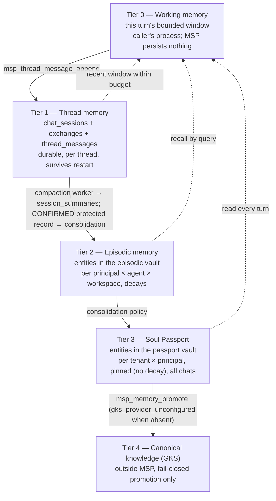

# DESIGN — Session, episodic, thread and instance memory for multi-user, multi-agent continuity

## สรุปภาษาไทย

ฉบับ 0.3.1b แก้ 3 จุดวิกฤตที่ RKOI พบในฉบับ 0.3.0b: (1) migration 0008 รันไม่ได้จริง
เพราะ CHECK มี subquery ซึ่ง SQLite ไม่อนุญาต ต้องใช้ trigger แทน (2) §12.1/§13
เปลี่ยนรูปแบบ wire ของ 6 เครื่องมือที่ zuri-ai เรียกมากเกินกว่าที่ DEC-MEMOS-02
อนุญาต (case, field name, nested grant) ต้องสร้างใหม่จากรูปแบบจริงของ branch
(3) agent ใด ๆ ก็ resolve แล้วแนบตัวเองเข้า thread ได้ ต้องจำกัดให้แนบได้เฉพาะตอน
สร้าง thread ใหม่ หรือเมื่อ grant มี `assertAgents` เท่านั้น

หลักการใหม่ที่เพิ่มจากรอบนี้:

- **grant เป็น flat object, epoch timestamp, hex hash, เซ็นด้วย `JSON.stringify`
  ตรงตามที่ zuri-ai ทำจริง** — ไม่ใช่ nested object ตามที่ 0.3.0b เคยออกแบบผิด
- **สมาชิกคนแรกของ thread เกิดจากการ append ของ HUMAN ที่ `speaker_id ===
  grant.principalId`** ไม่ใช่จาก `participants[]` บน resolve (DEC-MEMOS-12)
- **thread ที่ผูกกับคนใหม่ (relink) ต้องปิด thread เดิมและ mint thread ใหม่**
  ไม่ใช่แก้ membership เดิม (DEC-MEMOS-11)
- **agent จะแนบตัวเข้า thread ได้เฉพาะตอนที่ตัวเองสร้าง thread นั้น (`created:
  true`) หรือเมื่อ grant ของตัวเองมี `assertAgents`** ไม่มีทางอื่น
- **thread store อยู่ใน `msp-core` เดิม ไม่ใช่ package ใหม่** (DEC-MEMOS-13)
- **migration 0008 ไม่มี agent ใด ๆ เลย** — `thread_agents`, `grant_nonces`,
  agent_id/visibility บน protected record มาใน migration ถัดไปของ stage 2
  ซึ่งเลขที่ migration กำหนดตอน merge จริง ไม่ผูกไว้ล่วงหน้า (DEC-MEMOS-14)

ส่วนที่เหลือของเอกสารเป็นภาษาอังกฤษตามแบบแผนของ repo ดู §0.1 สำหรับตารางแก้ไข
ฉบับนี้ทั้งหมด และ §3.1 สำหรับตารางเทียบศัพท์

## 0. Review response

### 0.1 Round five (0.3.0b → 0.3.1b) — RKOI critical findings

RKOI reviewed commit `2f4d584` (branch `docs/memos-001-adr-design-plan`) and
returned **NEEDS REVISION, 3 critical findings**, four rulings on ATHER's
prior judgement calls, four new adopted defaults, and fifteen warnings.
Every one is answered below; nothing here is implemented.

**Critical findings**

| # | Finding | Change in 0.3.1b | Where |
|---|---|---|---|
| 1 | Migration 0008 does not apply: `protected_memory_records`'s CHECK used a subquery, which SQLite forbids in a CHECK constraint | Replaced by a `BEFORE INSERT` trigger requiring the asserter's membership to be a current member of the *same* `thread_id` and `tenant_id`, plus the HUMAN-subject-binding rule (below) | §12.1 |
| 1b | §7 rule 9 compared `subject_person_id = asserted_by_speaker_id`, but the latter is a `membership_id` FK, not a principal id | Rewritten to compare against the asserter membership's own `principal_id`, resolved via a join/lookup, never a bare column-to-column compare | §7 |
| 2 | §12.1/§13 broke DEC-MEMOS-02 (frozen wire): camelCase instead of snake_case, `contentJson` instead of `text`, dropped `exchange_id`/`direction`/`delivery_state`/`identity_assurance`/`person_id`/`message_id`/`reply_to_message_id`, `recordType` instead of `kind`, an invented required `visibility`, a `packet{}` context response instead of the real shape, an injection record with no state machine, a delivery record missing half its fields, and a nested `route{}`/`capabilities{}` grant with ISO time, `sha256:`-prefixed hash and a required nonce, when zuri-ai signs a **flat** grant with an epoch `expiresAt`, a **hex** payload hash and `JSON.stringify` | §12.1 and §13 rebuilt from the exact branch shapes RKOI supplied (below); grant is flat, epoch, hex; multi-agent fields (`agentId`, `workspaceId`, `nonce`, `assertAgents`, `assertParticipants`) are additive only | §6.1, §12.1, §12.2, §13 |
| 3 | Any agent could attach itself to any thread by calling resolve, and departure was not enforced on every thread-bound tool | Auto-attach only when `created: true`; a non-current agent resolving an existing thread gets `agent_not_current` unless its own grant carries `assertAgents`; `agent_not_current` is now a blanket rule checked on resolve (existing thread), append, context, memory_record, injection, delivery, claim, commit, retry and lifecycle | §8 |

**Rulings on ATHER's four prior judgement calls**

| Judgement call | Ruling |
|---|---|
| Grant capability growth | Accepted narrowly: additive optional flags are MSP's own concern. New required fields, nesting or encoding changes are cross-repo and out of bounds; the flat/epoch/hex layout is frozen | §6.1 |
| Per-tenant keyring | Accepted, with conditions: the key is selected by the *unverified* `grant.tenantId` and then verified; when a keyring is configured the single default key is disabled for every tenant, with no fallback; `MSP_THREAD_SERVICE_KEYRING` is allowlisted and never journaled; per-tenant rotation is explicitly deferred (stated, not designed); the keyring is defense in depth only while Tier 1 holds every key | §6.1 |
| Nonce split | Accepted, with conditions: a nonce is required on every mutating tool except append, including resolve and lifecycle; the nonce insert runs in the mutation's own transaction; an append replay with the same `source_event_id` and different content is `conflict`; pruning is bounded and opportunistic on insert, not dependent on the operator retention tick; `grant_nonces` is added to §11.1 and §15 | §6.1, §11.1, §15 |
| Single `thread_kind` | Accepted: a `threads` UPDATE trigger pins kind, tenant, business id and binding state; mint requires `thread_kind == audience_kind == grant.audienceKind`; `ROOM` behaves as `GROUP` everywhere | §6.3, §12.1 |

**New adopted defaults**

| ID | Decision | Where |
|---|---|---|
| DEC-MEMOS-11 | Relink: a `DIRECT` thread whose person changes is **closed**; the channel binding mints a new thread for the new principal; binding uniqueness is only across `ACTIVE`-status bindings; the lifetime single-`HUMAN` trigger stays; the new principal never inherits history | §7, §12.1 |
| DEC-MEMOS-12 | First membership: zuri-ai's frozen flow is resolve then a `HUMAN` append, with no `participants` field anywhere. The first `HUMAN` membership is created by a `HUMAN` append whose `speaker_id === grant.principalId`, bound to the grant's own principal rather than asserted by the caller. Every other participant creation or change requires `assertParticipants`. `AGENT` speakers are never participants | §7, §9, §13 |
| DEC-MEMOS-13 | Package placement: the thread store stays in `msp-core`, where the branch and stage 1 already put it. No separate `msp-thread-memory` package | §16 |
| DEC-MEMOS-14 | Agent timing: stage 1 (`0008`) has no `thread_agents`, no required `agentId`, no record `agent_id`/`visibility` and no `grant_nonces`. Stage 2 adds them in its own later migration. Migration numbers after `0008` are assigned in merge order, not hard-bound (correcting DEC-MEMOS-07) | §7, §8, §12.1, §12.2 |

**Warnings**

| # | Finding | Change in 0.3.1b | Where |
|---|---|---|---|
| W1 | Identity-key rotation (§6.2) was impossible: the HMAC sat on `threads` directly and no `thread_bindings` table existed | `thread_bindings` restored as its own table in `0008`, carrying the tenant-scoped HMAC binding and a `binding_status`; rotation works exactly as originally specified against it | §6.2, §12.1 |
| W2 | Delivery/injection tables lost real behaviour: a hard `thread_id NOT NULL` FK on pending deliveries made "pending before thread exists" impossible; the injection state machine and version were dropped | `thread_pending_deliveries.thread_id` is nullable; a reconcile-state transition and a restored injection state machine (`RESOLVED→SUBMITTED→COMPLETED/FAILED/UNKNOWN`) with a `version` column are back, both DELETE-forbidden | §9.2, §9.3, §12.1 |
| W3 | No tenant-consistency triggers on denormalized `tenant_id` columns | Added on every table that carries one: messages, sessions, jobs, summaries, records, both delivery tables, `thread_agents` | §12.1, §12.2 |
| W4 | Human-asserted records: `subject_person_id` binding and GROUP/ROOM visibility were underspecified against plan BL-MEMOS-024 | A `HUMAN`-asserted record's `subject_person_id` is NOT NULL and equals the asserter; `THREAD` agent-visibility is a separate axis from person-visibility; a null-subject record is asserter-only (BL-MEMOS-024); a subject-bound record is never surfaced to a different HUMAN participant of a GROUP/ROOM thread regardless of agent-visibility | §7, §10.1 |
| W5 | `global_private` exclusion from consolidation was only a code-path argument, not structural | Once provenance lands, its own trigger requires `vault_type IN ('principal_private','principal_passport')` | §10.2 |
| W6 | Compaction gaps: `retry` had no clock/token check; `claim`'s response could leak protected records | `retry` requires the lease token **or** a server-clock expiry check; `claim`'s response window carries messages only, never `protected_memory_records` | §9.4, §13 |
| W7 | No test asserted the contracts layer runs no SQL | `dependency-boundaries.test.mjs` gains a source scan of `msp-contracts` for `.prepare(`, `.exec(` and `.pragma(` | §16 |
| W8 | Environment-name drift | `MSP_TEST_CLOCK=1` used everywhere (not `MSP_ALLOW_TEST_CLOCK`) and kept out of the client allowlist; `MSP_IDENTITY_HMAC_KEY` and `MSP_THREAD_SERVICE_KEY` added to the allowlist now, `MSP_THREAD_SERVICE_KEYRING` in stage 2 | §16 |
| W9 | Epic ids in §18 disagreed with the ADR, the plan and zuri-ai's roadmap; the erasure-timing note contradicted the phase split; the cross-thread digest slice was referenced but never specified; a stale `instance-and-operator-scoping` reference survived from 0.2.3b | §18 uses the corrected epic table; tables land in phase 002, erasure in 004; a cross-thread digest slice is added to §10.1 with its suite named in §15; the stale reference in §11 is replaced | §10.1, §11, §15, §18 |
| W10 | Suite names diverged between the design and the plan, and stage-1 code is already creating `tests/security/thread-memory-scoping.security.mjs` | One list adopted: `thread-memory-scoping.security.mjs` (stage 1, the umbrella KIN is already writing), `thread-agent-scoping.security.mjs` (stage 2), `thread-erasure.security.mjs` (lifecycle/erasure), plus the unchanged vault suites | §15 |
| W11 | Missing plan backlog items | Added to the plan (§ new BL-MEMOS-1xx series, phase-tagged, not renumbering anything) | plan |
| W12 | Plan sequencing gap | BL-MEMOS-012 added as a dependency of BL-MEMOS-021..024, 029 and 030 | plan |
| W13 | §7 rule 1 was garbled ("`assertAgents === false` is irrelevant here") and cited `writePrivate`, which zuri-ai sets `false` in production and which gates memory writes, not participation | Rewritten around DEC-MEMOS-12 and `assertParticipants`; `writePrivate` no longer appears in the participation rule | §7 |
| W14 | `threads.business_id` was implicitly required | Declared nullable | §12.1 |
| W15 | ADR `:71` cited `thread-scope-guard.mjs` as if it already existed | Corrected to name it as a file to be created (and renamed to `grant-scope-guard.mjs` per DEC-MEMOS-13's package placement) | ADR |

**A tension this revision states rather than hides.** Ruling 3 requires a
nonce on every mutating tool except append, "including resolve and
lifecycle" — both stage-1 tools. DEC-MEMOS-14 places `grant_nonces` itself
in the *stage-2* migration. Read together: the nonce **rule** is the
target design from day one, but the nonce **table** does not exist until
stage 2, so stage 1 cannot yet enforce it on `resolve`, `memory_record`,
`injection_record` or `delivery_record`. §6.1 states this as a named,
accepted stage-1 gap, closed the moment stage 2 merges — not a silent
omission. If RKOI intended `grant_nonces` to ship inside `0008` instead,
that overrides DEC-MEMOS-14 as written and should say so explicitly; this
revision follows the adopted default's literal text.

### 0.2 Round four (0.2.3b → 0.3.0b) — reconciling the unmerged branch

TASK-MEMOS-001 asked ATHER to reconcile this design (0.2.3b, zero code)
with the independently-built, unmerged branch `codex/msp-thread-memory`
(`50859fb`, `e4303cb`), following RKOI's clause-by-clause comparison and
the owner's ten adopted defaults recorded in
`docs/ADR-MSP-MEMORY-OS-MULTI-USER-MULTI-AGENT.md`. Superseded in
significant part by §0.1 above (the branch shapes this round assumed were
themselves wrong); kept here as provenance.

| # | Finding | Change in 0.3.0b | Where |
|---|---|---|---|
| Naming collision | Branch labelled its surface "API-010"; zuri-ai ADR-022 already owns that name for `msp_vault_resolve` | Branch surface renamed **API-011** everywhere | §3.1, §13 |
| C-1 (critical) | A second person joins a DIRECT thread and reads the first person's private transcript/protected records, four ways | Participation changes only under an explicit claim; a DIRECT thread caps at one HUMAN; UNKNOWN/PENDING never get a private read; a protected record's subject must bind to the asserter | §7, §9, §12.1 (superseded in mechanism by §0.1's corrected trigger) |
| C-2 (critical) | The branch's authorization guard in `msp-contracts` runs SQL | A guard mirroring `vault-scope-guard.mjs` takes a precomputed boolean | §13, §16 |
| W — caller `now`, kind/audience split, unbound subject, no erasure path, raw ids in journal, global uniqueness, no nonce, single key/unverified flags, untyped errors, memory outside vault model | Each closed by construction | §6–§14 |
| Suite gap | Only one security test exists on the branch | §15 lists suite files and cases | §15 |
| Migrations | Branch 0008/0009 already pass the structural FK runner check | Folded into one corrected migration | §12.1 |
| Decision 3 | Instances/agent-leg dropped for server channels | `thread_agents` replaces them | §8 |
| Decision 4 | No participant lifecycle tool | `msp_thread_participant_lifecycle` added | §7, §13 |
| Decision 10 | No extractive fallback | `coverageGap` marker | §10.3 |

### 0.3 Round three (0.2.1b → 0.2.2b)

Historical; unchanged from 0.3.0b's record. RKOI's third review (2026-09-14)
approved v0.2.1b with zero criticals and eight warnings, folded into
v0.2.2b: `instance_thread_attachments` surrogate key and detach-only
trigger (table since withdrawn, §3.1); `redaction_marked_at` pinned;
`archived` episode erasure path; one-statement vault erasure; populated-db
unexpected-status test; identity-key recommended default and rotation
procedure (§6.2); `entities_fts` erasure row; non-empty-summary CHECK
(carried onto `session_summaries`, §12.1).

### 0.4 Round two (0.2.0b → 0.2.1b)

Historical. RKOI's second review confirmed round-one closures and raised
two criticals, twelve warnings: agent thread access as a recorded relation
(superseded by `thread_agents`, §8); full erasure table enumeration (§11.1);
mount-refusal UPDATE coverage; `isVaultAccessibleTo` signature;
`contexts` migration split; runner `user_version` timing; journal
`principal_hmac`; §13.1 trust boundary; export scope; instance re-open
binding (table withdrawn); extractive salient (fallback withdrawn);
id/ref convention; `thread_participants.tenant_id`.

### 0.5 Round one (0.1.0b → 0.2.0b)

Historical. Thirteen criticals, eleven warnings, closed at the mechanism;
several of the tables involved (instances, episodes) are withdrawn as of
0.3.0b (§3.1). Not repeated here; see `git log` of this file.

## 1. Why this document exists

zuri-ai has already decided what it expects from MSP as Tier 2, and a
substantial part of it is now **built but unmerged**, on a branch that did
not know this document existed:

| Upstream decision | What it asks of MSP | State as of 0.3.1b |
|---|---|---|
| ADR-043 D2 | "sole gateway for agent session control, episodic conversation state, and vault permission validation" | `msp_vault_resolve` (API-010) exists in this design's vocabulary; the thread/session/protected-memory model is API-011, specified here against the branch's *real* wire shapes (§0.1), built on an unmerged branch, not yet reconciled into `main` |
| ADR-044 D1/D2 | Unified thread id authority, session lifecycle, channel isolation | Threads/sessions exist on the unmerged branch with real security and correctness gaps (§0.1); this revision corrects them before anything merges |
| ADR-022 D4–D7 | API-010 `msp_vault_resolve`; private memory owned by Tenant × Principal × Agent × Workspace; thread/session/instance are provenance only | Vault ownership model (§5) is unchanged and still holds; instances are withdrawn as a concept for server channels — provenance now runs through the grant and `thread_agents` |
| PHASE-04 | `ChannelThread`, `ThreadParticipant`, `ConversationEvent`, `Session`, `Episode`, summaries, retention/tombstone, export/erase, persistence port | Threads/participants/exchanges/messages/sessions exist (branch, corrected here); episodes are replaced by thread-scoped `session_summaries` with a `coverageGap` marker |

The owner's direction (2026-09-14) is one sentence: **don't connect LINE OA
yet; make MSP complete, supporting multi user and multi agent.** This
revision is a corrected data model, a wire-faithful API-011 tool surface,
the multi-user and multi-agent rules, and a delivery order gated on
erasure existing before any channel goes live.

## 2. Terms

Id and ref convention is unchanged from 0.2.3b
(`packages/msp-core/src/domain/vault-registry.mjs` `rowToVault`).

| Term | Meaning | Id (column) | Who mints |
|---|---|---|---|
| **Principal** | The canonical human (zuri-ai `Person.id`). Owner of permanent memory. | opaque, supplied | zuri-ai identity |
| **Tenant / business / workspace / agent** | Server-owned scope from AuthContext | opaque, supplied | zuri-ai |
| **Thread** | One conversation container: `DIRECT`, `GROUP` or `ROOM` (`ROOM` behaves as `GROUP` everywhere in this document) | `thread_id` | MSP, on `msp_thread_resolve` |
| **Thread binding** | The tenant-scoped, HMAC'd link from a channel account's external room ref to a thread; several bindings may exist per thread across a key rotation, but only one may be `ACTIVE` for a given `(tenant_id, channel_account_id, external_ref_hmac)` | `binding_id` | MSP |
| **Grant** | A flat, signed, capability-flagged, short-lived authorization object wrapping every API-011 call | opaque JSON + HMAC signature | zuri-ai (Tier 1), keyed by `MSP_THREAD_SERVICE_KEY`(`RING`) |
| **Speaker / participant** | A `HUMAN`, `OPERATOR` or `UNKNOWN`-kind row in `thread_participants` | `membership_id` | MSP, under DEC-MEMOS-12's first-append rule or an explicit `assertParticipants` claim |
| **Agent attachment** | A row in `thread_agents` recording that agent × workspace is currently serving a thread | `(thread_id, agent_id, workspace_id)` | MSP, on thread creation or under `assertAgents` |
| **Exchange** | One inbound/outbound message pair on a thread, grouping `direction: 'IN'`/`'OUT'` messages | `exchange_id` | MSP |
| **Chat session** | One bounded stretch of message activity on a thread | `session_id` | MSP |
| **Message** | One append-only turn record | `message_id` | MSP |
| **Protected memory record** | A thread-scoped assertion pending consolidation into a subject's own vault | `record_id` | MSP, under a signer's own grant |
| **Session summary** | The compacted record of a stretch of messages, produced by a host-injected worker | `summary_id` | MSP, via the compaction worker tools |
| **Episodic vault** | The principal's private memory with one agent in one workspace (`principal_private`) | `vault_id` | MSP, via `msp_vault_resolve` |
| **Soul Passport vault** | The principal's permanent memory across every agent and workspace in a tenant (`principal_passport`) | `vault_id` | MSP, via `msp_vault_resolve` |

## 3. What exists today and what is missing

Reused unchanged: `vaults`/`vault_mounts`/`VaultRegistry`
(`packages/msp-core/src/domain/vault-registry.mjs:248`, `:275`); API-009
entities; append-only `journal`; the fail-closed GKS bridge;
`vault-scope-guard.mjs`'s pattern.

Built on the unmerged branch, corrected before merge (§0.1, §12.1–§12.3):
`threads`, `thread_bindings`, `thread_participants`, `exchanges`,
`chat_sessions`, `thread_messages`, `protected_memory_records`,
`session_compaction_jobs`, `session_summaries`,
`thread_delivery_receipts`, `thread_pending_deliveries`,
`thread_injection_receipts`, `thread_summary_invalidations`, and the ten
`msp_thread_*`/`msp_session_*` tools, renamed API-011.

Missing, net-new relative to both prior efforts: tenant/principal-scoped
vault types and `msp_vault_resolve` (§5, unbuilt); `thread_agents` and
every multi-agent rule (§8, stage 2); a participant lifecycle tool (§7);
a DB-backed guard in `msp-core` so `msp-contracts` never touches SQL
(§13, §16); tenant-scoped uniqueness and HMAC-at-rest room refs (§6.3);
a grant nonce table and replay rule, shipping in stage 2 (§6.1);
tombstone-ready triggers on every content-bearing thread table (§11.1);
consolidation from `CONFIRMED` protected records into principal vaults
(§10.2).

### 3.1 Concept mapping: v0.2.3b → API-011

| v0.2.3b concept | API-011 equivalent | What changed and why |
|---|---|---|
| Thread minting, `th_usr_`/`th_grp_` ids | `msp_thread_resolve`, `threads.thread_kind IN ('DIRECT','GROUP','ROOM')` | `ROOM` added but behaves as `GROUP`; kind is a column, not encoded in the id |
| `instances`, `msp_instance_open/heartbeat/close` | *withdrawn* | The grant + `thread_agents` (§8) is the recorded relation instead |
| `instance_thread_attachments` | `thread_agents` (§8, §12.2, stage 2) | Same append-only/partial-unique shape family, no lease machinery |
| `sessions` | `chat_sessions` (§9) | Same one-open-session-per-thread invariant |
| `conversation_events` | `exchanges` + `thread_messages` (§9) | An exchange groups one inbound/outbound pair; a message is one directional entry |
| `episodes`, `msp_episode_commit/consolidate/list` | `session_summaries` + `msp_session_compaction_claim/commit/retry` (§9.4, §13) | Summarization is an asynchronous, host-injected worker claiming a leased job, not a synchronous in-turn call |
| Extractive fallback | `coverageGap` marker (§10.3) | MSP never truncates a stand-in summary |
| `msp_turn_context` | `msp_thread_context` (§10.1) | Same bounded-packet idea; adds thread-scoped protected records and a cross-thread digest slice, both principal-scoped |
| Consolidation authority | Unchanged rule, generalized (§10.2) | Applies to confirming a protected record, not only an episode's `salient` |

## 4. Five memory tiers



| Tier | Owner key | Lifetime | Store | Decay | Read by |
|---|---|---|---|---|---|
| 0 Working | the caller's process | one turn | not persisted by MSP | — | the calling process |
| 1 Thread | thread | open → closed, then retained per policy | `chat_sessions`, `exchanges`, `thread_messages`, `protected_memory_records`, `session_summaries` | retention tick tombstones content | current `VERIFIED` `HUMAN` participants, and current agents (§7, §8) |
| 2 Episodic | tenant × principal × agent × workspace | months | API-009 entities in the episodic vault | Ebbinghaus | this principal's turns with this agent in this workspace |
| 3 Passport | tenant × principal | until erasure | API-009 entities in the passport vault | pinned | every turn of this principal in the tenant, any agent, when `allow_passport` |
| 4 Canonical | portfolio/tenant (GKS) | permanent | GKS | n/a | governed retrieval |

## 5. Ownership model — vaults

*(Kept unchanged from 0.2.3b/0.3.0b.)*

Two vault types are added. Existing types are unchanged.

| `vault_type` | Owner columns | Role |
|---|---|---|
| `shared` (existing) | `project_id` | identity only; never a write target |
| `workspace_private` (existing) | `workspace_id` | dev-agent workspace memory (GoVibe) |
| `global_private` (existing) | `agent_id` | the agent's own cross-project memory — **never** a principal's private facts; §10.2 makes exclusion structural |
| **`principal_private`** (new) | `tenant_id`, `principal_id`, `agent_id`, `workspace_id` — all NOT NULL while active | the episodic vault |
| **`principal_passport`** (new) | `tenant_id`, `principal_id` — NOT NULL while active; `agent_id`, `workspace_id` — NULL | the Soul Passport |

Rules 1–7 are unchanged from 0.3.0b: thread/session/message/grant/agent
ids are never vault owners; a group or room thread owns nothing; principal
vault ids are random and idempotency is schema-enforced (two partial
unique indexes plus a NOT-NULL-while-active CHECK, `vault-registry.mjs:248`
/`:275`); `decay_policy` gates Ebbinghaus vs pinned; principal vault types
are never mountable, owner check ahead of the mount short-circuit; passport
reads/writes gated by `allow_passport`; every path to a principal vault
requires a matching access context (§5.1).

### 5.1 Caller identity on the nine `msp_memory_*` tools

*(Kept unchanged from 0.2.3b/0.3.0b — see that revision's text; nothing in
this round touches API-009.)*

## 6. Grant, identity key and thread minting

### 6.1 The signed per-room grant

Every API-011 tool requires an `access` argument: `{ grant, signature }`.
`signature` is `HMAC-SHA256(key, JSON.stringify(grant))`, **hex-encoded**,
keyed by `MSP_THREAD_SERVICE_KEY` (≥ 32 characters) or a per-tenant entry
in `MSP_THREAD_SERVICE_KEYRING`. A missing key denies everything
(`grant_unconfigured`).

**The grant is flat — this is a correction from 0.3.0b, which wrongly
nested it.** zuri-ai's actual signer
(`msp-thread-memory-port.js:183-199`) produces:

```json
{
  "operation": "thread_resolve",
  "expiresAt": 1757836805,
  "payloadHash": "9f2c1a...e4",
  "tenantId": "…", "principalId": "…", "policyRevision": "…",
  "businessId": "…", "channelAccountId": "…", "externalRoomRef": "…",
  "audienceKind": "DIRECT",
  "readPrivate": true, "writePrivate": true, "operator": false,
  "deliveryWriter": false, "confirmMemory": false
}
```

- `expiresAt` is a **Unix epoch integer**, at most 65 seconds ahead of the
  server clock at verification time — not an ISO-8601 string.
- `payloadHash` is a **hex-encoded** SHA-256 of the exact request payload
  the grant authorizes — not `sha256:`-prefixed.
- The signature covers `JSON.stringify(grant)` **exactly as zuri-ai
  produces it** (object-insertion key order, no canonicalization step on
  either side). This is fragile by nature — insertion-order-dependent
  hashing always is — and is accepted as the frozen wire reality rather
  than redesigned; a canonical-JSON scheme is out of scope because it
  would be a cross-repo wire change DEC-MEMOS-02 forbids without the
  owner's sign-off.
- `businessId`, `channelAccountId`, `externalRoomRef`, `audienceKind` are
  present on tools that resolve or reference a thread by its channel
  identity. `audienceKind` is checked against the thread's persisted
  `thread_kind` on every call against an *existing* thread (§6.3).
- Capability flags (`readPrivate`, `writePrivate`, `operator`,
  `deliveryWriter`, `confirmMemory`) gate the corresponding tool families
  (§13). None of them governs participation — see §7's correction of the
  0.3.0b error that cited `writePrivate` there.

**Additive-only fields (ruling: "accepted narrowly").** `agentId`,
`workspaceId`, `nonce`, `assertAgents`, `assertParticipants` are optional
fields MSP itself defines and may add to the flat object without a
cross-repo contract change, because a JSON object gains keys without
breaking a signer that does not yet know about them **as long as neither
side reorders existing keys** — zuri-ai's stage-1 signer needs no change
to keep signing correctly; stage 2 asks it to start including
`agentId`/`workspaceId`. `agentId` and `workspaceId` become **required**
starting in stage 2 (tracked as a cross-repo change, see the ADR's
cross-repo change list and plan risk `RSK-MEMOS-01`).

**Nonce and replay.** The target rule, once `grant_nonces` exists: a
nonce is required on **every** mutating tool **except**
`msp_thread_message_append`, including `msp_thread_resolve` and
`msp_thread_participant_lifecycle`. `msp_thread_message_append` needs no
nonce — its own `source_event_id` is the idempotency key (§9.1); a replay
with the same `source_event_id` and **identical** content returns the
original result (`deduplicated: true`); a replay with the same
`source_event_id` and **different** content is `conflict`, never a
silent overwrite. For every other tool, the nonce is recorded in
`grant_nonces (tenant_id, nonce, expires_at)`,
`PRIMARY KEY (tenant_id, nonce)`, **inserted in the same transaction as
the mutation it guards** — so a rolled-back mutation never permanently
consumes a nonce a legitimate retry needs. A second use of the same
`(tenant_id, nonce)` before `expires_at` is `grant_replayed`. Pruning is
opportunistic and bounded: each insert also deletes that tenant's own
expired rows (`DELETE FROM grant_nonces WHERE tenant_id = ? AND
expires_at < ?`), never depending on the operator retention tick.

**Stage-1 gap, named rather than hidden (§0.1).** `grant_nonces` ships in
stage 2 (DEC-MEMOS-14), not in `0008`. Before then, `msp_thread_resolve`
is naturally replay-safe (it is an idempotent mint/lookup — replaying it
changes nothing), but `msp_thread_memory_record`, `msp_thread_injection_record`
and `msp_thread_delivery_record` have no nonce protection in stage 1. This
is an accepted, temporary gap, closed the moment stage 2 merges — not
silently absorbed into "done."

**Key configuration.** `MSP_THREAD_SERVICE_KEY` is the default, all-tenant
key. `MSP_THREAD_SERVICE_KEYRING` (a JSON map `tenantId → key`) is an
opt-in stronger mode: the key is **selected by the grant's own (unverified)
`tenantId`, then the signature is verified against it** — a tenant absent
from the keyring is `grant_unconfigured`; a tenant present but with a bad
signature is `grant_signature_invalid`. **When a keyring is configured,
the single default key is disabled for every tenant — there is no
fallback to it for a tenant missing from the keyring.**
`MSP_THREAD_SERVICE_KEYRING` is added to the client env allowlist (§16)
and is never journaled, echoed in an error, or returned. **Per-tenant
rotation is explicitly deferred**, not designed: rotating one tenant's key
today means a coordinated cutover with a short window in which in-flight
grants signed under the old key fail; a dual-read mechanism (mirroring
§6.2's identity-key rotation) is future work if this becomes operationally
necessary. **The keyring is defense in depth only while Tier 1 itself
holds every tenant's key** — it stops a leaked key from forging grants for
*other* tenants, but it does not protect against a compromise of Tier 1's
own key store, which still holds all of them.

**Trust boundary.** Unchanged from §13.1: every capability flag is a
Tier 1 assertion MSP does not independently verify; the signature, hash
and short expiry hardenwire integrity, not identity.

### 6.2 The identity key: presence and rotation

*(Kept from 0.2.3b/0.3.0b, restored to be actually implementable — see
W1.)* `MSP_IDENTITY_HMAC_KEY` is needed by `msp_thread_resolve` and by
every tool that journals a `principal_hmac`. Two ways to surface its
absence (per-tool refusal made loud, or `MSP_REQUIRE_IDENTITY_KEY=1`
opt-in fail-closed boot) are unchanged from 0.2.3b §6.2.

**Rotation needs a table to rotate against, and this revision restores
it.** 0.3.0b's rotation procedure assumed several bindings could exist per
thread, but put the HMAC directly on `threads`, which has exactly one row
per thread and cannot hold two bindings during a rotation window. Fixed:
`thread_bindings` (§12.1) is its own table, `UNIQUE(tenant_id,
channel_account_id, external_ref_hmac)` scoped to `binding_status =
'ACTIVE'` rows only. `MSP_IDENTITY_HMAC_KEY_PREVIOUS` opens the dual-read
window exactly as originally specified: `msp_thread_resolve` looks up the
binding under the new key, then the old, and on an old-key hit inserts a
new binding row under the new key for the same thread; the window closes
when the previous key is removed and `msp_retention_tick` reports zero
old-key bindings resolved since the last tick. Journal rows are never
rewritten.

### 6.3 Thread minting, kind, and tenant-scoped uniqueness

- **Minting is idempotent on `(tenant_id, channel_account_id,
  external_ref_hmac)` scoped to `ACTIVE` bindings** (§12.1) — tenant-scoped,
  correcting the branch's global unique.
- **MSP never stores a raw platform id.** `external_ref_hmac =
  HMAC-SHA256(MSP_IDENTITY_HMAC_KEY, tenant_id | channel_account_id |
  external_room_ref)`. Absent the key, `msp_thread_resolve` answers
  `identity_hmac_unconfigured`.
- **A single persisted `threads.thread_kind` is the only canonical
  audience** — `DIRECT`, `GROUP` or `ROOM` (`ROOM` behaves as `GROUP`
  everywhere). **On mint, `thread_kind == audience_kind == grant's own
  `audienceKind` must all agree**, or the mint is refused
  (`validation_failed`). On every subsequent call against an *existing*
  thread, the grant's `audienceKind` is compared to the stored
  `thread_kind`; a mismatch is `thread_audience_mismatch`. A `threads`
  `UPDATE` trigger (§12.1) pins `thread_kind`, `tenant_id` and
  `business_id` for the life of the row; only `status` may transition
  `ACTIVE → CLOSED`, and a `CHECK` constrains `status` to those two
  values.
- **DEC-MEMOS-11: relink closes the thread, it does not rewrite it.** A
  `DIRECT` thread whose channel account is reassigned to a different
  Person is **closed** (`status → 'CLOSED'`), and its `thread_bindings`
  row's `binding_status` flips to `'CLOSED'` in the same transaction — the
  binding's uniqueness is scoped to `ACTIVE` rows only, so the same
  `external_ref_hmac` immediately becomes available again. The *next*
  `msp_thread_resolve` for that channel account mints a **new** thread and
  a new `ACTIVE` binding for the new principal. The lifetime single-`HUMAN`
  trigger is unaffected — it only ever evaluated within one thread's own
  rows, and the new thread starts with none. The new principal inherits
  nothing: no messages, no records, no summaries, because they belong to a
  different `thread_id` entirely.

## 7. Participants — the multi-user model

MSP has no identity store and cannot verify who is in a LINE group or
room. Participation is a **server-derived fact asserted by the trusted
Tier 1 process** (§13.1), constrained to one narrow creation path rather
than pretended to be verified.

1. **DEC-MEMOS-12: the first `HUMAN` membership of a thread is created by
   the first `HUMAN`-kind `msp_thread_message_append` whose `speaker_id
   === grant.principalId`** — bound to the grant's own principal, never to
   a value the caller merely asserts about someone else. `msp_thread_resolve`
   carries **no `participants` field at all**; zuri-ai's frozen flow is
   exactly "resolve, then append." **Every other participant creation or
   change** — a second `HUMAN` participant of a `GROUP`/`ROOM` thread, any
   `OPERATOR` participant, or a role/assurance change on an existing row —
   **requires `grant.assertParticipants === true`**, or the call is
   `thread_scope_denied`. This replaces 0.3.0b's garbled rule 1 (which
   named a nonsensical `assertAgents === false` condition and wrongly
   gated participation on `writePrivate` — a capability that gates memory
   *reads and writes*, not who may become a participant, and which
   zuri-ai's production grants set `false` far more often than not, which
   would have denied ordinary first-contact conversations outright).
2. **`speaker_kind` is `HUMAN`, `OPERATOR` or `UNKNOWN`.** `AGENT` is
   deliberately not a value here — an agent's relation to a thread is
   `thread_agents` (§8), never a participant row.
3. **A `DIRECT` thread holds exactly one `HUMAN` participant for its whole
   life**, schema-enforced (§12.1). It may additionally hold any number of
   `OPERATOR` participants; `OPERATOR` never counts toward the one-`HUMAN`
   cap and never gets a private read. `GROUP`/`ROOM` threads accept any
   number of `HUMAN` and `OPERATOR` participants.
4. **The participation predicate is `left_at IS NULL`.** A departed or
   erased principal is not a participant: `thread_scope_denied` on every
   thread-scoped tool, including for history before they left.
5. **A private read or write requires the grant's principal to be a
   *current* `VERIFIED` `HUMAN` participant.** `UNKNOWN` speakers never
   satisfy this regardless of `identity_assurance`; `OPERATOR`
   participants never satisfy it regardless of assurance level.
6. **`identity_assurance` (`VERIFIED`, `PENDING`, `UNRESOLVED`) is set at
   membership creation and can be raised only through
   `msp_thread_participant_lifecycle` under an explicit verification
   claim, never as a side effect of an ordinary append.** DEC-MEMOS-12's
   append-creates-membership path sets the *initial* value from the
   append request's own `identity_assurance` field (present on the wire
   because zuri-ai's frozen append shape carries it, §13); a **subsequent**
   append by an already-current participant carries the same field on the
   wire for shape-compatibility, but the stored `identity_assurance`
   **never changes as a result** — only the lifecycle tool changes it.
   This is what closes the branch's `PENDING`-self-upgrade vector: the
   field exists on the append tool because the frozen wire shape requires
   it, but it is authoritative only at the exact instant of first-row
   creation.
7. **Membership rows are append-only**: leaving sets `left_at`; rejoining
   inserts a new row. A partial unique index allows at most one open
   membership per `(thread_id, principal_id)`.
8. **`msp_thread_participant_lifecycle`** supports `leave` (close one
   membership, `assertParticipants` required) and `close_for_relink`
   (close the whole `DIRECT` thread per DEC-MEMOS-11, `operator` required
   — a more privileged, administrative action than an ordinary leave).
   Nothing calls `close_for_relink` yet; wiring it into zuri-ai's actual
   relink/merge flow is deferred (decision 4, `docs/ADR-MSP-MEMORY-OS-MULTI-USER-MULTI-AGENT.md`).
9. **A protected memory record's subject must be bound to its own
   asserter's principal — corrected from 0.3.0b's wrong comparison.**
   `asserted_by_speaker_id` is a `thread_participants.membership_id` FK,
   not a principal id, so the rule is: **when the asserting membership's
   `speaker_kind = 'HUMAN'`, `subject_person_id` must be NOT NULL and
   equal that membership's own `principal_id`** — resolved through a join,
   never compared as a bare column (§12.1's trigger does this exactly, not
   the impossible `subject_person_id = asserted_by_speaker_id` compare
   0.3.0b wrote). A record whose asserter is `OPERATOR`-kind may leave
   `subject_person_id` NULL — an operational note about no specific person
   — and such a null-subject record is **visible only to its own asserter**
   (plan BL-MEMOS-024), never broadcast by agent-visibility alone. A
   subject-bound record is never surfaced to a *different* `HUMAN`
   participant of a `GROUP`/`ROOM` thread, regardless of any agent-side
   visibility flag added in stage 2 (§10.1).
10. `thread-memory-scoping.security.mjs` (§15) proves every rule above.

## 8. Agents — the multi-agent model (stage 2)

**Ships in stage 2, on its own migration (DEC-MEMOS-14) — not in `0008`.**
An agent's relation to a thread is a recorded fact, `thread_agents`, never
an implicit tenant-wide grant and never a participant row.

```sql
EXISTS (SELECT 1 FROM thread_agents
        WHERE thread_id = :thread_id AND agent_id = :agent_id
          AND workspace_id = :workspace_id AND left_at IS NULL)
```

1. **`thread_agents (thread_id, agent_id, workspace_id, tenant_id,
   joined_at, left_at)`** is append-only, partial unique on
   `(thread_id, agent_id, workspace_id) WHERE left_at IS NULL`.
2. **Attachment happens exactly two ways — corrected from 0.3.0b's actual
   defect (finding 3):**
   - **(a) Automatic, only when the calling agent's own
     `msp_thread_resolve` call is the one that mints the thread**
     (`created: true` in the response). A resolve that finds an existing
     thread (`created: false`) never auto-attaches anyone.
   - **(b) Self-asserted, when the calling agent's own grant carries
     `assertAgents === true`.** A non-current agent calling
     `msp_thread_resolve` on an *existing* thread without `assertAgents`
     gets `agent_not_current` — it does **not** silently succeed and
     attach, which was 0.3.0b's actual bug (its §13 prose said "the
     calling agent is attached" on every resolve, contradicting this
     section's own rule 2, and §17.2's per-turn sequence resolved on
     *every* turn, which would have re-attached an unrelated agent on
     every single message).

   There is no mechanism for one agent to name and attach a *different*
   agent's identity in this revision — every attachment is the joining
   agent's own grant, asserting its own membership. A future
   `msp_thread_agent_detach` tool (plan BL-MEMOS-051) is the inverse:
   removing an agent's own attachment under an explicit claim.
3. **`agent_not_current` is a blanket rule, checked identically across
   every thread-bound tool**, not restated ad hoc per tool: `resolve` on
   an *existing* thread, `append`, `context`, `memory_record`,
   `injection_record`, `delivery_record`, `claim`, `commit`, `retry`, and
   `lifecycle`. A departed agent (`left_at` set) loses every one of these
   on its very next call — there is no grace window.
4. **Journal actor and pseudonymization.** Every mutating tool journals
   `actor = grant.agentId` once `agentId` is required (stage 2); wherever
   a principal must remain auditable, the payload carries `principal_hmac`,
   never the raw id.
5. **Two agents serving the same person** — unchanged in substance from
   0.3.0b: episodic vaults are separate (owner tuple includes `agent_id`);
   the passport is shared only through `allow_passport`-gated reads;
   protected records gain `agent_id` and `visibility` (`AGENT`/`THREAD`)
   **as an additive stage-2 column pair, layered on top of the frozen
   branch shape** (§12.2) — this axis governs which *agents* may see a
   record, entirely separate from the person-visibility rule in §7 rule 9,
   which governs which *humans* may; session summaries remain thread-level
   and unscoped by agent; `global_private` is structurally excluded from
   consolidation once provenance lands (§10.2, W5).
6. **Tenancy.** `thread_agents.tenant_id` is compared against the grant's
   `tenantId` on every lookup, with its own tenant-consistency trigger
   (§12.2, W3); an agent id is never treated as globally unique across
   tenants.

## 9. Sessions, exchanges and messages

### 9.1 `chat_sessions`, `exchanges` and `thread_messages`

- **One open chat session per thread**: `UNIQUE INDEX ... ON
  chat_sessions(thread_id) WHERE status IN ('OPEN','CLOSING')`. Opening is
  idempotent.
- **An exchange groups one inbound/outbound pair.** `exchanges
  (exchange_id, thread_id, tenant_id, sequence, opened_at, closed_at)` is
  append-only and holds no content. An exchange opens on an inbound
  (`direction = 'IN'`) message with no currently-open exchange for the
  thread, and closes when a matching outbound (`direction = 'OUT'`)
  message is appended, or is left open across a session boundary if no
  reply ever comes.
- **`thread_messages`** carries the branch's actual, frozen columns:
  `message_id`, `thread_id`, `session_id`, `exchange_id`, `sequence`
  (MSP-assigned, total order per thread), `speaker_id`, `speaker_kind`
  (`HUMAN`/`OPERATOR`/`AGENT`/`SYSTEM`), `identity_assurance`, `direction`
  (`IN`/`OUT`), `text` (**plain text, not `content_json`** — 0.3.0b's
  `contentJson` was a wire-shape violation), `person_id` (nullable — the
  actual person a relayed message concerns, when `speaker_id` names an
  `OPERATOR`/`AGENT` speaking on their behalf, rather than the person
  themselves; **ATHER's inference from the field list RKOI supplied, not
  independently confirmed against the branch's own code — KIN should
  verify this against `msp-thread-memory-port.js` during stage-1 porting**),
  `source_event_id` (**now required, not optional**), `occurred_at`,
  `received_at`, `reply_to_message_id` (self-referential, nullable),
  `delivery_state`, `policy_revision`, `redaction_state`.
- **Idempotency and conflict.** `UNIQUE(thread_id, source_event_id)` is
  the sole idempotency key (no global unique — tenant-scoped via the
  thread). A retry with the **same** `source_event_id` and **identical**
  fields returns the original `(messageId, exchangeId, sequence)` with
  `deduplicated: true`. A retry with the same `source_event_id` and
  **different** content is `conflict` — never silently overwritten and
  never silently deduplicated against mismatched data.
- **Authorship.** `agent_not_current` (§8 rule 3) applies to every append,
  regardless of direction. A `HUMAN`/`OPERATOR`-authored (`speaker_kind`)
  message additionally requires the named `speaker_id` to be a *current*
  participant — or to be the very first `HUMAN` append that creates one
  (DEC-MEMOS-12, §7 rule 1).
- **Tenant consistency.** A `BEFORE INSERT` trigger on `thread_messages`
  (and on `chat_sessions`, `session_compaction_jobs`, `session_summaries`,
  `protected_memory_records`, and both delivery tables) refuses a row
  whose `tenant_id` does not equal its parent thread's `tenant_id` (W3).

### 9.2 Delivery reconciliation

- **Pending-before-thread is restored (W2).** `thread_pending_deliveries`
  no longer carries a `NOT NULL` `thread_id` FK — 0.3.0b's version made it
  impossible for a delivery receipt to arrive before the inbound message
  (and its thread) existed, which the branch's own design explicitly
  needed. `thread_id` is nullable; reconciliation fills it in once the
  corresponding message exists.
- `thread_delivery_receipts` carries `inbound_message_id`,
  `source_event_id` (conventionally `<inbound message's source event
  id>:assistant`), `receipt_id`, `outcome`, `text`, `provider_ref`, and a
  **`reconcile_state`** column (`PENDING`/`RECONCILED`/`INVALIDATED`) with
  its own transition trigger — restored from the branch, dropped by
  mistake in 0.3.0b.
- A receipt that lands on a *closed* session invalidates that session's
  summaries (`thread_summary_invalidations`) and re-queues compaction.
- Both delivery tables carry redactable text with the same tombstone-only
  trigger convention as `thread_messages`, and both forbid `DELETE`.

### 9.3 Injection receipts

**The state machine and version are restored (W2).**
`thread_injection_receipts` carries `thread_id`, `exchange_id`,
`injection_id`, `packet_hash`, `policy_revision`, `model_ref`, `state`
(`RESOLVED → SUBMITTED → COMPLETED/FAILED/UNKNOWN`), and `version`
(starts at 1, increments on each state transition). A transition trigger
permits only the forward state machine and a matching version increment;
`DELETE` is forbidden. Packet content itself is never stored — only its
hash — so there is nothing to tombstone on erasure beyond the state row
itself, which holds no principal content.

### 9.4 Compaction workers (stage 1)

Summarization is a host-injected worker's job, never MSP's.

- `msp_session_sweep(limit, [now])` finds sessions past their idle/segment
  policy and creates `session_compaction_jobs` rows.
- `msp_session_compaction_claim(job_id, worker_id, lease_seconds ≤ 300)`
  leases one job for the calling worker (`status → 'CLAIMED'`,
  `lease_token` set). **The response's window carries messages only — it
  never includes `protected_memory_records`** (W6): a summarization
  worker has no business reading a person's protected memory to produce a
  transcript summary, and leaking it there would bypass every
  visibility/subject-binding rule in §7/§10.1.
- `msp_session_compaction_commit(session_id, job_id, source range,
  summary, source_digest, policy_revision, summarizer_version,
  invocation_state, lease_token)` writes a `session_summaries` row. The
  `lease_token` must match and be unexpired, or `compaction_lease_conflict`.
- `msp_session_compaction_retry(job_id, error, lease_token)` requeues a
  job. **Fixed (W6): retry succeeds if the presented `lease_token` matches
  the job's current one, *or* if the job's lease has already expired by
  the server clock** — a legitimate retry after a worker crash has lost
  its token along with the process, and requiring the token unconditionally
  would strand every crashed job forever.
- **Caller-supplied `now` is test-only, gated by `MSP_TEST_CLOCK=1`**
  (renamed from 0.3.0b's `MSP_ALLOW_TEST_CLOCK`, W8) — ignored in
  production; the server clock is always authoritative there.

## 10. Per-thread context, and consolidation to principal vaults

### 10.1 `msp_thread_context`

Request (frozen wire, per branch): `thread_id`, `recent_exchange_count`,
`current_exchange_id`. Response: `{ thread, session, recentExchangeCount,
recentExchanges[], participants[], threadSummaries[], protectedRecords[],
coverageGap, asOf }` — **`coverageGap` is a single object or `null`**, not
an array (correcting 0.3.0b's invented shape).

| Slice | Source | Gate |
|---|---|---|
| `recentExchanges[]` | `exchanges` + their `thread_messages`, anchored at `current_exchange_id` for `recent_exchange_count` back | current `VERIFIED` `HUMAN` participant, or current agent |
| `participants[]` | `thread_participants` (current rows only) | current participant or current agent |
| `threadSummaries[]` | `session_summaries` for this thread, `redaction_state != 'tombstoned'`; `coverageGap` names the uncovered range when nothing covers the requested window (§10.3) | current participant or current agent |
| `protectedRecords[]` | `protected_memory_records` visible to the caller: a subject-bound record only to that subject's own principal read (never to a different `HUMAN` participant of a `GROUP`/`ROOM` thread, §7 rule 9); a null-subject record only to its own asserter (BL-MEMOS-024); agent-side `visibility` (`AGENT`/`THREAD`, stage 2) further narrows which *agents* see it — the two axes are independent and both must pass | current participant or current agent, subject to both visibility axes |
| Passport facts (unchanged from 0.2.3b) | passport vault | `allow_passport`; the grant's principal only |
| Episodic recall (unchanged) | episodic vault search | `readPrivate`; the grant's principal only |
| **Cross-thread digest** (restored — was referenced in §3.1 but never specified in 0.3.0b, W9) | last `k` active `session_summaries` of the principal's **own other `DIRECT` threads** with the same agent × workspace | the grant's principal only; never surfaces a `GROUP`/`ROOM` thread's summary into a `DIRECT` thread's context, mirroring 0.2.3b §10's original rule |

- **A group or room thread never produces a private read for anyone** —
  passport, episodic recall and the cross-thread digest are principal-scoped
  and do not populate for an agent-only call or a request with no single
  owning principal.
- **Denied is empty, not partial.**

### 10.2 Consolidation authority (decision 8, generalized)

Unchanged in substance from 0.3.0b: a `CONFIRMED` protected record
consolidates into the subject's own vault only under that subject's own
access context, resolved via `msp_vault_resolve`; a bystander cannot
consolidate it into their own vault; `global_private` is never a valid
target. **Structural fix (W5):** once the future `record_provenance` table
(§12.4) lands, it carries its own `BEFORE INSERT` trigger requiring
`(SELECT vault_type FROM vaults WHERE vault_id = new.vault_id) IN
('principal_private','principal_passport')` — turning "never targets
`global_private`" from a property of the code path into a property the
schema itself refuses to violate, regardless of how the consolidation
tool is later implemented.

### 10.3 No extractive fallback — `coverageGap`

Unchanged: when `threadSummaries[]` has no row covering a requested range
of messages, the response's `coverageGap` names the gap directly (as a
single object, not a list — §10.1): `{ "seqFrom": 118, "seqTo": 154 }`, or
`null` when nothing is missing. MSP never truncates messages into a
stand-in summary.

## 11. Retention, erasure, export

- **Operator binding.** `msp_retention_tick` and `msp_session_sweep`
  require `grant.operator === true` and act only on `grant.tenantId`.
  **Corrected (W9): the suite proving this is `thread-memory-scoping.security.mjs`
  for stage-1 tenant/operator cases** — 0.3.0b's stale reference to an
  `instance-and-operator-scoping.security.mjs` file named a suite that
  tested the withdrawn `instances` table and no longer applies.
- **Data-subject binding.** `msp_principal_export` and
  `msp_principal_erase` act on `principal_id = grant.principalId`, or
  another principal of the same tenant only when `data_subject_admin`.
  Erase additionally requires `erase === true`.
- **Every read path is tombstone-aware by construction.**

### 11.1 Erasure — every table, and what happens to it

| Table | Holds for the principal | Disposition on erase |
|---|---|---|
| `thread_messages` | authored content | `text → ''`, `redaction_state → 'tombstoned'` |
| `protected_memory_records` | asserted or subject-bound bodies | `body → '{}'`, `redaction_state → 'tombstoned'` for rows where the principal is the asserter's principal or the subject |
| `session_summaries` | summaries citing the principal's messages | tombstoned when the principal was a current participant at erasure time; otherwise untouched |
| `thread_delivery_receipts`, `thread_pending_deliveries` | delivery text | `text → '{}'`, `redaction_state → 'tombstoned'` |
| `thread_participants` | membership | every open row closed |
| `thread_bindings` | HMAC only | untouched — already pseudonymous, holds no raw content |
| `thread_agents` | — | untouched — names agents/workspaces, never a principal |
| `grant_nonces` | — | untouched — opaque, tenant-scoped, no principal content (added per ruling 3) |
| `exchanges`, `thread_injection_receipts`, `thread_summary_invalidations`, `session_compaction_jobs` | — | untouched — no principal content |
| `entities`/`entity_history` (both principal vaults), `embeddings`, `entities_fts` | fact bodies | unchanged from 0.2.3b |
| `vaults` | owner ids | one `UPDATE` statement: `status → 'erased'`, `principal_id → NULL` |
| `erasure_receipts` | opaque id, counts, reason | written; retained |
| `journal` | `principal_hmac` only | untouched |

## 12. Storage schema

### 12.0 Runner mode for a parent-table rebuild

*(Kept unchanged — see 0.2.3b/0.3.0b for the full text; nothing in this
round touches the runner.)*

### 12.1 `0008_thread_memory.sql` — stage 1 only (no agent fields, corrected)

Purely additive — no existing table rebuilt, no `foreign-keys=off` needed.
**Deliberately excludes** `thread_agents`, any required `agentId`, any
`agent_id`/`visibility` column on `protected_memory_records`, and
`grant_nonces` — all of that is stage 2 (§12.2, DEC-MEMOS-14).

```sql
CREATE TABLE threads (
  thread_id TEXT PRIMARY KEY,
  tenant_id TEXT NOT NULL,
  business_id TEXT,                          -- nullable (W14)
  thread_kind TEXT NOT NULL CHECK (thread_kind IN ('DIRECT','GROUP','ROOM')),
  status TEXT NOT NULL DEFAULT 'ACTIVE' CHECK (status IN ('ACTIVE','CLOSED')),
  created_at TEXT NOT NULL
);
-- Pins kind/tenant/business for life; only status may move ACTIVE -> CLOSED.
CREATE TRIGGER trg_threads_pin_and_close_only BEFORE UPDATE ON threads
BEGIN
  SELECT RAISE(ABORT, 'threads permits only the ACTIVE -> CLOSED transition')
  WHERE NOT (new.thread_id = old.thread_id AND new.tenant_id = old.tenant_id
             AND new.business_id IS old.business_id AND new.thread_kind = old.thread_kind
             AND new.created_at = old.created_at
             AND (new.status = old.status OR (old.status = 'ACTIVE' AND new.status = 'CLOSED')));
END;

-- Restores the table 0.3.0b collapsed into threads (W1): several bindings
-- may exist per thread across an identity-key rotation, and only one may
-- be ACTIVE per (tenant, channel_account, hmac) at a time (DEC-MEMOS-11).
CREATE TABLE thread_bindings (
  binding_id TEXT PRIMARY KEY,
  thread_id TEXT NOT NULL REFERENCES threads (thread_id),
  tenant_id TEXT NOT NULL,
  channel_type TEXT NOT NULL,
  channel_account_id TEXT NOT NULL,
  external_ref_hmac TEXT NOT NULL,           -- never the raw platform ref
  binding_status TEXT NOT NULL DEFAULT 'ACTIVE' CHECK (binding_status IN ('ACTIVE','CLOSED')),
  bound_at TEXT NOT NULL
);
CREATE UNIQUE INDEX ux_thread_bindings_active
  ON thread_bindings (tenant_id, channel_account_id, external_ref_hmac)
  WHERE binding_status = 'ACTIVE';
CREATE TRIGGER trg_thread_bindings_pin_and_close_only BEFORE UPDATE ON thread_bindings
BEGIN
  SELECT RAISE(ABORT, 'thread_bindings permits only the ACTIVE -> CLOSED transition')
  WHERE NOT (new.binding_id = old.binding_id AND new.thread_id = old.thread_id
             AND new.tenant_id = old.tenant_id AND new.channel_type = old.channel_type
             AND new.channel_account_id = old.channel_account_id
             AND new.external_ref_hmac = old.external_ref_hmac AND new.bound_at = old.bound_at
             AND (new.binding_status = old.binding_status
                  OR (old.binding_status = 'ACTIVE' AND new.binding_status = 'CLOSED')));
END;
CREATE TRIGGER trg_thread_bindings_no_delete BEFORE DELETE ON thread_bindings
BEGIN SELECT RAISE(ABORT, 'thread_bindings is append-only'); END;

-- Frozen branch shape: HUMAN/OPERATOR/UNKNOWN only. AGENT is never a row
-- here (design §8).
CREATE TABLE thread_participants (
  membership_id TEXT PRIMARY KEY,
  thread_id TEXT NOT NULL REFERENCES threads (thread_id),
  tenant_id TEXT NOT NULL,
  principal_id TEXT NOT NULL,
  speaker_kind TEXT NOT NULL CHECK (speaker_kind IN ('HUMAN','OPERATOR','UNKNOWN')),
  identity_assurance TEXT NOT NULL DEFAULT 'PENDING'
    CHECK (identity_assurance IN ('VERIFIED','PENDING','UNRESOLVED')),
  joined_at TEXT NOT NULL,
  left_at TEXT
);
CREATE UNIQUE INDEX ux_thread_participants_open
  ON thread_participants (thread_id, principal_id) WHERE left_at IS NULL;
CREATE TRIGGER trg_thread_participants_tenant_matches BEFORE INSERT ON thread_participants
BEGIN
  SELECT RAISE(ABORT, 'thread_participants.tenant_id must equal the thread tenant')
  WHERE new.tenant_id != (SELECT tenant_id FROM threads WHERE thread_id = new.thread_id);
END;
CREATE TRIGGER trg_direct_thread_single_human BEFORE INSERT ON thread_participants
BEGIN
  SELECT RAISE(ABORT, 'a DIRECT thread has exactly one HUMAN participant')
  WHERE new.speaker_kind = 'HUMAN'
    AND (SELECT thread_kind FROM threads WHERE thread_id = new.thread_id) = 'DIRECT'
    AND EXISTS (SELECT 1 FROM thread_participants
                WHERE thread_id = new.thread_id AND speaker_kind = 'HUMAN'
                  AND principal_id != new.principal_id);
END;
-- Shape only: leave, or a verification transition. WHO may take either
-- transition is enforced by the handler (DEC-MEMOS-12 / assertParticipants
-- / the lifecycle tool), not by this trigger.
CREATE TRIGGER trg_thread_participants_leave_or_verify_only BEFORE UPDATE ON thread_participants
BEGIN
  SELECT RAISE(ABORT, 'thread_participants permits only leaving or a verification transition')
  WHERE NOT (
    (old.left_at IS NULL AND new.left_at IS NOT NULL AND new.identity_assurance = old.identity_assurance)
    OR (new.left_at IS old.left_at AND old.identity_assurance = 'PENDING' AND new.identity_assurance = 'VERIFIED')
  )
  OR new.membership_id != old.membership_id OR new.thread_id != old.thread_id
  OR new.tenant_id != old.tenant_id OR new.principal_id != old.principal_id
  OR new.speaker_kind != old.speaker_kind OR new.joined_at != old.joined_at;
END;
CREATE TRIGGER trg_thread_participants_no_delete BEFORE DELETE ON thread_participants
BEGIN SELECT RAISE(ABORT, 'thread_participants is append-only'); END;

CREATE TABLE exchanges (
  exchange_id TEXT PRIMARY KEY,
  thread_id TEXT NOT NULL REFERENCES threads (thread_id),
  tenant_id TEXT NOT NULL,
  sequence INTEGER NOT NULL,
  opened_at TEXT NOT NULL,
  closed_at TEXT,
  UNIQUE (thread_id, sequence)
);
CREATE TRIGGER trg_exchanges_tenant_matches BEFORE INSERT ON exchanges
BEGIN
  SELECT RAISE(ABORT, 'exchanges.tenant_id must equal the thread tenant')
  WHERE new.tenant_id != (SELECT tenant_id FROM threads WHERE thread_id = new.thread_id);
END;
CREATE TRIGGER trg_exchanges_no_delete BEFORE DELETE ON exchanges
BEGIN SELECT RAISE(ABORT, 'exchanges is append-only'); END;

CREATE TABLE chat_sessions (
  session_id TEXT PRIMARY KEY,
  thread_id TEXT NOT NULL REFERENCES threads (thread_id),
  tenant_id TEXT NOT NULL,
  status TEXT NOT NULL CHECK (status IN ('OPEN','CLOSING','CLOSED')),
  opened_at TEXT NOT NULL, last_message_at TEXT, closed_at TEXT,
  idle_deadline_at TEXT NOT NULL
);
CREATE UNIQUE INDEX ux_chat_sessions_open ON chat_sessions (thread_id) WHERE status IN ('OPEN','CLOSING');
CREATE TRIGGER trg_chat_sessions_tenant_matches BEFORE INSERT ON chat_sessions
BEGIN
  SELECT RAISE(ABORT, 'chat_sessions.tenant_id must equal the thread tenant')
  WHERE new.tenant_id != (SELECT tenant_id FROM threads WHERE thread_id = new.thread_id);
END;

-- Frozen branch shape (finding 2): snake_case, plain text, exchange_id,
-- direction, identity_assurance, person_id, reply_to_message_id,
-- delivery_state, source_event_id NOW REQUIRED. No content_json.
CREATE TABLE thread_messages (
  message_id TEXT PRIMARY KEY,
  thread_id TEXT NOT NULL REFERENCES threads (thread_id),
  session_id TEXT NOT NULL REFERENCES chat_sessions (session_id),
  exchange_id TEXT NOT NULL REFERENCES exchanges (exchange_id),
  tenant_id TEXT NOT NULL,
  sequence INTEGER NOT NULL,
  speaker_id TEXT NOT NULL,                  -- principal_id (HUMAN/OPERATOR) or agent_id (AGENT/SYSTEM)
  speaker_kind TEXT NOT NULL CHECK (speaker_kind IN ('HUMAN','OPERATOR','AGENT','SYSTEM')),
  identity_assurance TEXT,                   -- authoritative only at first-membership creation (§7 rule 6)
  direction TEXT NOT NULL CHECK (direction IN ('IN','OUT')),
  text TEXT NOT NULL,
  person_id TEXT,                            -- who the message concerns, when speaker relays on their behalf
  source_event_id TEXT NOT NULL,
  occurred_at TEXT NOT NULL, received_at TEXT NOT NULL,
  reply_to_message_id TEXT REFERENCES thread_messages (message_id),
  delivery_state TEXT,
  policy_revision TEXT,
  redaction_state TEXT NOT NULL DEFAULT 'none' CHECK (redaction_state IN ('none','tombstoned')),
  UNIQUE (thread_id, sequence),
  UNIQUE (thread_id, source_event_id)
);
CREATE TRIGGER trg_thread_messages_tenant_matches BEFORE INSERT ON thread_messages
BEGIN
  SELECT RAISE(ABORT, 'thread_messages.tenant_id must equal the thread tenant')
  WHERE new.tenant_id != (SELECT tenant_id FROM threads WHERE thread_id = new.thread_id);
END;
CREATE TRIGGER trg_thread_messages_redact_only BEFORE UPDATE ON thread_messages
BEGIN
  SELECT RAISE(ABORT, 'thread_messages permits only the tombstone transition')
  WHERE NOT (old.redaction_state = 'none' AND new.redaction_state = 'tombstoned' AND new.text = '')
  OR new.message_id != old.message_id OR new.thread_id != old.thread_id
  OR new.session_id != old.session_id OR new.exchange_id != old.exchange_id
  OR new.tenant_id != old.tenant_id OR new.sequence != old.sequence
  OR new.speaker_id != old.speaker_id OR new.speaker_kind != old.speaker_kind
  OR new.direction != old.direction OR new.source_event_id != old.source_event_id
  OR new.occurred_at != old.occurred_at OR new.received_at != old.received_at;
END;
CREATE TRIGGER trg_thread_messages_no_delete BEFORE DELETE ON thread_messages
BEGIN SELECT RAISE(ABORT, 'thread_messages is append-only'); END;

-- Frozen branch shape: kind, body, source_message_refs, scope,
-- supersedes_record_id, verification_state. NO agent_id/visibility yet
-- (stage 2, §12.2). Subject binding is a TRIGGER, not a CHECK subquery
-- (finding 1 — SQLite forbids subqueries in CHECK).
CREATE TABLE protected_memory_records (
  record_id TEXT PRIMARY KEY,
  thread_id TEXT NOT NULL REFERENCES threads (thread_id),
  tenant_id TEXT NOT NULL,
  session_id TEXT REFERENCES chat_sessions (session_id),
  asserted_by_speaker_id TEXT NOT NULL REFERENCES thread_participants (membership_id),
  subject_person_id TEXT,
  kind TEXT NOT NULL CHECK (kind IN ('CONSTRAINT','INSTRUCTION','CORRECTION','PREFERENCE')),
  body TEXT NOT NULL,
  source_message_refs TEXT NOT NULL,          -- JSON array of message_id
  scope TEXT,
  supersedes_record_id TEXT REFERENCES protected_memory_records (record_id),
  status TEXT NOT NULL DEFAULT 'CANDIDATE' CHECK (status IN ('CANDIDATE','CONFIRMED','CONTESTED')),
  verification_state TEXT,
  redaction_state TEXT NOT NULL DEFAULT 'none' CHECK (redaction_state IN ('none','tombstoned')),
  recorded_at TEXT NOT NULL
);
CREATE TRIGGER trg_protected_records_tenant_and_membership BEFORE INSERT ON protected_memory_records
BEGIN
  -- Fix for finding 1: no CHECK subquery. The asserter must be a current
  -- member of the SAME thread and tenant this record targets.
  SELECT RAISE(ABORT, 'protected_memory_records.asserted_by_speaker_id must be a current member of this thread and tenant')
  WHERE NOT EXISTS (
    SELECT 1 FROM thread_participants p
    WHERE p.membership_id = new.asserted_by_speaker_id
      AND p.thread_id = new.thread_id AND p.tenant_id = new.tenant_id
      AND p.left_at IS NULL
  );
  -- Fix for §7 rule 9 / W4: a HUMAN-asserted record is always self-bound.
  SELECT RAISE(ABORT, 'a HUMAN-asserted record must name its own asserter as subject')
  WHERE (SELECT speaker_kind FROM thread_participants WHERE membership_id = new.asserted_by_speaker_id) = 'HUMAN'
    AND (new.subject_person_id IS NULL
         OR new.subject_person_id != (SELECT principal_id FROM thread_participants
                                       WHERE membership_id = new.asserted_by_speaker_id));
  SELECT RAISE(ABORT, 'protected_memory_records.tenant_id must equal the thread tenant')
  WHERE new.tenant_id != (SELECT tenant_id FROM threads WHERE thread_id = new.thread_id);
END;
CREATE TRIGGER trg_protected_records_status_or_redact_only BEFORE UPDATE ON protected_memory_records
BEGIN
  SELECT RAISE(ABORT, 'protected_memory_records permits only status transitions and the tombstone')
  WHERE NOT (
    (new.body = old.body AND new.redaction_state = old.redaction_state
     AND new.status IN ('CANDIDATE','CONFIRMED','CONTESTED'))
    OR (old.redaction_state = 'none' AND new.redaction_state = 'tombstoned' AND new.body = '{}')
  )
  OR new.record_id != old.record_id OR new.thread_id != old.thread_id
  OR new.tenant_id != old.tenant_id OR new.asserted_by_speaker_id != old.asserted_by_speaker_id
  OR new.subject_person_id IS NOT old.subject_person_id OR new.kind != old.kind
  OR new.recorded_at != old.recorded_at;
END;
CREATE TRIGGER trg_protected_records_no_delete BEFORE DELETE ON protected_memory_records
BEGIN SELECT RAISE(ABORT, 'protected_memory_records is append-only'); END;

CREATE TABLE session_compaction_jobs (
  job_id TEXT PRIMARY KEY,
  session_id TEXT NOT NULL REFERENCES chat_sessions (session_id),
  tenant_id TEXT NOT NULL,
  status TEXT NOT NULL DEFAULT 'PENDING' CHECK (status IN ('PENDING','CLAIMED','DONE','FAILED')),
  worker_id TEXT, lease_token TEXT, lease_expires_at TEXT,
  seq_from INTEGER NOT NULL, seq_to INTEGER NOT NULL,
  created_at TEXT NOT NULL
);
CREATE TRIGGER trg_compaction_jobs_tenant_matches BEFORE INSERT ON session_compaction_jobs
BEGIN
  SELECT RAISE(ABORT, 'session_compaction_jobs.tenant_id must equal the session tenant')
  WHERE new.tenant_id != (SELECT tenant_id FROM chat_sessions WHERE session_id = new.session_id);
END;

CREATE TABLE session_summaries (
  summary_id TEXT PRIMARY KEY,
  thread_id TEXT NOT NULL REFERENCES threads (thread_id),
  session_id TEXT NOT NULL REFERENCES chat_sessions (session_id),
  tenant_id TEXT NOT NULL,
  seq_from INTEGER NOT NULL, seq_to INTEGER NOT NULL,
  summary TEXT NOT NULL,
  source_digest TEXT NOT NULL,
  policy_revision TEXT, summarizer_version TEXT,
  invocation_state TEXT,
  redaction_state TEXT NOT NULL DEFAULT 'none' CHECK (redaction_state IN ('none','tombstoned')),
  recorded_at TEXT NOT NULL,
  UNIQUE (session_id, seq_from, seq_to),
  CHECK (length(summary) > 0 OR redaction_state = 'tombstoned')
);
CREATE TRIGGER trg_session_summaries_tenant_matches BEFORE INSERT ON session_summaries
BEGIN
  SELECT RAISE(ABORT, 'session_summaries.tenant_id must equal the thread tenant')
  WHERE new.tenant_id != (SELECT tenant_id FROM threads WHERE thread_id = new.thread_id);
END;
CREATE TRIGGER trg_session_summaries_redact_only BEFORE UPDATE ON session_summaries
BEGIN
  SELECT RAISE(ABORT, 'session_summaries permits only the tombstone transition')
  WHERE NOT (old.redaction_state = 'none' AND new.redaction_state = 'tombstoned' AND new.summary = '')
  OR new.summary_id != old.summary_id OR new.thread_id != old.thread_id
  OR new.session_id != old.session_id OR new.tenant_id != old.tenant_id
  OR new.seq_from != old.seq_from OR new.seq_to != old.seq_to OR new.recorded_at != old.recorded_at;
END;
CREATE TRIGGER trg_session_summaries_no_delete BEFORE DELETE ON session_summaries
BEGIN SELECT RAISE(ABORT, 'session_summaries is append-only'); END;

-- thread_id NULLABLE (W2): a receipt may arrive before its inbound
-- message, and therefore before any thread can be named.
CREATE TABLE thread_pending_deliveries (
  pending_id TEXT PRIMARY KEY,
  thread_id TEXT REFERENCES threads (thread_id),
  tenant_id TEXT NOT NULL,
  source_event_id TEXT NOT NULL,
  receipt_id TEXT NOT NULL,
  text TEXT NOT NULL,
  provider_ref TEXT, outcome TEXT,
  redaction_state TEXT NOT NULL DEFAULT 'none' CHECK (redaction_state IN ('none','tombstoned')),
  recorded_at TEXT NOT NULL
);
CREATE TRIGGER trg_pending_deliveries_redact_only BEFORE UPDATE ON thread_pending_deliveries
BEGIN
  SELECT RAISE(ABORT, 'thread_pending_deliveries permits only the tombstone transition')
  WHERE NOT (old.redaction_state = 'none' AND new.redaction_state = 'tombstoned' AND new.text = '')
  OR new.pending_id != old.pending_id OR new.tenant_id != old.tenant_id
  OR new.source_event_id != old.source_event_id OR new.receipt_id != old.receipt_id
  OR new.recorded_at != old.recorded_at;
END;
CREATE TRIGGER trg_pending_deliveries_no_delete BEFORE DELETE ON thread_pending_deliveries
BEGIN SELECT RAISE(ABORT, 'thread_pending_deliveries is append-only'); END;

CREATE TABLE thread_delivery_receipts (
  receipt_id TEXT PRIMARY KEY,
  thread_id TEXT NOT NULL REFERENCES threads (thread_id),
  message_id TEXT REFERENCES thread_messages (message_id),
  inbound_message_id TEXT REFERENCES thread_messages (message_id),
  tenant_id TEXT NOT NULL,
  source_event_id TEXT NOT NULL,
  outcome TEXT NOT NULL,
  text TEXT NOT NULL,
  provider_ref TEXT,
  reconcile_state TEXT NOT NULL DEFAULT 'PENDING'
    CHECK (reconcile_state IN ('PENDING','RECONCILED','INVALIDATED')),
  redaction_state TEXT NOT NULL DEFAULT 'none' CHECK (redaction_state IN ('none','tombstoned')),
  recorded_at TEXT NOT NULL
);
CREATE TRIGGER trg_delivery_receipts_tenant_matches BEFORE INSERT ON thread_delivery_receipts
BEGIN
  SELECT RAISE(ABORT, 'thread_delivery_receipts.tenant_id must equal the thread tenant')
  WHERE new.tenant_id != (SELECT tenant_id FROM threads WHERE thread_id = new.thread_id);
END;
CREATE TRIGGER trg_delivery_receipts_transition_only BEFORE UPDATE ON thread_delivery_receipts
BEGIN
  SELECT RAISE(ABORT, 'thread_delivery_receipts permits only reconcile-state and the tombstone transition')
  WHERE NOT (
    (new.text = old.text AND new.redaction_state = old.redaction_state
     AND new.reconcile_state IN ('PENDING','RECONCILED','INVALIDATED'))
    OR (old.redaction_state = 'none' AND new.redaction_state = 'tombstoned' AND new.text = '')
  )
  OR new.receipt_id != old.receipt_id OR new.thread_id != old.thread_id
  OR new.tenant_id != old.tenant_id OR new.source_event_id != old.source_event_id;
END;
CREATE TRIGGER trg_delivery_receipts_no_delete BEFORE DELETE ON thread_delivery_receipts
BEGIN SELECT RAISE(ABORT, 'thread_delivery_receipts is append-only'); END;

-- State machine and version restored (W2). Packet content is never
-- stored, only its hash, so nothing here needs a content tombstone.
CREATE TABLE thread_injection_receipts (
  receipt_id TEXT PRIMARY KEY,
  thread_id TEXT NOT NULL REFERENCES threads (thread_id),
  tenant_id TEXT NOT NULL,
  exchange_id TEXT REFERENCES exchanges (exchange_id),
  injection_id TEXT NOT NULL,
  packet_hash TEXT NOT NULL,
  policy_revision TEXT, model_ref TEXT,
  state TEXT NOT NULL DEFAULT 'RESOLVED'
    CHECK (state IN ('RESOLVED','SUBMITTED','COMPLETED','FAILED','UNKNOWN')),
  version INTEGER NOT NULL DEFAULT 1,
  recorded_at TEXT NOT NULL
);
CREATE TRIGGER trg_injection_receipts_tenant_matches BEFORE INSERT ON thread_injection_receipts
BEGIN
  SELECT RAISE(ABORT, 'thread_injection_receipts.tenant_id must equal the thread tenant')
  WHERE new.tenant_id != (SELECT tenant_id FROM threads WHERE thread_id = new.thread_id);
END;
CREATE TRIGGER trg_injection_receipts_state_machine_only BEFORE UPDATE ON thread_injection_receipts
BEGIN
  SELECT RAISE(ABORT, 'thread_injection_receipts permits only a forward state transition with a version bump')
  WHERE NOT (new.version = old.version + 1
             AND ((old.state = 'RESOLVED' AND new.state = 'SUBMITTED')
                  OR (old.state = 'SUBMITTED' AND new.state IN ('COMPLETED','FAILED','UNKNOWN'))))
  OR new.receipt_id != old.receipt_id OR new.thread_id != old.thread_id
  OR new.tenant_id != old.tenant_id OR new.injection_id != old.injection_id
  OR new.packet_hash != old.packet_hash OR new.recorded_at != old.recorded_at;
END;
CREATE TRIGGER trg_injection_receipts_no_delete BEFORE DELETE ON thread_injection_receipts
BEGIN SELECT RAISE(ABORT, 'thread_injection_receipts is append-only'); END;

CREATE TABLE thread_summary_invalidations (
  invalidation_id TEXT PRIMARY KEY,
  summary_id TEXT NOT NULL REFERENCES session_summaries (summary_id),
  tenant_id TEXT NOT NULL,
  reason TEXT NOT NULL,
  recorded_at TEXT NOT NULL
);
```

### 12.2 Stage-2 migration — multi-agent (number assigned at merge, DEC-MEMOS-14)

**Not hard-bound to `0009`.** Per DEC-MEMOS-14, migration numbers after
`0008` are assigned in the order packets actually merge — this correction
supersedes 0.3.0b's and the ADR's original DEC-MEMOS-07 wording, which
wrongly pre-assigned `0009` to principal vaults. The plan's phase order
(PH-MEMOS-2 → 3 → 4 → 5 → 6) suggests this migration merges *before*
principal vaults, but the actual number is whatever the runner assigns
when it lands.

```sql
CREATE TABLE thread_agents (
  thread_id TEXT NOT NULL REFERENCES threads (thread_id),
  agent_id TEXT NOT NULL,
  workspace_id TEXT NOT NULL,
  tenant_id TEXT NOT NULL,
  joined_at TEXT NOT NULL,
  left_at TEXT
);
CREATE UNIQUE INDEX ux_thread_agents_open
  ON thread_agents (thread_id, agent_id, workspace_id) WHERE left_at IS NULL;
CREATE TRIGGER trg_thread_agents_tenant_matches BEFORE INSERT ON thread_agents
BEGIN
  SELECT RAISE(ABORT, 'thread_agents.tenant_id must equal the thread tenant')
  WHERE new.tenant_id != (SELECT tenant_id FROM threads WHERE thread_id = new.thread_id);
END;
CREATE TRIGGER trg_thread_agents_leave_only BEFORE UPDATE ON thread_agents
BEGIN
  SELECT RAISE(ABORT, 'thread_agents permits only leaving')
  WHERE NOT (old.left_at IS NULL AND new.left_at IS NOT NULL
             AND new.thread_id = old.thread_id AND new.agent_id = old.agent_id
             AND new.workspace_id = old.workspace_id AND new.tenant_id = old.tenant_id
             AND new.joined_at = old.joined_at);
END;
CREATE TRIGGER trg_thread_agents_no_delete BEFORE DELETE ON thread_agents
BEGIN SELECT RAISE(ABORT, 'thread_agents is append-only'); END;

-- Additive, per §8 rule 5. Existing stage-1 rows get NULL in both new
-- columns; a NULL visibility is treated as "visible to every current
-- agent of the thread" for backward compatibility with stage-1 records.
ALTER TABLE protected_memory_records ADD COLUMN agent_id TEXT;
ALTER TABLE protected_memory_records ADD COLUMN visibility TEXT CHECK (visibility IN ('AGENT','THREAD'));

-- Replay defense (§6.1). Insert happens in the SAME transaction as the
-- mutation it guards; pruning is opportunistic on insert, not the
-- retention tick.
CREATE TABLE grant_nonces (
  tenant_id TEXT NOT NULL,
  nonce TEXT NOT NULL,
  expires_at TEXT NOT NULL,
  PRIMARY KEY (tenant_id, nonce)
);
CREATE INDEX idx_grant_nonces_expiry ON grant_nonces (expires_at);
```

### 12.3 Principal vault types (number assigned at merge, after stage 2)

Unchanged in content from 0.3.0b's `0009_principal_vaults.sql` — the
`vaults` rebuild, `decay_policy`, never-mountable triggers — **only the
name changes**: it is no longer asserted to be exactly `0009`. It ships
whenever PH-MEMOS-5 actually merges, using whatever migration number the
runner assigns at that time, following DEC-MEMOS-07 as corrected by
DEC-MEMOS-14.

### 12.4 Future migrations (not specified here)

Unchanged from 0.3.0b: `record_provenance` for consolidation (§10.2, now
with the structural `global_private`-exclusion trigger, W5); context-tool
ownership (0.2.3b's WP-E3a) remains independent, unaffected work.

## 13. Tool surface — API-011

All ten tools take `access = { grant, signature }` (§6.1, flat, epoch,
hex). A malformed, unsigned, expired or payload-mismatched grant is
rejected before any lookup. `agent_not_current` (§8 rule 3) applies to
every row below marked "current agent" and is not repeated per field.

### The six zuri-ai calls (frozen wire shapes, per RKOI's branch reading)

| Tool | Request fields | Response | Rule |
|---|---|---|---|
| `resolve` | `thread_kind`, `audience_kind`, `channel_type`, `channel_account_id`, `external_room_ref`, `tenant_id`, `business_id` (nullable), `actor`, `now` (test-only) | `{ thread: { threadId, threadKind, channelType, channelAccountId, externalRoomRef, tenantId, businessId, audienceKind, status }, created }` | HMAC key required. Tenant-scoped mint against `ACTIVE` bindings. Mint requires `thread_kind == audience_kind == grant.audienceKind`. No `participants` field (DEC-MEMOS-12). Auto-attaches the calling agent only when `created: true`; otherwise `agent_not_current` unless `grant.assertAgents`. |
| `append` | `thread_id`, `speaker_id`, `speaker_kind`, `identity_assurance`, `direction`, `text`, optional `session_id`, `exchange_id`, `message_id`, `source_event_id` (now required), `person_id`, `occurred_at`, `received_at`, `reply_to_message_id`, `delivery_state`, `idle_timeout_minutes`, `policy_revision` | `{ message: { messageId, exchangeId, sequence }, session: { sessionId }, deduplicated }` | `agent_not_current` always applies. First `HUMAN` append with `speaker_id === grant.principalId` creates the membership (DEC-MEMOS-12); any other new participant requires `assertParticipants`. Idempotent on `(thread_id, source_event_id)`; a content-mismatched replay is `conflict`. `identity_assurance` on the wire is authoritative only at membership creation (§7 rule 6). |
| `memory_record` | `thread_id`, `kind`, `asserted_by_speaker_id`, `body`, `source_message_refs`, optional `session_id`, `subject_person_id`, `scope`, `supersedes_record_id`, `status`, `verification_state` | `recordId` | `agent_not_current` applies. Asserter must be a current member of the same thread/tenant (§12.1 trigger). `HUMAN`-asserted ⇒ `subject_person_id` NOT NULL, self-bound. Stage-1 gap: no nonce yet (§6.1). |
| `context` | `thread_id`, `recent_exchange_count`, `current_exchange_id` | `{ thread, session, recentExchangeCount, recentExchanges[], participants[], threadSummaries[], protectedRecords[], coverageGap, asOf }` | `agent_not_current` applies for an agent caller; a current `VERIFIED` `HUMAN` participant for the private slices. §10.1 gates per field. |
| `injection_record` | `thread_id`, `exchange_id`, `injection_id`, `packet_hash`, `policy_revision`, `model_ref`, `state` | `{ injectionId, state, version }` | `agent_not_current` applies. State machine `RESOLVED→SUBMITTED→COMPLETED/FAILED/UNKNOWN`, version increments. Stage-1 gap: no nonce yet. |
| `delivery_record` | `inbound_message_id`, `source_event_id` (`= <inbound>:assistant`), `receipt_id`, `outcome`, `text`, `provider_ref` | `{ receiptId, status: 'PENDING_INBOUND' }` when the inbound message is not yet known, else `{ receiptId, messageId, outcome, deduplicated }` | `agent_not_current` applies; requires `deliveryWriter`. Stage-1 gap: no nonce yet. |

### The four worker tools

| Tool | Request | Response | Rule |
|---|---|---|---|
| `sweep` | `limit`, optional `now` (test-only) | `{ jobsCreated }` | Requires `operator`; tenant match. |
| `claim` | `job_id`, `worker_id`, `lease_seconds` (≤ 300) | `{ jobId, leaseToken, leaseExpiresAt, window: { seqFrom, seqTo, messages[] } }` | `agent_not_current` applies. Window carries messages only, never `protectedRecords` (W6). `compaction_lease_conflict` if already leased and unexpired. |
| `commit` | `session_id`, `job_id`, source range, `summary`, `source_digest`, `policy_revision`, `summarizer_version`, `invocation_state`, `lease_token` | `{ summaryId }` | `agent_not_current` applies. Lease token must match and be unexpired. |
| `retry` | `job_id`, `error`, `lease_token` | `{ jobId, status }` | `agent_not_current` applies. Succeeds if `lease_token` matches **or** the lease has already expired by the server clock (W6). |

### Existing surfaces touched

Unchanged from 0.3.0b: API-009 (`access_context`, `pinned`), API-010
(`msp_vault_resolve`, untouched), API-006 (unaffected).

### 13.1 Trust boundary

*(Kept from 0.2.3b/0.3.0b — unchanged.)* Every capability flag on a grant
is a Tier 1 assertion MSP does not and cannot verify. The signature,
payload hash and short expiry harden transport integrity, not identity.
If a network transport is ever added, this design is re-opened for review.

## 14. Errors

Reused: `validation_failed`, `not_found`, `vault_scope_denied`, `conflict`,
`gks_provider_unconfigured`, `db_unavailable`, `identity_hmac_unconfigured`,
`principal_erased`, `payload_too_large`.

| Code | Meaning |
|---|---|
| `grant_unconfigured` | No key (default or keyring entry) for the grant's tenant |
| `grant_signature_invalid` | HMAC over `JSON.stringify(grant)` does not verify against the selected key |
| `grant_expired` | `expiresAt` (epoch) in the past, or more than 65s ahead of issue |
| `grant_payload_mismatch` | `payloadHash` (hex) does not match the actual request body |
| `grant_nonce_required` | A mutating tool other than `append` was called without a `nonce`, once `grant_nonces` exists (stage 2) |
| `grant_replayed` | A `(tenant_id, nonce)` pair already recorded, unexpired |
| `thread_scope_denied` | Not a current `VERIFIED` `HUMAN` participant; a participant creation/change without `assertParticipants`; cross-tenant |
| `thread_audience_mismatch` | `audience_kind`/grant `audienceKind` does not equal the thread's stored `thread_kind` |
| `agent_not_current` | No open `thread_agents` row for the calling agent × workspace × thread (stage 2); or a stage-1 resolve on an existing thread without `assertAgents` |
| `conflict` | An append replay with the same `source_event_id` and different content |
| `compaction_lease_conflict` | Claim on an already-leased job; commit/retry with a stale/mismatched token and an unexpired lease |
| `identity_hmac_unconfigured` | `resolve`, or any tool journaling `principal_hmac`, without `MSP_IDENTITY_HMAC_KEY` |
| `payload_too_large` | Message text, summary or record body over its bound |
| `principal_erased` | A write for, or a scoped read about, an erased principal |

## 15. Security invariants and the tests that prove them

One list, adopted across this design and the plan (W10). Stage-1 code is
already creating `tests/security/thread-memory-scoping.security.mjs`; it
is the umbrella file for every stage-1 case below, not a name to be
renamed away from.

| Invariant | Suite |
|---|---|
| A second `HUMAN` cannot join a `DIRECT` thread; `UNKNOWN`/`OPERATOR` never get a private read; `identity_assurance` cannot rise except via the lifecycle tool; a `HUMAN`-asserted record is self-bound; a null-subject record is asserter-only; a subject-bound record never surfaces to a different `HUMAN` in a `GROUP`/`ROOM` thread | `thread-memory-scoping.security.mjs` |
| Two tenants, same external ref → two threads; a tenant-A operator cannot sweep/tombstone tenant B; an append replay with mismatched content is `conflict`; the raw external ref, raw principal id and both HMAC keys never appear in a journal payload, error or response | `thread-memory-scoping.security.mjs` |
| DEC-MEMOS-11: a relinked `DIRECT` thread is closed, its binding freed only for `ACTIVE`-scoped uniqueness, and the new principal's fresh thread carries none of the old thread's history | `thread-memory-scoping.security.mjs` |
| `msp-contracts` contains no `.prepare(`, `.exec(` or `.pragma(` call (C-2 structural proof) | `dependency-boundaries.test.mjs` |
| An agent's own resolve on an existing thread without `assertAgents` is `agent_not_current`; auto-attach happens only when `created: true`; `agent_not_current` is enforced identically on append, context, memory_record, injection, delivery, claim, commit, retry and lifecycle; a departed agent is denied on its very next call | `thread-agent-scoping.security.mjs` |
| Agent A never reads Agent B's `AGENT`-visibility protected records for the same thread/person; both read shared passport facts (with `allow_passport`) and shared thread summaries; a grant nonce cannot be replayed on any mutating tool other than append once `grant_nonces` exists; a cross-tenant forged grant is refused when a keyring is configured | `thread-agent-scoping.security.mjs` |
| A consolidation call cannot target `global_private` under any request shape, once provenance lands; no fact lands in a vault a direct upsert would be denied | `consolidation-vault-scoping.security.mjs` |
| A relinked or departed principal cannot read the old `DIRECT` thread, including pre-departure history; after `msp_principal_erase`, direct database assertions show no content of the erased person in any thread table and every tool is blind to them; erasure is idempotent | `thread-erasure.security.mjs` |
| `principal_private`/`principal_passport` scoping (unchanged) | `principal-vault-scoping.security.mjs` |
| A group thread never leaks into a private context; the cross-thread digest never surfaces a `GROUP`/`ROOM` summary into a `DIRECT` thread | `cross-thread-digest-scoping.security.mjs`, `group-thread-private-context.security.mjs` |
| Nothing in this surface calls GKS | extend `shared-scope-fail-closed.security.mjs` |

## 16. Package placement and layering

**DEC-MEMOS-13: no new package.** The thread/session/protected-record
store lives in `msp-core` directly, alongside `vault-registry.mjs` and
`entity-store.mjs` — new files (`thread-registry.mjs`,
`participant-registry.mjs`, `session-store.mjs`, `message-log.mjs`,
`protected-record-store.mjs`, `summary-store.mjs`, and, in stage 2,
`agent-registry.mjs`, `grant-nonce-store.mjs`) following the same
prepared-statement pattern `entity-store.mjs` already uses. This corrects
0.3.0b's invented `msp-thread-memory` package, which the branch and stage
1 never used.

```text
msp-core            (leaf, unchanged boundary rule: +thread/session/
                     protected-record/agent stores, following
                     entity-store.mjs's own pattern)
  ^
  +-- msp-contracts (+ grant-scope-guard.mjs: precomputed booleans in,
  |                  typed errors out, exactly like vault-scope-guard.mjs;
  |                  grant HMAC verification may live here — pure, no DB)
  +-- msp-retrieval (unchanged)
msp-storage         (no runner change needed for stage 1; stage 2's
                    ALTER TABLE additions need none either)
msp-server          composes; new handler files: thread-handlers.mjs,
                    compaction-handlers.mjs
msp-client-js       (+ env names below)
```

- **`grant-scope-guard.mjs` is shaped exactly like `vault-scope-guard.mjs`**
  (`packages/msp-contracts/src/contracts/vault-scope-guard.mjs:22-33`): it
  exports `assertGrantScope(isAuthorized, message)`, turning a
  precomputed `false` into a typed error. The boolean comes from
  `msp-core`'s own registries, called by the handler — never a SQL query
  the guard runs itself.
- **C-2 structural proof (W7).** `tests/contract/dependency-boundaries.test.mjs`
  gains a source scan of every file under `packages/msp-contracts/src` for
  the literal substrings `.prepare(`, `.exec(` and `.pragma(`; a match
  fails the test. This is a text-level guard, not a static-analysis one —
  cheap, and sufficient to catch the exact class of regression C-2 was.
- **Environment names, corrected (W8).** `MSP_TEST_CLOCK=1` (not
  `MSP_ALLOW_TEST_CLOCK`) gates caller-supplied `now`; it is a
  server-composition-root flag and is **not** added to the client
  transport's env allowlist (a client has no legitimate reason to forward
  it). `MSP_IDENTITY_HMAC_KEY` and `MSP_THREAD_SERVICE_KEY` are added to
  `MSP_RUNTIME_ENV_NAMES` now (stage 1); `MSP_THREAD_SERVICE_KEYRING` is
  added in stage 2. None of these is a `GKS_*` name, so the GKS child
  allowlist is unaffected. Values are never journaled, echoed, or
  returned.

## 17. End-to-end sequences

*(Kept from 0.3.0b, with the resolve/auto-attach step corrected per §0.1
finding 3 and the grant shown flat.)*

### 17.1 One user, two agents, one thread

```mermaid
sequenceDiagram
  participant Z as zuri-ai (Tier 1)
  participant A1 as Agent A (sales)
  participant A2 as Agent B (support)
  participant M as MSP
  Z->>M: resolve(grant: agent A, DIRECT) → thread T, created:true → A auto-attached
  A1->>M: append(T, speaker HUMAN = grant.principalId) → first membership created (DEC-MEMOS-12)
  A1->>M: memory_record(T, PREFERENCE, "ส่งของเช้าเท่านั้น")
  Note over M: hand-off — support takes over
  Z->>M: resolve(grant: agent B, assertAgents:true) on existing T → B attached
  A2->>M: context(T) → sees shared summaries; visibility rules gate records once stage 2 ships
  A1->>M: resolve(T) later, no assertAgents → still current from its own auto-attach, unaffected
```

### 17.2 One turn (server channel)

```text
inbound message
  → msp_vault_resolve            (unchanged, every turn; API-010)
  → resolve(thread)              (idempotent; auto-attach only if created:true; else needs assertAgents or existing attachment)
  → append(message, direction IN)
  → context(thread)              (bounded packet; coverageGap where uncovered)
  → model reply in Tier 1
  → append(message, direction OUT)
  → injection_record             (links the reply to the packet)
```

### 17.3 Relink closes the thread, it does not rewrite it

```text
channel account C was bound (ACTIVE) to thread T1 for Person X
Person X's number is reassigned; the account now belongs to Person Y
  → msp_thread_participant_lifecycle(close_for_relink, T1)  [operator claim]
  → T1.status -> CLOSED; T1's thread_bindings row -> binding_status CLOSED
  → next resolve() for the same channel_account_id/external_room_ref mints a NEW thread T2 for Y
  → T2 has no messages, no records, no summaries from T1
```

### 17.4 Async compaction, no model call from MSP

```text
sweep(limit) creates job J for seq 1..40
worker: claim(J, workerId, leaseSeconds=120) → lease L, window (messages only)
worker summarizes off-process
commit(sessionId, J, range, summary, digest, ..., L) → session_summaries row
if the worker crashes before commit: retry(J, error, staleOrMissingToken) succeeds once L's expiry has passed
context() for a range with no committed summary reports coverageGap, never a guess
```

## 18. Delivery order

**Corrected epic-id table (W9) — the authoritative meanings:**

| Id | Meaning |
|---|---|
| 001 | decisions |
| 002 | thread memory, stage 1 and stage 2 |
| 003 | lifecycle |
| 004 | erasure |
| 005–007 | channel (deferred) |
| 008 | vaults |
| 009 | consolidation |
| 010 | hardening |

MSP-only packets — no LINE OA connection work, per owner direction.
**Erasure lands in 004, not bundled into 002's tables** (§0.1's earlier
wording, which said "erasure ships in the same packet as the tables," is
corrected — the tables ship in 002; tombstone-ready triggers ship *with*
those tables in 002 so nothing has to be retrofitted, but the erasure
*tool* (`msp_principal_erase` extended to thread tables) and its suite
land in 004, matching the plan's own phase split).

| Packet | Scope | Proof required before merge |
|---|---|---|
| 002 (stage 1) | Migration `0008` (§12.1); `msp-core` thread/session/record stores; `grant-scope-guard.mjs` (C-2); tombstone-ready triggers shipped with the tables | `thread-memory-scoping.security.mjs`; `dependency-boundaries.test.mjs` C-2 scan |
| 002 (stage 2) | Stage-2 migration (§12.2): `thread_agents`, `grant_nonces`, record `agent_id`/`visibility`; grant gains `agentId`/`workspaceId`/`nonce`/`assertAgents`/`assertParticipants` | `thread-agent-scoping.security.mjs` |
| 003 | Participant lifecycle tool (`leave`, `close_for_relink`); agent detach tool | added to `thread-memory-scoping.security.mjs` / `thread-agent-scoping.security.mjs` |
| 004 | Retention, erasure (§11, §11.1) and export, across all thread tables | `thread-erasure.security.mjs` |
| 008 | Principal vaults (§12.3); `msp_vault_resolve` | `principal-vault-scoping.security.mjs` |
| 009 | Consolidation (§10.2); `record_provenance` with the structural `global_private` exclusion | `consolidation-vault-scoping.security.mjs` |
| 010 | Hardening, Gate A re-baseline, client release | full suite, `pack:client` |
| *(deferred)* 005–007 | LINE OA channel activation | Blocked on decisions 5 and 6 being live in production |

## 19. Decisions for the owner

Unchanged carry-forward list from 0.3.0b (passport promotion policy,
ceiling→tier policy, data-subject administration, tombstone retention
horizon), plus the judgement calls RKOI has now ruled on (§0.1) — those no
longer need owner attention, since RKOI's rulings stand as the accepted
design. One new item: **confirm the stage-1 nonce gap named in §6.1** (no
`grant_nonces` until stage 2, so `memory_record`/`injection_record`/
`delivery_record` have no replay protection in 002) is acceptable for the
duration of stage 1, or direct that `grant_nonces` move into `0008`
instead.

## 20. What this design does not claim

Unchanged from 0.2.3b/0.3.0b, plus: this design does not claim the exact
column set of `thread_messages.person_id` or the `exchanges` grouping
mechanics are verified against the branch's actual code — they are
ATHER's reconstruction from the field list RKOI supplied, flagged in
§9.1 for KIN to confirm during stage-1 porting. Nothing here is
implemented.

## CHANGELOG

| Version | Date | Status | Summary | Commit Hash | Agent |
|---|---|---|---|---|---|
| 0.3.1b | 2026-09-14 | proposed | Answers RKOI's NEEDS REVISION on commit `2f4d584`: (1) fixed migration 0008, which did not apply — SQLite forbids a subquery in CHECK — replaced with a BEFORE INSERT trigger, and corrected §7 rule 9's membership_id-vs-principal_id comparison error; (2) rebuilt §12.1/§13 from the branch's actual frozen wire shapes (flat epoch/hex grant signed over `JSON.stringify`, snake_case fields, `text` not `contentJson`, `exchange_id`/`direction`/`delivery_state`/`identity_assurance`/`person_id`/`reply_to_message_id` restored, `kind` not `recordType`, no invented `visibility` in stage 1, corrected `context`/`injection_record`/`delivery_record`/worker-tool shapes), keeping multi-agent grant fields strictly additive; (3) fixed self-attachment: an agent now attaches to a thread only when it creates it (`created:true`) or asserts `assertAgents` on its own grant, and `agent_not_current` is enforced identically across every thread-bound tool. Recorded RKOI's rulings on the four prior judgement calls (narrow capability growth, conditional keyring, conditional nonce split, single `thread_kind`) and four new adopted defaults (DEC-MEMOS-11 relink-closes-the-thread, DEC-MEMOS-12 first-membership-by-append, DEC-MEMOS-13 no new package, DEC-MEMOS-14 agent-timing and merge-order migration numbering, correcting DEC-MEMOS-07). Restored `thread_bindings` (identity-key rotation was otherwise impossible), the delivery/injection tables' real behaviour, tenant-consistency triggers, the person-visibility vs agent-visibility distinction for protected records, a structural `global_private` exclusion for future consolidation, compaction lease-retry and claim-response fixes, a C-2 structural test, corrected environment names, and one adopted suite-name list across the design and the plan. Fixed §18's epic-id table and the erasure-phase contradiction; added the cross-thread digest slice to §10.1. Named a stage-1 nonce gap explicitly rather than hiding it. | working-tree | ATHER |
| 0.3.0b | 2026-09-14 | proposed | TASK-MEMOS-001: reconciled this design (0.2.3b, unshipped) with the independently-built, unmerged `codex/msp-thread-memory` branch, per `docs/ADR-MSP-MEMORY-OS-MULTI-USER-MULTI-AGENT.md`'s ten adopted defaults. Superseded in significant part by 0.3.1b, whose RKOI review found the branch wire shapes this revision assumed were themselves wrong. | working-tree | ATHER |
| 0.2.3b | 2026-09-14 | proposed | Erratum from RKOI's WP-E0 implementation review. Superseded in relevant part by 0.3.0b/0.3.1b. | feat/wp-e0-migration-runner-fk-off | Claude Opus 5 |
| 0.2.2b | 2026-09-14 | proposed | Folds RKOI's eight round-three warnings. Superseded in relevant part by 0.3.0b (instance/episode tables withdrawn). | working-tree | Claude Fable 5.1 |
| 0.2.1b | 2026-09-14 | proposed | Answers RKOI review round two. Superseded in relevant part by 0.3.0b. | working-tree | Claude Fable 5.1 |
| 0.2.0b | 2026-09-13 | proposed | Answers RKOI review round one. Superseded in relevant part by 0.3.0b/0.3.1b. | working-tree | Claude Fable 5.1 |
| 0.1.0b | 2026-09-13 | proposed | Initial design. Superseded in relevant part by 0.3.0b/0.3.1b. | working-tree | Claude Fable 5.1 |
