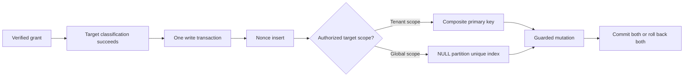

# MEMOS-008 nonce schema amendment

Approval status: CANDIDATE. This amendment is not implementation authority
until the owner approves it. The current request authorizes alignment to
design v0.9.9b; this document proposes the additional correction needed to
make its global nonce partition enforceable. Risk: HIGH; complexity: C-3.

## Parent and peer alignment

Design v0.9.9b sections 5.0.5, 5.0.8 and 5.0.9 remain the wire authority.
API-011 tenant-scoped replay behavior is unchanged. See
`../.brain/rca/MEMOS-008-global-nonce-schema.md` for reproduced evidence.
DEC-MEMOS-14 permits migration numbers to follow integration order.

## Proposed schema correction

1. Add `0013_grant_nonce_global_scope.sql` after phase 5 migrations 0011/0012.
   Rebuild only `grant_nonces`, copying all existing rows. Preserve the
   `tenant_id`, `nonce`, `expires_at` columns, composite primary key and
   expiry index; allow NULL in `tenant_id`.
2. Add a unique partial index on `nonce WHERE tenant_id IS NULL`. Non-NULL
   tenant rows retain their existing composite-key uniqueness. Global
   nonces use actual NULL, not a sentinel that a real tenant could equal.
3. Keep nonce insertion and the guarded mutation in one transaction.
   The domain helper maps both relevant uniqueness failures to
   `grant_replayed`; the nine principal-memory handlers still collapse that
   result to `not_found` as section 5.0.6 requires. Other SQL failures must
   not be mistaken for replay. Preserve bounded expiry pruning. Choose the
   NULL partition from the stored global vault type, never from optional
   tenant metadata in a global grant.
4. Never edit shipped migrations 0001-0010. Phase 6's provisional erasure
   receipt migration becomes 0014, before any additional phase 6 migrations.
   No schema changes or rewriting of existing rows in deployed systems are
   executed by approving this document; this task uses local databases only.

## Global-private mismatch clarification

Section 5.0.9 contains conflicting descriptions of a present mismatched
grant when the deployment flag is off. Its final explicit **always-on,
all-three-surfaces** rule takes precedence: a present invalid/mismatched
grant is refused with `vault_scope_denied` on memory operations, promotion
and status, regardless of the flag. An absent grant retains legacy behavior
when the flag is off. With the flag on, memory/promotion refuse an absent
grant; status omits the global vault without provisioning it. A valid
matching grant permits the ordinary operation. The flag stays default off.

## Acceptance and exit criteria

- Fresh database and populated-through-0012 migration succeed; existing
  tenant nonces and their expiry timestamps survive unchanged.
- Same NULL-partition nonce twice is refused; identical nonce strings in
  two different real tenants and the NULL partition do not collide.
- A nonce used by an API-011 request cannot be reused by an authorized
  principal-vault request in that tenant.
- A failed mutation leaves no consumed nonce; its honest retry succeeds.
- Expiry cleanup retains the existing bounded behavior.
- Grant-present wrong-agent cases are refused on all three global surfaces
  with the flag both off and on; missing-grant behavior matches the table
  expressed above, including no lazy global provisioning from denied status.
- Contract, migration, security suites and independent review pass before PR.

## CHANGELOG

| Version | Date | Status | Summary | Commit Hash | Agent |
|---|---|---|---|---|---|
| 0.1.1b | 2026-09-17 | candidate | Clarify transport error collapse and select nonce partition by authorized target scope. | working-tree | RWANG |
| 0.1.0b | 2026-09-17 | candidate | Propose enforceable global nonce partition and resolve contradictory global grant prose | bfe7c9d | RWANG |
